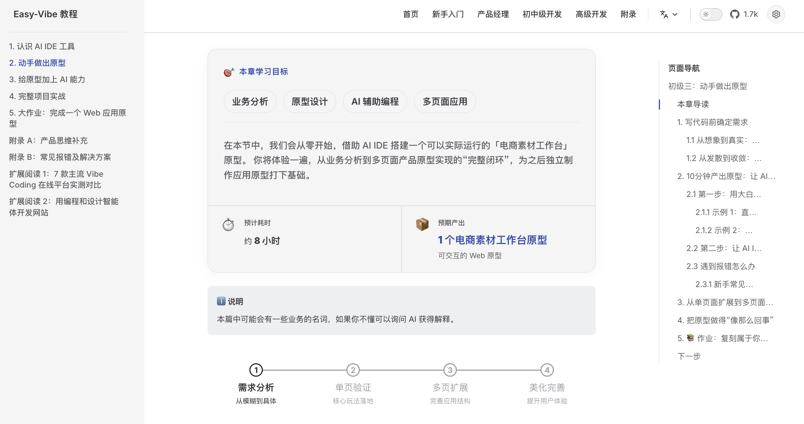
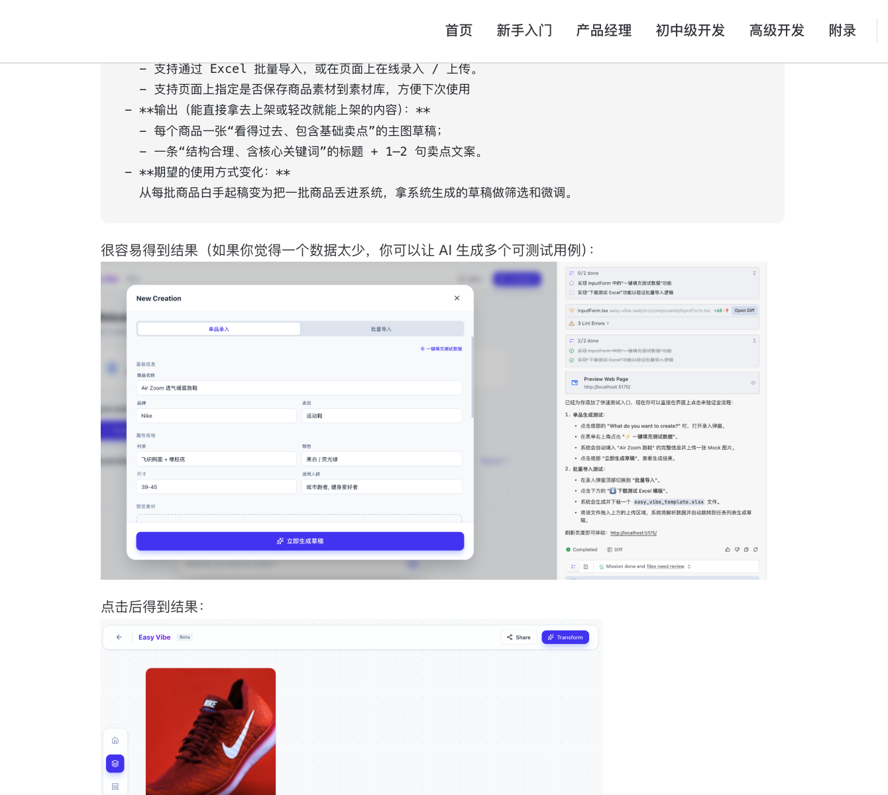
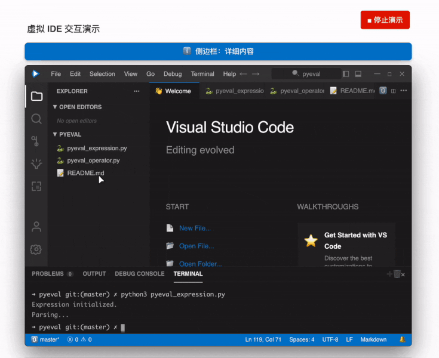
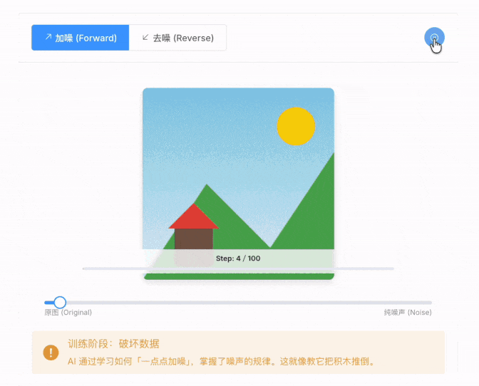
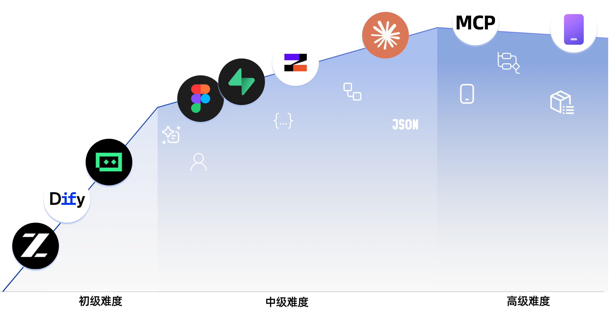

<div align="center">

# AI Skills

<p align="center" style="font-size: 1.2em; color: #666; margin: 20px 0;">
  Просто начните — если вы умеете говорить, вы умеете создавать приложения.
</p>

<p align="center">
  📖 <a href="#оглавление">Оглавление</a> · 🗺️ <a href="#навигация-по-материалам">Карта обучения</a>
</p>

</div>

<table align="center">
  <tr>
    <td width="50%" valign="top" align="center">
      
      <br>
      <strong>Понятная новичку карта обучения</strong>
      <br>
      <sub>Чёткий маршрут с нуля, чтобы не «учить и забывать»</sub>
    </td>
    <td width="50%" valign="top" align="center">
      
      <br>
      <strong>Пошаговые наглядные уроки</strong>
      <br>
      <sub>Подробные разборы — как будто учишься с личным наставником</sub>
    </td>
  </tr>
  <tr>
    <td width="50%" valign="top" align="center">
      
      <br>
      <strong>Иммерсивное симулированное программирование</strong>
      <br>
      <sub>Подсказки виртуальной мыши помогают быстро освоить рабочий процесс в IDE</sub>
    </td>
    <td width="50%" valign="top" align="center">
      
      <br>
      <strong>Наглядные принципы работы ИИ</strong>
      <br>
      <sub>Анимация показывает, как ИИ генерирует изображения</sub>
    </td>
  </tr>
  <tr>
    <td width="50%" valign="top" align="center">
      
      <br>
      <strong>Изучайте RAG как игру</strong>
      <br>
      <sub>Интерактивные компоненты проводят вас по всему потоку данных RAG</sub>
    </td>
    <td width="50%" valign="top" align="center">
      
      <br>
      <strong>Наглядные концепции терминала</strong>
      <br>
      <sub>Поведение командной строки становится понятным, когда логику видно</sub>
    </td>
  </tr>
</table>

## Оглавление

- [Зачем нужен AI Skills](#зачем-нужен-ai-skills)
- [Для кого это](#для-кого-это)
- [Ваши маршруты обучения](#ваши-маршруты-обучения)
- [Рекомендации по обучению](#рекомендации-по-обучению)
  - [I. Старт для новичков](#i-старт-для-новичков)
  - [II. Младшие и средние разработчики](#ii-младшие-и-средние-разработчики)
  - [III. Продвинутые разработчики](#iii-продвинутые-разработчики)
  - [База знаний (Приложение)](#база-знаний-приложение)
- [Как учиться](#как-учиться)
- [Запуск локально](#запуск-локально)

## Зачем нужен AI Skills

Нужен трекер расходов? Просто скажите об этом.

Нужна система бронирования с входом через мессенджер? Просто скажите.

Хотите блог с комментариями? Просто скажите.

В эпоху ИИ программирование начинается с описания того, что вы хотите.

AI Skills учит превращать это в настоящий продукт.

## Для кого это

- **Полные новички**: сначала соберите свой первый проект, а потом разберитесь, как он работает
- **Продакт-менеджеры / основатели**: быстро проверяйте идеи и собирайте MVP с минимальными затратами
- **Студенты**: развивайте практические навыки для эпохи ИИ
- **Младшие разработчики**: пройдите весь путь от идеи до запуска
- **Средние и старшие разработчики**: прокачайте рабочий процесс взаимодействия с ИИ для сложных проектов

## Ваши маршруты обучения

### 🎮 Хочу быструю первую победу
**Подойдёт**: всем
**Что изучите**: каково это — программировать с ИИ, на простом и конкретном практическом примере
**Что получите**: ясное первое впечатление от вайб-кодинга и работы с ИИ через диалог

[Начать здесь](https://libertad-harbour-llc.github.io/study_vibe/ru-ru/stage-1/ai-capabilities-through-games/)

### 💡 Хочу превратить идею в прототип продукта
**Подойдёт**: новичкам / продакт-менеджерам / основателям
**Что изучите**: маршрут обучения, инструменты AI IDE, проверку идей, прототипирование, интеграцию возможностей ИИ и итерации полноценного демо
**Что получите**: демонстрируемый прототип AI-продукта, который можно показать пользователям или команде

[Начать обучение](https://libertad-harbour-llc.github.io/study_vibe/ru-ru/stage-1/learning-map/)

### 🚀 Хочу делать фулстек-продукты от начала до конца
**Подойдёт**: младшим разработчикам / инди-хакерам / продвинутым ученикам
**Что изучите**: фронтенд-процессы, превращение дизайна в код, базы данных, бэкенд-API, развёртывание, биллинг и крупные проекты
**Что получите**: умение самостоятельно выпускать современные веб-приложения с ИИ

[Начать обучение](https://libertad-harbour-llc.github.io/study_vibe/ru-ru/stage-2/)

### AI-Native: хочу продвинутый Claude Code и процессы с агентами
**Подойдёт**: разработчикам, которым интересна AI-native инженерия
**Что изучите**: Claude Code, MCP, Skills, Agent Teams, долгие задачи, Spec Coding и доставку кроссплатформенных приложений
**Что получите**: более сильный рабочий процесс для сложной разработки с ИИ и автоматизации

[Перейти к продвинутой разработке](https://libertad-harbour-llc.github.io/study_vibe/ru-ru/stage-3/core-skills/basics/)

### 📚 Хочу справочные материалы и фундамент
**Подойдёт**: всем
**Что изучите**: основы информатики, базы фронтенда/бэкенда, инфраструктуру, принципы ИИ и инженерные практики
**Что получите**: долгосрочную справочную базу знаний, охватывающую 9 крупных областей

[Открыть базу знаний](https://libertad-harbour-llc.github.io/study_vibe/ru-ru/appendix/)

## Рекомендации по обучению

- Если вы новичок, продакт-менеджер или основатель — начните с [Этапа 1](https://libertad-harbour-llc.github.io/study_vibe/ru-ru/stage-1/learning-map/)
- Если хотите перейти от прототипов к фулстек-доставке — начните с [Этапа 2](https://libertad-harbour-llc.github.io/study_vibe/ru-ru/stage-2/)
- Если вам нужны продвинутые процессы Claude Code или кроссплатформенные проекты — переходите к [Этапу 3](https://libertad-harbour-llc.github.io/study_vibe/ru-ru/stage-3/core-skills/basics/)
- Если застряли на концепциях или не хватает базовых знаний — используйте [Базу знаний (Приложение)](https://libertad-harbour-llc.github.io/study_vibe/ru-ru/appendix/)

### Навигация по материалам

<div align="center">
  
</div>

### I. Старт для новичков

| Раздел | Ключевое содержание |
| :------ | :---------- |
| [Карта обучения](https://libertad-harbour-llc.github.io/study_vibe/ru-ru/stage-1/learning-map/) | Обзор всего пути обучения с пояснениями |
| [Эпоха ИИ: умеешь говорить — умеешь программировать](https://libertad-harbour-llc.github.io/study_vibe/ru-ru/stage-1/ai-capabilities-through-games/) | Первое знакомство с программированием на ИИ на примерах вроде «Змейки» |
| [Освойте инструменты ИИ-программирования](https://libertad-harbour-llc.github.io/study_vibe/ru-ru/stage-1/introduction-to-ai-ide/) | Как работают AI IDE и как собирать с ними простые локальные проекты |
| [Найдите хорошую идею](https://libertad-harbour-llc.github.io/study_vibe/ru-ru/stage-1/finding-great-idea/) | Как находить и проверять идеи продуктов, которые стоит делать |
| [Создайте прототип продукта](https://libertad-harbour-llc.github.io/study_vibe/ru-ru/stage-1/building-prototype/) | От требований к одностраничным и многостраничным прототипам |
| [Подключите возможности ИИ](https://libertad-harbour-llc.github.io/study_vibe/ru-ru/stage-1/integrating-ai-capabilities/) | Интеграция текстовых, графических и видео-возможностей ИИ |
| [Полноценный проект на практике](https://libertad-harbour-llc.github.io/study_vibe/ru-ru/stage-1/complete-project-practice/) | Смоделируйте реальные сценарии, соберите обратную связь и итерируйте проект |

#### Приложение: продуктовое и бизнес-мышление

| Раздел | Ключевое содержание |
| :------ | :---------- |
| [Продуктовое мышление и проектирование решений](https://libertad-harbour-llc.github.io/study_vibe/ru-ru/stage-1/appendix-a-product-thinking/) | Базовые фреймворки, чтобы пройти путь продукта от нуля к единице |
| [Сценарии применения ИИ в индустрии (B2B)](https://libertad-harbour-llc.github.io/study_vibe/ru-ru/stage-1/appendix-industry-scenarios/) | Как ИИ применяется в разных отраслях |
| [Идеи потребительских сценариев ИИ (B2C)](https://libertad-harbour-llc.github.io/study_vibe/ru-ru/stage-1/appendix-c-consumer-scenarios/) | Возможности продуктов в потребительском ИИ |

#### Приложение: исследование пользователей и валидация требований

| Раздел | Ключевое содержание |
| :------ | :---------- |
| [Где искать идеи: 3 источника для новичков](https://libertad-harbour-llc.github.io/study_vibe/ru-ru/stage-1/appendix-idea-sources/) | Постройте надёжный поток поиска конкретных продуктовых возможностей |
| [Двойной ромб: сначала правильное дело, потом — правильно](https://libertad-harbour-llc.github.io/study_vibe/ru-ru/stage-1/appendix-double-diamond/) | Структурный процесс от разрозненных идей к рабочему направлению |
| [Jobs to Be Done: что пользователь хочет сделать на самом деле](https://libertad-harbour-llc.github.io/study_vibe/ru-ru/stage-1/appendix-jobs-to-be-done/) | Анализ целей пользователя через реальные задачи, а не запросы фич |
| [The Mom Test: метод интервью для проверки спроса](https://libertad-harbour-llc.github.io/study_vibe/ru-ru/stage-1/appendix-mom-test/) | Как задавать лучшие вопросы и избегать ложноположительной обратной связи |

#### Приложение: технические решения

| Раздел | Ключевое содержание |
| :------ | :---------- |
| [Что делать при ошибках](https://libertad-harbour-llc.github.io/study_vibe/ru-ru/stage-1/appendix-b-common-errors/) | Частые проблемы вайб-кодинга и как их устранять |
| [Сравнение семи инструментов ИИ-программирования](https://libertad-harbour-llc.github.io/study_vibe/ru-ru/stage-1/appendix-articles/example0-1/vibe-coding-tools-snake-game-tutorial) | Сравнение основных платформ на практике |
| [Проектирование сайтов с помощью агентов](https://libertad-harbour-llc.github.io/study_vibe/ru-ru/stage-1/appendix-articles/example0-2/vibe-coding-tools-build-website-with-ai-coding-and-design-agents) | Совместная работа нескольких агентов на практике |

### II. Младшие и средние разработчики

#### Фронтенд

| Раздел | Ключевое содержание |
| :------ | :---------- |
| [Фронтенд 0: соберите своего агента для производства ассетов с Lovart](https://libertad-harbour-llc.github.io/study_vibe/ru-ru/stage-2/frontend/lovart-assets/) | Пакетная генерация визуальных ассетов с Nanobanana и Lovart и сборка агента для рисования |
| [Фронтенд 1: основы Figma и MasterGo](https://libertad-harbour-llc.github.io/study_vibe/ru-ru/stage-2/frontend/figma-mastergo/) | Путь от макетов к мышлению о готовом к реализации UI |
| [Фронтенд 2: ваше первое современное приложение — UI-дизайн](https://libertad-harbour-llc.github.io/study_vibe/ru-ru/stage-2/frontend/ui-design/) | Основы UI-дизайна современных интерфейсов |
| [Фронтенд 3: UI-гайдлайны и дизайн нескольких продуктов](https://libertad-harbour-llc.github.io/study_vibe/ru-ru/stage-2/frontend/multi-product-ui/) | Единые правила UI для согласованности и эстетики продуктов |
| [Фронтенд 4: красивые интерфейсы с LLM и Skills](https://libertad-harbour-llc.github.io/study_vibe/ru-ru/stage-2/frontend/llm-skills-beautiful/) | Промпты и плагины, чтобы ИИ создавал более выразительные интерфейсы |
| [Фронтенд 5: собираем «Портреты Хогвартса»](https://libertad-harbour-llc.github.io/study_vibe/ru-ru/stage-2/frontend/hogwarts-portraits/) | Интерактивный фронтенд-проект с ИИ-изображениями с нуля |
| [Фронтенд 6: из прототипа дизайна в код проекта](https://libertad-harbour-llc.github.io/study_vibe/ru-ru/stage-2/frontend/design-to-code/) | Превратите прототипы в работающий в браузере фронтенд-код |
| [Фронтенд 7: апгрейд UI с современными библиотеками компонентов](https://libertad-harbour-llc.github.io/study_vibe/ru-ru/stage-2/frontend/modern-component-library/) | Быстрее собирайте профессиональные интерфейсы с библиотеками компонентов |

#### Бэкенд

| Раздел | Ключевое содержание |
| :------ | :---------- |
| [Бэкенд 1: освойте Git и GitHub](https://libertad-harbour-llc.github.io/study_vibe/ru-ru/stage-2/backend/git-workflow/) | Основные операции контроля версий и совместная работа с Git |
| [Бэкенд 2: от базы данных к Supabase](https://libertad-harbour-llc.github.io/study_vibe/ru-ru/stage-2/backend/database-supabase/) | Основы реляционных БД и Supabase как современная BaaS-платформа |
| [Бэкенд 3: проектирование и разработка API](https://libertad-harbour-llc.github.io/study_vibe/ru-ru/stage-2/backend/ai-interface-code/) | ИИ помогает проектировать API, генерировать код и документацию |
| [Бэкенд 4: выпустите прототип продукта](https://libertad-harbour-llc.github.io/study_vibe/ru-ru/stage-2/backend/zeabur-deployment/) | Быстрое развёртывание фулстек-приложений в облаке |
| [Бэкенд 5: от IDE к CLI-инструментам ИИ-кодинга](https://libertad-harbour-llc.github.io/study_vibe/ru-ru/stage-2/backend/modern-cli/) | Процессы ИИ-кодинга в терминале для современной разработки |
| [Бэкенд 6: интеграция Stripe и других биллинг-систем](https://libertad-harbour-llc.github.io/study_vibe/ru-ru/stage-2/backend/stripe-payment/) | Добавьте монетизацию через платежи и биллинг |

#### Крупные проекты

| Раздел | Ключевое содержание |
| :------ | :---------- |
| [Крупный проект 1: первое фулстек-SaaS — сайт ИИ-копирайтинга](https://libertad-harbour-llc.github.io/study_vibe/ru-ru/stage-2/assignments/copywriting-platform-supabase/) | Рабочее пространство для маркетинговых текстов с входом, генерацией, биллингом и админкой |
| [Крупный проект 2: система онлайн-экзаменов и управления](https://libertad-harbour-llc.github.io/study_vibe/ru-ru/stage-2/assignments/exam-management-express/) | Онлайн-экзамены с генерацией вопросов, прохождением и инструментами админа |

#### Приложение: возможности ИИ

| Раздел | Ключевое содержание |
| :------ | :---------- |
| [ИИ 1: основы Dify и интеграция базы знаний](https://libertad-harbour-llc.github.io/study_vibe/ru-ru/stage-2/ai-capabilities/dify-knowledge-base/) | Создавайте ИИ-приложения с Dify и подключайте приватные базы знаний |

### III. Продвинутые разработчики

#### Ключевые навыки Claude Code

| Раздел | Ключевое содержание |
| :------ | :---------- |
| [Быстрый старт с Claude Code](https://libertad-harbour-llc.github.io/study_vibe/ru-ru/stage-3/core-skills/basics/) | Установка, настройка, основы и полезные команды |
| [Гайд по MCP в Claude Code](https://libertad-harbour-llc.github.io/study_vibe/ru-ru/stage-3/core-skills/mcp/) | Подключение Claude Code к GitHub, БД, API и другим сервисам через MCP |
| [Гайд по Claude Code Skills](https://libertad-harbour-llc.github.io/study_vibe/ru-ru/stage-3/core-skills/skills/) | Упакуйте экспертизу в переиспользуемые навыки |
| [Как заставить Claude Code работать над долгими задачами](https://libertad-harbour-llc.github.io/study_vibe/ru-ru/stage-3/core-skills/long-running-tasks/) | Проектируйте долгие задачи, чтобы инструменты работали до завершения |
| [Гайд по Claude Agent Teams](https://libertad-harbour-llc.github.io/study_vibe/ru-ru/stage-3/core-skills/agent-teams/) | Координируйте несколько экземпляров ИИ как настоящую команду разработки |
| [Claude Code Superpowers для инженерной разработки](https://libertad-harbour-llc.github.io/study_vibe/ru-ru/stage-3/core-skills/superpowers/) | Помогите ИИ выдавать инженерный код с TDD и лучшими практиками |
| [Лучшие практики рабочего процесса Claude Code](https://libertad-harbour-llc.github.io/study_vibe/ru-ru/stage-3/core-skills/workflow/) | Практики рефакторинга, код-ревью и ежедневной разработки |
| [Удалённая разработка с Claude Code на телефоне](https://libertad-harbour-llc.github.io/study_vibe/ru-ru/stage-3/core-skills/mobile-development/) | Используйте Claude Code за пределами десктопа и стройте удалённый процесс на мобильных |
| [Полный гайд по Claude Agent SDK](https://libertad-harbour-llc.github.io/study_vibe/ru-ru/stage-3/core-skills/claude-agent-sdk/) | Создавайте свои агентные процессы и встраивайте Claude в свои инструменты через SDK |
| [От вайб-кодинга к spec-кодингу](https://libertad-harbour-llc.github.io/study_vibe/ru-ru/stage-3/core-skills/spec-coding/) | Переход от спонтанных промптов к разработке по спецификации |

#### Кроссплатформенная разработка

| Раздел | Ключевое содержание |
| :------ | :---------- |
| [Как выбрать платформу для приложения](https://libertad-harbour-llc.github.io/study_vibe/ru-ru/stage-3/cross-platform/choose-platform/) | Сравните форматы приложений и выберите платформу по пользователям, сценариям и целям |
| [Соберите мини-апп для мессенджера](https://libertad-harbour-llc.github.io/study_vibe/ru-ru/stage-3/cross-platform/wechat-miniprogram/) | Разберитесь в экосистеме и выпустите фронтенд мини-приложения от шаблона до запуска |
| [Мини-апп с бэкендом](https://libertad-harbour-llc.github.io/study_vibe/ru-ru/stage-3/cross-platform/wechat-miniprogram-backend/) | Добавьте бэкенд-логику и базы данных, чтобы замкнуть бизнес-цикл |
| [Соберите Android-приложение](https://libertad-harbour-llc.github.io/study_vibe/ru-ru/stage-3/cross-platform/android-app/) | Разработка Android-приложения в современном нативном процессе |
| [Соберите iOS-приложение](https://libertad-harbour-llc.github.io/study_vibe/ru-ru/stage-3/cross-platform/ios-app/) | Разработка iOS-приложения и конвенции экосистемы Apple |
| [Соберите локальное PWA](https://libertad-harbour-llc.github.io/study_vibe/ru-ru/stage-3/cross-platform/pwa-local-app/) | Превратите сайт в настоящее приложение с офлайном, пушами и установкой |
| [ИИ-ассистент как расширение браузера](https://libertad-harbour-llc.github.io/study_vibe/ru-ru/stage-3/cross-platform/browser-ai-extension/) | Создайте расширение Chrome, которое суммирует любую страницу через облачный или встроенный ИИ |
| [Соберите десктоп-приложение на Electron](https://libertad-harbour-llc.github.io/study_vibe/ru-ru/stage-3/cross-platform/electron-voice-to-text/) | Приложение «голос в текст» на Electron для трёх платформ |
| [Быстро создайте и выпустите NFT](https://libertad-harbour-llc.github.io/study_vibe/ru-ru/stage-3/cross-platform/nft-minting/) | Напишите смарт-контракт с нуля, разверните его и выпустите свой NFT |
| [Соберите расширение для VS Code](https://libertad-harbour-llc.github.io/study_vibe/ru-ru/stage-3/cross-platform/vscode-extension/) | ИИ-ассистент проекта с шаблонами, чатом по коду и Q&A по нескольким файлам |
| [Соберите промышленное десктоп-приложение на Qt](https://libertad-harbour-llc.github.io/study_vibe/ru-ru/stage-3/cross-platform/qt-industrial-hmi/) | Создайте Qt HMI-систему реального времени с графиками, алертами и мониторингом |

#### Приложение: возможности ИИ

| Раздел | Ключевое содержание |
| :------ | :---------- |
| [Что такое RAG и как он работает](https://libertad-harbour-llc.github.io/study_vibe/ru-ru/stage-3/ai-advanced/rag-introduction/) | Системное понимание принципов RAG и типичных архитектур |
| [Средние и продвинутые процессы RAG с LangGraph](https://libertad-harbour-llc.github.io/study_vibe/ru-ru/stage-3/ai-advanced/langgraph-advanced-rag/) | Проектируйте многошаговые процессы и более продвинутые RAG-системы |

### База знаний (Приложение)

> Охватывая **9 крупных областей знаний** и **80+ интерактивных тем**, это приложение использует анимацию и визуальные компоненты, чтобы помочь интуитивно понять ключевые концепции — от основ информатики до переднего края ИИ.
>
> 👉 [Открыть полное приложение](https://libertad-harbour-llc.github.io/study_vibe/ru-ru/appendix/)

## Как учиться

- Читайте и практикуйте разделы, которые соответствуют вашему текущему уровню. Если застряли — не стесняйтесь задавать вопросы.

## Запуск локально

### Современный способ

В чате AI IDE — например, VS Code, Cursor или Trae — можно просто сказать:

```text
Помоги мне запустить этот проект локально.
```

### Традиционный способ

1. `npm install`
2. `npm run dev`
3. Откройте `http://localhost:3000` в браузере.
