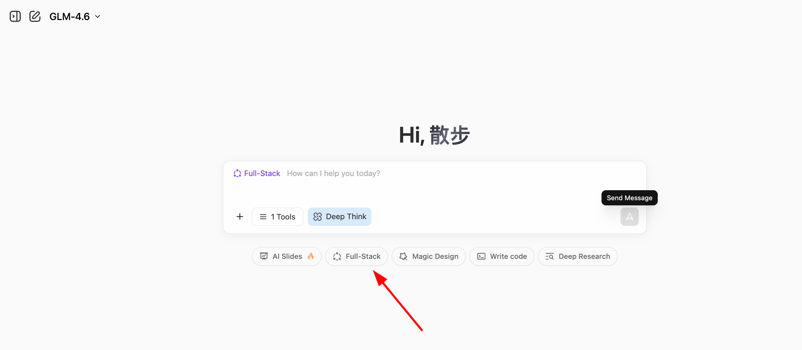
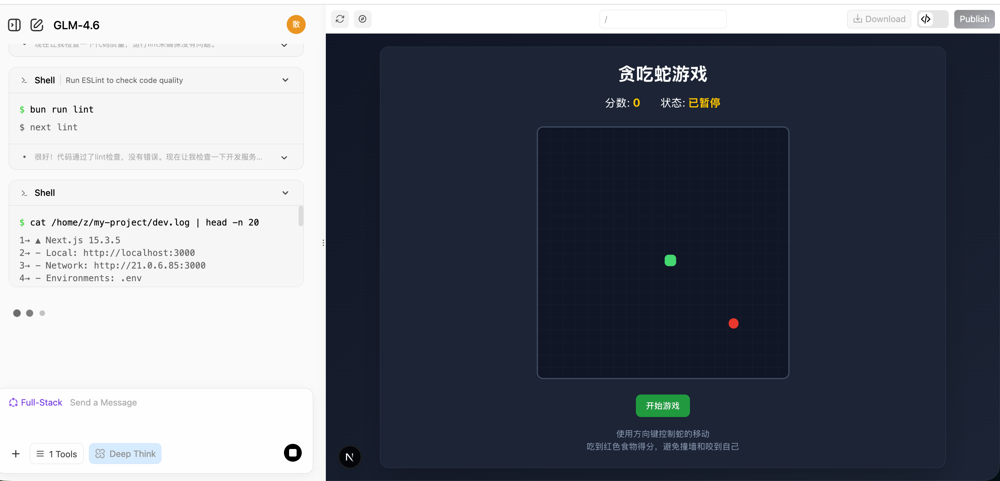
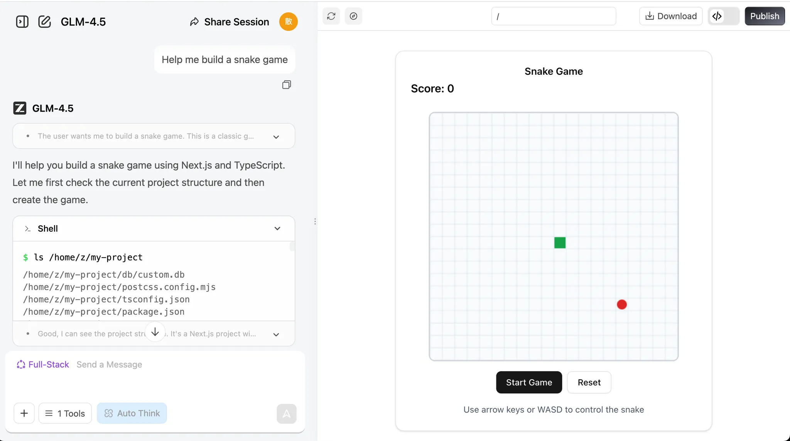

# Начальный уровень 1: В эпоху ИИ, если умеешь говорить — умеешь программировать

Это учебник по **проектно-ориентированному обучению**. Мы советуем вам шаг за шагом следовать инструкциям и постараться воспроизвести результаты.
Не бойтесь ошибаться или менять содержимое. Мы всегда верим, что у вас всё получится. Пожалуйста, всегда помните:

<div style="text-align: center;">
<div style="display: inline-block; padding: 8px 20px; border-radius: 8px; border: 1px dashed #FFB6C1; background: linear-gradient(135deg, #FFF0F5 0%, #FFE4EC 100%); margin: 12px 0;">
  <span style="font-size: 15px; font-weight: 500; color: #666;">Завершить важнее, чем сделать идеально 🐣</span>
</div>
</div>

<script setup>
const duration = 'Примерно <strong>4 часа</strong>, можно выполнить за несколько подходов'
</script>

## План главы

<ChapterIntroduction :duration="duration" :tags="['Диалоговое программирование с ИИ', 'AI-нативные мини-игры', 'Практика по игре «Змейка»']" coreOutput="AI-нативная «Змейка» + своя мини-игра" expectedOutput="1 играбельная AI-нативная «Змейка» + (по желанию) 1 своя AI-нативная мини-игра или демо на ваш выбор">

Если вы <strong>совсем не умеете программировать</strong> или знаете только основы, эта глава для вас. Мы начнём с самого начала: с помощью <strong>диалога</strong> заставим ИИ писать код за вас, без необходимости заучивать синтаксис или настраивать окружение. Всё будет работать прямо в вашем браузере.

Вы лично создадите <strong>свою первую работающую программу</strong> — игру «Змейка», которая умеет «есть слова, писать стихи и рисовать». Через эту практику вы прочувствуете, что на самом деле представляет собой программирование с ИИ: ИИ не заменяет ваше мышление, наоборот, вы озвучиваете свои идеи, а ИИ помогает их реализовать.

Любое творчество начинается с пути от 0 до 1. Мы рады передать вам каждую частицу уверенности и профессионализма. Для вас <strong>главное — действие</strong>.

</ChapterIntroduction>

<div style="margin: 50px 0;">
  <ClientOnly>
    <StepBar :active="0" :items="[
      { title: 'Трудности и возможности', description: 'Новые возможности для программирования' },
      { title: 'Исследование возможностей', description: 'Разработка за 60 секунд' },
      { title: 'Нативная практика', description: 'Создаём AI-нативную «Змейку»' },
      { title: 'Расширенное творчество', description: 'Создаём другие игры' }
    ]" />
  </ClientOnly>
</div>

## 1. Трудности и возможности для обычных людей

У многих в голове крутится куча идей продуктов: маленький инструмент для управления финансами, веб-страница для фиксации роста ребёнка или даже мини-игра. Но мысль о том, что придётся писать код или искать программиста, часто сразу всех отпугивает.

С появлением ИИ у обычных людей впервые возникла совершенно новая возможность: вам не нужно уметь писать код, нужно лишь научиться чётко объяснять ИИ, чего вы хотите. [Данные GitHub Copilot](https://www.wearetenet.com/blog/github-copilot-usage-data-statistics) показывают, что более 15 миллионов разработчиков используют ИИ-ассистируемое программирование, причём в среднем 46% кода генерируется ИИ! В Java-проектах эта доля может достигать 61%.

<el-card shadow="hover" style="margin: 20px 0; border-radius: 12px;">
  <template #header>
    <div style="display: flex; align-items: center; gap: 8px;">
      <span style="font-size: 20px;">🚀</span>
      <span style="font-weight: bold; font-size: 16px;">Скачок в эффективности и распространении</span>
    </div>
  </template>
  
  <el-row :gutter="20" style="margin-bottom: 24px;">
    <el-col :span="6" :xs="12">
      <div style="text-align: center; padding: 10px;">
        <div style="color: #409EFF; font-size: 24px; font-weight: bold;">55%</div>
        <div style="color: #909399; font-size: 12px; margin-top: 4px;">Рост скорости</div>
      </div>
    </el-col>
    <el-col :span="6" :xs="12">
      <div style="text-align: center; padding: 10px;">
        <div style="color: #67C23A; font-size: 24px; font-weight: bold;">2.4 <span style="font-size: 14px;">дня</span></div>
        <div style="color: #909399; font-size: 12px; margin-top: 4px;">Время на задачу (было 9.6)</div>
      </div>
    </el-col>
    <el-col :span="6" :xs="12">
      <div style="text-align: center; padding: 10px;">
        <div style="color: #E6A23C; font-size: 24px; font-weight: bold;">81%</div>
        <div style="color: #909399; font-size: 12px; margin-top: 4px;">Установка в первый день</div>
      </div>
    </el-col>
    <el-col :span="6" :xs="12">
      <div style="text-align: center; padding: 10px;">
        <div style="color: #F56C6C; font-size: 24px; font-weight: bold;">96%</div>
        <div style="color: #909399; font-size: 12px; margin-top: 4px;">Принятие предложений</div>
      </div>
    </el-col>
  </el-row>

  <div style="line-height: 1.8; color: #606266;">
    По-настоящему впечатляет скачок в эффективности: скорость выполнения задач разработчиками выросла на <b>55%</b>. Код, на доставку которого раньше уходило 9,6 дня, теперь можно сделать всего за <b>2,4 дня</b>. Это наглядное улучшение показывает, что ИИ больше не просто «опциональная фича», а становится незаменимым помощником в рабочем процессе разработки. Данные о принятии это подтверждают: в день получения доступа <b>81%</b> разработчиков сразу установили и начали им пользоваться; среди них <b>96%</b> в тот же день начали принимать предложения кода от ИИ. Иными словами, разработчики почти мгновенно встроили ИИ в свою повседневную рутину написания кода.
  </div>
</el-card>

Для обычных людей этот тренд имеет ещё большее значение: если профессиональные программисты так активно полагаются на ИИ для написания кода, **почему те из нас, кто не умеет программировать, не могут напрямую общаться с ИИ, чтобы воплотить свои идеи**?

Цель этого курса — помочь вам освоить новый навык: создание приложений через диалоги на естественном языке. Мы научим вас общаться с ИИ на языке компьютера и тому, как заставить ИИ превращать идеи из вашей головы в реальные, пригодные к использованию продукты.

<div style="margin: 50px 0;">
  <ClientOnly>
    <StepBar :active="1" :items="[
      { title: 'Трудности и возможности', description: 'Новые возможности' },
      { title: 'Исследование возможностей', description: 'Скорость за 60 секунд' },
      { title: 'Нативная практика', description: 'Создаём AI-нативную «Змейку»' },
      { title: 'Расширенное творчество', description: 'Создаём другие игры' }
    ]" />
  </ClientOnly>
</div>

## 2. Насколько ИИ способен вам помочь?

В этом разделе мы обсуждаем лишь один вопрос: если вы совсем не умеете писать код, насколько сегодняшний ИИ может вам помочь?

Грубо говоря, нынешние возможности LLM можно понимать так: они справляются с разработкой **простых внутренних инструментов**, **дашбордов визуализации данных** и некоторых **лёгких мини-игр**. Этого, как правило, достаточно, чтобы делать **инструменты для личного пользования** или проверять требования с точки зрения **продакт-менеджера**. Но чтобы в один клик сгенерировать **зрелый коммерческий продукт**, обычно всё ещё требуется ручная, непрерывная доработка **дизайна процессов** и **деталей**.

Далее давайте на примере «Змейки» посмотрим, чего именно можно добиться с помощью программирования с ИИ.

### 2.1 Создаём игру «Змейка» за 60 секунд

Сначала, пожалуйста, откройте экспериментальную площадку, используемую в курсе — [z.ai](https://chat.z.ai/). `z.ai` — это платформа ИИ, разработанная Zhipu AI (одной из ведущих китайских компаний в области LLM) на основе их собственных моделей GLM. Эта платформа включает различные функции, такие как генерация слайд-шоу, дизайн постеров и full-stack-разработка. В этом учебнике мы сосредоточимся на её модуле full-stack-разработки.

::: details 💡 Что такое парадигма «программирование прямо в вебе»?

Раньше для разработки веб-приложения требовалось:
- Устанавливать среды программирования (Node.js, Python и т. д.)
- Настраивать редакторы кода
- Изучать HTML/CSS/JavaScript
- Разбираться с зависимостями и ошибками

Теперь, с ИИ-платформами для программирования, вам нужно только:
- Открыть браузер и зайти на сайт
- Описать желаемые функции на естественном языке
- Дать ИИ мгновенно сгенерировать код и сразу посмотреть результат вживую

Эта парадигма «диалог как программирование» меняет программирование с «написания инструкций» на «описание требований». Вам не нужно заботиться о низкоуровневых технических деталях; достаточно чётко сказать, чего вы хотите. Это новая парадигма программирования эпохи ИИ — **Vibe Coding**.
:::



Введите наше простое требование и нажмите кнопку **Full-stack Development**. Вы сможете в реальном времени наблюдать, как строится веб-страница. Обычно на это уходит всего столько времени, сколько нужно, чтобы сварить кофе!

```
Помоги мне создать игру «Змейка»:
1. Управление движением змейки стрелками
2. Когда она ест еду, она удлиняется, а счёт увеличивается
3. Удар об стену или о саму себя приводит к Game Over
4. Должны быть кнопки Start и Restart
5. Интерфейс должен быть чистым и элегантным
```


После генерации справа вы увидите интерфейс веб-страницы, который можно просматривать. Прокрутите его или нажмите кнопку 🧭 наверху, чтобы посмотреть в полноэкранном режиме.

> Кнопки наверху слева направо: кнопка-стрелка раскрывает историю чата, кнопка-карандаш начинает новый чат, иконка обновления перестраивает страницу, иконка компаса переключает полноэкранный режим, кнопка скачивания загружает проект, кнопка <> показывает код, а кнопка Publish публикует его.



Если хотите посмотреть исходный код веб-страницы, нажмите иконку кода в правом верхнем углу, чтобы увидеть всю кодовую базу.


::: tip 🌐 Исследуйте больше инструментов для программирования с ИИ

Помимо z.ai, мы также рекомендуем попробовать эти отличные ИИ-платформы для программирования:

| Инструмент | Ссылка | Особенности |
|------|------|----------|
| **Google AI Studio** (рекомендуется)| [aistudio.google.com/apps](https://aistudio.google.com/apps) | Официальный инструмент от Google на базе Gemini, отлично подходит для быстрого прототипирования |
| **Figma Make** | [figma.com/make](https://www.figma.com/make) | Глубоко интегрирован с инструментами дизайна, идеален для интерактивных прототипов |
| **Coze** | [coze.com](https://www.coze.cn) | Платформа ИИ-ботов от ByteDance, визуальная сборка без кода |
| **v0.dev** | [v0.dev](https://v0.dev) | ИИ-генерация React-компонентов от Vercel |
| **Bolt.new** | [bolt.new](https://bolt.new) | ИИ для full-stack-разработки, способный генерировать развёрнутые приложения |
| **Lovable** | [lovable.dev](https://lovable.dev) | Высококачественная генерация React-приложений |
| **Replit Agent**| [replit.com](https://replit.com) | Онлайн-IDE с интеграцией ИИ |

Больше сравнений смотрите в приложении: [Сравнение 7 инструментов для программирования с ИИ](../../stage-1/appendix-articles/example0-1/vibe-coding-tools-snake-game-tutorial.md)
:::

### 2.2 Что диалоговое программирование может и чего не может

Этот раздел сосредоточен на конкретном вопросе: если опираться исключительно на диалоговый ИИ и вообще не писать код, как далеко можно продвинуть проект?
По опыту довольно устойчивый вывод таков: оно может помочь вам сделать что-то «маленькое, но завершённое», но определение того, «насколько этого достаточно», по-прежнему требует вашего личного решения на каждом детальном шаге.

#### Отлично справляется с «маленькими и понятными» приложениями

На примере «Змейки» вы уже увидели типичную закономерность:
если вы можете чётко описать интерфейс и взаимодействие, ИИ часто способен за несколько раундов диалога собрать полностью рабочую, кликабельную веб-страницу.

У таких задач обычно есть несколько общих черт:

- Ясный объём: одна страница, простой внутренний инструмент, небольшая игровая механика.
- Видимый результат: вы сразу видите, работает ли это, как ожидалось.
- Прямая отладка: вы можете легко указать на ошибки и попросить исправления.

В этих границах ИИ можно рассматривать как очень способного «младшего ассистента».

**Доля успеха ИИ при работе с задачами малого масштаба:**
<el-progress :percentage="90" :stroke-width="15" status="success" striped striped-flow />

#### Крупные проекты требуют «процессного взгляда»

Как только выходишь за рамки малого и понятного объёма, попытка построить сложные системы от начала до конца чисто на диалоговых запросах быстро упрётся в потолок. Крупные проекты имеют дело с серверными базами данных, сторонними сервисами, аутентификацией, правами доступа, краевыми случаями, управлением состоянием и т. д.

В таких ситуациях логичный подход — определить чёткую блок-схему процесса и разбить его на сегменты, чтобы обрабатывать каждый по отдельности.

#### Разница между генерацией и валидацией

То, что ИИ что-то написал, ещё не значит, что это готово к коммерческому запуску! Всегда проверяйте сгенерированный ИИ код, особенно в системах с требованиями к безопасности.

::: warning ⚠️ Рекомендации по использованию
- **Прототипы/Инструменты/Демо**: отлично подходят для ранних итераций сборки.
- **Крупные продукты, ориентированные на потребителя**: обычно нужны разработчики для архитектуры.
- **Системы с высокими требованиями к безопасности**: не подходят для немедленного развёртывания. Нужны строгие проверки.
:::

<div style="margin: 50px 0;">
  <ClientOnly>
    <StepBar :active="2" :items="[
      { title: 'Трудности', description: 'Новые возможности' },
      { title: 'Базовые умения', description: 'Скорость за 60 секунд' },
      { title: 'Нативная практика', description: 'Создаём AI-нативную «Змейку»' },
      { title: 'Расширение', description: 'Создаём другие игры' }
    ]" />
  </ClientOnly>
</div>

## 3. Практика: ваше первое AI-нативное приложение

Давайте немного попрактикуемся. Мы добавим в нашу игру несколько элементов нативной интеграции с ИИ.

### 3.1 AI-нативная «Змейка»

Вы можете просто дать такие промпты:

> **💡 Пример промпта:** Сделай мне игру «Змейка».
>
> 

> **💡 Пример промпта:** Сделай мне игру «Змейка», которая поддерживает:
> 1. Поедание разных слов и помещение их в коллекционную коробку.
>
> 

> **💡 Пример промпта:** Сделай игру «Змейка», которая поддерживает:
> 1. Я могу есть разные слова, собираемые в коробку.
> 2. Когда съедено 8 слов, LLM генерирует стихотворение, используя их.
> 3. Сразу после составления стихотворения вызывается API генерации изображений.
>
> 

Если столкнётесь с какими-либо проблемами, просто сделайте скриншот ошибки или расскажите боту, что не так, и он внесёт изменения.


### 3.2 Добавляем в игру новые функции

После реализации базового функционала можно попробовать добавить в нашу программу новые повороты! Если процесс поедания змейкой слов или символов кажется немного скучным, можно сделать так, чтобы змейка ела слова разных цветов и соответственно меняла свой цвет.

Также можно добавить спецэффекты для процесса «поедания» или ввести волшебные слова, запускающие особые эффекты — например, увеличивающие скорость или размер змейки. Ещё одна идея — заставлять модель генерировать стихотворение и изображение каждый раз, когда змейка ест слово, а не ждать, пока она съест восемь.

Если это кажется сложным, можно напрямую попросить помощи у языковой модели! Она может предложить креативные идеи, чтобы сделать вашу игру веселее. Попробуйте!

```
1. Механика «Слово открывает мир»
Каждый раз, когда змейка ест слово, LLM выполняет поэтическую ассоциацию с этим словом (например, «дерево» → «лес», «тень»), а модель изображений мгновенно генерирует маленькое произведение искусства для этого слова. Эти изображения постепенно складываются в уникальную, созданную игроком панораму, так что игроки «рисуют и пишут стихи» в каждой партии.

2. Геймплей «Поэтический пазл»
Каждое слово, которое ест змейка, запускает генерацию LLM короткого стиха, а модель изображений создаёт иллюстрацию. Эти стихи и изображения складываются, как части пазла, формируя в конце раунда совместное с ИИ стихотворение и картину.

3. «Волшебные слова» и «Ветви истории»
Особые «волшебные слова» (например, «ветер», «ночь», «сон») не только запускают генерацию поэзии LLM, но и меняют настроение или тему сцены — превращая стиль генерируемого изображения в ночную, грозовую или сказочную атмосферу.
Ветвящаяся история: LLM в начале задаёт тему или загадку (например, «осенние воспоминания»). Выбор слов игроком напрямую влияет на развитие истории и поэзии, при этом модель изображений в реальном времени обновляет фоны и визуал.

4. «Интерактивная генерация в реальном времени»
После каждого слова LLM генерирует строку диалога или описания; NPC в игре могут «говорить» с игроком, или окружение может соответственно меняться.
Облик змейки или препятствия в игре могут визуально меняться в зависимости от съеденных слов благодаря модели изображений.

5. «Создавай и делись»
Игроки могут сохранять и делиться своими созданными ИИ стихами и изображениями в конце сессии, демонстрируя своё уникальное «сотрудничество с ИИ».
Таблицы лидеров за «Самое красивое стихотворение + арт», «Самое креативное сочетание слов» и т. д. поощряют повторную игру и творчество.

6. Челлендж «Змейка из предложений»
Обратный режим: LLM задаёт строку поэзии или загадку, а игрок должен направлять змейку, чтобы есть слова по порядку и восстановить предложение. Поедание неправильного слова через модель генерации изображений запускает забавные или художественные последствия.

7. «Тематические уровни» и «Выбор стиля»
В начале игры игрок выбирает тему (например, «сказка», «научная фантастика», «танская поэзия»), и как LLM, так и модель изображений подстраивают выбор слов, стиль поэзии и визуал под неё, делая каждое прохождение свежим.

8. «Совместное творчество вживую»
Когда съедается особое слово, LLM может предложить игроку ввести фразу или выбрать стиль, а затем ИИ генерирует соответствующие стихи и иллюстрации, делая это настоящим совместным творчеством человека и ИИ.

9. «Пасхалки и достижения ИИ»
Определённые сочетания слов распознаются LLM как особые темы или внутренние шутки (например, «луна», «османтус», «берег реки»), запуская редкие стихи и иллюстрации, вознаграждающие исследование.

10. «Растущая история»
По мере роста змейки LLM генерирует непрерывную историю-стихотворение, а модель изображений создаёт бесшовный свиток или панораму, так что игрок одновременно «пишет, рисует и играет».
```

Кроме того, мы также можем попросить LLM напрямую сгенерировать для вас промпты уровня проекта. В предыдущем разделе мы писали промпт для «Змейки» сами. Теперь давайте попробуем заставить LLM сгенерировать промпт с общим каркасом и путём реализации (вы можете сгенерировать его прямо в z.ai).

Если хотите научиться писать более качественные промпты, посмотрите [Приложение по инженерии промптов](/ru-ru/appendix/8-artificial-intelligence/prompt-engineering).

> Я хочу, чтобы ИИ сгенерировал веб-игру «Змейка», и мне нужен более полный промпт, чтобы результат получился более впечатляющим и весёлым. Пожалуйста, сгенерируй соответствующий промпт. Текущая цель: создать игру «Змейка», реализующую функцию поедания разных слов для генерации поэзии, и она должна включать модуль генерации изображений.

Ответ z.ai будет выглядеть примерно так:


Мы можем использовать этот промпт, чтобы заново сгенерировать проект в режиме full-stack-разработки:


<div style="margin: 50px 0;">
  <ClientOnly>
    <StepBar :active="3" :items="[
      { title: 'Трудности', description: 'Новые возможности' },
      { title: 'Базовые умения', description: 'Скорость за 60 секунд' },
      { title: 'Нативная практика', description: 'Создаём AI-нативную «Змейку»' },
      { title: 'Расширение', description: 'Создаём другие игры' }
    ]" />
  </ClientOnly>
</div>

### 3.3 Попробуйте сделать другие мини-игры

Помимо «Змейки» мы можем дать волю воображению.

Создавайте всё, что хотим создать, и даже попробуйте всё сломать! А потом начнём заново!

```
1. Платформа галереи ИИ-искусства
   Описание: онлайн-галерея, демонстрирующая сгенерированные ИИ произведения, где пользователи могут загружать ИИ-арт, делиться им и комментировать.
   Функции: система пользовательских аккаунтов, загрузка и отображение работ, система рейтингов, просмотр по категориям, интеграция инструментов ИИ-генерации.
   Технические особенности: фронтенд на React/Vue, бэкенд на Node.js, база данных MongoDB, интеграция с API ИИ.

2. Архив ретро-игр
   Описание: сайт, отдающий дань уважения классическим играм, с историей игр, гайдами по геймплею и играбельными ретро-играми онлайн.
   Функции: база данных игр, отображение на временной шкале, онлайн-эмулятор, отзывы пользователей, функция коллекции игр.
   Технические особенности: адаптивный дизайн, реализация игр на WebGL/Canvas, RESTful API, аутентификация пользователей.

3. Трекер устойчивого образа жизни
   Описание: сайт, помогающий пользователям отслеживать и снижать углеродный след через эко-советы и сообщественные челленджи.
   Функции: персональный калькулятор углеродного следа, постановка целей, отслеживание прогресса, сообщественные челленджи, эко-база знаний.
   Технические особенности: визуализация данных, оптимизация под мобильные, социальные функции, push-уведомления.

4. Виртуальный кухонный ассистент
   Описание: платформа кулинарного руководства на базе ИИ, предоставляющая персонализированные рекомендации рецептов и пошаговые инструкции по готовке.
   Функции: база рецептов, распознавание ингредиентов, персонализированные рекомендации, кулинарный таймер, анализ питательности.
   Технические особенности: API распознавания изображений, ML-система рекомендаций, голосовое управление, видеоруководство в реальном времени.

5. Платформа открытия андеграундной музыки
   Описание: платформа музыкального стриминга, ориентированная на инди и начинающих артистов, предлагающая уникальный опыт открытия.
   Функции: музыкальный стриминг, профили артистов, персонализированные рекомендации, создание плейлистов, сообщественные отзывы.
   Технические особенности: аудиостриминг, алгоритмы рекомендаций, социальные функции, визуализация музыки.

6. Минималистичная система управления задачами
   Описание: инструмент управления задачами с дзен-эстетикой, ориентированный на простую и эффективную организацию задач.
   Функции: создание и категоризация задач, установка приоритетов, отслеживание прогресса, командное сотрудничество, аналитика данных.
   Технические особенности: минималистичный дизайн UI, drag-and-drop, синхронизация в реальном времени, кроссплатформенная совместимость.

7. Мастерская научно-фантастического письма
   Описание: платформа, предоставляющая творческие инструменты и вдохновение для писателей-фантастов, включая средства построения мира и инструменты развития персонажей.
   Функции: инструменты структуры истории, профили персонажей, шаблоны построения мира, статистика письма, обратная связь от сообщества.
   Технические особенности: редактор форматированного текста, визуализация данных, совместное редактирование, ИИ-помощь в творчестве.

8. Персональный граф знаний
   Описание: инструмент, помогающий пользователям строить персональные сети знаний, визуализируя и связывая различные идеи и информацию.
   Функции: создание и связывание узлов, система тегов, функция поиска, инструменты импорта/экспорта, визуальные диаграммы.
   Технические особенности: графовая база данных, алгоритмы визуализации данных, поддержка Markdown, синхронизация между устройствами.

9. Виртуальный ботанический сад
   Описание: интерактивная энциклопедия растений, где пользователи могут исследовать мир растений и создавать виртуальные сады.
   Функции: база данных растений, 3D-модели растений, симуляция роста, гайды по садоводству, витрина сообщества.
   Технические особенности: 3D-рендеринг, симуляция смены сезонов, интеграция AR, API распознавания растений.

10. Арена программистских челленджей
    Описание: онлайн-платформа соревнований для программистов с задачами по программированию различной сложности.
    Функции: челлендж-задачи, редактор кода, автоматическая проверка, таблицы лидеров, обучающие пути.
    Технические особенности: песочница для выполнения кода, система проверки в реальном времени, визуализация алгоритмов, функции социального обучения.
```

И... если вы любите играть в игры, давайте попробуем создавать игры вместе!

```
1. 3D-RPG в открытом мире
   Описание: фэнтезийная RPG с обширным открытым миром, квестами и развитием персонажа.
   Функции: цикл дня и ночи, динамическая погода, древа навыков, кооператив для нескольких игроков, система крафта.
   Технические особенности: Three.js или Babylon.js для 3D-рендеринга, серверная игровая логика, кастомизация персонажа, система сохранений.

2. Арена шутера от первого лица (FPS)
   Описание: динамичный многопользовательский FPS с различными игровыми режимами и картами.
   Функции: командный бой насмерть, захват флага, кастомизация оружия, рейтинговые матчи.
   Технические особенности: WebGL/Three.js для 3D-графики, сетевой код для многопользовательской игры, детекция попаданий, голосовой чат.

3. Шахматы с ИИ и многопользовательский режим
   Описание: полнофункциональная шахматная платформа с ИИ-соперниками и онлайн-матчами.
   Функции: уровни сложности ИИ, эндшпильные челленджи, турнирный режим, анализ повторов.
   Технические особенности: библиотека шахматной логики, WebSocket для матчей в реальном времени, рейтинговая система ELO, защита от читерства.

4. Маджонг онлайн для нескольких игроков
   Описание: традиционная игра в маджонг с онлайн-многопользовательским режимом и подсчётом очков.
   Функции: несколько наборов правил, приватные комнаты, рейтинговая система, функция повторов.
   Технические особенности: логика сопоставления плиток, многопользовательский режим в реальном времени, система лобби, отслеживание счёта.

5. Пошаговая стратегическая игра
   Описание: тактическая стратегическая игра с боем на сетке и управлением юнитами.
   Функции: кампания, схватка, улучшения юнитов, туман войны, многопользовательские сражения.
   Технические особенности: система перемещения по сетке, принятие решений ИИ, синхронизация ходов, система сохранения/загрузки.

6. Гоночная игра на время
   Описание: 3D-гоночная игра, ориентированная на заезды на время и рекорды трасс.
   Функции: несколько трасс, кастомизация машин, призрачные повторы, таблицы лидеров.
   Технические особенности: 3D-физика автомобилей, редактор трасс, система повторов, онлайн-таблицы лидеров.

7. Карточная боевая игра (построение колоды)
   Описание: стратегическая карточная игра, где игроки строят колоды и сражаются с соперниками.
   Функции: коллекция карт, построение колоды, рейтинговые матчи, сезонные события.
   Технические особенности: логика карточной игры, система подбора игроков, ИИ-соперники, анимации карт.

8. Королевская битва (2D вид сверху)
   Описание: 2D-королевская битва с видом сверху, сужающимися зонами игры и механикой лута.
   Функции: соло и командные режимы, разнообразие оружия, события внутри матча, таблицы лидеров.
   Технические особенности: многопользовательский режим в реальном времени, логика сужения зоны, система генерации лута, подбор игроков.

9. Хоррор на выживание (от первого лица)
   Описание: хоррор от первого лица с управлением ресурсами и механикой побега.
   Функции: атмосферные окружения, головоломки, ИИ врагов, несколько концовок.
   Технические особенности: динамическое освещение, звуковой дизайн, поиск пути врагами, система сохранений.

10. Музыкальная ритм-игра (3D)
    Описание: 3D-ритм-игра, где игроки попадают по нотам в такт музыке.
    Функции: несколько уровней сложности, редактор треков, поддержка пользовательских песен, таблицы лидеров.
    Технические особенности: анализ аудио, синхронизация с битом, 3D-дорожки нот, детекция тайминга ввода.
```

## 📚 Задание

<el-card id="assignment-card" shadow="hover" style="margin: 20px 0; border-radius: 12px;">
  <template #header>
    <div style="font-weight: bold; font-size: 16px;">🎯 Задание по главе: создайте свои первые AI-нативные мини-игры</div>
  </template>

  <p>
    В этом разделе вы шаг за шагом прошли весь путь от «диалоговой генерации Змейки» до «понимания мышления AI-нативного игрового дизайна». Следующие задания помогут вам превратить это понимание в реальные навыки.
  </p>

  <ol>
    <li>
      <strong>Полностью воспроизведите AI-нативную игру «Змейка»</strong>
      <ul>
        <li>Как минимум реализуйте: змейка может двигаться, поедание «еды» меняет её длину и счёт, а удар об стену или о саму себя завершает игру.</li>
        <li>В процессе воспроизведения попрактикуйтесь отправлять ИИ всё сразу — описание ошибки + сообщение об ошибке + ключевые фрагменты кода, прося исправить в «режиме новичка».</li>
      </ul>
    </li>
    <li>
      <strong>(По желанию) Создайте 1 оригинальную AI-нативную мини-игру или демо</strong>
      <ul>
        <li>Это может быть любой лёгкий геймплей с участием текста, изображений, музыки, ритма и т. д., например «есть слова, чтобы писать стихи», «ритмичное нажатие», «генеративный раннер» и т. п.</li>
        <li>Главное не яркая графика, а способность чётко сформулировать: с чем конкретно здесь помог ИИ и какую «трудную для ручного исполнения или нудную» часть он решил.</li>
      </ul>
    </li>
  </ol>

  <p>
    Это весь учебник! Возможно, вам понадобится около <strong>4 часов</strong>, чтобы пройти весь материал и построить собственную игру «Змейка». Не спешите — исследуйте, экспериментируйте и наслаждайтесь процессом. Если по пути вы встретите концепции, которые не совсем понимаете, рекомендуем заглянуть в соответствующие разделы приложения ниже.
  </p>
</el-card>

## Приложение

<el-card id="appendix-nav" shadow="hover" style="margin-top: 24px; margin-bottom: 24px; border-left: 5px solid #67C23A;">
  <div style="font-weight: bold; margin-bottom: 8px;">Навигация по приложению</div>
  <div style="color: #606266; font-size: 14px; line-height: 1.6; margin-bottom: 12px;">
    Здесь мы собрали некоторые базовые концепции, связанные с этой главой: если по ходу обучения у вас возникнут вопросы вроде «что такое фронтенд?» или «что вообще означает Vibe Coding?», вы всегда можете вернуться сюда и посмотреть.
  </div>
  <el-row :gutter="16">
    <el-col :span="12">
      <a href="#appendix-1" style="text-decoration: none; color: inherit;"><b>Приложение 1: Нужны ли нам знания фронтенда?</b></a><br/>
      <span style="font-size: 12px; color: #909399">Поймите, где фронтенд вписывается в приложение в целом, и узнайте, какие части «видимы».</span>
    </el-col>
    <el-col :span="12">
      <a href="#appendix-2" style="text-decoration: none; color: inherit;"><b>Приложение 2: Что же такое Vibe Coding</b></a><br/>
      <span style="font-size: 12px; color: #909399">Поймите ключевую идею «диалоговой разработки» и то, как сотрудничать с ИИ.</span>
    </el-col>
  </el-row>
  <el-row :gutter="16" style="margin-top: 10px;">
    <el-col :span="12">
      <a href="#appendix-3" style="text-decoration: none; color: inherit;"><b>Приложение 3: Контекст модели</b></a><br/>
      <span style="font-size: 12px; color: #909399">Поймите часто слышимые, но легко путаемые понятия, такие как «длина контекста».</span>
    </el-col>
    <el-col :span="12">
      <a href="#appendix-4" style="text-decoration: none; color: inherit;"><b>Приложение 4: Следование инструкциям</b></a><br/>
      <span style="font-size: 12px; color: #909399">Узнайте, почему модели иногда «не понимают» и как писать более чёткие инструкции.</span>
    </el-col>
  </el-row>
  <div style="margin-top: 12px; font-size: 12px; color: #909399;">
    Совет: вы можете нажать Ctrl/⌘+F для поиска по ключевым словам или скопировать непонятные абзацы в ИИ и попросить объяснить заново так, чтобы «понял полный новичок».
  </div>
</el-card>

## <span id="appendix-1">[Приложение 1: Нужны ли нам знания фронтенда?](#appendix-nav)</span>

::: tip 💡 Краткое резюме в одну строку
Вам не нужно писать код, но понимание базовых концепций помогает эффективнее описывать требования ИИ.
:::

<el-row :gutter="16" style="margin: 20px 0;">
  <el-col :span="12" :xs="24" style="margin-bottom: 16px;">
    <el-card shadow="hover" style="border-radius: 12px; height: 100%;">
      <template #header>
        <div style="display: flex; align-items: center; gap: 8px;">
          <span style="font-size: 20px;">👁️</span>
          <span style="font-weight: bold;">Фронтенд</span>
          <el-tag type="success" size="small">Видимое</el-tag>
        </div>
      </template>
      <div style="color: #606266; line-height: 1.8;">
        Всё, что пользователи могут <strong>видеть и нажимать</strong>
        <ul style="margin: 12px 0; padding-left: 20px;">
          <li>Заголовки страниц, текст, изображения</li>
          <li>Кнопки, поля ввода, выпадающие меню</li>
          <li>Игровые интерфейсы, эффекты анимации</li>
        </ul>
      </div>
    </el-card>
  </el-col>
  <el-col :span="12" :xs="24" style="margin-bottom: 16px;">
    <el-card shadow="hover" style="border-radius: 12px; height: 100%;">
      <template #header>
        <div style="display: flex; align-items: center; gap: 8px;">
          <span style="font-size: 20px;">⚙️</span>
          <span style="font-weight: bold;">Бэкенд</span>
          <el-tag type="info" size="small">Невидимое</el-tag>
        </div>
      </template>
      <div style="color: #606266; line-height: 1.8;">
        Обработка данных, выполняющаяся на сервере
        <ul style="margin: 12px 0; padding-left: 20px;">
          <li>Хранение очков пользователей</li>
          <li>Проверка учётных данных при входе</li>
          <li>Раздача содержимого уровней</li>
        </ul>
      </div>
    </el-card>
  </el-col>
</el-row>

### Трио фронтенда

Браузеры используют три вида «кода» для построения страниц:

<el-tabs type="border-card" style="margin: 20px 0;">
  <el-tab-pane label="🏗️ HTML - Скелет">
    <div style="padding: 10px;">
      <p><strong>Назначение:</strong> определяет, <strong>какие элементы</strong> есть на странице</p>
      <p><strong>Аналогия:</strong> структурный чертёж дома (где идут стены, двери и окна)</p>
      <el-card style="background: #f5f7fa; margin-top: 12px;">
        <pre style="margin: 0;"><code>&lt;button&gt;Click me&lt;/button&gt;
&lt;h1&gt;Title&lt;/h1&gt;
&lt;img src="photo.png"&gt;</code></pre>
      </el-card>
    </div>
  </el-tab-pane>
  <el-tab-pane label="🎨 CSS - Стиль">
    <div style="padding: 10px;">
      <p><strong>Назначение:</strong> управляет тем, <strong>как выглядят элементы</strong></p>
      <p><strong>Аналогия:</strong> внутренняя отделка дома (цвета, материалы, планировка)</p>
      <el-card style="background: #f5f7fa; margin-top: 12px;">
        <pre style="margin: 0;"><code>button {
  background: blue;
  color: white;
  border-radius: 8px;
}</code></pre>
      </el-card>
    </div>
  </el-tab-pane>
  <el-tab-pane label="⚡ JavaScript - Поведение">
    <div style="padding: 10px;">
      <p><strong>Назначение:</strong> делает страницу <strong>интерактивной</strong></p>
      <p><strong>Аналогия:</strong> электрические выключатели дома (реакции после нажатия)</p>
      <el-card style="background: #f5f7fa; margin-top: 12px;">
        <pre style="margin: 0;"><code>button.onclick = () => {
  alert('You clicked me!')
}</code></pre>
      </el-card>
    </div>
  </el-tab-pane>
</el-tabs>

### Как код становится страницей?

Когда вы открываете веб-страницу, браузер обрабатывает три вида кода по порядку:

**1. HTML — определяет структуру страницы**
Сначала браузер разбирает HTML, чтобы понять, какие элементы есть на странице (заголовки, абзацы, изображения, кнопки и т. д.) и их иерархические отношения.

**2. CSS — применяет стили**
Затем браузер применяет правила CSS, чтобы добавить этим элементам стили: цвета, размеры, позиции, отступы и т. д., делая страницу красивой.

**3. JavaScript — добавляет интерактивность**
Наконец, выполняется код JavaScript, чтобы «оживить» страницу: реагировать на клики, отправлять формы, проигрывать анимации и т. д.

**4. Рендеринг страницы**
Совместный результат всех трёх — это та веб-страница, которую вы в итоге видите.

### Современные фронтенд-фреймворки: от HTML к React/Vue

Представленные выше HTML, CSS и JavaScript — это «три кита» фронтенд-разработки, они являются основой всех веб-страниц. Но когда страницы становятся сложными, разработка напрямую на этой тройке может стать непростой: код становится трудно поддерживать, появляется много повторяющейся работы, а синхронизация данных хлопотна.

**Современные фронтенд-фреймворки** (такие как React, Vue, Angular) построены поверх HTML/CSS/JS, чтобы сделать разработку эффективнее:

**1. HTML/CSS/JS (базовый этап)**
Прямое манипулирование элементами страницы, подходит для простых страниц. Но по мере роста кода вся логика перемешивается и становится трудной для поддержки.

**2. jQuery (переходный этап)**
Упрощённые операции с DOM, делающие код лаконичнее. Но вам всё равно нужно вручную управлять состоянием страницы и находить соответствующие элементы для обновления при изменении данных.

**3. React/Vue (современный этап)**
Использует компонентный и управляемый состоянием дизайн:
- **Компонентность**: разбиение страницы на независимые, переиспользуемые модули (например, кнопки, карточки, навигационные панели)
- **Управление состоянием**: при изменении данных фреймворк автоматически обновляет соответствующий UI без ручного манипулирования

::: tip 💡 Простое понимание
- **HTML/CSS/JS** = базовые материалы (кирпичи, цемент, сталь)
- **React/Vue** = строительный каркас (предоставляет стандарты и инструменты для возведения зданий)

В эпоху программирования с ИИ вам не нужно глубоко осваивать каждую деталь фреймворков. Достаточно понимать их базовые концепции, и вы сможете описывать требования на естественном языке, чтобы ИИ генерировал код за вас.
:::

### В Vibe Coding

**Ключевой момент: вам не нужно писать код, нужно лишь уметь описывать.**

Поняв концепции фронтенда, вы можете описывать требования ИИ так:

> «Сделай на React страницу таблицы лидеров со списком очков справа. При клике по строке внизу показываются детали игрока. Стиль должен быть чистым и современным».

Если хотите глубже погрузиться в основы фронтенда вроде HTML, CSS и JavaScript, посмотрите [Приложение по основам веба](/ru-ru/appendix/3-browser-and-frontend/javascript-deep-dive). Чтобы узнать об эволюции фронтенд-технологий, посмотрите [Приложение по эволюции фронтенда](/ru-ru/appendix/3-browser-and-frontend/frontend-frameworks).

## <span id="appendix-2">[Приложение 2: Что же такое Vibe Coding](#appendix-nav)</span>

> 💡 Что такое Vibe Coding? Учёный в области компьютерных наук [Andrej Karpathy](https://karpathy.ai/) (один из сооснователей OpenAI, бывший руководитель ИИ в Tesla) ввёл термин **vibe coding** в феврале 2025 года. Это понятие относится к методологии программирования, опирающейся на LLM, **позволяющей программистам генерировать рабочий код, предоставляя описания на естественном языке, вместо ручного написания кода.**


Буквально Vibe Coding можно понимать как способ «разработки через разговор». Ключевое изменение в том, что вам больше не нужно писать код строка за строкой, искать синтаксис или самому отлаживать. Вместо этого вы напрямую описываете на естественном языке, чего хотите, например:

«Мне нужна страница входа с полем для ввода номера телефона и полем для ввода кода подтверждения».
«После успешного входа перенаправлять на главную страницу и показывать имя пользователя в правом верхнем углу».
«Дай мне простую игру «Змейка», которой можно управлять стрелками клавиатуры».

Большая языковая модель (LLM) автоматически переведёт эти описания в реальный, исполняемый код и сгенерирует соответствующие страницы, логику и структуры данных. Увидев результаты, вы можете предложить изменения на естественном языке, например «сделай кнопку больше», «смени фон на тёмный», «фиксируй очки и показывай таблицу лидеров», и ИИ продолжит корректировать реализацию согласно вашим требованиям.

В этом режиме вам не нужно сначала изучать язык программирования, прежде чем писать код. Вместо этого вы сосредотачиваете основную энергию на: чётком изложении того, что хотите сделать, оценке того, «что не так», после просмотра результатов, и затем предложении новых изменений. ИИ берёт на себя превращение этих высокоуровневых идей в конкретные реализации, значительно сокращая механическую, повторяющуюся работу по написанию кода.

Можете кликнуть здесь, чтобы узнать больше о vibe coding: [https://www.ibm.com/think/topics/vibe-coding](https://www.ibm.com/think/topics/vibe-coding)

Можете кликнуть здесь, чтобы посмотреть больше материалов, которыми поделился Karpathy: [https://karpathy.bearblog.dev/blog/](https://karpathy.bearblog.dev/blog/)

### Как притвориться мастером Vibe Coding

На практике, во время настоящего vibe coding, мы обычно не используем много сложных промптов. Возможно, в начале нам нужен конкретный и умеренно сложный промпт для всей программы, но после этого на каждом шаге вам могут понадобиться лишь промпты вроде этих:

```
"В коде есть баг, пожалуйста, исправь его."
"Мне не нужен частичный код, дай мне полный изменённый код."
"В твоём коде всё ещё есть проблемы."
"Пожалуйста, исправь ещё раз и дай мне полный исправленный код."
"Раньше работало, почему сейчас не работает?"
"Ты не понял, что я имел в виду? Не меняй мой исходный код."
"Не добавляй никакие отладочные функции."
"Не делай того, о чём я тебя не просил."
"Где функция, которую я просил реализовать?"
"Ты что, не можешь понять, что я говорю?"
"Мне нужна только одна функция."
"Я сказал тебе опираться на мой предыдущий код."
"Пожалуйста, не добавляй ненужные комментарии."
"Пожалуйста, не меняй базовую логику моего исходного кода."
"Помоги мне изменить код."
"Изменяй на основе моего кода..."
"Не меняй имена моих переменных!!!"
"Не меняй имена исходных функций!"
"Не трогай мои переменные."
"Не добавляй лишние функции."
"Не генерируй просто скелет, генерируй полный код."
```

Это может звучать немного утрированно, но в реальности это те промпты, которые мы можем использовать в повседневной работе. Из-за **ограничений длины контекста** больших языковых моделей, а иногда из-за того, что их **способность следовать инструкциям** не очень сильна, модели могут забывать содержимое, обсуждавшееся ранее в диалоге. В vibe coding мы склонны использовать модели с длинным контекстом и сильной способностью следовать инструкциям. Мы можем судить, хороша ли модель, по рейтингам или метрикам этих двух аспектов.

Кроме того, из-за стиля обучающих датасетов большие модели склонны отвечать в стиле своих обучающих данных. Например, некоторые говорят очень серьёзно, некоторые любят добавлять много прикрас, а некоторые модели любят добавлять в код много комментариев или ненужных модулей.

## <span id="appendix-3">[Приложение 3: Контекст модели](#appendix-nav)</span>

Контекст модели можно понимать как краткосрочную память ИИ. Он относится ко всему текстовому содержимому, которое модель может «видеть» и «помнить» в течение одного диалога или задачи, включая ваши предыдущие вопросы, предоставленные системой инструкции, релевантные материалы и т. д.

Именно благодаря контексту ИИ может понять, что вы продолжаете предыдущее содержимое, что обеспечивает раунд за раундом связного, естественного диалога. Без контекста каждое сказанное вами предложение выглядело бы для модели совершенно новым вопросом — она не знала бы, что вы говорили раньше, и не было бы способа продолжать диалог.

У каждой модели есть своя эффективная длина контекста (контекстное окно). Эта длина обычно измеряется в токенах (которые можно грубо понимать как единицы «фрагментов слов»), и большинство ведущих моделей сейчас находятся в диапазоне от 32k до 128k токенов. Чем длиннее контекст, тем больше содержимого модель может «прочитать» за раз, например:

- Прочитать целую длинную статью или отчёт за один раз
- Ссылаться на несколько материалов и кейсов в одном диалоге
- Заставить модель помнить выводы из сложных обсуждений несколько раундов назад

Когда ваш ввод приближается к пределу контекста модели или превышает его, часто проявляются некоторые типичные явления:

- Модель начинает забывать детали или ключевую информацию из ранней части длинного текста
- По мере развития диалога тема постепенно отклоняется от изначальной цели
- В разных вопросах-ответах об одном и том же материале упоминаемое содержимое становится противоречивым

Эти явления не означают, что модель внезапно «поглупела» — это естественные результаты исчерпания или почти исчерпания ёмкости контекста.

На практике мы хотим, чтобы контекст был как можно длиннее, осознавая при этом, что:

- Чем длиннее контекст, тем больше вычислительных ресурсов он потребляет
- Соответствующие затраты на API (плата) тоже соответственно растут

Поэтому при проектировании приложений ИИ нужно балансировать между тем, чтобы модель видела достаточно информации, и контролем затрат и повышением эффективности. Например:

- Дистиллировать информацию, которую действительно нужно сохранять надолго, прежде чем подавать её модели
- Избегать многократного запихивания в контекст детальной информации, которая больше не нужна
- Использовать внешние базы знаний и подобные подходы, чтобы передать «долгосрочную память» системе, а не насильно впихивать её в контекст модели

## <span id="appendix-4">[Приложение 4: Следование инструкциям](#appendix-nav)</span>

Следование инструкциям относится к тому, может ли модель после понимания ваших инструкций точно и полно выполнить их согласно вашим требованиям. Это включает не только ответы на вопросы, но и выполнение задач в заданных форматах, стилях и шагах.

Например, все следующие — это инструкции с чёткими требованиями к модели:

- Резюмируй эту статью в три ключевых пункта
- Напиши ответное письмо в формальном, вежливом тоне
- Переведи это слово на английский и составь по примеру предложения для каждого
- Извлеки из статьи автора, время и основные события

Модель с сильной способностью следовать инструкциям обычно обладает такими характеристиками:

- Выдаёт содержимое в требуемом количестве
  Например, если попросили резюмировать три ключевых пункта, она не даст пять.
- Охватывает все указанные элементы
  Например, если попросили извлечь автора, время и события, она не опустит ни один из них.
- Следует заданному формату и тону
  Например, если попросили использовать формальный тон, она не выдаст слишком разговорные ответы.
- Не делает ненужных дополнительных расширений
  Например, если попросили только перевести и составить предложения, она не выдаст большой абзац несвязанных пояснений.

В практических приложениях сильная способность следовать инструкциям очень важна по этим причинам:

- Повышенная стабильность: одна и та же инструкция выдаёт более согласованную структуру вывода и шаблоны поведения в разное время и при многократных запусках, реже отклоняется от сценария
- Повышенная воспроизводимость: когда вы встраиваете промпт в продукт или рабочий процесс, вы можете предсказать, как примерно ответит модель, что облегчает тестирование и итерации
- Более лёгкая системная интеграция: когда вывод модели соответствует ожидаемым форматам, его проще автоматически состыковать с бэкенд-программами, рабочими процессами или другими инструментами

Поэтому при выборе и оценке большой языковой модели, помимо внимания к тому, умна ли она и широк ли охват её знаний, нужно также уделять особое внимание её способности следовать инструкциям. Для приложений промышленного уровня способность стабильно и точно выполнять инструкции зачастую важнее, чем эпизодически выдаваемый потрясающий ответ.
