

# Продуктовое мышление и проектирование решений

## Обзор главы

<ChapterIntroduction :duration="duration" :tags="['Продуктовое мышление', 'Анализ требований', 'Проектирование решений', 'Понимание пользователя']" coreOutput="1 готовое продуктовое решение" expectedOutput="Практические идеи по дизайну продукта">

В предыдущих главах вы научились создавать различные небольшие инструменты в z.ai и локальных AI IDE и попробовали использовать Trae для решения инженерных задач, таких как настройка окружения и установка зависимостей. Теперь у вас есть возможность переносить идеи из браузера в локальные проекты.

Далее нам нужно сместить фокус с вопроса <strong>«можно ли это построить»</strong> на вопрос <strong>«что именно стоит построить и что вообще достойно того, чтобы быть построенным»</strong>.

В этом уроке мы систематически обсудим:
- Что считается «идеей» и что делает идею «хорошей»
- Как оценить, стоит ли вкладываться в то или иное продуктовое направление
- Как с помощью воспроизводимого процесса превратить смутное вдохновение в чёткое решение для приложения

<strong>Основная цель:</strong> Перейти от умения создавать инструменты к умению создавать AI-приложения, которыми люди действительно пользуются и которые приносят реальную ценность.

</ChapterIntroduction>

  <ClientOnly>
    <StepBar :active="0" :items="[
      { title: 'Источники идей', description: 'Найти надёжные продуктовые идеи' },
      { title: 'Разбор решения', description: 'Превратить идеи в работающие приложения' },
      { title: 'Доработка и оценка', description: 'От пригодного к отличному' },
      { title: 'Усиление с помощью AI', description: 'Использовать AI для создания ценности' }
    ]" />
  </ClientOnly>

## Чему вы научитесь

Если коротко, вы изучите основы создания приложения: откуда берутся идеи → как идеи превращаются в приложения → как приложения переходят от пригодных к отличным → как использовать AI в приложениях → как найти пользователей после завершения работы.

1. Я хочу создать приложение, откуда берутся надёжные идеи?
2. Когда у меня есть идея, как разбить её на то, что можно построить?
3. После того как я это построил, как оценить и довести это до «хорошего приложения»?
4. На каком шаге и как разумно использовать AI для усиления ценности?
5. Когда у меня есть приложение, как найти первую группу реальных пользователей с нуля?

# 1. Я хочу создать приложение, откуда берутся надёжные идеи?

Многие люди, когда речь заходит о создании приложения, первым делом думают: мне нужно придумать достаточно запоминающуюся креативную идею. Поэтому они каждый день просматривают рейтинги, читают отчёты, изучают различные популярные продукты, всматриваются в чужие истории успеха, надеясь однажды натолкнуться на особенно уникальную идею.

Но в реальности у многих людей вообще нет никаких идей, они просто тревожатся из-за того, что у них нет идей; некоторые с самого начала устанавливают очень высокую планку: если это недостаточно интересно — не начинай, считая, что обычное равно провалу. Но когда вы действительно пройдёте какой-то отрезок пути, вы обнаружите, что приложения, способные пройти далеко и устойчиво, в большинстве своём не придумываются во время какого-то ночного мозгового штурма, а вырастают понемногу в конкретных жизненных сценариях, вокруг реальных проблем.

Поэтому эта глава хочет решить проблему отправной точки: **Как мне получить идею? Надёжна ли эта идея? Стоит ли она вашего времени и сил, чтобы превратить её в реальное приложение?**

## 1.1 Что такое идея

Начнём с самого базового, но часто упускаемого вопроса: что именно считается идеей.

В повседневном разговоре то, что люди часто называют идеей, нередко представляет собой очень субъективное возбуждение. Вы можете увидеть видео на улице и мгновенно подумать, что это направление такое классное, и в голове всплывает фраза: я тоже могу сделать что-то подобное. Или в разговоре на вечеринке все жалуются на то, что какой-то продукт неудобен, и вы небрежно добавляете: вот бы было что-то, что могло бы автоматически делать всё это за меня. В этот момент у вас действительно есть смутная мысль, но до того, что можно сделать, ещё далеко.

Здесь давайте установим для себя чуть более строгий стандарт. Только когда мысль удовлетворяет хотя бы следующему, мы называем её идеей:

Во-первых, **она должна быть нацелена на чёткий тип пользователей**. Не расплывчато говорить «все», а уметь чётко сказать, для кого это в первую очередь. Это студенты вузов, новички в карьере, родители с детьми, или независимые разработчики, продавцы в электронной коммерции, владельцы малого бизнеса. Разные люди в одном и том же деле заботятся о совершенно разных вещах. Если вы даже не определили аудиторию, то все последующие суждения будут висеть в воздухе.

Во-вторых, **она должна быть укоренена в конкретном сценарии**. Когда пользователи используют это приложение, в утреннем метро по дороге на работу, во время перерывов, перед сном или на выходных при упорядочивании материалов. Даже на первый взгляд абстрактные инструменты, такие как заметки и управление задачами, если присмотреться, та часть, которая действительно используется часто, обязательно очень тесно привязана к определённым сценариям.

В-третьих, **она должна помогать пользователям выполнить чёткую задачу**. Задача не обязательно большая, но её должно быть возможно выразить. Например, упорядочить список дел на день, сжать длинную статью до нескольких ключевых пунктов, сгенерировать структурированный протокол для встречи или составить выполнимый маршрут для городской прогулки на выходных. Чем конкретнее вы можете сформулировать задачу, тем легче будет потом проектировать функции и оценивать ценность.

В-четвёртых, **она предоставляет лучший подход или инструмент, чем то, что есть сейчас**. Как пользователи изначально выполняли эту задачу — по памяти, бумажными записями, в Excel, коллекциями скриншотов или переключаясь туда-сюда между разными приложениями. Если вы можете предложить явно более лёгкий, более стабильный, более приятный способ, тогда эта идея действительно начинает иметь ценность.

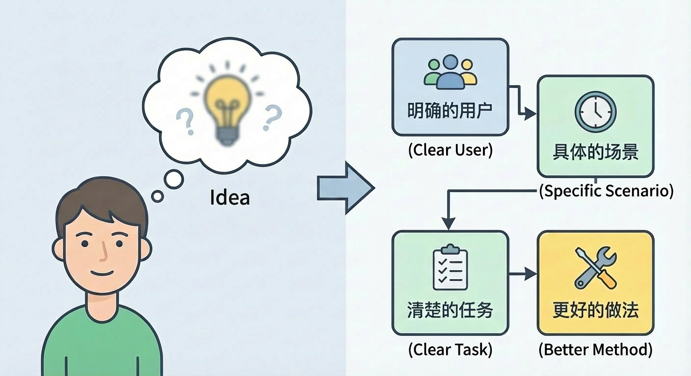

Если вы не можете чётко продумать вышесказанное, ничего страшного. Сейчас эра AI, вы можете организовать вышеуказанное содержание в полноценный промпт, затем записать ваши мысли, целевых пользователей и сценарии использования вместе и передать их большой модели, чтобы она помогла вам дополнить и доработать. Относитесь к модели как к всегда доступному партнёру по продукту, многократно ведите диалог, задавайте вопросы, вносите изменения — и вы сможете превратить смутную концепцию в нечто конкретное.

## 1.2 Идеи и потребности пользователей: первая линия обороны против самоудовлетворения

Многие люди, создавая приложение впервые, легче всего попадают в ловушку самоудовлетворения. Самоудовлетворение означает, что вы невероятно воодушевлены собственной креативной идеей, считая, что это направление перевернёт мир, но когда вы объясняете её обычным пользователям, их реакция часто спокойна, даже несколько растеряна — они просто вежливо кивают и говорят «звучит неплохо». Однако после запуска продукта они ни скачивают его, ни используют долгосрочно.

Чтобы избежать этой ситуации, вы должны отделить идеи от потребностей пользователей.

Сначала поговорим о том, что такое **потребности пользователей**. Это можно обобщить относительно простой фразой: в конкретном сценарии **различные издержки, которые пользователи хотят сократить, или различные ценности, которые они хотят увеличить, чтобы достичь определённой цели.** Издержки здесь включают не только деньги, но и время, силы, психологическую нагрузку, риск ошибки и даже социальное давление. Например, новичок, только пришедший в профессию, может быть готов потратить деньги на набор шаблонов, лишь бы меньше нервничать во время первого отчёта; родитель с детьми может быть готов заплатить немного больше, лишь бы гарантировать себе полчаса для себя каждый день.

Поняв это, вы обнаружите, что **чистая «крутость» не составляет потребности.** Многие креативные идеи действительно достаточно новы, но если они не делают пользователя более лёгким, более спокойным, более уверенным в достижении какой-то конкретной цели, то такому трудно поддерживать действительно устойчивое приложение.

Между идеями и потребностями есть часто упускаемый разрыв. **Идеи представляют ваше субъективное суждение, а не подкреплённое данными** — то, что вы считаете весёлым, интересным, выглядящим авангардно. Потребности представляют то, что пользователи действительно переживают и о чём беспокоятся. Вы можете считать, что функция автоматической генерации стихов очень крутая, но для большинства пользователей инструмент, который может экономить им десять минут в день на повторяющейся работе по упорядочиванию, может быть более привлекательным. Если только вы не как Джобс или не обладаете очень хорошим уровнем дизайнерского вкуса, чтобы заставить всех считать «функцию автоматической генерации стихов» очень крутой и спонтанно захотеть следовать за вами, — но это имеет определённую сложность.

При оценке мысли есть простой способ различить, больше ли она похожа на **реальную потребность или ложную потребность**. Чёткая характеристика реальных потребностей в том, что даже без вашего приложения сейчас пользователи активно пытаются решить эту проблему. Даже если текущий подход неуклюж, они всё равно готовы тратить время, силы и даже деньги, чтобы заполнить этот пробел. Например, некоторые люди сами пишут скрипты, лишь бы сократить себе часть повторяющегося труда. В этих сценариях, если вы можете предложить более дружелюбное, более универсальное решение, часто есть возможность закрепиться.

Типичная ситуация ложных потребностей прямо противоположна. Если вы не поднимете тему активно, большинство людей не осознают, что это проблема, и даже не почувствуют, что её обязательно нужно решать. Описываемые вами сценарии использования существуют скорее в вашем воображении, чем в повседневной жизни пользователей. Услышав ваше представление, они просто подумают, что эта штука хороша, довольно интересна, но не заплатят и могут даже отвернуться и забыть. Такие идеи годятся для написания историй, но очень опасны для создания продуктов.

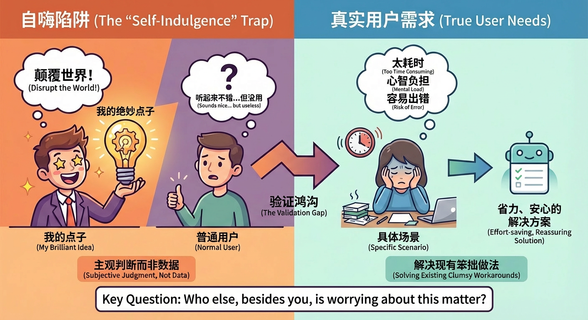

Итак, **первая линия обороны против самоудовлетворения — понимание потребностей пользователей.** С самого начала вам нужно заставить себя ответить на кажущийся простым, но очень критичный вопрос: кроме меня самого, кто ещё всерьёз беспокоится об этом деле. Вы можете пойти на форумы, в сообщества, в комментарии или прямо спросить нескольких людей вокруг себя, которые могут стать пользователями. Если вы редко слышите жалобы с настоящей эмоцией вроде «я каждый раз застреваю на этом» или «текущий подход действительно слишком хлопотный», то это значит, что эта идея всё ещё на некотором расстоянии от реальных потребностей.

## 1.3 Почему хорошие идеи являются хорошими идеями

Не у всех идей одинаковая судьба. Некоторые идеи, даже если вы потратите всего несколько дней на создание грубой, но работающей версии, естественным образом привлекут небольшую группу реальных пользователей, которые готовы остаться и терпеливо давать вам обратную связь. Другие идеи, даже если вы отчаянно наращиваете функции, тратите деньги на рекламу и проводите много продвижения на разных платформах, могут лишь ненадолго накопить какие-то данные за счёт внешней силы и вскоре снова уходят в тишину.

Самое существенное различие за этим — наступила ли сама идея на какую-то ключевую болевую точку.

**Хорошая идея естественным образом приветствует рост**: даже появившись в очень грубой форме, всего с несколькими простыми кнопками, пока она может решить конкретную небольшую проблему пользователей, она может достичь определённой степени естественного роста. Например, небольшой инструмент, который может быстро преобразовывать речь в текст, поначалу может быть просто веб-страницей с несколькими простыми кнопками, но пока качество распознавания достаточно хорошее, а преобразование функции особенно естественное, многие люди будут готовы пересылать ссылку друзьям, потому что это просто экономит им время.

**Плохая идея часто с самого начала обречена опираться на внешнюю силу**. Даже если ваш внешний вид особенно хорош, ядро выглядит особенно высокотехнологично, вам нужно постоянно проталкивать, постоянно кричать, постоянно объяснять, но как только ваши усилия по привлечению замедляются, данные использования сразу падают вниз. Вы продолжаете вкладывать ресурсы, привлекать партнёрства, проводить активности, но всё время чувствуете, будто идёте против течения. Проблема не в том, что вы недостаточно хорошо исполняли, а в том, что сама точка не попала в достаточно реальную боль.

Конечно, вышеуказанные ситуации не абсолютны. Например, на ранних рынках пользователи могут не сразу осознать ценность — это имеет некоторую задержку. Например, когда есть конкурирующие продукты, нам также нужно учитывать внешний вид, сложность управления, особенности бренда и т. д., но это более глубокое содержание, которое пока не рассматриваем.

Итак, когда мы обсуждаем, продолжать ли вкладываться в идею, нам действительно стоит сосредоточиться не на том, насколько броская сама креативность, а на том, может ли она естественным образом вырастить путь от проблемы к решению. Мы создаём идеи не просто чтобы доказать другим, насколько мы креативны, а чтобы найти ценную отправную точку, вдоль которой мы можем медленно отполировать небольшой инструмент в действительно полезное приложение.

Выбор важнее усилий.

## 1.4 Откуда берутся хорошие идеи: четыре источника и конкретные примеры

Многие люди, когда речь заходит о придумывании идей, представляют себе человека, застрявшего за столом, уставившегося в потолок, надеющегося, что однажды вдохновение внезапно упадёт и ударит его. Однако настоящие хорошие идеи в большинстве своём приходят не так. Они чаще приходят из небольших наблюдений в жизни, повторяющихся вопросов в сообществах, гор жалоб в интернете и постепенно отсеиваются из существующих продуктов.

Эти четыре источника ниже, если вы готовы серьёзно ими заниматься, легко позволяют выкопать направления, с которых можно начать.

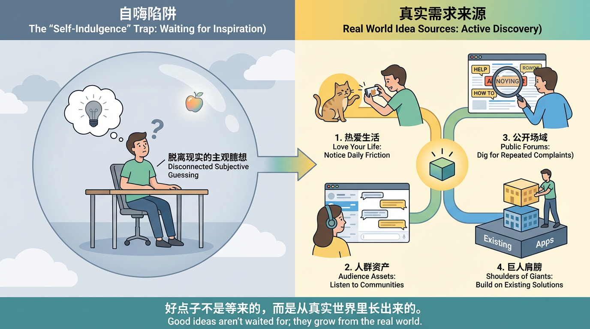

### Любите свою жизнь

Очень простой, но эффективный принцип: **чем больше вы вовлечены в жизнь, тем легче обнаруживать проблемы и тем более вы способны судить, какие проблемы стоит решать.** Так называемая вовлечённость означает, что вы не наблюдаете, как живут другие, через экран, а лично переживаете, пробуете и ошибаетесь. Чем серьёзнее вы относитесь к своим увлечениям, тем вероятнее они станут плодородной почвой для роста идей.

Например, если вы особенно любите держать кошек, один день, прожитый вместе с кошкой, часто имеет больше информационной ценности, чем прокрутка сотни «советов по содержанию кошек». Вы будете знать, где кошки чаще всего сбрасывают вещи, помнить, в какое время каждый день они наиболее активны, в каких ситуациях они легче всего испытывают стресс, и лично переживать детали вроде чистки лотка, расчёсывания шерсти, стрижки когтей и визитов к ветеринару. **Каждый чуть менее гладкий опыт на самом деле является потенциальной зацепкой для продукта.**

Например, фотографирование вашей кошки: многие люди сталкивались с ситуацией, когда вы держите телефон вверх, но кошка просто не смотрит в объектив — либо опускает голову, чтобы облизать лапы, либо уставилась в какой-то другой угол. Мог бы быть небольшой инструмент, который заставляет экран вашего телефона или планшета показывать автоматически движущуюся анимацию красной точки, перышка или жучка, специально привлекающую внимание кошки? Когда вы нажимаете кнопку съёмки, она автоматически машет около фронтальной камеры, «обманывая» взгляд кошки в сторону объектива, и заодно делает несколько кадров подряд, помогая вам выбрать чёткий и красивый. Если подумать на шаг дальше, это приложение могло бы также записывать, какой цвет и траектория движения наиболее интересны каждой кошке, в следующий раз автоматически используя её «эксклюзивный» режим дразнения, чтобы повысить процент успеха.

Если вам нравится макияж или уход за кожей, каждая бутылочка на вашей полке представляет много проб, ошибок и принятия решений. Возможно, вы уже привыкли фотографировать каждый образ макияжа в фотоальбом телефона, но каждый раз, оглядываясь назад, вам приходится понемногу вспоминать, какую помаду и какую палетку теней вы использовали в тот день. Можно ли систематически записывать эти фрагменты информации, чтобы создать собственную коллекцию образов макияжа? Приложение могло бы даже помочь вам подсчитать, какие образы макияжа вы используете чаще всего и в каких случаях, какие комбинации лучше всего выглядят на фотографиях, чтобы вам не приходилось каждый раз думать с нуля, выбирая макияж.

Более конкретно, у многих людей есть такой сценарий: утром времени мало, вы открываете альбом, желая найти «тот удачный макияж для работы в прошлый раз», но после долгой прокрутки всё равно не можете вспомнить, какие продукты вы на самом деле использовали. Мог бы быть небольшой функционал, где после съёмки фото с макияжем вы просто небрежно говорите телефону: «Сегодня макияж для собеседования, использовала палетку теней #01 оранжево-коричневую и помаду цвета бобовой пасты», и приложение автоматически распознаёт и генерирует «рецепт макияжа», привязанный к фотографии? В следующий раз вы просто ищете «собеседование», «оранжево-коричневые тени», «бобовая паста» — и сразу видите все связанные образы макияжа, и даже автоматически генерируете список рекомендаций «сегодня показать только подходящий для работы макияж, выполнимый за пять минут». Те несколько минут, которые вы экономите каждое утро, на самом деле являются очень конкретной «решённой проблемой».

Если вам нравятся городские прогулки или различные формы медленных путешествий, возможно, вы уже собираете свой опыт по кусочкам с помощью различных инструментов: картографическое ПО записывает маршруты, заметки перечисляют кафе для посещения, фотографии и мысли разбросаны по альбомам. Мог бы быть приложение, которое объединяет маршруты, точки чек-ина, фотографии и текст в журнал прогулок с временной шкалой и историей? Ещё дальше — поделиться своим маршрутом с друзьями одним нажатием, позволяя им пройти разные версии в том же городе.

Вы могли бы также углубиться в более повседневную деталь: у многих людей во время городских прогулок есть фрустрация «в моменте кажется, что этот уголок красив, но после возвращения домой совершенно невозможно найти это место на карте». Мог бы быть супер-лёгкий функционал: когда вы доходите до уголка, который кажется правильным, просто зажимаете кнопку наушника и говорите «отметить это, это дорога, подходящая для прогулок на свидании», и приложение мгновенно ставит голосовую метку в вашем текущем местоположении, автоматически записывая время, погоду и уровень шума. Позже вы или ваши друзья, просто открыв карту этого города, можете увидеть эти «протестированные пешеходами точки атмосферы»: где хорошо побыть в одиночестве, где хорошие ночные виды, где хорошо гулять и болтать с друзьями. Те маленькие перекрёстки, которые иначе были бы «забыты после того, как прошёл мимо», постепенно вырастают в фактурную базу данных городского опыта.

Эти примеры на самом деле хотят проиллюстрировать всего одну вещь: **вам нужно любить свою жизнь, жизнь — ваш лучший источник идей.** Каждая встреченная неразбериха, придуманные временные обходные пути, те места, которые вы считаете немного хлопотными, но которые терпите — пока вы готовы посмотреть чуть внимательнее, спросить, можно ли с помощью небольшого инструмента немного это изменить, все они имеют потенциал стать будущими прототипами продуктов.

### Копайте из своих активов-аудитории

Так называемые активы-аудитория, проще говоря, — это группа людей, до которых вы уже можете дотянуться. Это могут быть ваши читатели, сообщества, которыми вы управляете, внутренняя группа коллег вашей компании или сообщество по интересам, в котором вы давно участвуете. Пока у вас есть каналы, чтобы **стабильно слышать, о чём некоторые люди говорят, беспокоятся и чего ожидают каждый день**, у вас есть большое преимущество перед тем, кто начинает совсем с нуля.

Возьмём очень распространённый пример. Если вы организатор сообщества дизайнеров, то, что вы можете видеть в группе каждый день, на самом деле является чрезвычайно ценным резервуаром потребностей. Кто-то жалуется на клиентов, всегда многократно переделывающих макеты, кто-то недоволен способами оплаты на некоторых сайтах с материалами, кто-то считает, что слишком много времени уходит на подгонку между разными размерными спецификациями. За каждой жалобой скрывается потенциальная зацепка для продукта. Например, вы могли бы сделать простой инструмент адаптации размеров, который генерирует один дизайн в различные распространённые размерные пропорции платформ одним нажатием; или сделать небольшой инструмент, который может сохранять и повторно использовать распространённые компоненты, помогая дизайнерам выполнять повторяющуюся работу за меньшее время.

Если вы в сообществе по подготовке к экзаменам, группа может долго быть наполнена похожими темами: сегодня неважное состояние, план снова отложили, какие материалы читать эффективнее, как продолжать отмечаться. Вам не нужно придумывать из ничего, просто понаблюдайте некоторое время, упорядочьте несколько распространённых трудностей, неоднократно упоминаемых всеми, — и вы сможете примерно очертить начальное функциональное направление обучающего приложения: например, более разумная декомпозиция целей, более очеловеченная обратная связь по чек-инам, более реалистичная визуализация прогресса.

В этих сценариях вам не нужно с самого начала пытаться сделать большой и всеобъемлющий продукт для всех. Вам просто нужно признать одну вещь: этот небольшой круг людей в ваших руках — ваша лучшая отправная точка. Чем глубже вы их понимаете, чем больше вы знаете те высказанные и невысказанные маленькие неудобства в их реальной жизни, тем больше у вас возможности сделать что-то действительно используемое.

### Копайте потребности в общественных пространствах

Даже если у вас временно нет никакого собственного сообщества или группы читателей, совершенно не беспокойтесь. Каждый день бесчисленное множество людей в интернете громко рассказывают о своих трудностях и недовольстве на различных платформах. Эти голоса в общественных пространствах сами по себе являются огромной сокровищницей, просто большинство людей никогда серьёзно не прислушиваются.

Вы можете выбрать несколько платформ, связанных с интересующими вас отраслями, регулярно искать ключевые слова с эмоциональной окраской. Например, **так раздражает, есть рекомендации, как решить, действительно хлопотно, есть способ получше.** Затем терпеливо просматривайте те посты и комментарии, фокусируясь на двух типах информации.

Один тип — определённые проблемы, упоминаемые неоднократно в течение долгого времени. Например, в разделах о поиске работы то и дело кто-то приходит спросить, как написать резюме, как подготовить самопрезентацию, как отслеживать результаты собеседования; в родительских группах неоднократно появляется растерянность по поводу сочетаний прикорма, корректировки режима сна и общения с детьми; в сообществах обмена опытом малых предпринимателей все, возможно, всегда беспокоятся об управлении запасами, денежном потоке и составлении графиков сотрудников. Эти давно существующие повторяющиеся проблемы — системные болевые точки, неоднократно выявляемые отраслью.

Другой тип — в определённых сценариях пользователи едва справляются очень неуклюжими способами. Например, кто-то записывает все дела на бумаге, затем фотографирует, чтобы загрузить в облако; кто-то копирует и вставляет туда-сюда между разными приложениями, лишь чтобы преобразовать контент из одного формата в другой; кто-то вручную упорядочивает данные из разных каналов в одну таблицу. В этих местах, пока вы внимательно наблюдаете, вы найдёте много небольших участков, которые можно процедуризировать и инструментализировать.

Копание потребностей в общественных пространствах на самом деле тренирует способность: превратить себя из стороннего наблюдателя в ловца. Когда вы привычно ищете эти ключевые слова, привычно записываете случаи, ваш мозг будет постепенно накапливать набор чувствительности к реальным проблемам, и эта чувствительность будет снова и снова помогать вам в последующем процессе проектирования продукта.

### Стоя на плечах гигантов

Ещё один часто упускаемый источник идей — существующие продукты и проекты. Многие способные люди уже исследовали пути до нас. Вам не нужно каждый раз начинать с чистого листа. Вы можете встать там, куда другие уже дошли, и сделать ещё один шаг дальше.

В таких местах, как **хакатоны, конкурсы продуктовых инноваций и демо-дни стартапов**, появляется много интересных мини-проектов. Они часто разделяют две черты: сжатые сроки и ограниченные ресурсы. Это очень похоже на ситуацию вашего собственного приложения на ранней стадии. Поэтому, когда вы изучаете проекты-победители, задайте два вопроса: если бы этот продукт обслуживал только более узкий сегмент, легче ли бы он закрепился? Если бы половину или даже две трети функций обрезали, оставив только основной цикл, стал бы он понятнее?

Аналогично, инструменты, перечисленные в **рейтингах продуктов, проекты с открытым исходным кодом и каталоги инструментов** — всё это может быть отправной точкой для размышлений. Выберите несколько, которые вас интересуют, и разберите их один за другим: кому они помогают, какую проблему решают, какие явные пробелы остаются в текущей форме и что изменится, если перенести в другой сценарий или страну. Это не про копирование. Это практика понимания взаимосвязи между проблемами и решениями.

В офлайн-мире то же самое. Когда вы стоите в очереди на регистрацию в больницах, ждёте столик в ресторанах, заполняете повторяющиеся поля в государственных учреждениях или многократно пишете одну и ту же информацию на бумажных бланках, остановитесь и спросите: есть ли здесь место для **систематизации, цифровизации и автоматизации**? Беспорядочные, повторяющиеся, малоэффективные сценарии часто являются почвой, где вырастают будущие инструменты.

Если вы будете продолжать со временем добывать материал из этих четырёх путей, вы обнаружите, что идеи — это не внезапные чудеса. Это побочные продукты долгосрочного взаимодействия с жизнью, людьми и миром информации.

## 1.5 Сформулируйте хорошую идею одним предложением: искусство «меньше значит больше»

Когда вы примерно знаете, откуда берутся идеи, следующее ключевое упражнение — **попытаться объяснить вашу идею одним предложением.** Звучит просто, но это строго, потому что заставляет вас столкнуться с фактом: **действительно ли у вашей идеи есть чёткое ядро?**

Люди редко запоминают других за то, что те хороши во всём. Обычно они запоминают одну чёткую черту: фирменный стиль, стабильную манеру речи или одну ключевую фразу в обсуждениях. С продуктами то же самое. **Вместо того чтобы заставлять людей запоминать десять функций, дайте им сформировать одно простое, но чёткое впечатление.**

Распространённая ошибка при написании такого предложения — быть слишком широким. Например: «Это приложение, которое помогает пользователям улучшить английский». Кажется правильным, но почти ничего не говорит. Для кого оно: для начинающих, студентов или профессионалов? Как: тренировка лексики, аудирование, исправление произношения или проверка письма? Сколько усилий нужно и какого изменения можно ожидать? Вся ключевая информация размыта.

Лучшая версия гораздо конкретнее. Например: «Приложение для запоминания слов, которое помогает тем, кто ездит на работу, выучить 100 базовых слов за месяц по 10 минут в день». Это уже говорит как минимум три вещи: контролируемые издержки использования (10 минут ежедневно), видимый ожидаемый результат (100 слов за месяц) и чёткий сценарий (время в дороге). Пользователи могут быстро оценить, помогает ли это им.

Это упражнение на одно предложение на самом деле заставляет вас неоднократно отвечать на три вопроса: **кому именно вы помогаете, в каком сценарии вы хотите, чтобы они вспоминали о вас, и какого результата вы помогаете им достичь и за какое время.** Только когда вы готовы объединить эти детали, даже ценой красивых формулировок, ваша идея становится понятной и распространяемой.

Вы также можете применить эту тренировку к своему собственному будущему. Попробуйте написать одно предложение о ваших следующих трёх годах: кого вы в основном обслуживаете, какой тип проблемы решаете и какие видимые результаты вы произвели. Это помогает принятию решений: что нужно крепко держать, а что можно отпустить. Учиться отказываться часто труднее и правильнее, чем учиться добавлять.

Если вы не знаете, где научиться этому стилю, всё просто: каждый день читайте тексты, борющиеся за внимание пользователей. Изучайте **однострочные описания в магазинах приложений, главные заголовки на домашних страницах игр/инструментов и основные тексты на лендингах**. Копируйте их, анализируйте структуру и просите AI составить версию для вашей собственной идеи.

## 1.6 Используйте AI для расхождения мышления и поиска дифференциации

В прошлом генерация идей в основном опиралась на личное размышление. С AI вы фактически получаете партнёра по мозговому штурму по требованию. При хорошем использовании он может значительно расширить ваше пространство идей.

Когда вы застряли и лишь циклитесь между одними и теми же несколькими мыслями, опишите вашу текущую идею AI как можно яснее и попросите его помочь с конкретными задачами. Например: **для одной и той же основной задачи перечислите 20 разных групп пользователей**; или переосмыслите использование для студентов, фрилансеров, родителей и малых предпринимателей; или попросите AI ответить с точек зрения продукта, операций, маркетинга и инженерии.

Вы увидите сценарии, которые сами бы не придумали. Ваша задача — не принимать всё, а выбрать **ту небольшую область, где у вас более сильное понимание и преимущество в ресурсах**. Например, AI может перечислить много отраслей, но если вам больше всего откликаются сценарии образования и создания контента, отдайте приоритет более глубокой декомпозиции в этих направлениях.

Ещё один важный принцип: **распространённые идеи не обязательно являются несостоятельными идеями.** Многие новички пытаются избегать всего «распространённого», полагая, что если другие это сделали, шансов не осталось. Реальность более тонкая. Инструменты для запоминания слов, приложения для дел, ведение учёта и отслеживание привычек остаются популярными, потому что лежащие в основе проблемы реальны и устойчивы. В таких пространствах конкуренция часто не в том, «у кого совершенно новая большая идея», а в том, **кто лучше понимает конкретную подгруппу и исполняет детали ближе к их реальной жизни**.

Вы можете сначала перечислить типичные идеи новичков, такие как помощник по словам, приложение для ежедневных чек-инов, помощник по конспектам чтения, генератор резюме и инструмент формирования привычек. Затем для каждой из них проведите специальный разбор с помощью AI и задайте три вопроса:

- Если бы я обслуживал только очень конкретную группу (например, дизайнеров, юристов, молодых матерей, аспирантов), как бы эта идея выглядела иначе?
- Если бы я нацелился только на один фиксированный сценарий (поездка на работу, 10-минутный обеденный перерыв, 30 минут перед сном), могут ли функция и подача быть более сфокусированными?
- Если бы я оптимизировал доставку результата до предела (легче делиться, печатать или импортировать в другие системы), создало бы это само по себе дифференциацию?

Ценность AI здесь не в замене вашего решения, а в превращении узкой тропы в более широкую карту. Вы можете быстро увидеть, где другие уже глубоко укоренились, а какие уголки остаются относительно открытыми. Но окончательный выбор пути всё равно возвращается к старому вопросу: где вам действительно небезразлично, что вы действительно понимаете и куда готовы вкладываться долгосрочно?

И снова одна базовая истина: всё обсуждение идей и креативности должно в конечном счёте вернуться к потребностям пользователей. AI может ускорить генерацию вариаций, но после любого числа раундов мозгового штурма окончательный критерий остаётся: действительно ли эта идея отвечает на реальную боль конкретной группы и продвигает ли она на шаг вперёд проблему, которую они уже неоднократно пытаются решить?

## Итоги

Используйте простые измерения, чтобы проверить, достаточно ли ясна идея. Отличайте то, что вы считаете крутым, от того, что пользователям действительно нужно. Понимайте, что хорошие идеи хороши потому, что они рано попадают в реальную болевую точку. Учитесь постоянно добывать зацепки из вашей жизни, ваших достижимых групп, публичной информации и существующих продуктов. Практикуйте объяснение вашей идеи одним предложением. Относитесь к AI как к партнёру для расширения мышления, а не как к инструменту для замены суждения.

Когда у вас уже есть от одной до трёх таких идей, и вы можете **описать каждую одним предложением** (кого она обслуживает, в каком сценарии, с каким ожидаемым результатом), перестаньте гнаться за новыми идеями и переключите внимание на следующий шаг: как разбить одну из них в продукт, который действительно можно построить и которым действительно будут пользоваться реальные пользователи.

А что, если идея сырая? Это нормально. Сырая в начале — это норма. **Сделанное всегда важнее идеального.** Вам нужно начать, прежде чем у вас может появиться завершение.

## 📚 Задания

Пожалуйста, выполните следующее на основе вышеизложенного содержания:

1. Объедините свои интересы и используйте AI для генерации нескольких идей приложений.
2. Попросите AI оценить, является ли каждая идея реальной или ложной потребностью, и предоставить инсайты о потребностях плюс предложения.
3. Выберите один или два из четырёх источников (или попросите AI сгенерировать больше идей) и извлеките идеи.
4. Из всех идей выше выберите три любимых и обобщите каждую одним насыщенным информацией предложением.

# 2. Когда у вас есть идея, как разбить её в приложение, которое действительно можно построить?

В предыдущей главе мы решили начальный вопрос: какая идея достойна того, чтобы отнестись к ней серьёзно.

Настоящий вызов начинается сейчас. Многие люди терпят неудачу здесь: в их голове чертёж кажется завершённым, но как только они начинают, кажется слишком сложным, чтобы начать. Слишком много функций, слишком много страниц, пугающего вида технологический стек. Поэтому они откладывают и в конце концов утешают себя:

> «Ничего страшного, может, я когда-нибудь это построю...»

Не откладывайте. Начните сейчас. Эта глава учит практическому методу декомпозиции от идеи к версии, которую можно построить. Вы увидите, что переход от нуля к единице зависит не от гениальности, а от воспроизводимой последовательности действий: **расходиться, сходиться, декомпозировать, уточнять, сравнивать с образцом, спрашивать.** Следуя этому порядку, даже без команды или обилия времени, вы можете превратить идею в работающее демо приложения.

## 2.1 От идеи к решению: используйте «двойной бриллиант» от расхождения к схождению

После того как вы начнёте набрасывать идеи, быстро появляется ещё одна распространённая проблема: слишком много идей. Вы пишете много сценариев и функций на доске, рисуете много вариантов страниц, и это кажется продуктивным. Но когда нужно строить, становится труднее, потому что всё выглядит важным.

Вот здесь помогает классический и простой фреймворк: «двойной бриллиант» (Double Diamond). Его смысл прост: на многих этапах вы должны сначала расходиться, затем сходиться, а не пытаться завершить всё сразу с самого начала.

### Что такое «двойной бриллиант»?

«Двойной бриллиант», предложенный Британским советом по дизайну (UK Design Council), описывает инновации/дизайн как два соединённых ромба.

- Первый ромб идёт от обнаружения проблем к определению чёткой проблемы. Он подчёркивает сначала широкое исследование и понимание пользователя, затем схождение к реальной основной проблеме.
- Второй ромб идёт от разработки решений к доставке решений. Он начинается со смелого исследования возможных подходов и прототипов, затем сходится через выбор и доработку наиболее осуществимого варианта.

Его основной принцип: и «фаза проблемы», и «фаза решения» должны пройти через **расхождение -> схождение**. Это предотвращает слишком ранний переход к решениям и повышает качество инноваций и вероятность успеха.

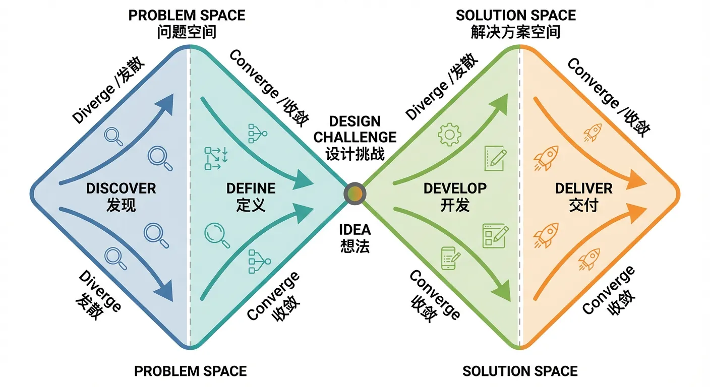

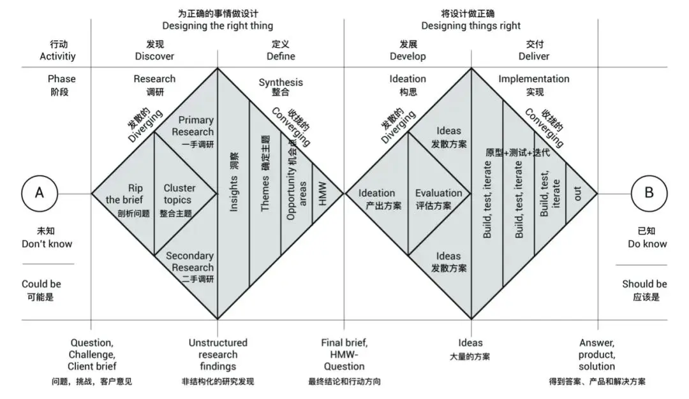

### Первый ромб: понять проблему (расходитесь от точки, сходитесь к ядру)

**В «двойном бриллианте» первый ромб посвящён самой проблеме.** Вы начинаете с размытого понимания, расходитесь в связанные ситуации и возможности, затем сходитесь к одной проблеме, которую стоит решить в первую очередь.

Для вашего приложения это означает:

- В расхождении перечислите как можно больше возможных пользовательских сценариев, трений и желаемых результатов. Пока не судите; распространите все релевантные мысли.
- В схождении заставьте себя выбрать один или два самых частых и болезненных сценария.

Например, в приложении для обработки документов вы могли бы перечислить сценарии вроде поездки на работу, подготовки перед встречей, подготовки перед написанием отчёта и разбора результатов. Вы можете перечислить опасения, такие как неточные резюме, беспорядочная структура или упущенные ключевые моменты. Пользователи могут хотеть быстро понять, о чём говорится в длинном документе и какие части относятся к ним.

Затем в схождении, если самая повторяющаяся боль — «получение длинного рабочего документа и необходимость быстро ухватить основные выводы», определите цель первой версии как: помочь пользователям понять основной смысл одного длинного документа за пять минут, а не решать все связанные с документами проблемы сразу.

В конце первого ромба вы должны чётко знать **какую именно проблему вы решаете и почему её приоритет выше, чем у окружающих проблем.**

### Второй ромб: спроектировать решение (от сырых идей к выполнимому плану)

**Второй ромб посвящён генерации решений.** После того как вы знаете целевую проблему, сгенерируйте как можно больше подходов, затем отфильтруйте для лучшей первой версии.

В расхождении здесь продолжайте добавлять возможности: больше функций, более тонкие сценарии, возможные паттерны взаимодействия. Для суммаризации длинных документов вы могли бы представить разную детализацию резюме, разные форматы вывода, опциональное голосовое воспроизведение, поддержку пользовательских выделений, несколько стилей резюме и т. д. Немедленное решение не требуется.

В схождении используйте простую практическую призму оценки:

**Ценность для пользователя x Осуществимость x Затраты времени**

Оцените идеи примерно (например, по шкале 1–5 по каждому измерению) и отдайте приоритет высокому суммарному баллу с контролируемыми затратами времени в качестве компонентов MVP.

Например, голосовое воспроизведение может иметь приличную ценность, но более высокую стоимость интеграции; резюме в виде простого текста плюс извлечение ключевых пунктов могут давать схожую ценность с большей осуществимостью и меньшими затратами времени, поэтому они лучше подходят для первой версии.

Постоянно напоминайте себе: **цель первой версии — не идеальный продукт, а реально пригодная версия.** Ей не нужно всё; ей нужно достаточно хорошо справляться с одной конкретной задачей.

Вы можете добавить временную границу, например доставить пригодную версию в течение одного месяца. Тогда любая идея, требующая нескольких месяцев, может попасть в список «на потом». Это предотвращает ранний застой, вызванный чрезмерной амбициозностью.

Как только вы привыкнете организовывать с помощью «двойного бриллианта», запутанное мышление становится яснее. Вы знаете, когда мыслить широко, а когда решительно отсекать. Вы перестаёте пытаться решить все проблемы одним махом и учитесь переключаться между расхождением и схождением.

## 2.2 Get Executable Steps: Learn to Go from Abstract to Concrete

Getting ideas is easy after divergence; getting executable steps is hard. Statements like “I want an efficiency tool” or “I want an app for creators” sound grand, but provide little execution help. Daily execution is always concrete: **which small part to build first, which pages are required**, whether login is needed, whether payment is needed.

The key ability here is **decompose and refine**: turning abstract goals into minimum actionable items you can execute immediately. This matters not only in product work but in life as well.

### Start with a Life Example: What Does “I Want a Burger” Really Mean?

Take a simple example: “I want a burger.” It sounds trivial, but if decomposed, many branches emerge.

First is **motivation and core inner need**. Do you really want burger taste, a quick meal, social time with friends, or just reacting to an image? This affects choices. If social, environment matters; if rushed, speed matters more than flavor.

Second is **action scope**. What burger type, what time, standalone or combo (drink/fries/dessert), how full do you want to be, maybe even buy extra for tomorrow breakfast.

Third is **execution path**. Dine-in, delivery, or home-made. Each implies different action chains: route/time for dine-in; platform/price/time comparison for delivery; ingredients/tools/recipe for home cooking.

After decomposition, “I want a burger” becomes concrete executable steps: open delivery app, search a known store, choose a combo, remove drink, add no-sauce note, place order. Tiny actions, but immediately executable. AI can also turn such decomposition into a programmable plan.

**That is exactly why decomposition/refinement matters: it moves from abstract desire to concrete executable list.**

### App Example: Where to Start for “Improve Document Processing Efficiency”

Now a layered product example: “I want to build an app that improves document-processing efficiency.” Direction is valid, but if you stop there, you cannot start. You do not know first page to draw, first version scope, or how to explain your concept.

Use the same decomposition method step by step. Due to scope, we demonstrate two layers.

#### First-Layer Decomposition

First, define **what “document” means**. It can be spreadsheets, Word reports, PDFs, Markdown notes, TXT files, scanned image-based documents, even papers with charts/formulas. Different document types imply different processing methods. If image-based, OCR may be required first. If spreadsheet-oriented, data extraction/analysis may be core.

Second, define **what “processing” means**. Processing into what state counts as processed? Some want 50 pages into a 5-page digest. Some want multi-format normalization. Some want translation/rewrite/polish for publish-ready output. Ask directly: does “processing” mean faster reading, better editing, or easier transfer?

Third, define **what “application” means**. A personal tool, or a product for broader users? Web app, mobile app, or embedded function in existing systems? Personal desktop usage can start with rough web/CLI at low cost. Team usage may require account system, permission, and collaboration entry. At decomposition stage, answer one plain sentence: on what device and in what scenario will this be used?

Then return to the phrase itself: “improve document-processing efficiency.” Decompose key words:

- **Improve with what?** Must AI be used? Not always. Some efficiency gains come from rules/templates/shortcuts (for example one-click report cover generation).
- **What exactly is efficiency?** Only speed? Or speed + quality + error rate + cognitive load?

For example, reading 20 pages from 30 minutes down to 5 is speed. Quickly spotting logical inconsistencies is quality. Helping non-experts understand jargon-laden reports is reduced cognitive threshold.

Ask one direct question: if this app succeeds greatly, what is the biggest user change? “Half the time on documents,” or “much less mental fatigue around document tasks”? Once clear, feature priority has a basis.

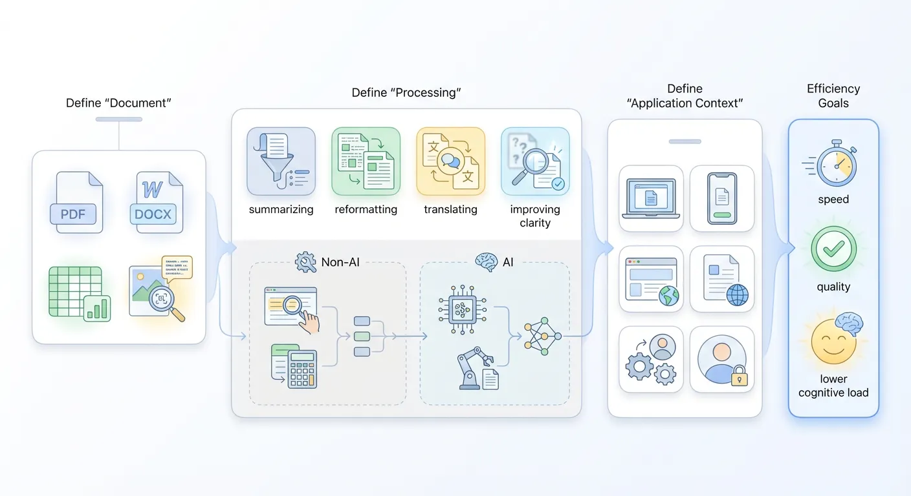

#### Second-Layer Decomposition

Suppose first-layer output is:

> “I want to build a web app that uses AI to improve speed and quality of converting PDFs into editable text.”

This is much more specific than “improve document-processing efficiency.” It defines document type (PDF), processing method (text conversion), optimization goals (speed and quality), technical path (AI), and carrier form (web app).

But this is still an intermediate goal, not yet truly executable. Why? Because critical details remain broad: what AI, what performance target, which scenarios, which users. So continue decomposing into finer design and technical decisions.

For “AI,” does it mean lightweight OCR only, or adding LLM/multimodal for correction, layout reconstruction, and structure understanding? Different choices lead to very different outcomes in:

- Cost consumption (compute/call cost/latency, one-time vs ongoing)
- Development complexity (simple API integration vs prompt/context/evaluation systems)
- Product shape (quick text extraction tool vs smart document platform with headings/tables/layout retention)

For “PDF,” what subset do you support? If you limit to text-based copyable PDFs, you avoid immediately handling scans, complex charts, formulas, and extreme layouts. If you promise “any PDF,” complexity multiplies at once.

At this stage, deliberately narrow and write tradeoffs explicitly. Example: current version mainly serves structurally clear text-based PDF reports/instructions, with no guaranteed quality for scans and heavily mixed graphic-text layouts. Then all “speed/quality” goals become controllable and explainable.

For “high-quality text conversion,” quality can be split into at least three discussable dimensions:

1. **Recognition correctness:** typo/punctuation/special-symbol accuracy, avoiding gibberish blocks.
2. **Paragraph/title structure preservation:** preserving chapter hierarchy, paragraph splits, lists, and quote blocks in plain text.
3. **Editability/reusability:** output cleanliness/format regularity and reduced manual cleanup when copying into Word/Notion/code editor.

Pick your top priorities (2-3 dimensions) as quality focus. For example, prioritize clear paragraph structure and basic heading-level preservation, while allowing small recognition errors that can be manually fixed in minutes. Then “high quality” becomes measurable standard, not vague adjective.

For “speed,” define a perceivable target, not only “feels fast.” Hidden tradeoff:

- Support very long documents with longer wait?
- Or target short-to-medium documents with results in seconds to tens of seconds?

If your typical scenario is turning a report/proposal/research abstract (~10 pages) into editable text before meetings, a natural choice is:

- Set per-file page limit (for example text-based PDF up to 20 pages)
- Set rough processing target (for example around 10 seconds)

Once explicitly written, technical decisions (parallel processing, async queues), UI copy (expected time/timeout hints), and expectation management can all optimize around “short-medium docs + quick return.”

Finally, “web app” seems only carrier choice, but also needs narrowing to avoid premature heavy productization. Ask:

- Is this an internal temporary tool for myself/small group?
- Or a stable external service for long-term users from day one?

If closer to the former, cut complexity boldly: no full account/permission system, no early history/project/team modules. Focus on one minimal path:

**Open webpage -> upload PDF -> wait -> show editable text -> one-click copy/download**

If the target is stable external service, later versions can gradually add concurrency, queue scheduling, quotas, failure recovery, logs/monitoring, and security/permission controls. But at this decomposition stage, you can define it as “browser mini-tool usable without login,” and concentrate all interaction on the simplest core path.

Once tradeoffs behind keywords (“AI,” “PDF,” “high-quality conversion,” “speed requirement,” “web app”) are stated concretely, the original sentence can be tightened into an executable description. For example:

> Provide users with a browser-based mini-tool that primarily supports structurally clear text-oriented PDF reports. Through adapted parsing plus lightweight AI cleaning, output an editable text in about 10 seconds, with clear paragraph structure, basic heading-level preservation, and acceptable recognition error rate. No login required.

You can further simplify to one sentence:

> Provide a web tool where users upload a text-based PDF of up to 20 pages and receive editable text within about 10 seconds, preserving paragraph structure and heading hierarchy, with one-click copy and `.txt` download.

This is no longer an empty slogan. It can directly become prompt instructions or execution plan for AI, a design brief for UI prototypes, or an engineering brief for implementation-cost assessment.

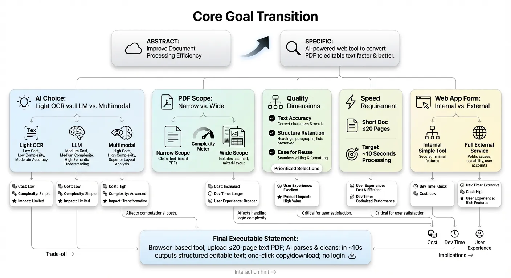

When you reach this point, two practical changes occur:

1. You are no longer blocked by broad goals like “make an efficiency app”; you have immediate actionable steps.
2. Communication cost drops sharply because you now present a concrete initial solution.

From abstract to concrete means turning a big wish into a task list that humans or AI can immediately understand and execute. Once decomposed to atomic tasks, each subproblem has two options:

1. I solve this subproblem.
2. AI or another expert solves this subproblem.

## 2.3 Sketch Your App on a Whiteboard: Draw Before Coding

When people think “start building an app,” they often jump to code, backend, database, API, and framework first. Understandable, because we are taught that product building is primarily technical. But if all focus goes to tech at the start, the most important thing is easily missed: **what exactly users need to do in your product.**

A simple but neglected method is: draw first. No professional software needed. Whiteboard, plain paper, or notes app is enough. The key is sketching the full user path from entry to completion before opening the editor.

You can split the app into three page types first: entry page, operation page, result page.

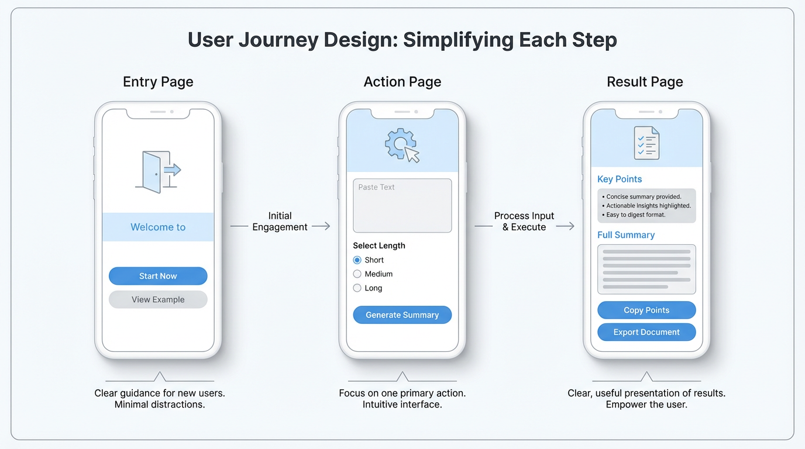

### Entry Page: Where Users Enter and What They See First

The entry page is the first contact point. Many people design it as a generic homepage with many modules/buttons/banners to look “powerful.” But if you draw it and pretend you are a first-time user, a hard question appears quickly: **where should I click first?**

Think like a guide. Ask concrete questions: how users arrive (shared link, app-store search, QR code)? Different sources mean different expectations. A user from a friend’s link may already know your value, so entry can drive straight to core trial. A user from app store may know nothing, so entry needs one clear sentence explaining what this is.

Practical sketch method: draw a phone frame, write page title on top, sketch main content area. Mark clearly: what this page tells users, and what choice you want next (start button, quick sample result, basic input form).

The simpler and more concrete the entry page, the higher the chance new users avoid confusion and start quickly.

### Operation Page: What Users Need to Input, Click, or Choose

After users continue, they land on the operation page, the main working area and interaction core. This is also where over-design often happens.

A useful exercise: **allow users to do only one thing.** Write that one thing in simple form (submit text, record voice idea, choose template, set one parameter). Around that, minimize input fields and buttons.

For a long-text summarization app, the rough but runnable operation page may only need: text input box, summary-length selector, and generate button. You can postpone visual polishing (fonts/colors/icons) and focus on:

- Does users instantly know what to do?
- What must users prepare?
- Will users lose direction mid-process?

Sketching on paper allows very low-cost experimentation. Try a one-page input version and a two-step wizard version, then mentally simulate usage to find which one reduces stuck points. Compared with rewriting flow in code, paper iteration is nearly free.

### Result Page: What Users Get and How It Is Presented

Many apps treat result pages casually, assuming “it’s just text/image/data output.” For users, it is the opposite. They input and wait because they expect something clear and useful on the result page.

Design result page from these angles:

- **What core information matters most, and is it in the most visible area?**
- What should be exportable/saveable/shareable, and where are those entries?
- Should simple explanation be added so users know what result means?

For long-text summarization, a friendly result layout can be: concise key conclusions at top, detailed summary below, original-link reference at bottom, and two visible buttons: copy key points and export document. Sketch regions and annotate expected action of each button.

After entry/operation/result pages are drawn, connect them with arrows and walk the path from first visit to completion. **This reveals issues you may miss otherwise**, such as: how users return to operation page to adjust details, or whether clear exit/save-draft paths exist when users hesitate mid-flow.

Core takeaway: sketch user operation flow first, then consider technical implementation. Even if you cannot code, **a few simple sketches can turn an abstract idea into a visible app prototype**. The clearer this step is, the easier later self-implementation or collaboration becomes.

## 2.4 Learn from Existing Apps: Copy Homework Smartly

When building a first app, many people feel pressure to create everything from zero: structure, interaction, and visual layout must all be original. In practice, this often wastes huge effort on low-value details.

A more efficient and mature attitude is **copy homework smartly**. Not blind imitation, but selective borrowing of proven patterns so your time stays focused on your unique value.

There are many websites collecting app screenshots and many app-store detail pages. Treat them as a massive reference atlas. Pick several products close to your direction (same tool category or same user segment), and study them page by page as sample analysis.

Do not focus mainly on color beauty. Focus on how they handle key areas:

- Navigation structure: bottom or top, fixed core entries or one primary action.
- Form organization: one-page completion or multi-step wizard.
- Result presentation: whether primary information is truly prominent and secondary information is properly organized.
- First-time onboarding: whether a short guide clearly explains next steps.

Useful screenshot/reference sites:

- [https://www.uisources.com/](https://www.uisources.com/)
- [https://screenlane.com/](https://screenlane.com/)
- [https://pagecollective.com/](https://pagecollective.com/)
- [https://patttterns.net/](https://patttterns.net/)
- [https://mobbin.com/](https://mobbin.com/)
- [https://refero.design/](https://refero.design/)
- [https://scrnshts.club/](https://scrnshts.club/)
- [https://godly.website](https://godly.website/)

Beyond existing apps, hackathon-winning demos are also useful inspiration. They are compressed solutions created under extreme time constraints. Even if rough, they show how to compress idea-to-runnable-product process under resource limits. Use them to understand what MVP really means. But because hackathons are short competitions, creativity can outweigh practicality. Awarded demos are not always suitable as long-term product references. Judge by your real context.

You can also learn from simple tool websites (weather lookup, translator sites, Pokedex collectors, game guides, popular vehicle ranking sites, AI-tool directories). Although functions look simple, they may satisfy real needs extremely well. Good ideas are not about complexity but usefulness. Referencing different product forms helps you understand actual market demand.

## 2.5 Don’t Wait Until Everything Is Ready to Validate User Needs

Many people say they build user-driven products, but in practice they prefer closing the door, building a “complete” version first, and only then showing it to others. **This may feel safer and more respectable, but product-wise it is risky.**

Reason is simple: the later you contact users, the more detail investment you have already made, and if direction is wrong, losses are bigger. You may code heavily for low-value features while missing the real point where users get stuck.

A simple principle to remind yourself:

**ask while sketching, ask while building, don’t ask only after finishing.**

### Ask While Sketching: Collect Feedback at the Paper Stage

When entry/operation/result pages are first sketched, you already have enough to start user conversation. Find two or three potential target users, show sketches, and observe first reaction.

No complex interview needed. Watch details:

- On entry page, do they naturally say what you intended (for example “this seems for long-document summarization”)?
- On operation page, do they follow the intended order naturally?
- On result page, are they immediately drawn to the key area, or distracted by irrelevant parts?

These observations expose major design issues before you write first line of code. You can revise paper prototype first, then continue building, instead of restructuring after full implementation.

### Ask While Building: Let People Try the Half-Finished Version

When you have a half-finished version that can run the basic loop, there is even less reason to test alone. Even with rough UI and missing features, **as long as it can complete your defined minimum task, it is ready for real-user trial.**

Start with nearby users, then recruit from your previously mentioned reachable communities/public spaces. Send a link, briefly explain what it currently does, and ask them to go from entry to result with minimal guidance from you.

**Your role is observation, not defense.** Where do they hesitate? Where do they pause? Which button do they stare at but avoid clicking? Afterward ask concrete questions: which step felt hardest, which result felt best, what they expected but did not find.

Testing in half-finished stage has a huge benefit: you have not over-invested emotionally in any one solution yet. You can more easily cut “cool but useless” features and spend time polishing small details that look minor but appear frequently in real usage.

### Don’t Be Afraid to Expose Roughness

Many people avoid early sharing because they fear looking rough or unprofessional. In reality, mature product builders rarely feel shame about early versions. They know early exposure has the lowest cost.

Reframe it: you are not presenting an unfinished product; you are inviting others to co-polish it. As long as you clearly state this is an early version and you want direct usage feedback instead of praise, most people are willing to help, especially those already troubled by the problem you want to solve.

At this point, you can use whiteboard/paper to turn abstract ideas into concrete user flows; you know how to decompose broad goals into minimum actionable tasks you can start tomorrow; you know not to greedily pack all ideas into first version, but to switch between divergence and convergence with Double Diamond and pick the MVP worth doing first; you learned to smartly reference existing apps for foundational structures like navigation/forms/results; and most importantly, you know not to wait for perfection before talking to users, but to let users in from demo stage and use their feedback to correct direction early.

With these tools and steps, you can already break an idea into an initially usable product. But you will also find: between “usable” and “truly good,” there is still a gap.

Next we discuss exactly that: what makes a good application, and after the first usable version, how to move it further.

## 📚 Assignments

Please complete the following assignments based on the above content:

1. Use any large language model. For your previous idea, ask AI to generate divergent outcomes with the Double Diamond model, then select one feasible solution.
2. Based on your earlier idea, use decomposition/refinement to get executable specification. Example: “Provide a web tool where users upload a text-only PDF up to 20 pages and get editable text within 10 seconds, with clear paragraph structure, preserved heading hierarchy, one-click copy, and `.txt` download.”
3. Based on the refined idea, draw your application on a whiteboard, focusing on two parts: UI design and feature layout (what features exist and where each feature is placed).
# 3. After Building, How to Judge and Polish into a Good Application

When you finally build the first version and put it into the real world for people to use, you'll enter a completely different stage. All previous discussions were still at the idea and design level, and now, the product will be tested by real usage scenarios for the first time. You'll see where users click wrong, where they hesitate, where they get stuck, and also see where they proceed surprisingly smoothly, even unexpectedly lingering a few extra seconds in some corner. These details are far more honest than all your imaginations about the product in your mind.

This chapter wants to solve a core problem: when an application has already been built, and even has a batch of early users using it, how to judge how far it is from a good application, and how to use this information from real usage to polish it step by step.

## 3.1 What is a Good Application: 4 Core Characteristics

To judge whether an application is good, you can't just look at how much you like it yourself, nor just look at download numbers or one or two days of usage count, but look at whether it has some more fundamental, more stable characteristics. Simply speaking, refer to the following characteristics:

### Good Applications Bring Concrete Value

The most direct characteristic of a good application is that it can let people get some real benefit in some scenario. This benefit doesn't have to be grand, nor does it need to be packaged in profound language, but must be specific enough that you can clearly say: **what exactly did it help users do less, how much time did it save, or what did it make less error-prone.**

For example, a simple meeting minutes tool, if it can automatically generate a structured meeting minute after uploading a recording or directly recording during a meeting, and clearly list action items, responsible persons, and deadlines, then what it saves users is not just typing time, but the entire mental effort from recording, organizing, screening to formatted output. You can very clearly say that this tool probably saves one person twenty minutes per meeting. And if the entire team has ten such meetings every week, then the total time saved is very considerable.

Another example is a seemingly unremarkable image compression tool, if it can compress a batch of images to one-third of their original size while keeping differences almost invisible to the naked eye, while ensuring one-click export, folder structure not messed up, and naming rules unified, then the value it brings is not just hard drive space savings, but also faster transmission, smoother uploads, and fewer errors when interfacing with other systems. This seemingly ordinary concrete value is often much more reliable than a vague "efficiency improvement."

So, when you say your application has value, it's best to break the value into one or two specific scenarios, explain in language ordinary people can understand: your application makes what users originally needed to spend how long, do how much manual work, bear how much risk, become more effortless.

### Users Can Get Started Easily, Almost Without Needing Instructions

Another easily underestimated but extremely important characteristic is that **good applications usually don't need much explanation.** When users open it for the first time, they can intuitively know roughly where to start, what will happen when clicking what, the largest button usually does the most core thing, the most important entrance is placed in a truly important position, not hidden in the third layer of the menu.

You can imagine a new user who just downloaded your application, they might have opened it casually while queuing, on the bus, or in a coffee shop. The network signal might not be very good at the time, and they don't have patience to read any long instructions. The confusion time they can tolerate is often only a few seconds. If in these few seconds they don't see any clear guidance, don't know what to do next, it's easy to just close it and never come back.

So, when you feel the product logic is smooth yourself, it's best to find someone who has never seen your application, let them explore from scratch without you speaking. You just observe where they pause, where they hesitate, when they show that "what is this" expression. If users are blocked by various splash screen popups, complex options, and account binding right when entering, it's hard to seriously experience the value you truly want to provide.

**Being easy to get started is essentially a form of respect for user costs from the product.** You're acknowledging one thing: no one has an obligation to spend time studying your application.

### In High-Frequency or Key Scenarios, Users Naturally Think of You

Good applications often have a stable usage rhythm, either high-frequency or key. **High-frequency means it integrates into users' daily lives, for example, messaging apps opened several times a day**, commuting tools used every day to and from work, check-in apps recorded daily. Key means even if not used every day, once encountering certain scenarios, users will think of you first, like tax filing tools, renovation budget calculators, interview question management tools, visa document checklist assistants.

You can ask yourself a few questions: when exactly and in what situation will users use you; if they miss you, will they really feel inconvenience; in similar scenarios, what method are they currently using to get by. If there's an alternative, even if very troublesome, but already habituated, then what you need to do is not just feature parity, but make them feel that switching to you is indeed more worthwhile.

A common misconception is directly binding usage frequency with application quality. Actually, it's not necessary. For example, making annual reports, processing certain documents, making a large transfer - these things themselves aren't high frequency, but once they happen, for users, they're among the most important things at the moment. **If your application can handle this type of key scenario steadily, quickly, and with confidence, then it can also be called a good application.**

**What really needs vigilance is that type where users neither use you frequently nor actively think of you at any key moment**, and even if your application disappeared from their phone, they'd only vaguely remember having installed such a thing months later when clearing memory. This situation often indicates your application hasn't deeply bound with any real scenario, just piled some weak presence at the functional level.

### Altruism

Many people when starting to make products, simultaneously calculating several things in their minds: how to charge after building, how to raise prices, how to make users pay for a bit more usage, how to lock data to prevent users from migrating away. Business calculations themselves aren't problematic, but if the thinking completely revolves around these from the start, it's easy to make applications full of wariness at first glance: asking for various permissions right away, charging traps everywhere, feature design clearly not for letting users smoothly complete tasks, but trying to guide users to some payment button.

In contrast, truly good applications all carry a relatively simple altruism. It indeed thinks clearly about how to survive, and also sets reasonable charging methods, but when designing paths and experiences, the priority is always: **how to make it easier for users to smoothly complete this matter, not how to add a step to create extra obstacles.** You'll see it uses more user-friendly methods in many places, like giving clear prompts at key steps, not overly setting barriers for export and migration, letting you experience at least some real value before charging.

This altruism is often reflected in some tiny design details. For example, that form field doesn't randomly ask for a bunch of data unrelated to the task just to collect more information, the tutorial sequence is designed around the goal users want to complete, not around feature modules themselves. You can feel this application is seriously helping you accomplish one thing, not treating you as an object to be squeezed.

There's another important point: **good applications don't have to be big applications. They can be very small, only serving one type of person, one scenario, one task**, but doing it very well in that small piece. For example, specifically helping designers export drafts to formats required by print shops, or specifically helping freelancers organize personal project cases - these ranges aren't large, but the value inside isn't small at all.

## 3.2 Insight into Needs: Maslow's Hierarchy of Needs Theory

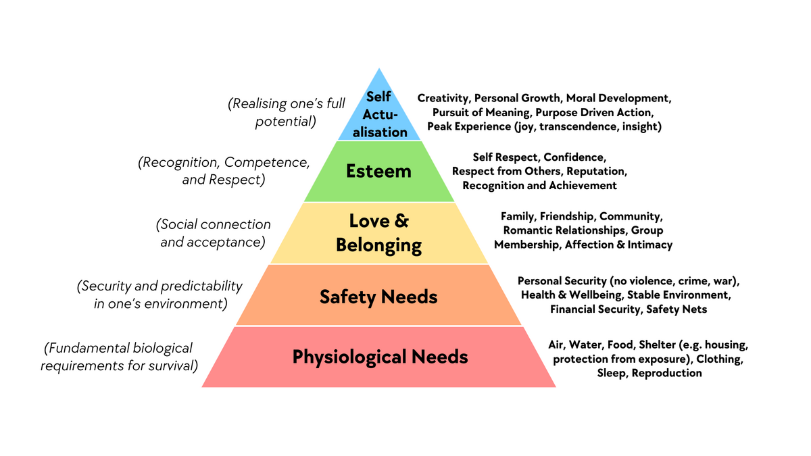

Before making an application, many people jump directly to the functional level thinking: can something more be done here, should a button be added there. What truly determines whether an application can survive is which level of human needs you've stepped on, and how accurately you've stepped.

The reason Maslow's hierarchy of needs theory is repeatedly mentioned in so many fields isn't because it's very rigorous, but because it provides a sufficiently usable observation framework. You don't need to treat it as a strict psychological conclusion, just treat it as a simple framework: helping you hang users' various motivations on several relatively clear levels, convenient for you to judge which type of need your application is satisfying. The more needs you can satisfy, the better the application.

Maslow's hierarchy of needs theory is usually divided into five levels, from bottom to top: physiological needs, safety needs, belonging and love, esteem needs, self-actualization.

### Physiological and Survival-Related Needs

This level is most basic, directly related to eating, sleeping, survival state itself. Sounds like it might be far from internet products, but actually quite a few applications play a role at this level.

For example, food delivery, grocery shopping, errand running, hotel booking, ride-hailing - these typical home and travel services are essentially helping users solve most basic problems like eating, going out, and resting with lower time costs. Another example is fitness tracking, sleep monitoring, diet check-ins - although appearing more health management-oriented, for many people, they're trying to maintain a body state that won't spiral out of control, which can also be seen as an extension of the physiological and survival level.

If your application works at this level, one characteristic is: **users will be particularly sensitive to stability, reliability, and predictability.** Food delivery not arriving, ride-hailing not getting a car for a long time, hotel booking information errors - the emotional reactions brought by these problems will be very strong, because these problems directly interrupt the basic rhythm of life.

### Safety and Certainty Needs

Safety needs include physical-level safety, as well as economic, information, and psychological security.

Many tool-type applications actually mainly work at this safety level. For example, accounting, asset management, insurance assistants, contract template tools, password managers, backup tools, privacy protection tools, cloud drive sync, data recovery. The core promise of these applications is often: help you reduce error probability, help you have backup plans when things go wrong, or at least let you have confidence.

A typical type is various anti-loss, anti-forget, anti-error small tools: schedule reminders, medication reminders, important document expiration reminders, key node memos. This type of application even if it only reminds you a few times a day, as long as it saves you once or twice at critical moments, it will quickly be classified by you as a must-keep type of tool.

When designing this type of product, you can ask one more question: **what type of risk exactly are you helping users reduce, is it financial, time, relationship**, or compliance and legal. If even you can't explain clearly, then users will find it hard to truly trust you.

### Belonging, Connection, and Being Seen

Going up another level is the need for belonging and love. Simply put, I don't want to be alone, I want to be connected with certain people. This level is the home base for social, community, and interest group applications.

Moments, group chats, interest forums, hobby communities, online book clubs, guilds in games, even some tools centered around specific identities, like new parent groups, international student mutual aid, industry internal anonymous complaint platforms - essentially all provide some sense of belonging: there's a group of people similar to me, we're looking at similar topics, complaining about similar difficulties, sharing similar experiences.

Some tools appear to be functional applications on the surface, but what truly retains users is often this level of need. For example, in accounting apps where everyone shares their saving progress, ranking and check-in circles in running apps, mutual supervision groups in learning apps. These seemingly value-added social modules are actually letting users bind your application with their own group identity.

If your application tries to stand at this level, having content alone isn't enough, you need to think about: **why would users feel this is their own people, are they willing to leave traces here, have some slight but real interaction with others.** Otherwise, what you're making is just a one-way broadcast tool.

### Esteem, Self-Worth, and Achievement

Going up another level is esteem and self-esteem needs. People don't just want to be accepted, at some stage they'll start caring: am I considered a pretty good person here, have I been seen, recognized, does anyone know about the things I've accomplished.

Large amounts of check-ins, badges, leaderboards, titles, achievement systems are actually playing a role at this level. Learning apps give you a title after completing certain course hours, exercise apps give you a certificate after reaching goals, creation platforms give authors different level identity markers, communities have obvious highlighting for quality content authors.

A common mistake here is thinking that adding a bunch of badges, points, and titles will stimulate users. What users want isn't flashy decorations, but that my real effort is recorded and taken seriously. If your achievement system is completely disconnected from users' real investment, like getting a "senior" title with just a few random clicks, then this incentive will quickly fail, even make people feel cheap.

So at this level, the key isn't whether you've made an incentive system, but: **has your application provided a stage where users can accumulate, letting them clearly see their change from beginner to proficient**, and at key nodes, giving them a ritual sense that "this step is worth remembering."

### Self-Actualization and Self-Transcendence

The top of the pyramid points to what kind of person I want to become, and what part of myself I want to contribute. This sounds abstract, but when it falls into specific scenarios, it often has very practical manifestations.

For example, creation tools: writing, painting, music production, video editing, programming project management - on the surface they're providing technical capabilities, but behind they carry users' desire to create something of their own. Another example is some long-term learning platforms, career planning tools, habit formation tools - they serve not just single skills, but some longer-term self-growth goals.

There's another type: the need to make others better. Many people use knowledge sharing platforms, Q&A communities, public welfare applications, collaborative creation tools not just to earn some points or traffic, but because when helping others and pushing a project forward, there's a feeling that I'm doing something meaningful, which also belongs to self-actualization.

When your application truly touches this level, it often has a very strong stickiness: even if the interface isn't the prettiest, features aren't necessarily the most complete, users will still stay here, because **it has established a deeper connection with who I am and what kind of things I'm doing.**

A benefit of treating Maslow's pyramid as a product perspective is that it can help you avoid two common biases.

**The first bias is only staring at some wrong level.** For example, you're making a tool to help users safely store files, essentially standing at the safety level, but you blindly imitate social products, piling various likes, comments, leaderboards on the interface, resulting in neither grabbing social product users' mindshare nor making people who just want a reliable storage tool feel you're not doing your job.

**The second bias is ignoring the sequence between levels.** When a person can't even get the most basic stable usage experience guaranteed, it's hard to seriously pursue self-actualization here. For example, if the app crashes frequently and data is occasionally lost, no matter how many badges and growth curves you give, users won't genuinely invest. Conversely, if you do solidly at the basic level, then gradually stack higher-level value, users will more easily follow you up.

In actual design, you can self-check like this:

- First ask yourself: which level is my application mainly and most core satisfying, only allowed to choose one level
- Then ask: above this core level, do I have opportunity to naturally extend to the next level, not hard-sticking a concept on
- Finally, take a look: in those levels lower than my target level, do I have obvious shortcomings, even dragging users down

When you can answer these questions clearly, your understanding of what users really want is no longer just staying at the vague level of "feeling they might like it," which helps you make better applications.

## 3.3 Classify by User Type: Differences Between C-End and B-End Applications

After an application is built, you'll quickly discover another important thing: facing ordinary individual users versus facing enterprise or institutional users are two completely different games. They both look like users, but care about completely different priorities.

- C-End (Consumer End): refers to "consumer end," the core is ordinary individual users.
  For example, WeChat, Douyin, Meituan food delivery that we use daily - the users of these Apps are individual persons one by one. This type of scenario serving individuals is C-End business.
- B-End (Business End): refers to "enterprise end," the core is enterprise, institution, or organization users.
  For example, DingTalk (enterprise collaboration tool) used in companies, financial software (like Yonyou, Kingdee), POS systems in retail stores - the users of these products are enterprise employees, teams, or entire organizations, serving enterprises' operation, management, production and other needs. This type of scenario serving organizations is B-End business.

### C-End Applications: Facing Ordinary People's Lives, Emotions, and Habits

C-End applications face individual users, embedded in everyone's daily life. Common types include content, tools, entertainment, social, learning, etc.

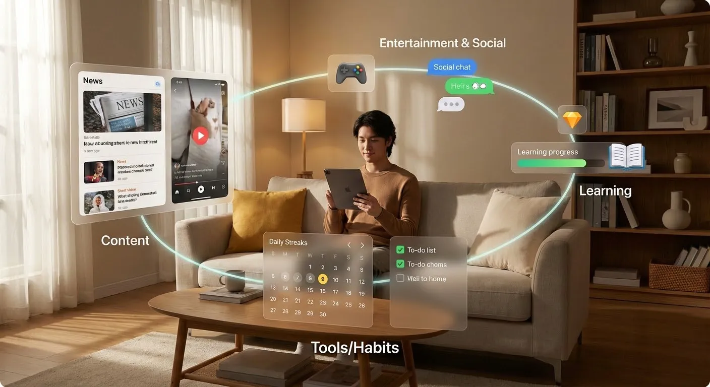

Content applications, like news reading, short video platforms, podcast tools. Their core task is usually to screen out content users are interested in from massive information within limited time. Also need to ensure there's constantly new things attracting users back.

Tool applications, like accounting, to-do items, file management, calendar scheduling. They often provide a handier solution than the original way on some specific task, belonging to one of the infrastructure users use daily.

Entertainment applications, including games, light interaction, fun small tools. They provide users with emotional relaxation and pleasure. The standard for measuring good or not is more about whether users are willing to continuously spend time on it.

Social applications revolve around connection and interaction between people. Learning applications revolve around improvement of some ability, like vocabulary memorization, question practice, reading check-ins, course management.

Although these applications have different types, they have several common concerns.

**First, user growth.** That is, how to let more people try your application for the first time. This involves channels, communication copy, user incentives, but the premise is always: you first need to have a clear enough usage scenario. Otherwise, even the most powerful growth methods can only bring a wave of short-term curiosity.

**Second, retention and return visits.** Not about whether people have come, but whether they're willing to stay and come back. A content application, if it can't guarantee continuously producing content users are interested in, will soon be replaced; a tool application, if it doesn't help users truly complete tasks in several key uses, it's also hard to establish long-term usage habits. You can judge how many people have truly incorporated you into their life rhythm by observing retention on day 1, day 7, and day 30.

**Third, conversion and payment.** Why users are willing to pay usually isn't because you made the free version very bad, but because after they've already obtained some value from you, they see that paid features can bring higher-level convenience. For example, higher usage quotas, stronger collaboration capabilities, more professional templates, more stable performance.

**Fourth, shareability and spread.** Many C-End products can quickly spread because they naturally have sharing attributes during use. For example, generating an image, a video, a piece of text - users themselves need to send the result to others to complete their own goals. In this process, as long as you make brand exposure natural and not annoying, you can gain some word-of-mouth spread.

A simple way to judge whether a C-end need is real is to see whether users are willing to build small habits around it: are they willing to open it every day, tie it into their life rhythm, and let it participate in recording important moments. In contrast, if users only come in because of a campaign or ad, use it once, and almost never return, then you are likely solving temporary curiosity rather than a long-term need.

### B-End Applications: Organization-Oriented Efficiency, Cost, and Risk Control

B-end applications serve enterprises, teams, institutions, or specific departments. Common categories include ERP (resource management systems), CRM (customer relationship management), collaborative office tools, different SaaS tools, and internal industry management systems.

The biggest difference from C-end is that B-end apps must satisfy multiple roles at once. The direct user may be a frontline employee, while the decision-maker is a manager or owner; data ownership may belong to the organization; and approval flows may involve multiple departments. You need to make users feel it is easy to use, **help decision-makers see the ROI**, and also give the organization a sense of security in risk and compliance.

B-end applications usually have several especially critical focuses.

**First, improve efficiency.** This is not only about shortening one person’s time, but reducing total process time, lowering collaboration cost, and reducing communication links. For example, if an order used to pass through five systems from creation to shipment, and now can flow through one unified entry, that improvement is very concrete for a business.

**Second, reduce cost.** This includes labor cost, training cost, and system maintenance cost. If a system looks powerful but requires heavy training and maintenance just to run, many SMEs will find it cost-ineffective. In contrast, SaaS tools that look lighter but can be learned quickly and show results quickly are more likely to survive in the real world.

**Third, control risk and ensure compliance.** In many B-end scenarios, compliance and traceability requirements are high, such as finance, healthcare, manufacturing, and government services. A good B-end application often gives up some freedom in operation to gain clearer permission control, stricter logging, and clearer approval chains. For individual users that may feel less flexible, but for the organization that is often exactly the value.

**Fourth, permission management and responsibility boundaries.** Who can see what, who can change what, and who is accountable for which result are core design questions in B-end systems. If this part is weak, later auditing, disputes, and accountability become very costly. So when judging whether a B-end app is good, you cannot only look at whether the interface feels smooth; you also need to see whether the permission model is rigorous, understandable, and maintainable.

From industry to application, you can think this way: **pick an industry you know to some extent, such as education, e-commerce, manufacturing, finance, or healthcare**, then break down daily operations: which workflows depend heavily on manual work, which information is scattered across multiple systems or private chats, and which links have high error rates but are hard to detect quickly. Around these points, you can often design focused small tools.

For example, in education/training, a very concrete entry point is course scheduling and classroom utilization optimization. It does not need to replace the full academic affairs system. As long as it helps staff schedule teachers, classrooms, and course times more easily, automatically avoid conflicts, generate better combinations, and export a timetable everyone can understand, that alone can save a lot of repeated communication and revisions.

In e-commerce, a common need is multi-channel order management. Merchants may run stores across different platforms, with order data scattered everywhere. If you can provide a small tool that aggregates orders from multiple platforms and handles after-sales and logistics in one place, you have already solved a huge repetitive pain point.

In manufacturing, many companies still rely on paper records or Excel to track production progress. You can start with a simple work-order tracking tool so site managers can directly see the status of each process instead of relying on constant calls and manual check-ins.

In finance or healthcare, your entry point does not have to be front-office business. It can be a compliance-check assistant, a document template generator, or an approval-material checklist manager. As long as you can clearly state which role’s task in which workflow becomes more controllable because of your tool, it is already a direction worth trying.

Many products in the industries above are already promoted by mature companies. This is actually a useful reference path: you can actively search keywords like “industry + core need + product” (for example, “education scheduling system” or “e-commerce multi-channel order management tool”). You can find official sites and feature pages, plus user reviews, case studies, and demo videos. These help you quickly understand how mature products solve similar problems and reduce trial-and-error from scratch.

## 3.4 Polish with User Data: From “I Think It’s Good” to “Users Think It’s Good”

After an app is built, one common illusion is: you get more and more used to it, feel everything is reasonable, and assume users feel the same. In reality, the more self-built the product is, the easier it is to ignore other people’s problems. To turn an app from a self-satisfying project into a truly good product, you must bring real user feedback into the loop.

### Design Simple Feedback Mechanisms So Users Have a Way to Speak

You do not need to start with a complex customer service system or data platform. Start from simple methods.

**Group chats are the most direct method.** If you already have a small user group, invite them to post issues and ideas from daily usage. Your job is to reply seriously, record, and summarize regularly, not defend yourself in chat. The more you can build an atmosphere where people can speak honestly, the more valuable your feedback becomes.

Surveys are suitable when you need to **collect relatively more structured information at one time**, for example after one version iteration when you want opinions on a few specific features. If you want a high completion rate, keep it short and ask specific questions: which feature did you use most recently, where did you get stuck most often. Avoid overly broad questions like “what do you think overall.”

Post-task popups are another common way. After users finish one task, use a very short rating plus suggestion box to ask whether the experience was smooth. Sometimes a simple numeric rating is enough to identify obvious process problems.

One-on-one interviews are higher cost, but often higher return. You can **pick several users of different types and invite 20 to 40 minutes each** to discuss their actual habits in detail. Let them operate while speaking what they see and feel. I once saw a founder scheduling more than ten user conversations per day. Spending time to understand user needs is never wasted.

### Learn to Extract Three Types of Information from Messy Feedback

User feedback is usually mixed together and hard to read at a glance. You can classify it into three categories: **bugs, experience issues, and new needs.**

**A bug means behavior that should happen does not happen, or wrong behavior occurs in some cases.** For example: upload failures, crashes, buttons not responding, or obviously incorrect outputs. For this type, you should reproduce quickly, fix quickly, and proactively notify affected users after the fix, so they know you take these issues seriously.

**Experience issues mean the flow length, operation placement, or copywriting has not found the smoothest path.** For example, users hesitate on one button because they are unsure whether the action is irreversible; an important function is hidden in an obscure corner; default settings go against common habits so users need extra adjustments every time. This type needs judgment based on both data and observation: whether to change and how far to change.

**New needs mean users begin proposing functions or scenarios you did not originally consider.** Some are worth serious consideration, such as more export formats, team collaboration, or integration with common tools. But you should not do everything users ask. The key is to identify whether these requests share a common underlying problem and whether they align with your target user group and core task. Otherwise, you will be pulled into many directions and end up with a product that wants to do everything but does nothing deeply.

Build a habit: tag each feedback item as bug, experience issue, or new need. Aggregate tags regularly to see which type concentrates in which features or flows. Then you are not only patching passively; you are iterating around high-frequency problems with intention.

### Use Three Simple Metrics to Decide Whether to Keep Investing

With limited resources, you still need simple but effective metrics to judge whether the app is worth long-term investment.

**First is retention.** Retention is not “how many opened on one day,” but **how many users continue to use over a period of time**. You can measure roughly: how many used at least once within one week after install, and how many returned within one month. If most users use once or twice then never return, it means they did not see enough value early on, or the usage threshold is too high.

**Second is revisit frequency.** For users who did not uninstall, how often do they come back? A daily-use tool and a quarterly-use app have different positioning and need different yardsticks. But in either case, you should define a reasonable expected rhythm and compare to actual data. If frequency is higher than expected, value may exceed expectation; if much lower, rethink whether scenario targeting is off or some part of the experience feels tiring.

**Third is willingness to recommend.** Are people willing to proactively recommend your app? You can observe this in several ways: after a particularly smooth task completion, provide a natural share entry and see how many people use it; check whether people spontaneously recommend your product in groups; or in user interviews ask: if someone around you has a similar problem, would you recommend this tool? Recommendation willingness often says more than plain satisfaction scores, because recommendation carries personal credibility. Users only recommend when they truly feel helped.

When you combine these three metrics with user feedback, you can roughly judge your current product state. Maybe the feature set is not complete yet, but if a group has stayed and repeatedly uses you in specific scenarios, that product is worth continued investment and polishing. On the other hand, if you fixed many bugs and added many features but retention and revisit stay low and almost nobody recommends you, then you should calmly reconsider: should you narrow scope, return to the original core scenario, or even change direction.

# 4. At Which Step and How Should You Use AI to Amplify Value?

Once you seriously start building an application, you quickly meet a common temptation: can we add more AI. This temptation is strong because every day you see messages like “AI empowers industry X,” “AI fully reconstructs workflow Y,” “AI one-click solves everything.” Over time, it is easy to turn a simple practical question into a slogan full of hype, then pile model calls into your stack and watch your account cost burn.

Although this tutorial is about AI-native application development, and saying this may sound like going against our own topic, for a small app or an early product, **the biggest danger is not not using AI, but using AI for AI’s sake**. You might have built a simple but reliable tool first, but get distracted by new capabilities, keep adding “smart-looking” features, and end up making a potentially viable direction expensive and complicated without obvious value gain. The core question of this chapter is: at what stage, in which links, and in what way can AI genuinely amplify your product value.

## 4.1 Don’t Use AI Just for the Sake of AI

A practical way to check whether you are unconsciously doing “AI for AI” is: before adding any AI feature, force yourself to answer two questions seriously.

**Question 1: Without AI, does this application still stand?** In other words, temporarily remove all AI capability. Is this itself still a valuable thing? Is there real user demand? Are users willing to spend real time on it daily, weekly, or monthly?

This sounds counter-trend because almost all product pages now put AI in the spotlight as if without AI it is not modern. But if your app completely fails without AI, often the problem is not that your tech is not advanced; it is deeper: the need you selected may not be painful, maybe not even real.

Imagine you are building a to-do organizer. If your main differentiation is model-generated hints on to-do items (auto-title, auto-categorization, auto-completion), but users never felt writing titles was painful and only want to capture tasks quickly, then no matter how fancy these smart features are, they are hard to create sustained value. In contrast, if you step back and ask what the simplest value is without AI, you may find a more solid direction: unify scattered tasks from different channels, help users see what can actually be completed in a day, and surface risks before the day ends so they can prioritize and subtract. Building these basics well is often more important than adding smart labels at the beginning.

**Question 2: After adding AI, what exactly improved?** Broad conclusions like “higher efficiency,” “upgraded intelligence,” or “better experience” are not enough. You need one or two dimensions that even users can clearly perceive.

You can ask yourself:

- Did task completion speed improve significantly? For example, a one-page copy that previously had to be written from scratch now only needs five minutes to review and edit.
- Did output quality clearly improve? For example, users produce more structured, more professional, and more audience-fit content within the same time.
- Did the process become smoother or easier? For example, turning a boring form flow into a conversational Q&A.
- Did real costs go down? For example, fewer outsourcing tasks, shorter manual support hours, shorter training cycles, or shorter decision cycles.

If your answer is still at “it feels a bit more convenient” or “it looks cooler,” then in most cases this AI feature has not found its most critical leverage point.

These two questions have a clear order: first ensure the app makes sense without AI; then ask where exactly AI makes it better.

## 4.2 Think Clearly About What Role AI Is Playing

When you confirm the app still works without AI and you have identified a clear improvement point, the next step is to think more concretely: **what exactly AI does inside your product.** Many products fail here because they treat AI as an abstract “power” instead of a role with clear responsibilities. The result is feature pile-up with blurry purpose: users feel everything is “a bit smart,” but cannot name any part that is truly indispensable.

A clearer approach is to treat AI as different components: **it can be the brain, the eyes, or the hands**. Decide which part it should handle based on your product goal. If possible, choose one or two roles first and do them well instead of stuffing everything in at once.

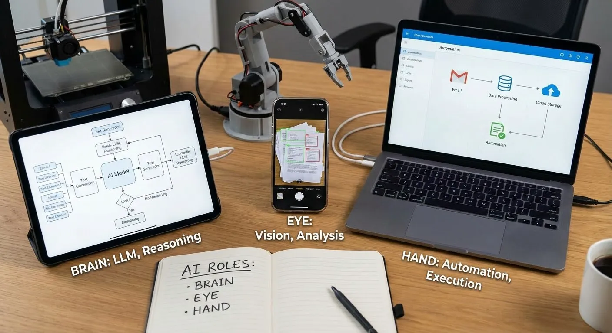

**When AI acts as the brain, it mainly handles language understanding and generation, or reasoning across complex information.** For example, in a meeting-minutes assistant, it should extract truly core discussion points from a long recording rather than just list by timeline. In a learning app, it should judge whether a user misunderstood a concept or just made a careless step error, then give different feedback. In these scenarios, AI’s value is understanding what users say, understanding provided material, and generating structured, logical output. Your job is to help users ask clear questions and feed accurate context so this “brain” has enough information to judge.

**When AI acts as the eyes, the focus is processing non-text content such as images and video,** converting them into machine-understandable descriptions and then taking further action. For example, a paper-document organizer can recognize photos of invoices, contracts, and manuals into searchable text. A drawing-learning app can interpret a user’s sketch and point out composition or line issues. A home-organization advisor can analyze uploaded room photos, recognize current layout and item distribution, and suggest practical improvements. Here AI is like analytic vision: your app no longer only handles typed text and can start engaging with physical-world inputs.

**When AI acts as the hands, it starts executing a chain of concrete actions,** not just giving text suggestions. For example, in automation platforms you can chain a workflow: read email attachments, summarize key points, post to a group, save originals to cloud drive, then create follow-up tasks automatically. Here AI’s role is making dynamic next-step decisions based on context, such as identifying whether an email is a complaint or whether a form is complete, then triggering different follow-up actions.

Beyond this simplified framing, in real products AI roles are often more concrete and diverse:

In text processing, AI may do translation, summarization, Q&A, continuation writing, or sentiment analysis. Examples include auto-classifying customer inquiries in support systems, extracting contract clauses in legal assistants, and grading essays in education apps.

- The technical foundation is mainly **Large Language Models (LLMs)** in deep learning. They learn language patterns and world knowledge from massive corpora, enabling both long-context understanding and coherent generation.
- On the “understanding” side, LLMs can identify intent, extract key information, and judge sentiment tendencies. On the “generation” side, they can write summaries, answer questions, rewrite/continue text, and translate across languages, automating or semi-automating large amounts of reading, synthesizing, and drafting work.
- Take an **online customer-service bot** as an example: the system first roughly classifies a user’s one-sentence input as inquiry, complaint, or after-sales; extracts key fields like order number, time, and product name; then lets an LLM generate a natural, complete response with context and enterprise knowledge-base support. This reduces human workload and keeps service quality stable during peak periods.

In image processing, AI may do recognition, classification, generation, restoration, or enhancement. Examples include lesion localization in medical imaging, automatic background removal and replacement in e-commerce, and text-to-image support in design tools.

- Image understanding usually relies on visual deep-learning models such as **Convolutional Neural Networks (CNNs)**, learning edges, textures, and structural features from massive images for object detection, segmentation, and fine-grained classification.
- Image generation and restoration rely on generative models such as **diffusion models** and **GANs**, which can generate new images from text/reference images and restore low-quality or missing details with super-resolution enhancement.
- Many systems combine LLMs: first understand user text intent in natural language, then auto-generate visual prompts, style tags, and composition constraints for the vision model, closing the loop from “understand what you want” to “draw what you want.”
- Example: an e-commerce **“smart hero image generation”** feature. The system first uses detection/segmentation models to cleanly extract the product, then uses an LLM to parse merchant copy (for example, “minimal Nordic living-room setting with soft natural light”) into scene/color/style parameters, then calls diffusion generation to produce matching background and lighting, auto-filters poor compositions or style mismatches, and outputs listing-ready hero images.

In audio/video processing, AI may handle generation, transcription, denoising, editing, or subtitle creation. Examples include auto-generating intro/outro narration in podcast tools, auto-synthesizing explainer videos from scripts, and real-time transcription/translation with multilingual subtitles in meeting software.

- On the understanding side, systems use **speech-recognition models** to convert speech to text and analyze speaker, language, speaking rate, and rough emotion; visual models parse scenes, people, and key objects in video.
- On the generation side, LLMs parse and rewrite scripts/meeting content/instructions, then drive **Text-to-Speech (TTS)** for natural narration and video-generation/editing models for auto-composition, background replacement, shot insertion, and subtitle alignment. Audio generation models can also produce background music/ambience, combined with deep denoising and enhancement.
- Example: **“text-to-short-video”** products. Users enter one paragraph, the system uses an LLM to split it into natural sections and scenes, generates narration and shot descriptions, uses TTS for voiceover, then uses templates/generation models to select or generate footage, align subtitles with audio on a timeline, and one-click export a publishable short video.

In voice interaction, AI may do recognition, synthesis, emotion detection, or dialogue management. Examples include understanding commands in smart speakers, route broadcasting in voice navigation, and pronunciation correction in language-learning apps.

- Front-end uses deep-learning **speech recognition** to convert user speech into text and extract tone, volume, and speaking-speed signals for emotion/state hints.
- Back-end uses **TTS** to output natural voice replies, while emotion-recognition models adjust response tone and pace according to the user’s current speaking style so interaction feels closer to real conversation.
- Example: with a **smart speaker**, when a user says “I’m tired today, play something relaxing,” the system transcribes speech, uses an LLM with playback history to infer what “relaxing” means for this user, chooses a calmer playlist, and after detecting a fatigued emotional state, TTS lowers speed and softens tone so the system both “understands” and “sounds comfortable.”

The content above is only a basic introduction to major AI directions and techniques. In real business scenarios, you usually need to integrate multiple latest AI APIs and run broader testing across different tasks. You also need to gradually understand how strong current AI really is, what problems it can solve, where it is likely to fail, and what its boundaries are. Only with that understanding can you design features and processes reasonably instead of burying risks through capability misjudgment.

Next, we will discuss this more systematically: how to understand AI capability and boundary, and what to consider when building real products.

## 4.3 Get Familiar with AI Capabilities and Boundaries

When you actually integrate AI into products, you quickly see a reality: the “all-powerful” messaging in promotion and the constraints inside specific features are often far apart. To avoid over-promising and under-delivering, **you need basic awareness of major AI capability directions and clear boundaries for each. You need lots of testing and Bad Case review, avoid scenarios where AI is highly likely to fail, and add warning explanations where needed.**

Current models still hallucinate in many scenarios, especially when asked to freely improvise or when not given reliable references. They can output confident but wrong answers, and even fabricate files, data, or events that do not exist. Therefore, for consequence-sensitive scenarios such as financial statements, legal documents, and medical suggestions, you should explicitly add human review or multi-step checks in your design. Do not treat model output as directly executable instructions.

At the same time, privacy and data security must be handled head-on. You need to be very clear about which data can be sent to models, which must be anonymized, and which should never appear in third-party systems. For sensitive content such as contracts, medical records, and personal identity information, explicitly state handling methods in UI and agreements, and where possible choose safer, more controllable deployment approaches for these cases.

To make this more concrete, let’s use an Agent-related example to explain what it means to truly understand AI boundaries. Note: this is not teaching you to build an Agent from scratch or asking you to chase one architecture now. The point is a thinking method: for the same “Agent” topic, some people treat it as a buzzword, while others break tasks and boundaries clearly.

Barret Li Jing, a long-term AI application practitioner, gave a summary I strongly agree with on building Agents and deciding where to use AI. It reflects a mature method: break the problem first, then discuss where AI fits.

> Agent has two variables: workflow, which controls task direction, and context, which controls content generation.
>
> 1) If both workflow and context are highly deterministic, such tasks are easy to automate, similar to traditional RPA. In tasks like invoice processing or form filling, AI is more of a glue layer with limited room to contribute.
>
> 2) If workflow is deterministic but context is uncertain (fixed process, variable input), Agent needs to fill semantic understanding gaps, such as in customer-service Q&A or contract parsing. External retrieval, knowledge graphs, and tools can fill information gaps so reasoning aligns better with expectations.
>
> 3) If workflow is uncertain but context is deterministic (clear input, multiple possible paths), Agent needs autonomous path planning, such as in market-analysis report generation or personalized recommendation. Many end-to-end RL Agents are good at this because training exposes them to many planning patterns.
>
> 4) If both workflow and context are uncertain, this is the most complex case. It requires both reasoning and exploration, such as innovative-solution design or cross-department information gathering. This leans toward general-purpose Agents, where execution quality depends on tool richness and especially broad programming capability, for example enabling GitHub repo search/clone/code modification to solve tasks like a human operator.
>
> Therefore, to build Agent well, first clarify the scenario. In essence, automation solves “deterministic” problems, while intelligence solves “uncertain” problems.

The value of this decomposition is turning “build an Agent” from a vague concept into judgeable questions: where is determinism and where is uncertainty in your task? When both process and information are deterministic, traditional programs may be enough. Only when uncertainty appears do AI capabilities in semantic understanding, pattern recognition, and reasoning/planning become useful. But at the same time, the more uncertainty, the larger the new risks AI introduces. In scenarios where both dimensions are uncertain, each AI step can drift, and you cannot predict choices in advance. That is why many teams start from quadrant 2 (workflow fixed, context uncertain): it uses AI understanding strength while keeping risk bounded by fixed process.

Back to the core question of this section: what does it mean to truly understand AI boundaries?

First, understand that different scenarios need AI differently. As the workflow/context example shows: when both are deterministic, AI has limited room and classic automation may suffice; when workflow is fixed but context varies, AI’s value is understanding and completion; when workflow is uncertain, AI needs planning and exploration. The essence is identifying source and degree of uncertainty. AI’s core strength is finding patterns and relationships under uncertainty. This way of thinking applies beyond Agents, including image recognition, content generation, and recommendation systems. For example, in an AI background-removal tool, input is deterministic (an image), while edge precision and complex-background handling are the uncertainty.

But while AI solves uncertainty, it also introduces new uncertainty. Its output is probabilistic: it can misunderstand, reason off-path, or hallucinate. Different scenarios and user groups have very different tolerance for this uncertainty. So you must ask:

**Can users and the system tolerate the new uncertainty introduced by AI?** In customer service, if AI misreads intent, users can often correct it immediately, so uncertainty is controllable. But in automated financial approval, one misjudgment can cause severe consequences, so uncertainty is unacceptable. Likewise in image generation, for avatar beautification users can regenerate at low cost; for architectural construction drawings, a small detail error may cause real engineering risk.

**Can AI accuracy reach the passing line for this scenario? And that passing line depends on what users do with it.** For image recognition, 80% may be acceptable for personal photo album sorting because users can manually adjust a few. But for security monitoring, missing 20% suspicious targets is a major risk. For text generation, 60/100 creativity may be enough for social copy because users can polish. But for legal contract clauses, 95/100 may still be insufficient because one wrong phrase can trigger legal disputes. Different users and use cases have very different sensitivity to error rates; you must know the tolerance window of your target scenario.

**When AI fails, do you have a remediation path?** In fixed-workflow scenarios, you can place human review at key nodes and localize uncertainty. In scenarios where workflow is also uncertain, every AI step can drift and intervention timing becomes hard to judge, causing steep cost and risk increase. For example, in old-photo restoration, if output is not realistic users can immediately reject it; in medical imaging assistance, if AI marks abnormality in the wrong location, doctors may not easily detect it and consequences are much heavier.

**Can you measure and optimize AI performance?** If the task itself has no clear right/wrong criterion, how do you know whether AI did well? If feedback comes very late, how do you iterate quickly? Without measurable signals, AI uncertainty becomes a black box. For example, in recommendation systems you can use click-through rate and dwell time for fast feedback. But for creative ad-copy generation, “good” is subjective and real conversion may only be known after campaign launch, making iteration cycles long.

A mature judgment is not “there is uncertainty, so we can use AI,” but “AI can handle this uncertainty, and I can manage the new uncertainty AI introduces.” You want to build this judgment capability: **on this feature point, to what extent can AI help, is it worth investment, and what investment path has the best ROI.** With this capability, you avoid many detours when designing features and evaluating solutions in the future.

# 5. After You Have an App, How Do You Find the First Real Users from 0?

After you finally build an app, the next challenge becomes: how to make the first real users appear.

At this stage, many teams have an illusion: since the product exists, all that remains is promotion, exposure, and traffic buying, and once enough people see it, growth will come naturally. But if you rush into large-scale exposure immediately, you often fall into a classic trap: you burn precious time and budget, data shows people came, but you still cannot verify whether anyone is willing to keep using it.

The most important thing at this stage is only one thing: **prove at the smallest possible cost that some people are willing to use it, and willing to come back after using it.** In growth/product language, this step is usually called “cold start.”

Cold start means pushing a brand-new product to real operation when almost everything starts from zero. You have no user base, no word of mouth, no search volume, no brand awareness, and almost all metrics are near zero. In such a cold environment, you must make the first real willing users appear and build the first usage loop around them.

This is fundamentally different from later optimization on products that already have users and data. A simple way to move forward is through these four steps:

1. First understand growth has 0–1 and 1–N stages, and know what you currently need to solve.
2. Clarify who exactly you need to reach; do not stare only at end users.
3. After clarifying target objects, choose one or two cold-start paths that fit your resources.
4. In the reality of limited resources, learn tradeoffs and focus effort on the most critical small part.

## 5.1 First Distinguish Two Stages: 0–1 and 1–N

Before discussing how to find users, you need to clarify one thing first: **growth is staged**. If you mix all growth work together, you won’t know where to focus now. The simplest and most practical split is 0–1 and 1–N.

### 0–1: How to Cold Start When Nobody Is Using It

0–1 means the period from zero users to the first small batch of users who are truly willing to use. The “cold” in cold start is that almost all initial indicators are zero: no downloads, no search, no word of mouth; your app is almost nonexistent in the world.

At this time, you cannot rely on organic traffic or luck. You must act proactively and build the first foundation. Specifically, several things are mandatory:

**Find a small group of seed users who are truly willing to use it**, not just acquaintances opening once out of favor or curiosity.

**Prepare initial usage experience and supply**, so users do not see an empty shell after entering. Even if features are incomplete, they should at least complete one full core operation and feel the value.

**Explain clearly in simple language what the product does and what problem it solves.** Without brand trust, users give you only a few seconds of patience. You must let them quickly understand “what’s in it for me.”

**Get the first reachable channels** to place this message in front of potential users. It could be a small community, a forum, or a personal network. Scale is less important than accurately reaching real need.

In 0–1, what truly matters is bringing in the first people with real needs and getting them through a closed loop of entry, usage, and feedback. Once this loop runs, you have proved the product is not an “in-the-air concept” but something people actually need and will use.

### 1–N: How to Scale After People Are Already Willing to Use It

When you gradually accumulate a group of users willing to repeatedly use the product, the question changes to: how to expand from dozens/hundreds to thousands/tens of thousands and beyond. This is what people traditionally call growth, expansion, and scale.

In 1–N, you start to care about a more complex set of topics: mechanisms, organization, monetization, brand, and team. For example:

**Whether you have found relatively stable acquisition channels,** and can estimate roughly how many new users each unit of budget/time brings. At this stage, you need repeatable, predictable growth paths rather than luck.

**Whether you have started building service mechanisms,** such as customer support, operational activities, and user education. As users grow, you can no longer handhold one by one as in early days; standard service systems become necessary.

**How this product will make money,** such as subscription, one-time payment, value-added services, or other models. You do not need to finalize business model at day one, but once entering 1–N, you must seriously think about sustainable operation.

**What brand impression you want to leave.** Early on you may only spread within small circles; as scale expands, you need to think about how more users remember you, trust you, and recommend you proactively.

**Which capabilities your team still lacks and which links need long-term ownership** rather than full outsourcing. One person or a small team may carry 0–1, but 1–N usually requires more role coordination.

These problems are all important. But if you rush to solve them in 0–1, you often enter empty spinning. Before you even know whether people truly want to use and stay, discussing business models and brand strategy only distracts from what matters most.

### Why Focus on 0–1 First?

For solo developers and small teams, compared with 1–N, **0–1 is what you should focus on most**. The reason is simple: if you cannot find the first batch of real users, all later discussions about scaling, commercialization, and branding are empty talk.

The 0–1 phase is the most fragile and most critical moment in the whole product lifecycle. It determines whether you can prove product value, build initial trust, and lay the foundation for later growth. Only after you truly run through 0–1 are you qualified to discuss 1–N.

Next, we further focus on 0–1: first clarify **who exactly to find**, then discuss concrete cold-start paths.

## 5.2 Cold-Start Targets: Seed Users, Supply Side, Traffic Side, and Channel Side

Different application types usually cannot avoid several key target groups: seed users, supply side, traffic side, and channel side.

### Type 1: Seed Users

**Seed users are the earliest users you reach.** Their typical traits are small in number but highly aligned with your target profile. What you need from them is not only registration and usage numbers, but first-hand direction and experience feedback.

- For personal productivity tools, seed users may be people with long-standing pain in one problem: content creators who often need to organize long-form writing, professionals frequently preparing reports, or students dealing with large amounts of material daily.
- For education apps, seed users may be a small group preparing the same exam or parents in a specific grade segment.

During cold start, set a clear seed-user goal for yourself, for example finding 20 to 50 cooperative users first and spending one to two weeks using and talking with them. The focus is not quantity, but using high-density communication to refine product logic.

### Type 2: Supply Side

**In some two-sided or multi-sided platform products,** having only demand-side users is not enough. Without enough supply-side participants, users may enter and quickly leave because there is nothing to use.

**Supply-side participants may be content creators, course instructors, service providers, merchants, drivers, landlords, etc.** They determine platform richness and attractiveness.

- If you build a design-assets platform, you need to first convince some designers to upload works, even if it is only a small free subset. Otherwise users enter and see only a few sample images with low stickiness.
- If you build an online booking tool, without pre-connecting merchants or institutions willing to use it, ordinary users still cannot find actual bookable targets.

In cold start, you must be very clear whether you solve demand side first, supply side first, or both simultaneously. Many platforms faced this tradeoff in early stages. Simply realizing this is a structural problem you must address already puts you ahead of teams that only think about end-user acquisition.

### Type 3: Traffic Side

Traffic-side partners are people or organizations that can, **within a relatively short time, direct a meaningful amount of user attention to you. They may be influencers, vertical accounts, media outlets, community operators, or tool platforms with large user bases.**

- For a workplace productivity tool, if you can persuade a few career-development creators to naturally introduce your app in content, you can quickly reach users sensitive to workplace efficiency tools.
- For a topic-assistant tool for Xiaohongshu creators, if you cooperate with several mid-tier creators and let them show practical usage, that creator group naturally becomes potential seed users.

In cold start, you do not need to rush for the biggest traffic players, nor immediately pursue top-tier partnerships. Often, small-to-mid traffic sources with high audience overlap are more willing to try customized collaboration with you. Your task is to find those people/institutions and provide a clear proposal so they understand what you do and what benefit they get.

### Type 4: Channel Side

Channel-side partners are organizations or entry points that help you **reach target users consistently in specific scenarios**. The difference from traffic-side is: traffic-side is more one-off attention import, while channel-side is more long-term, structured connection.

- Schools, training institutions, companies, industry associations, and software service providers are all typical channel-side partners.
- If your app can concretely help a certain institution improve efficiency, reduce cost, or improve service quality, they are motivated to introduce your product to many users inside their own system.

During cold start, do not fantasize about winning large channels all at once. Start with small pilots, such as one or two classes, one small company, or one local community using the product internally for a period, then decide whether to scale based on feedback.

A direct benefit of splitting cold-start targets this way is avoiding putting all effort into end-user acquisition while ignoring other critical links in product structure. You can draw a simple role map based on your product form: define who each role is, current size, and short-term goal for each. Once this object map is clear, then discuss concrete cold-start paths.

## 5.3 Cold-Start Methods: Three Main Paths for Different Targets

After you know who to find, the next question is: through which paths do you find and serve them.

In practice, you do not need to stick to only one path. Choose based on your resources and product characteristics. Most of the time, one path is the main line while one or two others support.

### Path 1: Break Through with Seed Users, Prioritize Your Private Reach

This path mainly targets seed users and part of supply side.

For most early solo developers, small teams, and even startups, the most realistic, lowest-cost, and easiest-to-control rhythm is usually to start from your existing private reach.

“Private reach” is not a complicated operations concept. It is simply people you can proactively reach now: your friend circle, industry communities you participate in, interest groups where you have voice, readers of a public account you maintain, and so on.

There are roughly three key actions in this path:

1. **Actively invite a small number of highly matched users to try.**
   The key is not volume, but fit with target profile. If you build a resume tool for early-career users, prioritize fresh graduates and students preparing internships, not acquaintances with ten years of work experience.
   In invitation messages, try to clearly state three things:
   1. Which kind of users this app serves and what problem it solves.
   2. Roughly how long you hope they spend trying it.
   3. How you will handle the feedback they provide.
2. **Collect feedback intentionally and optimize quickly.**
   The value of seed users is not helping you pad numbers, but helping you see product blind spots. Use one-on-one chats and short surveys to ask: in what scenario they think to use it, where they get stuck, and which part is most useful or completely useless.
3. **Let seed users generate the first batch of content/cases.**
   Real usage traces are content: reviews, comparison screenshots, usage stories. These are all materials for external communication later.

In this process, control the impulse to chase large-scale spread too early. If you cannot serve even these dozens of users well, pushing more people into the same pit with bigger exposure only amplifies problems, not solves them.

### Path 2: Drive with Content or Benefits, Give a Clear First Reason

This path mostly targets seed users plus traffic-side partners, especially common in highly competitive tracks.

When users have many alternatives, a simple “new product, please try” is hard to persuade. You need a clearer and more attractive first reason that makes them willing to spend time taking the first step.

Two common entry methods:

1. Use **real benefits** directly as a hook.
   1. A newly launched course platform can release several high-quality free courses early or provide limited-time discounted seats.
   2. E-commerce apps often use subsidy red packets, low-price group-buying, and discount coupons so new users feel the first trial is low risk.
2. **Attract continuously through vertical content.**
   On platforms like Douyin, Xiaohongshu, public accounts, and podcasts, consistently publish valuable content around vertical themes your target users care about, such as workplace tips, coding skills, emotion management, food tutorials, and learning methods.
   People attracted by content may not convert immediately, but at least they already have baseline trust in you. When you introduce your tool/app at the right time, they are more likely to take it seriously.

If you choose content-driven growth, accept that it is slower to warm up but longer-term in return. Keep investing effort to make content solid, and avoid being dragged by vanity metrics like plays or reads at the beginning. **What truly helps cold start is the small group that resonates with your content, not the short-lived burst traffic.** Whether benefits or content, eventually it comes down to one thing: smoothly guide users into your app and let them complete one full experience.

### Path 3: Leverage Big Platforms and Find Entry Points in Existing Ecosystems

This path mainly targets supply side, traffic side, and channel side.

In many fields, building your own ecosystem from zero is extremely expensive for a new app. But if you first position yourself as a new store/account/plugin inside larger platforms, cold-start difficulty can drop significantly.

- In e-commerce, new stores entering Taobao, Pinduoduo, JD, etc., do not need to build payment, logistics, and review systems from scratch. Common cold-start methods include influencer sales, in-platform promotion/activity slots, and livestreaming.
- Tool/content apps can build plugins or mini-tools for mature platforms and publish services in open marketplaces, making it easier for users with explicit needs to discover you.

The logic behind this path is **recognizing that big platforms have already concentrated users in specific scenarios, and your job is to find the corner in those scenarios that matches your product.** Leveraging does not mean giving up independence; it is a more realistic way to open the game during cold start.

## 5.4 Tradeoffs with Limited Resources: In 0–1, Do Only the Most Critical Small Piece

When you have confirmed you are still in 0–1, clarified who to serve, and roughly chosen a cold-start path, but find resources clearly insufficient, you need disciplined focus.

Resources here are not only money, but also time, energy, manpower, attention, connections, and channels. In cold start, if you try “multiple paths at once,” the common outcome is: busy every day, many tasks done, but no path deeply executed. In the end, you get neither convincing results nor real user understanding.

At this stage, you need deliberate narrowing. The goal is not “do more,” but “do the most critical small piece solidly.” You can reconstruct your actions from three angles.

### From Goals to Concrete Tasks

Many people set goals like “see market response first,” “build up users first,” or “pull one wave of trial users first.” These are too broad; you cannot judge whether daily work is truly approaching the goal.

A more pragmatic method is to tighten goal into one concrete small task. For example: in the next four weeks, let 20 real users matching target profile complete your app end-to-end multiple times in real scenarios, and collect sufficiently concrete feedback from them.

**A “segment” is not “anyone who might use this kind of tool,” but a group you can describe with specific labels.** For example, if your tool helps generate work reports, your target may be “internet operations practitioners with 1–3 years of experience,” not generic “office workers.” They share concrete, continuous problems: monthly reporting requirement, limited time, and desire for professional-looking outputs.

**“Complete usage task” must also be explicit.** For this reporting tool, one complete task may be: user organizes one week of operation data/material, imports into tool, generates first draft, revises 2–3 rounds based on recommended structure/key points, then exports PPT/doc and actually presents it in department meeting. If users click randomly twice and close it, that is not complete usage.

Feedback should be specific enough, for example:

- During data import, is there any step users cannot understand, cannot find, or frequently misclick?
- Does generated structure match their company’s reporting style, such as the “background–goal–process–result” framework they need?
- Which pages are truly used and which are always deleted?
- After using it, does preparation time clearly drop from three hours to one, or only feel “somewhat more convenient but hard to quantify”?

### Don’t Try Everything Once

After defining the “small goal,” the next question is: which method should you use to find these 20 users and accompany them through real scenarios.

Cold-start methods are many: content creation, communities, ads, influencer partnerships, institutional partnerships, platform listings. Under limited resources, what you need is not knowing all methods, but **which one is most natural for your current state and easiest to sustain continuously.**

If you already write long-form content and have readers who finish your articles seriously, prioritize content. For example, write a concrete real-use case of how you prepared an actual monthly report with this tool: from raw data collection to structure design, draft generation, refinement, and final meeting presentation. Insert before/after screenshots to show differences in time, clarity, and output quality. At the end, do not just place a cold download link. Say clearly: if you also do operations reporting and want to polish this tool together, add me or fill a simple form; I will select 20 people for one-on-one follow-up.

If you manage several stable communities (for example an operations discussion group or an alumni workplace group), private reach may be better. Be transparent in group: “I’m building a report-generation tool. It works but is rough. I’m looking for people with real reporting needs to use and polish it with me.” From volunteers, choose best matches by role/work content, create a small group, ask them to try, share screenshots, complain, and propose suggestions, while you follow up daily.

If you have relationships in a vertical industry (for example several training instructors or one SME business lead), pilot in one class or one small team. A concrete approach: propose a clear trial plan such as “for the next month, this team uses my tool for all weekly reports; I provide real-time support and adjustments; in return, we hold a ten-minute weekly sync where you tell me what felt smooth and what felt painful.”

### Polish Only the Most Critical Part

Once you have a small goal and a chosen main path, the next thing is to impose a hard constraint: only do this small part.

A common trait of teams in cold start is anxiety. Once anxious, they easily chase new actions: should we create a short-video account, make tutorial clips, allocate some ad budget, contact media for a report? **Each item seems reasonable alone, but together they make you change direction every day and sink into none.**

Set a concrete stage constraint, for example: in the next four weeks, focus only on two things:
1. Around those 20 users, repeatedly optimize real-scenario experience so they move from “barely usable” to “generally smooth.”
2. Along your chosen main path, keep finding a small number of new users and record behavior/feedback, then compare commonalities and differences with the first batch.

During these four weeks, for any new idea or opportunity, ask first: can this significantly improve usage for those 20 users in this period, or clearly help me find the next batch of similar users?

The logic behind this is acknowledging cold-start reality: your information is limited, so you cannot make good judgments across many directions simultaneously. Instead of doing a little in ten places, do repeatable, verifiable improvement in one concrete scenario and one concrete group. For example, you can clearly observe that for this batch of junior operations practitioners, the tool really cuts report prep time and really improves clarity.

You need to run through one loop: **find users -> guide usage -> collect feedback -> improve experience -> users keep using**. Only after this loop is running can you know what users to find, what language to use with them, where conversion breaks most often, and what adjustments bring them back. Only then does it make sense to add a new channel or test a new partnership type.

# Summary

Back to the initial question: if I want to build an application, where is a reliable starting point?

Everything in this article follows one main line: **first clarify what an idea is, then understand its relationship with user needs, and then step by step break it into a full path that can be built, used, polished, amplified by AI, and connected to users.**

In Chapter 1, we started from ideas themselves. An idea is no longer just “this feels cool,” but must target a clear user group, **sit in a specific scenario, help complete a specific task, and offer a better method than the status quo**. You learned to examine ideas from four dimensions: gameplay, user journey, what is being done, and what problem is being solved. You also saw the often-overlooked gap between ideas and user needs. You restrained self-indulgence, learned to distinguish real from fake needs, and recognized that good and bad ideas diverge in fate early. Then instead of waiting passively for inspiration, you learned to proactively mine clues from your own life, your reachable groups, public spaces, and existing products; then to summarize an idea in one sentence, use AI for brainstorming, and find your own user/scenario differentiation in common directions.

In Chapter 2, you moved from thinking to doing. You learned to switch between divergence and convergence: spread ideas with the double-diamond approach, then tighten to one feasible route based on user value, feasibility, and time cost. You practiced going from abstract to concrete, breaking vague wishes (like “I want an efficiency app”) into minimal executable actions until each step became today’s doable task. You used whiteboards/paper to sketch before building, split an app into entry page, operation page, and result page, and map full user flow from entry to outcome. You also stopped treating references as copying homework and instead analyzed others’ navigation, forms, result display, and guidance flows to borrow mature experience. At the same time, you stopped waiting until “fully finished” to ask users. Even at prototype and half-finished stages, you asked while drawing and asked while building, bringing real users into design early.

In Chapter 3, you gradually built your own judgment criteria to distinguish merely usable from truly good. You stopped saying vaguely “this app is okay” and started evaluating concretely whether it saves time, reduces errors, lowers communication cost, and reduces cognitive load. You understood a good app should be almost self-onboarding, naturally recalled in key scenarios, and grounded in real altruism. You also learned to map pain points to marginal costs (time, money, effort, risk). Meanwhile, you formed an initial understanding of C-end vs B-end differences: the former cares more about emotional value and spread, while the latter cares more about efficiency, cost, risk, and compliance. You stopped only trusting your own preference and built simple feedback mechanisms, using retention, revisit, and recommendation to decide whether continued investment is justified, polishing from “I think it’s good” to “users think it’s good.”

In Chapter 4, you expanded perspective from pure product to AI capability. You first restrained the impulse of “AI for AI,” and asked two serious questions: does this app stand without AI, and what exactly improves with AI. You became familiar with AI’s basic capabilities and boundaries across text, image, video, and automation; knew where to delegate to models and where human review is mandatory. You also looked beyond feature implementation and watched deeper indicators: is task time reduced, is output quality improved, is usage frequency higher, and are users willing to pay specifically for AI features.

In Chapter 5, everything returned to one practical reality: even if your app is decent, even with AI, without users its value is still zero. You learned to separate 0–1 and 1–N, temporarily put aside large topics like scale, brand, and organization, and focus on one thing first: get 20 real users to start using and come back. Instead of blind casting wide nets, you cold-started along three main lines: accumulate seed users from your nearby communities and peers; attract early tryers through content and limited benefits; and leverage existing platforms/channels where traffic already exists. You also learned to split strategy by object: seed users, supply side, traffic side, and channel side each need different approaches. With limited resources, you stopped trying everything once and instead picked the path best aligned with your strengths and easiest to start, then went deep on that one path rather than laying out ten half-finished channels at once.

Putting all this together, the method is not mysterious: **start from a reliable idea rooted in real need; use drawing, writing, and decomposition to converge it into a minimum viable application; use real users and explicit metrics to polish it into a good application; introduce AI at key points to amplify value; and finally, under limited resources, use appropriate cold-start methods to find the first users willing to pay.**

Next, what you need is to drop excessive fantasies, choose one direction, build it, and launch it so it enters the real world for validation. **All discussions about ideas, methodology, AI, and growth must eventually land on one concrete person, one concrete scenario, and one concrete task.**

For this reason, rough beginnings are fine: incomplete features, rigid flows, and simple interfaces are all fine. Even if you launch and nobody responds, and no one wants to register or pay, that is still fine. These are process states, not final conclusions. They simply tell you what to modify next. What matters is real progress: continuously review, summarize, raise your limits, and meet more people willing to give practical feedback.

At this stage, the author believes one thing is enough: enjoy the process. As the well-known narrative game *To the Moon* says:

**_"The ending isn't any more important than any of the moments leading to it."_**

**_The ending is never more important than the process._**

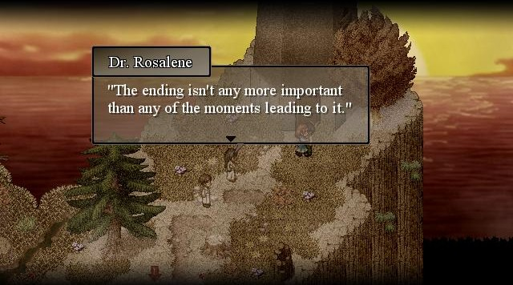
