# Сравнение семи инструментов для AI-программирования

## Введение к главе

Когда доступно так много инструментов для AI-программирования, какой из них подходит именно вам? Эта глава предлагает углублённую сравнительную оценку 7 основных платформ Web Vibe Coding, включая Lovable, Replit и Z.ai, на основе единой практической задачи: разработки игры «Snake + написание стихов с помощью AI». Мы сравним их по множеству параметров, включая дружелюбность к новичкам, управляемость кода и удобство развёртывания, помогая вам быстро выбрать лучший инструмент-помощник для разработки.

---

# 1. Создание игры Snake с помощью Vibe Coding: полное практическое руководство

В этой статье представлена новая практика разработки программного обеспечения — «Vibe Coding», которая использует искусственный интеллект для ускорения процесса создания приложений.

Далее мы последовательно представим основные концепции Vibe Coding, объясним, что такое AI Agents, и предоставим практические методы написания промптов. В конце мы дадим полное практическое руководство по созданию игры «Snake» с нуля, а также подробные сравнительные оценки нескольких ведущих платформ Vibe Coding, чтобы помочь вам выбрать оптимальную комбинацию инструментов для себя.

## Чему вы научитесь:

- **Что такое Vibe Coding:** поймёте его определение, рабочий процесс и ключевые преимущества.
- **Роль AI Agents:** поймёте, как работают AI Agents и чем они отличаются от традиционных программ.
- **Как писать хорошие промпты:** освоите написание ясных и конкретных промптов для достижения лучших результатов.
- **Инструменты Vibe Coding:** познакомитесь с основными платформами для AI-программирования и дизайна.
- **Сравнение платформ:** оцените и сравните преимущества и недостатки 7 различных платформ AI Agent с точки зрения новичка.
- **Инструменты UI/UX:** научитесь интегрировать инструменты UI/UX, такие как Figma и Mastergo, в свой общий рабочий процесс.

## 1. Введение

На предыдущих уроках мы использовали модель полнофункциональной разработки от z.ai для выполнения задач программирования.

Однако задумывались ли мы когда-нибудь: её ядром на самом деле является «AI Agent» (в отличие от обычного чат-ориентированного AI, и гораздо более интеллектуальный)? Дело в том, что он не просто общается с вами — он также может думать (когда вы даёте ему задачу, он сначала составляет план) и активно предпринимать действия (например, вызывать веб-поиск, выполнять компьютерные команды, открывать веб-страницы и т. д.). Мы подробно расскажем об этом позже.

## 1. Что такое Vibe Coding?

Vibe Coding — это новый метод разработки программного обеспечения, который использует AI для ускорения процесса разработки приложений. Это не замена традиционного программирования, а скорее более «разговорная» модель программирования. Эта концепция была предложена AI-исследователем Андреем Карпати: в этом рабочем процессе разработчики больше не пишут код строка за строкой, а в основном направляют AI Agents для генерации, оптимизации и отладки приложений.

Основная идея Vibe Coding смещается от **«сначала код»** к **«сначала намерение»**. Вам больше не нужно начинать с первой строки кода — вы описываете желаемый результат на естественном языке.

Типичный рабочий процесс Vibe Coding — это итеративный цикл:

- **Описание цели:** сначала опишите функцию, которую хотите реализовать, в одном предложении или абзаце, например: «Сделай простую игру Snake с бэкендом на Python, который может генерировать стихи».
- **AI генерирует код:** AI Agent разбирает ваши требования и генерирует первую версию кода, включая базовую структуру, фронтенд-страницы и логику бэкенда.
- **Запуск и наблюдение:** запустите сгенерированный код, проверьте, работает ли он как ожидалось, и обнаружьте баги или недостатки.
- **Обратная связь и итерация:** если есть ошибки или результаты неудовлетворительны, продолжайте давать инструкции в диалоге, например: «Змейка движется слишком медленно, ускорь её» или «API Key в файле `.env` считывается некорректно, пожалуйста, исправь код бэкенда».
- **Повторение:** непрерывно итерируйте через цикл «описание → генерация → запуск → обратная связь», пока приложение не достигнет удовлетворительного состояния.

### Основные преимущества Vibe Coding:

- **Более низкий порог входа:** позволяет дизайнерам, предпринимателям, студентам и другим людям без опыта программирования участвовать в разработке приложений через естественный язык.
- **Более быстрое прототипирование:** значительно сокращает время от идеи до минимально жизнеспособного продукта (MVP).
- **Повышение эффективности:** автоматически выполняет большой объём повторяющейся механической работы по написанию кода (например, шаблонного кода), позволяя разработчикам сосредоточиться на проектировании архитектуры и абстрагировании проблем.
- **Поощрение экспериментов:** способствует подходу быстрого вывода результата с последующим непрерывным улучшением, облегчая опробование новых идей и функций.


---

## 2. Что такое AI Agent?

Так что же на самом деле такое AI Agent? Проще говоря, AI Agent — это AI-система, которая может **воспринимать окружение, принимать решения и предпринимать действия** для достижения конкретных целей. По сравнению с простыми чат-ботами, которые только отвечают на промпты, AI Agents обладают следующими ключевыми характеристиками:

### 2.1 Основные возможности AI Agents

| Возможность | Описание | Пример |
|------------|-------------|---------|
| **Планирование** | Разбивает сложные задачи на несколько шагов | При запросе «создать блог» автоматически создаёт подзадачи: спроектировать базу данных, написать API, построить фронтенд и т. д. |
| **Использование инструментов** | Вызывает внешние инструменты для расширения возможностей | Использует браузер для поиска информации, выполняет код, читает/записывает файлы |
| **Память** | Сохраняет контекст и учится на взаимодействиях | Запоминает предпочтения пользователя, ссылается на предыдущую историю диалога |
| **Рефлексия** | Оценивает результаты действий и корректирует стратегии | При сбое кода анализирует ошибку и пробует альтернативные решения |

### 2.2 AI Agent против традиционных программ

Сравним AI Agents с традиционными программами:

| Параметр | Традиционные программы | AI Agents |
|-----------|----------------------|-----------|
| **Логика** | Жёстко закодирована разработчиками | Изучена на огромных объёмах данных |
| **Ввод** | Структурированные данные (JSON, база данных) | Естественный язык, любая форма |
| **Вывод** | Детерминированные результаты | Генеративный, креативный контент |
| **Адаптивность** | Требует изменений кода для изменения поведения | Может адаптироваться через промпты или дообучение |

### 2.3 Как работают AI Agents

Принцип работы AI Agents можно описать как цикл обратной связи:

```
Goal → Perception → Planning → Action → Evaluation → (Loop)
```

1. **Постановка цели:** пользователь предоставляет цель задачи на естественном языке.
2. **Восприятие:** Agent понимает цель и собирает релевантную информацию.
3. **Планирование:** Agent разбивает цель на выполнимые шаги.
4. **Действие:** Agent выполняет план, потенциально вызывая различные инструменты.
5. **Оценка:** Agent оценивает результаты действия.
6. **Цикл:** на основе оценки Agent корректирует и продолжает цикл, пока цель не будет достигнута.

Это похоже на то, как работает человек-разработчик: понимание требований → составление плана → написание кода → тестирование → исправление багов → итерация.

---

## 3. Как писать хорошие промпты

В Vibe Coding качество промптов напрямую определяет качество вывода AI. Вот несколько практических советов по написанию промптов:

### 3.1 Базовые принципы

1. **Будьте конкретны:** чётко описывайте, чего хотите достичь, избегая расплывчатых формулировок.
   - ❌ «Сделай сайт»
   - ✅ «Сделай личный блог с шапкой, списком статей и разделом комментариев»

2. **Предоставляйте контекст:** дайте AI достаточно справочной информации, чтобы он мог сгенерировать более релевантный код.
   - ❌ «Напиши функцию входа»
   - ✅ «Напиши функцию входа с использованием JWT, сохраняя токены в localStorage, со сроком действия 7 дней»

3. **Определяйте ограничения:** указывайте технические требования и ограничения.
   - ❌ «Напиши API»
   - ✅ «Напиши RESTful API с использованием Express.js, следуя соглашениям REST, возвращая данные в формате JSON»

4. **Итеративное уточнение:** начинайте с простых требований, затем постепенно добавляйте сложность.

### 3.2 Шаблон структуры промпта

Хороший промпт может следовать такой структуре:

```
[Role/Context] + [Task Description] + [Technical Requirements] + [Expected Output]

Example:
"As a full-stack developer, create a user registration API using Node.js + Express + MongoDB. 
The API should validate email format, hash passwords with bcrypt, and return JWT tokens. 
Provide complete code with error handling and comments."
```

### 3.3 Распространённые паттерны промптов

| Паттерн | Описание | Пример |
|---------|-------------|---------|
| **Пошаговый** | Просите AI разбить сложные задачи | «Сначала создай схему базы данных, затем напиши API, наконец построй фронтенд» |
| **На основе примера** | Предоставьте примеры для ориентира | «По аналогии со страницей входа на https://example.com, создай страницу регистрации» |
| **Ролевая игра** | Назначьте конкретную роль | «Как senior frontend-инженер, проверь этот код на React и укажи на проблемы с производительностью» |
| **На основе ограничений** | Подчеркните ограничения | «Используй только vanilla JavaScript, без внешних библиотек» |

---

## 4. Практика: создание игры Snake

Теперь применим это на практике! Мы создадим игру Snake с функцией генерации стихов AI, используя Vibe Coding.

### 4.1 Требования к проекту

**Основные функции:**
1. Классический геймплей Snake — управляйте змейкой, чтобы есть еду, избегая столкновений со стенами или самой собой
2. Сбор слов — когда змейка движется, она собирает английские слова, появляющиеся на поле
3. Генерация стихов AI — выберите собранные слова, чтобы сгенерировать стихи с помощью DeepSeek API
4. Сохранение данных — коллекции слов сохраняются между несколькими раундами

**Технические требования:**
- Фронтенд: рендеринг игры на HTML5 Canvas
- Бэкенд: API-сервис, интегрированный с DeepSeek
- Управление состоянием: сохранение запаса слов между игровыми сессиями

### 4.2 Шаги реализации

#### Шаг 1: опишите проект

Сначала опишите цель вашего проекта AI Agent:

> «Создай веб-приложение игры Snake со следующими функциями:
> 1. Классический геймплей Snake с управлением клавиатурой
> 2. Сбор слов: слова появляются случайным образом на поле, змейка собирает их, поедая
> 3. Запас слов: собранные слова отображаются в боковой панели
> 4. Генерация стихов AI: выберите слова и нажмите «Generate Poem», чтобы вызвать DeepSeek API и сгенерировать стихотворение
> 5. Сохранение слов: использованные слова удаляются или уменьшаются в запасе
> 6. Навигация: простые вкладки или верхнее меню для переключения между двумя страницами
> 7. Общее состояние: обеспечьте синхронизацию собранных слов и их видимость на обеих страницах»

#### Шаг 2: AI генерирует код

AI Agent проанализирует ваши требования и сгенерирует начальную структуру кода:

- Бэкенд: сервер Express.js, интеграция с DeepSeek API
- Фронтенд: игра на HTML5 Canvas, управление запасом слов
- База данных: простое хранилище в памяти или на основе файлов

#### Шаг 3: тестирование и итерация

Запустите код и проверьте, соответствует ли он ожиданиям:

- Работает ли игра корректно?
- Правильно ли функционирует сбор слов?
- Работает ли генерация стихов AI?
- Есть ли какие-либо баги или проблемы?

Если возникают проблемы, продолжайте уточнять через диалог:

> «Змейка движется слишком медленно, пожалуйста, увеличь скорость»
> «Запас слов отображается некорректно, пожалуйста, проверь управление состоянием»
> «Вызов API завершился неудачей, пожалуйста, добавь обработку ошибок»

### 4.3 Ключевые технические моменты

В процессе разработки обратите внимание на следующие моменты:

1. **Игровой цикл:** используйте `requestAnimationFrame` для плавного рендеринга
2. **Обнаружение столкновений:** проверяйте, пересекается ли голова змейки с едой, стенами или самой собой
3. **Управление состоянием:** обеспечьте синхронизацию запаса слов между страницей игры и страницей стихов
4. **Безопасность API:** храните ключи API в файлах `.env`, добавляйте их в `.gitignore` для предотвращения утечки
5. **Обработка ошибок:** добавляйте блоки try-catch для вызовов API, предоставляйте понятные пользователю сообщения об ошибках

### 4.4 Запуск проекта

**Фронтенд:**
```bash
# If using a simple static file
open index.html

# If using a development server
npm run dev
```

**Бэкенд:**
```bash
npm install
# Set your DeepSeek API key in .env
echo "DEEPSEEK_API_KEY=your_api_key" > .env
npm start
```

- **Отображайте один и тот же общий запас слов.**
- **Пользователь выбирает несколько слов и нажимает кнопку **Generate Poem**.**
- **Отправьте эти слова на бэкенд, где DeepSeek API генерирует стихотворение.**
- **После генерации стихотворения использованные слова удаляются или уменьшаются в запасе.**
- **Навигация:** простая вкладка или верхнее меню для переключения между двумя страницами.
- **Общее состояние:** обеспечьте синхронизацию собранных слов и их видимость на обеих страницах.

- **Пример результата**


---

# 5. Сравнение платформ AI Agent (выбор лучшей комбинации для простых проектов)

Разные платформы Vibe Coding имеют свои особенности и рабочие процессы. Мы протестировали несколько платформ, используя одни и те же требования «игра Snake с DeepSeek API», оценивая их сильные и слабые стороны с точки зрения новичка. Вот сводка.

## 1. Критерии сравнения

1. **Цель**
   Создать веб-приложение Snake (змейка), интегрированное с DeepSeek API.

2. **Детали игры**
   1. Игра генерирует стихи через DeepSeek LLM API.
   2. Змейка ест английские слова; собранные слова сохраняются после окончания игры и продолжают использоваться в новых раундах. Одно и то же слово можно собирать несколько раз, и оно учитывается отдельно.
   3. Когда генерируется стихотворение, использованные слова удаляются из запаса.

3. **Обязательные функции**
   1. Работающая фронтенд-страница, содержащая игру Snake (управление клавиатурой, рендеринг на Canvas).
   2. Механизм сбора слов (слова появляются на поле, список в боковой панели обновляется, когда змейка съедает слово).
   3. Сохранение запаса слов между несколькими игровыми раундами.
   4. Бэкенд с использованием DeepSeek API (если нет API Key, можно сначала возвращать тестовые стихи).
   5. Кнопка «Generate Poetry»: при нажатии вызывает бэкенд, отображает стихи и обновляет запас слов в зависимости от использования.
   6. Поддержка API Key через `.env` и предотвращение утечки ключа через `.gitignore`.

4. **Желательные функции**
   1. Пользователи могут выбирать, какие слова использовать для генерации стихов.
   2. Хороший пользовательский опыт (например, понятная боковая панель со списком слов, хорошо оформленная область отображения стихов).
   3. Добавление комментариев в код для новичков, объясняющих ключевую логику.

## 2. Сравнение вывода кода

### 1. Lovable (на основе Web)

- **Тип платформы:** Web
- **Ключевые функции и рабочий процесс:** Lovable очень хорошо справляется с интеграцией и совместной работой. Она автоматически выполняет задачи инициализации, такие как подключение к базам данных Supabase, делая процесс настройки проекта очень плавным. Вам нужно только описать требования к проекту, и Agent поможет подключить различные сервисы и построить базовую структуру.
- **Подходящие пользователи:** для новичков, впервые пробующих Vibe Coding, Lovable — очень дружелюбный выбор. Она упрощает сложность интеграции нескольких сервисов, позволяя вам сосредоточиться на промптах и итерациях, а не на настройке окружения. Благодаря высокой автоматизации вы можете быстро получить работающий прототип.
- **Процесс работы с промптами:**
  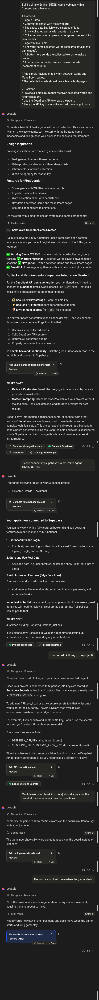
- **Результаты игры Snake:**


- **Цена:** относительно дорого, но если у вас есть учебная электронная почта, вы можете подтвердить статус студента и использовать её за полцены.
  

### 2. Cursor (IDE)

- **Тип платформы:** настольное приложение (PC)
- **Ключевые функции и рабочий процесс:** Cursor — это проприетарная IDE с интегрированными возможностями AI, поддерживающая Windows, macOS и Linux. Она встраивает такие функции, как генерация кода, интеллектуальное переписывание и запросы к кодовой базе, прямо в среду разработки. По сравнению с веб-инструментами она ближе к традиционному опыту локальной разработки. Поскольку это локальное окружение, разные компьютеры имеют различные конфигурации, и иногда вы будете сталкиваться с проблемами, связанными с окружением. Преимущество в том, что проект находится на вашей машине — нет необходимости отдельно скачивать или настраивать среду выполнения, так как Cursor выполняет за вас много рутинных шагов.
- **Подходящие пользователи:** для пользователей с некоторой базой программирования Cursor — очень мощная и знакомая среда. Однако для полных новичков без базы вам потребуется самостоятельно разбираться в структуре проекта, управлении зависимостями и концепциях организации файлов, что имеет более крутую кривую обучения. Больше подходит для разработчиков, которые хотят добавить AI-помощников в традиционные рабочие процессы кодирования.
- **Процесс работы с промптами:**
  
- **Результаты игры Snake:**


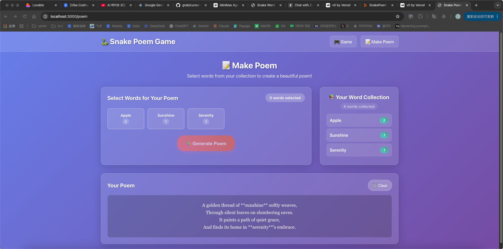

- **Цена:**
  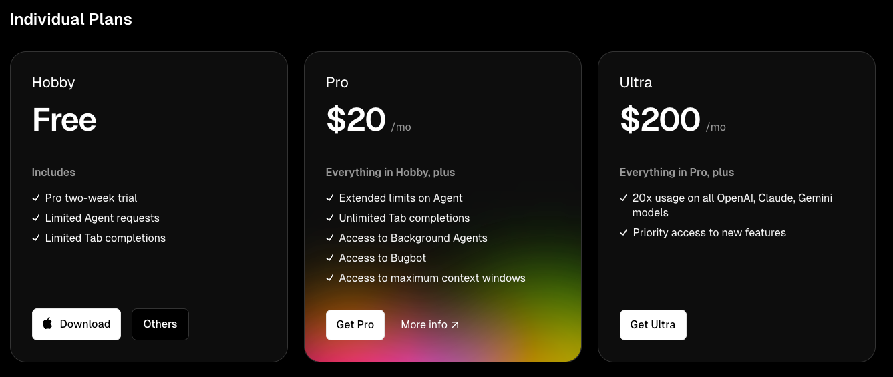

### 3. Z.ai (на основе Web)

- **Тип платформы:** Web
- **Ключевые функции и рабочий процесс:** использование Z.ai относительно простое, но явная сложность заключается в том, что вам нужно **вручную копировать и вставлять сгенерированный код**. На платформе отсутствует окно предпросмотра в реальном времени, что затрудняет немедленное наблюдение за результатом выполнения кода.
- **Подходящие пользователи:** эта платформа требует более «практического» подхода в использовании. Отсутствие автоматизации означает, что вы должны взаимодействовать с кодом напрямую, что на самом деле может быть своего рода тренировкой для тех, кто хочет глубоко понять вывод AI. Однако частое копирование и вставка приносят проблемы с эффективностью и риски ошибок. Больше подходит для студентов, которые хотят увидеть «сырой код, выводимый AI», а не для тех, кто ищет опыт в один клик.
- **Процесс работы с промптами:**
  
- **Результаты игры Snake:**

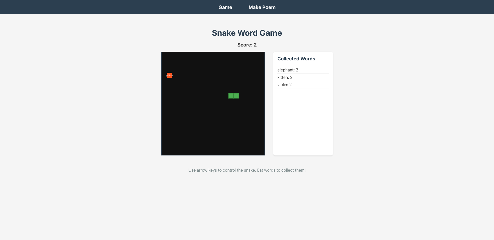
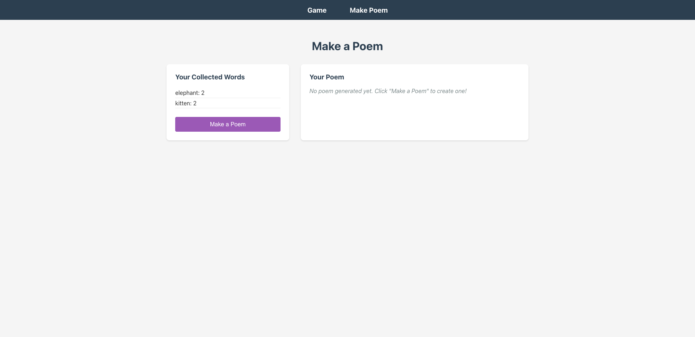

- **Цена:**
  

### 4. Replit (на основе Web)

- **Тип платформы:** Web
- **Ключевые функции и рабочий процесс:** Replit — это универсальная онлайн-среда разработки и развёртывания: вы можете писать код, запускать программы и генерировать ссылки для онлайн-доступа прямо в браузере. Перед началом кодирования она даёт вам понятный план действий; она также предоставляет визуальный редактор, где вы можете напрямую изменять UI в окне предпросмотра, а исходный код автоматически синхронизируется. Это позволяет вам в любой момент проверить, соответствует ли вывод AI ожиданиям, значительно сокращая количество циклов исправлений.

  

- **Подходящие пользователи:** Replit очень дружелюбен к новичкам. Он упрощает весь цикл от кодирования до развёртывания — нет необходимости отдельно настраивать серверы или хостинг-сервисы. Функции совместной работы также сильны, что делает его подходящим для одноклассников, работающих над проектами вместе, или для удалённой проверки кода другими.
- **Процесс работы с промптами:** в процессе сборки AI поначалу не полностью понял требования — потребовалось около 3 раундов итераций, прежде чем итоговый результат достиг идеального состояния.
  
- **Результаты игры Snake:**


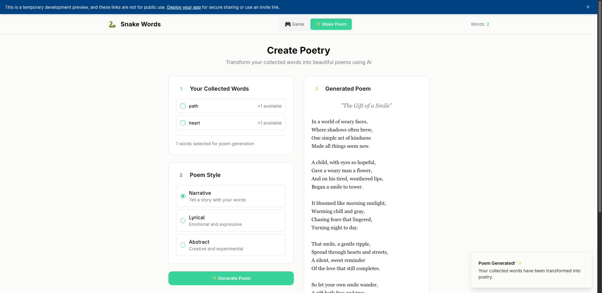

- **Цена:**
  

### 5. Bolt.new (на основе Web)

- **Тип платформы:** Web
- **Ключевые функции и рабочий процесс:** Bolt.new похож на Lovable, представляя собой среду разработки Web + AI. Он может автоматически генерировать каркас проекта и предлагает предпросмотр в реальном времени. По сравнению с Lovable, Bolt.new предоставляет больше контроля над разработкой, позволяя вам напрямую изменять файлы в браузере и настраивать инструменты сборки.
- **Подходящие пользователи:** для разработчиков, которые хотят больше контроля, но не хотят настраивать локальное окружение, Bolt.new предлагает хороший баланс. Он позволяет быстро начать работу, сохраняя при этом гибкость для настройки конфигураций.
- **Процесс работы с промптами:**
  
- **Результаты игры Snake:**

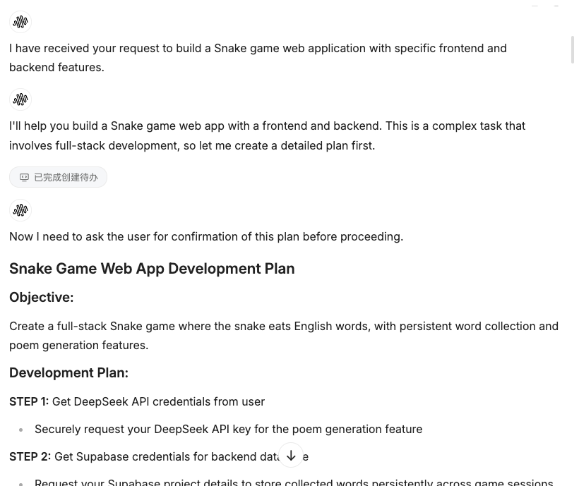
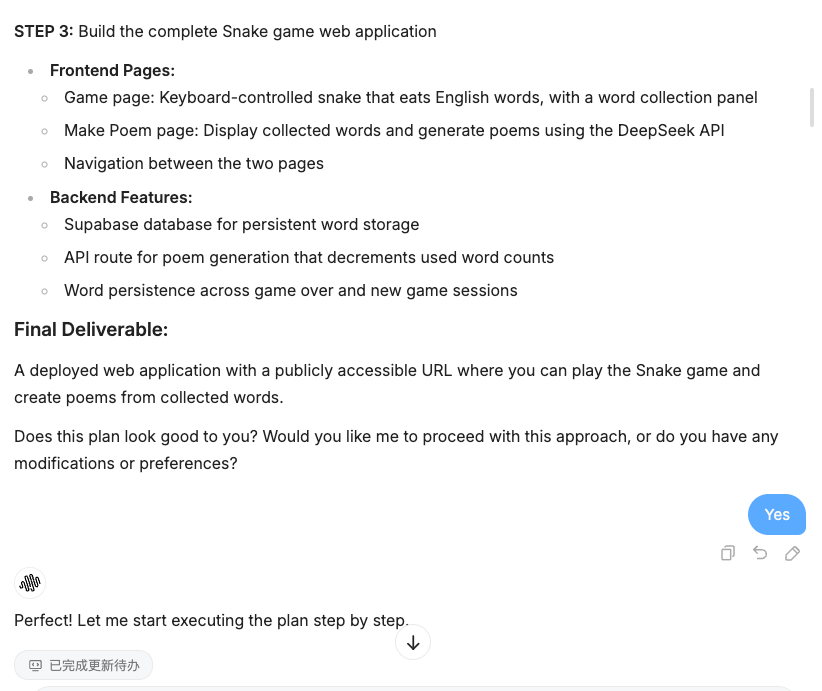

- **Цена:**
  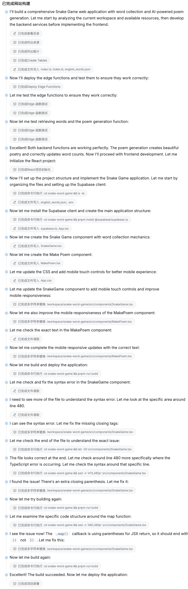

### 6. Claude Dev (на основе Web)

- **Тип платформы:** Web (VS Code в браузере)
- **Ключевые функции и рабочий процесс:** Claude Dev — это, по сути, браузерная версия Cursor, предоставляющая полноценную среду разработки наподобие VS Code в вебе. Она поддерживает управление файлами, терминал и различные расширения. Преимущество в том, что вам не нужно ничего устанавливать — просто откройте браузер, чтобы начать кодировать.
- **Подходящие пользователи:** для пользователей, которым нравится рабочий процесс Cursor, но которые не хотят устанавливать настольное ПО, или для тех, кому нужно кодировать на разных устройствах, Claude Dev — отличная альтернатива.
- **Процесс работы с промптами:**
  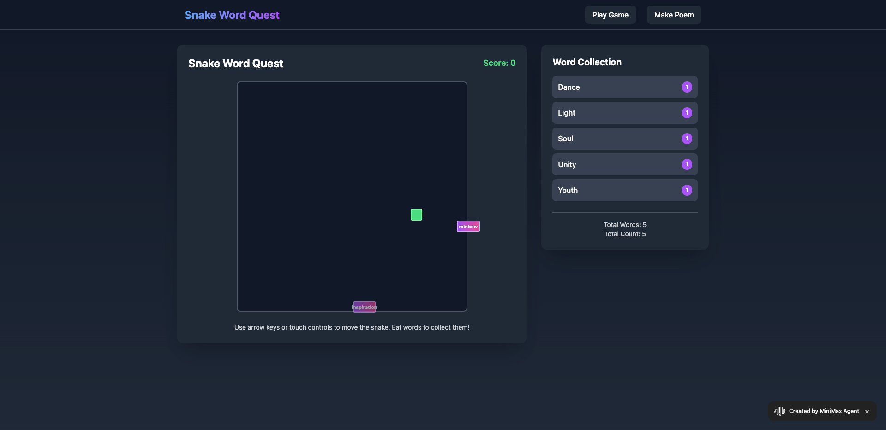
- **Результаты игры Snake:**


- **Цена:**
  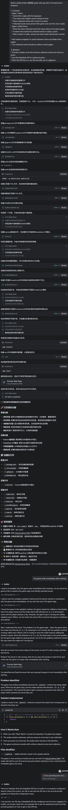

### 7. GitHub Copilot (плагин для IDE)

- **Тип платформы:** плагин для IDE (VS Code, JetBrains и др.)
- **Ключевые функции и рабочий процесс:** GitHub Copilot — это не полноценная платформа разработки, а AI-помощник по кодированию, который интегрируется в вашу существующую IDE. Он предоставляет предложения по коду, автодополнение и может помогать объяснять и рефакторить код. Он работает локально, не отправляя код в облако, обеспечивая лучшую приватность и безопасность.
- **Подходящие пользователи:** для разработчиков, у которых уже настроена среда разработки и которые хотят повысить продуктивность с помощью AI-помощи. Не подходит для полных новичков, которые ещё не настроили локальное окружение.
- **Процесс работы с промптами:** Copilot работает иначе — он предоставляет встроенные подсказки по мере того, как вы печатаете, а не генерирует целые проекты через диалоги. Вы можете писать комментарии или имена функций, и Copilot предложит реализации.
  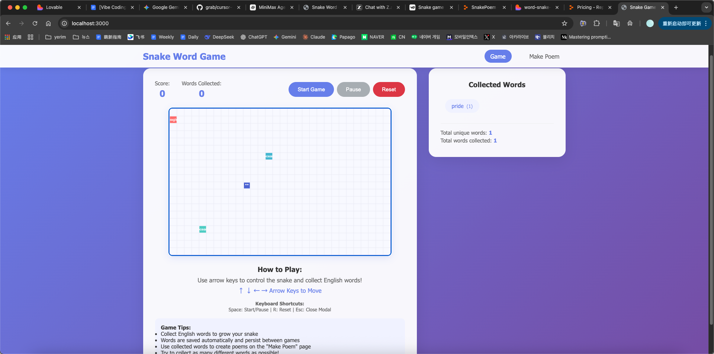
- **Результаты игры Snake:**

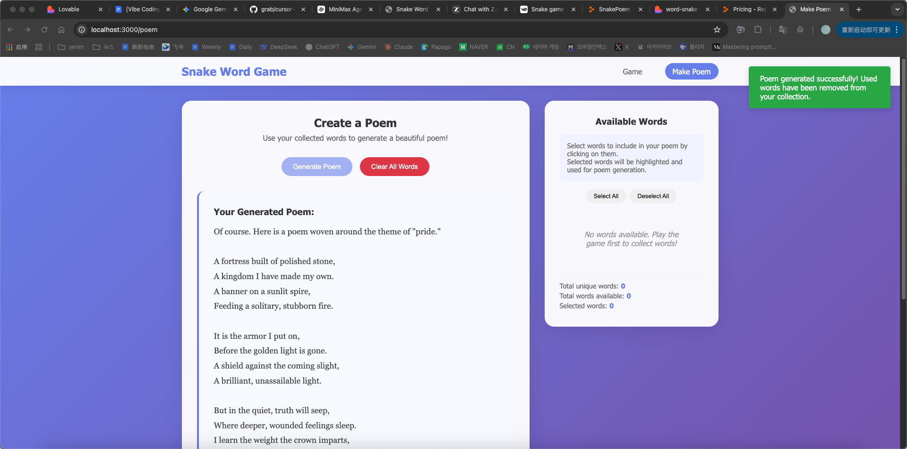


- **Цена:**
  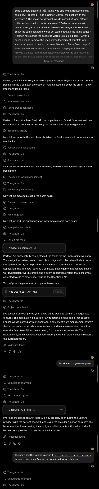

## 3. Итоги и рекомендации

### 3.1 Сводка сравнения платформ

| Платформа | Тип | Дружелюбность к новичкам | Контроль над кодом | Развёртывание | Цена |
|----------|------|---------------------|--------------|------------|-------|
| Lovable | Web | ⭐⭐⭐⭐⭐ | ⭐⭐⭐ | ⭐⭐⭐⭐⭐ | Высокая |
| Cursor | Настольное | ⭐⭐⭐ | ⭐⭐⭐⭐⭐ | ⭐⭐⭐ | Бесплатно/Платно |
| Z.ai | Web | ⭐⭐⭐ | ⭐⭐⭐⭐ | ⭐⭐ | Бесплатно |
| Replit | Web | ⭐⭐⭐⭐ | ⭐⭐⭐ | ⭐⭐⭐⭐ | Бесплатно/Платно |
| Bolt.new | Web | ⭐⭐⭐⭐ | ⭐⭐⭐⭐ | ⭐⭐⭐⭐ | Бесплатно/Платно |
| Claude Dev | Web | ⭐⭐⭐ | ⭐⭐⭐⭐⭐ | ⭐⭐ | Бесплатно/Платно |
| Copilot | Плагин | ⭐⭐ | ⭐⭐⭐⭐⭐ | N/A | Платно |

### 3.2 Рекомендации по выбору

- **Полные новички:** попробуйте **Lovable** или **Replit** — они предлагают самый плавный опыт с минимальной настройкой.
- **Те, у кого есть база программирования:** **Cursor** или **Claude Dev** обеспечивают наибольший контроль.
- **Студенты с ограниченным бюджетом:** **Z.ai** или бесплатные тарифы **Replit/Bolt.new** — хороший выбор.
- **Те, кто ищет баланс:** **Bolt.new** предлагает хороший баланс между простотой использования и контролем.

### 3.3 Будущие тенденции

Vibe Coding быстро развивается. Мы можем ожидать:

1. **Более мощные Agents:** будущие AI Agents будут обладать более сильными способностями к рассуждению и планированию.
2. **Более глубокая интеграция:** бесшовная интеграция с большим числом инструментов и сервисов разработки.
3. **Более низкие барьеры:** даже нетехнические пользователи смогут создавать сложные приложения.
4. **Новые рабочие процессы:** появление новых моделей разработки за пределами традиционного кодирования.

---

## 6. AI-инструменты для дизайна: интеграция Figma в ваш рабочий процесс

Помимо инструментов для AI-программирования, инструменты для дизайна на базе AI также становятся незаменимыми для рабочих процессов Vibe Coding. В этом разделе рассказывается, как интегрировать такие инструменты, как Figma, в процесс разработки.

### 6.1 Распространённые AI-инструменты для дизайна

| Инструмент | Функции | Подходит для |
|------|----------|---------------|
| **Figma (с AI)** | Функции дизайна на базе AI, авторазметка, предложения компонентов | UI/UX-дизайн |
| **Mastergo** | Локализация на китайский, дизайн с поддержкой AI, функции совместной работы | Продукты для китайского рынка |
| **Uizard** | Преобразование вайрфреймов в дизайн на базе AI | Быстрое прототипирование |
| **Galileo AI** | Генерация UI из текста | Быстрая визуализация идей |

### 6.2 Интеграция инструментов дизайна с Vibe Coding

Типичный рабочий процесс:

1. **Этап дизайна:** используйте AI-инструменты дизайна для создания UI-макетов
2. **Передача (handoff):** экспортируйте спецификации дизайна или используйте плагины для интеграции с разработкой
3. **Реализация:** AI Agent читает спецификации дизайна и реализует код

### 6.3 Практика: использование Figma с Vibe Coding

**Шаг 1: создание дизайна в Figma**
- Используйте AI-функции Figma для быстрой генерации макетов
- Или проектируйте вручную и используйте помощь AI для улучшений

**Шаг 2: передача (handoff) в разработку**
- Используйте «Developer Mode» в Figma для просмотра спецификаций
- Или используйте плагины, такие как «Anima», для экспорта кода

**Шаг 3: реализация в Vibe Coding**
- Опишите дизайн вашему AI Agent
- Agent генерирует код, соответствующий дизайну

### 6.4 Практические советы

1. **Сохраняйте дизайн простым:** начинайте с простых дизайнов, постепенно добавляя сложность
2. **Используйте дизайн-системы:** создавайте согласованные библиотеки компонентов
3. **Используйте AI-функции:** полноценно используйте функции дизайна с поддержкой AI
4. **Итерируйте быстро:** быстро итерируйте на основе предложений, сгенерированных AI

---

## 7. Итоги

В этой главе мы рассмотрели:

1. **Концепция Vibe Coding:** новая парадигма разработки, использующая AI для ускорения создания приложений
2. **Технология AI Agent:** основные возможности и принципы работы AI Agents
3. **Инженерия промптов:** техники написания эффективных промптов
4. **Практика:** создание полноценной игры Snake с генерацией стихов AI
5. **Сравнение платформ:** подробная оценка 7 основных платформ Vibe Coding
6. **Интеграция инструментов дизайна:** как включить AI-инструменты дизайна в ваш рабочий процесс

Vibe Coding представляет собой будущее разработки программного обеспечения. По мере того как технология AI продолжает развиваться, барьер для разработки ПО будет становиться всё ниже. Мы призываем всех принять эту новую парадигму и начать своё путешествие в Vibe Coding!

**Следующие шаги:**
- Выберите платформу и начните свой первый проект Vibe Coding
- Практикуйте навыки написания промптов
- Изучите AI-инструменты для дизайна
- Присоединитесь к сообществу Vibe Coding, чтобы учиться у других

Happy Vibe Coding! 🚀


