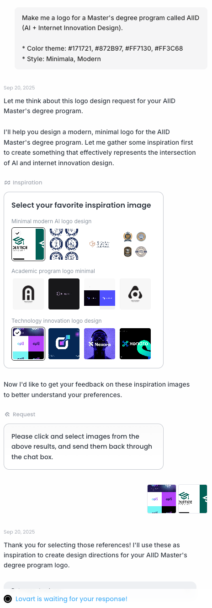
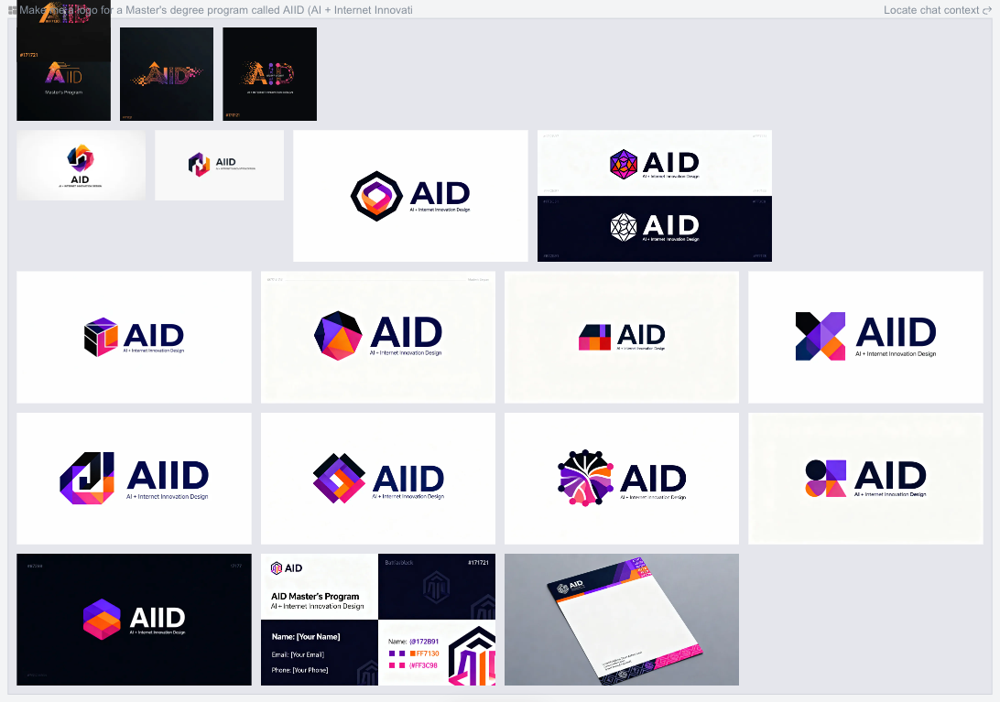
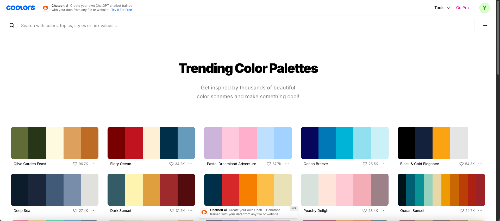
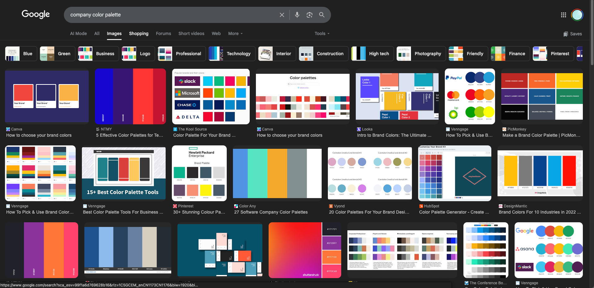
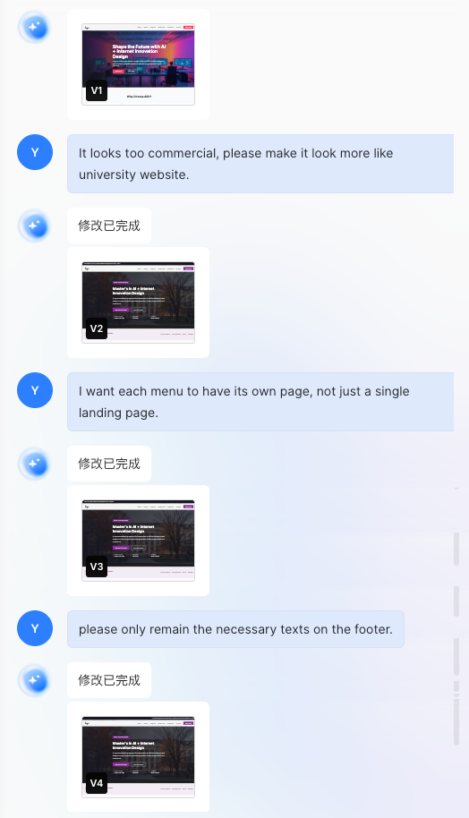

# Проектирование сайтов с помощью агентов для дизайна и программирования

## Введение к главе

Эта глава демонстрирует, как дизайн и разработка могут идеально работать вместе благодаря AI. Вы сыграете роль продакт-менеджера, направляя «Design Agent» для создания дизайна логотипа, цветовых схем и макетов страниц, а затем будете сотрудничать с «Programming Agent», чтобы превратить визуальные макеты в работающий код. Испытайте полную цепочку разработки на базе AI — от творческого замысла до запуска сайта, делая одного человека равноценным целой команде.

---

# 1. Руководство по началу работы

## 1. Введение к руководству

Давайте используем AI Design Agents и Coding Agents для создания полноценного сайта с нуля.

- **Design Agent**: отвечает за создание логотипов, макетов веб-страниц, цветовых схем и других визуальных элементов
- **Coding Agent**: пишет реальный код (HTML/CSS/JS и т. д.) на основе требований и макетов, которые вы предоставляете в промптах, чтобы построить работающий сайт

## 2. Design Agents против Coding Agents

- **Design Agent**: AI, который генерирует изображения, макеты страниц или стили дизайна на основе предоставленных вами промптов.
  - Mastergo
  - Lovart
  - Figma MCP
- **Coding Agent**: AI, который пишет реальный код (HTML/CSS/JS и т. д.) на основе функциональности и макета, которые вы запрашиваете в промптах.
  - Z.AI
  - Trae
  - Cursor
  - Lovable

---

# 2. Использование Design Agent для создания логотипа

## 1. Ключевые элементы, которые следует учитывать при проектировании логотипа

Логотип — один из ключевых элементов, определяющих первое впечатление о вашем сайте. Чтобы получить удовлетворительные результаты от AI Design Agents, вам нужно чётко описать в промпте тип логотипа, который вы хотите.

1. **Название бренда / Текст**

- Текст, который обязательно должен присутствовать в логотипе (например, заголовок сайта, название бренда и т. д.).

2. **Стиль (Настроение / Атмосфера)**

- Общее ощущение или атмосфера, которую логотип хочет передать.
- _Примеры: минималистичный, милый, простой, современный, винтажный, футуристический и т. д._

3. **Цветовая схема** (Опционально)

- Лучше всего, если цвета логотипа соответствуют общему тону всего сайта.
- Вы можете указать конкретные шестнадцатеричные коды цветов или общие цветовые тона (холодные, тёплые и т. д.).
- _Примеры: **`#171721`** (чёрный), **`#FF7130`** (оранжевый)._

4. **Форма (Очертание / Структура)**

- Чётко укажите, нужна ли логотипу определённая форма или композиция.
- _Примеры: текст внутри круга, комбинация иконки и текста, логотип с акцентом на иконку и т. д._

5. **Элементы иконки / символа** (Опционально)

- Графика или символы, которые вы хотите видеть в логотипе.
- _Примеры: иконка книги, символ молнии, графика, связанная с AI, абстрактные геометрические формы и т. д._

## 2. Написание промптов для дизайна логотипа

**Примеры промптов**

```
"Please design a minimalist-style logo for me, with the brand name 'My First Website'.
Use black (#171721) and orange (#FF7130), and place the text inside a circle."
```

```
"Design a logo with the brand name 'AIID'.
The overall style should be futuristic, clean, and simple, with blue and white as the main colors.
Combine abstract graphics symbolizing AI with the text, and export as a PNG with a transparent background."
```

## 3. Запрос дизайна у Agent

- Введите приведённые выше промпты → сравните несколько дизайнов, сгенерированных Agent.



## 4. Финализация логотипа

- Выберите понравившуюся версию из черновиков и скачайте её.

---

# 3. Планирование структуры вашего сайта

## 1. Понимание базовых разделов

Прежде чем фактически начать создавать сайт, очень важно спланировать, какие меню (разделы) включить. Дизайн меню зависит от того, что вы хотите показать посетителям и какие действия хотите, чтобы они совершили.
Как правило, сайты обычно состоят из базовых разделов, таких как **Home / About / Contact**.

## 2. Нарисуйте собственный структурный набросок (Опционально)

Вы можете сначала набросать простую структуру меню на основе целей сайта.

---

# 4. Использование Design Agent для создания макета страницы

## 1. Промпты для дизайна макета страницы

**Примеры промптов**

```
"Please create a website layout with the following requirements:
- Color scheme: black (#171721) background, white text, orange (#FF7130) accents
- Sections: Home, About, Services, Contact
- Home: Hero section with large headline, CTA button, and service highlights
- About: Company introduction with team member photos
- Services: Grid layout showing services offered
- Contact: Simple contact form with email and social media links
- Style: Modern, minimalist, with smooth scroll animations"
```

```
"Design a landing page for an AI tools collection website.
- Primary colors: purple (#7C3AED) and dark gray (#1F2937)
- Hero: Centered title 'AI Tools Hub', subtitle, and 'Explore Now' button
- Features: 3-column grid showing tool categories
- Each card should have an icon, title, and brief description
- Footer: Copyright and social links
- Include responsive design considerations"
```

## 2. Запрос дизайна макета у Agent

- Введите свои требования → Agent генерирует макеты → дорабатывайте на основе обратной связи



## 3. Создание цветовой палитры

**Пример промпта**

```
"Create a color palette for a tech blog website.
- Primary: Deep blue
- Accent: Vibrant orange
- Background: Light gray for readability
- Text: Dark gray for contrast
Please provide hex codes for each color and explain their usage."
```



## 4. Выбор типографики

**Пример промпта**

```
"Recommend font pairings for a modern tech website.
- Heading font: Something bold and distinctive
- Body font: Clean and readable
Please suggest specific Google Fonts."
```

---

# 5. Интеграция дизайна с Coding Agent

## 1. Подготовка спецификаций дизайна

Перед передачей Coding Agent подготовьте:

1. **Файл логотипа** (PNG с прозрачным фоном)
2. **Коды цветов** (шестнадцатеричные значения для основных, дополнительных и акцентных цветов)
3. **Типографика** (названия шрифтов, размеры, насыщенность)
4. **Описание макета** (структура разделов, отступы, адаптивное поведение)

## 2. Написание промптов для кодинга

**Пример промпта**

```
"Build a responsive website based on the following specifications:

**Brand**
- Logo: [attach logo file]
- Name: My First Website

**Colors**
- Primary Background: #171721 (dark)
- Text: #FFFFFF (white)
- Accent: #FF7130 (orange)

**Sections**
1. Home - Hero with headline 'Welcome to My First Website', subtitle, and 'Get Started' button
2. About - Brief company introduction (2-3 sentences)
3. Services - 3 service cards in a row
4. Contact - Simple form with name, email, message fields

**Requirements**
- Use semantic HTML5
- Include CSS animations for smooth transitions
- Mobile responsive (stack sections on mobile)
- Use CSS flexbox/grid for layout
- Add subtle hover effects on buttons and cards

Please create index.html with embedded CSS and basic JavaScript for mobile menu."
```

## 3. Итерации с Coding Agent

- Начальный код → тестирование и проверка → предоставление обратной связи → доработка до удовлетворительного результата


---

# 6. Практический пример: создание личного портфолио

## 1. Обзор проекта

Давайте создадим сайт личного портфолио с:
- Чистым, современным дизайном
- Разделом About с фотографией
- Демонстрацией навыков
- Сеткой проектов портфолио
- Контактной формой

## 2. Пошаговая реализация

### Шаг 1: этап дизайна

**Промпт для дизайна логотипа**
```
"Design a minimalist logo for a personal portfolio.
Brand name: 'John Doe'
Style: Clean, professional, modern
Colors: Dark blue (#1E3A8A) and white
Format: PNG with transparent background"
```

**Промпт для дизайна макета**
```
"Create a personal portfolio website layout:
- Single page with smooth scroll
- Dark theme with blue accents
- Sections: Hero (with photo placeholder), About, Skills, Projects, Contact
- Modern, professional aesthetic
- Include responsive mobile view"
```

### Шаг 2: этап разработки

**Промпт для кодинга**
```
"Create a personal portfolio website with these specs:

**Visual Design**
- Dark theme: #0F172A background, #F8FAFC text
- Accent color: #3B82F6 (blue)
- Font: Inter from Google Fonts

**Sections**
1. Hero: Name, title, brief tagline, 'View Work' CTA button
2. About: Photo placeholder (200x200 circle), 2-paragraph bio
3. Skills: Grid of skill tags (HTML, CSS, JavaScript, React, Node.js)
4. Projects: 3-column grid with project cards (image, title, description, link)
5. Contact: Form with name, email, message fields and submit button

**Technical**
- Responsive: Single column on mobile, 3 columns for projects
- Smooth scroll between sections
- Hover effects on buttons and project cards
- Form validation with JavaScript

Output as a single index.html file with embedded CSS and JS."
```

### Шаг 3: доработка

На основе результатов тестирования итерируйте:
- «Add more projects to the portfolio»
- «Change accent color to green (#10B981)»
- «Add a navigation bar that stays fixed at top»

---

# 7. Лучшие практики

## 1. Советы по передаче от дизайна к кодингу

1. **Будьте конкретны**: предоставляйте точные цвета, размеры и отступы
2. **Используйте референсы**: делитесь примерами сайтов, которые вам нравятся
3. **Итерируйте постепенно**: начинайте просто, добавляйте сложность позже
4. **Тестируйте адаптивность**: проверяйте, как это выглядит на экранах разного размера

## 2. Оптимизация промптов

| Совет | Делайте | Не делайте |
|-----|-----|-------|
| **Ясность** | «Use #FF5733 for buttons» | «Make it pop» |
| **Контекст** | «For a SaaS landing page...» | Просто «make a website» |
| **Ограничения** | «Max 3 colors, no animations» | «Make it beautiful» |
| **Обратная связь** | «The hero section is too tall, reduce padding» | «Fix it» |

## 3. Распространённые паттерны рабочих процессов

1. **Сначала дизайн**: завершён дизайн → реализация кода
2. **Параллельно**: дизайн и код одновременно с итерациями
3. **Итеративно**: быстрый прототип → доработка дизайна → улучшение кода

---

# 8. Итоги

В этой главе мы рассмотрели:

1. **Design Agents**: как использовать AI для дизайна логотипов и макетов
2. **Coding Agents**: как преобразовать дизайн в функциональный код
3. **Рабочий процесс интеграции**: полный процесс от дизайна до развёртывания
4. **Практические примеры**: пошаговое создание сайта-портфолио
5. **Лучшие практики**: советы для эффективного сотрудничества с AI

Сочетание Design Agents и Coding Agents представляет собой мощный рабочий процесс, который может значительно ускорить разработку сайтов. Чётко формулируя своё видение и итерируя на основе обратной связи, вы можете эффективно создавать профессиональные сайты.

**Ключевые выводы:**
- Начинайте с чётких требований и спецификаций дизайна
- Используйте конкретные, реализуемые промпты
- Итерируйте на основе тестирования и обратной связи
- Используйте инструменты AI для дизайна и кодинга совместно

**Следующие шаги:**
- Попробуйте создать собственный сайт, используя этот рабочий процесс
- Поэкспериментируйте с разными Design Agents (Mastergo, Figma)
- Изучите продвинутые функции Coding Agent (Cursor, Lovable)
- Создайте полноценное портфолио проектов с помощью AI

Happy building! 🚀


