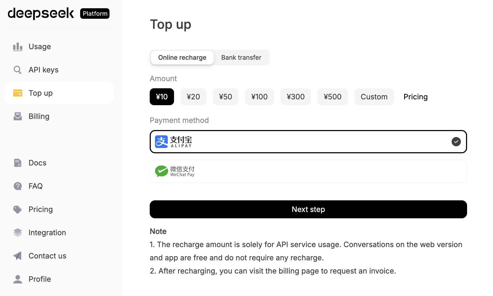
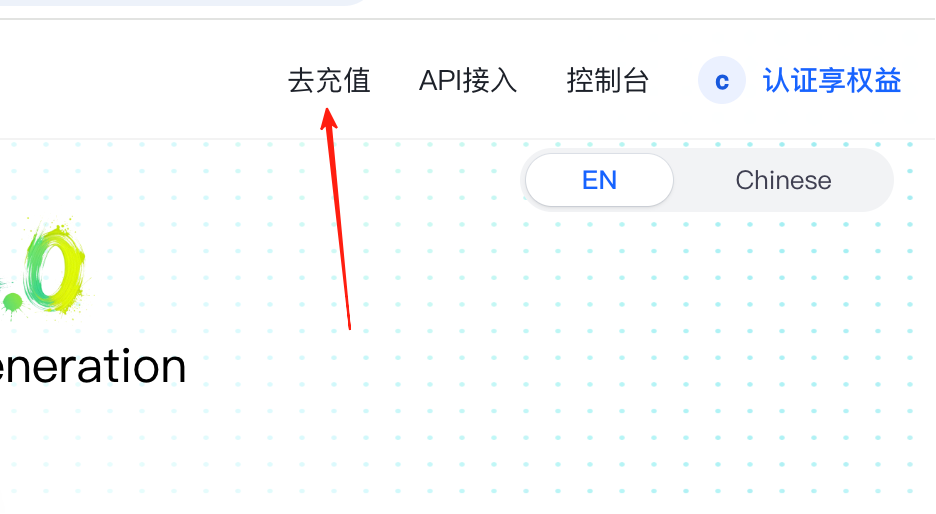
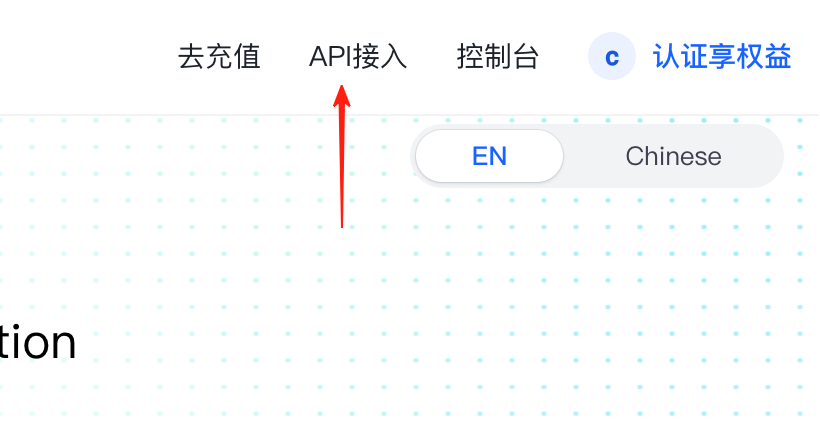
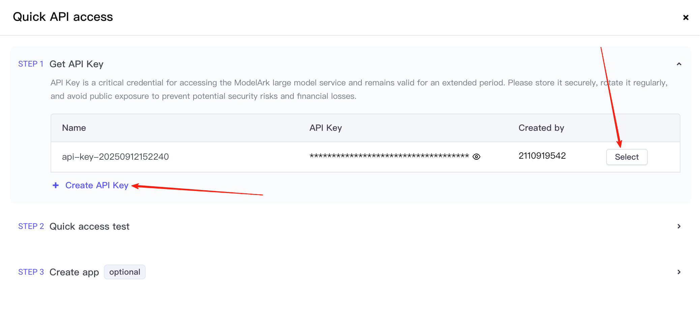
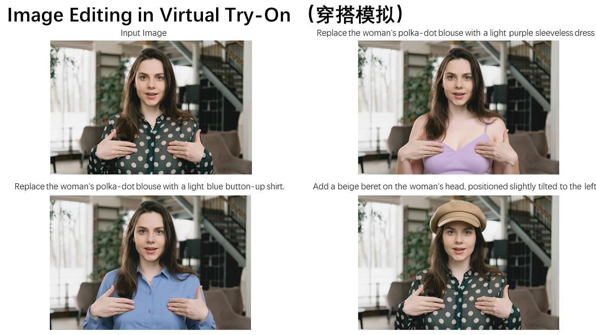
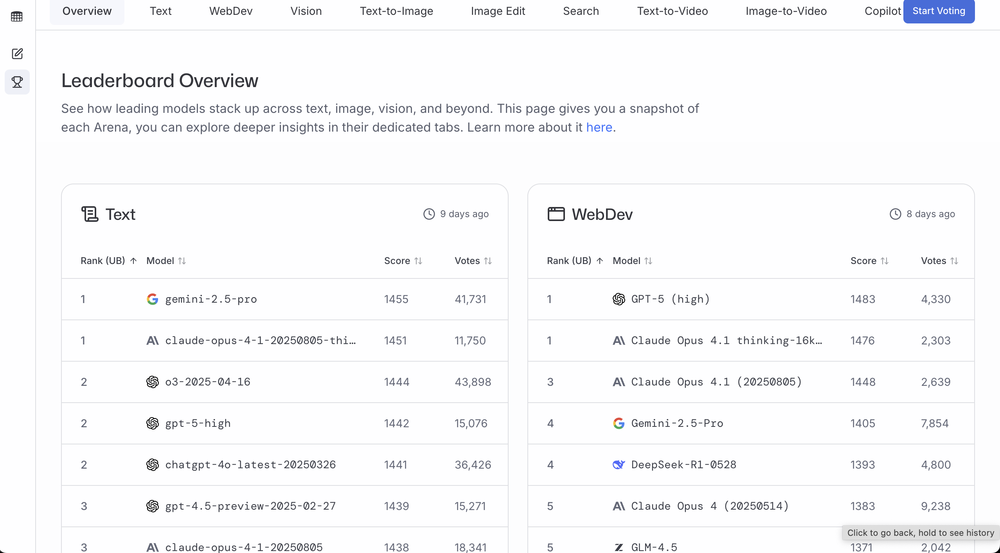

<script setup>
import { relatedArticlesMap } from '@theme/data/relatedArticles'

const duration = 'Примерно <strong>1 день</strong>'
const relatedArticles =
  relatedArticlesMap['en/stage-1/integrating-ai-capabilities'] ?? []
</script>

# Начальный уровень 4: Внедрение AI-возможностей в ваш прототип

## Введение в главу

<ChapterIntroduction :duration="duration" :tags="['API', 'Текстовая модель', 'Текст-в-изображение', 'Интеграция прототипа']" coreOutput="Прототип, интегрированный с 1 текстовой моделью + 1 графической моделью (опционально)" expectedOutput="AI-прототип, способный вызывать реальные API">

В предыдущих главах мы прошли весь путь от **поиска отличной идеи** до **создания прототипа продукта**. Но текущий прототип всё ещё лишь «оболочка» — нажатие кнопок на самом деле не генерирует контент, а все данные на странице зашиты в код.

Помните, что мы подчёркивали в первой главе? **Мы хотим создавать «продукты, за которые люди готовы платить», а не «прототипы, которые просто хорошо выглядят».** Реальная ценность приходит от продукта, который может **решать реальные проблемы**, а для этого прототип должен уметь **по-настоящему работать**.

Эта глава «оживит» ваш прототип: мы интегрируем **реальные AI-возможности**, начиная с получения API Key, чтения официальной документации и того, чтобы AI IDE помог вам встроить интерфейс в ваш код. На примере **текстовой модели DeepSeek** вы научитесь заставлять ваше приложение **на самом деле вызывать большую языковую модель для генерации контента**; если интересно, вы также можете **опционально интегрировать генерацию изображений**.

После прохождения этой главы ваш прототип **больше не будет статичным демо**, а станет **приложением, способным вызывать реальные AI-возможности и решать реальные проблемы**.

</ChapterIntroduction>

<div style="margin: 50px 0;">
  <ClientOnly>
    <StepBar :active="0" :items="[
      { title: 'Основы API', description: 'Понять ключевые концепции и практики безопасности' },
      { title: 'Интеграция текста', description: 'Генерация текста DeepSeek на практике' },
      { title: 'Интеграция изображений', description: 'Понимание и генерация изображений VLM' }
    ]" />
  </ClientOnly>
</div>

# 1. Основы API

Как упоминалось ранее, наша цель — «интегрировать AI-возможности», чтобы прототип перестал быть статичным демо и стал инструментом, способным вызывать реальные AI-сервисы. Ключ к достижению этого лежит в понимании и использовании API (Application Programming Interfaces).

API — важная абстрактная концепция в информатике. Проще говоря: **вы отправляете запрос в формате, который требует другая сторона, и она присылает обратно результат в том же формате**.

- **Что вы отправляете**: обычно включает «ключ (API Key)» и «то, что вы хотите сгенерировать»
- **Что они присылают обратно**: в случае успеха вы получаете результат; если неудача, они сообщают почему (например, «недействительный ключ», «недостаточно баланса», «неверные параметры»)

В частности, вам нужно освоить следующие ключевые элементы:

1. **API Key**: ваш «пропуск» и одновременно «ключ от кошелька». Любой, кто его получит, может делать вызовы API от вашего имени и нести расходы.
2. **Endpoint**: конкретный путь для запроса к API, сообщающий серверу, к какой функции вы хотите получить доступ. Полный URL запроса обычно состоит из «Base URL + путь Endpoint». Например:
   - Генерация текста: Base URL (`https://api.service.com`) + Endpoint (`/v1/chat/completions`) = полный URL `https://api.service.com/v1/chat/completions`
   - Генерация изображений: Base URL (`https://api.service.com`) + Endpoint (`/v1/images/generations`) = полный URL `https://api.service.com/v1/images/generations`
3. **Вызов/Запрос**: процесс отправки задачи AI-сервису и получения результатов обратно
4. **Содержимое запроса**: конкретное содержимое, которое вы отправляете AI, например тема, на которую вы хотите, чтобы AI написал, описание изображения для генерации и т. д.
5. **Ответ**: содержимое, которое AI возвращает после обработки, например сгенерированная статья, изображение и т. д.
6. **Обработка ошибок**: знание того, как устранять неполадки при возникновении проблем (например, неверный API Key, слишком много запросов и т. д.)

::: info ℹ️ Что такое API
Более глубокое объяснение API см. в приложении: [Введение в API](/ru-ru/appendix/4-server-and-backend/api-intro).

::: warning 🔐 **Заметки по безопасности API**
API Key — это ваш «пропуск» для запроса AI-сервисов: это секретная строка, используемая для аутентификации и биллинга.

Поскольку API Key напрямую связан с вашим аккаунтом и расходами, обязательно:

- **Никогда не делитесь им** в групповых чатах, скриншотах, загруженных онлайн, или на публичных форумах
- **Никогда не зашивайте его** в код и не коммитьте в Git-репозиторий (особенно публичный)
- Если вы подозреваете, что ваш Key утёк, **немедленно замените его на новый Key**

В содержимом ниже мы будем **вставлять API KEY напрямую в AI IDE для операций**. **Не делайте так в реальных проектах!!** Поскольку мы просто практикуемся, сейчас это допустимо. (Когда наберётесь опыта, можете попросить AI сгенерировать конфигурационный файл и просто положить API KEY в него.)
:::

<div style="margin: 50px 0;">
  <ClientOnly>
    <StepBar :active="1" :items="[
      { title: 'Основы API', description: 'Понять ключевые концепции и практики безопасности' },
      { title: 'Интеграция текста', description: 'Генерация текста DeepSeek на практике' },
      { title: 'Интеграция изображений', description: 'Понимание и генерация изображений VLM' }
    ]" />
  </ClientOnly>
</div>

# 2. Интеграция API генерации текста: DeepSeek

Хотя API затрагивают эти технические концепции, фактическая работа на этапе прототипирования может быть очень простой и эффективной. Ключевой подход такой:

> **Найдите официальный пример, получите API Key и попросите AI IDE привязать его к кнопке.**

Освоив эти концепции, вы обнаружите, что независимо от того, интегрируете ли вы текстовую модель или графическую модель, базовый процесс одинаков: когда пользователь нажимает кнопку, фронтенд организует ввод и отправляет запрос; после того как API возвращает результат, он отображает результат на странице. Давайте проверим это на практике.

В `1.2 Создание вашего прототипа` вы уже создали интерактивный прототип. То, что нам нужно сделать дальше, — превратить «псевдо-AI-функции» в прототипе в реальные, рабочие возможности: **когда пользователь нажимает кнопку, прототип отправляет запрос внешнему AI-сервису и отображает возвращённый текст.**

::: info ℹ️ Дополнительное чтение о принципах
Если вы хотите узнать больше о базовых принципах, ознакомьтесь с приложением: [Введение в большие языковые модели (LLM)](/ru-ru/appendix/8-artificial-intelligence/llm-principles).
::: details Узнать больше: что такое DeepSeek?

**Hangzhou DeepSeek Artificial Intelligence Basic Technology Research Co., Ltd.**, работающая под брендом DeepSeek, — это **китайская компания в сфере искусственного интеллекта (AI), которая разрабатывает большие языковые модели (LLM)**. Штаб-квартира DeepSeek находится в Ханчжоу, провинция Чжэцзян, и компания принадлежит и финансируется китайским хедж-фондом High-Flyer. DeepSeek была основана в июле 2023 года Лян Вэньфэном, сооснователем High-Flyer, который также является CEO обеих компаний. Компания запустила свой одноимённый чат-бот и модель DeepSeek-R1 в январе 2025 года.

Давайте посмотрим, как DeepSeek сравнивается с другими топовыми моделями в рейтинге бенчмарка GPQA. Примечательно, что DeepSeek — модель с открытым исходным кодом (любой может скачать модель из интернета), тогда как другие распространённые модели вроде Grok, Google Gemini и ChatGPT закрыты. Как мы видим, DeepSeek во многом догнала первый эшелон моделей.


GPQA расшифровывается как «Graduate-Level Google-Proof Q&A Benchmark» — бенчмарк уровня аспирантуры для задач научных вопросов и ответов. Вот подробное описание.

GPQA содержит 448 вопросов с множественным выбором, охватывающих подобласти биологии, физики и химии, такие как квантовая механика, органическая химия, молекулярная биология и другие. Эти вопросы были написаны 61 экспертом, которые имеют или получают докторскую степень, и прошли строгий процесс валидации.
:::

Выполните эти 3 шага, чтобы быстро интегрировать API генерации большой модели:

1. **Создайте API Key на платформе DeepSeek**
2. **Найдите пример генерации текста в документации DeepSeek** (там обычно есть готовый код, который можно скопировать напрямую)
3. **Откройте AI IDE, вставьте API Key + официальный пример** и скажите AI, какую функциональность реализовать:
   > Помоги мне интегрировать API этой большой модели, чтобы поддержать задачу генерации рекламных текстов для этого приложения

Далее мы пройдём через демонстрацию. Вы можете следовать за всем процессом. Сначала зарегистрируйте аккаунт [DeepSeek](https://platform.deepseek.com/usage), создайте API Key и пополните небольшую сумму для тестирования.




Нажмите «API KEYS» и найдите «create new API key» внизу экрана. В итоге вы получите API key, выглядящий примерно как sk-8573341c39fc44315aadc071c53rh7d2.


Получив ключ, вы получаете разрешение вызывать модель.

На этом этапе вы можете напрямую прочитать документацию [API](https://api-docs.deepseek.com/), которая обычно предоставляет примеры вызова на curl или Python.


Найдя пример, вы можете скопировать всё содержимое из документации вместе с вашим ключом в чат-бокс AI IDE, попросив его помочь вам интегрировать большую языковую модель в уже разработанный прототип.


Вот референсный промпт:

```
Based on this API call method, help me implement a copywriting generation feature that can generate Douyin (TikTok) e-commerce copy in various styles based on product information when clicked.

Reference materials:
api key: sk-8573341c39aefa1efe
api request reference:
curl  \
  -H "Content-Type: application/json" \
  -H "Authorization: Bearer ${DEEPSEEK_API_KEY}" \
  -d '{
        "model": "deepseek-chat",
        "messages": [
          {"role": "system", "content": "You are a helpful assistant."},
          {"role": "user", "content": "Hello!"}
        ],
        "stream": false
      }'
```

После некоторой генерации кода AI вы легко получите соответствующую кнопку генерации рекламного текста для тестирования. Если вы не можете найти точку входа, можно попросить AI IDE сообщить вам, какая страница к ней ведёт. Если вы действительно не можете её найти, можно попросить AI IDE напрямую переработать и улучшить на основе ваших идей, чтобы получить итоговый результат генерации рекламного текста.


Конечно, вы можете задаться вопросом: как мне узнать, что он действительно вызывает большую модель, а не просто возвращает зашитые ответы? Вы можете ввести свой собственный текст и попросить большую модель сгенерировать соответствующий контент на основе вашего собственного анализа, заданного на месте.

Если вы обнаружите, что результаты каждый раз разные и логически связные, можете быть уверены, что API вызывается корректно. Вы также можете проверить [платформу управления использованием API](https://platform.deepseek.com/usage), чтобы увидеть, были ли вызовы успешными (хотя это может появиться через несколько минут).

## Больше вариантов моделей генерации текста

Помимо DeepSeek, вы также можете попробовать другие большие языковые модели. Поскольку большинство моделей предоставляют **OpenAI-совместимый API**, переключение очень простое — нужно лишь изменить API Key, base URL и название модели.

### Интеграция MiniMax

::: details Узнать больше: что такое MiniMax?

**MiniMax** — китайская AI-компания, занимающаяся исследованиями в области общего искусственного интеллекта. MiniMax выпустила серии больших языковых моделей MiniMax-M3 и MiniMax-M2.7, которые хорошо показывают себя в нескольких бенчмарках с отличным соотношением цены и качества.

**Ключевые особенности серии MiniMax:**

- **Сверхдлинный контекст**: M3 поддерживает контекстное окно до 512K токенов (M2.7 поддерживает 204 800 токенов), подходит для обработки длинных документов и многораундовых диалогов
- **Соотношение цены и качества**: чрезвычайно конкурентоспособное ценообразование
- **OpenAI-совместимый API**: можно вызывать напрямую с помощью OpenAI SDK, не нужно изучать новый формат API
- **Доступные модели**:
  - `MiniMax-M3`: новейшая флагманская модель с контекстом 512K, максимальным выводом 128K и поддержкой ввода изображений
  - `MiniMax-M2.7`: предыдущая флагманская модель, всё ещё доступна
  - `MiniMax-M2.7-highspeed`: высокоскоростная версия с той же производительностью, но более быстрым откликом
:::

Процесс интеграции такой же, как у DeepSeek, всего три шага:

1. Перейдите на [платформу MiniMax](https://platform.minimax.io/), чтобы зарегистрироваться и создать API Key
2. Найдите примеры вызова API в документации MiniMax
3. Вставьте API Key + пример в ваш AI IDE

Поскольку MiniMax предоставляет OpenAI-совместимый API, вы можете скопировать следующий пример на curl вместе с вашим API Key и отправить его в ваш AI IDE для интеграции:

```bash
curl https://api.minimax.io/v1/chat/completions \
  -H "Content-Type: application/json" \
  -H "Authorization: Bearer ${MINIMAX_API_KEY}" \
  -d '{
        "model": "MiniMax-M3",
        "messages": [
          {"role": "system", "content": "You are a helpful assistant."},
          {"role": "user", "content": "Hello!"}
        ],
        "stream": false
      }'
```

::: tip ✅ Совет
Формат API MiniMax почти идентичен DeepSeek (оба OpenAI-совместимы), поэтому, если вы уже успешно интегрировали DeepSeek, переключение на MiniMax требует изменения лишь трёх вещей:
1. **Base URL**: изменить на `https://api.minimax.io/v1`
2. **API Key**: использовать ваш API Key MiniMax
3. **Название модели**: изменить на `MiniMax-M3` (новый флагман), `MiniMax-M2.7` или `MiniMax-M2.7-highspeed`

Подробнее см. в [документации по OpenAI-совместимому API MiniMax](https://platform.minimax.io/docs/api-reference/text-openai-api).
:::

# 3. Интеграция API «изображение-в-текст»: Qwen3 VL

::: info ℹ️ Дополнительное чтение о принципах
Если вы хотите узнать больше о базовых принципах, ознакомьтесь с приложением: [Введение в модели «зрение-язык» (VLM)](/ru-ru/appendix/8-artificial-intelligence/multimodal-models).

::: details Узнать больше: что такое Qwen3 VL?

**Qwen3 VL** — новейшая версия в серии мультимодальных моделей «зрение-язык», разработанной командой Tongyi Qianwen от Alibaba Cloud. VL означает «Vision-Language», то есть это модель «зрение-язык». Она может понимать содержимое изображений и генерировать текстовые описания на основе изображений, отвечать на вопросы об изображениях, извлекать информацию из изображений и многое другое.


**Ключевые возможности Qwen3 VL включают:**

- **Понимание изображений**: может распознавать объекты, сцены, людей, текст и другое содержимое на изображениях
- **Визуальные вопросы и ответы**: точно отвечает на вопросы об изображениях на основе запросов пользователя
- **Описание изображений**: генерирует подробные или краткие текстовые описания изображений
- **Понимание нескольких изображений**: поддерживает одновременную обработку нескольких изображений для сравнительного анализа
- **Извлечение текста**: извлекает текстовое содержимое из изображений (возможность OCR)

**Почему выбрать Qwen3 VL?**

По сравнению с предыдущим поколением, Qwen3 VL значительно улучшил точность понимания изображений и поддерживает более длинные и сложные задачи анализа изображений. Она превосходна в понимании китайского языка, имеет относительно низкую стоимость вызова API и предлагает хорошее соотношение цены и качества. Кроме того, её большее контекстное окно позволяет ей справляться с более сложными задачами визуального рассуждения.

**Типичные сценарии использования:**

- E-commerce: автоматически генерировать заголовки, описания и преимущества из изображений товаров
- Создание контента: автоматически генерировать тексты или предложения изображений на основе референсных изображений
- Офис: извлечение содержимого изображений, автоматическое распознавание отчётов
- Образование: автоматический разбор вопросов на основе изображений, извлечение пунктов знаний

:::

В предыдущем разделе мы объяснили, как интегрировать API генерации текста. Но для сценария применения выше мы заметим проблему: мы загружаем изображение, и если мы используем только большую языковую модель, она не сможет хорошо понять содержимое изображения, поэтому сгенерированные результаты могут быть неточными.

Нам нужна модель, которая поможет нам превратить изображение в текстовое описание — для этого требуется модель «зрение-язык» (VLM). В нашем случае мы будем использовать модель «зрение-язык» для генерации описаний преимуществ товара, улучшая пользовательский опыт.

Для удобства мы будем использовать API, предоставляемый [облачной платформой SiliconFlow](https://cloud.siliconflow.cn/me), чтобы интегрировать API «изображение-в-текст».

::: details Узнать больше: что такое SiliconFlow?
**SiliconFlow** — известная в Китае платформа агрегации AI-моделей, предоставляющая API-сервисы для различных популярных больших языковых моделей и моделей «зрение-язык».

**Особенности платформы:**

- **Поддержка множества моделей**: интегрирует различные популярные AI-модели, включая DeepSeek, Qwen, серию Llama и другие модели с открытым исходным кодом
- **Техническая оптимизация**: оптимизированный инференс для моделей с открытым исходным кодом, предоставляющий API-сервисы с низкой задержкой и высокой конкурентностью
- **Совместимость интерфейса**: предоставляет OpenAI-совместимые API-интерфейсы для удобной интеграции с существующими приложениями
- **Оплата по факту использования**: поддерживает биллинг на основе использования

SiliconFlow относительно зрел в сервисах инференса для больших моделей с открытым исходным кодом и является распространённым выбором для использования отечественных AI-моделей с открытым исходным кодом.
:::

Перейдите на главную страницу платформы SiliconFlow, где вы увидите множество моделей на выбор. Найдите фильтр в верхнем левом углу, нажмите, чтобы развернуть его, выберите тег «Vision», и вы увидите множество моделей «изображение-в-текст», таких как Zhipu GLM-4.6V или Qwen3-VL.


Вы можете выбрать любую для тестирования. Здесь мы используем `Qwen/Qwen3-VL-8B-Instruct` в качестве примера.


Перейдите на [платформу SiliconFlow](https://cloud.siliconflow.cn/me/account/ak), нажмите «Create New API Key» в разделе API Keys, чтобы создать новый API Key.

Вы можете напрямую использовать приведённый ниже код в качестве референсного и отправить его вместе со сгенерированным API Key в AI IDE для интеграции функции.

::: details Референсный код «изображение-в-текст»

```python
from openai import OpenAI
from typing import Dict, Any, List
import base64
import os
SILICONFLOW_API_KEY: str = ""
SILICONFLOW_BASE_URL: str = "https://api.siliconflow.cn/v1/"
MODEL_NAME: str = "Qwen/Qwen3-VL-8B-Instruct"

def encode_image(image_path: str) -> str:
    with open(image_path, "rb") as image_file:
        return base64.b64encode(image_file.read()).decode('utf-8')

def get_vlm_completion(client: OpenAI, messages: List[Dict[str, Any]]) -> str:
    response = client.chat.completions.create(
        model=MODEL_NAME,
        messages=messages,
        max_tokens=512,
        temperature=0.7,
        top_p=0.7,
        frequency_penalty=0.5,
        stream=False,
        n=1
    )
    return response.choices[0].message.content

def caption_image(image_path: str) -> str:
    base64_image = encode_image(image_path)
    messages = [
        {
            "role": "user",
            "content": [
                {
                    "type": "text",
                    "text": "Please describe this image in detail."
                },
                {
                    "type": "image_url",
                    "image_url": {
                        "url": f"data:image/jpeg;base64,{base64_image}"
                    }
                }
            ]
        }
    ]

    client = OpenAI(
        api_key=SILICONFLOW_API_KEY,
        base_url=SILICONFLOW_BASE_URL
    )

    return get_vlm_completion(client, messages)

image_path = "images.jpg"
caption = caption_image(image_path)
```

:::

В этом сценарии мы напрямую попробуем попросить AI IDE реализовать функцию, которая автоматически генерирует текст преимуществ товара и ключевые слова из загруженных изображений для e-commerce, как показано ниже:

```text
Based on the image-to-text API below, help us implement a feature that automatically generates ecommerce selling points and keywords from uploaded images.

<code omitted here; you need to paste your key and the reference code yourself>
```

Итоговый сгенерированный результат:


<div style="margin: 50px 0;">
  <ClientOnly>
    <StepBar :active="2" :items="[
      { title: 'Основы API', description: 'Понять ключевые концепции и практики безопасности' },
      { title: 'Интеграция текста', description: 'Генерация текста DeepSeek на практике' },
      { title: 'Интеграция изображений', description: 'Понимание и генерация изображений VLM' }
    ]" />
  </ClientOnly>
</div>

# 4. Интеграция API генерации изображений: Seedream

В предыдущем разделе мы в основном работали с задачами, связанными с текстом. Далее мы попробуем интегрировать возможности генерации изображений, чтобы поддержать генерацию изображений из текстовых описаний или редактирование изображений.

::: info ℹ️ Дополнительное чтение о принципах
Если вы хотите узнать больше о базовых принципах, ознакомьтесь с приложением: [Введение в генерацию изображений](/ru-ru/appendix/8-artificial-intelligence/image-generation).

::: details Узнать больше: что такое [Seedream](https://seed.bytedance.com/ru-ru/seedream4_5)?


> Вы, возможно, уже знаете Nano Banana (разработанный Google), но вам не стоит пропустить Seedream. Seedream 4.5 — модель создания изображений нового поколения, построенная ByteDance. Она объединяет возможности генерации и редактирования изображений в единую архитектуру. Это позволяет ей справляться со сложными мультимодальными задачами, такими как генерация на основе знаний, сложное рассуждение и консистентность по референсу. Кроме того, её скорость инференса намного выше, чем у предыдущего поколения, и она может генерировать впечатляющие изображения высокой чёткости вплоть до разрешения 4K.
>
> 
> 

**Основные возможности:**

- **Текст-в-изображение**: генерация изображений из текстовых промптов, поддержка множества стилей (реалистичный, мультяшный, тушь, киберпанк и т. д.)
- **Перенос стиля**: преобразование изображения в указанный художественный стиль
- **Варианты изображения**: генерация новых изображений в похожих стилях из референсных изображений
- **Повышение разрешения**: улучшение чёткости и детализации изображения
- **Редактирование изображений**: редактирование существующих изображений через инструкции на естественном языке

**Почему выбрать Seedream?**

- **Стабильный доступ в отечественной сети**: быстрый доступ и низкая задержка в Китае
- **Отличное качество вывода**: надёжная работа в сценариях e-commerce и генерации ассетов
- **Понимание, оптимизированное под китайский язык**: лучшее понимание китайских промптов для отечественных пользователей
- **Высокая скорость**: высокая эффективность генерации и короткое время отклика
- **Стабильное качество**: может генерировать изображения высокой чёткости вплоть до 4K

**Типичные сценарии использования:**

- E-commerce: генерация главных изображений, ассетов для страниц с деталями и рекламных постеров
- Социальные сети: генерация аватаров, стикеров и вспомогательных визуалов
- Дизайн: быстрое создание концепт-изображений, ассетов и фонов
- Маркетинг: создание рекламных изображений, баннеров кампаний и праздничных постеров

**Как это работает с Qwen3 VL:**

Эти два API можно соединить в цепочку: сначала используйте Qwen3 VL для анализа референсного изображения и понимания содержимого сцены, затем используйте Seedream для генерации новых изображений на основе промптов, полученных из этого анализа.
:::

Многие «AI-постеры / AI-главные изображения товаров / AI-изображения персонажей», которые вы видите на Douyin, Bilibili или YouTube, по сути построены на такого рода технологии. То, что вам нужно сделать, просто: организовать пользовательский ввод в одно предложение, запросить API изображений и отобразить возвращённое изображение. Используемая здесь модель — модель генерации/редактирования изображений.

Мы шаг за шагом продемонстрируем, как интегрировать API Seedream в ваш проект (с помощью AI IDE).

Посетив [главную страницу](https://www.volcengine.com/experience/ark?launch=seedream), нажмите login.


После входа найдите опцию пополнения в правом верхнем углу.



Перед пополнением требуется верификация по реальному имени.


После успешной верификации вы можете [пополнить на 1 юань для тестирования](https://console.volcengine.com/finance/fund/recharge).

Вернитесь на [начальную страницу](https://www.volcengine.com/experience/ark?launch=seedream) и нажмите API Access.



Сначала создайте API key, затем нажмите опцию выбора модели.



Это приведёт вас к шагу 2. Здесь подтвердите, что сервисная модель — Seedream 4.5, и скопируйте предоставленный пример вызова. (Скриншот был сделан ранее, поэтому версия модели, показанная там, всё ещё 4.0.)


Когда API Key и пример вызова готовы, вы можете вставить их напрямую в AI IDE и попросить его сгенерировать интерактивное демо фронтенда или интегрировать возможность в ваш текущий прототип. Обратите внимание, что на скриншоте вы можете выбрать режим «текст-в-изображение» или «несколько изображений в одно». Выберите референсный код в соответствии с вашим конкретным требованием.

::: warning ⚠️ Важное примечание
Пример по умолчанию здесь относительно сложен. Не забудьте отключить **«Добавить водяной знак»** и **«Потоковый ответ»**, чтобы гарантировать, что водяной знак не будет сгенерирован и запросы не будут падать.
:::

Поскольку позже мы используем режим генерации с референсным изображением, сначала мы используем функцию «несколько изображений в одно». Референсный код скопирован следующим образом:

```text
curl -X POST https://ark.cn-beijing.volces.com/api/v3/images/generations \
  -H "Content-Type: application/json" \
  -H "Authorization: Bearer xxxxxxx" \
  -d '{
    "model": "doubao-seedream-4-5-251128",
    "prompt": "Replace the outfit in image 1 with the outfit in image 2",
    "image": ["https://ark-project.tos-cn-beijing.volces.com/doc_image/seedream4_imagesToimage_1.png", "https://ark-project.tos-cn-beijing.volces.com/doc_image/seedream4_imagesToimage_2.png"],
    "sequential_image_generation": "disabled",
    "response_format": "url",
    "size": "2K",
    "stream": false,
    "watermark": true
}'
```

Когда референсный код для изображений подготовлен, мы просим AI IDE поддержать распространённые функции задач с изображениями в e-commerce:

```text
Please help me implement common ecommerce features in this project based on the API below (for example, poster generation, Douyin ecommerce hero-image generation, etc.)

<paste the API KEY and the image-editing code here>
```

Результат реализации:


Стоит отметить, что генерация изображений часто сталкивается со странными сбоями. Рекомендуется, чтобы AI IDE всегда показывал полные детали ошибки, чтобы вы могли их скопировать и эффективно отладить. Например, вы можете сказать:

```text
Don't only show "image generation failed." Please always display the full failure reason, such as model mismatch, request errors, or timeout details.
```

Иногда обновления после правок могут всё ещё не отражаться на странице. Если вы продолжаете видеть ошибки после нескольких раундов, можно также попробовать сказать AI IDE напрямую: пожалуйста, перезапусти этот проект.

В сценариях e-commerce мы можем захотеть, чтобы одежда, загруженная пользователями, автоматически надевалась моделью, или автоматически генерировать привлекательные продающие изображения товаров и постеры. Здесь мы пробуем промпт, который запрашивает постер для e-commerce:


Вы можете комбинировать API «текст-в-изображение» и «изображение-в-изображение» на основе идей вашего собственного бизнес-сценария.

## Больше различных вариантов сервисов изображений

Ниже приведены дополнительные варианты. Рекомендуется сначала прогнать рабочий результат генерации изображений Qwen, а затем заменить на другой сервис в зависимости от качества и стоимости.

### Интеграция Recraft

Если ваш прототип больше ориентирован на дизайн-производство (например, иллюстрации в фирменном стиле, маркетинговые постеры, ассеты в векторном стиле), Recraft часто подходит лучше. Метод интеграции точно такой же: **получить Key + найти официальные примеры + позволить AI IDE привязать их к вашей странице/кнопке**.

::: details Узнать больше: что такое Recraft?

> Recraft — AI-инструмент для дизайнеров, иллюстраторов и маркетологов, основанный в 2022 году (США) со штаб-квартирой в Лондоне. Он поддерживает генерацию и итерацию визуального контента (изображения, векторная графика и 3D-графика), с сильными сторонами в качестве вывода, контроле на уровне элементов и дизайне, консистентном с брендом.
>
> 
> 

Сначала перейдите к [точке входа API](https://www.recraft.ai/profile/api), чтобы получить API Key.

Recraft в настоящее время не предоставляет бесплатную квоту в этом рабочем процессе, поэтому вам нужно будет пополнить кредиты самостоятельно.


Затем следуйте тому же процессу и используйте примеры из официальной документации:

- <https://www.recraft.ai/docs/api-reference/getting-started>
- <https://www.recraft.ai/docs/api-reference/usage>
- <https://www.recraft.ai/docs/api-reference/guides>

:::

### Интеграция Qwen Image / Qwen Image Edit

Если вы хотите относительно простой способ интегрировать генерацию изображений, Qwen Image также хороший выбор. Подход неизменен: рассматривайте его как API изображений и подключите к кнопке вашего прототипа.

::: details Узнать больше: что такое Qwen Image и Qwen Image Edit?

**Qwen Image** — семейство моделей генерации изображений от Alibaba Tongyi, в основном включающее два типа моделей:

**1. Qwen Image: текст-в-изображение**

Генерация совершенно нового изображения из текстовых промптов. Вы предоставляете описание, модель интерпретирует его и генерирует соответствующие визуалы.


Основные возможности:

- **Текст-в-изображение**: поддерживает множество стилей (реалистичный, мультяшный, тушь, киберпанк и т. д.)
- **Перенос стиля**: преобразование изображения в целевой художественный стиль
- **Вариация изображения**: генерация новых изображений с похожим стилем из референсов
- **Повышение разрешения**: улучшение чёткости и детализации

**2. Qwen Image Edit: изображение-в-изображение**

Редактирование существующих изображений через инструкции на естественном языке.

Основные возможности:

- **Локальная замена**: замена конкретных объектов/персонажей (например, «измени фон на пляж»)
- **Удаление элементов**: удаление нежелательных элементов
- **Преобразование стиля**: применение фильтров или художественных эффектов
- **Расширение изображения**: расширение границ изображения и генерация нового содержимого
- **Умная ретушь**: автоматическое улучшение качества, освещения и дефектов





Почему выбрать серию Qwen Image:

- Лучшее понимание китайских промптов
- Более низкая стоимость по сравнению со многими глобальными альтернативами
- Высокая скорость генерации
- Стабильное качество вывода в сценариях e-commerce и контента
- Богатое разнообразие стилей

Типичные сценарии использования:

- E-commerce: главные изображения, изображения для страниц с деталями, рекламные постеры
- Социальные сети: аватары, стикеры, визуальные ассеты
- Дизайн: быстрые концепт-ассеты, фоновые ассеты
- Маркетинг: рекламные визуалы, баннеры событий, праздничные постеры
:::

Откройте [SiliconFlow](https://siliconflow.cn/) и используйте Playground (без вызова API), чтобы протестировать эффекты модели. Используйте опцию «Filters» сверху, чтобы сузить до моделей генерации изображений, и выберите `Qwen/Qwen-Image`.


Подтвердив модель, проверьте официальную справку по API и откройте [раздел API генерации изображений](https://docs.siliconflow.cn/cn/api-reference/images/images-generations). Затем отправьте пример запроса плюс ваш API key в AI IDE.

```bash
curl --request POST \
  --url https://api.siliconflow.cn/v1/images/generations \
  --header 'Authorization: Bearer <token>' \
  --header 'Content-Type: application/json' \
  --data '
{
  "model": "Qwen/Qwen-Image-Edit-2509",
  "prompt": "an island near sea, with seagulls, moon shining over the sea, light house, boats in the background, fish flying over the sea"
}
'
```

Вы можете использовать либо `Qwen/Qwen-Image`, либо `Qwen/Qwen-Image-Edit-2509`.

::: details Референсный код Image Edit

Скопируйте приведённый ниже код плюс ваш ключ в AI IDE:

```python
import requests
import os
from typing import Dict, Any, Optional

SILICONFLOW_API_KEY: str = ""
SILICONFLOW_BASE_URL: str = "https://api.siliconflow.cn/v1/images/generations"
QWEN_IMAGE_EDIT_MODEL: str = "Qwen/Qwen-Image-Edit-2509"

def generate_image_edit(
    prompt: str,
    image: Optional[str] = None,
    image2: Optional[str] = None,
    image3: Optional[str] = None,
    negative_prompt: Optional[str] = None,
    cfg: Optional[float] = 4.0,
    seed: Optional[int] = None
) -> Optional[Dict[str, Any]]:
    payload: Dict[str, Any] = {
        "model": QWEN_IMAGE_EDIT_MODEL,
        "prompt": prompt,
    }
    if image:
        payload["image"] = image
    if image2:
        payload["image2"] = image2
    if image3:
        payload["image3"] = image3
    if negative_prompt:
        payload["negative_prompt"] = negative_prompt
    if cfg is not None:
        payload["cfg"] = cfg
    if seed is not None:
        payload["seed"] = seed

    headers: Dict[str, str] = {
        "Authorization": f"Bearer {SILICONFLOW_API_KEY}",
        "Content-Type": "application/json"
    }

    try:
        response = requests.post(SILICONFLOW_BASE_URL, json=payload, headers=headers)
        response.raise_for_status()
        return response.json()
    except requests.exceptions.RequestException as e:
        print(f"Error generating image: {e}")
        return None

def save_image_from_url(image_url: str, output_path: str = "image.png") -> bool:
    try:
        response = requests.get(image_url)
        response.raise_for_status()
        os.makedirs(os.path.dirname(output_path) if os.path.dirname(output_path) else ".", exist_ok=True)
        with open(output_path, "wb") as f:
            f.write(response.content)
        print(f"Image saved successfully to: {output_path}")
        return True
    except requests.exceptions.RequestException as e:
        print(f"Error downloading image: {e}")
        return False
    except Exception as e:
        print(f"Error saving image: {e}")
        return False

prompt: str = "Change the sky to dusk, add moon and stars, dreamy style"
negative_prompt: str = "blur, low quality, distortion"
image_url: str = "https://inews.gtimg.com/om_bt/Os3eJ8u3SgB3Kd-zrRRhgfR5hUvdwcVPKUTNO6O7sZfUwAA/641"
image2_url: Optional[str] = None
image3_url: Optional[str] = None

cfg: float = 4.0
seed: int = 12345
output_path: str = "edited_image.png"

print(f"Generating edited image with prompt: {prompt}")
print(f"Input image: {image_url}")
print(f"CFG: {cfg}, Seed: {seed}")
print("-" * 50)

result = generate_image_edit(
    prompt=prompt,
    image=image_url,
    image2=image2_url,
    image3=image3_url,
    negative_prompt=negative_prompt,
    cfg=cfg,
    seed=seed
)

if result and "images" in result:
    images = result["images"]
    if images and len(images) > 0:
        image_url_result = images[0]["url"]
        print(f"Image edit generated successfully. URL: {image_url_result}")
        success = save_image_from_url(image_url_result, output_path)
        if success:
            print(f"Image saved to: {output_path}")
        else:
            print("Failed to save image to local file")
    else:
        print("No images found in response")
else:
    print("Image generation failed")
    if result:
        print(f"Response: {result}")
```

:::

# Приложение: как находить более сильные AI-модели сегодня

Разработка текстовых моделей движется быстро, поэтому вам следует регулярно проверять, остаётся ли выбранная вами модель конкурентоспособной. Два сайта ниже полезны для отслеживания качества, популярности и соотношения цены и качества моделей.

Можете думать о них как об аренах моделей: они сравнивают результаты разных моделей и позволяют людям голосовать или изучать измерения бенчмарков.

## LMArena

Сайт: <https://lmarena.ai/>

LMArena полезна, чтобы увидеть, какие ответы моделей пользователи в целом предпочитают. Больше голосов и более высокие оценки обычно указывают на более стабильное качество в реальном использовании.

Практический рабочий процесс:

1. Проверьте таблицу лидеров
2. Отфильтруйте по вашей целевой задаче (общий чат / программирование / зрение)
3. Выберите из топ-кандидатов одну модель, которая соответствует вашим ограничениям по доступу, задержке и бюджету



## Artificial Analysis

Сайт: <https://artificialanalysis.ai/>

Artificial Analysis полезна, когда вы хотите сравнить качество, цену и скорость на одной панели.

Распространённый рабочий процесс:

1. Выберите интересующую вас категорию моделей (текст / генерация изображений / и т. д.)
2. Сравните качество + цену + задержку/пропускную способность
3. Выберите модель с наилучшим общим соответствием ограничениям вашего продукта

::: tip ✅ Рекомендация
Не спорьте о качестве модели на основе ощущений. Более надёжный метод — протестировать один и тот же набор входных данных на 2–3 моделях, а затем принять решение на основе данных о рейтинге и ценах.
:::

## Резюме

При интеграции AI-сервисов вам не нужно чрезмерно усложнять концепции API. Большинство сценариев можно решить, если зафиксироваться на этих основах:

- **API — это мост коммуникации**: вы отправляете запросы, получаете ответы модели
- **SDK — это обёртка над API**: он обрабатывает шаблонный код (аутентификация, подписание запросов, обработка ошибок) и обычно экономит время
- **При чтении документации сосредоточьтесь на трёх вещах**: endpoint, API key и обязательные параметры

Когда эти моменты ясны, современные IDE и инструменты могут справиться с большинством деталей реализации, пока вы сосредотачиваетесь на бизнес-логике.

# 5. 📚 Задание: интегрируйте вашу первую AI-возможность

<el-card shadow="hover" style="margin: 20px 0; border-radius: 12px;">
  <template #header>
    <div style="font-weight: bold; font-size: 16px;">🚀 Челлендж: интегрируйте AI-возможность в ваше рабочее место</div>
  </template>

  <p>
    Следуйте промптам этой главы и завершите один полный цикл:
  </p>

  <ul>
    <li>
      <strong>Практика полного цикла</strong>
      <ul>
        <li>Выберите и интегрируйте один AI-сервис (LLM / текст-в-изображение / изображение-в-изображение) → завершите взаимодействие фронтенд/бэкенд → интегрируйте в ваш прототип</li>
      </ul>
    </li>
    <li>
      <strong>Поделитесь результатами</strong>
      <ul>
        <li>Сделайте скриншот страницы вашей функции и поделитесь им</li>
      </ul>
    </li>
    <li>
      <strong>Упражнение на размышление</strong>
      <ul>
        <li>Для следующей главы «Полная практика проекта» подумайте заранее: как вы объедините эти AI-возможности в один практичный и интересный рабочий процесс?</li>
      </ul>
    </li>
  </ul>
</el-card>

## Следующий шаг

В следующей главе мы соединим эти отдельные AI-возможности в один цельный продукт на основе реального бизнес-сценария:

- Соединим планирование контента, размещение товаров и аналитику данных в один сквозной рабочий процесс
- Встроим AI-возможности этой главы (рекламные тексты LLM, текст-в-изображение, редактирование изображений) в конкретные бизнес-узлы
- Построим по-настоящему пригодное к использованию «AI-рабочее место для e-commerce» вместо изолированных демо

<RelatedArticlesSection
  title="Связанные статьи"
  description="Рекомендуемый путь обучения от точечных AI-возможностей к полным продуктовым рабочим процессам."
  :items="relatedArticles"
/>
