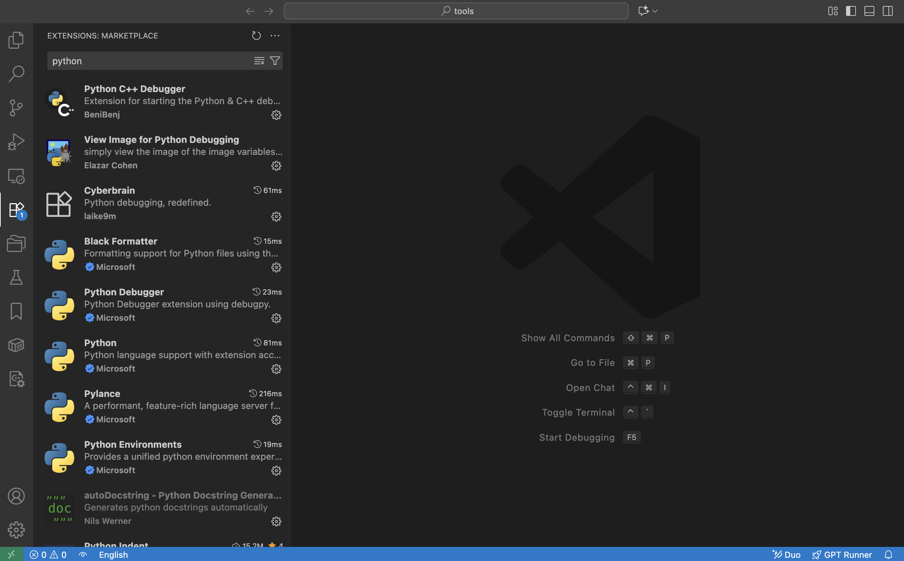
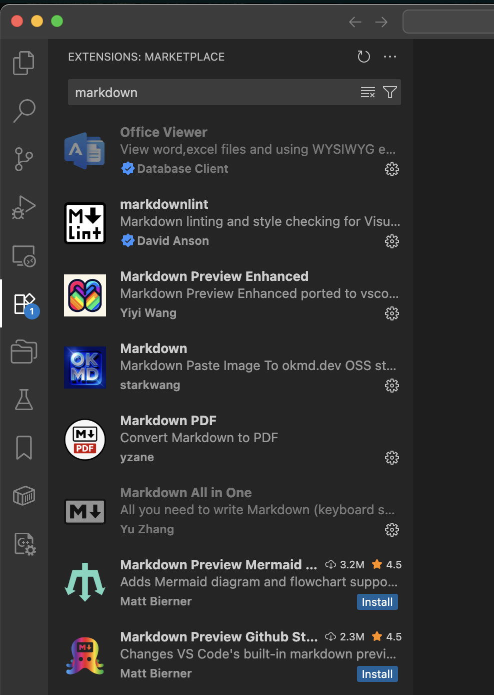
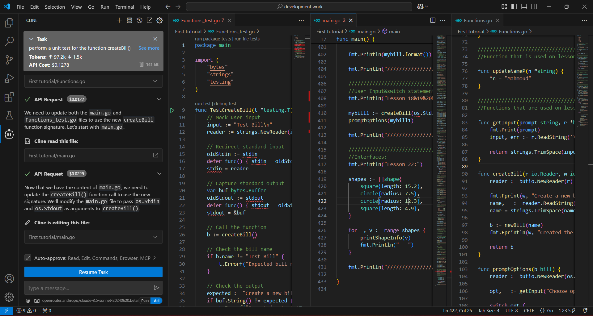
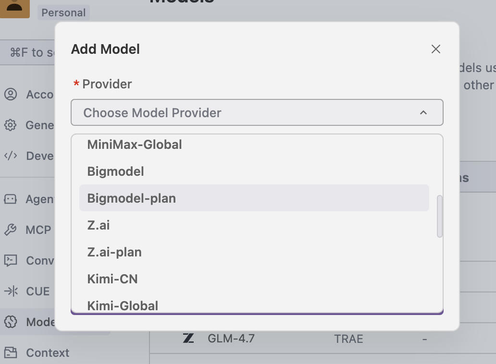
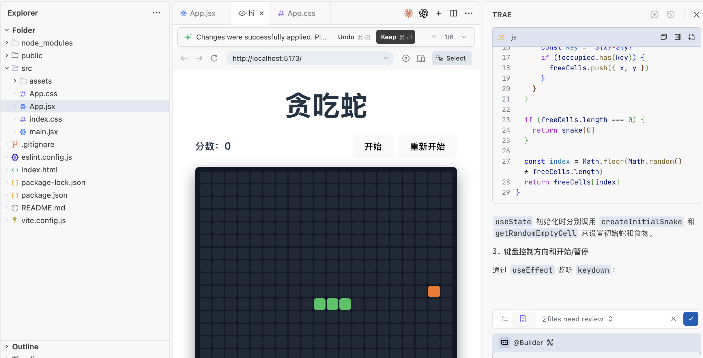
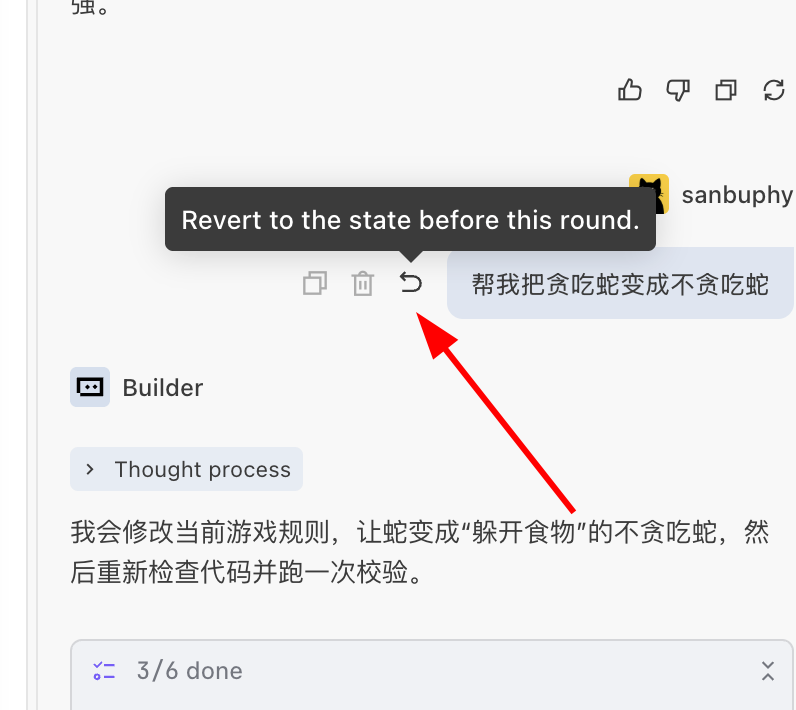
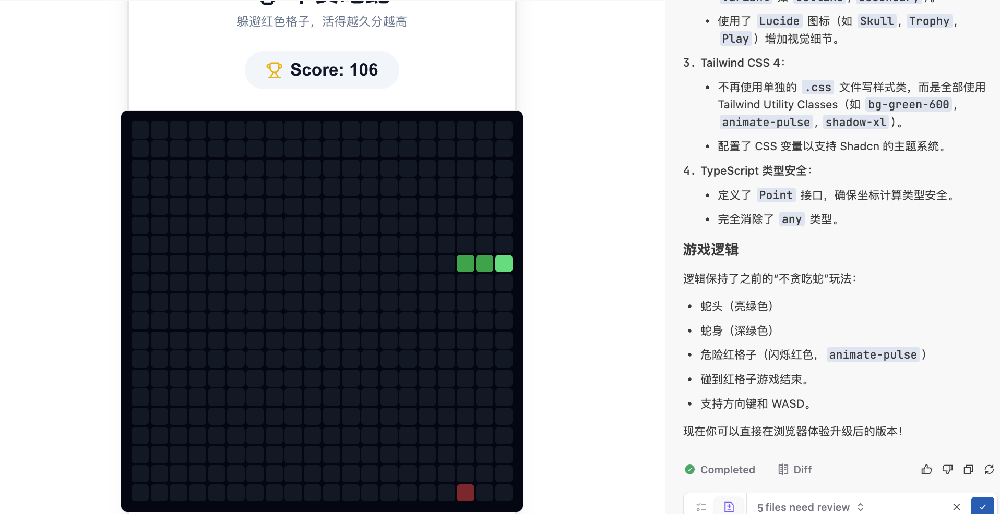

# Начальный уровень 2: Изучаем инструменты для AI-программирования

## Обзор главы

<script setup>
const duration = 'Около <strong>1 дня</strong>, можно проходить в несколько подходов'
</script>

<ChapterIntroduction :duration="duration" :tags="['Настройка локальной среды разработки', 'IDE против AI IDE', 'Приёмы эффективной разработки']" coreOutput="1 оригинальная игра, которую вы создадите" expectedOutput="Создано с помощью Trae">

Ранее мы попробовали AI-программирование на z.ai, но у веб-версии много ограничений — вы **не можете сохранять свою работу в любой момент**, вам **сложно управлять файлами** и вы **не можете работать со сложными проектами**. Эта глава поможет вам перенести среду разработки на свой собственный компьютер, чтобы вы могли **по-настоящему создавать вещи самостоятельно**.

Сначала мы проясним, **в чём разница между IDE и AI IDE** и почему последняя может **удвоить вашу эффективность**. Затем мы **шаг за шагом проведём вас** через создание игры «Змейка» локально с помощью Trae, охватив **полный рабочий процесс** от установки до запуска. В конце мы поделимся несколькими **практическими советами** по общению с AI, чтобы вы могли избежать распространённых ошибок.

После прохождения этой главы вы **освоите рабочий процесс разработки, похожий на тот, что используют профессиональные программисты**.

::: tip 💡 Продвинутый совет
Если у вас есть некоторый опыт программирования и вы хотите использовать более мощные инструменты с самого начала, вы можете обратиться к разделу [Современные CLI-инструменты для кодинга](../../stage-2/backend/modern-cli/), чтобы вести разработку из командной строки.
:::

</ChapterIntroduction>

<div style="margin: 50px 0;">
  <ClientOnly>
    <StepBar :active="0" :items="[
      { title: 'Понимание среды', description: 'IDE против AI IDE' },
      { title: 'Практика', description: 'Создаём «Змейку» в Trae' },
      { title: 'Глубокое изучение инструмента', description: 'Изучаем интерфейс IDE' },
      { title: 'Навыки общения', description: 'Эффективно общаемся с AI' }
    ]" />
  </ClientOnly>
</div>

## 1. Какая среда и какие инструменты нужны, чтобы писать код

### 1.1 Смена мышления: когда сомневаешься — сначала спроси AI

Прежде чем мы представим различные среды и инструменты, вот важное напоминание: вам нужно **изменить свои привычки мышления**.

При традиционном обучении программированию, если вам нужно установить Python, настроить Conda или исправить ошибку при установке npm, вы обычно открывали бы поисковик, находили туториал и выполняли шаги один за другим. Если по пути возникала ошибка, вы искали бы её текст и пробовали снова и снова.

Неправильно! ❌

В эпоху AI, особенно при использовании AI IDE, запомните один ключевой принцип: **для любой задачи вы можете сначала спросить AI или даже поручить ему сделать это за вас.**

- **Не знаете, как настроить среду?** Просто спросите AI в боковой панели: «Я хочу писать на Python. Пожалуйста, проверь, установлен ли Python, и если нет — установи его для меня.»
- **Сеть зависла?** Если установка зависимостей бесконечно крутится или выдаёт ошибки, просто скиньте ошибку AI: «Загрузка не удалась. Это проблема с сетью? Можешь помочь переключиться на другое зеркало?»
- **Не можете вспомнить команды?** Не нужно запоминать команды Git или Conda. Просто скажите AI: «Помоги мне создать новое виртуальное окружение под названием demo.»

### 1.2 Зачем нужны среда и инструменты

Переход от «попыток написать несколько строк кода» к «созданию проекта, который можно поддерживать долгое время» требует совершенно других сред и инструментов.

Теоретически вы могли бы писать код во встроенном системном Блокноте, но проблемы быстро дадут о себе знать:

- **Весь код — это обычный чёрный текст** — ключевые слова, строки и комментарии смешаны вместе, из-за чего сложно увидеть структуру с первого взгляда
- **Нет умных подсказок** — приходится полностью набирать каждое слово вручную, а одна опечатка означает многократную перепроверку кода
- **Файлы превращаются в хаос** — приходится переключаться туда-сюда между десятками файлов, часто не находя нужную строку для редактирования
- **Отладка превращается в гадание** — когда программа падает, вы не знаете, что пошло не так, и можете лишь построчно добавлять операторы вывода

Именно поэтому вам нужна IDE (интегрированная среда разработки). Она отображает код разными цветами, даёт автоподсказки по мере набора, организует файлы по проектам и позволяет шаг за шагом отслеживать ошибки — делая разработку эффективнее и менее подверженной ошибкам.

## 2. Что такое IDE и зачем она нужна

::: info Совет перед чтением
Если вы ещё не знакомы с тем, что такое IDE и за что отвечает каждый элемент интерфейса, мы рекомендуем сначала прочитать [Основы IDE](/ru-ru/appendix/2-development-tools/ide-basics), чтобы изучить базовые понятия и общие функции.
:::

На заре программирования всё, что нам было нужно, — это простой текстовый редактор и обработчик языка. Но по мере усложнения проектов разработчикам срочно понадобился инструмент, который мог бы эффективно управлять файлами, поддерживать подсветку синтаксиса и обеспечивать отладку — так и родилась интегрированная среда разработки (IDE).

Вы можете представить IDE как программу, специально созданную для того, чтобы «редактировать, управлять, запускать и отлаживать» код. Ранние IDE выглядели очень «примитивно» и управлялись почти полностью с клавиатуры.


Терминальный интерфейс — источник изображения: https://en.wikipedia.org/wiki/File:Emacs-screenshot.png

Известные и зрелые «встроенные IDE», такие как `Vim`, обычно используются для работы с удалёнными серверами.


Для большей эффективности нам нужны современные IDE, поддерживающие работу мышью, в которые обычно входят:

- **Редактор исходного кода**: подсветка синтаксиса, автодополнение.
- **Инструменты сборки и запуска**: встроенный компилятор/интерпретатор.
- **Отладчик**: отладка по точкам останова, просмотр значений переменных.

Современные IDE часто также включают встроенные инструменты вроде Git. Самая популярная — **[Visual Studio Code (VS Code)](https://code.visualstudio.com/)** от Microsoft, которая легковесна и расширяема. Хотя существуют и профессиональные IDE, такие как набор от JetBrains, VS Code наиболее дружелюбна к новичкам.


Ключевая философия VS Code — «всё является плагином». Благодаря системе плагинов она поддерживает различные языки — установите плагин Python, и она станет Python IDE, установите плагин C++, и она станет C++ IDE. Без плагинов это просто продвинутый текстовый редактор.



Вы даже можете использовать её для редактирования документов Markdown.



Короче говоря, IDE — это набор инструментов, который помогает разработчикам эффективно писать код и запускать программы.

Более подробные объяснения смотрите в [разделе визуализации виртуальной IDE в Приложении](/ru-ru/appendix/2-development-tools/ide-basics).

## 3. Чем AI IDE отличается от обычной IDE

Обычная IDE (например, исходная VS Code) — это по сути «ящик с инструментами»:
вы можете открывать проекты, писать код, запускать и отлаживать, устанавливать плагины — но при условии, что вы сами знаете, что нужно делать и как это делать:

- Когда возникает ошибка, вы сами читаете сообщение и выясняете, в какой строке проблема;
- Когда вы хотите добавить новую страницу или эндпоинт API, вы сами находите нужный файл и пишете код;
- Когда вы хотите настроить среду или собрать проект, вы сами ищете документацию и выполняете шаги.

Но в AI IDE вы можете напрямую использовать большую языковую модель, чтобы она помогала вам писать код и изменять файлы:

- Просто скажите «сделай страницу входа», и она сначала сгенерирует базовую структуру кода;
- Скиньте ей сообщение об ошибке и связанный код, и пусть она проанализирует причину и предложит исправления;
- После вашего подтверждения позвольте ей автоматически создавать файлы, массово редактировать код и выполнять рутинную работу между файлами.

Например, вы можете выделить фрагмент кода и попросить «отрефакторь это» или «добавь комментарии». Вы также можете спросить в боковой панели «Как устроен этот проект?» и указать область контекста с помощью `@имяфайла` или `@весь проект`, выполнив утомительные операции по созданию файлов, написанию кода и запуску одной фразой.

В последней версии VS Code ассистент на основе большой языковой модели уже встроен. Вы можете вести с моделью разговор обо всей кодовой базе, конкретном файле или даже конкретной функции. Вы также можете использовать её так же, как инструменты автокодинга, которыми вы пользовались в вебе — отправляйте свои требования как промпты встроенному агенту-кодеру, и пусть он автоматически реализует нужные вам функции, создаёт файлы, изменяет код, настраивает среду и многое другое.

Вы можете скачать и установить VS Code, нажать на значок боковой панели в правом верхнем углу и открыть область AI-функций, чтобы испытать эти возможности.


Однако VS Code — не та IDE, у которой самые сильные AI-возможности. Для сценариев, требующих интенсивного AI-кодинга, мы часто хотим использовать «более умные и эффективные» инструменты — хорошая AI IDE может существенно сэкономить время на написании кода и исправлении багов. Ниже мы представим несколько популярных AI IDE. Вы можете выбрать любую AI IDE исходя из личных предпочтений.

Поскольку VS Code имеет открытый исходный код (любой может скачать исходники и скомпилировать их самостоятельно), подавляющее большинство AI IDE на рынке сегодня построены на основе VS Code. Поэтому вам не нужно беспокоиться о том, что придётся «изучать много разных IDE» — **если вы знакомы с основами VS Code**, переход на эти AI IDE не потребует начинать с нуля.

В целом различия между AI IDE сводятся в основном к четырём аспектам: цена; доступные типы моделей (некоторые продвинутые модели могут быть ограничены в определённых регионах); возможности агента (насколько он умён и способен в помощи с кодингом); скорость и производительность. Вы можете выбирать на основе собственных результатов тестирования — лучший инструмент тот, что лучше работает именно для вас.

> Типичные AI IDE обычно обладают следующими ключевыми возможностями:
>
> - Умная генерация и автодополнение кода: в традиционных IDE мы обычно набираем несколько символов, чтобы автоматически дополнить имена переменных или функций. В современных AI IDE вы можете написать несколько строк псевдокода или просто описать свои требования, и IDE автоматически дополнит всю логику или даже сгенерирует крупные блоки кода по инструкциям.
> - Понимание кода и ответы на вопросы: IDE может понимать и отвечать на вопросы о конкретном фрагменте кода, файле или даже структуре каталогов всего проекта.
> - Рефакторинг и оптимизация кода: IDE может переписывать или оптимизировать логику реализации указанных фрагментов кода в соответствии с вашим намерением.
> - Автоматическая генерация тестов: IDE может автоматически генерировать тестовый код для разных функций и модулей, что упрощает целевое тестирование.
> - Выполнение задач в стиле агента: умные агенты могут автоматически генерировать, собирать, устанавливать, запускать и изменять код, частично заменяя работу младших инженеров-программистов во многих задачах.

::: details Antigravity

### [Antigravity](https://antigravity.google/)

Antigravity — это совершенно новая AI IDE, выпущенная Google в ноябре 2025 года вместе с Gemini 3, использующая модель разработки «Agent-First». В отличие от традиционного AI-кодинга, Antigravity делает AI-агента «активным исполнителем», способным напрямую управлять редактором, терминалом, браузером и другими инструментами, беря на себя больше работы по «выполнению», «планированию» и «проверке». Разработчикам нужно лишь выразить намерение высокого уровня, и агент автоматически разобьёт задачи, составит планы, выполнит код, запустит тесты и сгенерирует результаты. Поддерживается переключение между несколькими моделями, включая Gemini 3 Pro, Claude Sonnet 4.5 и другие. В настоящее время доступна как публичная превью-версия и поддерживает Windows, macOS и Linux.
:::

::: details Trae

### [Trae](https://www.trae.ai/)


Trae — это AI-ассистент для программирования, разработанный ByteDance, который поддерживает более 100 языков программирования и может интегрироваться в основные IDE. В число его функций входят: генерация кода из естественного языка, автоматическая отладка и преобразование дизайн-макетов в компоненты React/Vue. После обновления в августе 2025 года в Trae добавились умный импорт зависимостей, предложения по переименованию, управление чек-листами задач и многое другое. Режим SOLO также начал поддерживать генерацию серверного кода и редактирование документов технической архитектуры.
:::

::: details Cursor

### [Cursor](https://cursor.com/)

Cursor — это AI-редактор кода, разработанный Anysphere, построенный на кастомизированной VS Code, с оптимизациями, ориентированными на крупные кодовые базы и сценарии совместной работы с несколькими файлами. Он поддерживает такие модели, как GPT-4o и Claude 3.7. Режим Claude Max, представленный в 2025 году, способен работать с проектами на миллионы строк кода. В версии Pro убраны ограничения на количество запросов, что делает её идеальной для сложных корпоративных проектов.

В настоящее время Cursor, пожалуй, одна из лучших AI IDE с графическим интерфейсом по совокупному опыту использования, с большой пользовательской базой и частыми обновлениями функций. Его главный недостаток — более высокая цена: версия Pro стоит около $20 в месяц.


:::

::: details Qoder

### [Qoder](https://qoder.com/)

Qoder — это AI IDE от Alibaba, которая делает акцент на «прозрачном взаимодействии» и «улучшенных возможностях инженерии контекста». Она поддерживает разбиение задач на несколько шагов через Action Flow и в реальном времени отслеживает выполнение AI. Она также поддерживает динамическую маршрутизацию между несколькими моделями и управление конечным автоматом состояний задач, что делает её идеальной для управления архитектурой в средних и крупных проектах и «обратного инжиниринга» при анализе устаревших систем.


:::

::: details CodeBuddy

### [CodeBuddy](https://www.codebuddy.com/)

CodeBuddy — это AI-инструмент для программирования от Tencent Cloud, который делает акцент на поддержке команд на китайском языке и возможностях соответствия требованиям корпоративного уровня. Он предлагает автодополнение кода, пакетный код-ревью и переключение между несколькими моделями. Его агент Craft может выполнять генерацию кода для нескольких файлов и интеграцию API. Корпоративная версия поддерживает приватное развёртывание и прошла сертификацию безопасности 3-го уровня, что делает её подходящей для отраслей с высокими требованиями к безопасности данных, таких как финансы и здравоохранение.


:::

::: details VS Code + Cline

### VS Code + [Cline](https://cline.bot/)

Cline — это плагин AI-агента для программирования для VS Code (Visual Studio Code), который может гибко переключаться между разными большими моделями за счёт настройки разных эндпоинтов API. Cline поддерживает мультимодальный ввод, расширения инструментов MCP и мониторинг затрат, причём все операции требуют подтверждения пользователя перед выполнением. Он идеален для быстрой проверки идей или интеграции с существующими рабочими процессами разработки. Базовые функции бесплатны, а корпоративная версия поддерживает развёртывание моделей в приватных средах.



:::

::: details Kiro

### [Kiro](https://kiro.dev/)

Kiro — это AI IDE для программирования от AWS (Amazon Web Services), глубоко интегрированная с Amazon Bedrock и экосистемой облачных сервисов AWS. Она поддерживает несколько больших моделей, включая Claude и Nova, что делает её особенно подходящей для сценариев разработки, требующих тесной интеграции с облачными сервисами AWS. Kiro предоставляет умную генерацию кода, автоматизированное тестирование и бесшовную интеграцию с ресурсами AWS (такими как Lambda, S3, DynamoDB), предлагая уникальные преимущества для разработки облачных приложений.

> **Примечание**: если вы хотите использовать модели Anthropic Claude, вам нужно будет использовать в качестве IDE Cursor, Kiro или Antigravity. У этих IDE есть официальные партнёрства или глубокие интеграции с Anthropic, что обеспечивает более стабильный и полноценный опыт работы с моделями Claude.
:::

<div style="margin: 50px 0;">
  <ClientOnly>
    <StepBar :active="1" :items="[
      { title: 'Понимание среды', description: 'IDE против AI IDE' },
      { title: 'Практика', description: 'Создаём «Змейку» в Trae' },
      { title: 'Глубокое изучение инструмента', description: 'Изучаем интерфейс IDE' },
      { title: 'Навыки общения', description: 'Эффективно общаемся с AI' }
    ]" />
  </ClientOnly>
</div>

## 4. Практика: создаём игру «Змейка» локально с помощью AI IDE

Предыдущие разделы были в основном о «концепциях» и «различиях». В этом разделе мы превратим абстрактные концепции в конкретные действия через полноценное практическое упражнение: **создаём новую пустую папку -> открываем её в AI IDE -> общаемся в боковой панели и поручаем ей создать игру «Змейка» с нуля на React.** Здесь мы будем использовать Trae в качестве примера, поэтому сначала нам нужно установить его и понять, что такое Trae.

::: tip 💡 Быстрый совет: бесшовный переход из веба на локальную машину
Если вы ранее разрабатывали проекты на z.ai или других веб-платформах AI-программирования, вы можете скачать код напрямую на свою локальную машину и открыть его в AI IDE, чтобы продолжить разработку. Так вы сохраните свою предыдущую работу и при этом получите более мощную AI-помощь локальной IDE.

Шаги просты:
1. Нажмите кнопку загрузки на платформах вроде z.ai, чтобы сохранить проект локально
2. Распакуйте и откройте папку в AI IDE, такой как Trae/Cursor
3. Продолжайте общаться с AI в боковой панели, чтобы итеративно улучшать свой проект
:::

### 4.1 Подготовка: установите Trae и узнайте о нём

#### 4.1.1 Что такое Trae

Полное название Trae можно понимать как «The Real AI Engineer» (настоящий AI-инженер). Это адаптивная интегрированная среда разработки с AI (IDE), разработанная ByteDance. Она построена на основе популярной VS Code, а значит, если вы уже знакомы с VS Code, компоновка интерфейса и базовые операции Trae покажутся вам очень знакомыми и удобными.

Ключевая цель Trae — быть «умным партнёром по программированию» для разработчика. Благодаря глубокой интеграции AI он может автоматически выполнять большой объём повторяющейся работы, обеспечивая вам более интуитивный и эффективный опыт разработки. Это не просто «инструмент автодополнения кода» — он стремится помогать на протяжении всего рабочего процесса разработки: от создания проектов, написания кода, отладки, тестирования до развёртывания.

#### 4.1.2 Установка Trae

Trae существует в международной версии и в версии для Китая. Международная версия требует доступа к зарубежным сетям, но позволяет использовать новейшие зарубежные модели вроде GPT-5. Версия для Китая в основном поддерживает новейшие отечественные большие модели, такие как GLM, Qwen, Kimi и другие.

Загрузка международной версии: https://www.trae.ai/
Загрузка версии для Китая: https://www.trae.cn/

##### Цены и варианты использования Trae

::: info 💡 Советы по выбору версии (для новичков рекомендуется версия CN)
- **Для новичков мы настоятельно рекомендуем скачать версию для Китая (версия CN, trae.cn)** — в настоящее время она обеспечивает лучший общий опыт и бесплатна в использовании, без необходимости в зарубежной сети
- Если вам нужно использовать зарубежные модели вроде GPT-5 и ваши сетевые условия это позволяют, вы можете выбрать международную версию
- Если у вас уже есть API Key стороннего поставщика моделей, подключение сторонних моделей даёт гибкий контроль над затратами
:::

> 💡 **В настоящее время рекомендуется: используйте бесплатные модели OpenRouter для тестирования**
>
> На момент написания этого туториала (2026-02-12) вы всё ещё можете бесплатно попробовать модели StepFun. См. раздел 4.2 ниже о том, как подключить модель `stepfun/step-3.5-flash:free`.

Что касается затрат и вариантов использования Trae, вот несколько вариантов на выбор:

- **Версия для Китая CN (настоятельно рекомендуется)**: базовое использование бесплатно, и в настоящее время она обеспечивает лучший общий опыт, чем международная версия, — идеальна для новичков. Из-за большого числа пользователей вам иногда может потребоваться подождать в очереди.
- **Международная версия**: подписка стоит около $3 в месяц, давая доступ к зарубежным моделям вроде GPT-5, но требует доступа к зарубежной сети.
- **Интеграция сторонних моделей**: если у вас уже есть Token API от отечественного поставщика больших моделей (например, DeepSeek, Tongyi Qianwen, Kimi и т. д.), вы можете подключить эти API через настройку сторонних моделей в Trae. Крупные облачные провайдеры (такие как Alibaba Cloud, Tencent Cloud, Baidu Cloud и др.) обычно предлагают подписки Coding Plan, которые позволяют использовать их API больших моделей по более выгодным ценам. Так вы можете свободно выбирать предпочитаемую модель, контролируя при этом затраты.

Мы рекомендуем новичкам начать с бесплатной версии для Китая CN (загрузка: https://www.trae.cn/), которая в настоящее время предлагает лучший опыт и полностью бесплатна. Если вы столкнётесь с проблемами очередей или вам понадобится более стабильный сервис, рассмотрите подключение сторонней модели и покупку соответствующего Coding Plan облачного провайдера.

#### 4.1.3 Обзор интерфейса Trae

С точки зрения дизайна интерфейса Trae очень похож на VS Code, который мы используем каждый день: та же классическая трёхколоночная компоновка с проводником файлов слева, областью редактирования в центре и панелью расширений справа.


Боковая панель справа — это окно взаимодействия Copilot, которое также можно рассматривать как окно агента. Если вы не видите его сразу, нажмите на значок боковой панели в правом верхнем углу Trae, чтобы открыть его.


После открытия боковой панели вы увидите опцию `Builder` — это режим агента. Проще говоря, это как «локальная версия» z.ai, которая может управлять вашей локальной средой, устанавливать среды выполнения, открывать веб-страницы и многое другое.


После нажатия «Builder» вы увидите режим «Chat» и режим «Builder with MCP»:

- **Режим Chat**: используется в основном для обсуждения кода в вашей текущей папке или как обычная чат-модель. (Вы можете открыть папку через меню «File» в левом верхнем углу и редактировать внутри этой папки. В этом случае любые файлы, которые Builder создаёт или изменяет, будут затрагивать только эту папку.)
- **Режим Builder with MCP**: предоставляет агенту больше доступных инструментов (например, соединение языковой модели с другим ПО, запрос погоды и т. д.). Можно просто понимать это так: MCP облегчает языковой модели вызов различных внешних инструментов.


В области ниже вы также увидите опции выбора модели — нажмите, чтобы сменить текущую большую модель. В версии для Китая вы можете выбрать отечественные модели вроде Kimi k2 или GLM. Если вы используете международную версию Trae, вы также можете выбрать зарубежные модели вроде ChatGPT или Claude. Однако, поскольку отечественные большие модели развиваются очень быстро, Kimi, Qwen, GLM и другие уже обеспечивают опыт, близкий к Claude 3.5 или 3.7, во многих задачах, чего более чем достаточно для повседневной разработки. Строгого требования использовать международную версию или версию для Китая здесь нет.

**Обратите внимание, что мы не рекомендуем использовать режим Auto (автоматический выбор модели). Для международной версии мы рекомендуем использовать модели Gemini или GPT. Для версии для Китая мы рекомендуем попробовать отечественные модели вроде Kimi k2, Minimax или GLM.** Разные модели подходят для разных сценариев — нет догматичного правила о том, какая лучше. Когда вы упрётесь в стену с одной моделью, попробуйте переключиться на другую. Через множество тестов вы найдёте лучшие результаты для своего рабочего процесса.


Это краткое введение в Trae. Далее давайте вспомним, что мы делали ранее на z.ai, и попробуем сделать то же самое в Trae.

### 4.2 Шаг 1: создайте пустую папку и откройте её в AI IDE

Прежде чем начать, нам сначала нужно подготовить чистый рабочий каталог проекта.
Для примера в этом разделе вы можете создать на своей локальной машине новую пустую папку с именем `snake-game-react`.

Затем откройте установленную AI IDE, выберите «Open Folder» на стартовом экране и импортируйте пустую папку как корневой каталог проекта. Вы также можете просто перетащить папку в окно IDE, чтобы открыть её. На этом этапе проводник файлов слева не покажет никаких файлов кода, что указывает на то, что мы начинаем с полностью пустого состояния проекта.

::: details 📚 Опционально: подключение API облачного провайдера или Coding Plan

В этом разделе рассказывается, как подключить API облачного провайдера или Coding Plan для более стабильных и частых вызовов модели. Скриншоты интеграции Trae приведены в конце.

**Что такое Coding Plan**

Coding Plan — это подписка, предлагаемая крупными облачными провайдерами. После покупки вы можете в течение определённого периода **использовать API больших моделей провайдера без ограничений или с высокой частотой**. По сравнению с оплатой за токены, Coding Plan больше похож на «ежемесячный пакет» — вы платите фиксированную сумму и можете пользоваться свободно, не беспокоясь о плате за каждый вызов.

**Зачем покупать Coding Plan**

Вы можете спросить: раз можно вызывать большие модели напрямую через API, зачем покупать Coding Plan? Главная причина — **неограниченное использование**. Ключевое преимущество Coding Plan в том, что вы можете вызывать большую модель в любой момент, так часто, как захотите, не беспокоясь о том, что затраты взлетят, и не сверяясь постоянно со счетами.

**Рекомендуемые Coding Plan отечественных облачных сервисов**

Вот рекомендуемые варианты Coding Plan от крупных отечественных облачных провайдеров:

- Zhipu AI (план BigModel): https://bigmodel.cn/glm-coding
- Volcengine (план ByteDance Cloud AI): https://www.volcengine.com/activity/codingplan

> 💡 **Вы также можете подключить API большой модели напрямую**
> Помимо Coding Plan, вы также можете напрямую подключать различные API моделей через Add Model. Вы можете ориентироваться на приведённый ниже способ подключения бесплатного API OpenRouter StepFun для интеграции с Trae. Тесты показывают, что он удовлетворяет базовые потребности в программировании.
> Если вам нужно пополнить баланс, мы советуем начать с небольшой суммы (например, 10 юаней), чтобы посмотреть, на сколько её хватит, например с экономичными моделями вроде DeepSeek.

**Как подключить Coding Plan**

Подключить Coding Plan очень просто и занимает всего несколько минут:

1. Зайдите на сайт выбранного облачного провайдера (например, Zhipu AI: https://bigmodel.cn/glm-coding, Volcengine: https://www.volcengine.com/activity/codingplan)
2. Зарегистрируйте аккаунт и войдите
3. Найдите страницу «Pricing» или «Coding Plan»
4. Выберите подходящий вам план и завершите оплату
5. После оплаты вы получите API Key или Plan ID

::: tip 🎯 Рекомендации по пользовательским моделям

При подключении пользовательских моделей в Trae мы **рекомендуем по умолчанию использовать подход OpenRouter**. OpenRouter предоставляет унифицированный API-интерфейс для удобного подключения к нескольким большим языковым моделям.

**По состоянию на 12 февраля 2026 года вы всё ещё можете использовать бесплатный API StepFun:**

- **`stepfun/step-3.5-flash:free`**: бесплатная модель от StepFun, которую можно напрямую подключить в Trae.

**Другие бесплатные модели:**

- **`openrouter/free`**: вариант модели, который по умолчанию использует бесплатные API LLM. Вы можете использовать его прямо в интеграции пользовательских моделей Trae (просто введите ID модели), испытывая функции AI-программирования совершенно бесплатно.

Эти бесплатные варианты отлично подходят для новичков. Прежде чем переходить к продакшен-использованию, вы можете ознакомиться с рабочим процессом AI IDE через эти бесплатные варианты.

**Опционально: подключение API большой модели (на примере DeepSeek)**

1. Зайдите на платформу DeepSeek: https://platform.deepseek.com/usage
2. Зарегистрируйте аккаунт и войдите
3. Купите пакет токенов на 10 юаней на странице пополнения
4. После пополнения создайте и скопируйте API Key на странице API Keys
5. В Trae нажмите **«Add Model»**, найдите DeepSeek, выберите соответствующую модель и введите API Key, чтобы начать пользоваться

Через интерфейс ниже вы можете успешно добавить модель (примечание: после выбора опции модели **обязательно прокрутите до самого низа** — там есть опция «Custom Model». Нажмите её, чтобы ввести ID модели, где вы можете указать рекомендуемые ID моделей, такие как `stepfun/step-3.5-flash:free`. Также нажмите «Get Key» ниже, чтобы посетить официальный сайт и получить соответствующий API Key.)



:::

### 4.3 Шаг 2: пообщайтесь в боковой панели и поручите AI спроектировать игру «Змейка» на React

Далее откройте боковую панель чата AI: обычно нажатием `Ctrl+L` или щелчком по значку чата справа. Затем введите чёткий промпт:

> Пожалуйста, реализуй игру «Змейка» на архитектуре React, включая управление с клавиатуры, рост и начисление очков при поедании еды, а также отображение «Game Over» с поддержкой перезапуска при столкновении со стенами или с самой собой. После реализации помоги мне запустить этот проект. Если какая-либо программная среда не установлена, автоматически установи недостающую среду.

В ходе этого процесса вам нужно осознать, что AI — это не просто чат-модель: он может помочь вам управлять вашей локальной средой: создавать файлы, устанавливать зависимости, выполнять команды запуска и т. д. Вы можете прямо описывать свои цели на естественном языке и позволять AI решать, какие именно команды выполнять и как организовать код.

Если в процессе выполнения возникают проблемы, AI отобразит ошибки и решения в диалоге. Вы можете продолжать корректировать через диалог, не запоминая все детали команд самостоятельно.

::: warning ⚠️ Важное примечание
Как показано на рисунке ниже, **иногда AI-агент приостанавливается во время выполнения, потому что ему нужно дождаться, пока вы введёте какую-то информацию для взаимодействия**, например введёте создаваемое имя, или нажмёте Enter для подтверждения выполнения команды, или щёлкнете по команде для выполнения. Обычно мы просто нажимаем Enter. Если вы не уверены, что требуется на этом шаге, можете сделать скриншот текущего интерфейса и спросить большую модель, какую операцию следует выполнить.
:::

Как показано, здесь нам нужно нажать Run для подтверждения:


Как показано, здесь нам нужно лишь ввести y для подтверждения:


Как показано, здесь мы создаём шаблон, но не знаем, как действовать. Мы можем сделать скриншот этой части и спросить большую модель:


Ещё одна причина, по которой AI-агент приостанавливается во время выполнения, — это то, что он запустил «сервис». Наша игра «Змейка» сама по себе является своего рода «сервисом». Если вы видите URL вместе со следующей командой, это означает, что агент выполнил для нас локальный компьютерный сервис. Мы можем перейти по соответствующему URL, чтобы получить доступ к нашей «Змейке». Поскольку сервис должен работать непрерывно, выполнение приостановится здесь. Нам нужно просто нажать кнопку `Skip`.


В ходе этого процесса, если вы встретите термины и содержание, которые не понимаете, не волнуйтесь. Вы можете обратиться к разделу «Объяснение компьютерных терминов» в приложении, или напрямую спросить AI, или своевременно задать вопросы!

Если в процессе вы столкнётесь с неожиданными явлениями, например змейка не завершает игру при столкновении со стеной или змейка не двигается после нажатия «Старт», вам нужно просто описать это явление агенту в боковой панели. Если вы столкнётесь с ошибками, не забудьте сделать скриншот или скопировать ошибку агенту в боковой панели. Если после нескольких попыток проблему всё ещё не удаётся решить, попробуйте сменить модель.

Через некоторое время мы можем получить результаты, похожие на z.ai:



Мы можем нажать галочку в правом нижнем углу, чтобы подтвердить изменения кода, или нажать кнопку `Cancel`, чтобы отменить изменения. Или щёлкнуть по области «2 files need review», чтобы развернуть и просмотреть изменённый код.

Также стоит отметить, что, поскольку изменения кода не всегда могут быть верными, нам нужно знать, что все агенты IDE поддерживают откат кода. Например, если я случайно выполнил здесь неправильную операцию изменения или результат этой операции неудовлетворителен, после завершения изменения мы можем вернуться в область поля ввода и нажать кнопку Revert, чтобы откатить операцию к состоянию до изменения. Вы можете изменить введённый текст для другой операции:



### 4.4 Шаг 3 (опционально): спросите AI о деталях реализации кода

Когда игра «Змейка» работает нормально, если вы пока не знакомы с фронтендом или React, вы можете продолжить в том же окне чата и попросить AI провести вас по коду как можно более простым языком. Вам не нужно переключать инструменты или специально просматривать документацию — просто продолжайте задавать вопросы о текущем проекте.

Практичный подход — сначала попросить AI дать общее объяснение «как движется игра», а затем разбить его на конкретные детали. Например, вы можете прямо спросить:

> «Пожалуйста, объясни сверху вниз, как пошагово движется эта «Змейка»? Постарайся использовать как можно меньше технических терминов.»


Затем уточните ключевые моменты на основе его ответа, например:

> «Какая структура данных используется для записи каждого сегмента тела змейки на экране? Можешь привести аналогию?»
> «Как ты управляешь "движением раз в определённый промежуток времени"? В каком участке кода это находится?»
> «Когда змейка ест еду, какие шаги ты выполняешь? Где находится логика, определяющая, что она что-то съела?»
> «Где в коде проверяется столкновение со стенами и столкновение с самой собой соответственно?»

Если вы видите какой-то файл (например, `SnakeGame.tsx`), но понятия не имеете, что он делает, вы также можете напрямую попросить AI объяснить его по частям:

> «Пожалуйста, объясни `SnakeGame.tsx` в виде нескольких функциональных блоков: за что примерно отвечает каждый блок, используя более простой язык.»

В этом раунде диалога вы можете рассматривать любое непонятное слово как отправную точку для уточняющих вопросов, например:

> «Что именно означает "состояние" в том, что ты только что сказал? Можешь объяснить на жизненном примере?»
> «Что в основном делает здесь "таймер"? Что произошло бы, если бы его убрали?»

С помощью этого метода ваша цель — не запомнить все концепции сразу, а сначала понять три вещи: какие ключевые данные есть в этой игре (змейка, еда, очки, состояние игры и т. д.), когда эти данные меняются (движение, поедание еды, конец игры и т. д.) и какой небольшой участок кода соответствует каждому изменению. Как только эти три момента ясны, вы в основном можете понять главную логику этого кода.

### 4.5 Шаг 4: попросите AI сделать интерфейс красивее

Сначала напоминание для новичков: не говорите AI просто «я хочу сделать этот интерфейс красивее». Эта фраза слишком расплывчата даже для дизайнеров-людей, не говоря уже о моделях — что значит «красивый» стиль, какие части нужно скорректировать, это проблема компоновки или цвета? AI не может всё это прочитать из вашей одной фразы. Чтобы AI действительно выдал результаты, близкие к тому, что у вас в голове, вам нужно научиться разбивать расплывчатую цель «я хочу, чтобы было красиво» на ряд конкретных, выполнимых маленьких требований.

Например, многие сначала говорят что-то такое:

> «Я хочу сделать этот интерфейс немного красивее.»

Вместо этого вы можете сначала задать набор общих требований:

> «Пожалуйста, помоги мне в целом украсить интерфейс игры:
>
> - Отцентрируй игровую область, не прижимай её к левому верхнему углу;
> - Замени на более светлый цвет фона, чтобы змейка и еда были заметнее;
> - Увеличь счёт и помести его на видное место;
> - Используй синий как основную цветовую гамму, чтобы украсить общую цветовую схему и кнопки.»

Если вы хотите более чёткую обратную связь при завершении игры, можете дополнительно добавить:

> «Когда игра заканчивается, отобрази "Game Over" в центре экрана, а под ним кнопку "Restart", которая может сбросить игру.»

AI напрямую изменит компоненты и стили React на основе вашего описания. После сохранения обновите браузер, чтобы увидеть новый интерфейс. Если эффект всё ещё отличается от того, что вы представляли, вы можете продолжить вносить небольшие корректировки, например:

> «Сделай счёт немного крупнее, а цвет — заметнее.»
> «Сделай игровую область более компактной, с небольшими отступами вокруг неё.»
> «Измени кнопку перезапуска на синий скруглённый стиль, отцентрированную под подсказкой.»

На этом этапе, если изменение вызывает ошибку, вам не нужно разбираться с ней самостоятельно. Просто скопируйте сообщение об ошибке в окно чата или дайте краткое описание вроде «Это ошибка, которая появилась после того, как я украсил интерфейс», и позвольте AI найти и исправить её в контексте текущего проекта. Так вы можете постепенно отполировать работающее демо до небольшого законченного продукта с понятным интерфейсом и плавными взаимодействиями через цикл «непрерывный диалог, непрерывное обновление».

### 4.6 (Опционально) Использование архитектуры z.ai для доработки результата «Змейки»

Для новичков в vibe coding самое сложное — не знать, что считается «лучшими практиками» или какая архитектура наиболее подходит; поскольку вы не знаете основ работы компьютера, вы не можете хорошо направлять AI. Решение этой проблемы — «прямое заимствование». Помните, мы говорили, что вы можете просматривать код в z.ai? На самом деле соответствующий README (часть, используемая в проектах для описания функциональности и технической архитектуры) уже даёт ориентир на лучшую архитектуру:


Если мы хотим, чтобы локальный результат как можно точнее соответствовал результату z.ai, мы можем скопировать всё содержимое этого README и вставить его в боковую панель Trae, попросив изменить локальный код в соответствии с архитектурой README.


В итоге мы можем получить стили оформления страницы, очень похожие на z.ai:



<div style="margin: 50px 0;">
  <ClientOnly>
    <StepBar :active="2" :items="[
      { title: 'Понимание среды', description: 'IDE против AI IDE' },
      { title: 'Практика', description: 'Создаём «Змейку» в Trae' },
      { title: 'Глубокое изучение инструмента', description: 'Изучаем интерфейс IDE' },
      { title: 'Навыки общения', description: 'Эффективно общаемся с AI' }
    ]" />
  </ClientOnly>
</div>

## 5. За что отвечает каждая кнопка интерфейса

В описанных выше операциях мы быстро прошли минимальный цикл генерации программы, но мы всё ещё не знакомы с IDE. Чтобы основательно освоить этот инструмент, с которым мы будем работать долгое время, в этом разделе мы дадим подробные объяснения каждой детали IDE. Начнём с интерфейса: у разных AI IDE интерфейсы немного отличаются, но большинство следуют [компоновке VS Code](https://code.visualstudio.com/docs/getstarted/getting-started).


Конкретная функция каждой части такова:

- **Заголовок окна (Title Bar)**: отображает имя файла и кнопки управления окном.
- **Панель действий (Activity Bar)**: переключает между функциональными режимами, такими как файлы и поиск.
- **Боковая панель (Side Bar)**: отображает конкретное содержимое, например списки файлов.
- **Группы редакторов (Editor Groups)**: основная область для написания кода.
- **Хлебные крошки (Breadcrumbs)**: показывают путь к файлу и поддерживают навигацию.
- **Мини-карта (Minimap)**: быстрый предпросмотр и позиционирование в коде.
- **Панель (Panel)**: содержит терминал и окна вывода.
- **Строка состояния (Status Bar)**: отображает текущее состояние среды.

Более подробные объяснения смотрите в [разделе визуализации виртуальной IDE в Приложении](/ru-ru/appendix/2-development-tools/ide-basics).

<div style="margin: 50px 0;">
  <ClientOnly>
    <StepBar :active="3" :items="[
      { title: 'Понимание среды', description: 'IDE против AI IDE' },
      { title: 'Практика', description: 'Создаём «Змейку» в Trae' },
      { title: 'Глубокое изучение инструмента', description: 'Изучаем интерфейс IDE' },
      { title: 'Навыки общения', description: 'Эффективно общаемся с AI' }
    ]" />
  </ClientOnly>
</div>

## 6. Как эффективно общаться с AI

По мере того как возможности AI становятся всё сильнее, мы можем делегировать AI значительную часть работы «программист пишет код». Однако на практике вы обнаружите, что, используя один и тот же AI, одни люди могут получить рабочий небольшой проект за несколько фраз, в то время как другие общаются долгое время, но получают результаты, совершенно отличные от желаемых. Разница часто кроется не в том, «кто умнее», а в том — достаточно ли конкретно и пошагово вы общаетесь с AI. В этом разделе на примере нескольких распространённых сценариев представлены некоторые методы постановки вопросов, подходящие для абсолютных новичков, которые помогут вам стабильнее получать пригодные результаты от AI.

### 6.1 Проясните свои требования: от «расплывчатой идеи» к «конкретному описанию»

Многие, впервые используя AI, привыкли говорить лишь одну очень общую фразу, например:

> «Помоги мне сделать веб-страницу.»
> «Помоги мне написать небольшую программу.»

В этом случае AI может только «вообразить», чего вы хотите, поэтому он непринуждённо выдаст вам нечто, что выглядит довольно законченным, но часто сильно отличается от того, что вы на самом деле хотите сделать. Чтобы AI понимал вас лучше, вам нужно разбить «идею в вашей голове» и объяснить её шаг за шагом.

Вы можете дополнить с этих сторон:

1. **Скажите ему, для чего вы используете эту вещь**
   Например, не говорите просто «личный сайт», а скажите:
   - «Я хочу сделать страницу с личным профилем, содержащую только одну страницу контента, чтобы отправлять её рекрутёрам.»

2. **Скажите ему примерно, какие блоки контента вам нужны**
   Не нужно использовать профессиональные термины, просто опишите, что вы хотите увидеть на странице, например:
   - «На странице должно быть три раздела: вверху — моё имя и фраза-самопрезентация, в середине перечислено несколько мест работы, а внизу — email и WeChat ID.»

3. **Скажите ему о своём уровне и ограничениях**
   Пусть AI сделает это так, чтобы новичок смог принять, например:
   - «Я вообще не умею писать код, пожалуйста, используй самый простой способ, чтобы я мог сразу скопировать его в один файл и открыть в браузере.»

4. **Скажите ему, как вы хотите получить результаты**
   Например:
   - «Пожалуйста, дай мне полный код, который можно сразу сохранить как `index.html` и открыть в браузере.»

Собрав всё вместе, вы можете сказать AI следующее:

> «Я вообще не умею писать код и хочу сделать страницу с личным профилем, содержащую только одну страницу контента, чтобы отправлять её рекрутёрам.
> На странице нужно три раздела: верхняя строка — моё имя и фраза-самопрезентация, в середине — несколько мест работы, а внизу — email и WeChat ID.

Когда вы проясните эту информацию, AI сможет приблизиться к вашим реальным потребностям, а не непринуждённо выдать вам нечто, «что выглядит впечатляюще, но бесполезно».

### 6.2 Соблюдайте правильный ритм: сначала «заставьте работать», затем постепенно усложняйте

Для абсолютных новичков самая распространённая ошибка — это желание сразу с самого начала сделать нечто «очень полное» и «с множеством функций».
Например:

> «Помоги мне сделать сайт вроде Taobao.»
> «Помоги мне сделать систему с регистрацией, входом и оформлением заказов.»

Результат часто такой: AI выдаёт вам большой кусок кода, который после копирования либо не открывается, либо повсюду содержит ошибки; при этом вы не понимаете, где проблема, и в конце концов вынуждены сдаться.

Лучший подход — **активно управлять ритмом**, позволяя AI следовать за вами шаг за шагом, а не вываливать всё на вас сразу. Вы можете запрашивать в таком порядке:

1. **Первый шаг: попросите «минимальный пример»**
   Проверьте только одно: видите ли вы что-нибудь в браузере?
   Например:

   > «Пожалуйста, сначала дай мне самый простой пример, лишь бы я увидел в браузере строку с надписью "Это моя главная страница".
   > Затем расскажи шаг за шагом: каким должно быть имя файла, как мне его сохранить и как открыть.»

2. **Второй шаг: на этой основе постепенно добавляйте полное содержимое**
   После того как вы подтвердите «я действительно вижу эту строку текста», скажите:

   > «На основе того, что у нас только что было, помоги мне добавить область "Опыт работы" и снова пришли мне полный код. Не присылай только изменённые части.»

3. **Третий шаг: когда структура почти готова, подумайте, красиво ли это**
   Например:
   > «Теперь страница может нормально отображать содержимое. Далее, пожалуйста, помоги мне немного её украсить: отцентрируй в целом, сделай заголовок крупнее и используй более комфортный шрифт. Пожалуйста, дай мне обновлённый полный код.»

С каждым добавлением вы сначала один раз запускаете, чтобы убедиться, что изменение действительно есть, прежде чем позволить AI продолжить. Так, даже если что-то пойдёт не так на любом шаге, вы сможете быстро вернуться к состоянию «предыдущей рабочей версии», не начиная полностью с нуля.

### 6.3 Хорошо используйте скриншоты и копирование: если не можете сказать словами — «киньте экран AI»

Многие трудности, с которыми сталкиваются абсолютные новички, кроются не в «незнании, как изменить код», а в **незнании, как описать проблему**.
Например:

- В браузере внезапно появляется куча английских ошибок, которые вы совершенно не понимаете.
- Компоновка веб-страницы отличается от того, что вы хотели, но вы не знаете, какими словами это описать.

В этих случаях вам не нужно выдавливать из себя профессиональные термины. Самый простой способ — **прямо кинуть AI то, что вы видите**.

Вы можете сделать так:

1. **Скопируйте текст ошибки**
   Когда вы видите строку красных сообщений об ошибках, вы можете прямо скопировать их и сказать:

   > «Это полное сообщение об ошибке, появившееся после того, как я запустил. Я не понимаю этот английский, пожалуйста, сначала объясни словами, понятными обычному человеку, что это примерно означает.
   > Затем скажи, каким самым простым способом мне сейчас это исправить.»

2. **Покажите AI скриншот**
   Если вы чувствуете, что «эта страница просто выглядит неправильно», но не можете описать это, вы можете:
   - Сделать скриншот текущей страницы;
   - Скопировать AI весь используемый вами участок кода;
   - Затем объяснить:
     > «Вот как сейчас выглядит страница, а вот мой текущий полный код.
     > Я изначально хотел, чтобы это была трёхколоночная компоновка, но теперь она стала одноколоночной. Пожалуйста, помоги найти причину и дай мне исправленный полный код.»

   ::: tip 💡 Дополнительное примечание о функции скриншотов

   Важно отметить, что **не все AI-модели поддерживают "просмотр картинок".** Здесь задействованы две разные концепции:

   - **Чисто текстовые большие модели (LLM)**: могут обрабатывать только текстовый ввод и не могут распознавать содержимое изображений. Если вы отправите им скриншот, они либо откажутся его обрабатывать, либо не смогут правильно понять информацию на изображении.

   - **Мультимодальные модели**: могут одновременно обрабатывать несколько типов ввода, таких как текст и изображения, могут «понимать» отправляемые вами скриншоты и давать предложения на основе содержимого изображения.

   **Справка по возможностям распространённых моделей** (на примере моделей, доступных в Trae):

   | Модель | Поддержка ввода изображений |
   |------|-----------------|
   | Серия Doubao-Seed | ✅ Поддерживается |
   | GLM-4.7 / 4.6 | ❌ Не поддерживается |
   | MiniMax-M2.7 / M2.5 | ❌ Не поддерживается |
   | DeepSeek-V3.1 | ❌ Не поддерживается |
   | Kimi-K2.5 | ✅ Поддерживается |
   | Kimi-K2-0905 | ❌ Не поддерживается |
   | Qwen-3-Coder | ❌ Не поддерживается |
   | Серия Gemini | ✅ Поддерживается |
   | Серия GPT | ✅ Поддерживается |

   **Рекомендация по использованию**: если вы хотите, чтобы AI помог вам разобраться с проблемами интерфейса через скриншоты, сначала убедитесь, что используемая вами модель поддерживает ввод изображений. Если не поддерживает, вы можете описать проблему текстом или скопировать и вставить AI сообщения об ошибках.

   :::

3. **Встретили понравившуюся веб-страницу и хотите сделать нечто похожее**
   Не нужно говорить, «как называется эта компоновка», просто:
   - Сделайте скриншот или скопируйте главный заголовок и абзацы страницы;
   - Затем скажите:
     > «Я хочу сделать страницу со структурой, похожей на эту, не обязательно точно такую же.
     > Пожалуйста, помоги мне построить похожий каркас с более простым кодом, а затем я заменю текст своим.»

Проще говоря: вы отвечаете за то, чтобы «перенести AI то, что видите», а затем самыми простыми словами сказать «я надеюсь, что станет вот так»; остальное — «перевод в код, объяснение терминов, поиск проблем» — оставьте AI.

### 6.4 Когда сгенерированный AI код не работает: универсальный метод реагирования

На практике вы обязательно столкнётесь с такой ситуацией:
AI всерьёз выдал вам кусок кода, вы честно его скопировали, но в результате страница в браузере либо пустая, либо совершенно не такая, как он говорил.
Это не значит, что вы «неспособны учиться», и не значит, что AI совершенно неправ, — скорее, вам и AI не хватает ещё нескольких раундов «взаимного подтверждения».

Когда код «не работает», вы можете следовать этому фиксированному процессу общения с AI:

1. **Сначала чётко изложите «что вы сделали + как это выглядит сейчас»**
   Избегайте фраз вроде «не открывается» или «не работает». Вы можете описать так:

   > После открытия страница совершенно пустая, не показывает приветственный текст, о котором ты упоминал.
   > Я открыл соответствующую страницу, и той части, о которой я только что говорил, там нет, так что это по-прежнему не работает.

2. **Отправьте AI свой текущий полный код**
   Во многих случаях проблема в том, что вы скопировали на одну строку меньше или смешали содержимое предыдущего и текущего раза.
   Вы можете сказать:

   > «Ниже весь код, который сейчас в моём файле.
   > Пожалуйста, сравни и посмотри, не пропущено ли что-нибудь, не написано ли неправильно или не в том порядке.
   > Пожалуйста, сразу дай мне исправленный полный код, не присылай только небольшой участок.»

3. **Если есть сообщения об ошибках, предоставьте их вместе**
   Например, ошибки, всплывающие в правом верхнем углу браузера, или какой-то красный текст внизу. Вы можете:
   - Скопировать текст ошибки;
   - Или сделать скриншот;
   - Затем сказать:
     > «Это сообщение об ошибке, которое я вижу. Я совершенно его не понимаю, пожалуйста, сначала объясни простыми словами, в чём примерно проблема, а затем скажи, какие строки сейчас нужно изменить в первую очередь.»

4. **Попросите собеседника объяснять пошагово в "режиме новичка"**
   Вы можете прямо изложить свою ситуацию и попросить не пропускать промежуточные шаги:

   > «Я вообще не умею писать код, пожалуйста, расскажи мне шаг за шагом:
   > Шаг 1: какую строку изменить,
   > Шаг 2: как сохранить,
   > Шаг 3: как заново открыть или обновить страницу.
   > Пожалуйста, распиши каждый шаг полными предложениями.»

5. **Наконец, попросите его помочь вам сделать сравнение "что вы должны увидеть"**
   Например:
   > Пожалуйста, сначала скажи, согласно твоему исправленному коду, какое содержимое я должен нормально увидеть, когда открою веб-страницу.

Если вы следуете этому процессу взаимодействия с AI, большинство ситуаций «код не работает» можно решить за несколько раундов обмена сообщениями.
Одновременно вы постепенно познакомитесь с распространёнными типами проблем, и в следующий раз, столкнувшись с похожими ситуациями, сможете решать их напрямую.

## 7. Итоги и следующие шаги

В этой главе вы совершили переход от «игры в сгенерированную AI "Змейку" на веб-странице» к «созданию небольшой игры самостоятельно с помощью AI IDE локально». Вы в общих чертах разобрались в трёх вещах: почему написание кода неотделимо от IDE вроде VS Code; почему на этой основе добавление AI (Trae, Cursor и т. д.) превращает IDE уже не просто в ящик с инструментами, а добавляет «инженера-стажёра», который понимает естественный язык, помогает вам создавать файлы, устанавливать среды и изменять код; и за что отвечает каждая область интерфейса IDE (файлы слева, терминал внизу, область редактирования в центре, AI-панель справа), так что вы больше не теряетесь при использовании.

Что ещё важнее, вы реально прошли полный процесс один раз: создать пустую папку локально → открыть в AI IDE → описать требования в диалоге боковой панели → позволить AI сгенерировать проект и запустить сервер разработки → когда возникают проблемы, кинуть AI вместе «явление + полный код + скриншот ошибки», попросив исправлять шаг за шагом в «режиме новичка». В этом процессе вы также попрактиковались в том, как писать более эффективные промпты: проясняйте цели, структуру содержимого и свой уровень, хорошо управляйте ритмом, от «сначала заставить работать» до «потом сделать красиво, сделать интересно».

В следующей главе мы сместим фокус с «умения пользоваться инструментами» на «создание прототипа, которым люди действительно хотят пользоваться»: начиная с точки зрения пользователя, проектируя правила, взаимодействия и обратную связь, а затем позволяя AI помочь вам превратить эти идеи в прототип продукта.

## 8. 📚 Задание: создайте более сложную игру с помощью локальной AI IDE

<el-card shadow="hover" style="margin: 20px 0; border-radius: 12px;">
  <template #header>
    <div style="font-weight: bold; font-size: 16px;">🚀 Задание-вызов: создайте свою собственную игру</div>
  </template>

  <p>
    Вы уже сделали игру «Змейка» с помощью локальной AI IDE. Теперь, пожалуйста, бросьте себе вызов с чуть более сложной небольшой игрой, пройдя полный процесс «опишите требования → сгенерируйте проект → запустите локально → отладьте и итерируйте».
  </p>

  <ol>
    <li>
      <strong>Выберите игру сложнее, чем «Змейка»</strong>
      <ul>
        <li>Это может быть Тетрис, «Прихлопни крота», «Сапёр», 2048, «Воздушный бой» и т. д.</li>
        <li>Или простая оригинальная игра, которую вы придумаете сами</li>
      </ul>
    </li>
    <li>
      <strong>Весь процесс необходимо выполнить с помощью локальной AI IDE</strong>
      <ul>
        <li>Создайте новую пустую папку и откройте её в AI IDE</li>
        <li>Чётко опишите требования к своей игре в чате боковой панели</li>
        <li>Поручите AI создание файлов, построение структуры проекта и реализацию основной логики</li>
        <li>Запустите сервер разработки локально, чтобы убедиться, что игра работает нормально</li>
      </ul>
    </li>
    <li>
      <strong>Обеспечьте базовую «играбельность» и обратную связь</strong>
      <ul>
        <li>Включите как минимум три состояния: старт, процесс игры и завершение</li>
        <li>У игроков есть понятные способы управления (клавиатура или мышь)</li>
        <li>Чёткая обратная связь по очкам или прогрессу на экране</li>
      </ul>
    </li>
    <li>
      <strong>Как минимум 2+ раунда итераций</strong>
      <ul>
        <li>Первый раунд: пусть AI сделает «играбельную» версию</li>
        <li>Второй раунд и далее: постепенно предлагайте конкретные улучшения (стиль, сложность, оптимизация взаимодействия и т. д.)</li>
      </ul>
    </li>
  </ol>
</el-card>

# Приложение

<el-card id="appendix-nav" shadow="hover" style="margin-top: 40px; margin-bottom: 24px; border-left: 5px solid #E6A23C;">
  <div style="font-weight: bold; margin-bottom: 8px;">Навигация по приложению</div>
  <div style="color: #606266; font-size: 14px; line-height: 1.6; margin-bottom: 12px;">
    Здесь собраны вспомогательные материалы по принципу «загляни, когда понадобится»: возвращайтесь сюда, когда встретите непонятные термины или не сможете найти элементы интерфейса.
  </div>
  <el-row :gutter="16">
    <el-col :span="12">
      <a href="#appendix-1-map" style="text-decoration: none; color: inherit;"><b>Приложение 1: краткий справочник распространённых компьютерных терминов</b></a><br/>
      <span style="font-size: 12px; color: #909399">Когда вы встречаете непонятные компьютерные термины, быстро ищите их значения здесь. Рекомендуется прочитать один раз целиком.</span>
    </el-col>
    <el-col :span="12">
      <a href="/ru-ru/appendix/2-development-tools/ide-basics" style="text-decoration: none; color: inherit;"><b>Приложение 2: разбор строки меню Visual Studio Code</b></a><br/>
      <span style="font-size: 12px; color: #909399">Когда вы не знаете, для чего нужен интерфейс AI IDE, используйте приведённое ниже содержимое для консультации с AI или просматривайте напрямую.</span>
    </el-col>
  </el-row>
  <div style="margin-top: 12px; font-size: 12px; color: #909399;">
    Подсказка: нажмите Ctrl/⌘+F для поиска по ключевым словам; встретив новые слова, вы можете скопировать ошибки и попросить AI объяснить в «режиме новичка».
  </div>
</el-card>

# Приложение 1: краткий справочник распространённых компьютерных терминов

<el-card id="appendix-1-map" shadow="hover" style="margin-top: 40px; margin-bottom: 20px; border-left: 5px solid #409EFF;">
  <div style="font-weight: bold; margin-bottom: 10px;">🗺️ Карта терминов: что вы встретите здесь...</div>
  <el-row :gutter="20">
    <el-col :span="6">
      <a href="#term-tool-ui" style="text-decoration: none; color: inherit;">🖥️ <b>Интерфейс инструмента</b></a><br/>
      <span style="font-size: 12px; color: #909399">IDE / Терминал / Панель</span>
    </el-col>
    <el-col :span="6">
      <a href="#term-network" style="text-decoration: none; color: inherit;">🌐 <b>Сетевые сервисы</b></a><br/>
      <span style="font-size: 12px; color: #909399">URL / Порт / Локальный</span>
    </el-col>
    <el-col :span="6">
      <a href="#term-frontend-backend" style="text-decoration: none; color: inherit;">⚙️ <b>Фронтенд и бэкенд</b></a><br/>
      <span style="font-size: 12px; color: #909399">API / JSON / Интерфейс</span>
    </el-col>
    <el-col :span="6">
      <a href="#term-code-basic" style="text-decoration: none; color: inherit;">📝 <b>Основы кода</b></a><br/>
      <span style="font-size: 12px; color: #909399">Переменная / Функция / Компонент</span>
    </el-col>
  </el-row>
  <el-row :gutter="20" style="margin-top: 10px;">
    <el-col :span="6">
      <a href="#term-debug" style="text-decoration: none; color: inherit;">🐞 <b>Отладка</b></a><br/>
      <span style="font-size: 12px; color: #909399">Баг / Точка останова / Лог</span>
    </el-col>
    <el-col :span="6">
      <a href="#term-project" style="text-decoration: none; color: inherit;">📂 <b>Управление проектами</b></a><br/>
      <span style="font-size: 12px; color: #909399">Git / Репозиторий / Коммит</span>
    </el-col>
    <el-col :span="6">
      <a href="#term-ai-tool" style="text-decoration: none; color: inherit;">🤖 <b>AI-инструменты</b></a><br/>
      <span style="font-size: 12px; color: #909399">Агент / Модель / Ключ</span>
    </el-col>
    <el-col :span="6">
      <a href="#term-browser" style="text-decoration: none; color: inherit;">🛠️ <b>Браузер</b></a><br/>
      <span style="font-size: 12px; color: #909399">DevTools / Console</span>
    </el-col>
  </el-row>
</el-card>

Вам не нужно специально заучивать этот раздел. Важнее сначала сформировать в голове общее впечатление.

## <span id="term-tool-ui">[1. Слова, связанные с «интерфейсом инструмента»](#appendix-1-map)</span>

### 1. IDE, редактор, терминал

**IDE (интегрированная среда разработки)**
Вы можете представить IDE как «верстак программиста»:

- С одной стороны — письменный стол (редактор),
- С другой стороны — розетки и кнопки (запуск, отладка),
- В ящиках лежат разные мелкие инструменты (поиск, управление версиями).
  VS Code, Trae, Cursor — всё это IDE или инструменты на основе IDE.

**Редактор кода (Editor)**
Больше похож на «продвинутый блокнот», отвечает только за:

- Возможность набирать код;
- Использование цветов для различения разного содержимого (подсветка синтаксиса);
- Предоставление автодополнения.
  Область в IDE, где вы пишете код, и есть редактор кода.

**Терминал / командная строка (Terminal / окно командной строки)**
Окно с чёрным фоном и белым текстом, в которое вы **вводите команды**, чтобы компьютер работал:

- Например: `npm run dev` означает «помоги мне запустить сервер разработки»;
- `python main.py` означает «запусти этот файл Python».
  Можно представить это так: «Вы отправляете компьютеру текстовые команды-сообщения одну за другой, а он отвечает результатами выполнения в виде текста.»

### 2. Несколько распространённых областей в IDE

**Панель действий (Activity Bar)**
Ряд маленьких вертикальных значков в крайнем левом углу, как «вкладки функций»:

- Щёлкните по значку файла → слева отобразится список файлов;
- Щёлкните по значку лупы → слева появится поиск;
- Щёлкните по значку Git → слева отобразится управление версиями.

**Боковая панель (Side Bar)**
Большая область справа от панели действий, отображающая содержимое именно для текущего режима:

- Режим файлов: показывает файлы и папки в проекте;
- Режим поиска: показывает список результатов поиска;
- Режим управления исходным кодом: показывает, какие файлы были изменены.

**Область редактора (Editor Area)**
Самая большая область в центре, где вы фактически видите и изменяете содержимое после открытия файла;
Вкладки сверху — это «какие файлы сейчас открыты».

**Панель (Panel)**
Обычно внизу, распространённые типы включают:

- Терминал: ввод команд для запуска проектов;
- Problems: перечисляет файлы с ошибками и номера строк;
- Output: некоторая информация о выполнении, выводимая инструментами;
- Debug Console: вывод во время отладки.

**Строка состояния (Status Bar)**
Тонкая полоса в самом низу:

- Отображает, на каком языке текущий файл (JS, HTML, Python и т. д.);
- Отображает, какой отступ — «2 пробела» или «4 пробела»;
- Отображает, есть ли ошибки, какова текущая ветка Git.
  Можно представить это как «небольшую проверку состояния текущей среды редактирования».

## <span id="term-network">[2. Слова, связанные с «веб-страницей / сетью / сервисом»](#appendix-1-map)</span>

### 1. URL, HTTP, порт, локальный сервис

**URL (веб-адрес)**
Та строка в адресной строке браузера, например:

- `https://www.trae.cn/`
- `http://localhost:3000/`
  Это как «полный адрес комнаты в мире интернета».

**HTTP / HTTPS**
Тот `http://` или `https://`, который вы видите в начале URL:

- HTTP: обычный способ передачи;
- HTTPS: добавляет слой шифрования, более безопасен.
  Сначала можно запомнить так: «При написании адресов веб-страниц обычно начинают с `http` или `https`.»

**Порт (Port)**
Вы можете представить компьютер как здание, а порты — это **номера каждой комнаты**:

- `:3000` означает комнату 3000;
- Один и тот же компьютер может одновременно запускать несколько сервисов, каждый из которых занимает порт.
  `http://localhost:3000` означает «обратиться к сервису, работающему в комнате 3000 на моём собственном компьютере».

**Локальный (Local / localhost)**
Относится к вашему собственному компьютеру.

- `localhost` можно понимать как «сама эта машина».
  Когда вы заходите на `http://localhost:3000`, вы на самом деле взаимодействуете с программой, работающей на вашем собственном компьютере, а не обращаетесь к чьему-то серверу в сети.

**Сервис (Service / Server)**
«Сервис» — это **программа, которая постоянно работает в фоновом режиме, всегда прослушивая ваши команды**:

- Веб-сервис: когда браузер обращается к адресу, он возвращает содержимое веб-страницы;
- Игровой сервис: отвечает за управление матчами, сохранениями, таблицами лидеров и т. д.
  Выполнение `npm run dev` в терминале для запуска проекта — это по сути «открытие веб-сервиса локально».

## <span id="term-frontend-backend">[3. Слова, связанные с «фронтендом / бэкендом / данными»](#appendix-1-map)</span>

### 1. Фронтенд, бэкенд

**Фронтенд (Frontend)**
Часть, которую пользователи **могут видеть и нажимать**:

- Кнопки, текст, изображения, анимации на веб-страницах;
- Страницы, написанные на React / Vue.
  Отвечает за отображение интерфейсов и реакцию на действия пользователя (клики, ввод, перетаскивание и т. д.).

**Бэкенд (Backend)**
Часть, которую пользователи **не могут видеть**, работающая на сервере:

- Хранение и чтение данных (информация о пользователях, заказы, очки и т. д.);
- Выполнение бизнес-правил (проверка входа, оценка прав доступа).
  Можно представить фронтенд как «витрину магазина и продавца», а бэкенд — как «склад и систему учёта».

### 2. Интерфейс, запрос, ответ, JSON

**Интерфейс / API**
Набор заранее согласованных между фронтендом и бэкендом правил «вопрос + ответ».

- Фронтенд говорит: «Я буду обращаться к тебе по этому адресу, в этом формате»;
- Бэкенд говорит: «Я буду возвращать тебе результаты в этом формате.»

**Запрос (Request)**
«Вопрос», отправляемый фронтендом бэкенду:

- Куда направляется запрос (URL);
- Какой метод используется (GET, POST и т. д.);
- Какие параметры передаются (например, ID пользователя).

**Ответ (Response)**
«Ответ», который бэкенд даёт фронтенду:

- Код состояния (200 успех, 404 не найдено, 500 ошибка сервера);
- Фактические данные (чаще всего JSON).

**JSON**
Формат представления данных с использованием **синтаксиса, очень похожего на код JavaScript**, например:

```json
{
  "name": "Alice",
  "score": 120
}
```

Можно понимать как «машинную версию блокнота с парами ключ-значение», часто используется фронтендом и бэкендом для обмена данными.

## <span id="term-code-basic">[4. Слова, связанные с «самим написанием кода»](#appendix-1-map)</span>

### 1. Переменная, идентификатор, состояние

**Переменная (Variable)**
«Ярлык, прикреплённый к фрагменту данных.»

- Например, запись счёта как `score`;
- Позже, используя имя `score`, вы можете читать и записывать эти данные:

```js
let score = 0
score = score + 10
```

**Идентификатор (Identifier)**
Общий термин для «различных имён, которые вы даёте сами»:

- Имя переменной: `score`
- Имя функции: `moveSnake`
- Имя компонента: `SnakeGame`
  Как именование папок «Фото», «Работа», «Счета» для удобного различения разных «вещей» в коде.

**Состояние (State)**
«Запись ключевой ситуации» текущего состояния программы:

- Завершилась ли игра;
- В какой клетке сейчас находится змейка;
- Каков текущий счёт.
  В React это обычно понимают так: **когда состояние меняется, интерфейс обязан следом обновиться**.

### 2. Функция, компонент, модуль

**Функция (Function)**
Упаковать то, что «можно делать многократно», и дать этому имя:

```js
function sayHello(name) {
  console.log('Hello, ' + name)
}
```

Позже достаточно написать `sayHello('Bob')`, что равносильно повторному выполнению тех строк.

**Компонент (Component)**
Во фронтенде — «небольшой интерфейс + небольшая логика, которые можно переиспользовать»:

- Кнопка может быть компонентом;
- Верхняя навигация может быть компонентом;
- Вся игровая область тоже может быть компонентом.
  Компоненты можно собирать вместе, как строить из LEGO.

**Модуль (Module)**
«Файл, состоящий из группы связанного кода»:

- `snakeLogic.ts` хранит именно код, связанный с «тем, как движется змейка»;
- `score.ts` хранит именно код для подсчёта очков.
  Модули могут «импортировать / экспортировать» между собой, как инструменты в разных ящиках.

### 3. Синтаксис, язык программирования, фреймворк

**Синтаксис (Syntax)**
«Грамматические правила» и «привычки пунктуации» языка программирования:

- Строки нужно заключать в кавычки;
- Писать ли точку с запятой в конце каждого оператора;
- Блоки кода нужно оборачивать в `{}`.
  При синтаксических ошибках компиляторы / интерпретаторы напрямую сообщат о «синтаксических ошибках».

**Язык программирования (Programming Language)**
Полный набор правил и словаря для общения с компьютерами, например:

- JavaScript, Python, Java, C++, Go...
  Разные языки подходят для разных задач, имеют разный стиль написания и экосистемы инструментов.

**Фреймворк (Framework)**
Большой набор кода и шаблонов, для которого другие уже «заранее построили скелет»:

- Фронтенд: React, Vue (помогают вам обрабатывать обновления интерфейса, управление состоянием и т. д.);
- Бэкенд: Django, Spring Boot и т. д.
  Вы по сути «заполняете содержимым готовый скелет», что намного легче, чем строить с нуля.

## <span id="term-debug">[5. Слова, связанные с «отладкой / устранением неполадок»](#appendix-1-map)</span>

### 1. Баг, ошибка, лог / console.log

**Баг (Bug)**
Когда поведение программы отличается от ожидаемого вами, это баг:

- Кнопки, которые должны появиться, не появляются;
- Должно добавиться 10 очков, а добавилось намного больше;
- Страница показывает белый экран сразу при открытии.

**Сообщение об ошибке (Error Message)**
Тот «пугающе выглядящий» английский, который появляется на экране / в терминале после падения программы.
Хотя выглядит некрасиво, обычно оно сообщает вам:

- Примерно где находится ошибка;
- Какой файл, около какой строки нужно проверить.
  Вы можете напрямую скопировать его и кинуть AI для перевода и анализа.

**Лог (Log)**
То, что программа «говорит» во время работы.
Самое распространённое во фронтенде:

```js
console.log('Current score', score)
```

Можно представить это так: **активное сообщение чисел на ключевых шагах для подтверждения того, работает ли программа так, как вы ожидаете**.

> **Что такое console.log?**
>
> - `console` можно понимать как «маленькую доску для отладки»;
> - `.log` — это «написать строку на маленькой доске»;
> - Нажмите F12 в браузере, чтобы открыть панель Console в инструментах разработчика и увидеть эти выводы.

### 2. Отладка, точка останова, пошаговое выполнение, снимок

**Отладка (Debug / Debugging)**
Когда у программы есть проблемы, вместо беспорядочных изменений:

- Дайте программе приостановиться на определённой строке (точка останова);
- Посмотрите на значение каждой переменной в этот момент;
- Пройдите шаг за шагом, наблюдая, «где начинает идти что-то не так».

**Точка останова (Breakpoint)**
Вы можете представить точку останова как «кнопку паузы, вставленную в эту строку»:

- Программы обычно выполняются полностью до конца;
- Когда выполнение доходит до строки, в которую вы вставили точку останова, оно временно остановится и будет ждать вашей проверки.

**Пошаговое выполнение (Step)**
После остановки на точке останова вы можете выбрать:

- Выполнять построчно (step over);
- Зайти внутрь определённой функции, чтобы посмотреть детали (step into).
  Как просмотр танца, разложенного на движения, а не просмотр видео в режиме перемотки.

**Снимок (Snapshot) — упрощённое понимание**
Здесь «снимок» можно понимать как:

> **Фотографирование "текущего состояния" в определённый момент времени для будущего сравнения.**
> В реальных инструментах «снимок» может означать:

- Полное состояние проекта в момент коммита;
- Общую ситуацию с памятью / переменными в определённый момент во время отладки.
  Пока просто запомните эту аналогию: **снимок ≈ фотография состояния в определённый момент**.

## <span id="term-project">[6. Слова, связанные с «управлением проектами»](#appendix-1-map)</span>

### 1. Проект, рабочая область, папка

**Проект (Project)**
Для реализации приложения, размещённое в одной папке:

- Файлы исходного кода
- Файлы конфигурации
- Ресурсы (изображения, аудио и т. д.)

**Рабочая область (Workspace)**
Понятие, используемое VS Code / Trae для описания «какой группы вещей сейчас открыта в этот раз»:

- Открытие папки → простая рабочая область;
- Иногда несколько папок объединяются в мультипроектную рабочую область.

### 2. Git, репозиторий, коммит

**Git (инструмент контроля версий)**
Можно понимать как «машину времени» для проектов:

- После каждой партии изменений вы можете «сделать фотографию версии»;
- Когда понадобится в будущем, вы можете вернуться к определённому историческому состоянию.

**Репозиторий (Repository / Repo)**
После включения Git та папка проекта с «записями версий» называется «репозиторием».

**Коммит (Commit)**
Каждый раз, когда вы чувствуете, что «этот раунд изменений считается значимой вехой», вы можете:

- Написать описание (например: `Add score panel`);
- Упаковать все текущие изменения в версию;
- Git сохранит состояние на этот момент.
  Это действие называется «сделать коммит».

## <span id="term-ai-tool">[7. Слова, связанные с «AI-инструментами для разработки»](#appendix-1-map)</span>

### 1. AI IDE, агент, режим SOLO

**AI IDE**
На основе обычных IDE добавляет слой AI, который «может понимать человеческий язык и сам предпринимать действия»:

- Вы говорите «сделай "Змейку"», и он может помочь вам настроить проект, написать код;
- Вы даёте ему скриншот ошибки, и он может сначала объяснить, а затем попытаться исправить;
- Он может изменять сразу несколько файлов вместе, а не просто дополнять построчно.

**Агент (Agent)**
Вы можете представить агента как **AI-инженера-джуниора, постоянно находящегося наготове**:

- Будет читать структуру вашего проекта;
- Будет разбивать задачи (сначала установить зависимости, затем сгенерировать код, затем запустить проект);
- После возникновения ошибок будет корректировать планы на основе информации об ошибках.

**Режим SOLO (на примере Trae)**
Означает:

> Вам нужно лишь чётко указать «пункт назначения»,
> Он сам планирует «маршрут»,
> Выполняет шаг за шагом локально,
> Только спрашивает, продолжать ли, на ключевых узлах по пути.

### 2. Модель, ключ (API Key)

**Модель (Model, здесь конкретно имеются в виду большие языковые модели)**
Это слово можно просто понимать как «тот большой AI-мозг, стоящий за этим»:

- Например, GPT, Claude, Kimi, GLM и т. д.;
- Разные модели имеют разный уровень в «понимании языка», «написании кода», «рассуждениях»;
- AI IDE обычно позволяют переключаться между разными моделями в выпадающих меню.

**Ключ / API Key**
Вы можете понимать API Key как **очень длинный "продвинутый пароль + идентификационный номер"**.
Его единственная функция:

> Сообщить чужому серверу: «Я такой-то пользователь, пожалуйста, разреши мне использовать твой AI-сервис и веди для меня учёт.»

Ключевые моменты:

- Эта штука обычно представляет собой длинную строку случайных букв и цифр;
- Нельзя отправлять в публичные места (репозитории, скриншоты, групповые чаты), другие могут выдать себя за ваш аккаунт, если получат его;
- Ввод API Key в инструмент — это как «вставить ключ в замок», после чего инструмент может помогать вам вызывать соответствующий AI-сервис.

## <span id="term-browser">[8. Слова, связанные с «браузером / инструментами разработчика»](#appendix-1-map)</span>

**Chrome (браузер Google)**
Один из самых часто используемых сейчас браузеров для фронтенд-разработки:

- Быстро открывает веб-страницы;
- Поставляется с относительно мощными «инструментами разработчика» для удобной проверки проблем.

**Обновление (Refresh / Reload)**
Перезагрузить текущую веб-страницу:

- После изменения фронтенд-кода, если нет инструментов автоматического обновления, вам нужно вручную обновить страницу, чтобы увидеть эффект.

**Инструменты разработчика (DevTools)**
Набор панелей инструментов в браузере специально для разработчиков:

- Просмотр структуры веб-страницы (Elements);
- Просмотр стилей (Styles);
- Проверка ошибок и логов (Console);
- Проверка сетевых запросов (Network).
  В Chrome обычно открываются нажатием `F12` или `Ctrl+Shift+I`.

**Консоль (Console)**
Вкладка в инструментах разработчика, отображающая именно:

- Вывод вашего `console.log(...)`;
- Ошибки, возникшие во время работы (красный текст).
  Вы можете представить это как «чат-окно программы»:
- Когда программе есть что сказать, она пишет здесь;
- Именно сюда вы чаще всего смотрите при отладке.

Если в дальнейшем в процессе обучения вы встретите новые слова, вы также можете попросить AI помочь вам дополнить всё содержимое в этом стиле:

- Сначала напишите фразу о том, «что это делает»;
- Затем напишите фразу о том, «с чем это можно представить»;
- Наконец, приведите особенно простой небольшой пример.
  Так ваш «личный глоссарий» будет становиться длиннее и практичнее, постепенно позволяя лучше общаться с компьютерами.
