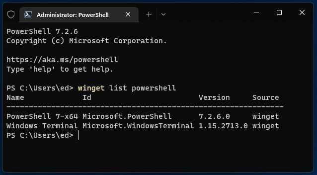
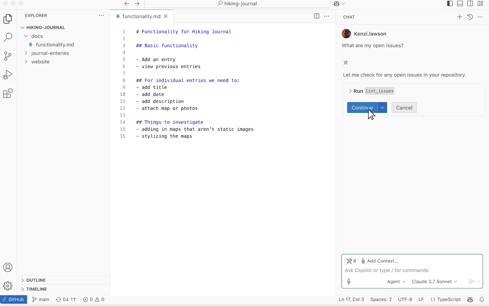
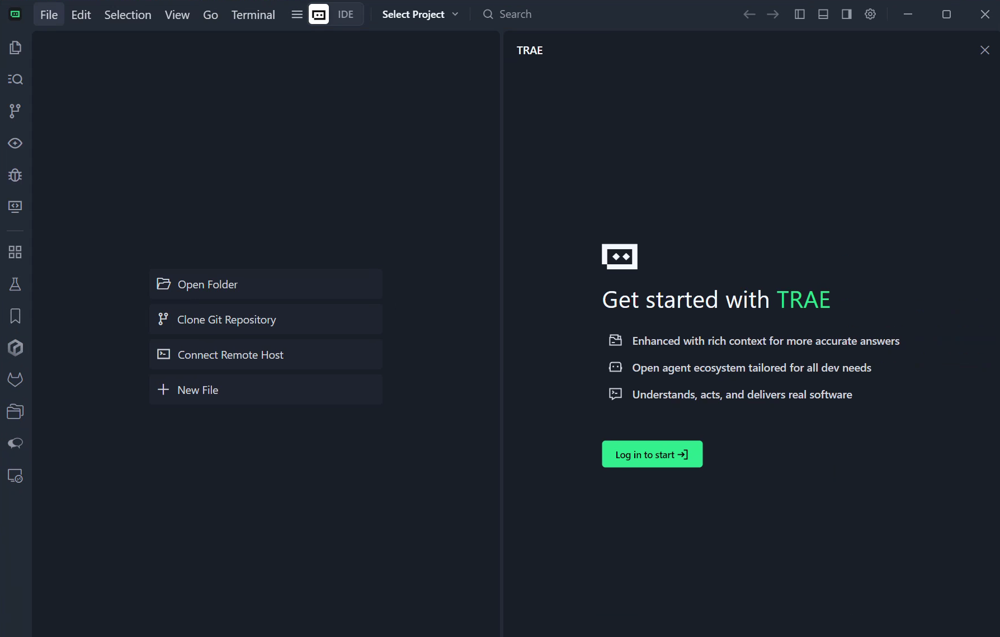
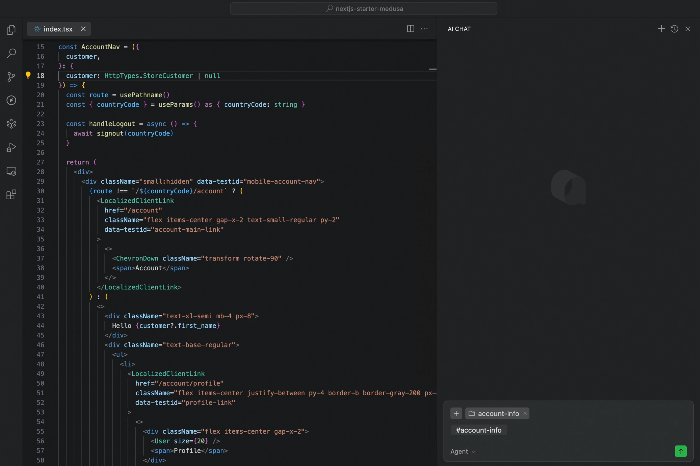
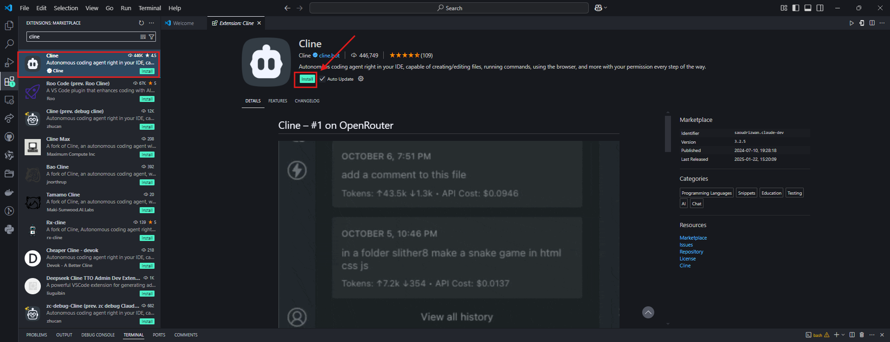
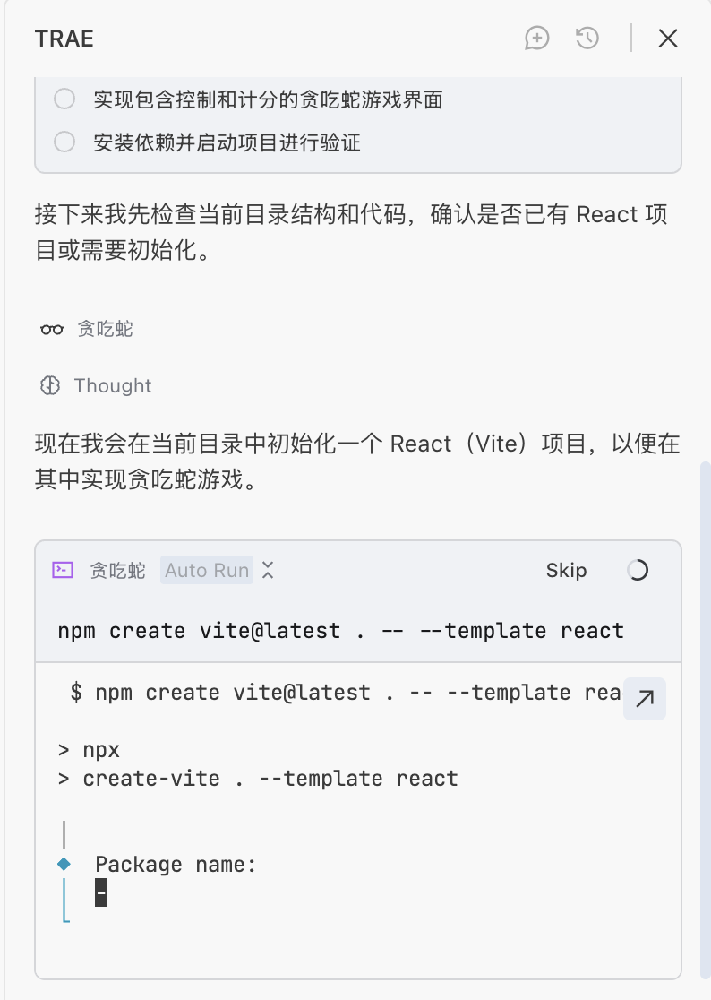
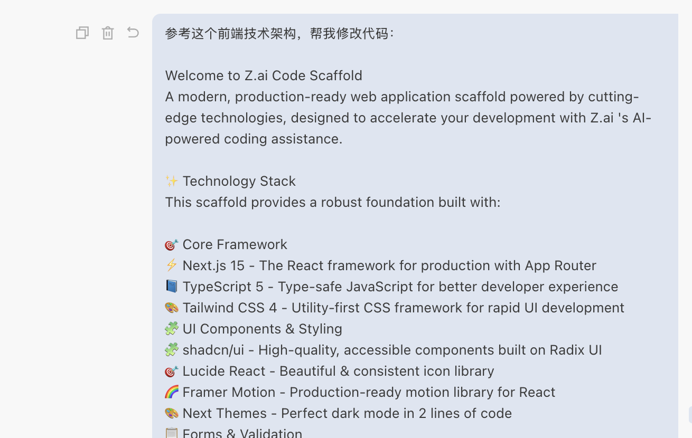

# Начальный уровень 2: Изучаем инструменты для AI-программирования

## Обзор главы

<script setup>
const duration = 'Около <strong>1 дня</strong>, можно проходить в несколько подходов'
</script>

<ChapterIntroduction :duration="duration" :tags="['Настройка локальной среды разработки', 'IDE против AI IDE', 'Приёмы эффективной разработки']" coreOutput="1 оригинальная игра, которую вы создадите" expectedOutput="Создано с помощью Trae">

Ранее мы попробовали AI-программирование на z.ai, но у веб-версии много ограничений — вы **не можете сохранять свою работу в любой момент**, вам **сложно управлять файлами** и вы **не можете работать со сложными проектами**. Эта глава поможет вам перенести среду разработки на свой собственный компьютер, чтобы вы могли **по-настоящему создавать вещи самостоятельно**.

Сначала мы проясним, **в чём разница между IDE и AI IDE** и почему последняя может **удвоить вашу эффективность**. Затем мы **шаг за шагом проведём вас** через создание игры «Змейка» локально с помощью Trae, охватив **полный рабочий процесс** от установки до запуска. В конце мы поделимся несколькими **практическими советами** по общению с AI, чтобы вы могли избежать распространённых ошибок.

После прохождения этой главы вы **освоите рабочий процесс разработки, похожий на тот, что используют профессиональные программисты**.

::: tip 💡 Продвинутый совет
Если у вас есть некоторый опыт программирования и вы хотите использовать более мощные инструменты с самого начала, вы можете обратиться к разделу [Современные CLI-инструменты для кодинга](../../stage-2/backend/modern-cli/), чтобы вести разработку из командной строки.
:::

</ChapterIntroduction>

<div style="margin: 50px 0;">
  <ClientOnly>
    <StepBar :active="0" :items="[
      { title: 'Понимание среды', description: 'IDE против AI IDE' },
      { title: 'Практика', description: 'Создаём «Змейку» в Trae' },
      { title: 'Глубокое изучение инструмента', description: 'Изучаем интерфейс IDE' },
      { title: 'Навыки общения', description: 'Эффективно общаемся с AI' }
    ]" />
  </ClientOnly>
</div>

## 1. Какая среда и какие инструменты нужны, чтобы писать код

### 1.1 Смена мышления: когда сомневаешься — сначала спроси AI

Прежде чем мы представим различные среды и инструменты, вот важное напоминание: вам нужно **изменить свои привычки мышления**.

При традиционном обучении программированию, если вам нужно установить Python, настроить Conda или исправить ошибку при установке npm, вы обычно открывали бы поисковик, находили туториал и выполняли шаги один за другим. Если по пути возникала ошибка, вы искали бы её текст и пробовали снова и снова.

Неправильно! ❌

В эпоху AI, особенно при использовании AI IDE, запомните один ключевой принцип: **для любой задачи вы можете сначала спросить AI или даже поручить ему сделать это за вас.**

- **Не знаете, как настроить среду?** Просто спросите AI в боковой панели: «Я хочу писать на Python. Пожалуйста, проверь, установлен ли Python, и если нет — установи его для меня.»
- **Сеть зависла?** Если установка зависимостей бесконечно крутится или выдаёт ошибки, просто скиньте ошибку AI: «Загрузка не удалась. Это проблема с сетью? Можешь помочь переключиться на другое зеркало?»
- **Не можете вспомнить команды?** Не нужно запоминать команды Git или Conda. Просто скажите AI: «Помоги мне создать новое виртуальное окружение под названием demo.»

### 1.2 Зачем нужны среда и инструменты

Переход от «попыток написать несколько строк кода» к «созданию проекта, который можно поддерживать долгое время» требует совершенно других сред и инструментов.

Теоретически вы могли бы писать код во встроенном системном Блокноте, но проблемы быстро дадут о себе знать:

- **Весь код — это обычный чёрный текст** — ключевые слова, строки и комментарии смешаны вместе, из-за чего сложно увидеть структуру с первого взгляда
- **Нет умных подсказок** — приходится полностью набирать каждое слово вручную, а одна опечатка означает многократную перепроверку кода
- **Файлы превращаются в хаос** — приходится переключаться туда-сюда между десятками файлов, часто не находя нужную строку для редактирования
- **Отладка превращается в гадание** — когда программа падает, вы не знаете, что пошло не так, и можете лишь построчно добавлять операторы вывода

Именно поэтому вам нужна IDE (интегрированная среда разработки). Она отображает код разными цветами, даёт автоподсказки по мере набора, организует файлы по проектам и позволяет шаг за шагом отслеживать ошибки — делая разработку эффективнее и менее подверженной ошибкам.

## 2. Что такое IDE и зачем она нужна

::: info Совет перед чтением
Если вы ещё не знакомы с тем, что такое IDE и за что отвечает каждый элемент интерфейса, мы рекомендуем сначала прочитать [Основы IDE](/ru-ru/appendix/2-development-tools/ide-basics), чтобы изучить базовые понятия и общие функции.
:::

На заре программирования всё, что нам было нужно, — это простой текстовый редактор и обработчик языка. Но по мере усложнения проектов разработчикам срочно понадобился инструмент, который мог бы эффективно управлять файлами, поддерживать подсветку синтаксиса и обеспечивать отладку — так и родилась интегрированная среда разработки (IDE).

Вы можете представить IDE как программу, специально созданную для того, чтобы «редактировать, управлять, запускать и отлаживать» код. Ранние IDE выглядели очень «примитивно» и управлялись почти полностью с клавиатуры.



Терминальный интерфейс — источник изображения: https://en.wikipedia.org/wiki/File:Emacs-screenshot.png

Известные и зрелые «встроенные IDE», такие как `Vim`, обычно используются для работы с удалёнными серверами.


Для большей эффективности нам нужны современные IDE, поддерживающие работу мышью, в которые обычно входят:

- **Редактор исходного кода**: подсветка синтаксиса, автодополнение.
- **Инструменты сборки и запуска**: встроенный компилятор/интерпретатор.
- **Отладчик**: отладка по точкам останова, просмотр значений переменных.

Современные IDE часто также включают встроенные инструменты вроде Git. Самая популярная — **[Visual Studio Code (VS Code)](https://code.visualstudio.com/)** от Microsoft, которая легковесна и расширяема. Хотя существуют и профессиональные IDE, такие как набор от JetBrains, VS Code наиболее дружелюбна к новичкам.



Ключевая философия VS Code — «всё является плагином». Благодаря системе плагинов она поддерживает различные языки — установите плагин Python, и она станет Python IDE, установите плагин C++, и она станет C++ IDE. Без плагинов это просто продвинутый текстовый редактор.


Вы даже можете использовать её для редактирования документов Markdown.


Короче говоря, IDE — это набор инструментов, который помогает разработчикам эффективно писать код и запускать программы.

Более подробные объяснения смотрите в [разделе визуализации виртуальной IDE в Приложении](/ru-ru/appendix/2-development-tools/ide-basics).

## 3. Чем AI IDE отличается от обычной IDE

Обычная IDE (например, исходная VS Code) — это по сути «ящик с инструментами»:
вы можете открывать проекты, писать код, запускать и отлаживать, устанавливать плагины — но при условии, что вы сами знаете, что нужно делать и как это делать:

- Когда возникает ошибка, вы сами читаете сообщение и выясняете, в какой строке проблема;
- Когда вы хотите добавить новую страницу или эндпоинт API, вы сами находите нужный файл и пишете код;
- Когда вы хотите настроить среду или собрать проект, вы сами ищете документацию и выполняете шаги.

Но в AI IDE вы можете напрямую использовать большую языковую модель, чтобы она помогала вам писать код и изменять файлы:

- Просто скажите «сделай страницу входа», и она сначала сгенерирует базовую структуру кода;
- Скиньте ей сообщение об ошибке и связанный код, и пусть она проанализирует причину и предложит исправления;
- После вашего подтверждения позвольте ей автоматически создавать файлы, массово редактировать код и выполнять рутинную работу между файлами.

Например, вы можете выделить фрагмент кода и попросить «отрефакторь это» или «добавь комментарии». Вы также можете спросить в боковой панели «Как устроен этот проект?» и указать область контекста с помощью `@имяфайла` или `@весь проект`, выполнив утомительные операции по созданию файлов, написанию кода и запуску одной фразой.

В последней версии VS Code ассистент на основе большой языковой модели уже встроен. Вы можете вести с моделью разговор обо всей кодовой базе, конкретном файле или даже конкретной функции. Вы также можете использовать её так же, как инструменты автокодинга, которыми вы пользовались в вебе — отправляйте свои требования как промпты встроенному агенту-кодеру, и пусть он автоматически реализует нужные вам функции, создаёт файлы, изменяет код, настраивает среду и многое другое.

Вы можете скачать и установить VS Code, нажать на значок боковой панели в правом верхнем углу и открыть область AI-функций, чтобы испытать эти возможности.


Однако VS Code — не та IDE, у которой самые сильные AI-возможности. Для сценариев, требующих интенсивного AI-кодинга, мы часто хотим использовать «более умные и эффективные» инструменты — хорошая AI IDE может существенно сэкономить время на написании кода и исправлении багов. Ниже мы представим несколько популярных AI IDE. Вы можете выбрать любую AI IDE исходя из личных предпочтений.

Поскольку VS Code имеет открытый исходный код (любой может скачать исходники и скомпилировать их самостоятельно), подавляющее большинство AI IDE на рынке сегодня построены на основе VS Code. Поэтому вам не нужно беспокоиться о том, что придётся «изучать много разных IDE» — **если вы знакомы с основами VS Code**, переход на эти AI IDE не потребует начинать с нуля.

В целом различия между AI IDE сводятся в основном к четырём аспектам: цена; доступные типы моделей (некоторые продвинутые модели могут быть ограничены в определённых регионах); возможности агента (насколько он умён и способен в помощи с кодингом); скорость и производительность. Вы можете выбирать на основе собственных результатов тестирования — лучший инструмент тот, что лучше работает именно для вас.

> Типичные AI IDE обычно обладают следующими ключевыми возможностями:
>
> - Умная генерация и автодополнение кода: в традиционных IDE мы обычно набираем несколько символов, чтобы автоматически дополнить имена переменных или функций. В современных AI IDE вы можете написать несколько строк псевдокода или просто описать свои требования, и IDE автоматически дополнит всю логику или даже сгенерирует крупные блоки кода по инструкциям.
> - Понимание кода и ответы на вопросы: IDE может понимать и отвечать на вопросы о конкретном фрагменте кода, файле или даже структуре каталогов всего проекта.
> - Рефакторинг и оптимизация кода: IDE может переписывать или оптимизировать логику реализации указанных фрагментов кода в соответствии с вашим намерением.
> - Автоматическая генерация тестов: IDE может автоматически генерировать тестовый код для разных функций и модулей, что упрощает целевое тестирование.
> - Выполнение задач в стиле агента: умные агенты могут автоматически генерировать, собирать, устанавливать, запускать и изменять код, частично заменяя работу младших инженеров-программистов во многих задачах.

::: details Antigravity

### [Antigravity](https://antigravity.google/)

Antigravity — это совершенно новая AI IDE, выпущенная Google в ноябре 2025 года вместе с Gemini 3, использующая модель разработки «Agent-First». В отличие от традиционного AI-кодинга, Antigravity делает AI-агента «активным исполнителем», способным напрямую управлять редактором, терминалом, браузером и другими инструментами, беря на себя больше работы по «выполнению», «планированию» и «проверке». Разработчикам нужно лишь выразить намерение высокого уровня, и агент автоматически разобьёт задачи, составит планы, выполнит код, запустит тесты и сгенерирует результаты. Поддерживается переключение между несколькими моделями, включая Gemini 3 Pro, Claude Sonnet 4.5 и другие. В настоящее время доступна как публичная превью-версия и поддерживает Windows, macOS и Linux.
:::

::: details Trae

### [Trae](https://www.trae.ai/)



Trae — это AI-ассистент для программирования, разработанный ByteDance, который поддерживает более 100 языков программирования и может интегрироваться в основные IDE. В число его функций входят: генерация кода из естественного языка, автоматическая отладка и преобразование дизайн-макетов в компоненты React/Vue. После обновления в августе 2025 года в Trae добавились умный импорт зависимостей, предложения по переименованию, управление чек-листами задач и многое другое. Режим SOLO также начал поддерживать генерацию серверного кода и редактирование документов технической архитектуры.
:::

::: details Cursor

### [Cursor](https://cursor.com/)

Cursor — это AI-редактор кода, разработанный Anysphere, построенный на кастомизированной VS Code, с оптимизациями, ориентированными на крупные кодовые базы и сценарии совместной работы с несколькими файлами. Он поддерживает такие модели, как GPT-4o и Claude 3.7. Режим Claude Max, представленный в 2025 году, способен работать с проектами на миллионы строк кода. В версии Pro убраны ограничения на количество запросов, что делает её идеальной для сложных корпоративных проектов.

В настоящее время Cursor, пожалуй, одна из лучших AI IDE с графическим интерфейсом по совокупному опыту использования, с большой пользовательской базой и частыми обновлениями функций. Его главный недостаток — более высокая цена: версия Pro стоит около $20 в месяц.


:::

::: details Qoder

### [Qoder](https://qoder.com/)

Qoder — это AI IDE от Alibaba, которая делает акцент на «прозрачном взаимодействии» и «улучшенных возможностях инженерии контекста». Она поддерживает разбиение задач на несколько шагов через Action Flow и в реальном времени отслеживает выполнение AI. Она также поддерживает динамическую маршрутизацию между несколькими моделями и управление конечным автоматом состояний задач, что делает её идеальной для управления архитектурой в средних и крупных проектах и «обратного инжиниринга» при анализе устаревших систем.


:::

::: details CodeBuddy

### [CodeBuddy](https://www.codebuddy.com/)

CodeBuddy — это AI-инструмент для программирования от Tencent Cloud, который делает акцент на поддержке команд на китайском языке и возможностях соответствия требованиям корпоративного уровня. Он предлагает автодополнение кода, пакетный код-ревью и переключение между несколькими моделями. Его агент Craft может выполнять генерацию кода для нескольких файлов и интеграцию API. Корпоративная версия поддерживает приватное развёртывание и прошла сертификацию безопасности 3-го уровня, что делает её подходящей для отраслей с высокими требованиями к безопасности данных, таких как финансы и здравоохранение.


:::

::: details VS Code + Cline

### VS Code + [Cline](https://cline.bot/)

Cline — это плагин AI-агента для программирования для VS Code (Visual Studio Code), который может гибко переключаться между разными большими моделями за счёт настройки разных эндпоинтов API. Cline поддерживает мультимодальный ввод, расширения инструментов MCP и мониторинг затрат, причём все операции требуют подтверждения пользователя перед выполнением. Он идеален для быстрой проверки идей или интеграции с существующими рабочими процессами разработки. Базовые функции бесплатны, а корпоративная версия поддерживает развёртывание моделей в приватных средах.




:::

::: details Kiro

### [Kiro](https://kiro.dev/)

Kiro — это AI IDE для программирования от AWS (Amazon Web Services), глубоко интегрированная с Amazon Bedrock и экосистемой облачных сервисов AWS. Она поддерживает несколько больших моделей, включая Claude и Nova, что делает её особенно подходящей для сценариев разработки, требующих тесной интеграции с облачными сервисами AWS. Kiro предоставляет умную генерацию кода, автоматизированное тестирование и бесшовную интеграцию с ресурсами AWS (такими как Lambda, S3, DynamoDB), предлагая уникальные преимущества для разработки облачных приложений.

> **Примечание**: если вы хотите использовать модели Anthropic Claude, вам нужно будет использовать в качестве IDE Cursor, Kiro или Antigravity. У этих IDE есть официальные партнёрства или глубокие интеграции с Anthropic, что обеспечивает более стабильный и полноценный опыт работы с моделями Claude.
:::

<div style="margin: 50px 0;">
  <ClientOnly>
    <StepBar :active="1" :items="[
      { title: 'Понимание среды', description: 'IDE против AI IDE' },
      { title: 'Практика', description: 'Создаём «Змейку» в Trae' },
      { title: 'Глубокое изучение инструмента', description: 'Изучаем интерфейс IDE' },
      { title: 'Навыки общения', description: 'Эффективно общаемся с AI' }
    ]" />
  </ClientOnly>
</div>

## 4. Практика: создаём игру «Змейка» локально с помощью AI IDE

Предыдущие разделы были в основном о «концепциях» и «различиях». В этом разделе мы превратим абстрактные концепции в конкретные действия через полноценное практическое упражнение: **создаём новую пустую папку -> открываем её в AI IDE -> общаемся в боковой панели и поручаем ей создать игру «Змейка» с нуля на React.** Здесь мы будем использовать Trae в качестве примера, поэтому сначала нам нужно установить его и понять, что такое Trae.

::: tip 💡 Быстрый совет: бесшовный переход из веба на локальную машину
Если вы ранее разрабатывали проекты на z.ai или других веб-платформах AI-программирования, вы можете скачать код напрямую на свою локальную машину и открыть его в AI IDE, чтобы продолжить разработку. Так вы сохраните свою предыдущую работу и при этом получите более мощную AI-помощь локальной IDE.

Шаги просты:
1. Нажмите кнопку загрузки на платформах вроде z.ai, чтобы сохранить проект локально
2. Распакуйте и откройте папку в AI IDE, такой как Trae/Cursor
3. Продолжайте общаться с AI в боковой панели, чтобы итеративно улучшать свой проект
:::

### 4.1 Подготовка: установите Trae и узнайте о нём

#### 4.1.1 Что такое Trae

Полное название Trae можно понимать как «The Real AI Engineer» (настоящий AI-инженер). Это адаптивная интегрированная среда разработки с AI (IDE), разработанная ByteDance. Она построена на основе популярной VS Code, а значит, если вы уже знакомы с VS Code, компоновка интерфейса и базовые операции Trae покажутся вам очень знакомыми и удобными.

Ключевая цель Trae — быть «умным партнёром по программированию» для разработчика. Благодаря глубокой интеграции AI он может автоматически выполнять большой объём повторяющейся работы, обеспечивая вам более интуитивный и эффективный опыт разработки. Это не просто «инструмент автодополнения кода» — он стремится помогать на протяжении всего рабочего процесса разработки: от создания проектов, написания кода, отладки, тестирования до развёртывания.

#### 4.1.2 Установка Trae

Trae существует в международной версии и в версии для Китая. Международная версия требует доступа к зарубежным сетям, но позволяет использовать новейшие зарубежные модели вроде GPT-5. Версия для Китая в основном поддерживает новейшие отечественные большие модели, такие как GLM, Qwen, Kimi и другие.

Загрузка международной версии: https://www.trae.ai/
Загрузка версии для Китая: https://www.trae.cn/

##### Цены и варианты использования Trae

::: info 💡 Советы по выбору версии (для новичков рекомендуется версия CN)
- **Для новичков мы настоятельно рекомендуем скачать версию для Китая (версия CN, trae.cn)** — в настоящее время она обеспечивает лучший общий опыт и бесплатна в использовании, без необходимости в зарубежной сети
- Если вам нужно использовать зарубежные модели вроде GPT-5 и ваши сетевые условия это позволяют, вы можете выбрать международную версию
- Если у вас уже есть API Key стороннего поставщика моделей, подключение сторонних моделей даёт гибкий контроль над затратами
:::

> 💡 **В настоящее время рекомендуется: используйте бесплатные модели OpenRouter для тестирования**
>
> На момент написания этого туториала (2026-02-12) вы всё ещё можете бесплатно попробовать модели StepFun. См. раздел 4.2 ниже о том, как подключить модель `stepfun/step-3.5-flash:free`.

Что касается затрат и вариантов использования Trae, вот несколько вариантов на выбор:

- **Версия для Китая CN (настоятельно рекомендуется)**: базовое использование бесплатно, и в настоящее время она обеспечивает лучший общий опыт, чем международная версия, — идеальна для новичков. Из-за большого числа пользователей вам иногда может потребоваться подождать в очереди.
- **Международная версия**: подписка стоит около $3 в месяц, давая доступ к зарубежным моделям вроде GPT-5, но требует доступа к зарубежной сети.
- **Интеграция сторонних моделей**: если у вас уже есть Token API от отечественного поставщика больших моделей (например, DeepSeek, Tongyi Qianwen, Kimi и т. д.), вы можете подключить эти API через настройку сторонних моделей в Trae. Крупные облачные провайдеры (такие как Alibaba Cloud, Tencent Cloud, Baidu Cloud и др.) обычно предлагают подписки Coding Plan, которые позволяют использовать их API больших моделей по более выгодным ценам. Так вы можете свободно выбирать предпочитаемую модель, контролируя при этом затраты.

Мы рекомендуем новичкам начать с бесплатной версии для Китая CN (загрузка: https://www.trae.cn/), которая в настоящее время предлагает лучший опыт и полностью бесплатна. Если вы столкнётесь с проблемами очередей или вам понадобится более стабильный сервис, рассмотрите подключение сторонней модели и покупку соответствующего Coding Plan облачного провайдера.

#### 4.1.3 Обзор интерфейса Trae

С точки зрения дизайна интерфейса Trae очень похож на VS Code, который мы используем каждый день: та же классическая трёхколоночная компоновка с проводником файлов слева, областью редактирования в центре и панелью расширений справа.


Боковая панель справа — это окно взаимодействия Copilot, которое также можно рассматривать как окно агента. Если вы не видите его сразу, нажмите на значок боковой панели в правом верхнем углу Trae, чтобы открыть его.


После открытия боковой панели вы увидите опцию `Builder` — это режим агента. Проще говоря, это как «локальная версия» z.ai, которая может управлять вашей локальной средой, устанавливать среды выполнения, открывать веб-страницы и многое другое.


После нажатия «Builder» вы увидите режим «Chat» и режим «Builder with MCP»:

- **Режим Chat**: используется в основном для обсуждения кода в вашей текущей папке или как обычная чат-модель. (Вы можете открыть папку через меню «File» в левом верхнем углу и редактировать внутри этой папки. В этом случае любые файлы, которые Builder создаёт или изменяет, будут затрагивать только эту папку.)
- **Режим Builder with MCP**: предоставляет агенту больше доступных инструментов (например, соединение языковой модели с другим ПО, запрос погоды и т. д.). Можно просто понимать это так: MCP облегчает языковой модели вызов различных внешних инструментов.


В области ниже вы также увидите опции выбора модели — нажмите, чтобы сменить текущую большую модель. В версии для Китая вы можете выбрать отечественные модели вроде Kimi k2 или GLM. Если вы используете международную версию Trae, вы также можете выбрать зарубежные модели вроде ChatGPT или Claude. Однако, поскольку отечественные большие модели развиваются очень быстро, Kimi, Qwen, GLM и другие уже обеспечивают опыт, близкий к Claude 3.5 или 3.7, во многих задачах, чего более чем достаточно для повседневной разработки. Строгого требования использовать международную версию или версию для Китая здесь нет.

**Обратите внимание, что мы не рекомендуем использовать режим Auto (автоматический выбор модели). Для международной версии мы рекомендуем использовать модели Gemini или GPT. Для версии для Китая мы рекомендуем попробовать отечественные модели вроде Kimi k2, Minimax или GLM.** Разные модели подходят для разных сценариев — нет догматичного правила о том, какая лучше. Когда вы упрётесь в стену с одной моделью, попробуйте переключиться на другую. Через множество тестов вы найдёте лучшие результаты для своего рабочего процесса.


Это краткое введение в Trae. Далее давайте вспомним, что мы делали ранее на z.ai, и попробуем сделать то же самое в Trae.

### 4.2 Шаг 1: создайте пустую папку и откройте её в AI IDE

Прежде чем начать, нам сначала нужно подготовить чистый рабочий каталог проекта.
Для примера в этом разделе вы можете создать на своей локальной машине новую пустую папку с именем `snake-game-react`.

Затем откройте установленную AI IDE, выберите «Open Folder» на стартовом экране и импортируйте пустую папку как корневой каталог проекта. Вы также можете просто перетащить папку в окно IDE, чтобы открыть её. На этом этапе проводник файлов слева не покажет никаких файлов кода, что указывает на то, что мы начинаем с полностью пустого состояния проекта.

::: details 📚 Опционально: подключение API облачного провайдера или Coding Plan

В этом разделе рассказывается, как подключить API облачного провайдера или Coding Plan для более стабильных и частых вызовов модели. Скриншоты интеграции Trae приведены в конце.

**Что такое Coding Plan**

Coding Plan — это подписка, предлагаемая крупными облачными провайдерами. После покупки вы можете в течение определённого периода **использовать API больших моделей провайдера без ограничений или с высокой частотой**. По сравнению с оплатой за токены, Coding Plan больше похож на «ежемесячный пакет» — вы платите фиксированную сумму и можете пользоваться свободно, не беспокоясь о плате за каждый вызов.

**Зачем покупать Coding Plan**

Вы можете спросить: раз можно вызывать большие модели напрямую через API, зачем покупать Coding Plan? Главная причина — **неограниченное использование**. Ключевое преимущество Coding Plan в том, что вы можете вызывать большую модель в любой момент, так часто, как захотите, не беспокоясь о том, что затраты взлетят, и не сверяясь постоянно со счетами.

**Рекомендуемые Coding Plan отечественных облачных сервисов**

Вот рекомендуемые варианты Coding Plan от крупных отечественных облачных провайдеров:

- Zhipu AI (план BigModel): https://bigmodel.cn/glm-coding
- Volcengine (план ByteDance Cloud AI): https://www.volcengine.com/activity/codingplan

> 💡 **Вы также можете подключить API большой модели напрямую**
> Помимо Coding Plan, вы также можете напрямую подключать различные API моделей через Add Model. Вы можете ориентироваться на приведённый ниже способ подключения бесплатного API OpenRouter StepFun для интеграции с Trae. Тесты показывают, что он удовлетворяет базовые потребности в программировании.
> Если вам нужно пополнить баланс, мы советуем начать с небольшой суммы (например, 10 юаней), чтобы посмотреть, на сколько её хватит, например с экономичными моделями вроде DeepSeek.

**Как подключить Coding Plan**

Подключить Coding Plan очень просто и занимает всего несколько минут:

1. Зайдите на сайт выбранного облачного провайдера (например, Zhipu AI: https://bigmodel.cn/glm-coding, Volcengine: https://www.volcengine.com/activity/codingplan)
2. Зарегистрируйте аккаунт и войдите
3. Найдите страницу «Pricing» или «Coding Plan»
4. Выберите подходящий вам план и завершите оплату
5. После оплаты вы получите API Key или Plan ID

::: tip 🎯 Рекомендации по пользовательским моделям

При подключении пользовательских моделей в Trae мы **рекомендуем по умолчанию использовать подход OpenRouter**. OpenRouter предоставляет унифицированный API-интерфейс для удобного подключения к нескольким большим языковым моделям.

**По состоянию на 12 февраля 2026 года вы всё ещё можете использовать бесплатный API StepFun:**

- **`stepfun/step-3.5-flash:free`**: бесплатная модель от StepFun, которую можно напрямую подключить в Trae.

**Другие бесплатные модели:**

- **`openrouter/free`**: вариант модели, который по умолчанию использует бесплатные API LLM. Вы можете использовать его прямо в интеграции пользовательских моделей Trae (просто введите ID модели), испытывая функции AI-программирования совершенно бесплатно.

Эти бесплатные варианты отлично подходят для новичков. Прежде чем переходить к продакшен-использованию, вы можете ознакомиться с рабочим процессом AI IDE через эти бесплатные варианты.

**Опционально: подключение API большой модели (на примере DeepSeek)**

1. Зайдите на платформу DeepSeek: https://platform.deepseek.com/usage
2. Зарегистрируйте аккаунт и войдите
3. Купите пакет токенов на 10 юаней на странице пополнения
4. После пополнения создайте и скопируйте API Key на странице API Keys
5. В Trae нажмите **«Add Model»**, найдите DeepSeek, выберите соответствующую модель и введите API Key, чтобы начать пользоваться

Через интерфейс ниже вы можете успешно добавить модель (примечание: после выбора опции модели **обязательно прокрутите до самого низа** — там есть опция «Custom Model». Нажмите её, чтобы ввести ID модели, где вы можете указать рекомендуемые ID моделей, такие как `stepfun/step-3.5-flash:free`. Также нажмите «Get Key» ниже, чтобы посетить официальный сайт и получить соответствующий API Key.)


:::

### 4.3 Шаг 2: пообщайтесь в боковой панели и поручите AI спроектировать игру «Змейка» на React

Далее откройте боковую панель чата AI: обычно нажатием `Ctrl+L` или щелчком по значку чата справа. Затем введите чёткий промпт:

> Пожалуйста, реализуй игру «Змейка» на архитектуре React, включая управление с клавиатуры, рост и начисление очков при поедании еды, а также отображение «Game Over» с поддержкой перезапуска при столкновении со стенами или с самой собой. После реализации помоги мне запустить этот проект. Если какая-либо программная среда не установлена, автоматически установи недостающую среду.

В ходе этого процесса вам нужно осознать, что AI — это не просто чат-модель: он может помочь вам управлять вашей локальной средой: создавать файлы, устанавливать зависимости, выполнять команды запуска и т. д. Вы можете прямо описывать свои цели на естественном языке и позволять AI решать, какие именно команды выполнять и как организовать код.

Если в процессе выполнения возникают проблемы, AI отобразит ошибки и решения в диалоге. Вы можете продолжать корректировать через диалог, не запоминая все детали команд самостоятельно.

::: warning ⚠️ Важное примечание
Как показано на рисунке ниже, **иногда AI-агент приостанавливается во время выполнения, потому что ему нужно дождаться, пока вы введёте какую-то информацию для взаимодействия**, например введёте создаваемое имя, или нажмёте Enter для подтверждения выполнения команды, или щёлкнете по команде для выполнения. Обычно мы просто нажимаем Enter. Если вы не уверены, что требуется на этом шаге, можете сделать скриншот текущего интерфейса и спросить большую модель, какую операцию следует выполнить.
:::

Как показано, здесь нам нужно нажать Run для подтверждения:


Как показано, здесь нам нужно лишь ввести y для подтверждения:




Как показано, здесь мы создаём шаблон, но не знаем, как действовать. Мы можем сделать скриншот этой части и спросить большую модель:


Ещё одна причина, по которой AI-агент приостанавливается во время выполнения, — это то, что он запустил «сервис». Наша игра «Змейка» сама по себе является своего рода «сервисом». Если вы видите URL вместе со следующей командой, это означает, что агент выполнил для нас локальный компьютерный сервис. Мы можем перейти по соответствующему URL, чтобы получить доступ к нашей «Змейке». Поскольку сервис должен работать непрерывно, выполнение приостановится здесь. Нам нужно просто нажать кнопку `Skip`.


В ходе этого процесса, если вы встретите термины и содержание, которые не понимаете, не волнуйтесь. Вы можете обратиться к разделу «Объяснение компьютерных терминов» в приложении, или напрямую спросить AI, или своевременно задать вопросы!

Если в процессе вы столкнётесь с неожиданными явлениями, например змейка не завершает игру при столкновении со стеной или змейка не двигается после нажатия «Старт», вам нужно просто описать это явление агенту в боковой панели. Если вы столкнётесь с ошибками, не забудьте сделать скриншот или скопировать ошибку агенту в боковой панели. Если после нескольких попыток проблему всё ещё не удаётся решить, попробуйте сменить модель.

Через некоторое время мы можем получить результаты, похожие на z.ai:


Мы можем нажать галочку в правом нижнем углу, чтобы подтвердить изменения кода, или нажать кнопку `Cancel`, чтобы отменить изменения. Или щёлкнуть по области «2 files need review», чтобы развернуть и просмотреть изменённый код.

Также стоит отметить, что, поскольку изменения кода не всегда могут быть верными, нам нужно знать, что все агенты IDE поддерживают откат кода. Например, если я случайно выполнил здесь неправильную операцию изменения или результат этой операции неудовлетворителен, после завершения изменения мы можем вернуться в область поля ввода и нажать кнопку Revert, чтобы откатить операцию к состоянию до изменения. Вы можете изменить введённый текст для другой операции:


### 4.4 Шаг 3 (опционально): спросите AI о деталях реализации кода

Когда игра «Змейка» работает нормально, если вы пока не знакомы с фронтендом или React, вы можете продолжить в том же окне чата и попросить AI провести вас по коду как можно более простым языком. Вам не нужно переключать инструменты или специально просматривать документацию — просто продолжайте задавать вопросы о текущем проекте.

Практичный подход — сначала попросить AI дать общее объяснение «как движется игра», а затем разбить его на конкретные детали. Например, вы можете прямо спросить:

> «Пожалуйста, объясни сверху вниз, как пошагово движется эта «Змейка»? Постарайся использовать как можно меньше технических терминов.»


Затем уточните ключевые моменты на основе его ответа, например:

> «Какая структура данных используется для записи каждого сегмента тела змейки на экране? Можешь привести аналогию?»
> «Как ты управляешь "движением раз в определённый промежуток времени"? В каком участке кода это находится?»
> «Когда змейка ест еду, какие шаги ты выполняешь? Где находится логика, определяющая, что она что-то съела?»
> «Где в коде проверяется столкновение со стенами и столкновение с самой собой соответственно?»

Если вы видите какой-то файл (например, `SnakeGame.tsx`), но понятия не имеете, что он делает, вы также можете напрямую попросить AI объяснить его по частям:

> «Пожалуйста, объясни `SnakeGame.tsx` в виде нескольких функциональных блоков: за что примерно отвечает каждый блок, используя более простой язык.»

В этом раунде диалога вы можете рассматривать любое непонятное слово как отправную точку для уточняющих вопросов, например:

> «Что именно означает "состояние" в том, что ты только что сказал? Можешь объяснить на жизненном примере?»
> «Что в основном делает здесь "таймер"? Что произошло бы, если бы его убрали?»

С помощью этого метода ваша цель — не запомнить все концепции сразу, а сначала понять три вещи: какие ключевые данные есть в этой игре (змейка, еда, очки, состояние игры и т. д.), когда эти данные меняются (движение, поедание еды, конец игры и т. д.) и какой небольшой участок кода соответствует каждому изменению. Как только эти три момента ясны, вы в основном можете понять главную логику этого кода.

### 4.5 Шаг 4: попросите AI сделать интерфейс красивее

Сначала напоминание для новичков: не говорите AI просто «я хочу сделать этот интерфейс красивее». Эта фраза слишком расплывчата даже для дизайнеров-людей, не говоря уже о моделях — что значит «красивый» стиль, какие части нужно скорректировать, это проблема компоновки или цвета? AI не может всё это прочитать из вашей одной фразы. Чтобы AI действительно выдал результаты, близкие к тому, что у вас в голове, вам нужно научиться разбивать расплывчатую цель «я хочу, чтобы было красиво» на ряд конкретных, выполнимых маленьких требований.

Например, многие сначала говорят что-то такое:

> «Я хочу сделать этот интерфейс немного красивее.»

Вместо этого вы можете сначала задать набор общих требований:

> «Пожалуйста, помоги мне в целом украсить интерфейс игры:
>
> - Отцентрируй игровую область, не прижимай её к левому верхнему углу;
> - Замени на более светлый цвет фона, чтобы змейка и еда были заметнее;
> - Увеличь счёт и помести его на видное место;
> - Используй синий как основную цветовую гамму, чтобы украсить общую цветовую схему и кнопки.»

Если вы хотите более чёткую обратную связь при завершении игры, можете дополнительно добавить:

> «Когда игра заканчивается, отобрази "Game Over" в центре экрана, а под ним кнопку "Restart", которая может сбросить игру.»

AI напрямую изменит компоненты и стили React на основе вашего описания. После сохранения обновите браузер, чтобы увидеть новый интерфейс. Если эффект всё ещё отличается от того, что вы представляли, вы можете продолжить вносить небольшие корректировки, например:

> «Сделай счёт немного крупнее, а цвет — заметнее.»
> «Сделай игровую область более компактной, с небольшими отступами вокруг неё.»
> «Измени кнопку перезапуска на синий скруглённый стиль, отцентрированную под подсказкой.»

На этом этапе, если изменение вызывает ошибку, вам не нужно разбираться с ней самостоятельно. Просто скопируйте сообщение об ошибке в окно чата или дайте краткое описание вроде «Это ошибка, которая появилась после того, как я украсил интерфейс», и позвольте AI найти и исправить её в контексте текущего проекта. Так вы можете постепенно отполировать работающее демо до небольшого законченного продукта с понятным интерфейсом и плавными взаимодействиями через цикл «непрерывный диалог, непрерывное обновление».

### 4.6 (Опционально) Использование архитектуры z.ai для доработки результата «Змейки»

Для новичков в vibe coding самое сложное — не знать, что считается «лучшими практиками» или какая архитектура наиболее подходит; поскольку вы не знаете основ работы компьютера, вы не можете хорошо направлять AI. Решение этой проблемы — «прямое заимствование». Помните, мы говорили, что вы можете просматривать код в z.ai? На самом деле соответствующий README (часть, используемая в проектах для описания функциональности и технической архитектуры) уже даёт ориентир на лучшую архитектуру:


Если мы хотим, чтобы локальный результат как можно точнее соответствовал результату z.ai, мы можем скопировать всё содержимое этого README и вставить его в боковую панель Trae, попросив изменить локальный код в соответствии с архитектурой README.



В итоге мы можем получить стили оформления страницы, очень похожие на z.ai:


<div style="margin: 50px 0;">
  <ClientOnly>
    <StepBar :active="2" :items="[
      { title: 'Понимание среды', description: 'IDE против AI IDE' },
      { title: 'Практика', description: 'Создаём «Змейку» в Trae' },
      { title: 'Глубокое изучение инструмента', description: 'Изучаем интерфейс IDE' },
      { title: 'Навыки общения', description: 'Эффективно общаемся с AI' }
    ]" />
  </ClientOnly>
</div>

## 5. За что отвечает каждая кнопка интерфейса

В описанных выше операциях мы быстро прошли минимальный цикл генерации программы, но мы всё ещё не знакомы с IDE. Чтобы основательно освоить этот инструмент, с которым мы будем работать долгое время, в этом разделе мы дадим подробные объяснения каждой детали IDE. Начнём с интерфейса: у разных AI IDE интерфейсы немного отличаются, но большинство следуют [компоновке VS Code](https://code.visualstudio.com/docs/getstarted/getting-started).


Конкретная функция каждой части такова:

- **Заголовок окна (Title Bar)**: отображает имя файла и кнопки управления окном.
- **Панель действий (Activity Bar)**: переключает между функциональными режимами, такими как файлы и поиск.
- **Боковая панель (Side Bar)**: отображает конкретное содержимое, например списки файлов.
- **Группы редакторов (Editor Groups)**: основная область для написания кода.
- **Хлебные крошки (Breadcrumbs)**: показывают путь к файлу и поддерживают навигацию.
- **Мини-карта (Minimap)**: быстрый предпросмотр и позиционирование в коде.
- **Панель (Panel)**: содержит терминал и окна вывода.
- **Строка состояния (Status Bar)**: отображает текущее состояние среды.

Более подробные объяснения смотрите в [разделе визуализации виртуальной IDE в Приложении](/ru-ru/appendix/2-development-tools/ide-basics).

<div style="margin: 50px 0;">
  <ClientOnly>
    <StepBar :active="3" :items="[
      { title: 'Понимание среды', description: 'IDE против AI IDE' },
      { title: 'Практика', description: 'Создаём «Змейку» в Trae' },
      { title: 'Глубокое изучение инструмента', description: 'Изучаем интерфейс IDE' },
      { title: 'Навыки общения', description: 'Эффективно общаемся с AI' }
    ]" />
  </ClientOnly>
</div>

## 6. Как эффективно общаться с AI

По мере того как возможности AI становятся всё сильнее, мы можем делегировать AI значительную часть работы «программист пишет код». Однако на практике вы обнаружите, что, используя один и тот же AI, одни люди могут получить рабочий небольшой проект за несколько фраз, в то время как другие общаются долгое время, но получают результаты, совершенно отличные от желаемых. Разница часто кроется не в том, «кто умнее», а в том — достаточно ли конкретно и пошагово вы общаетесь с AI. В этом разделе на примере нескольких распространённых сценариев представлены некоторые методы постановки вопросов, подходящие для абсолютных новичков, которые помогут вам стабильнее получать пригодные результаты от AI.

### 6.1 Проясните свои требования: от «расплывчатой идеи» к «конкретному описанию»

Многие, впервые используя AI, привыкли говорить лишь одну очень общую фразу, например:

> «Помоги мне сделать веб-страницу.»
> «Помоги мне написать небольшую программу.»

В этом случае AI может только «вообразить», чего вы хотите, поэтому он непринуждённо выдаст вам нечто, что выглядит довольно законченным, но часто сильно отличается от того, что вы на самом деле хотите сделать. Чтобы AI понимал вас лучше, вам нужно разбить «идею в вашей голове» и объяснить её шаг за шагом.

Вы можете дополнить с этих сторон:

1. **Скажите ему, для чего вы используете эту вещь**
   Например, не говорите просто «личный сайт», а скажите:
   - «Я хочу сделать страницу с личным профилем, содержащую только одну страницу контента, чтобы отправлять её рекрутёрам.»

2. **Скажите ему примерно, какие блоки контента вам нужны**
   Не нужно использовать профессиональные термины, просто опишите, что вы хотите увидеть на странице, например:
   - «На странице должно быть три раздела: вверху — моё имя и фраза-самопрезентация, в середине перечислено несколько мест работы, а внизу — email и WeChat ID.»

3. **Скажите ему о своём уровне и ограничениях**
   Пусть AI сделает это так, чтобы новичок смог принять, например:
   - «Я вообще не умею писать код, пожалуйста, используй самый простой способ, чтобы я мог сразу скопировать его в один файл и открыть в браузере.»

4. **Скажите ему, как вы хотите получить результаты**
   Например:
   - «Пожалуйста, дай мне полный код, который можно сразу сохранить как `index.html` и открыть в браузере.»

Собрав всё вместе, вы можете сказать AI следующее:

> «Я вообще не умею писать код и хочу сделать страницу с личным профилем, содержащую только одну страницу контента, чтобы отправлять её рекрутёрам.
> На странице нужно три раздела: верхняя строка — моё имя и фраза-самопрезентация, в середине — несколько мест работы, а внизу — email и WeChat ID.

Когда вы проясните эту информацию, AI сможет приблизиться к вашим реальным потребностям, а не непринуждённо выдать вам нечто, «что выглядит впечатляюще, но бесполезно».

### 6.2 Соблюдайте правильный ритм: сначала «заставьте работать», затем постепенно усложняйте

Для абсолютных новичков самая распространённая ошибка — это желание сразу с самого начала сделать нечто «очень полное» и «с множеством функций».
Например:

> «Помоги мне сделать сайт вроде Taobao.»
> «Помоги мне сделать систему с регистрацией, входом и оформлением заказов.»

Результат часто такой: AI выдаёт вам большой кусок кода, который после копирования либо не открывается, либо повсюду содержит ошибки; при этом вы не понимаете, где проблема, и в конце концов вынуждены сдаться.

Лучший подход — **активно управлять ритмом**, позволяя AI следовать за вами шаг за шагом, а не вываливать всё на вас сразу. Вы можете запрашивать в таком порядке:

1. **Первый шаг: попросите «минимальный пример»**
   Проверьте только одно: видите ли вы что-нибудь в браузере?
   Например:

   > «Пожалуйста, сначала дай мне самый простой пример, лишь бы я увидел в браузере строку с надписью "Это моя главная страница".
   > Затем расскажи шаг за шагом: каким должно быть имя файла, как мне его сохранить и как открыть.»

2. **Второй шаг: на этой основе постепенно добавляйте полное содержимое**
   После того как вы подтвердите «я действительно вижу эту строку текста», скажите:

   > «На основе того, что у нас только что было, помоги мне добавить область "Опыт работы" и снова пришли мне полный код. Не присылай только изменённые части.»

3. **Третий шаг: когда структура почти готова, подумайте, красиво ли это**
   Например:
   > «Теперь страница может нормально отображать содержимое. Далее, пожалуйста, помоги мне немного её украсить: отцентрируй в целом, сделай заголовок крупнее и используй более комфортный шрифт. Пожалуйста, дай мне обновлённый полный код.»

С каждым добавлением вы сначала один раз запускаете, чтобы убедиться, что изменение действительно есть, прежде чем позволить AI продолжить. Так, даже если что-то пойдёт не так на любом шаге, вы сможете быстро вернуться к состоянию «предыдущей рабочей версии», не начиная полностью с нуля.

### 6.3 Хорошо используйте скриншоты и копирование: если не можете сказать словами — «киньте экран AI»

Многие трудности, с которыми сталкиваются абсолютные новички, кроются не в «незнании, как изменить код», а в **незнании, как описать проблему**.
Например:

- В браузере внезапно появляется куча английских ошибок, которые вы совершенно не понимаете.
- Компоновка веб-страницы отличается от того, что вы хотели, но вы не знаете, какими словами это описать.

В этих случаях вам не нужно выдавливать из себя профессиональные термины. Самый простой способ — **прямо кинуть AI то, что вы видите**.

Вы можете сделать так:

1. **Скопируйте текст ошибки**
   Когда вы видите строку красных сообщений об ошибках, вы можете прямо скопировать их и сказать:

   > «Это полное сообщение об ошибке, появившееся после того, как я запустил. Я не понимаю этот английский, пожалуйста, сначала объясни словами, понятными обычному человеку, что это примерно означает.
   > Затем скажи, каким самым простым способом мне сейчас это исправить.»

2. **Покажите AI скриншот**
   Если вы чувствуете, что «эта страница просто выглядит неправильно», но не можете описать это, вы можете:
   - Сделать скриншот текущей страницы;
   - Скопировать AI весь используемый вами участок кода;
   - Затем объяснить:
     > «Вот как сейчас выглядит страница, а вот мой текущий полный код.
     > Я изначально хотел, чтобы это была трёхколоночная компоновка, но теперь она стала одноколоночной. Пожалуйста, помоги найти причину и дай мне исправленный полный код.»

   ::: tip 💡 Дополнительное примечание о функции скриншотов

   Важно отметить, что **не все AI-модели поддерживают "просмотр картинок".** Здесь задействованы две разные концепции:

   - **Чисто текстовые большие модели (LLM)**: могут обрабатывать только текстовый ввод и не могут распознавать содержимое изображений. Если вы отправите им скриншот, они либо откажутся его обрабатывать, либо не смогут правильно понять информацию на изображении.

   - **Мультимодальные модели**: могут одновременно обрабатывать несколько типов ввода, таких как текст и изображения, могут «понимать» отправляемые вами скриншоты и давать предложения на основе содержимого изображения.

   **Справка по возможностям распространённых моделей** (на примере моделей, доступных в Trae):

   | Модель | Поддержка ввода изображений |
   |------|-----------------|
   | Серия Doubao-Seed | ✅ Поддерживается |
   | GLM-4.7 / 4.6 | ❌ Не поддерживается |
   | MiniMax-M2.7 / M2.5 | ❌ Не поддерживается |
   | DeepSeek-V3.1 | ❌ Не поддерживается |
   | Kimi-K2.5 | ✅ Поддерживается |
   | Kimi-K2-0905 | ❌ Не поддерживается |
   | Qwen-3-Coder | ❌ Не поддерживается |
   | Серия Gemini | ✅ Поддерживается |
   | Серия GPT | ✅ Поддерживается |

   **Рекомендация по использованию**: если вы хотите, чтобы AI помог вам разобраться с проблемами интерфейса через скриншоты, сначала убедитесь, что используемая вами модель поддерживает ввод изображений. Если не поддерживает, вы можете описать проблему текстом или скопировать и вставить AI сообщения об ошибках.

   :::

3. **Встретили понравившуюся веб-страницу и хотите сделать нечто похожее**
   Не нужно говорить, «как называется эта компоновка», просто:
   - Сделайте скриншот или скопируйте главный заголовок и абзацы страницы;
   - Затем скажите:
     > «Я хочу сделать страницу со структурой, похожей на эту, не обязательно точно такую же.
     > Пожалуйста, помоги мне построить похожий каркас с более простым кодом, а затем я заменю текст своим.»

Проще говоря: вы отвечаете за то, чтобы «перенести AI то, что видите», а затем самыми простыми словами сказать «я надеюсь, что станет вот так»; остальное — «перевод в код, объяснение терминов, поиск проблем» — оставьте AI.

### 6.4 Когда сгенерированный AI код не работает: универсальный метод реагирования

На практике вы обязательно столкнётесь с такой ситуацией:
AI всерьёз выдал вам кусок кода, вы честно его скопировали, но в результате страница в браузере либо пустая, либо совершенно не такая, как он говорил.
Это не значит, что вы «неспособны учиться», и не значит, что AI совершенно неправ, — скорее, вам и AI не хватает ещё нескольких раундов «взаимного подтверждения».

Когда код «не работает», вы можете следовать этому фиксированному процессу общения с AI:

1. **Сначала чётко изложите «что вы сделали + как это выглядит сейчас»**
   Избегайте фраз вроде «не открывается» или «не работает». Вы можете описать так:

   > После открытия страница совершенно пустая, не показывает приветственный текст, о котором ты упоминал.
   > Я открыл соответствующую страницу, и той части, о которой я только что говорил, там нет, так что это по-прежнему не работает.

2. **Отправьте AI свой текущий полный код**
   Во многих случаях проблема в том, что вы скопировали на одну строку меньше или смешали содержимое предыдущего и текущего раза.
   Вы можете сказать:

   > «Ниже весь код, который сейчас в моём файле.
   > Пожалуйста, сравни и посмотри, не пропущено ли что-нибудь, не написано ли неправильно или не в том порядке.
   > Пожалуйста, сразу дай мне исправленный полный код, не присылай только небольшой участок.»

3. **Если есть сообщения об ошибках, предоставьте их вместе**
   Например, ошибки, всплывающие в правом верхнем углу браузера, или какой-то красный текст внизу. Вы можете:
   - Скопировать текст ошибки;
   - Или сделать скриншот;
   - Затем сказать:
     > «Это сообщение об ошибке, которое я вижу. Я совершенно его не понимаю, пожалуйста, сначала объясни простыми словами, в чём примерно проблема, а затем скажи, какие строки сейчас нужно изменить в первую очередь.»

4. **Попросите собеседника объяснять пошагово в "режиме новичка"**
   Вы можете прямо изложить свою ситуацию и попросить не пропускать промежуточные шаги:

   > «Я вообще не умею писать код, пожалуйста, расскажи мне шаг за шагом:
   > Шаг 1: какую строку изменить,
   > Шаг 2: как сохранить,
   > Шаг 3: как заново открыть или обновить страницу.
   > Пожалуйста, распиши каждый шаг полными предложениями.»

5. **Наконец, попросите его помочь вам сделать сравнение "что вы должны увидеть"**
   Например:
   > Пожалуйста, сначала скажи, согласно твоему исправленному коду, какое содержимое я должен нормально увидеть, когда открою веб-страницу.

Если вы следуете этому процессу взаимодействия с AI, большинство ситуаций «код не работает» можно решить за несколько раундов обмена сообщениями.
Одновременно вы постепенно познакомитесь с распространёнными типами проблем, и в следующий раз, столкнувшись с похожими ситуациями, сможете решать их напрямую.

## 7. Итоги и следующие шаги

В этой главе вы совершили переход от «игры в сгенерированную AI "Змейку" на веб-странице» к «созданию небольшой игры самостоятельно с помощью AI IDE локально». Вы в общих чертах разобрались в трёх вещах: почему написание кода неотделимо от IDE вроде VS Code; почему на этой основе добавление AI (Trae, Cursor и т. д.) превращает IDE уже не просто в ящик с инструментами, а добавляет «инженера-стажёра», который понимает естественный язык, помогает вам создавать файлы, устанавливать среды и изменять код; и за что отвечает каждая область интерфейса IDE (файлы слева, терминал внизу, область редактирования в центре, AI-панель справа), так что вы больше не теряетесь при использовании.

Что ещё важнее, вы реально прошли полный процесс один раз: создать пустую папку локально → открыть в AI IDE → описать требования в диалоге боковой панели → позволить AI сгенерировать проект и запустить сервер разработки → когда возникают проблемы, кинуть AI вместе «явление + полный код + скриншот ошибки», попросив исправлять шаг за шагом в «режиме новичка». В этом процессе вы также попрактиковались в том, как писать более эффективные промпты: проясняйте цели, структуру содержимого и свой уровень, хорошо управляйте ритмом, от «сначала заставить работать» до «потом сделать красиво, сделать интересно».

В следующей главе мы сместим фокус с «умения пользоваться инструментами» на «создание прототипа, которым люди действительно хотят пользоваться»: начиная с точки зрения пользователя, проектируя правила, взаимодействия и обратную связь, а затем позволяя AI помочь вам превратить эти идеи в прототип продукта.

## 8. 📚 Задание: создайте более сложную игру с помощью локальной AI IDE

<el-card shadow="hover" style="margin: 20px 0; border-radius: 12px;">
  <template #header>
    <div style="font-weight: bold; font-size: 16px;">🚀 Задание-вызов: создайте свою собственную игру</div>
  </template>

  <p>
    Вы уже сделали игру «Змейка» с помощью локальной AI IDE. Теперь, пожалуйста, бросьте себе вызов с чуть более сложной небольшой игрой, пройдя полный процесс «опишите требования → сгенерируйте проект → запустите локально → отладьте и итерируйте».
  </p>

  <ol>
    <li>
      <strong>Выберите игру сложнее, чем «Змейка»</strong>
      <ul>
        <li>Это может быть Тетрис, «Прихлопни крота», «Сапёр», 2048, «Воздушный бой» и т. д.</li>
        <li>Или простая оригинальная игра, которую вы придумаете сами</li>
      </ul>
    </li>
    <li>
      <strong>Весь процесс необходимо выполнить с помощью локальной AI IDE</strong>
      <ul>
        <li>Создайте новую пустую папку и откройте её в AI IDE</li>
        <li>Чётко опишите требования к своей игре в чате боковой панели</li>
        <li>Поручите AI создание файлов, построение структуры проекта и реализацию основной логики</li>
        <li>Запустите сервер разработки локально, чтобы убедиться, что игра работает нормально</li>
      </ul>
    </li>
    <li>
      <strong>Обеспечьте базовую «играбельность» и обратную связь</strong>
      <ul>
        <li>Включите как минимум три состояния: старт, процесс игры и завершение</li>
        <li>У игроков есть понятные способы управления (клавиатура или мышь)</li>
        <li>Чёткая обратная связь по очкам или прогрессу на экране</li>
      </ul>
    </li>
    <li>
      <strong>Как минимум 2+ раунда итераций</strong>
      <ul>
        <li>Первый раунд: пусть AI сделает «играбельную» версию</li>
        <li>Второй раунд и далее: постепенно предлагайте конкретные улучшения (стиль, сложность, оптимизация взаимодействия и т. д.)</li>
      </ul>
    </li>
  </ol>
</el-card>

# Приложение

<el-card id="appendix-nav" shadow="hover" style="margin-top: 40px; margin-bottom: 24px; border-left: 5px solid #E6A23C;">
  <div style="font-weight: bold; margin-bottom: 8px;">Навигация по приложению</div>
  <div style="color: #606266; font-size: 14px; line-height: 1.6; margin-bottom: 12px;">
    Здесь собраны вспомогательные материалы по принципу «загляни, когда понадобится»: возвращайтесь сюда, когда встретите непонятные термины или не сможете найти элементы интерфейса.
  </div>
  <el-row :gutter="16">
    <el-col :span="12">
      <a href="#appendix-1-map" style="text-decoration: none; color: inherit;"><b>Приложение 1: краткий справочник распространённых компьютерных терминов</b></a><br/>
      <span style="font-size: 12px; color: #909399">Когда вы встречаете непонятные компьютерные термины, быстро ищите их значения здесь. Рекомендуется прочитать один раз целиком.</span>
    </el-col>
    <el-col :span="12">
      <a href="/ru-ru/appendix/2-development-tools/ide-basics" style="text-decoration: none; color: inherit;"><b>Приложение 2: разбор строки меню Visual Studio Code</b></a><br/>
      <span style="font-size: 12px; color: #909399">Когда вы не знаете, для чего нужен интерфейс AI IDE, используйте приведённое ниже содержимое для консультации с AI или просматривайте напрямую.</span>
    </el-col>
  </el-row>
  <div style="margin-top: 12px; font-size: 12px; color: #909399;">
    Подсказка: нажмите Ctrl/⌘+F для поиска по ключевым словам; встретив новые слова, вы можете скопировать ошибки и попросить AI объяснить в «режиме новичка».
  </div>
</el-card>

# Приложение 1: краткий справочник распространённых компьютерных терминов

<el-card id="appendix-1-map" shadow="hover" style="margin-top: 40px; margin-bottom: 20px; border-left: 5px solid #409EFF;">
  <div style="font-weight: bold; margin-bottom: 10px;">🗺️ Карта терминов: что вы встретите здесь...</div>
  <el-row :gutter="20">
    <el-col :span="6">
      <a href="#term-tool-ui" style="text-decoration: none; color: inherit;">🖥️ <b>Интерфейс инструмента</b></a><br/>
      <span style="font-size: 12px; color: #909399">IDE / Терминал / Панель</span>
    </el-col>
    <el-col :span="6">
      <a href="#term-network" style="text-decoration: none; color: inherit;">🌐 <b>Сетевые сервисы</b></a><br/>
      <span style="font-size: 12px; color: #909399">URL / Порт / Локальный</span>
    </el-col>
    <el-col :span="6">
      <a href="#term-frontend-backend" style="text-decoration: none; color: inherit;">⚙️ <b>Фронтенд и бэкенд</b></a><br/>
      <span style="font-size: 12px; color: #909399">API / JSON / Интерфейс</span>
    </el-col>
    <el-col :span="6">
      <a href="#term-code-basic" style="text-decoration: none; color: inherit;">📝 <b>Основы кода</b></a><br/>
      <span style="font-size: 12px; color: #909399">Переменная / Функция / Компонент</span>
    </el-col>
  </el-row>
  <el-row :gutter="20" style="margin-top: 10px;">
    <el-col :span="6">
      <a href="#term-debug" style="text-decoration: none; color: inherit;">🐞 <b>Отладка</b></a><br/>
      <span style="font-size: 12px; color: #909399">Баг / Точка останова / Лог</span>
    </el-col>
    <el-col :span="6">
      <a href="#term-project" style="text-decoration: none; color: inherit;">📂 <b>Управление проектами</b></a><br/>
      <span style="font-size: 12px; color: #909399">Git / Репозиторий / Коммит</span>
    </el-col>
    <el-col :span="6">
      <a href="#term-ai-tool" style="text-decoration: none; color: inherit;">🤖 <b>AI-инструменты</b></a><br/>
      <span style="font-size: 12px; color: #909399">Агент / Модель / Ключ</span>
    </el-col>
    <el-col :span="6">
      <a href="#term-browser" style="text-decoration: none; color: inherit;">🛠️ <b>Браузер</b></a><br/>
      <span style="font-size: 12px; color: #909399">DevTools / Console</span>
    </el-col>
  </el-row>
</el-card>

Вам не нужно специально заучивать этот раздел. Важнее сначала сформировать в голове общее впечатление.

## <span id="term-tool-ui">[1. Words Related to "Tool Interface"](#appendix-1-map)</span>

### 1. IDE, Editor, Terminal

**IDE (Integrated Development Environment)**
You can think of an IDE as a "programmer's workbench":

- One side is a writing desk (editor),
- One side has power outlets and buttons (run, debug),
- Drawers contain various small tools (search, version management).
  VS Code, Trae, Cursor all belong to IDEs or tools based on IDEs.

**Code Editor (Editor)**
More like an "advanced notepad," only responsible for:

- Letting you type code;
- Using colors to distinguish different content (syntax highlighting);
- Giving you auto-completion.
  The area in the IDE where you write code is the code editor.

**Terminal / Command Line (Terminal / Command Line Window)**
A window with black background and white text, where you **input commands** for the computer to work:

- For example: `npm run dev` means "help me start the development server";
- `python main.py` means "run this Python file."
  You can think of it as: "You send the computer text message commands one by one, and it replies with execution results in text."

### 2. Several Common Areas in the IDE

**Activity Bar**
The row of small vertical icons on the far left, like "function tabs":

- Click file icon → file list displays on the left;
- Click magnifying glass icon → left becomes search;
- Click Git icon → left displays version management.

**Side Bar**
The large area to the right of the Activity Bar, specifically displaying content for the current mode:

- File mode: shows files and folders in the project;
- Search mode: shows search results list;
- Source control mode: shows which files have been modified.

**Editor Area**
The largest area in the middle, where you actually see and modify content after opening a file;
The tabs above are "which files are currently open."

**Panel**
Generally at the bottom, common types include:

- Terminal: input commands to run projects;
- Problems: lists error files and line numbers;
- Output: some tool-printed runtime information;
- Debug Console: output during debugging.

**Status Bar**
The thin bar at the very bottom:

- Displays what language the current file is (JS, HTML, Python, etc.);
- Displays whether indentation is "2 spaces" or "4 spaces";
- Displays whether there are errors, what the current Git branch is.
  You can think of it as "a small health check of the current editing environment."

## <span id="term-network">[2. Words Related to "Webpage / Network / Service"](#appendix-1-map)</span>

### 1. URL, HTTP, Port, Local Service

**URL (Web Address)**
That string of things in the browser address bar, such as:

- `https://www.trae.cn/`
- `http://localhost:3000/`
  It's like "the complete address of a room in the internet world."

**HTTP / HTTPS**
The `http://` or `https://` you see at the beginning of a URL:

- HTTP: ordinary transmission method;
- HTTPS: adds a layer of encryption, more secure.
  You can first remember: "When writing webpage addresses, usually start with `http` or `https`."

**Port (Port)**
You can imagine a computer as a building, and ports are **room numbers for each room**:

- `:3000` means room 3000;
- The same computer can run multiple services simultaneously, each occupying a port.
  `http://localhost:3000` means "access the service running in room 3000 on my own computer."

**Local (Local / localhost)**
Refers to your own computer.

- `localhost` can be understood as "this machine itself."
  When you access `http://localhost:3000`, you're actually interacting with a program running on your own computer, not accessing someone else's server online.

**Service (Service / Server)**
A "service" is a **program that keeps running in the background, always listening for your commands**:

- Web service: when a browser accesses an address, it returns webpage content;
- Game service: responsible for managing matches, saves, leaderboards, etc.
  Executing `npm run dev` in the terminal to start a project is essentially "opening a web service locally."

## <span id="term-frontend-backend">[3. Words Related to "Frontend / Backend / Data"](#appendix-1-map)</span>

### 1. Frontend, Backend

**Frontend**
The part that users **can see and click**:

- Buttons, text, images, animations on webpages;
- Pages written in React / Vue.
  Responsible for displaying interfaces and responding to user operations (clicks, inputs, drags, etc.).

**Backend**
The part that users **cannot see**, running on the server:

- Storing and reading data (user information, orders, scores, etc.);
- Executing business rules (login verification, permission judgment).
  You can think of frontend as "storefront and clerk," and backend as "warehouse and ledger system."

### 2. Interface, Request, Response, JSON

**Interface / API**
A set of "question + answer" rules agreed upon in advance between frontend and backend.

- Frontend says: "I'll ask you using this address, this format";
- Backend says: "I'll return results to you in this format."

**Request (Request)**
A "question" sent from frontend to backend:

- Where is the request going (URL);
- What method is used (GET, POST, etc.);
- What parameters are brought (such as user ID).

**Response (Response)**
The "answer" given by backend to frontend:

- Status code (200 success, 404 not found, 500 server error);
- Actual data (mostly JSON).

**JSON**
A format for representing data using **syntax very similar to JavaScript code**, such as:

```json
{
  "name": "Alice",
  "score": 120
}
```

Can be understood as "a machine version of key-value notepad," often used by frontend and backend to exchange data.

## <span id="term-code-basic">[4. Words Related to "Writing Code Itself"](#appendix-1-map)</span>

### 1. Variable, Identifier, State

**Variable (Variable)**
"A label attached to a piece of data."

- For example, recording the score as `score`;
- Later using the name `score`, you can read and write this data:

```js
let score = 0
score = score + 10
```

**Identifier (Identifier)**
A general term for "various names you give yourself":

- Variable name: `score`
- Function name: `moveSnake`
- Component name: `SnakeGame`
  Like naming folders "Photos," "Work," "Bills" for easy distinction between different "things" in code.

**State (State)**
The "key situation record" of the program's current state:

- Whether the game has ended;
- Which grid the snake is currently on;
- What the current score is.
  In React, it's generally understood this way: **when state changes, the interface must follow and update**.

### 2. Function, Component, Module

**Function (Function)**
Package something that "can be done repeatedly" and give it a name:

```js
function sayHello(name) {
  console.log('Hello, ' + name)
}
```

Later, just writing `sayHello('Bob')` equals executing those lines again.

**Component (Component)**
In frontend, "a small interface + small logic that can be reused":

- A button can be a component;
- A top navigation can be a component;
- The entire game area can also be a component.
  Components can be assembled together, like building with LEGO.

**Module (Module)**
"A file composed of a group of related codes":

- `snakeLogic.ts` specifically stores code related to "how the snake moves";
- `score.ts` specifically stores code for calculating scores.
  Modules can "import / export" between each other, like tools in different drawers.

### 3. Syntax, Programming Language, Framework

**Syntax (Syntax)**
The "grammar rules" and "punctuation habits" of a programming language:

- Strings need quotes;
- Whether to write a semicolon at the end of each statement;
- Code blocks need to be wrapped in `{}`.
  Writing syntax errors, compilers / interpreters will directly report "syntax errors."

**Programming Language (Programming Language)**
A complete set of rules and vocabulary for communicating with computers, such as:

- JavaScript, Python, Java, C++, Go...
  Different languages are suitable for different things, have different writing styles and tool ecosystems.

**Framework (Framework)**
A large set of code and patterns that others have "pre-built the skeleton" for you:

- Frontend: React, Vue (helping you handle interface updates, state management, etc.);
- Backend: Django, Spring Boot, etc.
  You're essentially "filling in content on a ready-made skeleton," much easier than building from scratch.

## <span id="term-debug">[5. Words Related to "Debugging / Troubleshooting"](#appendix-1-map)</span>

### 1. Bug, Error, Log / console.log

**Bug**
When program behavior differs from what you expect, that's a bug:

- Buttons that should appear don't appear;
- Should add 10 points but added a bunch more;
- Page shows white screen as soon as it opens.

**Error Message (Error Message)**
That "scary-looking" English that appears on the screen / in the terminal after a program crashes.
Although ugly, it usually tells you:

- Roughly where the error is;
- Which file, near which line needs checking.
  You can directly copy it and throw it to AI for translation and analysis.

**Log (Log)**
What the program "says" during operation.
Most common in frontend is:

```js
console.log('Current score', score)
```

You can think of it as: **actively reporting numbers at key steps to confirm whether the program is running as you expect**.

> **What is console.log?**
>
> - `console` can be understood as "a small blackboard for debugging";
> - `.log` is "writing a line on the small blackboard";
> - Press F12 in the browser to open the Console panel in developer tools to see these outputs.

### 2. Debug, Breakpoint, Step-by-Step Execution, Snapshot

**Debug (Debug / Debugging)**
When a program has problems, instead of randomly modifying:

- Let the program pause at a certain line (breakpoint);
- Look at the value of each variable at the moment;
- Walk through step by step, observing "where it starts to go wrong."

**Breakpoint (Breakpoint)**
You can think of a breakpoint as "a pause button inserted at this line":

- Programs normally run all the way through;
- When running to the line where you inserted the breakpoint, it will temporarily stop and wait for your inspection.

**Step-by-Step Execution (Step)**
After stopping from a breakpoint, you can choose:

- Execute line by line (step over);
- Go inside a certain function to see details (step into).
  Like watching a dance broken down into moves, rather than watching a fast-forward video directly.

**Snapshot (Snapshot) — Simplified Understanding**
Here "snapshot" can be understood as:

> **Taking a photo of the "current state" at a certain point in time for future comparison.**
> In actual tools, "snapshot" may refer to:

- The complete state of the project at the moment of a commit;
- The overall situation of memory / variables at a certain point during debugging.
  Just remember this analogy for now: **snapshot ≈ a photo of state at a certain moment**.

## <span id="term-project">[6. Words Related to "Project Management"](#appendix-1-map)</span>

### 1. Project, Workspace, Folder

**Project (Project)**
For implementing an application, placed in the same folder:

- Source code files
- Configuration files
- Assets (images, audio, etc.)

**Workspace (Workspace)**
A concept used by VS Code / Trae to describe "what group of things is currently open this time":

- Opening a folder → a simple workspace;
- Sometimes multiple folders are combined into a multi-project workspace.

### 2. Git, Repository, Commit

**Git (Version Control Tool)**
Can be understood as a "time machine" for projects:

- After each batch of modifications, you can "take a version photo";
- When needed in the future, you can return to a certain historical state.

**Repository (Repository / Repo)**
After enabling Git, that project folder with "version records" is called a "repository."

**Commit (Commit)**
Every time you feel "this round of modifications counts as a meaningful milestone," you can:

- Write a description (such as: `Add score panel`);
- Package all current modifications into a version;
- Git will save the state at this moment.
  This action is called "making a commit."

## <span id="term-ai-tool">[7. Words Related to "AI Development Tools"](#appendix-1-map)</span>

### 1. AI IDE, Agent, SOLO Mode

**AI IDE**
On the basis of ordinary IDEs, adds a layer of AI that "can understand human language and take action itself":

- You say "make a Snake game," it can help you set up the project, write code;
- You give it a screenshot of an error, it can first explain then try to fix;
- It can modify across multiple files together, not just complete line by line.

**Agent (Agent)**
You can think of an Agent as an **AI junior engineer on long-term standby**:

- Will read your project structure;
- Will break down tasks (install dependencies first, then generate code, then run project);
- After errors occur, will adjust plans based on error information.

**SOLO Mode (taking Trae as an example)**
Means:

> You only need to clearly state the "destination,"
> It plans the "route" itself,
> Executes step by step locally,
> Only asks whether to continue at key nodes midway.

### 2. Model, Key (API Key)

**Model (Model, here specifically referring to large language models)**
This word can be simply understood as "that big AI brain behind it":

- Such as GPT, Claude, Kimi, GLM, etc.;
- Different models have different levels in "understanding Chinese," "writing code," "reasoning";
- AI IDEs usually allow switching between different models in dropdown menus.

**Key / API Key**
You can understand an API Key as **a very long "advanced password + ID number,"**
Its only function is:

> Tell someone else's server: "I'm which user, please allow me to use your AI service, and help me keep accounts."

Key points:

- This thing is usually a long string of random letters and numbers;
- Can't be sent to public places (repositories, screenshots, group chats), others can impersonate your account if they get it;
- Filling in the API Key in the tool is like "inserting the key into the lock," after which the tool can help you call the corresponding AI service.

## <span id="term-browser">[8. Words Related to "Browser / Developer Tools"](#appendix-1-map)</span>

**Chrome (Google Browser)**
One of the most commonly used browsers for frontend development now:

- Opens webpages fast;
- Comes with relatively strong "developer tools" for easy problem checking.

**Refresh (Refresh / Reload)**
Reload the current webpage:

- After modifying frontend code, if there are no automatic refresh tools, you need to manually refresh to see the effect.

**Developer Tools (DevTools)**
A set of tool panels in the browser specifically for developers:

- View webpage structure (Elements);
- View styles (Styles);
- Check errors and logs (Console);
- Check network requests (Network).
  In Chrome, usually opened by pressing `F12` or `Ctrl+Shift+I`.

**Console (Console)**
A tab in developer tools, specifically displaying:

- The output of your `console.log(...)`;
- Errors that occurred during operation (red text).
  You can think of it as "the program's chat box":
- When the program has something to say, it writes here;
- This is what you most often look at when debugging.

If you encounter new words in the learning process later, you can also have AI assist you in supplementing all content in this style:

- First write a sentence about "what it does";
- Then write a sentence about "what you can imagine it as";
- Finally give a particularly simple small example.
  This way your "personal glossary" will grow longer and more practical, gradually enabling better communication with computers.
