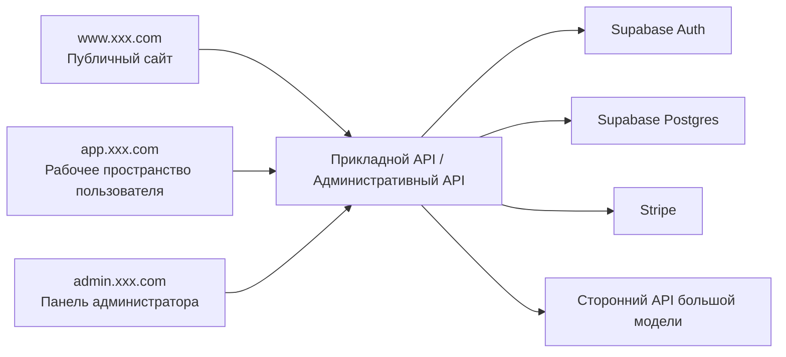
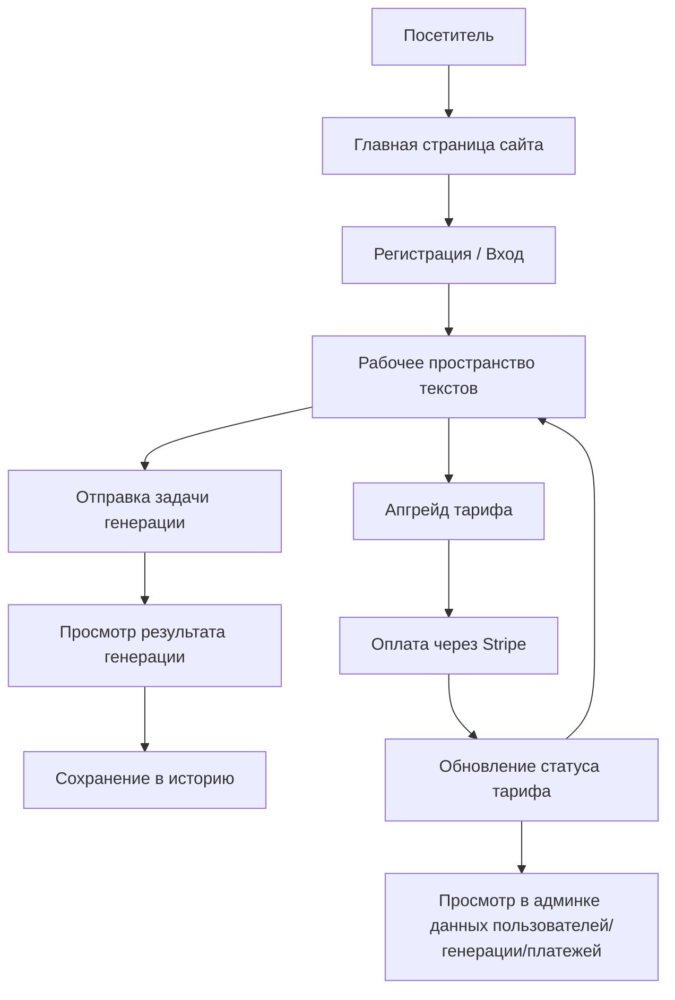

# PRD: SaaS-платформа AI-маркетинговых текстов

Статус: Draft v0.1  
Цель: сначала чётко определить границы продукта, структуру страниц, модель данных и замкнутый платёжный цикл, а затем переходить к разработке.

## 1. Позиционирование проекта

Это SaaS для AI-маркетинговых текстов, ориентированный на независимых разработчиков, небольшие команды и контент-операторов. Это не демо с однократным вызовом модели, а полноценный продукт с входом, генерацией, историей, тарифами и панелью администратора.

Определение в одну фразу:
Создать рабочее пространство для AI-маркетинговых текстов с поддержкой регистрации и входа, генерации текстов, управления историей, платных тарифов и административного управления.

Общий обзор системы:



## 1.1 Рекомендации по выбору технологий

- Фронтенд-фреймворк: `Next.js App Router`
- Аутентификация пользователей: `Supabase Auth`
- База данных: `Supabase Postgres`
- Платежи: `Stripe`
- AI-возможности: единый бэкенд-слой адаптации для подключения стороннего API большой модели

Соглашение о точках входа сайта:

- Публичный сайт: `www.xxx.com`
- Рабочее пространство пользователя: `app.xxx.com`
- Панель администратора: `admin.xxx.com`

## 1.2 Референсы конкурентов (официальные)

- [Jasper](https://www.jasper.ai/)
- [Copy.ai](https://www.copy.ai/)

## 1.3 Что заимствуем у продуктов

При проектировании этого продукта рекомендуется опираться на подходы реальных продуктов:

- Заимствуйте у `Jasper` способ подачи на официальном сайте: акцент на сценариях маркетинговых команд, ценностном предложении, возможностях платформы и конверсии через CTA
- Заимствуйте у `Jasper` идею рабочего пространства: пусть «генерация» будет не отдельной кнопкой, а рабочим пространством с контекстом и разными типами результатов
- Заимствуйте у `Copy.ai` форму продукта: разбейте разные сценарии вывода на понятные рабочие процессы, а не складывайте все функции в одно поле ввода
- Поэтому главная страница, рабочее пространство, страница тарифов и административная страница этого проекта должны больше походить на реальный маркетинговый SaaS, а не на одностраничный инструмент

## 1.4 Разбор страниц конкурентов

Рекомендуемая для изучения структура страниц конкурентов:

- Главная страница официального сайта `Jasper`
  - Обратите внимание: Hero, выражение ценности бренда, описание workflow/Agent, демо-CTA, корпоративные гарантии доверия
- Страницы типа Agent / Workflow у `Jasper`
  - Обратите внимание: это не просто показ одного текстового поля, а акцент на полном рабочем процессе «сценарий -> входной контекст -> результат на выходе»
- Страницы типа Workflow / GTM у `Copy.ai`
  - Обратите внимание: как разные маркетинговые задачи разбиваются на разные рабочие зоны и точки входа в шаблоны

Поэтому при проектировании страниц этого проекта рекомендуется не «одно поле ввода + одно поле результата», а:

- Главная страница отвечает за конверсию
- Рабочее пространство отвечает за структурированный ввод и управление выводом
- Страница истории отвечает за повторное использование контента
- Страница тарифов отвечает за монетизацию
- Панель администратора отвечает за операционный взгляд

## 2. Целевые пользователи и ключевые цели

Целевые пользователи:

- Независимые разработчики, которые хотят быстро генерировать маркетинговые тексты
- Небольшие команды, которым нужно массово производить рекламу, лендинги и тексты для соцсетей
- Администраторы, управляющие тарифами, пользователями и записями генерации

Ключевые цели:

- Пользователь может за 5 минут зарегистрироваться и выполнить первую генерацию текста
- Пользователь может просматривать историю результатов генерации и редактировать их повторно
- Продукт реализует базовый замкнутый цикл от генерации до апгрейда через оплату

## 3. Объём MVP

Первая версия обязательно включает:

- Главную страницу сайта
- Регистрацию/вход
- Рабочее пространство генерации текстов
- Страницу истории
- Страницу тарифов
- Возможности оплаты/подписки
- Просмотр в админке пользователей, записей генерации и платёжных данных

Первая версия не делает:

- Командную совместную работу
- Цепочку многоязычного перевода
- Сложную оркестрацию рабочих процессов
- Маркетплейс шаблонов

## 4. Роли и права

| Роль | Права |
|------|------|
| Гость | Просмотр сайта, регистрация и вход |
| Зарегистрированный пользователь | Генерация текстов, просмотр истории, управление тарифом |
| Администратор | Просмотр пользователей, данных генерации, платёжных и операционных данных |

## 5. Архитектура страниц

В текущем PRD определены `3 точки входа, 10 крупных страниц`:

- Публичный сайт — `1` крупная страница
- Рабочее пространство пользователя — `5` крупных страниц
- Панель администратора — `4` крупные страницы

### Публичный сайт

#### 1. Главная страница сайта `www:/`

Ключевые функции:

- Hero и CTA
- Описание сценариев
- Примеры результатов
- Превью тарифов
- FAQ

### Рабочее пространство пользователя

#### 2. Страница входа `app:/login`

Ключевые функции:

- Вход по email и паролю
- Вход через сторонние сервисы
- Переход к регистрации

#### 3. Страница регистрации `app:/register`

Ключевые функции:

- Регистрация нового пользователя
- Согласие с условиями
- Переход в рабочее пространство после завершения регистрации

#### 4. Рабочее пространство генерации `app:/generate`

Ключевые функции:

- Ввод информации о продукте, аудитории, канале, преимуществах
- Выбор типа вывода и тона
- Запуск генерации
- Просмотр результата генерации
- Сохранение и повторное редактирование

#### 5. Страница истории `app:/history`

Ключевые функции:

- Просмотр истории текстов
- Фильтрация по времени/типу
- Повторное открытие, копирование, удаление

#### 6. Страница тарифов `app:/billing`

Ключевые функции:

- Просмотр тарифов Free / Pro / Team
- Переключение между месячной и годовой оплатой
- Инициирование оплаты
- Просмотр привилегий текущего тарифа

### Панель администратора

#### 7. Главная страница админки `admin:/`

Ключевые функции:

- Общее число пользователей
- Число генераций
- Доход от платных подписок
- Обзор конверсии

#### 8. Управление пользователями `admin:/users`

Ключевые функции:

- Просмотр списка пользователей
- Просмотр статуса тарифа
- Просмотр недавней активности
- Блокировка/восстановление

#### 9. Записи генерации `admin:/generations`

Ключевые функции:

- Просмотр содержимого и числа генераций
- Просмотр неудачных записей
- Просмотр частых шаблонов и распределения по каналам

#### 10. Платежи и подписки `admin:/billing`

Ключевые функции:

- Просмотр платёжных заказов
- Просмотр статуса подписок
- Просмотр возвратов и неудачных заказов

## 5.1 Ключевые пользовательские сценарии



Ключевые потоки состояний:

- Гость -> Зарегистрированный пользователь
- Бесплатный пользователь -> Платный пользователь
- Генерация в процессе -> Генерация успешна / Генерация не удалась
- Заказ в обработке -> Оплата успешна / Оплата не удалась

## 6. Реализация бэкенда

Модули бэкенда:

- `auth`
- `generation`
- `history`
- `billing`
- `analytics`
- `admin`

Рекомендуемые таблицы данных:

```sql
profiles (
  id uuid primary key,
  email text,
  role text,
  plan text,
  created_at timestamptz
)

generation_records (
  id uuid primary key,
  user_id uuid,
  input_payload jsonb,
  output_payload jsonb,
  channel text,
  tone text,
  status text,
  created_at timestamptz
)

billing_records (
  id uuid primary key,
  user_id uuid,
  plan_code text,
  billing_cycle text,
  amount_cents int,
  status text,
  created_at timestamptz
)
```

## 6.1 Метрики и мониторинг админки

В админке рекомендуется отслеживать как минимум эти метрики:

- Число новых зарегистрированных пользователей
- Число пользователей, генерирующих ежедневно
- Общее число генераций текстов
- Доля успешных / неудачных генераций
- Конверсия в платные тарифы
- Доход от подписок и доля возвратов
- Объём запросов генерации в пиковые часы

Рекомендации по базовому мониторингу:

- Доля успешных вызовов модели
- Среднее время ответа интерфейса
- Доля успешных платёжных колбэков
- Подключения к базе данных и медленные запросы
- Логи ошибок ключевых задач

## 7. Перечень функций

Обязательно выполнить:

- Презентацию ценности на сайте
- Регистрацию/вход
- Структурированный ввод текста
- Отображение результата генерации текста
- Управление историей
- Тарифы и оплату
- Просмотр в админке пользователей и данных генерации

Опциональные улучшения:

- Библиотека шаблонов текстов
- Пресеты для разных тонов/каналов
- Повторное редактирование результата
- Копирование и экспорт
- Командное общее рабочее пространство

## 8. Черновик API

| Метод | Путь | Описание |
|------|------|------|
| `POST` | `/api/auth/register` | Регистрация |
| `POST` | `/api/auth/login` | Вход |
| `POST` | `/api/generations` | Создание задачи генерации текста |
| `GET` | `/api/generations/:id` | Получение результата генерации |
| `GET` | `/api/history` | Получение истории |
| `DELETE` | `/api/history/:id` | Удаление записи истории |
| `GET` | `/api/billing/plans` | Получение тарифов |
| `POST` | `/api/billing/checkout` | Создание сессии оплаты |
| `GET` | `/api/admin/overview` | Получение обзора админки |
| `GET` | `/api/admin/users` | Получение списка пользователей |
| `GET` | `/api/admin/generations` | Получение списка записей генерации |

## 9. Нефункциональные требования

- Процесс генерации должен иметь понятную обратную связь о загрузке и об ошибках
- История пользователя видна только ему самому
- Статус оплаты и статус тарифа должны быть согласованы
- В админке можно посмотреть объём генерации и платёжные данные по дням
- Главная страница и рабочее пространство должны быть пригодны для мобильных устройств

## 10. Рекомендуемый порядок разработки

1. Сделать сайт и страницы входа/регистрации
2. Реализовать рабочее пространство генерации
3. Подключить аутентификацию и базу данных
4. Подключить интерфейс генерации моделью
5. Реализовать историю
6. Подключить оплату и тарифы
7. Реализовать операционные страницы админки

## 11. Пункты для уточнения

- Делать ли по умолчанию только однократную генерацию без пакетной
- Делать ли сначала только месячную оплату или сразу месячную и годовую
- Нужно ли добавлять библиотеку шаблонов в первую версию
