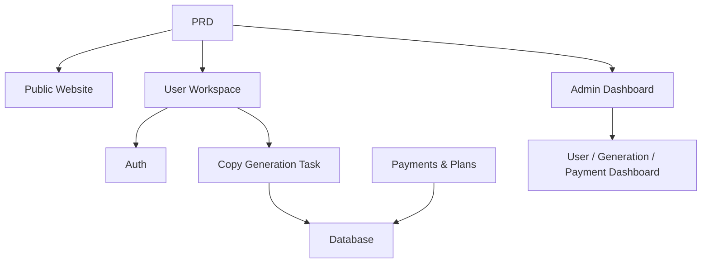

# SaaS для AI-копирайтинга в маркетинге

## Обзор

В этом проекте вам нужно создать SaaS-продукт для AI-копирайтинга в маркетинге, предназначенный для независимых разработчиков и контент-команд, на основе реального PRD. Вы будете использовать Supabase как бэкенд-сервис и Stripe для платежей, пройдя весь путь от анализа требований до развёртывания.

Это комплексный практический раздел Этапа 2. В предыдущих главах вы изучали отдельные навыки — фронтенд-страницы, бэкенд-API, базы данных и интеграцию платежей. Этот проект объединяет их в работающий прототип продукта.

## Предварительные требования

Перед началом этого проекта вы уже должны быть знакомы с:

- Дизайном фронтенд-страниц и библиотеками компонентов ([UI-дизайн](../../frontend/ui-design/), [Современные библиотеки компонентов](../../frontend/modern-component-library/))
- Проектированием и разработкой бэкенд-API ([Код API](../../backend/ai-interface-code/))
- Основами баз данных и Supabase ([От базы данных к Supabase](../../backend/database-supabase/))
- Интеграцией платежей ([Платёжная система Stripe](../../backend/stripe-payment/))
- Рабочим процессом Git и развёртыванием ([Git и GitHub](../../backend/git-workflow/), [Развёртывание веб-приложения](../../backend/zeabur-deployment/))

## Цели обучения

После завершения этого проекта вы сможете:

1. Читать и понимать реальный PRD, извлекая из него список задач для разработки
2. Использовать помощь ИИ для постепенной генерации фронтенд-страниц и бэкенд-API
3. Реализовывать аутентификацию пользователей и операции с базой данных с помощью Supabase
4. Интегрировать Stripe для функциональности платных подписок
5. Создать панель администратора и выполнить сквозную интеграцию

## Обзор проекта

Вы создадите SaaS для AI-копирайтинга в маркетинге с тремя подсистемами:

| Подсистема | Назначение |
|-----------|---------------|
| **Публичный сайт** | Описание продукта, тарифы, FAQ, конверсия регистраций |
| **Рабочее пространство пользователя** | Ввод информации о продукте, генерация текстов, просмотр истории, повышение тарифа |
| **Панель администратора** | Управление пользователями, записи генераций, данные о платежах, обзор операций |

Бэкенд использует Supabase для базы данных и аутентификации, Stripe для обработки платежей и AI-модели для генерации маркетинговых текстов.

::: tip PRD
Документ с требованиями для этого проекта находится на GitHub: [Посмотреть PRD](https://github.com/datawhalechina/easy-vibe/blob/main/docs/ru-ru/stage-2/assignments/copywriting-platform-supabase/PRD.md)
:::

<div style="margin: 32px 0;">
  <ClientOnly>
    <StepBar :active="0" :items="[
      { title: 'Требования', description: 'Прочитайте PRD, определите страницы, функции, аутентификацию и объём платежей' },
      { title: 'Каркас', description: 'Используйте ИИ для генерации трёх фронтенд-каркасов (www / app / admin)' },
      { title: 'Бэкенд', description: 'Аутентификация Supabase, API генерации, платежи Stripe' },
      { title: 'Запуск', description: 'Сквозное тестирование, развёртывание и подготовка демо' }
    ]" />
  </ClientOnly>
</div>

## Часть 1: Анализ требований

### 1.1 Прочитайте PRD

Откройте документ PRD и ответьте на эти ключевые вопросы:

- Сколько точек входа у системы? Какие страницы охватывает каждая из них?
- Какова основная функциональность каждой страницы?
- Какие модули и таблицы данных включает бэкенд?
- Как должны быть спроектированы тарифы, платёжный поток и бесплатный уровень?
- Каков объём MVP? Что входит в первую версию, а что нет?

::: warning
Если на приведённые выше вопросы нет чётких ответов, не начинайте писать код. Неясные требования — самая распространённая причина переделок.
:::

### 1.2 Подтвердите архитектуру системы

Спроектируйте общую архитектуру на основе PRD:



## Часть 2: Каркас проекта

### 2.1 Сгенерируйте фронтенд-страницы

Используйте ИИ для генерации базовой структуры и тестовых данных для всех страниц.

Пример промпта:

```text
Based on the current PRD, help me generate a frontend scaffold for an AI marketing copywriting SaaS.

Requirements:
1. Three entry points: www, app, admin
2. www: homepage, pricing, FAQ
3. app: login, register, generation workspace, history, plans page
4. admin: dashboard homepage, user management, generation records, payment orders
5. Only generate page structure with mock data, no real API integration
6. Style should look like a modern SaaS, not a classroom demo
```

### 2.2 Доработайте основную страницу

После того как каркас готов, сосредоточьтесь на доработке страницы рабочего пространства для генерации текстов (Dashboard):

```text
Continue refining the /dashboard page.

This is an AI marketing copywriting workspace.

Left side form fields:
- Product name
- One-line description
- Target audience
- 3 selling points
- Distribution channels (website, WeChat Moments, Xiaohongshu, Douyin, email)

Right side result area:
- Main headline
- Subheadline
- CTA
- 3 versions of short copy
- Long-form copy

Use mock data for interactions first.

Requirements:
- Loading state after clicking "Generate Copy"
- Empty state for result area
- Responsive layout, works on both wide and narrow screens
```

### 2.3 Проверьте структуру страниц

Проверьте каждый пункт:

- [ ] Маршруты трёх точек входа независимы
- [ ] Количество страниц соответствует PRD
- [ ] Макет формы и области результатов Dashboard разумен
- [ ] Тестовые данные показывают базовые состояния UI

### Застряли?

Если вы застряли при создании каркаса фронтенда, перечитайте эти главы:

- [UI-дизайн](../../frontend/ui-design/)
- [Дизайн UI для нескольких продуктов](../../frontend/multi-product-ui/)
- [Улучшение интерфейса с помощью LLM и Skills](../../frontend/llm-skills-beautiful/)
- [От дизайн-прототипа к коду проекта](../../frontend/design-to-code/)
- [Современные библиотеки компонентов](../../frontend/modern-component-library/)

## Часть 3: Интеграция бэкенда

### 3.1 Подключите вход через Supabase

```text
Treat me as a beginner and guide me step by step through Supabase login integration.

Help me complete:
1. Connect the project to Supabase
2. Implement registration, login, and logout
3. Redirect to /dashboard after successful login
4. Redirect unauthenticated users to /login when accessing /dashboard, /billing, /admin
5. Create a profiles table
6. Automatically create a record in profiles table after user registration
7. profiles table includes email, role, and plan fields

Requirements:
- Explain which files are being modified at each step
- Don't hardcode API keys
- Clearly mark any steps that require manual actions in the Supabase dashboard
- Explain how to verify registration and login after completion
```

### 3.2 Подключите API генерации и базу данных

```text
Treat me as a beginner and help me implement the core feature: generating marketing copy and saving it.

Target behavior:
1. User fills out the form on /dashboard and clicks "Generate Copy"
2. Backend receives: product name, description, target audience, selling points, distribution channels
3. Backend calls the model to generate results
4. Page displays the generated results
5. Both input and output are saved to the database
6. User can view history on next visit

Help me complete:
- Create generation API /api/generate
- Create generations table
- Design input and output fields
- Dashboard page reads current user's history

User experience:
- Button loading state
- Error message on generation failure
- Empty state when no history exists

After completion, explain:
- Frontend page file locations
- Backend API file locations
- Where database write logic lives
- How to test the complete generation pipeline
```

### 3.3 Подключите платежи Stripe

```text
Treat me as a beginner and help me add the simplest viable Stripe payment to the project.

No complex system needed — just get the basic payment flow working.

Help me complete:
1. /billing page shows free and pro plans
2. User clicks upgrade → redirects to Stripe Checkout
3. After successful payment, returns to the site
4. Payment result saved to subscriptions table
5. Sync update to profile.plan field
6. Free users limited to 3 generations per day, pro users unlimited

Implementation principles:
- Get the main flow working first, don't worry about complex edge cases
- Clearly document what needs to be configured in Stripe dashboard
- Explain how to test the complete payment flow after completion
```

### 3.4 Создайте панель администратора

```text
Treat me as a beginner and help me build a clean, functional admin dashboard.

Admin-only access.

Help me complete:
1. Only users with role = admin can access /admin
2. Dashboard has 3 tabs: User List, Generation Records, Subscription Status
3. User List shows: email, plan, creation date
4. Generation Records shows: user, product name, channel, creation date
5. Subscription Status shows: user, plan, payment status

Requirements:
- Clean, clear interface
- Use existing component library's table, tab, and badge components
- Explain how to set an account as admin after completion
```

### Застряли?

Если вы застряли при разработке бэкенда, перечитайте эти главы:

- [От базы данных к Supabase](../../backend/database-supabase/)
- [Код API с помощью LLM](../../backend/ai-interface-code/)
- [Интеграция платежей Stripe](../../backend/stripe-payment/)

## Часть 4: Интеграция и запуск

### 4.1 Сквозное тестирование

Как минимум проверьте следующие сценарии:

- Регистрация → Вход → Генерация текста → Просмотр истории → Повышение тарифа
- Вход администратора → Просмотр данных пользователей → Просмотр записей генераций → Просмотр статуса платежей

Проверка перед развёртыванием:

```text
Treat me as a beginner and help me check if the project is ready for deployment.

Check focus:
- Are environment variables complete?
- Is the login callback URL correct?
- Is the Stripe payment callback URL correct?
- Are there missing loading, empty, or error states on any pages?
- Does the README include setup and deployment instructions?

Help me:
1. List items to fix, prioritized
2. Mark which ones must be fixed first
3. Explain deployment steps after fixes
```

### 4.2 Развёртывание

Разверните проект в публичной среде. Инструкции по развёртыванию см.: [Рабочий процесс Git и GitHub](../../backend/git-workflow/), [Развёртывание веб-приложения](../../backend/zeabur-deployment/).

## Что нужно сдать

После завершения этого проекта сдайте следующее:

- [ ] Доступную ссылку на работающее демо
- [ ] Ссылку на репозиторий с исходным кодом (с README)
- [ ] Документ PRD
- [ ] Скриншоты основных страниц (главная, Dashboard, Billing, Admin)
- [ ] 60-секундное демо-видео (охватывающее регистрацию → генерацию → оплату → администрирование)

README должен включать как минимум: обзор проекта, описание основных страниц, технологический стек, шаги локальной установки и список переменных окружения.

## Критерии оценки

| Параметр | Базовые требования | Продвинутые требования |
|------------|-------------------|----------------------|
| Полнота продукта | Главная страница, вход, Dashboard, Billing, Admin — все доступны | Тексты и визуальный стиль главной выглядят как у настоящего SaaS |
| Бизнес-цикл | Регистрация → Вход → Генерация → Просмотр истории работает сквозно | Различия в правах Free/Pro чётко видны |
| Корректность данных | Результаты генерации и статус платежей сохраняются в базе данных | Есть понятные сообщения об ошибках, пустые состояния и состояния загрузки |
| Аутентификация и безопасность | Неаутентифицированные пользователи не могут получить доступ к защищённым страницам; обычные пользователи не могут попасть в Admin | Есть базовая валидация ввода и серверная аутентификация |
| Инженерная сдача | Проект запускается локально и может быть развёрнут публично | README понятный, демо-видео хорошо структурировано |

::: tip
Если задача кажется слишком большой, помните этот принцип: **Сначала заставьте работать, потом сделайте красиво.**
:::

## Чек-лист перед отправкой

<el-card shadow="hover" style="margin: 20px 0; border-radius: 12px;">
  <template #header>
    <div style="font-weight: bold; font-size: 16px;">Финальная проверка перед отправкой</div>
  </template>

  <ul style="list-style-type: none; padding-left: 0;">
    <li><label><input type="checkbox" disabled /> Страницы главной, входа, Dashboard, Billing и Admin завершены</label></li>
    <li><label><input type="checkbox" disabled /> Пользователи могут регистрироваться, входить и выходить</label></li>
    <li><label><input type="checkbox" disabled /> Результаты генерации действительно сохраняются в базе данных</label></li>
    <li><label><input type="checkbox" disabled /> Основной платёжный поток работает</label></li>
    <li><label><input type="checkbox" disabled /> Администратор может просматривать пользователей, записи генераций и статус платежей</label></li>
    <li><label><input type="checkbox" disabled /> Проект развёрнут в публичном интернете</label></li>
  </ul>
</el-card>

## Справочные материалы

- [UI-дизайн](../../frontend/ui-design/)
- [Дизайн UI для нескольких продуктов](../../frontend/multi-product-ui/)
- [Улучшение интерфейса с помощью LLM и Skills](../../frontend/llm-skills-beautiful/)
- [От дизайн-прототипа к коду проекта](../../frontend/design-to-code/)
- [Современные библиотеки компонентов](../../frontend/modern-component-library/)
- [От базы данных к Supabase](../../backend/database-supabase/)
- [Код API с помощью LLM](../../backend/ai-interface-code/)
- [Рабочий процесс Git и GitHub](../../backend/git-workflow/)
- [Развёртывание веб-приложения](../../backend/zeabur-deployment/)
- [Интеграция платежей Stripe](../../backend/stripe-payment/)
