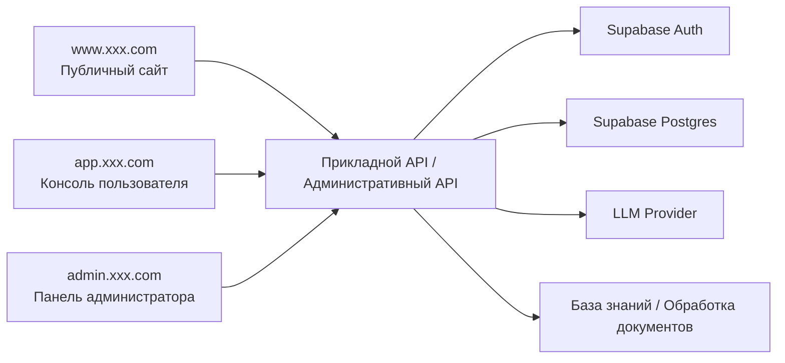
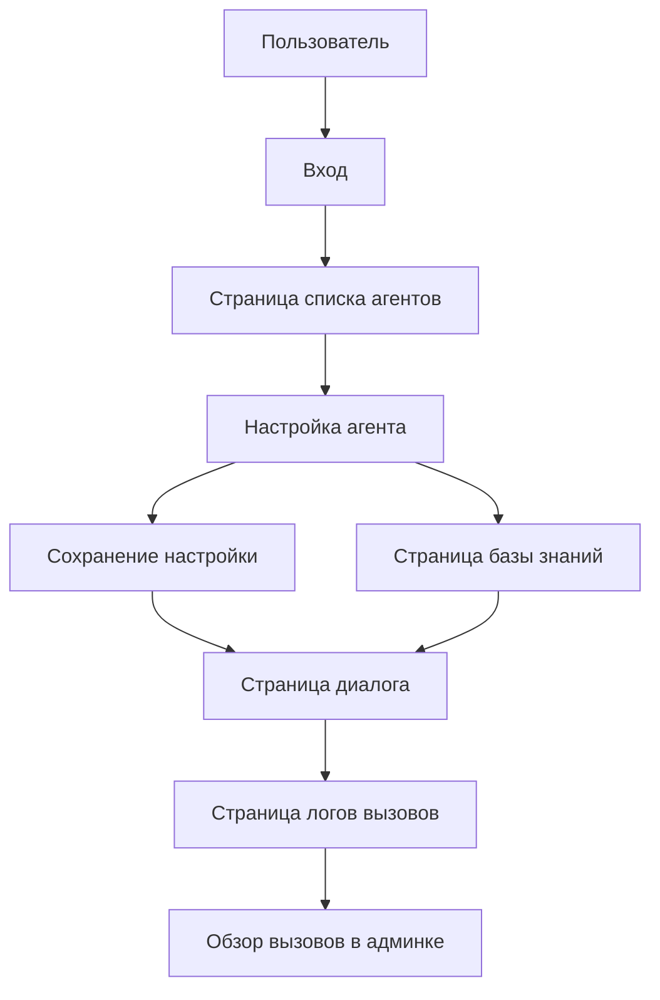

# PRD: платформа оркестрации агентов в духе Dify

Статус: Draft v0.1  
Цель: сначала чётко прописать определение MVP-продукта и границы реализации платформы, а после review приступать к разработке.

## 1. Позиционирование проекта

Это упрощённая версия платформы агентов, повторяющая ключевой опыт Dify. Акцент не на копировании всех возможностей, а на том, чтобы пройти следующую основную цепочку:

- Создание агента
- Настройка Prompt и параметров модели
- Запуск диалога
- Просмотр логов вызовов
- Опциональное подключение базы знаний

Определение в одну фразу:
Создать минимально жизнеспособную платформу оркестрации агентов в духе Dify.

Общий обзор системы:



## 1.0 Рекомендации по выбору технологий

- Фронтенд-фреймворк: `Next.js App Router`
- Аутентификация пользователей: `Supabase Auth`
- База данных: `Supabase Postgres`
- Хранилище файлов: `Supabase Storage`
- Слой моделей: единый бэкенд-слой адаптации для подключения сторонних LLM

Соглашение о точках входа сайта:

- Публичный сайт: `www.xxx.com`
- Консоль пользователя: `app.xxx.com`
- Панель администратора: `admin.xxx.com`

## 1.1 Референсы конкурентов (официальные)

- [Dify](https://dify.ai/)
- [Dify Docs](https://docs.dify.ai/)

## 1.2 Что заимствуем у продукта

При проектировании этого продукта рекомендуется опираться на реальную форму продукта Dify:

- Управление агентами, база знаний, диалог и логи должны быть чёткими разделами, а не смешаны на одной странице
- Страница настройки должна выделять Prompt, модель, параметры и статус публикации, а не давать только форму
- Страница диалога должна подчёркивать «какой agent сейчас используется» и «какому agent принадлежит текущая сессия»
- Страница логов должна позволять быстро находить неудачные вызовы, время выполнения, расход token и причину ошибки
- Общий дизайн должен больше походить на консоль AI-платформы, а не на обычный чат-сайт

## 1.3 Разбор страниц конкурентов

Рекомендуемая для изучения структура страниц конкурентов:

- Главная страница консоли `Dify`
  - Обратите внимание: список приложений, точка создания, недавняя активность, навигация с ощущением платформы
- Страница настройки приложения `Dify`
  - Обратите внимание: способ организации Prompt, модели, параметров, статуса публикации
- Страница базы знаний `Dify`
  - Обратите внимание: способ управления загрузкой документов, их статусом и результатами обработки
- Страница отладки / предпросмотра `Dify`
  - Обратите внимание: идея двух колонок — настройка слева, результат выполнения справа

Поэтому страницы этого проекта рекомендуется делать больше похожими на консоль платформы:

- Страница списка агентов — как маркетплейс/управление приложениями
- Страница настройки — как центр настроек консоли
- Страница диалога — как стенд отладки и предпросмотра
- Страница логов — как страница эксплуатации для разработчика

## 2. Целевые пользователи и ключевые цели

Целевые пользователи:

- Разработчики, которые хотят быстро настроить и протестировать несколько агентов
- Студенты или независимые разработчики, желающие создать внутреннего помощника по знаниям
- Администраторы, которым нужно просматривать записи вызовов модели

Ключевые цели:

- Пользователь создаёт первого агента за 5 минут
- Пользователь может выполнить настройку и диалог на одной платформе
- Платформа может отслеживать вход, выход, время выполнения и статус каждого вызова

## 3. Объём MVP

Первая версия обязательно включает:

- Регистрацию/вход
- CRUD агентов
- Страницу диалога
- Историю сессий
- Страницу логов вызовов
- Опциональную базу знаний: только загрузка текстовых файлов и базовый поиск

Первая версия не делает:

- Сложный UI оркестрации узлов рабочего процесса
- Мультиарендную корпоративную систему прав
- Песочницу для вызова инструментов
- Оплату и тарификацию
- Стратегии маршрутизации между несколькими моделями

## 4. Роли и права

| Роль | Права |
|------|------|
| Обычный пользователь | Управление своими агентами, запуск диалогов, просмотр своих логов |
| Администратор | Просмотр обзора всех пользователей и вызовов платформы |

## 5. Реализация фронтенда

## 5.1 Обзор архитектуры страниц

В текущем PRD определены `3 точки входа, 10 крупных страниц`:

- Публичный сайт — `1` крупная страница
- Консоль пользователя — `7` крупных страниц
- Панель администратора — `2` крупные страницы

### A. Публичный сайт `www.xxx.com`

#### 1. Главная страница сайта `www:/`

Ключевые функции:

- Описание продукта
- Описание возможностей
- Сценарии использования
- CTA регистрации/входа

### B. Консоль пользователя `app.xxx.com`

#### 2. Страница входа `app:/login`

Ключевые функции:

- Вход
- Точка входа в регистрацию
- Вход через сторонние сервисы

#### 3. Страница списка агентов `app:/agents`

Ключевые функции:

- Просмотр всех агентов
- Создание нового агента
- Точка входа в редактирование
- Фильтрация по статусу

#### 4. Страница настройки агента `app:/agents/:id`

Ключевые функции:

- Настройка имени и описания
- Настройка Prompt, модели, параметров
- Включение/выключение и статус публикации

#### 5. Страница диалога `app:/chat`

Ключевые функции:

- Выбор агента
- Создание новой сессии
- Отображение сообщений чата
- Отправка вопросов-ответов и показ результата

#### 6. Страница деталей сессии `app:/chat/:id`

Ключевые функции:

- Просмотр полной истории сообщений
- Переименование сессии
- Продолжение вопросов

#### 7. Страница базы знаний `app:/knowledge`

Ключевые функции:

- Загрузка документов
- Просмотр статуса обработки
- Привязка к агенту

#### 8. Страница логов `app:/logs`

Ключевые функции:

- Просмотр логов вызовов
- Фильтрация по статусу/модели
- Просмотр деталей ошибок

### C. Панель администратора `admin.xxx.com`

#### 9. Главная страница админки `admin:/`

Ключевые функции:

- Число пользователей
- Число вызовов
- Доля ошибок
- Обзор ресурсов платформы

#### 10. Страница обзора пользователей и вызовов `admin:/usage`

Ключевые функции:

- Просмотр использования пользователями
- Просмотр расхода вызовов модели
- Просмотр аномальных пользователей и дорогих вызовов

## 5.2 Ключевые пользовательские сценарии



Ключевые потоки состояний:

- Агент: черновик -> настроен -> доступен / отключён
- Сессия: создана -> в процессе -> архивирована
- Документ: загружается -> обрабатывается -> доступен для поиска / ошибка
- Вызов: успех / ошибка / таймаут

Рекомендуемый стек технологий:

- Next.js App Router
- TypeScript
- Tailwind CSS
- shadcn/ui

Рекомендуемые страницы:

| Страница | Путь | Описание |
|------|------|------|
| Страница входа | `/login` | Вход и регистрация |
| Список агентов | `/agents` | Просмотр и управление агентами |
| Страница настройки агента | `/agents/:id` | Редактирование имени, Prompt, модели, температуры и т. д. |
| Страница диалога | `/chat` | Список сессий слева, область сообщений справа |
| Страница базы знаний | `/knowledge` | Загрузка материалов, просмотр статуса документов |
| Страница логов | `/logs` | Просмотр логов вызовов модели |
| Панель администратора | `/admin` | Обзор числа пользователей, вызовов, ошибок |

Ключевые компоненты фронтенда:

- Список карточек агентов
- Форма настройки Agent
- Список сообщений диалога
- Панель отладки Prompt
- Таблица фильтрации логов
- Компонент загрузки файлов

## 6. Реализация бэкенда

Рекомендуемый стек технологий:

- Node.js + NestJS или Express
- PostgreSQL / Supabase
- OpenAI-совместимый интерфейс

Модули бэкенда:

- `auth`
- `agents`
- `chat`
- `knowledge`
- `logs`
- `admin`

Рекомендуемые таблицы данных:

```sql
profiles (
  id uuid primary key,
  email text,
  role text,
  created_at timestamptz
)

agents (
  id uuid primary key,
  user_id uuid,
  name text,
  description text,
  system_prompt text,
  model text,
  temperature numeric,
  status text,
  created_at timestamptz
)

chat_sessions (
  id uuid primary key,
  user_id uuid,
  agent_id uuid,
  title text,
  created_at timestamptz
)

chat_messages (
  id uuid primary key,
  session_id uuid,
  role text,
  content text,
  token_usage int,
  created_at timestamptz
)

knowledge_documents (
  id uuid primary key,
  user_id uuid,
  agent_id uuid,
  filename text,
  status text,
  chunk_count int,
  created_at timestamptz
)

run_logs (
  id uuid primary key,
  user_id uuid,
  agent_id uuid,
  session_id uuid,
  model text,
  latency_ms int,
  prompt_tokens int,
  completion_tokens int,
  status text,
  error_message text,
  created_at timestamptz
)
```

## 6.1 Метрики и мониторинг админки

В админке рекомендуется отслеживать как минимум эти метрики:

- Общее число агентов
- Число активных пользователей
- Число ежедневных вызовов
- Среднее время ответа
- Доля неудачных вызовов модели
- Доля успешной обработки документов базы знаний
- Пользователи с высоким расходом и дорогие агенты

Рекомендации по базовому мониторингу:

- Среднее время и доля ошибок `/api/chat`
- Доля успешных вызовов поставщика модели
- Состояние очереди обработки документов базы знаний
- Здоровье подключений к базе данных и записи логов

## 7. Перечень функций

Обязательно выполнить:

- Аутентификацию пользователей
- Создание/редактирование/удаление агентов
- Выбор агента и запуск сессии
- Сохранение сообщений сессии
- Запись логов вызовов

Второй приоритет:

- Загрузку документов
- Базовый retrieval-augmented поиск
- Сводную статистику платформы

## 8. Черновик API

| Метод | Путь | Описание |
|------|------|------|
| `POST` | `/api/auth/register` | Регистрация |
| `POST` | `/api/auth/login` | Вход |
| `GET` | `/api/agents` | Получение списка агентов текущего пользователя |
| `POST` | `/api/agents` | Создание агента |
| `PATCH` | `/api/agents/:id` | Обновление настроек агента |
| `DELETE` | `/api/agents/:id` | Удаление агента |
| `POST` | `/api/chat/sessions` | Создание новой сессии |
| `POST` | `/api/chat/sessions/:id/messages` | Отправка сообщения в сессию |
| `GET` | `/api/chat/sessions/:id/messages` | Получение сообщений сессии |
| `POST` | `/api/knowledge/documents` | Загрузка документа в базу знаний |
| `GET` | `/api/logs` | Получение логов вызовов |
| `GET` | `/api/admin/overview` | Обзор платформы |

Пример запроса `POST /api/chat/sessions/:id/messages`:

```json
{
  "agentId": "agent_123",
  "message": "Помоги мне кратко описать позиционирование этой функции"
}
```

## 9. Ключевые бизнес-правила

- Пользователь может обращаться только к своим агентам и сессиям
- Перед удалением агента нужно проверить наличие активных сессий
- В логах обязательно записывать причину сбоя
- Сбой обработки документа базы знаний должен быть виден

## 10. Нефункциональные требования

- Пользователь может обращаться только к своим агентам, документам и сессиям
- Логи вызовов должны быть отслеживаемыми и фильтруемыми
- Статус обработки документов должен иметь чёткую обратную связь
- Страница диалога на мобильных устройствах должна как минимум открываться для просмотра
- После изменения настроек агента должно быть уведомление об изменении

## 11. Рекомендуемый порядок разработки

1. Вход и базовая аутентификация
2. CRUD агентов
3. Страница диалога и хранение сессий
4. Запись логов
5. Загрузка документов и базовый поиск
6. Обзор в панели администратора

## 12. Пункты для уточнения

- Обязательна ли база знаний в первой версии
- Подключать сначала только одного поставщика модели или закладывать несколько
- Нужна ли платформе концепция Workspace
- Сохранять ли в логах полный снимок prompt
