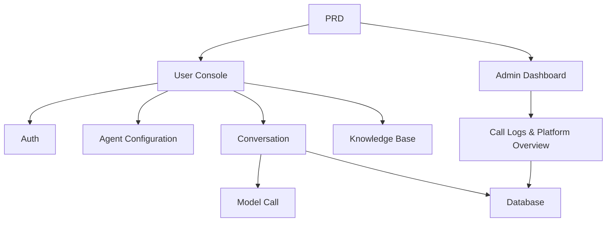

# Кастомная платформа агентов Dify

## Обзор

В этом проекте вам нужно создать платформу агентов, воспроизводящую ключевой опыт Dify, на основе реального PRD. Вы создадите пользовательскую консоль, панель администратора и бэкенд платформы, реализовав основные функции: управление агентами, диалоги, логирование и базу знаний.

Это комплексный практический раздел Этапа 2. В отличие от предыдущих проектов с одной страницей или одной функцией, этот требует создания «платформенного» AI-продукта — с несколькими ролями, несколькими модулями, сохранением данных и пайплайнами вызова моделей.

## Предварительные требования

Перед началом этого проекта вы уже должны быть знакомы с:

- Дизайном фронтенд-страниц и библиотеками компонентов ([UI-дизайн](../../frontend/ui-design/), [Современные библиотеки компонентов](../../frontend/modern-component-library/))
- Проектированием и разработкой бэкенд-API ([Код API](../../backend/ai-interface-code/))
- Основами баз данных и Supabase ([От базы данных к Supabase](../../backend/database-supabase/))
- Рабочим процессом Git и развёртыванием ([Git и GitHub](../../backend/git-workflow/), [Развёртывание веб-приложения](../../backend/zeabur-deployment/))

## Цели обучения

После завершения этого проекта вы сможете:

1. Читать и понимать реальный PRD, извлекая из него список задач для разработки
2. Проектировать архитектуру страниц и модели данных для платформы агентов
3. Реализовывать полный пайплайн создания агентов, диалогов и логирования
4. Использовать помощь ИИ для создания продукта платформенного типа
5. Выполнить сквозную интеграцию и сдать готовый к демонстрации прототип AI-платформы

## Обзор проекта

Вы создадите платформу агентов в стиле Dify с двумя подсистемами:

| Подсистема | Назначение |
|-----------|---------------|
| **Пользовательская консоль** | Создание агентов, настройка промптов, запуск диалогов, просмотр логов, управление базой знаний |
| **Панель администратора** | Просмотр данных пользователей, использования ресурсов платформы, статистики вызовов API |

Бэкенд должен поддерживать: управление агентами, управление сессиями, хранение сообщений, вызовы моделей, логирование вызовов и интеграцию базы знаний.

::: tip PRD
Документ с требованиями для этого проекта находится на GitHub: [Посмотреть PRD](https://github.com/datawhalechina/easy-vibe/blob/main/docs/ru-ru/stage-2/assignments/custom-dify-agent-platform/PRD.md)
:::

<div style="margin: 32px 0;">
  <ClientOnly>
    <StepBar :active="0" :items="[
      { title: 'Требования', description: 'Прочитайте PRD, определите страницы, объём возможностей, аутентификацию и модели данных' },
      { title: 'Каркас', description: 'Используйте ИИ для генерации каркасов пользовательской консоли и панели администратора' },
      { title: 'Итерации', description: 'Добавляйте агентов, диалоги, логи и базу знаний модуль за модулем' },
      { title: 'Запуск', description: 'Сквозное тестирование, развёртывание и подготовка демо' }
    ]" />
  </ClientOnly>
</div>

## Часть 1: Анализ требований

### 1.1 Прочитайте PRD

Откройте документ PRD и ответьте на эти ключевые вопросы:

- Что из агентов, сессий, логов и базы знаний должно войти в MVP?
- Окончательно ли определён список страниц и маршрутов?
- Каковы границы вызовов моделей и записи логов?
- Стоит ли отложить мультиарендность и сложные рабочие процессы?

::: warning
Если на приведённые выше вопросы нет чётких ответов, не начинайте писать код. Неясные требования — самая распространённая причина переделок.
:::

### 1.2 Подтвердите архитектуру системы

Спроектируйте общую архитектуру на основе PRD:



## Часть 2: Каркас проекта

### 2.1 Сгенерируйте фронтенд-страницы

Пример промпта:

```text
Based on the current PRD, help me generate a frontend scaffold for a Dify-like agent platform.

Requirements:
1. User side: login, agent list, agent configuration, conversation page, logs page, knowledge base page
2. Admin side: dashboard homepage, user overview, resource usage overview
3. Only generate page structure with mock data first, no real API integration
4. Style should look like a modern AI platform
```

### 2.2 Проверьте структуру страниц

Проверьте каждый пункт:

- [ ] Точки входа пользовательской консоли и панели администратора разделены
- [ ] Страницы списка агентов, настройки, диалога, логов и базы знаний завершены
- [ ] Главная страница панели администратора и страница обзора пользователей доступны
- [ ] Тестовые данные показывают базовые состояния UI

## Часть 3: Итеративная разработка

### 3.1 Прогресс модуль за модулем

Поверх каркаса добавляйте функции модуль за модулем в таком порядке:

1. **Аутентификация**: регистрация, вход, разделение ролей
2. **Управление агентами**: создание, редактирование, удаление, настройка промптов
3. **Диалоги**: создание сессий, обмен сообщениями, вызовы моделей
4. **Логирование**: запись задержки, использования токенов, ошибок
5. **База знаний** (бонус): загрузка документов, поиск, внедрение результатов
6. **Панель администратора**: данные пользователей, использование ресурсов, статистика вызовов

После каждого модуля используйте эту таблицу самопроверки:

| Пункт проверки | Метод проверки |
|------------|---------------------|
| Согласованность страниц | Соответствуют ли количество страниц и функции PRD? |
| Полнота API | Полны ли API агентов, чата, логов и знаний? |
| Изоляция доступа | Могут ли пользователи управлять только своими агентами и сессиями? |
| Согласованность данных | Согласуются ли данные сообщений, логов и документов? |
| Готовность к демо | Можете ли вы сквозно продемонстрировать «создать агента → чат → просмотр логов»? |

### 3.2 Интеграция базы знаний (бонус)

Если вы хотите добавить возможности базы знаний, добавьте «переключатель базы знаний» для каждого агента:

- При включении: сначала ищите фрагменты знаний, затем отправляйте их вместе с вопросом пользователя в модель
- При отключении: отвечайте в обычном режиме диалога

Для первой версии не стремитесь к сложному RAG — просто убедитесь, что «результаты поиска видны, а цепочка вызовов объяснима».

## Часть 4: Интеграция и запуск

### 4.1 Сквозное тестирование

Как минимум проверьте следующие сценарии:

- Регистрация → Создание агента → Настройка промпта → Запуск диалога → Просмотр логов
- Вход администратора → Просмотр данных пользователей → Просмотр статистики вызовов

Чек-лист перед развёртыванием:

- [ ] Все основные API требуют проверки входа
- [ ] Проверки прав владения агентами проходят
- [ ] Записи диалогов и логов сохраняются в базе данных
- [ ] API-ключи моделей используют переменные окружения, а не захардкожены
- [ ] Сообщения об ошибках видны на фронтенде, а не только в консоли

### 4.2 Развёртывание

Разверните проект в публичной среде. Инструкции по развёртыванию см.: [Рабочий процесс Git и GitHub](../../backend/git-workflow/), [Развёртывание веб-приложения](../../backend/zeabur-deployment/).

## Что нужно сдать

После завершения этого проекта сдайте следующее:

- [ ] Доступную ссылку на работающее демо
- [ ] Ссылку на репозиторий с исходным кодом (с README)
- [ ] Документ PRD
- [ ] Скриншоты основных страниц (управление агентами, диалог, логи, панель администратора)
- [ ] 60-секундное демо-видео (охватывающее создание агента → чат → просмотр логов)

README должен включать как минимум: обзор проекта, описание архитектуры, технологический стек, шаги локальной установки, список переменных окружения и документацию API.

## Критерии оценки

| Параметр | Базовые требования | Продвинутые требования |
|------------|-------------------|----------------------|
| Полнота платформы | Страницы agents / chat / logs функциональны | Есть понятная навигация и единый язык дизайна |
| Бизнес-цикл | Можно создавать агентов и вести реальные диалоги | Поддерживается переключение между несколькими агентами и история сессий |
| Данные и отслеживание | Сообщения и логи вызовов доступны для запросов | Есть дашборд статистики токенов / задержек |
| Аутентификация и безопасность | Только вошедшие пользователи могут получить доступ к основным API | Проверка прав владения ресурсами надёжна |
| Инженерная сдача | Развёртываемо, демонстрируемо, понятный README | База знаний интегрирована с объяснимым поиском |

## Чек-лист перед отправкой

<el-card shadow="hover" style="margin: 20px 0; border-radius: 12px;">
  <template #header>
    <div style="font-weight: bold; font-size: 16px;">Финальная проверка перед отправкой</div>
  </template>

  <ul style="list-style-type: none; padding-left: 0;">
    <li><label><input type="checkbox" disabled /> Страницы управления агентами, диалогов и логов доступны после входа</label></li>
    <li><label><input type="checkbox" disabled /> Можно создать хотя бы 1 агента и успешно пообщаться с ним</label></li>
    <li><label><input type="checkbox" disabled /> Каждый раунд вопрос-ответ можно найти в базе данных</label></li>
    <li><label><input type="checkbox" disabled /> Сбои вызовов показывают сообщения об ошибках на фронтенде и логируются</label></li>
    <li><label><input type="checkbox" disabled /> Проект развёрнут, README и демо-видео готовы</label></li>
  </ul>
</el-card>

## Справочные материалы

- [UI-дизайн](../../frontend/ui-design/)
- [Современные библиотеки компонентов](../../frontend/modern-component-library/)
- [От базы данных к Supabase](../../backend/database-supabase/)
- [Код API с помощью LLM](../../backend/ai-interface-code/)
- [Рабочий процесс Git и GitHub](../../backend/git-workflow/)
- [Развёртывание веб-приложения](../../backend/zeabur-deployment/)
