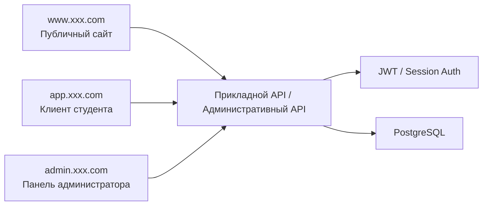
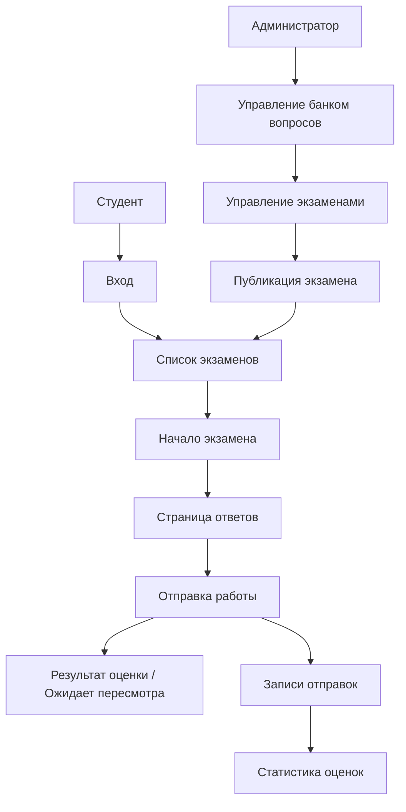

# PRD: система онлайн-экзаменов и управления

Статус: Draft v0.1  
Цель: сначала чётко определить роли, экзаменационную цепочку, административную панель и ключевую модель данных, а затем переходить к разработке.

## 1. Позиционирование проекта

Это типичная многоролевая бизнес-система. Это не просто страница с вопросами, а полноценный продукт, включающий клиентскую часть для студентов, административную часть, банк вопросов, экзамены, записи о сдаче и обработку результатов.

Определение в одну фразу:
Создать систему онлайн-экзаменов с поддержкой ответов студентов, составления заданий администратором, ведения банка вопросов, статистики оценок и административного управления.

Общий обзор системы:



## 1.1 Рекомендации по выбору технологий

- Фронтенд-фреймворк: `Next.js` или `React + Vite`
- Бэкенд-фреймворк: `Node.js + Express`
- База данных: `PostgreSQL`
- Аутентификация: `JWT + Role-based Access Control`

Соглашение о точках входа сайта:

- Публичный сайт: `www.xxx.com`
- Клиент студента: `app.xxx.com`
- Панель администратора: `admin.xxx.com`

## 1.2 Референсы конкурентов (официальные)

- [Canvas by Instructure](https://www.instructure.com/canvas)
- [Moodle LMS](https://moodle.com/products/lms/)

## 1.3 Что заимствуем у продуктов

При проектировании этого продукта рекомендуется опираться на реальные образовательные продукты:

- Заимствуйте у `Canvas` многоуровневое разделение информации: клиент студента и административная часть имеют чёткие зоны ответственности, а не складывают все функции в один вид
- Заимствуйте у `Moodle` подход к банку вопросов и управлению экзаменами: вопросы, экзамены, отправки и оценки должны быть отдельными модулями
- На стороне студента страницы должны подчёркивать «статус экзамена, оставшееся время, обратную связь по отправке»
- Административные страницы должны подчёркивать «ведение банка вопросов, публикацию экзаменов, записи отправок, панель статистики»
- Дизайн должен больше походить на реальную LMS/экзаменационную платформу, а не на единственную форму с вопросами

## 1.4 Разбор страниц конкурентов

Рекомендуемая для изучения структура страниц конкурентов:

- Способ организации курсов/заданий/тестов у `Canvas`
  - Обратите внимание: как студент видит предстоящие дела, статус задач и обратную связь по результатам
- Страницы банка вопросов и тестов у `Moodle`
  - Обратите внимание: как разделяются модули вопросов, тестов и записей отправок
- Опыт административной части у `Moodle`
  - Обратите внимание: как многоуровнево представлены управление банком вопросов, настройка тестов и просмотр оценок

Поэтому для страниц этого проекта рекомендуется следующее:

- Клиент студента подчёркивает «ощущение процесса»
- Административная часть подчёркивает «ощущение настройки»
- Страница оценок подчёркивает «ощущение результата»
- Главная страница админки подчёркивает «ощущение обзора»

## 2. Целевые пользователи и ключевые цели

Целевые пользователи:

- Студенты, сдающие экзамены и просматривающие оценки
- Администраторы, ведущие экзамены, вопросы, оценки и статистику

Ключевые цели:

- Студент может беспрепятственно пройти весь процесс экзамена
- Администратор может управлять банком вопросов, экзаменами и записями отправок
- Система стабильно сохраняет результаты отправок и статистику оценок

## 3. Объём MVP

Первая версия обязательно включает:

- Вход
- Список экзаменов студента
- Страницу ответов студента
- Результаты отправки и историю оценок
- Панель администратора
- Управление банком вопросов
- Управление экзаменами
- Просмотр записей отправок и оценок

Первая версия не делает:

- Случайное формирование заданий
- Сложную защиту от списывания
- Несколько кампусов и мультиарендность
- Видеонаблюдение за экзаменом

## 4. Роли и права

| Роль | Права |
|------|------|
| Студент | Просмотр экзаменов, начало ответов, отправка работы, просмотр оценок |
| Администратор | Управление банком вопросов, экзаменами, записями отправок и статистикой оценок |

## 5. Архитектура страниц

В текущем PRD определены `3 точки входа, 10 крупных страниц`:

- Публичный сайт — `1` крупная страница
- Клиент студента — `4` крупные страницы
- Панель администратора — `5` крупных страниц

### Публичный сайт

#### 1. Главная страница сайта `www:/`

Ключевые функции:

- Описание платформы
- Точка входа в систему
- Описание экзаменов

### Клиент студента

#### 2. Страница входа `app:/login`

Ключевые функции:

- Вход по логину и паролю
- Точка входа для восстановления пароля

#### 3. Страница списка экзаменов `app:/student/exams`

Ключевые функции:

- Просмотр доступных экзаменов
- Просмотр статуса и времени экзамена
- Вход в экзамен

#### 4. Страница ответов `app:/student/exams/:id`

Ключевые функции:

- Показ вопросов
- Ответы
- Обратный отсчёт
- Отправка работы

#### 5. Страница истории оценок `app:/student/history`

Ключевые функции:

- Просмотр истории экзаменов
- Просмотр оценок и статуса
- Просмотр ситуации, ожидающей пересмотра

### Панель администратора

#### 6. Главная страница админки `admin:/`

Ключевые функции:

- Общее число экзаменов
- Число отправок студентов
- Число работ, ожидающих проверки
- Обзор оценок

#### 7. Управление банком вопросов `admin:/questions`

Ключевые функции:

- Добавление вопросов
- Редактирование вопросов
- Фильтрация по категориям
- Пакетный импорт

#### 8. Управление экзаменами `admin:/exams`

Ключевые функции:

- Создание экзамена
- Привязка вопросов
- Установка времени начала и продолжительности
- Публикация/закрытие экзамена

#### 9. Записи отправок `admin:/submissions`

Ключевые функции:

- Просмотр отправок студентов
- Просмотр деталей ответов
- Ручной пересмотр

#### 10. Статистика оценок `admin:/scores`

Ключевые функции:

- Просмотр среднего балла по экзамену
- Просмотр доли успешной сдачи
- Просмотр доли ошибок по вопросам

## 5.1 Ключевые пользовательские сценарии



Ключевые потоки состояний:

- Экзамен: черновик -> опубликован -> закрыт
- Отправка: в процессе -> отправлена -> проверена / ожидает пересмотра
- Оценка студента: балл не выставлен -> балл выставлен

## 6. Реализация бэкенда

Модули бэкенда:

- `auth`
- `exams`
- `questions`
- `submissions`
- `scores`
- `admin`

Рекомендуемые таблицы данных:

```sql
profiles (
  id uuid primary key,
  email text,
  role text,
  created_at timestamptz
)

exams (
  id uuid primary key,
  title text,
  description text,
  duration_minutes int,
  status text,
  created_at timestamptz
)

questions (
  id uuid primary key,
  type text,
  stem text,
  options jsonb,
  correct_answer text,
  score int,
  created_at timestamptz
)

submissions (
  id uuid primary key,
  exam_id uuid,
  student_id uuid,
  status text,
  total_score numeric,
  submitted_at timestamptz
)
```

## 6.1 Метрики и мониторинг админки

В админке рекомендуется отслеживать как минимум эти метрики:

- Число опубликованных экзаменов
- Число участников
- Доля отправок
- Средний балл / доля успешной сдачи
- Число вопросов, ожидающих пересмотра
- Топ-10 вопросов по доле ошибок

Рекомендации по базовому мониторингу:

- Доля успешных входов
- Доля ошибок в процессе отправки
- Время автоматической проверки
- Доля неудачных записей в базу данных

## 7. Перечень функций

Обязательно выполнить:

- Вход и проверку прав по ролям
- Список экзаменов студента
- Ответы и отправку студента
- Просмотр истории оценок
- Управление банком вопросов
- Управление экзаменами
- Просмотр записей отправок
- Просмотр статистики оценок

Опциональные улучшения:

- Случайное формирование заданий
- Пакетный импорт вопросов
- Статистику по классам
- Экспорт оценок

## 8. Черновик API

| Метод | Путь | Описание |
|------|------|------|
| `POST` | `/api/auth/login` | Вход |
| `GET` | `/api/exams` | Получение списка экзаменов, видимых студенту |
| `GET` | `/api/exams/:id` | Получение деталей экзамена |
| `POST` | `/api/submissions/start` | Начало экзамена |
| `POST` | `/api/submissions/:id/submit` | Отправка работы |
| `GET` | `/api/student/history` | Получение истории оценок |
| `GET` | `/api/admin/questions` | Получение банка вопросов |
| `POST` | `/api/admin/questions` | Добавление вопроса |
| `GET` | `/api/admin/exams` | Получение списка экзаменов |
| `POST` | `/api/admin/exams` | Создание экзамена |
| `GET` | `/api/admin/submissions` | Получение записей отправок |
| `GET` | `/api/admin/scores` | Получение статистики оценок |

## 9. Нефункциональные требования

- Права клиента студента и администратора должны быть строго изолированы
- После сдачи работы оценки и записи ответов должны стабильно сохраняться в базе
- Статусы автоматической проверки и ручного пересмотра должны быть понятными
- Методики подсчёта статистики в админке должны быть согласованы
- Страница ответов должна давать чёткую обратную связь по обратному отсчёту и потере соединения

## 10. Рекомендуемый порядок разработки

1. Вход и проверка прав по ролям
2. Список экзаменов и страница ответов на стороне студента
3. Цепочка отправки и оценки
4. Управление банком вопросов и экзаменами в админке
5. Страницы записей отправок и статистики

## 11. Пункты для уточнения

- Поддерживать ли в первой версии только одиночный выбор/верно-неверно/краткий ответ
- Делать ли для кратких ответов только ручной пересмотр
- Нужно ли ограничивать экзамен одной попыткой отправки
