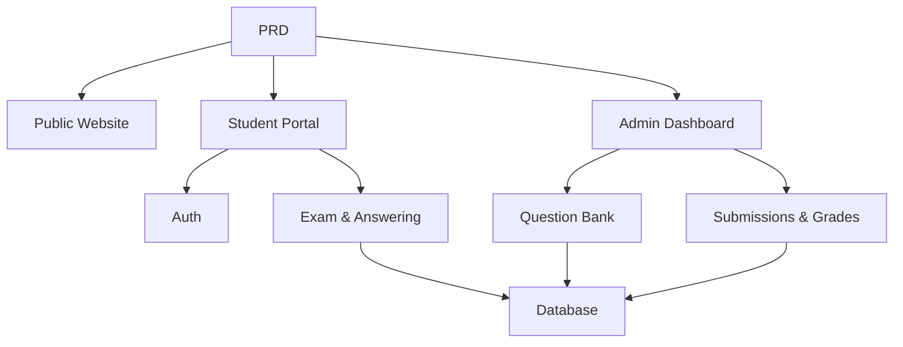

# Система онлайн-экзаменов и управления

## Обзор

В этом проекте вам нужно с нуля создать систему онлайн-экзаменов и управления на основе реального PRD. Особенность этого проекта — его многоролевой дизайн: студенты и администраторы видят разные страницы и могут выполнять разные действия. Вы будете использовать Express для создания бэкенда, реализуя полный бизнес-пайплайн экзамена.

Это комплексный практический раздел Этапа 2. Многоролевые системы прав доступа очень распространены в реальных приложениях. Освоив этот паттерн, вы сможете справляться с самыми разными сценариями в образовании, SaaS и администрировании.

## Предварительные требования

Перед началом этого проекта вы уже должны быть знакомы с:

- Дизайном фронтенд-страниц и библиотеками компонентов ([UI-дизайн](../../frontend/ui-design/), [Современные библиотеки компонентов](../../frontend/modern-component-library/))
- Проектированием и разработкой бэкенд-API ([Код API](../../backend/ai-interface-code/))
- Основами баз данных и Supabase ([От базы данных к Supabase](../../backend/database-supabase/))
- Рабочим процессом Git и развёртыванием ([Git и GitHub](../../backend/git-workflow/), [Развёртывание веб-приложения](../../backend/zeabur-deployment/))

## Цели обучения

После завершения этого проекта вы сможете:

1. Читать и понимать реальный PRD, извлекая из него список задач для разработки
2. Проектировать контроль прав доступа и маршрутизацию страниц для многоролевых систем
3. Создавать полноценный бэкенд-API с помощью Express
4. Реализовывать бизнес-пайплайн экзамена, отправки ответов и автоматического оценивания
5. Выполнить сквозную интеграцию и сдать готовый к демонстрации прототип бизнес-системы

## Обзор проекта

Вы создадите систему онлайн-экзаменов и управления с тремя подсистемами:

| Подсистема | Назначение |
|-----------|---------------|
| **Публичный сайт** | Описание платформы, точка входа для авторизации |
| **Портал студента** | Список экзаменов, прохождение экзаменов, отправка ответов, просмотр оценок |
| **Панель администратора** | Управление банком вопросов, управление экзаменами, записи отправок, статистика оценок |

Бэкенд использует Express и должен поддерживать: аутентификацию при входе, права ролей, управление экзаменами и банком вопросов, процесс отправки ответов с автоматическим оцениванием, а также управление оценками и статистикой.

::: tip PRD
Документ с требованиями для этого проекта находится на GitHub: [Посмотреть PRD](https://github.com/datawhalechina/easy-vibe/blob/main/docs/ru-ru/stage-2/assignments/exam-management-express/PRD.md)
:::

<div style="margin: 32px 0;">
  <ClientOnly>
    <StepBar :active="0" :items="[
      { title: 'Требования', description: 'Прочитайте PRD, определите роли, страницы, процесс экзамена и модели данных' },
      { title: 'Каркас', description: 'Используйте ИИ для генерации каркасов страниц студента и администратора' },
      { title: 'Бэкенд', description: 'Подключите вход, экзамены, отправку ответов и оценивание с помощью Express' },
      { title: 'Запуск', description: 'Сквозное тестирование, развёртывание и подготовка демо' }
    ]" />
  </ClientOnly>
</div>

## Часть 1: Анализ требований

### 1.1 Прочитайте PRD

Откройте документ PRD и ответьте на эти ключевые вопросы:

- Сколько ролей в системе? Что может делать каждая роль?
- Полон ли список страниц? Какие страницы есть у портала студента и панели администратора?
- Какие типы вопросов поддерживаются? Какова логика оценивания для каждого типа?
- Каков полный процесс экзамена? (Публикация → Начало → Ответы → Отправка → Оценивание → Просмотр результатов)

::: warning
Если на приведённые выше вопросы нет чётких ответов, не начинайте писать код. Неясные требования — самая распространённая причина переделок.
:::

### 1.2 Подтвердите архитектуру системы

Спроектируйте общую архитектуру на основе PRD:



## Часть 2: Каркас проекта

### 2.1 Сгенерируйте фронтенд-страницы

Пример промпта:

```text
Based on the current PRD, help me generate a frontend scaffold for an online exam and management system.

Tech stack:
- Next.js App Router
- TypeScript
- Tailwind CSS
- shadcn/ui

Page list:
1. Homepage /
2. Login page /login
3. Student exam list /student/exams
4. Student exam taking /student/exams/[id]
5. Student grades /student/history
6. Admin dashboard /admin
7. Exam management /admin/exams
8. Question bank /admin/questions
9. Submission records /admin/submissions

Requirements:
- Student pages should be clean, focused, and easy to answer questions on
- Admin pages should use sidebar + top bar layout
- Use mock data first, no real API integration
- Ensure basic usability on both desktop and mobile
```

### 2.2 Доработайте страницу прохождения экзамена студентом

Страница прохождения экзамена — это ядро портала студента. Сосредоточьтесь на её доработке:

```text
Continue refining the student exam-taking page.

This is an exam-taking page for an online exam system, it should include:
- Top bar: exam title, countdown timer, number of answered questions
- Main area: question stem and options
- Support three question types: single choice, true/false, short answer
- Answer card on the left or top showing which questions have been answered
- Confirmation dialog before submission

Use mock data for interactions first, no real API.

Requirements:
- Clean interface, shouldn't look like a backend table page
- Countdown should be prominent but not overly stressful
- Include empty states and loading states
```

### 2.3 Доработайте панель администратора

Первая версия панели администратора сосредоточена на трёх ключевых областях:

- **Управление экзаменами**: создание экзаменов, установка длительности, управление статусом публикации
- **Банк вопросов**: добавление вопросов, редактирование вопросов, фильтрация по типу
- **Записи отправок**: просмотр отправок студентов, баллов, временных меток

### 2.4 Проверьте структуру страниц

Проверьте каждый пункт:

- [ ] Точки входа студента и администратора разделены
- [ ] Страницы входа, списка экзаменов, прохождения экзамена и оценок завершены
- [ ] Страницы банка вопросов, управления экзаменами и записей отправок администратора доступны
- [ ] Стили страниц студента и администратора чётко различаются

### Застряли?

Если вы застряли при создании каркаса фронтенда, перечитайте эти главы:

- [От базы данных к Supabase](../../backend/database-supabase/)
- [Проектирование и разработка бэкенд-API](../../backend/ai-interface-code/)
- [Современные библиотеки компонентов](../../frontend/modern-component-library/)

## Часть 3: Разработка бэкенда

### 3.1 Вход и контроль прав доступа

```text
Treat me as a beginner and help me implement login and permission control for the online exam system.

Backend: Express.

Goals:
1. Both students and admins can log in
2. Login returns the user's role
3. Students can only access /student/* APIs
4. Admins can only access /admin/* APIs
5. Unauthenticated users accessing protected pages redirect to /login

Requirements:
- Suggest a clear directory structure
- Explain what the middleware is responsible for
- Don't hardcode environment variables
- Explain how to verify permissions work after implementation
```

### 3.2 API экзаменов и банка вопросов

Рекомендуемая реализация по модулям:

| Модуль | Предлагаемые API |
|--------|---------------|
| Управление экзаменами | `GET /api/exams`, `POST /api/admin/exams`, `PATCH /api/admin/exams/:id` |
| Банк вопросов | `GET /api/admin/questions`, `POST /api/admin/questions` |
| Начало экзамена | `POST /api/submissions/start` |
| Отправка экзамена | `POST /api/submissions/:id/submit` |
| Записи оценок | `GET /api/student/history`, `GET /api/admin/submissions` |

Пример промпта:

```text
Help me design and implement Express APIs for the online exam system.

Scope:
- Admin creates exams
- Admin manages question bank
- Students view published exams
- Students start exam and create submission
- Student submissions auto-grade multiple choice and true/false
- Short answer questions marked as pending review
- Students view their grade history
- Admins view all submission records

Requirements:
- Clear API naming
- Unified JSON response structure
- Separate code into controller, service, middleware, and db layers
- Explain how to test each API
```

### 3.3 Логика оценивания

Логика оценивания — это ключевое бизнес-правило системы экзаменов:

- **Вопросы с выбором ответа**: засчитываются баллы, если ответ пользователя совпадает с правильным
- **Верно/Неверно**: также может оцениваться автоматически
- **Развёрнутый ответ**: первая версия просто сохраняет ответ, балл равен null, статус `reviewed = false`

::: tip Бонус
Если вы хотите добавить возможности ИИ, можно позволить администраторам вводить «тему + сложность» и поручить модели сгенерировать кандидаты вопросов для ручной проверки перед добавлением в банк. Но это бонус, а не обязательное требование.
:::

## Часть 4: Интеграция и запуск

### 4.1 Сквозное тестирование

Как минимум проверьте следующие сценарии:

- Вход студента → Просмотр списка экзаменов → Начало экзамена → Отправка → Просмотр оценок
- Вход администратора → Создание экзамена → Добавление вопросов → Публикация → Просмотр записей отправок

### 4.2 Развёртывание

- Фронтенд: разверните на Vercel / Zeabur
- API на Express: разверните на Zeabur / Railway / Render
- База данных: используйте Supabase Postgres или управляемый PostgreSQL

Чек-лист перед развёртыванием:

- [ ] Переменные окружения полные
- [ ] URL-адреса API фронтенда и бэкенда корректны
- [ ] Состояние входа работает в продакшене
- [ ] Аккаунт администратора действительно может получить доступ к панели
- [ ] README включает инструкции по установке, развёртыванию и тестированию

## Что нужно сдать

После завершения этого проекта сдайте следующее:

- [ ] Доступную ссылку на работающее демо
- [ ] Ссылку на репозиторий с исходным кодом (с README)
- [ ] Документ PRD
- [ ] Скриншоты основных страниц (главная, список экзаменов студента, страница прохождения экзамена, панель администратора)
- [ ] 60-секундное демо-видео (охватывающее процесс экзамена студента и процесс администрирования)

README должен включать как минимум: обзор проекта, описание основных страниц, технологический стек, шаги локальной установки и список переменных окружения.

## Критерии оценки

| Параметр | Базовые требования | Продвинутые требования |
|------------|-------------------|----------------------|
| Полнота страниц | Основные страницы студента и администратора доступны | Единый стиль страниц, базовая адаптивность для мобильных |
| Бизнес-цикл | Студенты могут входить, проходить экзамены, отправлять ответы и просматривать оценки | Администраторы могут полностью создавать и публиковать экзамены |
| Корректность данных | Отправленные ответы сохраняются в базе данных, объективные вопросы оцениваются автоматически | Развёрнутые ответы поддерживают ручную проверку или помощь ИИ |
| Контроль прав | Границы доступа студента и администратора чёткие | Серверные API также имеют проверку ролей |
| Инженерная сдача | Проект запускается и развёртываем, README понятный | Есть демо-видео и инструкции по тестированию |

## Чек-лист перед отправкой

<el-card shadow="hover" style="margin: 20px 0; border-radius: 12px;">
  <template #header>
    <div style="font-weight: bold; font-size: 16px;">Финальная проверка перед отправкой</div>
  </template>

  <ul style="list-style-type: none; padding-left: 0;">
    <li><label><input type="checkbox" disabled /> Страницы главной, входа, портала студента и панели администратора завершены</label></li>
    <li><label><input type="checkbox" disabled /> Студенты могут нормально начинать экзамены и отправлять ответы</label></li>
    <li><label><input type="checkbox" disabled /> Администраторы могут создавать экзамены и просматривать записи отправок</label></li>
    <li><label><input type="checkbox" disabled /> Баллы за объективные вопросы рассчитываются автоматически и сохраняются в базе данных</label></li>
    <li><label><input type="checkbox" disabled /> Границы прав студента и администратора проверены</label></li>
    <li><label><input type="checkbox" disabled /> Проект развёрнут или имеет полные инструкции по локальной установке</label></li>
  </ul>
</el-card>

## Справочные материалы

- [UI-дизайн](../../frontend/ui-design/)
- [Современные библиотеки компонентов](../../frontend/modern-component-library/)
- [От базы данных к Supabase](../../backend/database-supabase/)
- [Код API с помощью LLM](../../backend/ai-interface-code/)
- [Рабочий процесс Git и GitHub](../../backend/git-workflow/)
- [Развёртывание веб-приложения](../../backend/zeabur-deployment/)
