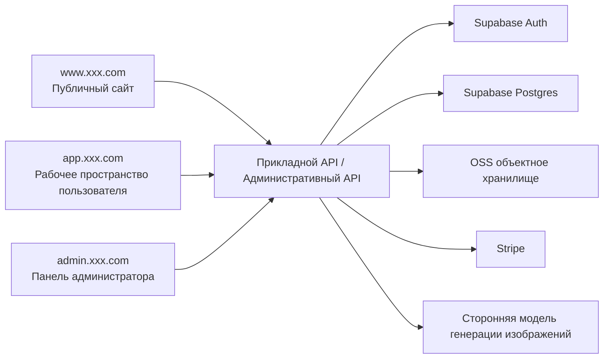
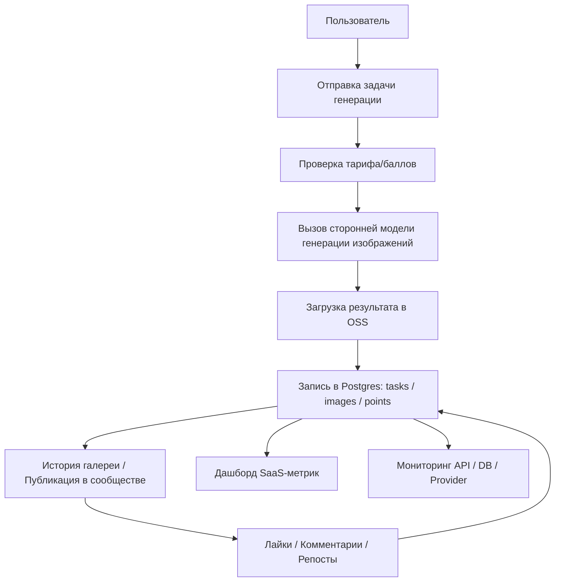

# PRD: современная SaaS-платформа генерации изображений ИИ

Статус: Draft v0.2  
Цель: сначала подготовить пригодный для review продукт и план реализации, без перехода к разработке.

## 1. Позиционирование проекта

Это современный SaaS-сайт генерации изображений ИИ. Опыт продукта ориентируется на такие платформы, как Midjourney, Leonardo, Playground, но бэкенд не обучает собственную модель, а подключается к стороннему сервису модели генерации изображений.

Первая версия делает не «одну витринную страницу», а минимально жизнеспособный замкнутый цикл продукта:

- Лендинг сайта
- Регистрацию и вход пользователей
- Ввод Prompt и генерацию изображений
- Историю изображений и управление результатами
- Систему тарифов/квот
- Систему баллов
- Публикацию изображений и публичную витрину
- Возможности взаимодействия: лайки, комментарии, репосты
- Панель администратора

Определение в одну фразу:
Создать современную SaaS-платформу генерации изображений ИИ для обычных авторов и независимых разработчиков, где фронтенд предоставляет официальный сайт, рабочее пространство генерации и сообщество для обмена, а бэкенд подключается к сторонней модели генерации изображений, поддерживая регистрацию и вход, покупку баллов по тарифам, обмен изображениями и взаимодействие.

Соглашение о точках входа сайта:

- Публичный сайт: `www.xxx.com`
- Рабочее пространство пользователя: `app.xxx.com`
- Панель администратора: `admin.xxx.com`

## 1.1 Рекомендации по выбору технологий

Технологическое решение по умолчанию:

- Фронтенд-фреймворк: `Next.js App Router`
- Аутентификация пользователей: `Supabase Auth`
- База данных: `Supabase Postgres`
- Хранилище файлов: `Supabase Storage`
- Платежи: `Stripe`
- Модель генерации изображений: подключение к стороннему API модели через единый бэкенд-слой адаптации

Причины выбора по умолчанию:

- `Supabase Auth + Supabase Postgres` подходят для быстрого запуска первой версии SaaS
- Систему пользователей, базу данных и объектное хранилище можно решить вместе
- Удобно для обоих фронтендов — `app.xxx.com` и `admin.xxx.com`
- Если позже понадобится выделить отдельные сервисы, остаётся пространство для расширения

Дизайн аутентификации по умолчанию:

- Обычные пользователи поддерживают вход по email и паролю и вход через сторонние сервисы
- Администраторы используют ту же систему входа, но в таблице пользователей помечены `role=admin`
- Панель администратора обязательно проверяет права администратора
- Интерфейсы фронтенда пользователя и панели администратора имеют раздельную проверку прав

Дизайн базы данных по умолчанию:

- Основная бизнес-база использует `PostgreSQL`
- Пользователи, задачи, платежи, баллы, контент сообщества и логи мониторинга сначала размещаются в одной основной базе
- Аналитические запросы сначала агрегируются на основе основной базы, а при росте объёма данных позже выделяется аналитическая база

Общий обзор системы:



## 2. Целевые пользователи и ключевые цели

Целевые пользователи:

- Обычные пользователи, которые хотят быстро генерировать маркетинговые изображения, обложки, постеры
- Дизайнеры или контент-авторы, которым нужно массово тестировать Prompt
- Пользователи сообщества, которые любят просматривать чужие работы и взаимодействовать
- Администраторы, управляющие пользователями, задачами и расходом квот

Ключевые цели:

- Пользователь может за 3 минуты зарегистрироваться и сгенерировать первое изображение
- Пользователь чётко видит результат каждой генерации, расход баллов и историю
- Пользователь может поделиться понравившейся работой и получить обратную связь от взаимодействий
- Платформа поддерживает покупку баллов, расход баллов, повтор при неудаче, взаимодействие с контентом и административное управление

Рекомендуемые «полярные» метрики (North Star):

- Доля успешной генерации первого изображения новым пользователем
- Число пользователей, генерирующих ежедневно
- Среднее число генераций на пользователя
- Доля успешных задач генерации
- Доля конверсии в оплату
- Число опубликованных изображений
- Доля взаимодействий лайками/комментариями
- Число пользователей, активно использующих баллы ежедневно

## 3. Объём MVP

Первая версия обязательно включает:

- Главную страницу сайта
- Регистрацию/вход
- Рабочее пространство генерации изображений
- Страницу истории изображений
- Страницу тарифов/баллов
- Страницу баллов
- Возможности оплаты/подписки
- Страницу публичного обмена изображениями
- Лайки, комментарии, репосты
- Интерфейс генерации изображений
- Запрос статуса задачи генерации
- Просмотр в админке пользователей, задач генерации, использования баллов и взаимодействий с контентом

Первая версия не делает:

- Самообучаемую модель
- Оркестрацию рабочих процессов с несколькими моделями
- Редактор изображений
- Командную совместную работу
- Многоязычность

## 4. Роли и права

| Роль | Права |
|------|------|
| Гость | Просмотр сайта, просмотр описания продукта, регистрация и вход |
| Зарегистрированный пользователь | Создание задач генерации, просмотр истории изображений, управление своими баллами и результатами, просмотр детализации баллов, публикация работ, лайки/комментарии/репосты |
| Администратор | Просмотр пользователей, статуса задач, логов ошибок, тарифов и расхода баллов, управление правилами баллов, публичным контентом и данными взаимодействий |

## 5. Реализация фронтенда

Рекомендуемый стек технологий:

- Next.js App Router
- TypeScript
- Tailwind CSS
- shadcn/ui

Описание формы фронтенда:

- И публичный сайт, и рабочее пространство пользователя относятся к «фронтенд-продукту»
- Панель администратора по сути тоже является фронтенд-страницами, просто рассчитана на внутреннюю эксплуатацию и администраторов
- Поэтому в этом проекте будет два фронтенд-интерфейса:
  - Продуктовый фронтенд для пользователей
  - Панель администратора для эксплуатации/администраторов
- При этом панели администратора нужны отдельные административные интерфейсы и проверка прав

Рекомендации по точкам входа:

| Тип сайта | Рекомендуемая точка входа | Описание |
|------|------|------|
| Публичный сайт | `www.xxx.com` | Описание продукта, тарифы, FAQ, точка входа в регистрацию |
| Рабочее пространство пользователя | `app.xxx.com` | После входа: генерация изображений, просмотр галереи, баллов, публикация постов |
| Панель администратора | `admin.xxx.com` | Управление пользователями, тарифами, задачами, контентом, контролем рисков |

## 5.1 Обзор архитектуры страниц

В текущем PRD определены `3 точки входа, 19 крупных страниц`:

- Публичный сайт — `1` крупная страница
- Рабочее пространство пользователя — `9` крупных страниц
- Панель администратора — `9` крупных страниц

### A. Публичный сайт `www.xxx.com`

#### 1. Главная страница сайта `www:/`

Ключевые функции:

- Hero-зона и главный CTA
- Описание возможностей продукта
- Витрина работ
- Превью тарифов
- FAQ
- Точки входа в регистрацию/вход/рабочее пространство

### B. Рабочее пространство пользователя `app.xxx.com`

#### 2. Страница входа `app:/login`

Ключевые функции:

- Вход по email/паролю
- Точка входа через сторонние сервисы
- Точка восстановления пароля
- Переход к странице регистрации

#### 3. Страница регистрации `app:/register`

Ключевые функции:

- Регистрация нового пользователя
- Согласие с условиями и политикой конфиденциальности
- Регистрация через сторонние сервисы
- Переход в рабочее пространство после успешной регистрации

#### 4. Рабочее пространство генерации `app:/generate`

Ключевые функции:

- Ввод Prompt и Negative Prompt
- Выбор модели, соотношения сторон, количества, параметров качества
- Отправка задачи генерации изображений
- Просмотр статуса «генерируется/успешно/неудача»
- Повторная генерация результата, добавление в избранное, публикация

#### 5. История галереи `app:/gallery`

Ключевые функции:

- Просмотр личной истории генераций
- Фильтрация по времени/модели/статусу
- Удаление изображений
- Добавление изображений в избранное
- Переход к деталям из истории или повторное использование Prompt

#### 6. Страница тарифов `app:/billing`

Ключевые функции:

- Просмотр тарифов Basic / Standard / Pro / Mega
- Переключение между месячной и годовой оплатой
- Просмотр баллов и привилегий каждого тарифа
- Инициирование покупки тарифа
- Покупка дополнительного пакета баллов
- FAQ и описание привязки аккаунта

#### 7. Страница баллов `app:/points`

Ключевые функции:

- Просмотр текущего баланса баллов
- Просмотр записей начисления баллов
- Просмотр записей расхода баллов
- Ежедневная отметка (чек-ин)
- Обмен баллов на привилегии или количество генераций

#### 8. Сообщество `app:/explore`

Ключевые функции:

- Просмотр ленты публичных работ
- Сортировка по популярности/новизне
- Лайки работ
- Комментирование работ
- Репост работ
- Переход к странице деталей работы

#### 9. Страница деталей работы `app:/posts/:id`

Ключевые функции:

- Просмотр крупного изображения отдельной работы
- Просмотр информации об авторе и времени публикации
- Просмотр полного Prompt и параметров
- Просмотр данных по лайкам, комментариям, репостам
- Копирование Prompt / повторная генерация / лайк / комментарий / репост

#### 10. Личный кабинет `app:/settings`

Ключевые функции:

- Просмотр личных данных
- Привязка/связывание аккаунтов
- Просмотр текущего тарифа
- Просмотр способов входа и настроек безопасности
- Управление настройками публичного обмена

### C. Панель администратора `admin.xxx.com`

#### 11. Главная страница админки `admin:/`

Ключевые функции:

- Общее число пользователей
- Общий объём задач генерации
- Обзор дохода от платежей
- Обзор обмена контентом и взаимодействий
- Оповещения об аномальных задачах

#### 12. Управление пользователями `admin:/users`

Ключевые функции:

- Просмотр списка пользователей
- Поиск и фильтрация пользователей
- Просмотр тарифа, баллов, активности пользователя
- Блокировка/разблокировка аккаунта
- Ручная корректировка баллов

#### 13. Управление задачами `admin:/tasks`

Ключевые функции:

- Просмотр всех задач генерации
- Фильтрация по статусу: успешные/неудачные/в обработке
- Просмотр причины неудачи
- Ручной повтор или отметка аномальных задач

#### 14. Управление контентом `admin:/posts`

Ключевые функции:

- Просмотр списка публичных работ
- Модерация: можно ли показывать работу
- Снятие нарушающего контента
- Просмотр записей комментариев и взаимодействий
- Модерация или удаление комментариев

#### 15. Управление тарифами `admin:/plans`

Ключевые функции:

- Настройка цен тарифов
- Настройка скидок для месячной/годовой оплаты
- Настройка числа баллов в тарифе
- Настройка пакетов баллов (top-up)
- Настройка параллельности и продвинутых привилегий

#### 16. Платёжные заказы `admin:/billing`

Ключевые функции:

- Просмотр списка платёжных заказов
- Просмотр статуса подписок
- Просмотр возвратов/неудачных заказов
- Поиск аномальных платёжных записей

#### 17. Операционная конфигурация `admin:/operations`

Ключевые функции:

- Настройка правил баллов за чек-ин
- Настройка правил вознаграждений за обмен/взаимодействие
- Настройка анонсов акций
- Настройка переключателей контроля рисков и модерации

#### 18. Дашборд SaaS-метрик `admin:/analytics`

Ключевые функции:

- Просмотр новых пользователей, DAU, WAU, MAU
- Просмотр конверсии регистрации, конверсии в оплату
- Просмотр удержания на следующий день/7/30 дней
- Просмотр распределения тарифов и продлений подписок
- Просмотр начисления, расхода и остатка баллов
- Просмотр числа публикаций в сообществе, доли лайков, комментариев, репостов

#### 19. Страница системного мониторинга `admin:/observability`

Ключевые функции:

- Просмотр объёма вызовов API, доли успеха, доли ошибок, среднего времени
- Просмотр вызовов сторонней модели генерации изображений
- Просмотр состояния подключений к базе данных, медленных запросов и доли неудач
- Просмотр статуса колбэков платёжного интерфейса
- Просмотр накопления и повторов в очереди задач
- Просмотр системных оповещений и логов ошибок

Подробный перечень рекомендуемых страниц:

| Страница | Путь | Описание |
|------|------|------|
| Главная страница сайта | `www:/` | Hero, витрина работ, описание функций, тарифы, FAQ, CTA |
| Страница входа | `app:/login` | Форма входа |
| Страница регистрации | `app:/register` | Форма регистрации |
| Рабочее пространство генерации | `app:/generate` | Prompt, настройка параметров, отправка задачи, просмотр результата |
| История галереи | `app:/gallery` | Просмотр истории изображений, фильтрация, удаление, избранное |
| Страница тарифов | `app:/billing` | Показ уровней тарифов, месячная/годовая оплата, привилегии по баллам |
| Страница баллов | `app:/points` | Просмотр баланса баллов, записей начисления, правил обмена |
| Сообщество | `app:/explore` | Просмотр публичных работ, лайки, комментарии, репосты |
| Страница деталей работы | `app:/posts/:id` | Просмотр деталей одной публичной работы и данных взаимодействий |
| Личный кабинет | `app:/settings` | Данные пользователя, баллы, информация о привязках |
| Главная страница админки | `admin:/` | Обзорный дашборд админки |
| Управление пользователями | `admin:/users` | Просмотр пользователей, блокировка, статус баллов и тарифов |
| Управление задачами | `admin:/tasks` | Просмотр задач генерации, неудачных задач, повторов |
| Управление контентом | `admin:/posts` | Модерация публичных работ, комментариев, данных репостов |
| Управление тарифами | `admin:/plans` | Настройка тарифов, пакетов баллов, цен и привилегий |
| Платёжные заказы | `admin:/billing` | Просмотр платёжных записей, статуса возвратов, аномальных заказов |
| Операционная конфигурация | `admin:/operations` | Настройка правил чек-ина, баллов, анонсов и акций |
| Дашборд SaaS-метрик | `admin:/analytics` | Просмотр удержания, конверсии, баллов, подписок и активности сообщества |
| Страница системного мониторинга | `admin:/observability` | Просмотр статуса API, вызовов модели, базы данных, платежей, очереди |

Ключевые компоненты фронтенда:

- Hero-зона и CTA
- Панель ввода Prompt
- Зона настройки параметров модели
- Карточка результата-изображения
- Компонент опроса статуса задачи
- Список галереи/каскадная сетка (masonry)
- Компонент карточки тарифа
- Компонент переключения месячной/годовой оплаты
- Карточка обзора баллов
- Список детализации баллов
- Сворачиваемая зона FAQ
- Карточка публичной работы
- Список комментариев и поле ввода комментария
- Панель действий лайк/репост
- Карточка цены тарифа
- Компоненты пустого состояния, загрузки, повтора при неудаче
- Таблицы, фильтры, статистические карточки, панель модерации в админке
- Графики мониторинга, графики трендов, карточки состояния здоровья, список оповещений

Состояние фронтенда и поток данных:

- Гость с главной страницы переходит к регистрации или входу
- После входа переходит на `/generate`
- Пользователь вводит Prompt и параметры и отправляет задачу генерации
- Фронтенд опрашивает или подписывается на статус задачи
- При успехе показывает изображение и записывает в историю
- Пользователь может получить баллы после чек-ина, генерации, обмена, взаимодействия
- Пользователь может опубликовать изображение в публичном сообществе
- Другие пользователи могут лайкать, комментировать, репостить эту работу
- Страница тарифов показывает остаток баллов, различия тарифов и точку входа в апгрейд
- Страница баллов показывает источники баллов, записи расхода и точку входа в обмен
- Администратор входит через отдельную точку входа в админку — операционный дашборд и модули управления
- Администратор может в админке просматривать бизнес-метрики и состояние здоровья системы

## 6. Реализация бэкенда

Рекомендуемый стек технологий:

- Next.js Route Handlers или Node.js/Express
- PostgreSQL / Supabase
- Подключение к стороннему API модели генерации изображений

Модули бэкенда:

- `auth`: регистрация, вход, проверка прав
- `generation`: создание задачи генерации, запрос статуса задачи, повтор при неудаче
- `images`: история изображений, удаление, избранное, детали
- `points`: покупка баллов, накопление, списание, вознаграждения за задачи, записи обмена
- `billing`: тарифы, платёжные записи, статус апгрейда
- `social`: публичная публикация, лайки, комментарии, репосты
- `analytics`: статистика удержания, конверсии, подписок, баллов, активности сообщества
- `observability`: вызовы API, вызовы модели, статус базы данных, логи оповещений
- `admin`: просмотр в админке пользователей, задач, логов ошибок, модерация контента, операционная конфигурация

Основной поток данных:



Рекомендуемые таблицы данных:

```sql
profiles (
  id uuid primary key,
  email text,
  role text,
  plan text,
  points int,
  created_at timestamptz
)

generation_tasks (
  id uuid primary key,
  user_id uuid,
  prompt text,
  negative_prompt text,
  model text,
  aspect_ratio text,
  image_count int,
  status text,
  error_message text,
  provider_task_id text,
  points_cost int,
  created_at timestamptz
)

generated_images (
  id uuid primary key,
  task_id uuid,
  user_id uuid,
  image_url text,
  width int,
  height int,
  is_favorite boolean,
  created_at timestamptz
)

billing_records (
  id uuid primary key,
  user_id uuid,
  plan_code text,
  billing_cycle text,
  type text,
  amount_cents int,
  points_delta int,
  status text,
  created_at timestamptz
)

point_records (
  id uuid primary key,
  user_id uuid,
  type text,
  points_delta int,
  source text,
  created_at timestamptz
)

api_call_logs (
  id uuid primary key,
  route text,
  method text,
  user_id uuid,
  status_code int,
  duration_ms int,
  request_id text,
  created_at timestamptz
)

provider_call_logs (
  id uuid primary key,
  provider_name text,
  task_id uuid,
  status text,
  duration_ms int,
  error_message text,
  created_at timestamptz
)

system_health_checks (
  id uuid primary key,
  service_name text,
  check_type text,
  status text,
  detail jsonb,
  created_at timestamptz
)

subscription_plans (
  id uuid primary key,
  code text,
  name text,
  monthly_price_cents int,
  yearly_price_cents int,
  monthly_points int,
  concurrent_image_jobs int,
  concurrent_video_jobs int,
  supports_hd_video boolean,
  supports_stealth boolean,
  created_at timestamptz
)

shared_posts (
  id uuid primary key,
  image_id uuid,
  user_id uuid,
  caption text,
  visibility text,
  repost_from_post_id uuid,
  created_at timestamptz
)

post_likes (
  id uuid primary key,
  post_id uuid,
  user_id uuid,
  created_at timestamptz
)

post_comments (
  id uuid primary key,
  post_id uuid,
  user_id uuid,
  content text,
  created_at timestamptz
)
```

## 7. Перечень функций

Обязательно выполнить:

- Презентацию ценности на сайте
- Регистрацию/вход
- Ввод Prompt и выбор параметров
- Отправку задачи генерации изображений
- Отображение результата-изображения
- Просмотр истории
- Показ тарифов/баллов
- Показ баллов и детализации
- Оплату/подписку
- Публичный обмен изображениями
- Лайки, комментарии, репосты
- Отдельную точку входа в админку
- Просмотр администратором задач, пользователей, платежей и контента сообщества
- Модерацию администратором публичного контента и комментариев
- Настройку администратором правил баллов и тарифов
- Просмотр в админке SaaS-метрик удержания, конверсии, баллов и подписок
- Просмотр в админке вызовов API, вызовов модели и состояния здоровья базы данных

Опциональные улучшения:

- Избранное изображений
- Повторную генерацию того же варианта
- Шаблоны Prompt
- Водяные знаки и выбор формата загрузки
- Автоматический повтор неудачных задач
- Уведомления о комментариях
- Личную страницу и стену работ
- Обмен баллов на количество генераций или продвинутые функции

## 8.1 Черновик дизайна тарифов

Логика тарифов:

- Пользователь покупает `подписочный тариф на основе баллов`
- Два способа оплаты: месячный и годовой
- Годовая оплата по умолчанию выгоднее месячной на `20%`
- Баллы начисляются ежемесячно по тарифу
- Генерация изображений, генерация видео, возможности HD и параллельность совместно определяются тарифом

Рекомендуемые уровни:

| Тариф | Месячная | Годовая со скидкой | Баллов в месяц | Параллельность изображений | Параллельность видео | Прочие привилегии |
|------|------|------|------|------|------|------|
| Basic | `$10` | `$8` | 2000 | 3 | 1 | Базовая генерация, возможность докупать баллы |
| Standard | `$30` | `$24` | 8000 | 3 | 3 | Поддержка HD-видео, неограниченная медленная генерация изображений |
| Pro | `$60` | `$48` | 18000 | 12 | 6 | Скрытая генерация (stealth), больше параллельности |
| Mega | `$120` | `$96` | 40000 | 12 | 12 | Более высокие лимиты, подходит для пользователей с высокой частотой создания |

Дополнительные пояснения:

- Цены тарифов и значения баллов — черновик первой версии, могут корректироваться позже
- Разные модели и разрешения соответствуют разному расходу баллов
- Генерация видео расходует больше баллов, чем генерация изображений
- Поддерживается дополнительная покупка пакетов баллов в качестве top-up

Рекомендуемое содержание FAQ:

- Что делать, если я купил тариф, но он не активировался?
- Чем отличается месячная оплата от годовой?
- Что делать, если баллы закончились?
- Истекают ли баллы?
- Можно ли привязать к аккаунту несколько способов входа?
- Какой контент поддерживает публичный обмен?

## 9. Черновик API

| Метод | Путь | Описание |
|------|------|------|
| `POST` | `/api/auth/register` | Регистрация пользователя |
| `POST` | `/api/auth/login` | Вход пользователя |
| `POST` | `/api/auth/link-account` | Привязка разных аккаунтов входа |
| `GET` | `/api/me` | Получение данных и баллов текущего пользователя |
| `GET` | `/api/points` | Получение баланса и детализации баллов |
| `POST` | `/api/points/check-in` | Ежедневный чек-ин для получения баллов |
| `POST` | `/api/points/redeem` | Обмен баллов на привилегии или количество генераций |
| `POST` | `/api/generations` | Создание задачи генерации изображений |
| `GET` | `/api/generations/:id` | Получение статуса задачи и результата |
| `GET` | `/api/gallery` | Получение истории изображений текущего пользователя |
| `DELETE` | `/api/gallery/:id` | Удаление изображения |
| `PATCH` | `/api/gallery/:id/favorite` | Добавление/удаление изображения из избранного |
| `GET` | `/api/billing/plans` | Получение списка тарифов |
| `POST` | `/api/billing/checkout` | Создание платёжного заказа или сессии подписки |
| `POST` | `/api/billing/top-up` | Покупка дополнительного пакета баллов |
| `GET` | `/api/billing/records` | Получение записей расхода и пополнения |
| `POST` | `/api/posts` | Публикация изображения как публичной работы |
| `GET` | `/api/posts` | Получение ленты публичных работ |
| `GET` | `/api/posts/:id` | Получение деталей работы |
| `POST` | `/api/posts/:id/likes` | Лайк работы |
| `DELETE` | `/api/posts/:id/likes` | Отмена лайка |
| `POST` | `/api/posts/:id/comments` | Комментирование работы |
| `POST` | `/api/posts/:id/repost` | Репост работы |
| `GET` | `/api/admin/overview` | Получение обзора админки |
| `GET` | `/api/admin/users` | Получение списка пользователей и статуса аккаунтов |
| `GET` | `/api/admin/tasks` | Получение списка задач генерации |
| `GET` | `/api/admin/posts` | Получение списка публичных работ и взаимодействий |
| `GET` | `/api/admin/analytics/overview` | Получение ключевых SaaS-метрик: новые, активные, конверсия в оплату и т. д. |
| `GET` | `/api/admin/analytics/retention` | Получение данных удержания на следующий день/7/30 дней |
| `GET` | `/api/admin/analytics/points` | Получение данных начисления, расхода, остатка баллов |
| `GET` | `/api/admin/analytics/subscriptions` | Получение данных подписок и распределения тарифов |
| `PATCH` | `/api/admin/posts/:id/moderate` | Модерация или снятие публичной работы |
| `PATCH` | `/api/admin/comments/:id/moderate` | Модерация или удаление комментария |
| `GET` | `/api/admin/billing` | Получение платёжных заказов и записей подписок |
| `GET` | `/api/admin/plans` | Получение конфигурации тарифов и пакетов баллов |
| `PATCH` | `/api/admin/plans/:id` | Обновление конфигурации тарифа |
| `GET` | `/api/admin/point-rules` | Получение правил баллов |
| `PATCH` | `/api/admin/point-rules` | Обновление правил баллов |
| `GET` | `/api/admin/observability/apis` | Получение данных мониторинга: объём вызовов API, доля ошибок, время и т. д. |
| `GET` | `/api/admin/observability/providers` | Получение данных о вызовах сторонней модели |
| `GET` | `/api/admin/observability/database` | Получение подключений к базе, медленных запросов, доли неудач |
| `GET` | `/api/admin/observability/health` | Получение результатов проверки здоровья системы |

Пример запроса `POST /api/generations`:

```json
{
  "prompt": "a cinematic futuristic city at sunset, ultra detailed",
  "negativePrompt": "blurry, low quality",
  "model": "flux-dev",
  "aspectRatio": "1:1",
  "imageCount": 4
}
```

## 10. Нефункциональные требования

- Процесс генерации имеет понятную обратную связь о статусе
- Неудачные задачи могут показывать причину
- На мобильных устройствах можно как минимум просматривать историю результатов
- Главная страница обладает визуальным качеством современного SaaS
- Пользователь может обращаться только к своим изображениям и задачам
- Логика списания баллов должна быть стабильной и отслеживаемой
- Логика начисления и списания баллов должна поддаваться аудиту
- Для публичного контента нужна минимальная модерация или заложенные возможности контроля рисков
- Для интерфейсов взаимодействия нужно заложить защиту от накруток и ограничение частоты
- Ключевые метрики в админке должны поддерживать просмотр в разрезе дня/недели/месяца
- Логи API, статус базы данных, результаты вызовов сторонней модели должны быть отслеживаемыми

## 11. Рекомендуемый порядок разработки

1. Сделать главную страницу сайта и страницы входа/регистрации
2. Реализовать аутентификацию пользователей
3. Реализовать UI рабочего пространства генерации
4. Подключить интерфейс задач генерации изображений
5. Реализовать историю галереи
6. Реализовать страницы оплаты, тарифов, баллов и FAQ
7. Реализовать обмен, лайки, комментарии, репосты
8. Реализовать отдельную точку входа в админку и страницы управления задачами, пользователями, баллами, платежами, контентом
9. Реализовать дашборд SaaS-метрик и страницу системного мониторинга

## 12. Пункты для уточнения

- К какому стороннему сервису модели подключаться в первую очередь
- Разрешать ли публичный обмен изображениями
- Должна ли админка обязательно использовать отдельный поддомен или допустимо сначала использовать отдельную точку входа по маршруту
- Состоят ли правила получения баллов из чек-ина + обмена + взаимодействия или нужно ещё включить вознаграждение за приглашения
- Используются ли баллы только для расхода на генерацию или ещё и для обмена на привилегии участника
- Фиксировать ли годовую скидку на уровне `20%`
- Нужен ли отдельный top-up пакетов баллов
- Принимается ли решение по умолчанию для аутентификации: `Supabase Auth`
- Принимается ли решение по умолчанию для базы данных: `Supabase Postgres`
- Делать ли удержание и системный мониторинг сначала базовыми отчётами в админке, а позже подключать профессиональную платформу мониторинга
- Разрешать ли комментариям вложенные ответы второго уровня
- Является ли репост внутренним или должен включать обмен по внешней ссылке
- Нужна ли в первой версии ручная модерация публичных работ
