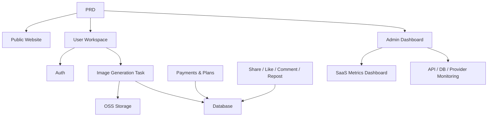

# Современный SaaS для генерации изображений ИИ

## Обзор

В этом проекте вам нужно с нуля создать SaaS-продукт для генерации изображений ИИ в стиле Midjourney на основе реального PRD. Вы пройдёте весь процесс: анализ требований, декомпозиция проекта, итеративная разработка и интеграционное тестирование.

Это комплексный практический раздел Этапа 2. В предыдущих главах вы изучали отдельные навыки — дизайн фронтенда, бэкенд-API, базы данных, интеграцию платежей. Этот проект объединяет их в работающий прототип продукта.

## Предварительные требования

Перед началом этого проекта вы уже должны быть знакомы с:

- Дизайном фронтенд-страниц и библиотеками компонентов ([UI-дизайн](../../frontend/ui-design/), [Современные библиотеки компонентов](../../frontend/modern-component-library/))
- Проектированием и разработкой бэкенд-API ([Код API](../../backend/ai-interface-code/))
- Основами баз данных и Supabase ([От базы данных к Supabase](../../backend/database-supabase/))
- Интеграцией платежей ([Платёжная система Stripe](../../backend/stripe-payment/))
- Рабочим процессом Git и развёртыванием ([Git и GitHub](../../backend/git-workflow/), [Развёртывание веб-приложения](../../backend/zeabur-deployment/))

## Цели обучения

После завершения этого проекта вы сможете:

1. Читать и понимать реальный PRD, извлекая из него список задач для разработки
2. Разбивать модули на основе PRD и составлять пошаговый план
3. Использовать помощь ИИ для создания каркасов фронтенда и бэкенд-API
4. Проверять и итерировать каждый модуль
5. Выполнить сквозную интеграцию, доведя проект от «запускается локально» до «готов к сдаче»

## Обзор проекта

Вы создадите современную SaaS-платформу для генерации изображений ИИ с тремя подсистемами:

| Подсистема | Назначение |
|-----------|---------------|
| **Публичный сайт** | Описание продукта, тарифы, FAQ, конверсия регистраций |
| **Рабочее пространство пользователя** | Ввод промптов, генерация изображений, галерея, кредиты, тарифы, взаимодействие с сообществом |
| **Панель администратора** | Управление пользователями, управление задачами, управление платежами, модерация контента, метрики SaaS, мониторинг системы |

Бэкенд должен поддерживать: аутентификацию пользователей, задачи генерации изображений, объектное хранилище OSS, кредиты и оплату тарифов, социальное взаимодействие с изображениями и мониторинг операционных данных.

::: tip PRD
Документ с требованиями для этого проекта находится на GitHub: [Посмотреть PRD](https://github.com/datawhalechina/easy-vibe/blob/main/docs/ru-ru/stage-2/assignments/modern-landing-page/PRD.md)
:::

<div style="margin: 32px 0;">
  <ClientOnly>
    <StepBar :active="0" :items="[
      { title: 'Требования', description: 'Прочитайте PRD, извлеките страницы, модули, модели данных и объём' },
      { title: 'Каркас', description: 'Используйте ИИ для генерации трёх фронтенд-каркасов (www / app / admin)' },
      { title: 'Итерации', description: 'Добавляйте API, аутентификацию, платежи, мониторинг модуль за модулем' },
      { title: 'Запуск', description: 'Сквозное тестирование, развёртывание и подготовка демо' }
    ]" />
  </ClientOnly>
</div>

## Часть 1: Анализ требований

### 1.1 Прочитайте PRD

Откройте документ PRD и ответьте на эти ключевые вопросы:

- Сколько точек входа у системы? Какие страницы охватывает каждая из них?
- Какова основная функциональность каждой страницы?
- Какие модули и таблицы данных включает бэкенд?
- Каков объём MVP? Что входит в первую версию, а что нет?

::: warning
Если на приведённые выше вопросы нет чётких ответов, не начинайте писать код. Неясные требования — самая распространённая причина переделок.
:::

### 1.2 Подтвердите архитектуру системы

Спроектируйте общую архитектуру на основе PRD:



Мы рекомендуем нарисовать архитектурную диаграмму своими словами, чтобы убедиться, что ваше понимание полное.

## Часть 2: Каркас проекта

### 2.1 Сгенерируйте фронтенд-страницы

Используйте ИИ для генерации базовой структуры и тестовых данных для всех страниц. Цель здесь — выстроить информационную архитектуру и маршрутизацию — пока без реальной интеграции API.

Пример промпта:

```text
Based on the current PRD, help me generate a frontend scaffold for a modern AI image generation SaaS.

Requirements:
1. Three entry points: www, app, admin
2. www: homepage, pricing, FAQ
3. app: login, register, generation workspace, gallery, plans, credits, community, artwork detail, profile
4. admin: dashboard homepage, user management, task management, content management, plan management, payment orders, operations config, SaaS metrics, system monitoring
5. Only generate page structure with mock data, no real API integration
6. Style reference: Midjourney — clean, modern, product-like
```

### 2.2 Проверьте структуру страниц

После генерации каркаса проверьте каждый пункт:

- [ ] Маршруты трёх точек входа независимы (`/`, `/app`, `/admin`)
- [ ] Количество страниц соответствует PRD
- [ ] Каждая страница доступна и поддерживает навигацию
- [ ] Тестовые данные показывают базовые состояния UI (списки, пустые состояния, формы и т. д.)

## Часть 3: Итеративная разработка

### 3.1 Прогресс модуль за модулем

Поверх каркаса добавляйте функции модуль за модулем в таком порядке:

1. **Аутентификация**: регистрация, вход, разделение ролей
2. **База данных**: создание таблиц, API чтения/записи
3. **Основная бизнес-логика**: задачи генерации изображений, хранение результатов
4. **Хранилище OSS**: загрузка и доступ к изображениям
5. **Платежи**: тарифы, кредиты, интеграция Stripe
6. **Социальное взаимодействие**: публикации, лайки, комментарии
7. **Панель администратора**: управление пользователями, управление задачами, модерация контента
8. **Мониторинг данных**: дашборд метрик SaaS, мониторинг системы

После каждого модуля используйте эту таблицу самопроверки:

| Пункт проверки | Метод проверки |
|------------|---------------------|
| Согласованность страниц | Соответствуют ли количество страниц, точки входа и функции PRD? |
| Корректность API | Разумны ли параметры запроса, структура ответа и обработка статусов? |
| Изоляция доступа | Правильно ли разделены обычные пользователи и администраторы? |
| Согласованность данных | Согласуются ли данные базы данных, OSS, платежей и кредитов? |
| Готовность к демо | Можете ли вы продемонстрировать полный бизнес-процесс другому человеку? |

::: tip
Если сгенерированный ИИ контент отклоняется от PRD, не выбрасывайте всю страницу — просто попросите исправить конкретный модуль.
:::

### 3.2 Роли и обязанности

Во время итераций вам нужно играть три роли одновременно:

- **Продакт-менеджер**: подтверждает, что функции каждого модуля соответствуют PRD
- **Технический лидер**: подтверждает, что подход к реализации разумен
- **QA-инженер**: подтверждает, что функции действительно работают

## Часть 4: Интеграция и запуск

### 4.1 Сквозное тестирование

Основное внимание на этом этапе — не добавление новых страниц, а прогон полных бизнес-процессов. Как минимум проверьте:

- Регистрация → Покупка кредитов → Генерация изображения → Просмотр истории → Публикация и взаимодействие
- Вход администратора → Просмотр данных пользователей → Просмотр статистики задач → Просмотр мониторинга системы

### 4.2 Развёртывание

Разверните проект в публичной среде, убедившись, что:

- Переменные окружения полностью настроены
- URL-адреса колбэков входа корректны
- URL-адреса колбэков платежей корректны
- На страницах нет отсутствующих состояний загрузки, пустых состояний или сообщений об ошибках

Инструкции по развёртыванию см.: [Рабочий процесс Git и GitHub](../../backend/git-workflow/), [Развёртывание веб-приложения](../../backend/zeabur-deployment/).

## Что нужно сдать

После завершения этого проекта сдайте следующее:

- [ ] Доступную ссылку на работающее демо
- [ ] Ссылку на репозиторий с исходным кодом (с README)
- [ ] Документ PRD
- [ ] Скриншоты основных страниц (главная, рабочее пространство генерации, галерея, страница тарифов, панель администратора)
- [ ] 60-секундное демо-видео (охватывающее регистрацию → генерацию → просмотр → администрирование)

README должен включать как минимум: обзор проекта, описание основных страниц, технологический стек, шаги локальной установки и список переменных окружения.

## Критерии оценки

| Параметр | Базовые требования | Продвинутые требования |
|------------|-------------------|----------------------|
| Соответствие PRD | Страницы, функции и структуры данных в целом соответствуют PRD | Можно чётко объяснить соответствие каждого дизайн-решения PRD |
| Продуктовый цикл | Регистрация → Покупка кредитов → Генерация изображения → Просмотр истории → Публикация работают сквозно | Данные о статусе платежей, балансе кредитов и количестве генераций согласованы |
| Возможности администрирования | Управление пользователями, задачами, платежами и контентом доступно для просмотра | Дашборд метрик SaaS и страница мониторинга системы полностью функциональны |
| Инженерная полнота | Фронтенд, бэкенд, база данных, OSS, платёжный пайплайн соединены | Есть обработка ошибок, пустые состояния и состояния загрузки |
| Качество сдачи | Развёртываемо и запускаемо | README понятный, демо-видео хорошо структурировано |

## Справочные материалы

- [UI-дизайн](../../frontend/ui-design/)
- [Дизайн UI для нескольких продуктов](../../frontend/multi-product-ui/)
- [Улучшение интерфейса с помощью LLM и Skills](../../frontend/llm-skills-beautiful/)
- [От дизайн-прототипа к коду проекта](../../frontend/design-to-code/)
- [Современные библиотеки компонентов](../../frontend/modern-component-library/)
- [От базы данных к Supabase](../../backend/database-supabase/)
- [Код API с помощью LLM](../../backend/ai-interface-code/)
- [Рабочий процесс Git и GitHub](../../backend/git-workflow/)
- [Развёртывание веб-приложения](../../backend/zeabur-deployment/)
- [Интеграция платежей Stripe](../../backend/stripe-payment/)
