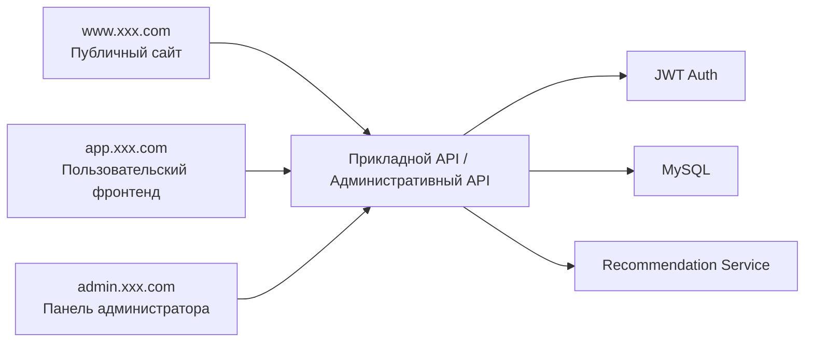
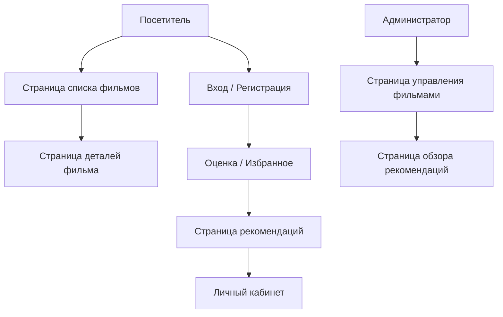

# PRD: система рекомендаций фильмов на Spring Boot

Статус: Draft v0.1  
Цель: определить минимально жизнеспособные границы проекта рекомендательной системы и распределение задач между фронтендом и бэкендом.

## 1. Позиционирование проекта

Это «киносайт с рекомендательными возможностями», а не просто страница с витриной. Он должен накапливать поведение пользователей и выдавать объяснимые рекомендации.

Определение в одну фразу:
Создать систему рекомендаций фильмов, включающую просмотр фильмов, оценки и избранное, результаты рекомендаций и административное управление.

Общий обзор системы:



## 1.0 Рекомендации по выбору технологий

- Фронтенд-фреймворк: `React` или `Vue`
- Бэкенд-фреймворк: `Spring Boot 3`
- База данных: `MySQL`
- Аутентификация: `JWT`
- Кэш: `Redis` (опционально)

Соглашение о точках входа сайта:

- Публичный сайт: `www.xxx.com`
- Пользовательский фронтенд: `app.xxx.com`
- Панель администратора: `admin.xxx.com`

## 1.1 Референсы конкурентов (официальные)

- [Letterboxd](https://letterboxd.com/)
- [IMDb](https://www.imdb.com/)

## 1.2 Что заимствуем у продуктов

При проектировании этого продукта рекомендуется опираться на подходы реальных кинопродуктов:

- Заимствуйте у `Letterboxd` сообщество-ориентированный опыт просмотра фильмов: карточки фильмов, оценки, избранное и личные записи должны естественно складываться в единую цепочку
- Заимствуйте у `IMDb` организацию информации на странице деталей: постер, описание, теги, оценка, актёры и связанный контент представлены многоуровнево
- Страница рекомендаций не может быть просто списком — она должна одновременно показывать причину рекомендации
- Личный кабинет должен подчёркивать «мои оценки / моё избранное / мои предпочтения для рекомендаций»
- Административное управление должно походить на контент-панель, а не на простую CRUD-страницу

## 1.3 Разбор страниц конкурентов

Рекомендуемая для изучения структура страниц конкурентов:

- Главная и личная страницы `Letterboxd`
  - Обратите внимание: способ организации просмотра фильмов, записей оценок, избранного и личных предпочтений
- Страница деталей фильма `IMDb`
  - Обратите внимание: иерархия постера, описания, тегов, оценки, актёров и связанного контента
- Рейтинги и блоки рекомендуемого контента у `IMDb`
  - Обратите внимание: карточное представление и дизайн пути просмотра

Поэтому для этого проекта рекомендуется:

- Страница списка больше похожа на страницу просмотра контента
- Страница деталей больше похожа на страницу деталей контента
- Страница рекомендаций больше похожа на «рекомендуем для вас»
- Административная страница больше похожа на контент-панель эксплуатации

## 2. Целевые пользователи и ключевые цели

Целевые пользователи:

- Обычные пользователи, просматривающие и фильтрующие фильмы
- Зарегистрированные пользователи, готовые улучшать рекомендации через оценки и избранное
- Администраторы, поддерживающие информацию о фильмах и качество рекомендаций

Ключевые цели:

- Пользователь может замкнуть цикл просмотра, оценки и добавления в избранное
- Система может выдавать результаты рекомендаций TopN
- Результаты рекомендаций должны обладать базовой объяснимостью

## 3. Объём MVP

Первая версия обязательно включает:

- Регистрацию/вход
- Список фильмов и детали
- Поиск, категории, постраничную навигацию
- Оценки пользователя
- Избранное
- Страницу рекомендаций
- Ведение данных о фильмах в админке

Первая версия не делает:

- Сложные алгоритмы коллаборативной фильтрации
- Воспроизведение видео
- Сообщество с комментариями
- Многомерную систему профилей
- Потоковые вычисления рекомендаций в реальном времени

## 4. Роли и права

| Роль | Права |
|------|------|
| Гость | Просмотр списка фильмов и деталей |
| Зарегистрированный пользователь | Оценки, избранное, просмотр рекомендаций |
| Администратор | Управление данными о фильмах, просмотр обзора рекомендаций |

## 5. Реализация фронтенда

## 5.1 Обзор архитектуры страниц

В текущем PRD определены `3 точки входа, 9 крупных страниц`:

- Публичный сайт — `1` крупная страница
- Пользовательский фронтенд — `5` крупных страниц
- Панель администратора — `3` крупные страницы

### A. Публичный сайт `www.xxx.com`

#### 1. Главная страница сайта `www:/`

Ключевые функции:

- Описание продукта
- Популярные фильмы
- Точка входа в регистрацию

### B. Пользовательский фронтенд `app.xxx.com`

#### 2. Страница входа `app:/login`

Ключевые функции:

- Вход
- Точка входа в регистрацию

#### 3. Страница списка фильмов `app:/movies`

Ключевые функции:

- Просмотр фильмов
- Поиск и фильтрация
- Постраничная навигация

#### 4. Страница деталей фильма `app:/movies/:id`

Ключевые функции:

- Просмотр постера и описания
- Оценка
- Добавление в избранное
- Просмотр тегов и причины рекомендации

#### 5. Страница рекомендаций `app:/recommendations`

Ключевые функции:

- Просмотр персональных рекомендаций
- Просмотр причины рекомендации

#### 6. Личный кабинет `app:/me`

Ключевые функции:

- Просмотр истории оценок
- Просмотр избранного
- Просмотр личных предпочтений

### C. Панель администратора `admin.xxx.com`

#### 7. Главная страница админки `admin:/`

Ключевые функции:

- Общее число фильмов
- Обзор поведения пользователей
- Обзор эффективности рекомендаций

#### 8. Страница управления фильмами `admin:/movies`

Ключевые функции:

- Добавление фильма
- Редактирование фильма
- Управление тегами

#### 9. Страница обзора рекомендаций `admin:/recommendations`

Ключевые функции:

- Просмотр результатов рекомендаций
- Просмотр популярных тегов
- Просмотр статистики поведения пользователей

## 5.2 Ключевые пользовательские сценарии



Ключевые потоки состояний:

- Пользователь: гость -> зарегистрированный пользователь
- Взаимодействие с фильмом: не оценён -> оценён
- Рекомендации: холодный старт -> рекомендации с учётом предпочтений

Рекомендуемый стек технологий:

- React или Vue
- TypeScript
- Ant Design / shadcn/ui

Рекомендуемые страницы:

| Страница | Путь | Описание |
|------|------|------|
| Главная страница | `/` | Популярные фильмы, точка входа в рекомендации |
| Страница списка фильмов | `/movies` | Поиск, фильтрация, постраничная навигация |
| Страница деталей фильма | `/movies/:id` | Описание, теги, оценка, избранное |
| Страница рекомендаций | `/recommendations` | Список персональных рекомендаций |
| Личный кабинет | `/me` | История оценок и избранного |
| Панель администратора | `/admin/movies` | Ведение фильмов |

Ключевые компоненты фронтенда:

- Карточка фильма
- Панель поиска и фильтрации
- Компонент оценки
- Кнопка избранного
- Карточка показа причины рекомендации
- Таблица в админке и модальное окно редактирования

## 6. Реализация бэкенда

Рекомендуемый стек технологий:

- Java 17
- Spring Boot 3
- Spring Web
- Spring Data JPA
- MySQL 8
- Аутентификация JWT

Модули бэкенда:

- `auth`
- `movies`
- `ratings`
- `favorites`
- `recommendations`
- `admin`

Рекомендуемые таблицы данных:

```sql
users (
  id bigint primary key auto_increment,
  email varchar(120),
  password_hash varchar(255),
  role varchar(20),
  created_at datetime
)

movies (
  id bigint primary key auto_increment,
  title varchar(200),
  summary text,
  release_year int,
  poster_url varchar(500),
  created_at datetime
)

movie_tags (
  id bigint primary key auto_increment,
  movie_id bigint,
  tag varchar(50)
)

ratings (
  id bigint primary key auto_increment,
  user_id bigint,
  movie_id bigint,
  score int,
  created_at datetime
)

favorites (
  id bigint primary key auto_increment,
  user_id bigint,
  movie_id bigint,
  created_at datetime
)

recommendation_logs (
  id bigint primary key auto_increment,
  user_id bigint,
  strategy varchar(50),
  result_count int,
  created_at datetime
)
```

## 6.1 Метрики и мониторинг админки

В админке рекомендуется отслеживать как минимум эти метрики:

- Общее число фильмов
- Число оценок в день
- Доля добавлений в избранное
- Кликабельность рекомендаций
- Распределение популярных тегов
- Доля пользователей с холодным стартом

Рекомендации по базовому мониторингу:

- Время ответа интерфейса рекомендаций
- Доля успешной записи оценок
- Медленные запросы к базе данных
- Доля попаданий в кэш (если используется Redis)

## 7. Стратегия рекомендаций

Рекомендуемая стратегия для первой версии:

- На основе предпочтений по тегам
- С учётом весов оценок пользователя
- При холодном старте добавлять популярные фильмы
- Фильтровать уже оценённые/добавленные в избранное фильмы

Результаты рекомендаций должны показывать:

- Оценку рекомендации
- Причину рекомендации
- Соответствующие теги

## 8. Черновик API

| Метод | Путь | Описание |
|------|------|------|
| `POST` | `/api/auth/register` | Регистрация |
| `POST` | `/api/auth/login` | Вход |
| `GET` | `/api/movies` | Список фильмов с поддержкой поиска и постраничной навигации |
| `GET` | `/api/movies/:id` | Детали фильма |
| `POST` | `/api/movies/:id/ratings` | Отправка оценки |
| `POST` | `/api/movies/:id/favorite` | Добавление фильма в избранное |
| `DELETE` | `/api/movies/:id/favorite` | Удаление из избранного |
| `GET` | `/api/recommendations` | Получение результатов рекомендаций |
| `GET` | `/api/me/profile` | Получение данных пользователя и сводки поведения |
| `POST` | `/api/admin/movies` | Добавление фильма |
| `PATCH` | `/api/admin/movies/:id` | Редактирование фильма |

Пример ответа `GET /api/recommendations`:

```json
{
  "items": [
    {
      "movieId": 12,
      "title": "Interstellar",
      "score": 0.91,
      "reason": "В последнее время вы ставили высокие оценки многим фильмам с тегами фантастики и приключений"
    }
  ]
}
```

## 9. Ключевые бизнес-правила

- Для каждого пользователя сохраняется только одна оценка по одному фильму
- И избранное, и оценки могут влиять на рекомендации
- Административные интерфейсы должны иметь отдельную проверку прав
- Результаты рекомендаций возвращают как минимум 10 записей или текущее доступное максимальное значение

## 10. Нефункциональные требования

- Результаты рекомендаций должны быть объяснимыми
- Загрузка страниц списка и деталей должна быть приемлемой
- Права административных и пользовательских интерфейсов строго разделены
- Кэш рекомендаций и данные о поведении должны допускать дальнейшее расширение

## 11. Рекомендуемый порядок разработки

1. Вход и система пользователей
2. Список фильмов и детали
3. Оценки и избранное
4. Интерфейс рекомендаций
5. Страницы административного управления

## 12. Пункты для уточнения

- Выбрать для фронтенда React или Vue
- Собирать ли текст объяснения рекомендации на бэкенде или рендерить на фронтенде
- Нужен ли скрипт импорта фильмов
- Должно ли административное управление включать управление тегами
