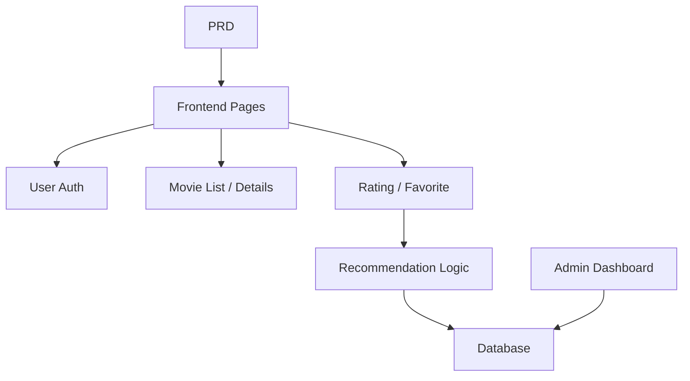

# Система рекомендаций фильмов на Spring Boot

## Обзор

В этом проекте вам нужно создать сайт о фильмах с возможностями рекомендаций, используя Spring Boot, на основе реального PRD. Основная сложность здесь — не простой CRUD, а размышление о том, «как поведение пользователя влияет на рекомендации» и «как сделать рекомендации объяснимыми».

Это комплексный практический раздел Этапа 2. Вы впервые столкнётесь с паттерном разработки продукта «контент + поведение + рекомендации», который распространён в электронной коммерции, контентных платформах и персонализированных лентах.

## Предварительные требования

Перед началом этого проекта вы уже должны быть знакомы с:

- Дизайном фронтенд-страниц и библиотеками компонентов ([UI-дизайн](../../frontend/ui-design/), [Современные библиотеки компонентов](../../frontend/modern-component-library/))
- Проектированием и разработкой бэкенд-API ([Код API](../../backend/ai-interface-code/))
- Основами баз данных и Supabase ([От базы данных к Supabase](../../backend/database-supabase/))
- Рабочим процессом Git и развёртыванием ([Git и GitHub](../../backend/git-workflow/), [Развёртывание веб-приложения](../../backend/zeabur-deployment/))

## Цели обучения

После завершения этого проекта вы сможете:

1. Читать PRD и извлекать список задач для разработки системы рекомендаций
2. Настроить проект на Spring Boot и реализовать RESTful API
3. Спроектировать полный конвейер данных от «поведения пользователя → рекомендации»
4. Реализовать объяснимую логику рекомендаций
5. Выполнить сквозную интеграцию и сдать готовый к демонстрации прототип продукта

## Обзор проекта

Вы создадите сайт о фильмах с возможностями рекомендаций:

| Функция | Описание |
|---------|-------------|
| **Просмотр и поиск** | Пользователи могут просматривать и искать фильмы |
| **Оценки и избранное** | Пользователи могут оценивать фильмы и добавлять их в избранное |
| **Персонализированные рекомендации** | Система генерирует рекомендации на основе поведения пользователя |
| **Панель администратора** | Администраторы управляют данными о фильмах и просматривают эффективность рекомендаций |

::: tip PRD
Документ с требованиями для этого проекта находится на GitHub: [Посмотреть PRD](https://github.com/datawhalechina/easy-vibe/blob/main/docs/ru-ru/stage-2/assignments/movie-recommendation-springboot/PRD.md)
:::

<div style="margin: 32px 0;">
  <ClientOnly>
    <StepBar :active="0" :items="[
      { title: 'Требования', description: 'Прочитайте PRD, определите стратегию рекомендаций, поведенческие данные и объём администрирования' },
      { title: 'Каркас', description: 'Используйте ИИ для генерации страниц списка, деталей, рекомендаций и администрирования' },
      { title: 'Итерации', description: 'Добавляйте логику рекомендаций, отслеживание поведения и администрирование' },
      { title: 'Запуск', description: 'Сквозное тестирование, развёртывание и подготовка демо' }
    ]" />
  </ClientOnly>
</div>

## Часть 1: Анализ требований

### 1.1 Прочитайте PRD

Откройте документ PRD и ответьте на эти ключевые вопросы:

- Какова стратегия рекомендаций? Должна ли первая версия использовать объяснимый подход (например, схожесть на основе оценок)?
- Какие поведенческие данные пользователя нужно хранить? (оценки, избранное, история просмотров и т. д.)
- Какие метрики эффективности рекомендаций должны видеть администраторы?
- Полон ли список страниц?

::: warning
Если на приведённые выше вопросы нет чётких ответов, не начинайте писать код. Неясные требования — самая распространённая причина переделок.
:::

### 1.2 Подтвердите архитектуру системы



## Часть 2: Каркас проекта

### 2.1 Сгенерируйте фронтенд-страницы

Пример промпта:

```text
Based on the current PRD, help me generate a frontend scaffold for a Spring Boot movie recommendation system.

Requirements:
1. Pages: homepage, movie list, movie detail, recommendation page, user profile, admin dashboard
2. Only generate page structure with mock data first, no real API integration
3. Style should look like a real content product, not a classroom demo
```

### 2.2 Проверьте структуру страниц

Проверьте каждый пункт:

- [ ] Страница списка фильмов поддерживает поиск и фильтрацию
- [ ] Страница деталей фильма включает кнопки оценки и добавления в избранное
- [ ] Страница рекомендаций показывает результаты с причинами рекомендаций
- [ ] Панель администратора отображает данные о фильмах и эффективность рекомендаций

## Часть 3: Итеративная разработка

### 3.1 Прогресс модуль за модулем

1. **Настройка Spring Boot**: структура проекта, конфигурация базы данных, базовый CRUD
2. **Управление данными о фильмах**: API списка фильмов, деталей, поиска
3. **Поведение пользователя**: API оценки, избранного, хранение поведенческих данных
4. **Логика рекомендаций**: реализация алгоритма рекомендаций на основе поведения пользователя
5. **Отображение рекомендаций**: показ результатов рекомендаций с объяснениями
6. **Панель администратора**: управление данными о фильмах, обзор эффективности рекомендаций

### 3.2 Самопроверка модулей

| Пункт проверки | Метод проверки |
|------------|---------------------|
| Базовые функции | Образуют ли список, детали, оценка, избранное замкнутый цикл? |
| Связь рекомендаций | Влияет ли поведение пользователя на результаты рекомендаций? |
| Объяснимость | Могут ли пользователи понять, почему были рекомендованы эти фильмы? |
| Данные администратора | Могут ли администраторы просматривать данные о фильмах и эффективность рекомендаций? |

## Часть 4: Интеграция и запуск

### 4.1 Сквозное тестирование

Как минимум проверьте следующие сценарии:

- Просмотр фильмов → Оценка → Добавление в избранное → Просмотр страницы рекомендаций, убедитесь, что результаты меняются
- Вход администратора → Добавление фильма → Просмотр статистики эффективности рекомендаций

## Что нужно сдать

После завершения этого проекта сдайте следующее:

- [ ] Доступную ссылку на работающее демо
- [ ] Ссылку на репозиторий с исходным кодом (с README)
- [ ] Документ PRD
- [ ] Скриншоты основных страниц (список фильмов, детали фильма, страница рекомендаций, панель администратора)
- [ ] 60-секундное демо-видео

## Критерии оценки

| Параметр | Базовые требования | Продвинутые требования |
|------------|-------------------|----------------------|
| Соответствие PRD | Страницы, функции и структуры данных в целом соответствуют PRD | Можно чётко объяснить дизайн-решения |
| Продуктовый цикл | Просмотр → Оценка → Избранное → Рекомендации работают сквозно | Поведение при оценке заметно влияет на рекомендации |
| Качество рекомендаций | Результаты разумны, причины объяснимы | Поддерживаются несколько стратегий рекомендаций |
| Возможности администрирования | Данные о фильмах и эффективность рекомендаций доступны для просмотра | Есть метрики вроде точности рекомендаций |
| Инженерная полнота | Фронтенд, бэкенд на Spring Boot, конвейер базы данных соединены | API рекомендаций имеет кэширование или оптимизацию производительности |

## Справочные материалы

- [UI-дизайн](../../frontend/ui-design/)
- [Современные библиотеки компонентов](../../frontend/modern-component-library/)
- [От базы данных к Supabase](../../backend/database-supabase/)
- [Код API с помощью LLM](../../backend/ai-interface-code/)
- [Рабочий процесс Git и GitHub](../../backend/git-workflow/)
- [Развёртывание веб-приложения](../../backend/zeabur-deployment/)
