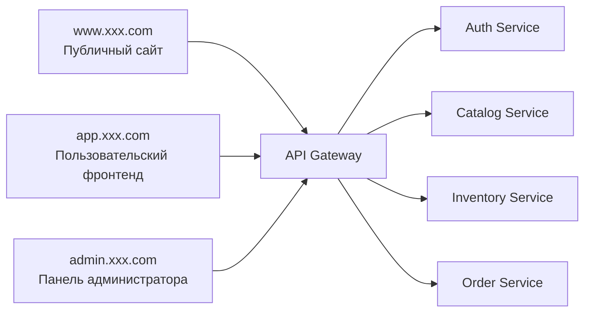
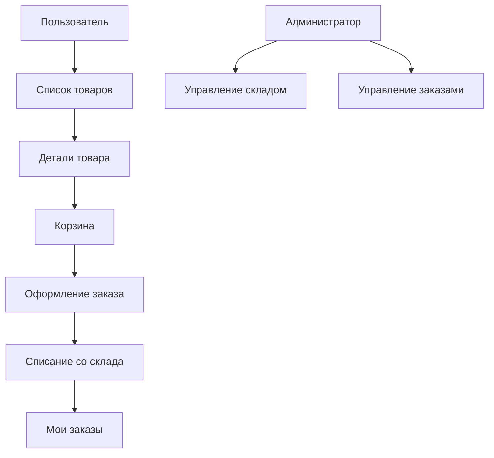

# PRD: микросервисная система электронной коммерции для свежих продуктов

Статус: Draft v0.1  
Цель: сначала чётко определить разбиение на сервисы, границы данных и основную транзакционную цепочку, а затем переходить к разработке.

## 1. Позиционирование проекта

Это система электронной коммерции для отработки разбиения на микросервисы и взаимодействия сервисов. Акцент не на сложных операционных функциях, а на том, чтобы пройти следующую цепочку:

- Просмотр товаров
- Оформление заказа
- Списание со склада
- Просмотр заказа
- Управление складом из админки

Определение в одну фразу:
Создать микросервисную систему электронной коммерции для свежих продуктов, в которой шлюз, аутентификация, товары, склад и заказы совместно замыкают транзакционный цикл.

Общий обзор системы:



## 1.0 Рекомендации по выбору технологий

- Фронтенд-фреймворк: `Next.js`
- Шлюз: `Node.js + Express/Fastify`
- Слой сервисов: `Node.js + Express/Fastify`
- База данных: `PostgreSQL`
- Аутентификация: `JWT`
- Оркестрация: `Docker Compose`

Соглашение о точках входа сайта:

- Публичный сайт: `www.xxx.com`
- Пользовательский фронтенд: `app.xxx.com`
- Панель администратора: `admin.xxx.com`

## 1.1 Референсы конкурентов (официальные)

- [Instacart](https://www.instacart.com/)

## 1.2 Что заимствуем у продуктов

При проектировании этого продукта рекомендуется опираться на реальные продукты для электронной коммерции свежих продуктов:

- Заимствуйте у `Instacart` пользовательский путь покупок: от просмотра товаров до корзины и просмотра заказа всё должно быть достаточно прямым
- Страница товара и страница корзины должны подчёркивать цену, статус наличия и обратную связь по действиям
- Административные страницы должны больше походить на операционную панель, выделяя управление товарами, складом и статусом заказов
- Страницы фронтенда не нужно делать очень сложными, но обязательно сделать «цепочку оформления заказа» удобной
- Разбиение на микросервисы служит границам бизнеса, но опыт фронтенда должен быть максимально похож на единый продукт, а не на склейку нескольких интерфейсов

## 1.3 Разбор страниц конкурентов

Рекомендуемая для изучения структура страниц конкурентов:

- Главная страница и страница категорий товаров `Instacart`
  - Обратите внимание: насколько понятны категории, карточки товаров и точка входа в покупки
- Опыт корзины и оформления у `Instacart`
  - Обратите внимание: насколько плавен путь от товара к оформлению заказа
- Типичные подходы к управлению товарами/заказами в e-commerce-панелях
  - Обратите внимание: базовые операционные действия — список, фильтрация по статусу, корректировка склада

Поэтому для этого проекта рекомендуется:

- Клиентская часть больше подчёркивает «быстрое оформление заказа»
- Административная часть больше подчёркивает «управление статусами»
- Микросервисная архитектура скрыта в бэкенде, опыт фронтенда всё равно должен быть единым

## 2. Целевые пользователи и ключевые цели

Целевые пользователи:

- Обычные пользователи, просматривающие товары и оформляющие заказы
- Администраторы, управляющие товарами и складом

Ключевые цели:

- Цепочка оформления заказа пользователем полная и отслеживаемая
- Статусы склада и заказов согласованы
- Границы каждого сервиса чёткие, и его можно обслуживать независимо

## 3. Объём MVP

Первая версия обязательно включает:

- API Gateway
- Сервис Auth
- Сервис Catalog
- Сервис Inventory
- Сервис Order
- Список товаров/детали/оформление заказа на стороне пользователя
- Управление товарами и складом в админке

Первая версия не делает:

- Реальную оплату
- Купоны и промоакции
- Флэш-распродажи
- Кластер очередей сообщений
- Фреймворк распределённых транзакций

## 4. Роли и права

| Роль | Права |
|------|------|
| Обычный пользователь | Просмотр товаров, оформление заказа, просмотр своих заказов |
| Администратор | Публикация/снятие товаров, корректировка склада, просмотр заказов |

## 5. Реализация фронтенда

## 5.1 Обзор архитектуры страниц

В текущем PRD определены `3 точки входа, 9 крупных страниц`:

- Публичный сайт — `1` крупная страница
- Пользовательский фронтенд — `4` крупные страницы
- Панель администратора — `4` крупные страницы

### A. Публичный сайт `www.xxx.com`

#### 1. Главная страница сайта `www:/`

Ключевые функции:

- Точка входа в категории
- Зона акций
- Точка входа в систему

### B. Пользовательский фронтенд `app.xxx.com`

#### 2. Страница списка товаров `app:/products`

Ключевые функции:

- Просмотр категорий
- Просмотр карточек товаров
- Добавление в корзину

#### 3. Страница деталей товара `app:/products/:id`

Ключевые функции:

- Просмотр деталей товара
- Просмотр статуса наличия
- Добавление в корзину

#### 4. Страница корзины `app:/cart`

Ключевые функции:

- Просмотр корзины
- Изменение количества
- Оформление заказа

#### 5. Страница заказов `app:/orders`

Ключевые функции:

- Просмотр моих заказов
- Просмотр статуса заказа

### C. Панель администратора `admin.xxx.com`

#### 6. Главная страница админки `admin:/`

Ключевые функции:

- Число товаров
- Предупреждения о складе
- Обзор заказов

#### 7. Страница управления товарами `admin:/products`

Ключевые функции:

- Публикация/снятие товаров
- Редактирование цены и категории

#### 8. Страница управления складом `admin:/inventory`

Ключевые функции:

- Просмотр склада
- Корректировка склада

#### 9. Страница управления заказами `admin:/orders`

Ключевые функции:

- Просмотр заказов
- Фильтрация по статусу

## 5.2 Ключевые пользовательские сценарии



Ключевые потоки состояний:

- Заказ: ожидает создания -> создан -> завершён / отменён
- Склад: доступен -> зарезервирован -> подтверждённое списание / откат

Рекомендуемый стек технологий:

- Next.js
- TypeScript
- Tailwind CSS

Рекомендуемые страницы:

| Страница | Путь | Описание |
|------|------|------|
| Главная страница | `/` | Список и категории товаров |
| Детали товара | `/products/:id` | Информация о товаре и добавление в корзину |
| Корзина | `/cart` | Подтверждение заказа |
| Мои заказы | `/orders` | Просмотр истории заказов |
| Страница товаров в админке | `/admin/products` | Ведение товаров |
| Страница склада в админке | `/admin/inventory` | Корректировка склада |
| Страница заказов в админке | `/admin/orders` | Список заказов и статусы |

Ключевые компоненты фронтенда:

- Карточка товара
- Выдвижная панель/страница корзины
- Метка статуса заказа
- Таблица в админке
- Модальное окно корректировки склада

## 6. Реализация бэкенда

Рекомендуемый стек технологий:

- Node.js + Express/Fastify
- PostgreSQL
- Docker Compose

Разбиение на сервисы:

| Сервис | Зона ответственности |
|------|------|
| `api-gateway` | Единая маршрутизация, аутентификация, агрегация ответов |
| `auth-service` | Регистрация, вход, проверка JWT |
| `catalog-service` | Информация о товарах, категории, публикация/снятие |
| `inventory-service` | Запрос склада, резервирование, откат |
| `order-service` | Создание заказа, переходы статусов, запрос |

Рекомендуемая модель данных:

```sql
users (
  id uuid primary key,
  email text,
  password_hash text,
  role text,
  created_at timestamptz
)

products (
  id uuid primary key,
  name text,
  category text,
  price_cents int,
  status text,
  created_at timestamptz
)

inventory_items (
  id uuid primary key,
  product_id uuid,
  available_quantity int,
  reserved_quantity int,
  updated_at timestamptz
)

orders (
  id uuid primary key,
  user_id uuid,
  total_amount_cents int,
  status text,
  created_at timestamptz
)

order_items (
  id uuid primary key,
  order_id uuid,
  product_id uuid,
  quantity int,
  price_cents int
)
```

## 6.1 Метрики и мониторинг админки

В админке рекомендуется отслеживать как минимум эти метрики:

- Доля успешного оформления заказов
- Число откатов склада
- Рейтинг хорошо продаваемых товаров
- Распределение статусов заказов
- Число предупреждений о складе

Рекомендации по базовому мониторингу:

- Доля ошибок шлюза
- Доля успешных запросов сервиса аутентификации
- Доля таймаутов сервиса склада
- Доля неудачных созданий заказов

## 7. Основная цепочка оформления заказа

Основной процесс:

1. Пользователь оформляет заказ
2. Gateway выполняет аутентификацию
3. Сервис Order проверяет товары
4. Сервис Inventory резервирует склад
5. Сервис Order создаёт заказ
6. При успехе склад подтверждается, при неудаче выполняется компенсирующий откат

Ключевые правила:

- При недостатке склада сразу неудача
- Один заказ может быть успешно создан только один раз
- Все изменения состояний должны быть отслеживаемыми

## 8. Черновик API

Внешние интерфейсы идут единообразно через Gateway:

| Метод | Путь | Описание |
|------|------|------|
| `POST` | `/api/auth/register` | Регистрация |
| `POST` | `/api/auth/login` | Вход |
| `GET` | `/api/catalog/products` | Список товаров |
| `GET` | `/api/catalog/products/:id` | Детали товара |
| `POST` | `/api/orders` | Создание заказа |
| `GET` | `/api/orders/my` | Список заказов текущего пользователя |
| `GET` | `/api/orders/:id` | Детали заказа |
| `PATCH` | `/api/inventory/:productId` | Корректировка склада администратором |
| `POST` | `/api/admin/products` | Добавление товара администратором |
| `PATCH` | `/api/admin/products/:id` | Редактирование товара администратором |

Пример запроса `POST /api/orders`:

```json
{
  "items": [
    { "productId": "p1", "quantity": 2 },
    { "productId": "p2", "quantity": 1 }
  ]
}
```

## 9. Нефункциональные требования

- Локальный запуск в одну команду
- Логи между сервисами должны быть отслеживаемыми
- Единая структура ответов интерфейсов
- Ключевая цепочка имеет обработку ошибок и логику компенсации

## 10. Рекомендуемый порядок разработки

1. Monorepo/Workspaces и Gateway
2. Сервис Auth
3. Catalog и Inventory
4. Замкнутый цикл оформления заказа в Order
5. Клиентская и административная части фронтенда
6. Docker Compose и документация

## 11. Пункты для уточнения

- Делать ли на фронтенде сохранение корзины
- Использовать ли для связи между сервисами сначала HTTP или заложить механизм сообщений
- Разделять ли товары и склад на отдельные базы данных
- Разрешать ли в админке напрямую менять статус заказа
