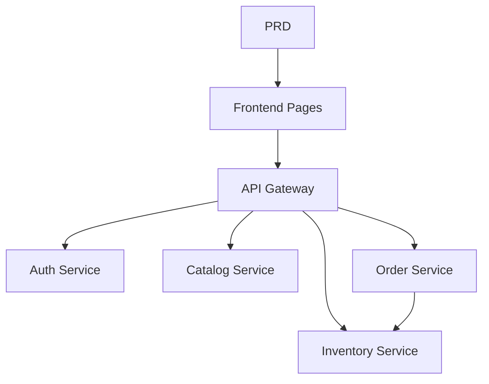

# Микросервисная система продуктового интернет-магазина

## Обзор

В этом проекте вам нужно с нуля создать микросервисную систему продуктового интернет-магазина на основе реального PRD. В отличие от предыдущих проектов с одним сервисом, здесь бэкенд разделён на несколько независимых сервисов по бизнес-доменам, объединённых через API-шлюз. Вы научитесь проектировать границы сервисов и обрабатывать согласованность данных между сервисами.

Это комплексный практический раздел Этапа 2. Микросервисная архитектура очень распространена в реальных приложениях. Поняв декомпозицию сервисов и маршрутизацию через шлюз, вы сможете справляться с более сложным проектированием бэкенд-систем.

## Предварительные требования

Перед началом этого проекта вы уже должны быть знакомы с:

- Дизайном фронтенд-страниц и библиотеками компонентов ([UI-дизайн](../../frontend/ui-design/), [Современные библиотеки компонентов](../../frontend/modern-component-library/))
- Проектированием и разработкой бэкенд-API ([Код API](../../backend/ai-interface-code/))
- Основами баз данных и Supabase ([От базы данных к Supabase](../../backend/database-supabase/))
- Рабочим процессом Git и развёртыванием ([Git и GitHub](../../backend/git-workflow/), [Развёртывание веб-приложения](../../backend/zeabur-deployment/))

## Цели обучения

После завершения этого проекта вы сможете:

1. Читать PRD и извлекать список задач для разработки микросервисной системы
2. Декомпозировать границы сервисов по бизнес-доменам (аутентификация, каталог, склад, заказы)
3. Проектировать и реализовывать маршрутизацию через API-шлюз
4. Обрабатывать межсервисные задачи, такие как списание со склада и согласованность заказов
5. Выполнить сквозную интеграцию и сдать готовый к демонстрации прототип микросервисной системы

## Обзор проекта

Вы создадите микросервисную систему продуктового интернет-магазина:

| Подсистема | Назначение |
|-----------|---------------|
| **Пользовательский фронтенд** | Просмотр товаров, оформление заказов, просмотр истории заказов |
| **Портал администратора** | Управление товарами, управление складом, управление заказами |

Бэкенд разделён на следующие сервисы:

| Сервис | Назначение |
|---------|---------------|
| **API Gateway** | Единая точка входа, маршрутизация запросов, проверка аутентификации |
| **Auth Service** | Регистрация пользователей, вход, выдача JWT |
| **Catalog Service** | Управление информацией о товарах |
| **Inventory Service** | Управление количеством на складе |
| **Order Service** | Создание заказов, управление статусами |

::: tip PRD
Документ с требованиями для этого проекта находится на GitHub: [Посмотреть PRD](https://github.com/datawhalechina/easy-vibe/blob/main/docs/ru-ru/stage-2/assignments/simple-grocery-microservices/PRD.md)
:::

<div style="margin: 32px 0;">
  <ClientOnly>
    <StepBar :active="0" :items="[
      { title: 'Требования', description: 'Прочитайте PRD, определите декомпозицию сервисов, страницы и транзакционный процесс' },
      { title: 'Каркас', description: 'Сгенерируйте каркасы фронтенда, шлюза и сервисов' },
      { title: 'Итерации', description: 'Добавляйте API модуль за модулем, исправляйте согласованность склада и заказов' },
      { title: 'Запуск', description: 'Сквозное тестирование, развёртывание и подготовка демо' }
    ]" />
  </ClientOnly>
</div>

## Часть 1: Анализ требований

### 1.1 Прочитайте PRD

Откройте документ PRD и ответьте на эти ключевые вопросы:

- Как следует декомпозировать сервисы? Каковы границы ответственности каждого сервиса?
- Какие страницы нужны пользовательскому фронтенду и порталу администратора?
- Какова стратегия списания со склада после оформления заказа? Как обрабатывать успех / сбой / тайм-аут?
- Какие сложные возможности (распределённые транзакции, очереди сообщений) стоит пропустить в первой версии?

::: warning
Если на приведённые выше вопросы нет чётких ответов, не начинайте писать код. Неясные требования — самая распространённая причина переделок.
:::

### 1.2 Подтвердите архитектуру системы



## Часть 2: Каркас проекта

### 2.1 Сгенерируйте структуру проекта

Пример промпта:

```text
Based on the current PRD, help me generate a project scaffold for a grocery e-commerce microservices system.

Requirements:
1. Generate user frontend and admin portal skeletons
2. Generate five directories: api-gateway, auth-service, catalog-service, inventory-service, order-service
3. Each service should only have a minimal runnable entry point
4. Don't connect to a real database or payment system yet
```

### 2.2 Проверьте структуру проекта

Проверьте каждый пункт:

- [ ] Пять каталогов сервисов имеют чёткую структуру
- [ ] API Gateway запускается и пересылает запросы
- [ ] Эндпоинт проверки работоспособности каждого сервиса работает
- [ ] Страницы пользовательского фронтенда и портала администратора доступны

## Часть 3: Итеративная разработка

### 3.1 Прогресс модуль за модулем

1. **API Gateway**: конфигурация маршрутов, middleware проверки JWT
2. **Auth Service**: регистрация, вход, выдача JWT
3. **Catalog Service**: CRUD товаров, запросы списков
4. **Inventory Service**: запросы остатков, списание со склада
5. **Order Service**: создание заказов, переходы статусов, интеграция со складом
6. **Портал администратора**: управление товарами, управление складом, управление заказами

### 3.2 Самопроверка модулей

| Пункт проверки | Метод проверки |
|------------|---------------------|
| Маршрутизация шлюза | Правильно ли API сервисов пересылаются через шлюз? |
| Изоляция доступа | Правильно ли разделены API пользователя и администратора? |
| Согласованность данных | Синхронизированы ли данные о товарах и складе? |
| Транзакционный цикл | После оформления заказа согласованы ли списание со склада и статус заказа? |
| Обработка сбоев | Есть ли механизм компенсации при недостатке товара или тайм-ауте? |

## Часть 4: Интеграция и запуск

### 4.1 Сквозное тестирование

Как минимум проверьте следующие сценарии:

- Просмотр товаров → Добавление в корзину → Оформление заказа → Просмотр заказа
- Администратор → Добавление товара → Обновление склада → Просмотр заказов

## Что нужно сдать

После завершения этого проекта сдайте следующее:

- [ ] Доступную ссылку на работающее демо
- [ ] Ссылку на репозиторий с исходным кодом (с README)
- [ ] Документ PRD
- [ ] Скриншоты основных страниц (список товаров, страница заказа, история заказов, панель администратора)
- [ ] 60-секундное демо-видео

## Критерии оценки

| Параметр | Базовые требования | Продвинутые требования |
|------------|-------------------|----------------------|
| Соответствие PRD | Страницы, функции и декомпозиция сервисов в целом соответствуют PRD | Можно чётко объяснить логику декомпозиции сервисов |
| Продуктовый цикл | Просмотр → Заказ → Списание со склада → Просмотр заказа работают сквозно | Тайм-аут заказа или недостаток товара имеет механизм компенсации |
| Архитектура сервисов | Каждый сервис запускается независимо, доступен через шлюз | Межсервисное взаимодействие имеет обработку ошибок и повторные попытки |
| Возможности администрирования | Управление товарами, складом и заказами функционально | Портал администратора имеет статистику данных |
| Инженерная полнота | Фронтенд, шлюз, сервисы, конвейер базы данных соединены | Есть Docker Compose или аналогичная оркестрация |

## Справочные материалы

- [UI-дизайн](../../frontend/ui-design/)
- [Современные библиотеки компонентов](../../frontend/modern-component-library/)
- [От базы данных к Supabase](../../backend/database-supabase/)
- [Код API с помощью LLM](../../backend/ai-interface-code/)
- [Рабочий процесс Git и GitHub](../../backend/git-workflow/)
- [Развёртывание веб-приложения](../../backend/zeabur-deployment/)
