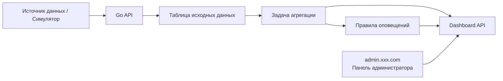
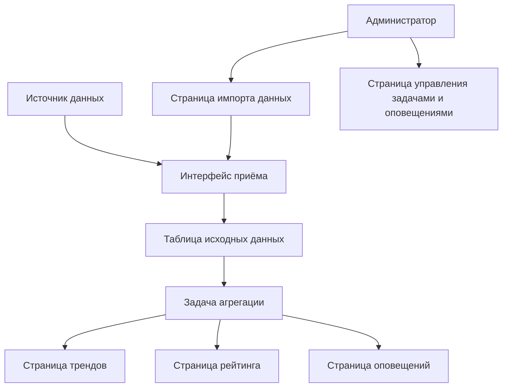

# PRD: платформа анализа и визуализации транспортных данных на Go

Статус: Draft v0.1  
Цель: сначала чётко определить методики подсчёта, модули и интерфейсы дата-продукта, а затем переходить к реализации.

## 1. Позиционирование проекта

Это полноценный проект «приём данных + агрегационный анализ + отображение на дашборде». Акцент на преобразовании исходных транспортных данных в читаемые результаты анализа и оповещения.

Определение в одну фразу:
Создать платформу анализа данных на Go с поддержкой приёма событий, оконной агрегации, обнаружения аномалий и отображения на большом экране.

Общий обзор системы:



## 1.0 Рекомендации по выбору технологий

- Бэкенд-фреймворк: `Go + Gin/Fiber`
- База данных: `PostgreSQL`
- Задачи агрегации: `robfig/cron`
- Фронтенд: `React / Next.js`
- Графики: `ECharts` или `AntV`

Соглашение о точках входа сайта:

- Аналитический дашборд: `app.xxx.com`
- Панель администратора: `admin.xxx.com`

## 1.1 Референсы конкурентов (официальные)

- [TomTom Traffic Index](https://www.tomtom.com/traffic-index/)

## 1.2 Что заимствуем у продуктов

При проектировании этого продукта рекомендуется опираться на реальные продукты анализа трафика:

- Заимствуйте у `TomTom Traffic Index` способ выражения метрик: тренды, степень загруженности, рейтинги городов/перекрёстков должны быть наглядными и читаемыми
- Главная страница дашборда должна в первую очередь показывать ключевые метрики и аномальную информацию, а не нагромождать множество графиков
- Страницы трендов, рейтингов и оповещений должны иметь чёткое разделение ролей
- Административная часть должна подчёркивать импорт данных, статус задач и обработку оповещений, а не только просмотр статичных графиков
- Общий дизайн должен больше походить на дата-продукт и операционный дашборд, а не на обычный список в админке

## 1.3 Разбор страниц конкурентов

Рекомендуемая для изучения структура страниц конкурентов:

- Страница обзора `TomTom Traffic Index`
  - Обратите внимание: как при помощи небольшого числа ключевых метрик быстро сформировать общее представление
- Выражение трендов и рейтингов у `TomTom Traffic Index`
  - Обратите внимание: как графики и рейтинги помогают пользователю быстро понять проблему
- Типичные страницы мониторинга в дата-продуктах
  - Обратите внимание: как разбиты на зоны оповещения, статус данных и статус задач

Поэтому для этого проекта рекомендуется:

- Страница обзора подчёркивает ключевые метрики
- Страница трендов подчёркивает изменения во времени
- Страница оповещений подчёркивает локализацию аномалий
- Административная часть подчёркивает импорт данных и состояние здоровья задач

## 2. Целевые пользователи и ключевые цели

Целевые пользователи:

- Аналитики, следящие за трендами трафика и состоянием загруженности
- Администраторы, просматривающие аномальные оповещения и результаты обработки

Ключевые цели:

- Исходные данные стабильно принимаются
- Агрегированные метрики доступны для запросов
- Оповещения видны и обрабатываемы
- Страницы визуализации пригодны для отчётов и демонстраций

## 3. Объём MVP

Первая версия обязательно включает:

- Интерфейс приёма данных
- Сохранение исходных данных в базу
- Запланированную задачу агрегации
- Правила обнаружения аномалий
- График трендов, топ перекрёстков, панель оповещений
- Импорт данных в админке или точку входа для симулированных данных

Первая версия не делает:

- Потоковую обработку уровня Kafka/Flink
- Сложный движок GIS-карт
- Модель прогнозирования на машинном обучении
- Мультиарендные права платформы

## 4. Роли и права

| Роль | Права |
|------|------|
| Аналитик | Просмотр дашборда, трендов, рейтингов |
| Администратор | Импорт данных, обработка оповещений, просмотр статуса задач |

## 5. Реализация фронтенда

## 5.1 Обзор архитектуры страниц

В текущем PRD определены `2 точки входа, 6 крупных страниц`:

- Пользовательский дашборд — `4` крупные страницы
- Панель администратора — `2` крупные страницы

### A. Аналитический дашборд `app.xxx.com`

#### 1. Страница обзора `app:/dashboard`

Ключевые функции:

- Общий поток транспорта
- Текущее число оповещений
- Самый загруженный перекрёсток

#### 2. Страница трендов `app:/dashboard/trend`

Ключевые функции:

- График трендов потока транспорта
- Переключение временного диапазона

#### 3. Страница рейтинга перекрёстков `app:/dashboard/intersections`

Ключевые функции:

- Рейтинг загруженности
- Метрики ключевых перекрёстков

#### 4. Страница оповещений `app:/alerts`

Ключевые функции:

- Просмотр оповещений
- Фильтрация по уровню
- Отметка статуса обработки

### B. Панель администратора `admin.xxx.com`

#### 5. Страница импорта данных `admin:/imports`

Ключевые функции:

- Импорт CSV
- Просмотр статуса задач импорта

#### 6. Страница управления задачами и оповещениями `admin:/operations`

Ключевые функции:

- Просмотр статуса задач агрегации
- Просмотр записей обработки оповещений

## 5.2 Ключевые пользовательские сценарии



Ключевые потоки состояний:

- Событие данных: успешно принято / не прошло проверку
- Задача агрегации: ожидает выполнения -> выполняется -> успех / неудача
- Оповещение: создано -> подтверждено -> обработано

Рекомендуемый стек технологий:

- React / Next.js
- ECharts / AntV
- TypeScript

Рекомендуемые страницы:

| Страница | Путь | Описание |
|------|------|------|
| Дашборд обзора | `/dashboard` | Поток за сегодня, индекс загруженности, число оповещений |
| Страница трендов | `/dashboard/trend` | График трендов по времени |
| Страница анализа перекрёстков | `/dashboard/intersections` | Рейтинг топ-перекрёстков |
| Страница оповещений | `/alerts` | Список оповещений и статус обработки |
| Страница управления данными | `/admin/imports` | Импорт данных, просмотр логов задач |

Ключевые компоненты фронтенда:

- Карточка метрики
- Линейный график/гистограмма
- Таблица рейтинга
- Список оповещений
- Фильтр временного диапазона

## 6. Реализация бэкенда

Рекомендуемый стек технологий:

- Go
- Gin или Fiber
- PostgreSQL
- robfig/cron

Модули бэкенда:

- `ingest`
- `aggregation`
- `alerts`
- `dashboard`
- `imports`
- `admin`

Рекомендуемые таблицы данных:

```sql
raw_traffic_events (
  id bigserial primary key,
  intersection_id text,
  event_time timestamptz,
  vehicle_count int,
  avg_speed numeric,
  source text,
  created_at timestamptz
)

traffic_agg_1m (
  id bigserial primary key,
  intersection_id text,
  window_start timestamptz,
  total_vehicles int,
  avg_speed numeric,
  congestion_index numeric
)

traffic_agg_5m (
  id bigserial primary key,
  intersection_id text,
  window_start timestamptz,
  total_vehicles int,
  avg_speed numeric,
  congestion_index numeric
)

alerts (
  id bigserial primary key,
  intersection_id text,
  level text,
  rule_code text,
  status text,
  message text,
  created_at timestamptz,
  resolved_at timestamptz
)

import_jobs (
  id bigserial primary key,
  filename text,
  status text,
  total_rows int,
  success_rows int,
  failed_rows int,
  created_at timestamptz
)
```

## 6.1 Метрики и мониторинг админки

В админке рекомендуется отслеживать как минимум эти метрики:

- Общее число принятых событий
- Доля успешных задач агрегации
- Общее число оповещений и доля обработки
- Рейтинг проблемных перекрёстков
- Доля успешных задач импорта

Рекомендации по базовому мониторингу:

- Доля ошибок интерфейса приёма
- Время выполнения задач агрегации
- Доля неудачных записей в базу данных
- Время ответа интерфейса запросов дашборда

## 7. Метрики и правила

Метрики первой версии:

- Поток транспорта в минуту
- Агрегированный поток транспорта за каждые 5 минут
- Средняя скорость
- Индекс загруженности
- Топ-10 загруженных перекрёстков

Правила оповещений первой версии:

- Текущий поток выше порога среднего за последние 5 минут
- Текущая скорость непрерывно ниже порога

## 8. Черновик API

| Метод | Путь | Описание |
|------|------|------|
| `POST` | `/api/traffic/events` | Запись одного транспортного события |
| `POST` | `/api/traffic/import` | Загрузка CSV или пакетный импорт |
| `GET` | `/api/dashboard/overview` | Получение данных карточек обзора |
| `GET` | `/api/dashboard/trend` | Получение данных графика трендов |
| `GET` | `/api/dashboard/intersections/top` | Получение рейтинга загруженных перекрёстков |
| `GET` | `/api/alerts` | Получение списка оповещений |
| `PATCH` | `/api/alerts/:id/resolve` | Обработка оповещения |
| `GET` | `/api/admin/import-jobs` | Получение статуса задач импорта |

Пример запроса `POST /api/traffic/events`:

```json
{
  "intersectionId": "A-101",
  "timestamp": "2026-04-01T08:30:00+08:00",
  "vehicleCount": 42,
  "avgSpeed": 18.6,
  "source": "simulator"
}
```

## 9. Нефункциональные требования

- Задачи агрегации можно выполнять повторно со стабильным результатом
- Единая структура ответов API
- При неудаче импорта можно локализовать причину
- Время ответа на запросы дашборда приемлемое

## 10. Рекомендуемый порядок разработки

1. Каркас Go API и таблицы данных
2. Интерфейс приёма событий
3. Задачи агрегации
4. Правила оповещений
5. Интерфейс запросов Dashboard
6. Страницы графиков на фронтенде

## 11. Пункты для уточнения

- Предоставлять ли импорт CSV как основную точку входа для демонстрации
- Нужно ли представление на карте
- Зашивать ли пороги оповещений жёстко или сделать настраиваемыми в админке
- Выбрать для библиотеки графиков ECharts или AntV
