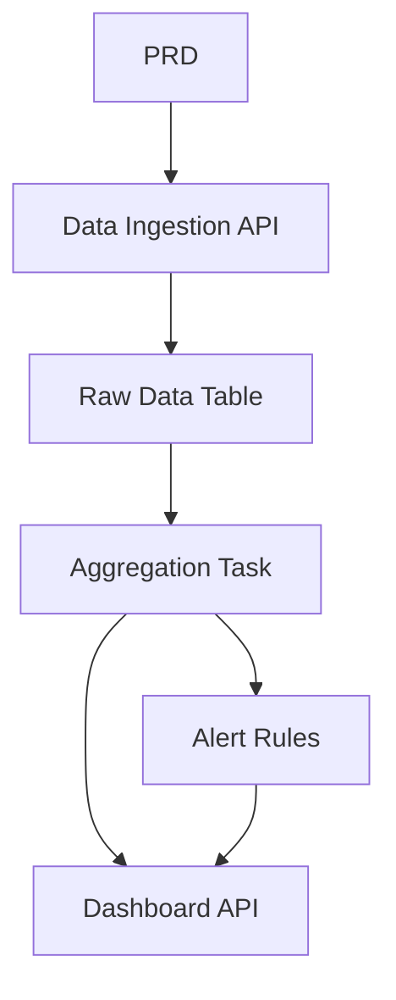

# Платформа анализа данных о трафике на Go

## Обзор

В этом проекте вам нужно создать платформу анализа данных о трафике, используя Go, на основе реального PRD. В отличие от предыдущих CRUD-систем, вы построите полный конвейер данных: «приём данных → агрегация → оповещения → визуализация». Такой тип продуктов данных очень распространён в IoT, мониторинге и операционной аналитике.

Это комплексный практический раздел Этапа 2 и ваше первое знакомство с Go. Не волнуйтесь — с вашим опытом в JavaScript/TypeScript изучение Go не составит труда. Основное внимание уделяется пониманию принципов проектирования конвейеров данных.

## Предварительные требования

Перед началом этого проекта вы уже должны быть знакомы с:

- Дизайном фронтенд-страниц и библиотеками компонентов ([UI-дизайн](../../frontend/ui-design/), [Современные библиотеки компонентов](../../frontend/modern-component-library/))
- Проектированием и разработкой бэкенд-API ([Код API](../../backend/ai-interface-code/))
- Основами баз данных и Supabase ([От базы данных к Supabase](../../backend/database-supabase/))
- Рабочим процессом Git и развёртыванием ([Git и GitHub](../../backend/git-workflow/), [Развёртывание веб-приложения](../../backend/zeabur-deployment/))

## Цели обучения

После завершения этого проекта вы сможете:

1. Читать PRD и извлекать список задач для разработки продукта данных
2. Создавать бэкенд-API-сервис, используя Go (Gin или Fiber)
3. Спроектировать полный конвейер для приёма данных, оконной агрегации и оповещений
4. Поддерживать согласованность данных бэкенда и дашбордов фронтенда
5. Выполнить сквозную интеграцию и сдать готовый к демонстрации прототип продукта данных

## Обзор проекта

Вы создадите платформу анализа данных о трафике на Go:

| Модуль | Назначение |
|--------|---------------|
| **Приём данных** | Приём сырых событий о трафике и их сохранение |
| **Агрегация данных** | Расчёт трендов и метрик загруженности по временным окнам |
| **Оповещения** | Генерация записей об оповещениях на основе правил |
| **Дашборд** | Отображение графиков трендов, рейтингов и списков оповещений на фронтенде |

::: tip PRD
Документ с требованиями для этого проекта находится на GitHub: [Посмотреть PRD](https://github.com/datawhalechina/easy-vibe/blob/main/docs/ru-ru/stage-2/assignments/traffic-data-visualization-go/PRD.md)
:::

<div style="margin: 32px 0;">
  <ClientOnly>
    <StepBar :active="0" :items="[
      { title: 'Требования', description: 'Прочитайте PRD, определите источники данных, определения метрик и правила оповещений' },
      { title: 'Каркас', description: 'Используйте ИИ для генерации API-сервиса на Go и каркаса дашборда фронтенда' },
      { title: 'Итерации', description: 'Добавляйте логику агрегации, правила оповещений и API дашборда' },
      { title: 'Запуск', description: 'Сквозное тестирование, развёртывание и подготовка демо' }
    ]" />
  </ClientOnly>
</div>

## Часть 1: Анализ требований

### 1.1 Прочитайте PRD

Откройте документ PRD и ответьте на эти ключевые вопросы:

- Каков источник данных? Какие поля он содержит?
- Каковы определения основных метрик? (например, конкретные критерии «загруженности»)
- Каковы правила оповещений? Должна ли первая версия использовать простые правила?
- Какие страницы и графики включает дашборд?

::: warning
Если на приведённые выше вопросы нет чётких ответов, не начинайте писать код. Неясные требования — самая распространённая причина переделок.
:::

### 1.2 Подтвердите конвейер данных



## Часть 2: Каркас проекта

### 2.1 Сгенерируйте API-сервис на Go

Пример промпта:

```text
Based on the current PRD, help me generate a Go traffic data analysis platform scaffold.

Requirements:
1. Use Gin or Fiber
2. Provide data ingestion API
3. Provide aggregation task skeleton
4. Provide dashboard and alerts API skeleton
5. Don't implement real complex analysis yet, just runnable structure
```

### 2.2 Проверьте структуру проекта

Проверьте каждый пункт:

- [ ] Сервис на Go успешно запускается
- [ ] API приёма данных может принимать и сохранять данные
- [ ] Каркас задачи агрегации настроен
- [ ] Дашборд фронтенда отображает базовые графики

## Часть 3: Итеративная разработка

### 3.1 Прогресс модуль за модулем

1. **API приёма данных**: приём сырых событий о трафике, запись в базу данных
2. **Агрегация данных**: агрегация по временным окнам, расчёт трендов и метрик загруженности
3. **Правила оповещений**: генерация записей об оповещениях на основе порогов
4. **API дашборда**: предоставление данных о трендах, данных рейтингов, списка оповещений
5. **Дашборд фронтенда**: страницы графиков трендов, рейтингов, списка оповещений

### 3.2 Самопроверка модулей

| Пункт проверки | Метод проверки |
|------------|---------------------|
| Приём данных | Корректно ли сырые данные сохраняются в базе данных? |
| Логика агрегации | Согласованы ли расчёты метрик трендов и рейтингов? |
| Правила оповещений | Соответствуют ли условия срабатывания оповещений ожиданиям? |
| Согласованность данных | Соответствует ли дашборд данным бэкенда? |
| Стандарты API | Есть ли единая структура ответа и обработка ошибок? |

## Часть 4: Интеграция и запуск

### 4.1 Сквозное тестирование

Как минимум проверьте следующие сценарии:

- Приём тестовых данных → Запуск задачи агрегации → Обновление дашборда
- Срабатывание условия оповещения → Генерация записи об оповещении → Отображение на странице оповещений

## Что нужно сдать

После завершения этого проекта сдайте следующее:

- [ ] Доступную ссылку на работающее демо
- [ ] Ссылку на репозиторий с исходным кодом (с README)
- [ ] Документ PRD
- [ ] Скриншоты основных страниц (демонстрация приёма данных, дашборд трендов, список оповещений)
- [ ] 60-секундное демо-видео

## Критерии оценки

| Параметр | Базовые требования | Продвинутые требования |
|------------|-------------------|----------------------|
| Соответствие PRD | Функции и структуры данных в целом соответствуют PRD | Можно чётко объяснить определения метрик и логику агрегации |
| Конвейер данных | Приём → Агрегация → Оповещение → Дашборд работают сквозно | Задачи агрегации поддерживают инкрементальные обновления |
| Аналитические возможности | Тренды, рейтинги, оповещения функциональны | Метрики настраиваемы, правила оповещений кастомизируемы |
| Отображение на фронтенде | Дашборд показывает базовые графики | Графики поддерживают фильтрацию по временному диапазону |
| Инженерная полнота | API на Go, база данных, конвейер фронтенда соединены | API имеет единую обработку ошибок и логирование |

## Справочные материалы

- [UI-дизайн](../../frontend/ui-design/)
- [Современные библиотеки компонентов](../../frontend/modern-component-library/)
- [От базы данных к Supabase](../../backend/database-supabase/)
- [Код API с помощью LLM](../../backend/ai-interface-code/)
- [Рабочий процесс Git и GitHub](../../backend/git-workflow/)
- [Развёртывание веб-приложения](../../backend/zeabur-deployment/)
