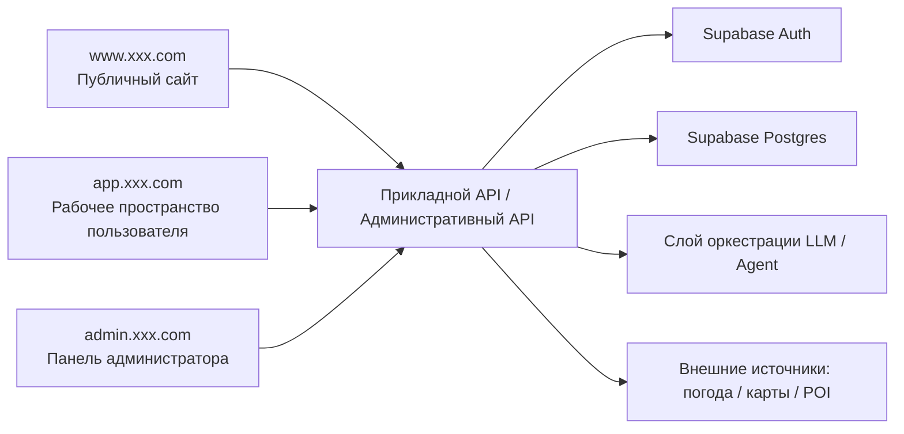
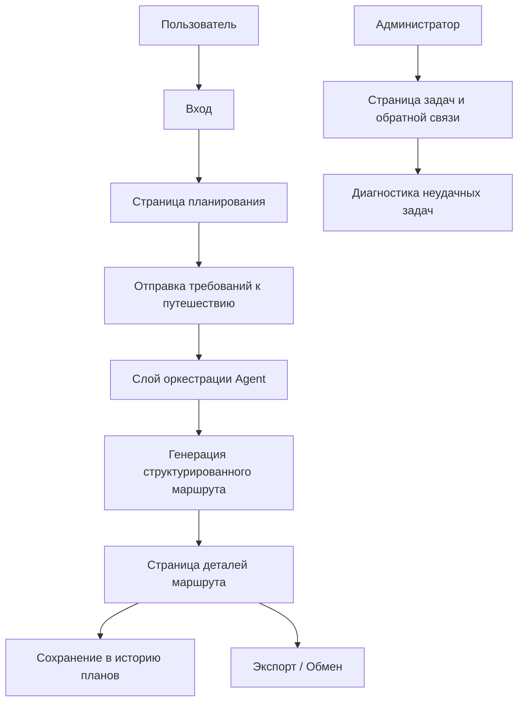

# PRD: интеллектуальная платформа оркестрации Agent для планирования путешествий

Статус: Draft v0.1  
Цель: сначала подтвердить минимально жизнеспособный объём этого Agent-продукта, а затем переходить к разработке.

## 1. Позиционирование проекта

Это AI-продукт для реальных сценариев планирования путешествий — это не просто чат, а преобразование структурированного ввода в выполнимый маршрут.

Определение в одну фразу:
Создать платформу оркестрации Agent, способную генерировать, сохранять, корректировать и экспортировать планы путешествий.

Общий обзор системы:



## 1.0 Рекомендации по выбору технологий

- Фронтенд-фреймворк: `Next.js App Router`
- Аутентификация пользователей: `Supabase Auth`
- База данных: `Supabase Postgres`
- Слой моделей: единый бэкенд-сервис, вызывающий большую модель
- Опциональный кэш: `Redis`

Соглашение о точках входа сайта:

- Публичный сайт: `www.xxx.com`
- Рабочее пространство пользователя: `app.xxx.com`
- Панель администратора: `admin.xxx.com`

## 1.1 Референсы конкурентов (официальные)

- [Wanderlog](https://wanderlog.com/)

## 1.2 Что заимствуем у продуктов

При проектировании этого продукта рекомендуется опираться на подходы реальных продуктов планирования путешествий:

- Заимствуйте у `Wanderlog` способ представления маршрута: после ввода сразу виден редактируемый ежедневный план, а не просто большой блок текста в ответ
- Детали маршрута должны выделять дату, место, бюджет, порядок перемещений и важные замечания
- Страница истории должна походить на «мою библиотеку маршрутов» с возможностью повторно открыть и сгенерировать заново
- Административная страница должна подчёркивать популярные направления, неудачные задачи и отзывы пользователей, а не только системные логи
- Общий дизайн должен передавать ощущение «продукта маршрутов», а не «чат-ответа»

## 1.3 Разбор страниц конкурентов

Рекомендуемая для изучения структура страниц конкурентов:

- Главная страница `Wanderlog`
  - Обратите внимание: как одновременно ясно донести ключевые ценности — itinerary, map, budget, collaboration
- Страница маршрута `Wanderlog`
  - Обратите внимание: план по дням, сосуществование карты и списка, бюджет рядом с информацией о бронировании
- Страница Pro у `Wanderlog`
  - Обратите внимание: как превратить продвинутые функции в понятные привилегии, а не в длинный список технических описаний

Поэтому для этого проекта рекомендуется:

- Страница планирования больше похожа на «редактор маршрута»
- Страница деталей больше похожа на «выполнимый itinerary»
- Страница истории больше похожа на «мою библиотеку путешествий»
- Административная страница больше похожа на «центр эксплуатации и задач»

## 2. Целевые пользователи и ключевые цели

Целевые пользователи:

- Обычные пользователи, которые хотят быстро получить план на 3–7 дней
- Самостоятельные путешественники, которым нужны советы по бюджету и темпу
- Администраторы, поддерживающие качество платформы и состояние здоровья задач

Ключевые цели:

- Пользователь может получить структурированный маршрут после одной отправки формы
- Пользователь может сохранять историю планов и снова редактировать/перегенерировать их
- Платформа может фиксировать неудачные задачи и обратную связь по качеству генерации

## 3. Объём MVP

Первая версия обязательно включает:

- Страницу формы планирования
- Страницу деталей маршрута
- Страницу истории планов
- Сохранение и перегенерацию плана
- Разбивку бюджета
- Заглушку возможности экспорта в текст/PDF
- Просмотр в админке задач и логов ошибок

Первая версия не делает:

- Реальное бронирование авиабилетов/отелей
- Сложную компоновку многогородских маршрутов
- Синхронизацию цен и наличия в реальном времени
- Совместное редактирование несколькими людьми
- Многоязычный вывод

## 4. Роли и права

| Роль | Права |
|------|------|
| Обычный пользователь | Создание планов, просмотр истории, экспорт, обратная связь |
| Администратор | Просмотр популярных направлений, неудачных задач, отзывов пользователей |

## 5. Реализация фронтенда

## 5.1 Обзор архитектуры страниц

В текущем PRD определены `3 точки входа, 8 крупных страниц`:

- Публичный сайт — `1` крупная страница
- Рабочее пространство пользователя — `5` крупных страниц
- Панель администратора — `2` крупные страницы

### A. Публичный сайт `www.xxx.com`

#### 1. Главная страница сайта `www:/`

Ключевые функции:

- Описание продукта
- Типичные сценарии использования
- Демонстрация Demo-маршрута
- CTA

### B. Рабочее пространство пользователя `app.xxx.com`

#### 2. Страница входа `app:/login`

Ключевые функции:

- Вход
- Точка входа в регистрацию

#### 3. Страница планирования `app:/planner`

Ключевые функции:

- Ввод требований к путешествию
- Выбор предпочтений и бюджета
- Запуск задачи планирования

#### 4. Страница деталей маршрута `app:/trips/:id`

Ключевые функции:

- Просмотр ежедневного маршрута
- Просмотр разбивки бюджета
- Перегенерация и экспорт

#### 5. Страница истории планов `app:/history`

Ключевые функции:

- Просмотр истории планов
- Повторное открытие
- Перегенерация

#### 6. Страница обратной связи и экспорта `app:/exports`

Ключевые функции:

- Экспорт плана
- Отправка обратной связи

### C. Панель администратора `admin.xxx.com`

#### 7. Главная страница админки `admin:/`

Ключевые функции:

- Популярные направления
- Доля успешных задач
- Число неудачных задач

#### 8. Страница задач и обратной связи `admin:/runs`

Ключевые функции:

- Просмотр неудачных задач
- Просмотр отзывов пользователей
- Диагностика аномальных планов

## 5.2 Ключевые пользовательские сценарии



Ключевые потоки состояний:

- Задача планирования: ожидает генерации -> генерируется -> успех / неудача
- Маршрут: черновик -> сохранён -> экспортирован
- Обратная связь: не обработана -> просмотрена -> закрыта

Рекомендуемый стек технологий:

- Next.js App Router
- TypeScript
- Tailwind CSS

Рекомендуемые страницы:

| Страница | Путь | Описание |
|------|------|------|
| Главная страница | `/` | Описание продукта и точка входа в создание |
| Страница планирования | `/planner` | Ввод требований и отправка |
| Страница деталей маршрута | `/trips/:id` | Просмотр ежедневного плана, бюджета и замечаний |
| Страница истории | `/history` | Просмотр истории планов |
| Панель администратора | `/admin` | Просмотр статуса задач и статистики платформы |

Ключевые компоненты фронтенда:

- Форма требований к путешествию
- Полоса статуса прогресса задачи
- Карточка маршрута Day by Day
- Карточка разбивки бюджета
- Список истории
- Компонент повтора при ошибке и обратной связи

## 6. Реализация бэкенда

Рекомендуемый стек технологий:

- Node.js + NestJS/Express
- PostgreSQL / Supabase
- LLM API
- Опционально Redis для короткого кэша

Модули бэкенда:

- `auth`
- `trip-plans`
- `planner`
- `exports`
- `admin`
- `feedback`

Рекомендуемые таблицы данных:

```sql
trip_plans (
  id uuid primary key,
  user_id uuid,
  origin text,
  destination text,
  start_date date,
  end_date date,
  budget numeric,
  preferences jsonb,
  pace text,
  status text,
  created_at timestamptz
)

itinerary_days (
  id uuid primary key,
  trip_plan_id uuid,
  day_index int,
  title text,
  summary text,
  day_budget numeric
)

itinerary_items (
  id uuid primary key,
  itinerary_day_id uuid,
  start_time text,
  end_time text,
  place_name text,
  category text,
  notes text,
  estimated_cost numeric
)

planner_runs (
  id uuid primary key,
  trip_plan_id uuid,
  provider text,
  latency_ms int,
  status text,
  error_message text,
  created_at timestamptz
)

trip_feedback (
  id uuid primary key,
  trip_plan_id uuid,
  user_id uuid,
  score int,
  comment text,
  created_at timestamptz
)
```

## 6.1 Метрики и мониторинг админки

В админке рекомендуется отслеживать как минимум эти метрики:

- Число задач планирования в день
- Доля успешного планирования
- Среднее время генерации
- Рейтинг популярных направлений
- Распределение оценок в отзывах пользователей
- Число экспортов

Рекомендации по базовому мониторингу:

- Доля успешных вызовов модели
- Доля неудач внешних источников информации
- Число повторов задач
- Время доступа к базе данных

## 7. Перечень функций

Обязательно выполнить:

- Создание плана путешествия
- Возврат структурированного ежедневного маршрута
- Просмотр истории планов
- Перегенерацию плана
- Разбивку бюджета
- Просмотр в админке неудачных задач

Опциональные улучшения:

- Рейтинг популярных направлений
- Повторную проверку данных POI
- Экспорт в изображение для обмена

## 8. Черновик API

| Метод | Путь | Описание |
|------|------|------|
| `POST` | `/api/trips/plan` | Создание новой задачи планирования |
| `GET` | `/api/trips/:id` | Получение деталей плана |
| `POST` | `/api/trips/:id/regenerate` | Перегенерация по исходным условиям |
| `PATCH` | `/api/trips/:id/preferences` | Обновление предпочтений и пересчёт |
| `GET` | `/api/history` | Получение списка истории планов |
| `POST` | `/api/trips/:id/export` | Экспорт маршрута |
| `POST` | `/api/trips/:id/feedback` | Отправка обратной связи пользователя |
| `GET` | `/api/admin/planner-runs` | Получение логов генерации |

Пример запроса `POST /api/trips/plan`:

```json
{
  "origin": "Шанхай",
  "destination": "Чэнду",
  "startDate": "2026-05-01",
  "endDate": "2026-05-04",
  "budget": 3500,
  "preferences": ["Гастрономия", "История и культура"],
  "pace": "standard"
}
```

## 9. Ключевые бизнес-правила

- Первая версия ограничена одним направлением
- Поддерживаются только 3–7 дней
- Бюджет обязательно возвращает общий бюджет и бюджет на каждый день
- Неудачные задачи обязательно можно повторить
- Результат генерации должен иметь структурированный JSON, нельзя возвращать только свободный текст

## 10. Нефункциональные требования

- Результат планирования должен иметь стабильный структурированный JSON
- Длинные задачи обязательно имеют обратную связь по статусу
- При неудаче внешних источников информации нужно изящно деградировать
- Неудачный экспорт можно повторить
- На мобильных устройствах можно как минимум просматривать детали и историю планов

## 11. Рекомендуемый порядок разработки

1. Форма страницы планирования и mock-результат
2. Интерфейсы создания плана и деталей
3. История и перегенерация
4. Экспорт и обратная связь
5. Страница логов в админке

## 12. Пункты для уточнения

- Нужно ли в первой версии подключать внешние данные погоды/карт
- Делать экспорт сначала в PDF или в виде загрузки чистого текста
- Нужны ли для генерации маршрута пресеты «экономный/сбалансированный/глубокое погружение»
- Нужно ли в админке просматривать детали отзывов пользователей
