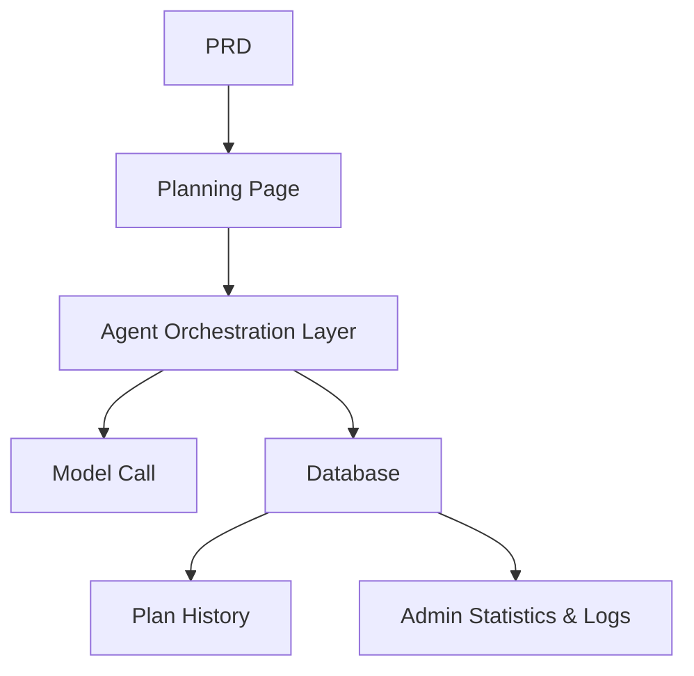

# Платформа агента для планирования путешествий

## Обзор

В этом проекте вам нужно с нуля создать платформу интеллектуального агента для планирования путешествий на основе реального PRD. Вы создадите полноценный AI-продукт, который принимает структурированный ввод, генерирует посуточные маршруты и поддерживает сохранение и повторное использование планов — не просто чат-бот, а продукт с возможностями управления задачами.

Это комплексный практический раздел Этапа 2. Основная сложность: как заставить ИИ генерировать структурированные, применимые маршруты вместо сплошной стены неструктурированного текста.

## Предварительные требования

Перед началом этого проекта вы уже должны быть знакомы с:

- Дизайном фронтенд-страниц и библиотеками компонентов ([UI-дизайн](../../frontend/ui-design/), [Современные библиотеки компонентов](../../frontend/modern-component-library/))
- Проектированием и разработкой бэкенд-API ([Код API](../../backend/ai-interface-code/))
- Основами баз данных и Supabase ([От базы данных к Supabase](../../backend/database-supabase/))
- Рабочим процессом Git и развёртыванием ([Git и GitHub](../../backend/git-workflow/), [Развёртывание веб-приложения](../../backend/zeabur-deployment/))

## Цели обучения

После завершения этого проекта вы сможете:

1. Читать PRD и извлекать список задач для разработки платформы агента
2. Проектировать формы структурированного ввода и форматы структурированного вывода
3. Реализовать слой оркестрации агента, обрабатывающий ввод пользователя, вызовы модели и хранение результатов
4. Построить бизнес-цикл «генерация → сохранение → повторное использование»
5. Выполнить сквозную интеграцию и сдать готовый к демонстрации прототип AI-продукта

## Обзор проекта

Вы создадите платформу интеллектуального агента для планирования путешествий:

| Функция | Описание |
|---------|-------------|
| **Планирование маршрута** | Пользователи вводят пункт отправления, назначение, даты, бюджет и предпочтения; система генерирует посуточные маршруты |
| **Разбивка бюджета** | Результаты маршрута включают распределение бюджета и рекомендации |
| **Управление историей** | Пользователи могут сохранять, повторно генерировать и экспортировать прошлые планы |
| **Панель администратора** | Администраторы просматривают популярные направления, неудавшиеся задачи и отзывы пользователей |

::: tip PRD
Документ с требованиями для этого проекта находится на GitHub: [Посмотреть PRD](https://github.com/datawhalechina/easy-vibe/blob/main/docs/ru-ru/stage-2/assignments/travel-planning-agent-platform/PRD.md)
:::

<div style="margin: 32px 0;">
  <ClientOnly>
    <StepBar :active="0" :items="[
      { title: 'Требования', description: 'Прочитайте PRD, определите страницы, оркестрацию агента и структуру ввода/вывода' },
      { title: 'Каркас', description: 'Используйте ИИ для генерации каркасов главной страницы, планирования, истории и администрирования' },
      { title: 'Итерации', description: 'Добавляйте структурированный вывод, статус задач и управление историей модуль за модулем' },
      { title: 'Запуск', description: 'Сквозное тестирование, развёртывание и подготовка демо' }
    ]" />
  </ClientOnly>
</div>

## Часть 1: Анализ требований

### 1.1 Прочитайте PRD

Откройте документ PRD и ответьте на эти ключевые вопросы:

- Должна ли первая версия поддерживать только поездки с одним пунктом назначения?
- Должен ли вывод маршрута быть структурированным? Какова структура?
- Насколько глубокими должны быть возможности экспорта? (ссылка для шаринга / PDF / изображение)
- Каков объём статистики администратора и логов задач?

::: warning
Если на приведённые выше вопросы нет чётких ответов, не начинайте писать код. Неясные требования — самая распространённая причина переделок.
:::

### 1.2 Подтвердите архитектуру системы



## Часть 2: Каркас проекта

### 2.1 Сгенерируйте фронтенд-страницы

Пример промпта:

```text
Based on the current PRD, help me generate a frontend scaffold for an intelligent travel planning Agent platform.

Requirements:
1. Pages: homepage, planning page, itinerary detail, history, admin dashboard
2. Planning page has a form on the left and result preview on the right
3. Only generate page structure with mock data first, no real API integration
4. Style should look like a modern AI product
```

### 2.2 Проверьте структуру страниц

Проверьте каждый пункт:

- [ ] Поля формы страницы планирования соответствуют PRD
- [ ] Область предпросмотра результатов может отображать структурированные данные маршрута
- [ ] Страница истории может отображать несколько планов
- [ ] Панель администратора может отображать статистику

## Часть 3: Итеративная разработка

### 3.1 Прогресс модуль за модулем

1. **Аутентификация**: регистрация, вход
2. **Форма планирования**: структурированный ввод (пункт отправления, назначение, даты, бюджет, предпочтения)
3. **Оркестрация агента**: приём ввода → вызов модели → разбор структурированного вывода
4. **Отображение результатов**: показ маршрута по дням, разбивка бюджета, рекомендации
5. **Управление историей**: сохранение планов, повторная генерация, экспорт
6. **Панель администратора**: популярные направления, неудавшиеся задачи, отзывы пользователей
7. **Статус задач**: управление статусами «Генерация / Успех / Сбой» и логирование ошибок

### 3.2 Самопроверка модулей

| Пункт проверки | Метод проверки |
|------------|---------------------|
| Полнота ввода | Соответствуют ли поля формы PRD? |
| Структура вывода | Являются ли результаты маршрута структурированными данными (а не стеной текста)? |
| Согласованность данных | Согласуются ли данные поездки, маршрута и логов? |
| Проверка цикла | Можете ли вы продемонстрировать «ввод → генерация → сохранение → повторная генерация»? |

## Часть 4: Интеграция и запуск

### 4.1 Сквозное тестирование

Как минимум проверьте следующие сценарии:

- Ввод параметров поездки → Генерация посуточного маршрута → Просмотр разбивки бюджета → Сохранение в историю
- Повторная генерация маршрута из истории
- Администратор просматривает статистику задач и логи сбоев

## Что нужно сдать

После завершения этого проекта сдайте следующее:

- [ ] Доступную ссылку на работающее демо
- [ ] Ссылку на репозиторий с исходным кодом (с README)
- [ ] Документ PRD
- [ ] Скриншоты основных страниц (страница планирования, детали маршрута, история, панель администратора)
- [ ] 60-секундное демо-видео

## Критерии оценки

| Параметр | Базовые требования | Продвинутые требования |
|------------|-------------------|----------------------|
| Соответствие PRD | Страницы, функции и структуры данных в целом соответствуют PRD | Можно чётко объяснить дизайн-решения |
| Продуктовый цикл | Планирование → Сохранение → История → Повторная генерация работают сквозно | Поддерживаются экспорт и шаринг |
| Качество вывода | Результаты маршрута структурированы и читаемы | Разбивка бюджета разумна, рекомендации релевантны |
| Возможности администрирования | Статистика задач и логи сбоев доступны для просмотра | Есть анализ популярных направлений |
| Инженерная полнота | Фронтенд, бэкенд, база данных, конвейер вызова модели соединены | Управление статусом задач надёжно, ошибки отслеживаемы |

## Справочные материалы

- [UI-дизайн](../../frontend/ui-design/)
- [Современные библиотеки компонентов](../../frontend/modern-component-library/)
- [От базы данных к Supabase](../../backend/database-supabase/)
- [Код API с помощью LLM](../../backend/ai-interface-code/)
- [Рабочий процесс Git и GitHub](../../backend/git-workflow/)
- [Развёртывание веб-приложения](../../backend/zeabur-deployment/)
