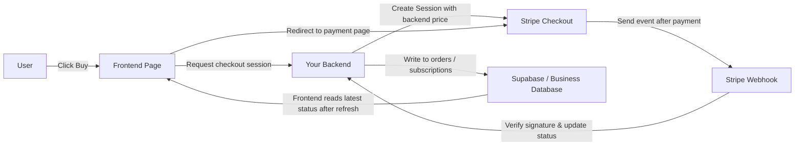
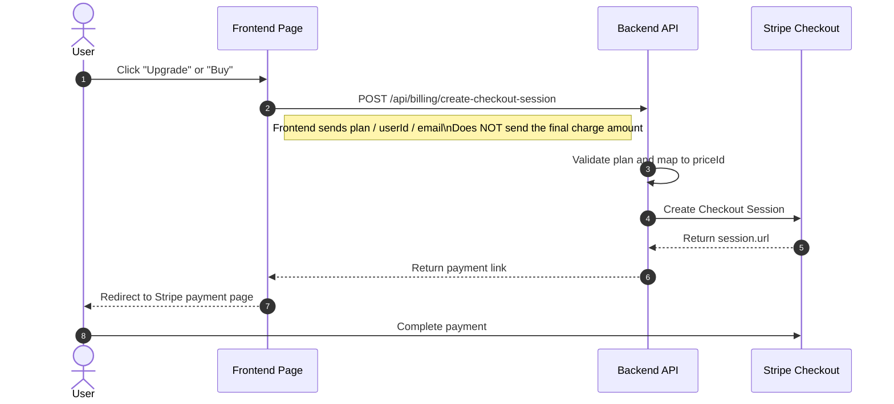
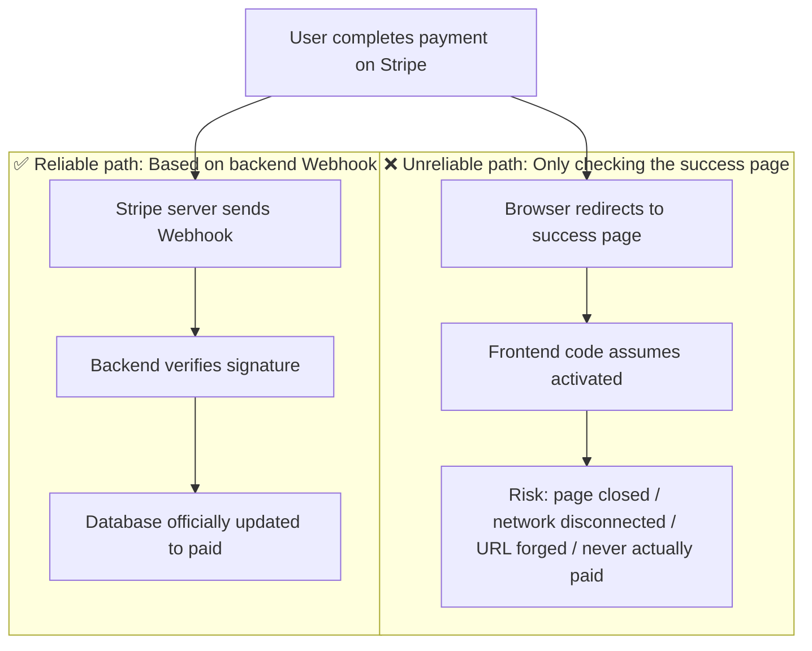
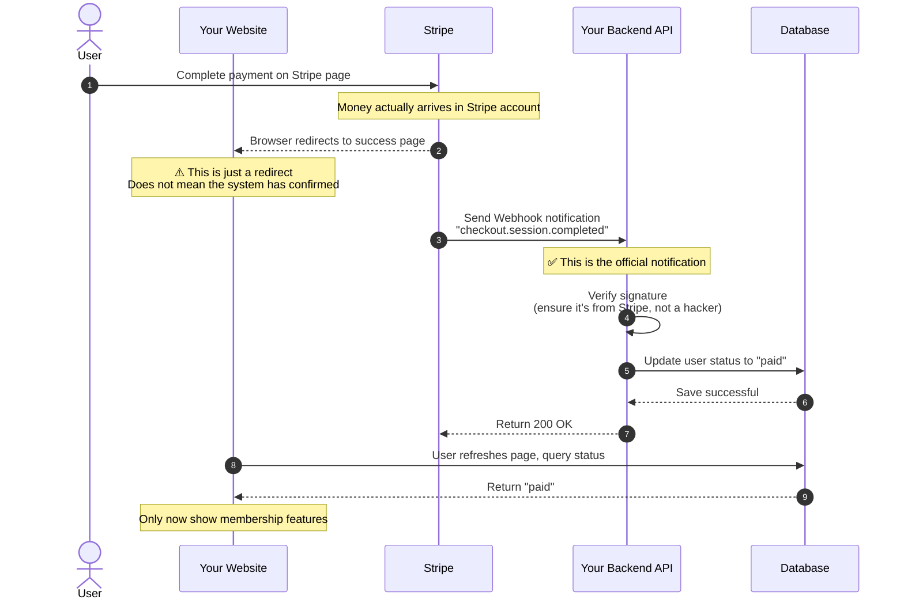
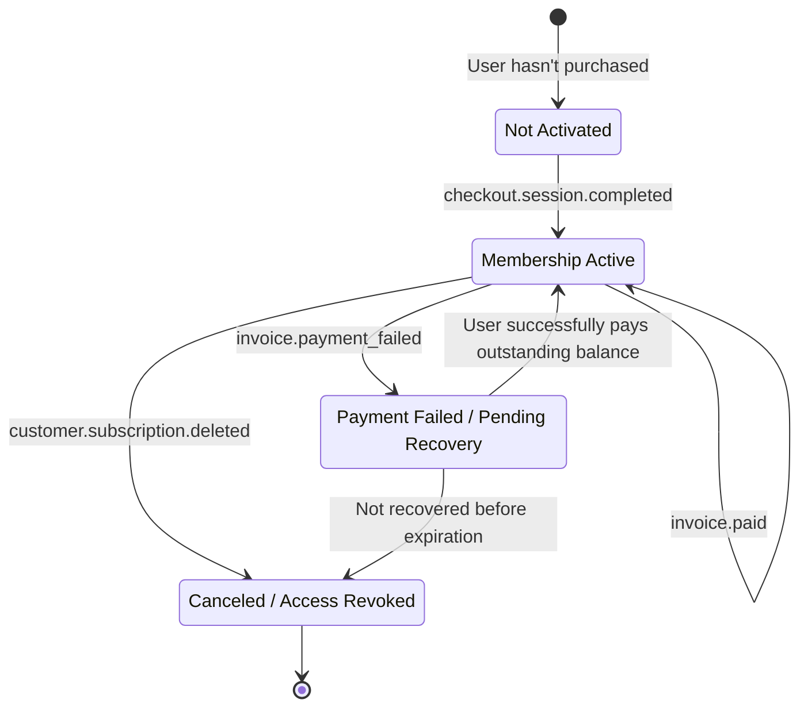
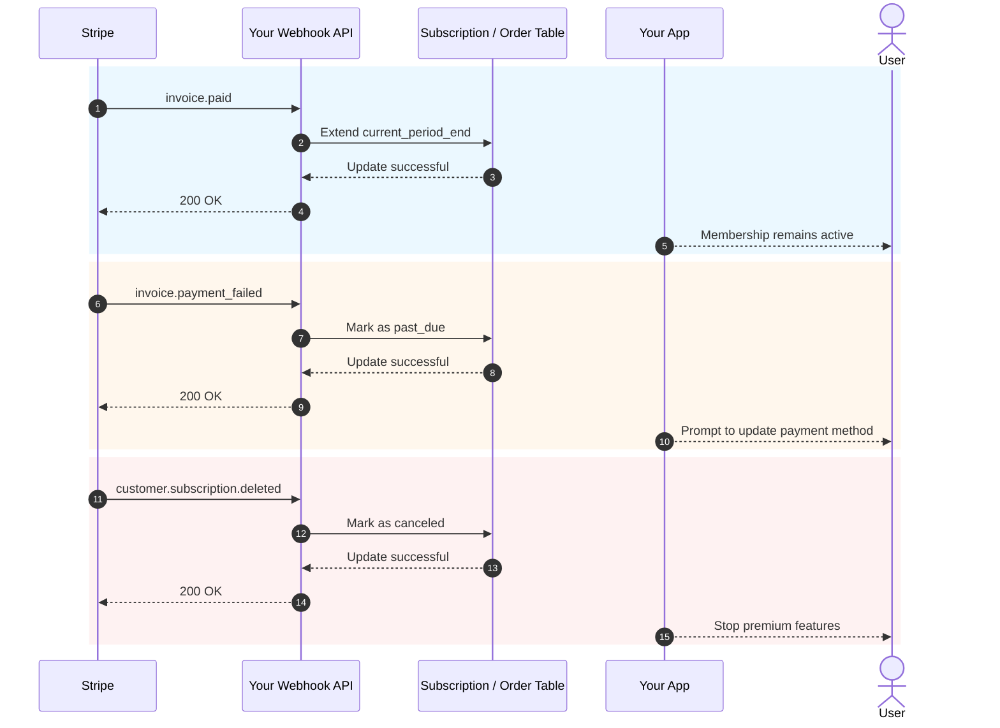

# Как интегрировать Stripe и другие платёжные системы

Когда у вашего продукта уже есть страницы, аутентификация, база данных и базовый бэкенд, следующий практический вопрос: **как брать за него оплату**.

Многие, делая свою первую интеграцию платежей, полностью сосредотачиваются на «как перенаправить на платёжную страницу». Но то, что действительно определяет стабильность системы, — это не кнопка, а вся платёжная цепочка: кто определяет цену, кто подтверждает успешность платежа, кто обновляет базу данных и кто предоставляет или отзывает доступ.

Эта статья разделена на две части:

- **Первая половина** охватывает только самые практичные основы с целью помочь вам интегрировать Stripe в ваш проект как можно быстрее.
- **Вторая половина** вынесена в приложение и охватывает детали Webhook, события подписок и различия платёжных решений в разных странах и регионах.

> 💡 Мы рекомендуем пройти эти главы перед продолжением:
>
> - [От базы данных к Supabase](../database-supabase/)
> - [Использование AI для написания кода API и документации](../ai-interface-code/)
> - [Как развернуть веб-приложение](../zeabur-deployment/)

# Что вы узнаете

1. Как выглядит минимально жизнеспособная платёжная система.
2. Как интегрировать Stripe в ваш проект самым быстрым способом.
3. Как писать подсказки, чтобы AI мог напрямую добавить платёжную систему за вас.
4. Если вы не строите зарубежный проект на Stripe — какие платёжные решения стоит приоритизировать для разных регионов.

---

# Часть 1: С чего начать

## 1. Сначала запомните эти 3 принципа

Если вы запомните всего три вещи, запомните эти:

1. **Цены должны определяться бэкендом** — никогда не доверяйте сумме, присланной с фронтенда.
2. **То, что фактически предоставляет доступ, — это Webhook**, а не страница `success`.
3. **Ваша собственная база данных должна хранить статус платежа** — не полагайтесь только на дашборд Stripe.

Эти три принципа являются основными границами любой платёжной системы. Пока границы заданы правильно, переключение между Stripe, PayPal, Alipay или WeChat Pay по сути сводится лишь к тому, что «меняется API, но архитектура остаётся прежней».

## 2. Что произойдёт, если пропустить бэкенд и подключиться напрямую с фронтенда?

Это самая естественная идея, которая приходит многим, когда они впервые строят платежи:

- На странице уже есть кнопка «Купить»
- Можно ли просто позволить фронтенду подключиться к Stripe напрямую?
- Тогда мне не нужен бэкенд, верно?

Если вы просто строите фейковую демо-страницу, такое мышление допустимо.
Но если вы действительно собираете реальные деньги, **этот подход обычно ведёт к проблемам**.

Самые распространённые проблемы:

1. **Цены легко подделать**
   Запросы из браузера отправляются с собственного компьютера пользователя. Другие могут изменить содержимое запроса.
2. **Чувствительная информация может быть раскрыта**
   По-настоящему важные ключи, логика ценообразования и логика активации членства никогда не должны находиться на фронтенде.
3. **Вы не можете надёжно подтвердить, «действительно ли этот платёж прошёл успешно»**
   То, что пользователь попал на страницу успеха, не означает, что ваша база данных корректно синхронизирована.
4. **Состояние базы данных будет несогласованным**
   Пользователь может сказать «я уже заплатил», но в вашей системе нет записи об этом.

Поэтому более безопасное разделение обязанностей должно быть таким:

- Фронтенд отвечает за: отображение кнопок, инициирование покупок, перенаправление страниц
- Бэкенд отвечает за: определение цен, создание платёжных сессий, приём Webhook, обновление базы данных

::: info Это можно резюмировать одной фразой
**Фронтенд может заниматься перенаправлениями; бэкенд должен заниматься ценообразованием и подтверждением.**

Пока задействованы реальные деньги, никогда не размещайте «окончательное право на ценообразование» и «логику активации после оплаты» на фронтенде.
:::

## 3. Когда уместно начинать со Stripe?

Если вы строите любой из следующих сценариев, Stripe обычно является самой плавной отправной точкой:

- SaaS, ориентированный на международных пользователей
- Продукты с членством по подписке
- Цифровые продукты, шаблоны, пакеты AI-кредитов
- Желание быстро проверить монетизацию вместо того, чтобы заранее разбираться с слишком большим количеством деталей локальных платежей

Если ваши основные пользователи находятся в материковом Китае, Stripe обычно не будет вашим первым выбором — я расскажу об этом в приложении.

## 4. Минимально жизнеспособная платёжная цепочка

Начнём с минимальной версии. Пока эта цепочка работает, у вашей платёжной системы есть скелет.



Переводя это на простой язык:

1. Пользователь нажимает кнопку.
2. Фронтенд запрашивает у бэкенда платёжную ссылку.
3. Бэкенд создаёт платёжную сессию, используя секретный ключ Stripe.
4. Пользователь переходит на страницу Stripe, чтобы заплатить.
5. Stripe уведомляет вас через Webhook, что «платёж действительно прошёл успешно».
6. Затем ваш бэкенд обновляет базу данных.

## 5. Стандартная диаграмма последовательности для инициирования платежа

Если вы предпочитаете смотреть на более формальные системные диаграммы, вот диаграмма последовательности:



## 6. Быстрый старт

Если вы хотите интегрировать его в проект как можно быстрее, просто выполните эти 5 шагов.

### 6.1 Шаг 1: Создайте продукты и цены в дашборде Stripe

Цель этого шага — не «просто настроить что-нибудь наугад», а чётко определить в Stripe, **что вы продаёте и как планируете брать за это оплату**.

В модели Stripe:

- **Product** представляет «что вы продаёте», например `Pro Membership`
- **Price** представляет «сколько это стоит и на каком платёжном цикле», например `$9.9/month`, `$99/year`

Почему делать этот шаг первым?
Потому что позже, когда ваш бэкенд создаёт Checkout Session, вы не передаёте Stripe «сырую» сумму — вы передаёте существующий `price_id`. Затем Stripe использует этот `price_id`, чтобы сгенерировать фактическую платёжную страницу, сумму, валюту и платёжный цикл.

Если вы пропустите этот шаг, шаг «создать платёжную ссылку» позже вообще не сработает.

::: info Почему здесь стоит сделать паузу
Многие новички раздражаются, увидев `Product` и `Price`, думая, что они изучают внутренний жаргон Stripe.

Но на самом деле этот шаг делает нечто очень простое:
- Чётко определить «что вы продаёте»
- Чётко определить «сколько это стоит»
- Позволить бэкенду позже использовать стабильный `price_id` для создания платёжных ссылок

Как только вы поймёте этот слой, Checkout Sessions перестанут казаться абстрактными.
:::

Для минимально жизнеспособной системы подписок вам нужны как минимум эти два уровня:

- Один `Product`
- Одна или несколько записей `Price`

Вы можете открыть эти страницы напрямую:

- Вход в дашборд Stripe: [Dashboard Login](https://dashboard.stripe.com/login)
- Документация по управлению продуктами и ценами Stripe: [Manage products and prices](https://docs.stripe.com/products-prices/manage-prices)
- Документация по быстрому старту Stripe Checkout: [Build a Stripe-hosted checkout page](https://docs.stripe.com/checkout/quickstart?lang=node)
- Страница продуктов дашборда Stripe: [Product catalog](https://dashboard.stripe.com/test/products)

Мы рекомендуем сначала работать в **тестовом режиме (Test mode)** — не начинайте строить в боевой среде.

Типичная минимальная конфигурация такова:

- `Product`: `Pro Plan`
- `Price 1`: `pro_monthly`
- `Price 2`: `pro_yearly`

При работе в дашборде следуйте этому порядку:

1. Сначала создайте продукт `Pro Plan`
2. Затем прикрепите две цены к этому продукту
3. Месячная и годовая оплата — это на самом деле просто два варианта ценообразования для одного продукта

После завершения вам нужно записать как минимум:

- `price_id` для месячной цены
- `price_id` для годовой цены
- Ваши собственные имена планов, например `pro_monthly`, `pro_yearly`

Если вы впервые в дашборде Stripe, думайте об этом так:

- `Product` определяет, что продаётся на платёжной странице
- `Price` определяет, сколько берётся на платёжной странице
- То, что бэкенд фактически будет использовать позже, — это в основном `price_id`

::: info Значения, которые вам действительно нужно записать
Самое важное на этой странице — не имя продукта, а `price_id`.

Позже, независимо от того, помогает ли AI интегрировать бэкенд или вы сами устраняете проблемы, вы будете часто использовать:
- `STRIPE_PRICE_PRO_MONTHLY`
- `STRIPE_PRICE_PRO_YEARLY`
- Два значения `price_id`, которым они соответствуют
:::

Если вы хотите, чтобы AI сначала провёл вас по настройке дашборда, можете использовать эту подсказку:

```text
I'm using Stripe for the first time. Don't modify any code yet -- first help me set up the most basic billing configuration in the Stripe Dashboard.

Please give me step-by-step instructions based on these official docs:
- https://docs.stripe.com/products-prices/manage-prices
- https://docs.stripe.com/checkout/quickstart?lang=node

My situation:
- I want to build the simplest membership billing
- Only two plans: monthly and yearly
- I don't understand terms like Product and Price yet

Please:
1. First explain in simple terms what Product and Price are.
2. Then guide me step by step: which page to open first -> what to click -> what to fill in.
3. Finally remind me what I need to copy from the Dashboard for the backend to use.
4. If I might make mistakes, please remind me to always stay in test mode.
```

### 6.2 Шаг 2: Подготовьте переменные окружения

Обычно вам нужны как минимум эти переменные окружения:

- `STRIPE_SECRET_KEY`
- `STRIPE_WEBHOOK_SECRET`
- `STRIPE_PRICE_PRO_MONTHLY`
- `STRIPE_PRICE_PRO_YEARLY`
- `APP_URL`
- `SUPABASE_URL`
- `SUPABASE_SERVICE_ROLE_KEY`

Вы можете открыть эти страницы напрямую:

- Документация по API-ключам Stripe: [API keys](https://docs.stripe.com/keys)
- Страница API-ключей дашборда Stripe: [API Keys](https://dashboard.stripe.com/test/apikeys)
- Документация по Webhook Stripe: [Receive Stripe events in your webhook endpoint](https://docs.stripe.com/webhooks)
- Страница Webhook дашборда Stripe: [Workbench Webhooks](https://dashboard.stripe.com/test/workbench/webhooks)

> ⚠️ `STRIPE_SECRET_KEY` и `SUPABASE_SERVICE_ROLE_KEY` должны размещаться только на бэкенде.

::: info Назначение этого шага с переменными окружения
Этот шаг не о том, чтобы «заполнить файл `.env`», а о том, чтобы разместить самые чувствительные части платёжной системы на бэкенде:

- Серверный секретный ключ Stripe
- Секрет проверки подписи Webhook
- Ваше собственное сопоставление цен

Проще говоря:
Фронтенд отвечает только за инициирование покупок; настоящие секреты и логика ценообразования должны оставаться на стороне сервера.
:::

Вы также можете попросить AI помочь с организацией этого шага:

```text
Please look at how my project currently stores environment variables, then help me organize the environment variables needed for Stripe.

Please refer to these docs:
- https://docs.stripe.com/keys
- https://docs.stripe.com/webhooks

My situation:
- I'm a complete beginner
- I can't distinguish which variables should go on the frontend vs the backend
- I'm not sure whether to edit `.env`, `.env.local`, or another file in the current project

Please:
1. First search where environment variables are typically stored in the current project.
2. List the minimum environment variables needed for Stripe integration.
3. Explain in simple terms what each variable does.
4. Tell me which Stripe page to visit to copy each variable.
5. If the project has an example environment variable file, please add the variable names directly.
```

### 6.3 Шаг 3: Создайте Checkout Session на бэкенде

Вам не нужно писать API самостоятельно на этом шаге — просто попросите AI обратиться к официальной документации и реализовать его за вас.

Сначала дайте ему эти документы:

- Быстрый старт Stripe Checkout: [Build a Stripe-hosted checkout page](https://docs.stripe.com/checkout/quickstart?lang=node)
- API Checkout Sessions: [Create a Checkout Session](https://docs.stripe.com/api/checkout/sessions/create)
- Подписки: [Subscriptions](https://docs.stripe.com/payments/subscriptions)

Затем вставьте эту подсказку:

```text
Please look at how my current project's backend code is organized, then help me integrate Stripe payments.

Please refer to these official docs:
- https://docs.stripe.com/checkout/quickstart?lang=node
- https://docs.stripe.com/api/checkout/sessions/create
- https://docs.stripe.com/payments/subscriptions

My goal is simple:
- After the user clicks the buy button, redirect to Stripe's payment page
- Only two plans: monthly and yearly
- Don't make me decide where to put the code -- look at the project first and place it appropriately

Please:
1. First search the project to find the backend entry file, route files, and how environment variables are written.
2. Then reference the official docs to integrate the "create Stripe payment link" step.
3. Don't let me pass the amount myself -- use backend environment variables for pricing.
4. After finishing, tell me which files you changed.
5. Finally, tell me what additional configuration I need to do in the Stripe Dashboard.
```

### 6.4 Шаг 4: Перенаправьте на платёжную страницу с фронтенда

Цель этого шага очень проста: заставить кнопку на странице с ценами вызывать ваш API бэкенда, а затем перенаправлять на Stripe Checkout.

Справочная документация:

- Руководство по интеграции Stripe Checkout: [Build an integration with Checkout](https://docs.stripe.com/payments/checkout/build-integration)

Подсказка для AI:

```text
Help me connect the "Buy" button in my project to Stripe.

Requirements:
- Don't change the existing page, only modify the button click logic
- After clicking, call the backend API to get the payment link, then redirect to Stripe
- If there's an error, show a simple message to the user (e.g. "Payment temporarily unavailable, please try again later")

Reference docs: https://docs.stripe.com/payments/checkout/build-integration
```

### 6.5 Шаг 5: Обновите статус в базе данных через Webhook

Это самый критически важный шаг.

::: info Почему этот шаг самый критически важный
Многие думают, что «пользователь заплатил и был перенаправлен на страницу успеха» означает, что всё готово.

Нет.

Для вашей системы важно вот что:
**Доставил ли Stripe официально событие в ваш Webhook и успешно ли ваш бэкенд обновил статус в базе данных.**
:::

Вы также можете попросить AI реализовать это напрямую, следуя официальной документации Stripe по Webhook, — не пишите это вручную.

Справочная документация:

- Webhook Stripe: [Receive Stripe events in your webhook endpoint](https://docs.stripe.com/webhooks)
- Stripe CLI: [Stripe CLI](https://docs.stripe.com/stripe-cli)
- Использование Stripe CLI: [Use the Stripe CLI](https://docs.stripe.com/stripe-cli/use-cli)

Подсказка для AI:

```text
Please continue helping me integrate the "automatically activate after successful payment" step with Stripe.

Please refer to these official docs:
- https://docs.stripe.com/webhooks
- https://docs.stripe.com/stripe-cli
- https://docs.stripe.com/stripe-cli/use-cli

My goal:
- After the user pays, don't just redirect to a success page
- Actually change the membership status in my database to activated

Please:
1. First search the current project for database-related code and how user status is stored.
2. Then add the Stripe webhook.
3. After successful payment, change the corresponding user to active, or update the membership status field currently used in the project.
4. If the project already has subscription tables, order tables, or user tables, prefer to follow the existing structure.
5. After finishing, tell me which files you changed.
6. Also tell me how to test locally whether this step actually works.
```

## 7. Подсказка для быстрой интеграции платежей с помощью AI

Если вы используете такие инструменты, как Codex, Claude Code, Trae или Cursor, вы можете напрямую вставить следующую подсказку и попросить интегрировать платежи в ваш проект.

```text
Please help me integrate Stripe payments into the current project. I want to build the simplest membership billing feature that works.

My requirements:
1. I'm a complete beginner -- please look at the project yourself first, then decide where to modify the code.
2. Don't make me figure out the directory structure, routing structure, or database structure myself.
3. I only want the simplest version first: two plans, monthly and yearly.
4. After clicking buy, the user should be redirected to the Stripe payment page.
5. After successful payment, the membership status in my database should change to activated.
6. Don't add too many complex features upfront, like coupons, upgrades/downgrades, or complex invoicing.

Output requirements:
1. First give me a change plan.
2. Then directly modify the code.
3. Finally tell me how to test step by step locally.
4. If any step requires me to do something in the Stripe Dashboard, give me the link and key points directly.
```

Если вы хотите, чтобы AI был более адаптирован к вашему проекту, можете также добавить в начале:

- Ваш фронтенд-фреймворк
- Структуру каталогов вашего бэкенда
- Имена таблиц вашей базы данных
- Использует ли ваша текущая система пользователей Supabase Auth или кастомное решение Auth

## 7.1 Пусть AI также займётся локальным интеграционным тестированием

Если вы хотите, чтобы AI провёл вас через весь процесс локального интеграционного тестирования, можете использовать эту подсказку:

```text
Please continue helping me get Stripe payments actually working. I want to follow along step by step without guessing.

Please refer to the official docs:
- https://docs.stripe.com/webhooks
- https://docs.stripe.com/stripe-cli
- https://docs.stripe.com/stripe-cli/use-cli

My goals:
1. Tell me which Stripe pages to open first.
2. Tell me how to get the STRIPE_WEBHOOK_SECRET.
3. Tell me how to use stripe login and stripe listen.
4. Tell me how to verify that checkout.session.completed has successfully reached my local webhook.
5. If the current project needs the frontend and backend running first, tell me the specific commands too.
6. Don't just explain principles -- output actual step-by-step instructions.
7. If I might make a mistake at some step, also tell me what the most common errors look like.
```

## 8. 4 самые распространённые ловушки

1. **Считать страницу `success` успешной оплатой**
   То, что фактически определяет статус, — это Webhook, а не перенаправление на фронтенде.
2. **Позволять фронтенду передавать сумму**
   Это создаёт серьёзный риск подделки цены.
3. **Маршрут Webhook предварительно обрабатывается `express.json()`**
   Проверка подписи Stripe требует «сырого» тела запроса.
4. **Не реализована идемпотентная обработка**
   Webhook может повторяться. Если вы добавляете членство или кредиты при каждом повторе, у вас будут проблемы.

## 9. Руководство по выбору в одной фразе

Если вы просто хотите запустить биллинг прямо сейчас:

| Ваши основные пользователи | Решение, которое стоит попробовать первым |
| :--- | :--- |
| Международный SaaS / глобальные пользователи | Stripe |
| Пользователи материкового Китая | Alipay / WeChat Pay |
| Гонконгские или трансграничные команды | Stripe + локальный кошелёк / решение на основе агрегации FPS |

Конкретные различия подробно рассмотрены в приложении.

::: info Простейший подход к выбору платёжного решения
Не начинайте с мысли «мне нужно сразу интегрировать каждый платёжный метод по всему миру».

Более практичный порядок обычно таков:
- Сначала выберите одну основную платёжную цепочку исходя из того, где находятся ваши основные пользователи
- Сначала запустите минимально жизнеспособный платёж
- Затем добавляйте второй или третий платёжный метод исходя из реальных источников пользователей
:::

## 10. Итог

На этом этапе вы освоили самую фундаментальную, но важную платёжную цепочку:

1. Фронтенд инициирует покупку.
2. Бэкенд создаёт Checkout Session.
3. Пользователь платит на странице Stripe.
4. Stripe уведомляет бэкенд через Webhook.
5. Бэкенд обновляет базу данных.
6. Фронтенд отображает новый статус членства или заказа после обновления.

Если вы просто хотите быстро интегрировать платежи в ваш проект, содержания выше достаточно. Приложение ниже можно использовать как справку, когда вы действительно столкнётесь с проблемами.

---

# Приложение

## Приложение A: Самые распространённые объекты в Stripe

При первом просмотре документации Stripe легко запутаться в этих именах объектов. На самом деле вам нужно понять лишь эти:

| Объект | Назначение | Чем это можно считать |
| :--- | :--- | :--- |
| `Product` | Описывает, что вы продаёте | Продукт или план членства |
| `Price` | Описывает, сколько это стоит и платёжный цикл | Месяц, год или разовая покупка |
| `Checkout Session` | Платёжный поток, размещённый Stripe | Платёжная страница |
| `Subscription` | Повторяющиеся отношения подписки | Автопродлеваемое членство |
| `Customer` | Платящий пользователь | Профиль клиента в Stripe |
| `Webhook` | Асинхронное уведомление | Stripe сообщает вам, «что произошло с этим платежом» |

## Приложение B: Почему страница `success` не равна успешной оплате

Многие думают, что «пользователь заплатил и был перенаправлен на страницу успеха» означает, что платёж прошёл успешно. Это самая распространённая ловушка.

### Реальный сценарий

Представьте, что вы создали сайт с членством:
1. Пользователь нажимает «Купить членство»
2. Перенаправляется на платёжную страницу Stripe
3. Пользователь вводит данные кредитной карты и нажимает «Оплатить»
4. Страница перенаправляется на ваш `success.html`
5. Вы написали код на странице успеха: «Раз они попали на эту страницу, активировать их членство»

**В чём проблема?**

Пользователь мог вообще не заплатить или закрыть страницу посреди оплаты, но всё равно может напрямую открыть `success.html`.

### Два совершенно разных пути



**Ключевые различия:**

| | Перенаправление на страницу success | Уведомление Webhook |
| :--- | :--- | :--- |
| Кто это инициирует | Браузер пользователя | Сервер Stripe |
| Можно ли подделать? | Да, достаточно просто открыть URL напрямую | Нет, есть проверка подписи |
| Гарантирует ли успешную оплату? | Не обязательно | Да, всегда |
| Как ваша система узнаёт об этом? | Код фронтенда догадывается | Stripe официально уведомляет |

### Как должен выглядеть полный поток



### Потенциальные проблемы на каждом шаге

**Шаг 1: Пользователь платит на Stripe**

Это единственный момент, который подтверждает, что «деньги действительно уплачены»:
- Пользователь вводит данные кредитной карты и нажимает «Подтвердить»
- Банк списывает деньги с карты пользователя
- Stripe подтверждает получение средств

**Шаг 2: Браузер перенаправляет на страницу успеха (самый проблемный)**

Этот шаг совершенно ненадёжен, потому что:
- Пользователь может ввести `yoursite.com/success` напрямую в браузере, открыв её без оплаты
- Пользователь закрывает страницу посреди оплаты, но ранее скопировал ссылку на успех и открывает её позже
- Сетевые проблемы приводят к сбою перенаправления, но деньги уже списаны (пользователь заплатил, но не увидел страницу успеха)
- Пользователь нажимает кнопку «Назад» и платит снова, но оба раза перенаправляется на одну и ту же страницу успеха

**Шаг 3: Stripe отправляет Webhook**

Это Stripe проактивно уведомляет ваш сервер, что «этот платёж получен»:
- Только сервер Stripe может инициировать этот запрос
- Запрос включает подпись, которую ваш бэкенд может проверить как действительно исходящую от Stripe
- Даже если страница успеха не загрузилась или пользователь отключился, Webhook всё равно отправляется

**Шаг 4: Бэкенд проверяет подпись**

Зачем проверять? Чтобы помешать хакерам подделывать уведомления.

Без проверки хакер мог бы отправить на ваш сервер фальшивое уведомление: «Пользователь A заплатил $1000». Тогда ваша система активировала бы членство для хакера.

Процесс проверки:
- Stripe генерирует подпись для содержимого уведомления, используя общий секретный ключ
- Ваш бэкенд использует тот же секретный ключ, чтобы проверить, совпадает ли подпись
- Совпадает = на 100% от Stripe, не совпадает = немедленно отклонить

**Шаг 5: Обновление базы данных**

Только после прохождения проверки обновляйте базу данных:
- Измените статус пользователя с «ожидает оплаты» на «оплачено»
- Запишите номер заказа, сумму и время оплаты
- Активируйте соответствующие права членства

**Шаг 6: Фронтенд запрашивает статус**

Страница успеха не должна предполагать, что «попадание на эту страницу означает успех». Правильный подход:
- При загрузке страницы отправить запрос на бэкенд: «Заплатил ли этот пользователь?»
- Бэкенд запрашивает базу данных и возвращает фактический статус
- Отображайте «активация успешна» или «ожидает подтверждения» исходя из результата

### Распространённая ошибка

```javascript
// Wrong: Activate directly on the success page
// success.html
if (window.location.pathname === '/success') {
  // Dangerous! Anyone can access /success
  activateMembership();
}
```

```javascript
// Correct: Always query the backend on every refresh
// success.html
async function checkStatus() {
  const response = await fetch('/api/user/status');
  const data = await response.json();

  if (data.paymentStatus === 'paid') {
    showMemberFeatures();
  } else {
    showPendingMessage();
  }
}
```

### Итог в одной фразе

**Страница успеха означает лишь «перенаправление браузера прошло успешно». Webhook — это то, что означает «Stripe официально подтвердил получение оплаты».**

Ваша система должна использовать Webhook как источник истины — никогда не доверяйте перенаправлению на фронтенде.

## Приложение C: Самые важные события подписок, которые стоит слушать

| Событие | Значение | Что вы обычно делаете |
| :--- | :--- | :--- |
| `checkout.session.completed` | Первая активация подписки прошла успешно | Создать локальную запись подписки |
| `invoice.paid` | Автопродление прошло успешно | Продлить дату истечения |
| `invoice.payment_failed` | Автоматическое списание не удалось | Отметить статус риска и уведомить пользователя |
| `customer.subscription.deleted` | Подписка отменена | Отозвать доступ или отметить как истёкшую |

### Диаграмма состояний подписки



### Диаграмма последовательности продления / сбоя / отмены



## Приложение D: Как выбрать другие платёжные решения

### 1. Материковый Китай

Если ваши основные пользователи находятся в материковом Китае, первым выбором по-прежнему являются **[Alipay](https://open.alipay.com/)** и **[WeChat Pay](https://pay.wechatpay.cn/)**.

**Бизнес-модель:**

Обе используют модель «платёжного шлюза». Вам нужно:
- Подать заявку на квалификацию продавца (бизнес-лицензия, корпоративный банковский счёт)
- Платежи пользователей поступают напрямую на ваш счёт продавца
- Вы сами занимаетесь налогами, возвратами и сверкой

**Техническая модель:**

Обе следуют модели «бэкенд создаёт заказ + фронтенд запускает оплату + бэкенд получает уведомление», как и Stripe.

**Поток интеграции Alipay:**
1. Создайте приложение на открытой платформе Alipay
2. Настройте открытый/закрытый ключи и URL обратного вызова
3. Бэкенд вызывает единый API заказа, чтобы сгенерировать платёжную ссылку или QR-код
4. Пользователь сканирует код или перенаправляется на оплату
5. Alipay отправляет асинхронное уведомление на ваш бэкенд для обновления статуса заказа

**Поток интеграции WeChat Pay:**
- Оплата JSAPI: подходит для официальных аккаунтов и мини-программ; пользователи платят прямо внутри WeChat
- Оплата Native: генерирует QR-код на ПК; пользователь сканирует для оплаты
- Оплата H5: запускает приложение WeChat из мобильного браузера для оплаты

Поток: бэкенд создаёт заказ -> получает `prepay_id` или `code_url` -> фронтенд запускает оплату -> бэкенд получает уведомление для подтверждения успеха

**Справочные ссылки:**
- Открытая платформа Alipay: https://open.alipay.com/
- Документация для продавцов WeChat Pay: https://pay.wechatpay.cn/doc/v3/merchant/

### 2. Гонконг

Рынок Гонконга довольно смешанный. Распространённые комбинации:

- Банковские карты: Visa / Mastercard
- FPS (Faster Payment System): локальная система мгновенных переводов Гонконга
- AlipayHK / WeChat Pay HK: гонконгские версии Alipay и WeChat

**Рекомендуемая комбинация:**
- Используйте **[Stripe](https://stripe.com/hk)** для международных карт и подписок
- Используйте **[Airwallex](https://www.airwallex.com/)** или **[Adyen](https://www.adyen.com/)**, чтобы дополнить локальные кошельки и FPS

### 3. Международный / глобальный SaaS

#### [Stripe](https://stripe.com/)

**Бизнес-модель:** платёжный шлюз

- Вам нужно самостоятельно подать заявку на квалификацию продавца (в некоторых странах Stripe может сделать это за вас)
- Платежи пользователей поступают на ваш счёт Stripe, затем выводятся на ваш банковский счёт
- Вы сами занимаетесь налоговой отчётностью

**Техническая модель:**

- Лучший опыт работы с API, понятная документация
- Поддержка Checkout (размещённая страница), Elements (кастомная форма), Payment Links (без кода)
- Уведомления Webhook о статусе платежа
- Поддержка подписок, счетов, мультивалютности

**Лучше всего подходит для:** международного SaaS, инди-разработчиков, команд, которым нужна гибкая кастомизация

**Справочная ссылка:** https://docs.stripe.com/

#### [PayPal](https://www.paypal.com/)

**Бизнес-модель:** платёжный шлюз

- Платежи пользователей поступают на ваш счёт PayPal, затем вы выводите их в банк
- Вы сами занимаетесь налогами

**Техническая модель:**

- Разовые платежи: разместите кнопку на фронтенде, бэкенд создаёт/подтверждает заказы
- Подписки: сначала создайте Product и Plan, затем используйте SDK для запуска
- Также требуется бэкенд и Webhook — не полагайтесь только на обратные вызовы фронтенда

**Лучше всего подходит для:** международного бизнеса, которому нужен дополнительный канал, пользователей, привыкших платить через PayPal

**Справочная ссылка:** https://developer.paypal.com/docs/

#### [Paddle](https://www.paddle.com/)

**Бизнес-модель:** Merchant of Record (MoR)

- Paddle является «продавцом по документам» (Merchant of Record) — юридически Paddle принимает оплату от пользователя
- Paddle занимается глобальными налогами, НДС, возвратами и комплаенсом за вас
- Платежи пользователей поступают в Paddle; после вычета налогов и комиссий Paddle рассчитывается с вами
- Вам не нужно регистрировать компанию или заниматься налогами в каждой стране

**Техническая модель:**

- Paddle.js: встройте размещённую страницу оформления на фронтенде
- API бэкенда: создайте транзакцию, передайте её в checkout
- Webhook синхронизирует статус подписки

**Лучше всего подходит для:** SaaS-команд, которые не хотят заниматься глобальными налогами, особенно B2B SaaS

**Справочная ссылка:** https://developer.paddle.com/

#### [Lemon Squeezy](https://www.lemonsqueezy.com/)

**Бизнес-модель:** Merchant of Record (MoR)

- Подобно Paddle, Lemon Squeezy является «продавцом по документам» (Merchant of Record)
- Занимается глобальными налогами, НДС и комплаенсом за вас
- Приобретён Stripe в 2024 году, но работает независимо

**Техническая модель:**

- Hosted Checkout: самый простой вариант — просто сгенерируйте платёжную ссылку
- Checkout Overlay: оверлей, встроенный в вашу страницу
- API бэкенда: создание checkout с гибким контролем

**Лучше всего подходит для:** инди-разработчиков, цифровых продуктов, лицензирования ПО

**Справочная ссылка:** https://docs.lemonsqueezy.com/

### 4. Корпоративные решения

#### [Airwallex](https://www.airwallex.com/)

**Бизнес-модель:** платёжный шлюз + глобальные счета

- Предоставляет глобальные счета для приёма средств (похожие на виртуальные банковские счета)
- Поддержка мультивалютного приёма, обмена валют и выплат
- Вы сами занимаетесь налогами

**Техническая модель:**

- Payment Links: почти не требуется код — генерируйте платёжные ссылки
- Hosted Payment Page: размещённая страница
- Drop-in / Embedded / Native API: глубокая интеграция с высокой кастомизацией
- Поддержка Alipay HK, FPS, WeChat Pay и других локальных платёжных методов

**Лучше всего подходит для:** гонконгских команд, трансграничного бизнеса, компаний, которым нужны мультивалютные счета

**Справочная ссылка:** https://www.airwallex.com/docs/

#### [Adyen](https://www.adyen.com/)

**Бизнес-модель:** платёжный шлюз

- Корпоративная платёжная платформа, обрабатывающая триллионы евро годового объёма транзакций
- Поддержка онлайн-, офлайн- и мобильных омниканальных платежей
- Вы сами занимаетесь налогами

**Техническая модель:**

- Pay by Link: самый простой вариант — генерируйте платёжную ссылку
- Drop-in / Components: стандартная онлайн-интеграция
- В дашборде можно включить Alipay, Alipay HK, PayMe и другие локальные платёжные методы

**Лучше всего подходит для:** крупных предприятий, компаний, которым нужны омниканальные платежи

**Справочная ссылка:** https://docs.adyen.com/

### 5. Сравнение решений

| Решение | Бизнес-модель | Обработка налогов | Лучше всего подходит для |
| :--- | :--- | :--- | :--- |
| Stripe | Платёжный шлюз | Сами | Международный SaaS, разработчики |
| PayPal | Платёжный шлюз | Сами | Международный дополнительный канал |
| Paddle | MoR | Paddle делает за вас | B2B SaaS, не хотят заниматься налогами |
| Lemon Squeezy | MoR | LS делает за вас | Инди-разработчики, цифровые продукты |
| Adyen | Платёжный шлюз | Сами | Крупные предприятия |
| Airwallex | Платёжный шлюз + счета | Сами | Трансграничный бизнес, гонконгские команды |
| Alipay/WeChat | Платёжный шлюз | Сами | Пользователи материкового Китая |

### 6. Выбор по региону

| Ваш рынок | Рекомендуемое решение |
| :--- | :--- |
| Материковый Китай | Alipay / WeChat Pay |
| Гонконг | Stripe + Airwallex / Adyen |
| Международный SaaS | Stripe (налоги сами) или Paddle (MoR занимается налогами) |
| Международные цифровые продукты | Stripe / Lemon Squeezy / Paddle |
| Многорегиональное предприятие | Комбинация Adyen / Airwallex / Stripe |
