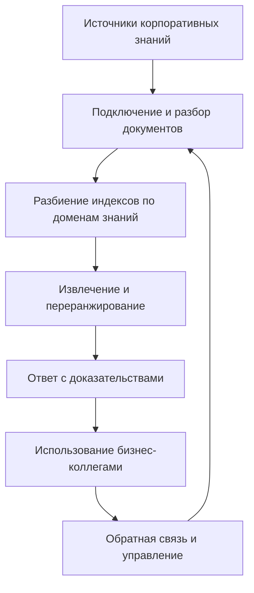
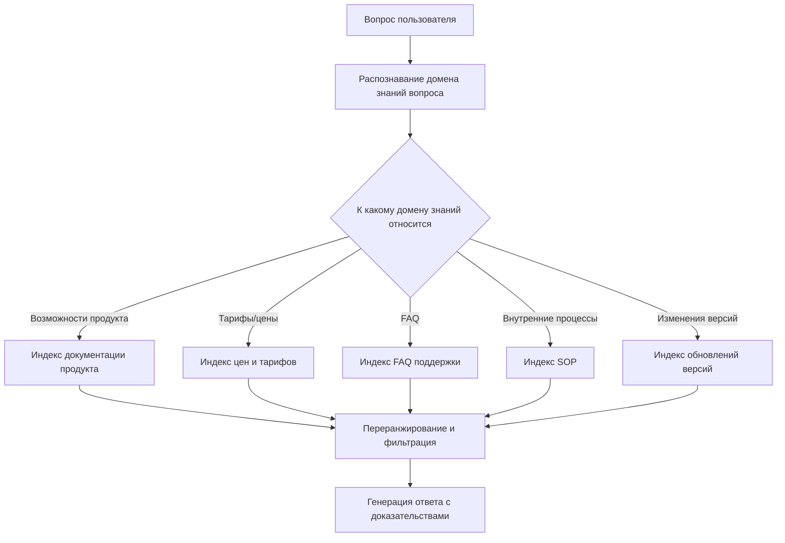

# Практика корпоративной базы знаний: создаём внедряемую RAG-систему на LlamaIndex

Если LangGraph лучше подходит для решения вопроса «как должны работать поддержка или Agent», то LlamaIndex лучше решает другую, не менее важную задачу: как корпоративные знания должны подключаться, организовываться, извлекаться и использоваться в ответах.

Эта глава посвящена только корпоративной базе знаний. Акцент не на написании большого объёма кода, а на понимании того, какие именно проблемы должна решать система знаний, действительно пригодная для внутреннего использования в компании.

# Быстрый старт

Если вы хотите начать прямо сейчас, представьте такой очень простой сценарий:

Ваши коллеги из отдела продаж каждый день задают вам одни и те же типы вопросов, например: «Поддерживает ли корпоративная версия эту функцию», «Чем новая версия отличается от старой», «Как лучше сформулировать этот текст, чтобы отправить клиенту». Ваша задача — собрать эти ответы, разбросанные по документации продукта, FAQ и логам обновлений, в единого внутреннего помощника по знаниям, к которому можно обратиться в любой момент и который отвечает максимально стабильно.

Если вам нужно запомнить только одну фразу, то вот она:

> Корпоративная база знаний — это не «скормить PDF модели», а «превратить разрозненные знания в сопровождаемую, поисковую и отслеживаемую точку входа».

# 1. Бизнес-сторона: сначала решите, какую проблему должна решать эта база знаний

Корпоративную базу знаний проектируют не с вопроса «какой фреймворк извлечения подключить», а с вопроса «что именно бизнес-команда переспрашивает изо дня в день».

Если эти вопросы не продуманы, то позже, какой бы подход вы ни выбрали — LlamaIndex, другой RAG-фреймворк или собственное решение, — система легко превратится в нечто, что «искать умеет, но пользоваться неудобно».

## 1.1 Сначала воспринимайте базу знаний как систему знаний, а не как страницу загрузки

Многие, кто делают базу знаний впервые, естественно думают:

> «Загрузить все документы — и готово, разве нет?»

Но в реальной корпоративной среде у знаний как минимум есть такие особенности:

1. Источников много — это не просто куча PDF
2. Обновления частые — старые ответы быстро устаревают
3. У разных документов разная достоверность
4. Что-то является документами, а что-то — базами данных или таблицами конфигурации
5. На некоторые вопросы нельзя ответить только по документам — нужно сочетать с системами реального времени

Поэтому корпоративная база знаний на самом деле решает не вопрос «есть ли документ», а:

1. Где искать
2. Какой источник наиболее достоверен
3. Как избежать помех от старых версий
4. Как, найдя нужное, стабильно организовать это в ответ

Ниже схема, которая очень подходит для введения в корпоративную базу знаний:



Самый важный сигнал этой схемы: корпоративная база знаний — это не разовый проект, а цикл непрерывного управления.

## 1.2 Проектируйте на реальном бизнес-сценарии

Чтобы не было слишком абстрактно, зададим очень распространённый сценарий корпоративной базы знаний:

Вы делаете **внутреннего корпоративного помощника по знаниям о продукте**, обслуживающего поддержку, продажи и команду внедрения.

Вопросы, на которые он должен отвечать, обычно такие:

- «Может ли корпоративная версия настроить несколько процессов согласования?»
- «Клиент спрашивает: что конкретно за дополнительное управление правами по сравнению с базовой версией?»
- «Эту функцию видит только администратор или ей могут пользоваться и обычные участники?»
- «Почему я помню, что раньше в документации был лимит в 100 человек, а теперь, кажется, нет?»
- «Можете подготовить текст с описанием обновлений, подходящий для отправки клиенту?»

Все эти вопросы очень похожи на реальный рабочий язык, а не на запросы к базе данных.

Именно поэтому первый шаг корпоративной базы знаний — не «векторизация», а признание того, что:

> То, как спрашивает пользователь, и то, как написана корпоративная документация, часто не один и тот же язык.

Вы можете сначала с помощью одного prompt реализовать понимание вопроса и маршрутизацию знаний:

```text
Ты — «помощник по пониманию вопросов и маршрутизации знаний» в системе корпоративной базы знаний.

Твоя задача:
1. Определи, к какому домену знаний относится вопрос пользователя: функции продукта, тарифы и цены, FAQ, внутренние SOP, обновления версий.
2. Определи, что подходит больше: посмотреть документацию, FAQ или нужно сочетать с бизнес-системой.
3. Если вопрос затрагивает конфликт старой и новой версий, в приоритете напомни системе обращать внимание на документацию последней версии.
4. Если вопрос выходит за пределы возможностей базы знаний, не выдумывай, а чётко укажи, что нужно проверить в бизнес-системе или подтвердить вручную.

Формат вывода:
- Домен знаний вопроса:
- Рекомендуемый источник запроса:
- Возможен ли конфликт версий:
- Нужно ли дополнение из бизнес-системы:
- Подсказка по извлечению для вышестоящей системы:
```

Ценность этого prompt в том, чтобы сначала правильно сделать вещь «где искать знания».

## 1.3 Самое ключевое в дизайне корпоративной базы знаний — не извлечение, а разбиение

Чаще всего причина плохого результата корпоративной базы знаний не в том, что модель слаба, а в том, что все документы свалены в одну кашу.

Подход, более похожий на корпоративный проект, обычно сначала разбивает по доменам знаний, например:

1. Документация функций продукта
2. Описание тарифов и цен
3. FAQ поддержки
4. Внутренние SOP
5. Логи обновлений версий

Почему так лучше? Потому что когда пользователь спрашивает:

> «Какие возможности добавились в последней версии?»

и когда пользователь спрашивает:

> «Каковы правила возврата средств?»

очевидно, что в приоритете не стоит искать в одном и том же материале.

Ниже схема маршрутизации, более близкая к дизайну извлечения корпоративной базы знаний:



Вот почему LlamaIndex очень подходит для корпоративной базы знаний. Он не просто помогает вам «делать векторное извлечение», а удобнее помогает организовать знания из разных источников, разных тем и с разными правилами.

# 2. Техническая сторона: затем решите, как реализовать эти функции

Когда на бизнес-стороне уже продумано «какие вопросы наиболее частые, какие домены знаний нужно разбить, на какие вопросы нельзя отвечать только по документам», только тогда становится ясной цель технической стороны.

То, что вам на самом деле нужно реализовать, — обычно не «большое всеобъемлющее окно чата», а следующие модули:

1. Модуль маршрутизации вопросов
2. Модуль подключения и разбора документов
3. Модуль индексирования по нескольким доменам знаний
4. Модуль извлечения и переранжирования
5. Модуль ответа с доказательствами
6. Модуль контроля версий и авторитетных источников

## 2.1 Как реализовать переход между модулями

Если вы хотите представить эту систему как инженерные модули, можно сначала посмотреть на предельно простой каркас:

```ts
type KnowledgeQuery = {
  question: string
  domain?: "product" | "pricing" | "faq" | "sop" | "release_notes"
  needsBusinessData?: boolean
}

function answerWithKnowledgeBase(query: KnowledgeQuery) {
  const routed = routeQuery(query)
  const docs = retrieveDocuments(routed)
  const ranked = rerankDocuments(docs, routed)
  return generateGroundedAnswer(ranked, routed)
}
```

Этот код намеренно не использует конкретный API фреймворка. Он лишь помогает уловить основу корпоративной базы знаний: сначала маршрутизация, затем извлечение, затем переранжирование и в конце ответ на основе доказательств.

## 2.2 Управление, границы и доказательства

Если вы посмотрите на кейсы, более близкие к корпоративным, то увидите, что по-настоящему трудно не сам ответ, а управление.

У корпоративной базы знаний обычно как минимум должно быть следующее понимание:

### Понимание версий

Пользователь спрашивает:

> «Я помню, что раньше в документации был лимит в 100 человек, он всё ещё такой?»

Главный риск таких вопросов не в том, что не получится найти, а в том, что найдётся старое правило.

Поэтому корпоративная система обязательно должна максимально обеспечивать:

1. Приоритет последней версии
2. Различение исторических документов
3. Недопущение перекрытия текущих правил старыми документами

### Понимание авторитетного источника

По одному и тому же вопросу FAQ, руководство по продукту, скрипты продаж и внутренние SOP могут быть написаны не совсем одинаково.

Корпоративная система обязательно должна определить:

1. Кто является эталоном по умолчанию
2. Какие типы документов можно использовать только для внутренней справки
3. Какие типы документов можно озвучивать вовне

### Понимание границ системы

База знаний может отвечать на:

1. Правила
2. Определения
3. Описание функций
4. Объяснение процессов

Но она не должна сама по себе отвечать на:

1. Подключена ли уже функция у конкретного клиента
2. На каком этапе сейчас находится конкретный возврат средств
3. Каков текущий статус прав конкретного аккаунта

Для таких вопросов часто ещё нужна бизнес-система.

Поэтому одна из важнейших способностей зрелой базы знаний — знать, когда сказать:

> «Этот вопрос требует запроса в бизнес-системе, сейчас я могу только подтвердить правило, но не могу напрямую подтвердить текущий статус.»

# 5. Какие данные, оценку и обработку исключений нужно подготовить для корпоративной базы знаний

Данные, на которые реально опирается корпоративная база знаний, обычно делятся на три слоя:

1. Данные на стороне документов: источник, версия, время обновления, домен знаний, уровень авторитетности
2. Данные на стороне запросов: вопрос пользователя, попавший домен знаний, результаты извлечения, цепочка доказательств
3. Данные на стороне эксплуатации: какие вопросы часто задают, какие ответы часто переписывают, какие документы часто цитируют, на какие вопросы часто отвечают неверно

Настоящая корпоративная база знаний должна особенно внимательно относиться к badcase.

Самые частые badcase включают:

1. Процитирован старый документ
2. Смешаны формулировки разных подразделений
3. Кажется, что ответ верный, но источник доказательств неавторитетный
4. В документах нет ответа, но вывод всё равно был выдуман
5. Нужно было запросить бизнес-систему, но запросили только документы

Вы можете с помощью следующего prompt сделать ограничение по доказательствам более устойчивым:

```text
Ты — «помощник по ответам с доказательствами» в системе корпоративной базы знаний.

Отвечай на вопрос строго на основе найденного справочного содержания:
1. В приоритете используй самые свежие и авторитетные материалы.
2. Если разные материалы конфликтуют, чётко укажи конфликт и не выдумывай единый вывод сам.
3. Если доказательств недостаточно, чётко укажи «по текущим материалам подтвердить невозможно».
4. Если вопрос относится к статусу бизнеса в реальном времени, чётко укажи, что нужно запросить бизнес-систему.

Формат вывода:
- Ключевой вывод:
- Источник обоснования:
- Есть ли конфликт версий:
- Нужно ли дополнение из бизнес-системы:
- Сообщение пользователю:
```

Если вы хотите реализовать «ответ с доказательствами» как предельно простой модуль, можно понимать это так:

```ts
function generateGroundedAnswer(docs: string[], query: KnowledgeQuery) {
  if (docs.length === 0) {
    return "По текущим материалам подтвердить невозможно, нужно дополнить источник знаний или передать вопрос на ручное подтверждение."
  }
  return llmAnswer({
    question: query.question,
    evidence: docs,
    rule: "Отвечай только на основе доказательств; при недостатке доказательств чётко скажи, что не знаешь."
  })
}
```

Самое важное в этом коде не реализация, а принцип: при недостатке доказательств система должна уметь остановиться.

Настоящий профессионализм корпоративной базы знаний часто проявляется именно здесь: не в том, чтобы ответить длинно, а в том, чтобы ответить устойчиво.

## 2.3 Минимальная маршрутизация по доменам знаний

Если записать «маршрутизацию по доменам знаний» в виде минимального кода, обычно это выглядит так:

```ts
function routeQuery(query: KnowledgeQuery) {
  if (query.question.includes("цена") || query.question.includes("тариф")) {
    return { ...query, domain: "pricing" }
  }
  if (query.question.includes("обновление") || query.question.includes("последняя версия")) {
    return { ...query, domain: "release_notes" }
  }
  return { ...query, domain: "product" }
}
```

В реальном проекте, конечно, не полагаются только на ключевые слова, но этот минимальный пример очень ценен, потому что показывает одну мысль: ключ корпоративной базы знаний не в том, чтобы «обыскать все документы», а в том, чтобы «сначала максимально искать в нужном месте».

# 3. Заключение: как понять, достаточно ли она корпоративного уровня

База знаний, которую компания действительно может использовать долгосрочно, обычно как минимум должна удовлетворять этим пунктам:

1. Есть управление знаниями, а не только загрузка документов
2. Есть разбиение по доменам знаний, а не один супер-большой индекс
3. Есть понимание версий — исторические правила не перекрывают текущие
4. Есть контроль прав — не все видят одинаковый контент
5. Есть оценка и трассировка — можно постоянно знать, где ответили неверно

Чтобы было ещё полнее, вам лучше также подготовить:

- Управление жизненным циклом документов
- Определение авторитетных источников
- Стратегию обновлений
- Доказательность ответов
- Путь деградации при сбое
- Замкнутый цикл обратной связи от использования

Без этого система в лучшем случае останется лишь «Demo-вопросником по документам».

# 4. Рекомендуемый порядок внедрения

Рекомендуется двигаться в таком порядке:

1. Сначала выберите узкий бизнес-объект
2. Сначала соберите реальные вопросы, а затем решайте, какие источники знаний подключать
3. Сначала сделайте разбиение по доменам знаний, а затем сложное извлечение
4. Сначала решите проблемы доказательств и версий, а затем добивайтесь более естественных ответов
5. В последнюю очередь думайте о более глубокой интеграции с Agent, системой поддержки, CRM

# Итог

LlamaIndex лучше всего подходит не для «ещё одного фреймворка, умеющего общаться», а для слоя доступа к корпоративным знаниям и данным.

Когда вы повышаете базу знаний от «страницы загрузки» до системы «управления знаниями, маршрутизированного извлечения, ответов с доказательствами, непрерывного обновления», вы действительно входите в проектирование корпоративной базы знаний.

# Больше публичных кейсов и дополнительное чтение

Если вы хотите продолжить углубляться в корпоративном направлении, эти материалы стоит изучить больше всего:

1. **Jeppesen (подразделение Boeing)**
   Подходит, чтобы увидеть, почему в сценарии инженерных знаний база знаний — это прежде всего инфраструктура продуктивности.

2. **Microsoft + LlamaIndex**
   Подходит, чтобы увидеть, как корпоративная точка входа в знания становится частью корпоративной AI-платформы.

3. **Коллекция кейсов LlamaIndex Customers и официального сайта**
   Подходит, чтобы увидеть различия во внедрении базы знаний в разных сценариях — KPMG, Rakuten, Salesforce, Cemex и др.

4. **LlamaCloud**
   Подходит, чтобы увидеть проблемы уровня подключения, разбора, синхронизации и долгосрочного сопровождения корпоративных документов.

5. **Страницы Use Cases и Q&A**
   Подходят, чтобы увидеть, как корпоративная база знаний служит основой для систем поддержки клиентов, корпоративного поиска, исследовательских помощников и т. д.

# Reference

- LlamaIndex Use Cases: [https://docs.llamaindex.ai/en/stable/use_cases/](https://docs.llamaindex.ai/en/stable/use_cases/)
- LlamaIndex Q&A Use Cases: [https://docs.llamaindex.ai/en/stable/use_cases/q_and_a/](https://docs.llamaindex.ai/en/stable/use_cases/q_and_a/)
- LlamaIndex Customers: [https://www.llamaindex.ai/customers](https://www.llamaindex.ai/customers)
- LlamaIndex Homepage: [https://www.llamaindex.ai/](https://www.llamaindex.ai/)
- Jeppesen Customer Story: [https://www.llamaindex.ai/customers/jeppesen-a-boeing-company-saves-2-000-engineering-hours-with-unified-chat-framework](https://www.llamaindex.ai/customers/jeppesen-a-boeing-company-saves-2-000-engineering-hours-with-unified-chat-framework)
- Microsoft Customer Story: [https://www.microsoft.com/en/customers/story/23695-llamaindex-azure-open-ai-service](https://www.microsoft.com/en/customers/story/23695-llamaindex-azure-open-ai-service)
- LlamaCloud Documentation: [https://docs.cloud.llamaindex.ai/](https://docs.cloud.llamaindex.ai/)
- LlamaCloud in Docs: [https://docs.llamaindex.ai/en/latest/llama_cloud/](https://docs.llamaindex.ai/en/latest/llama_cloud/)
