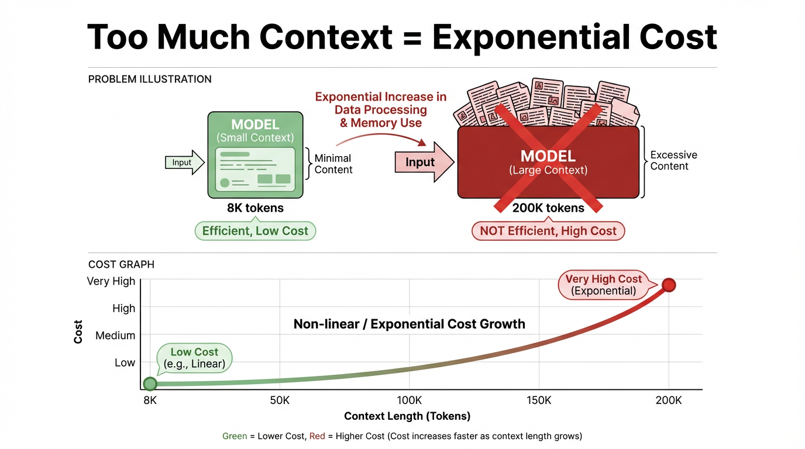
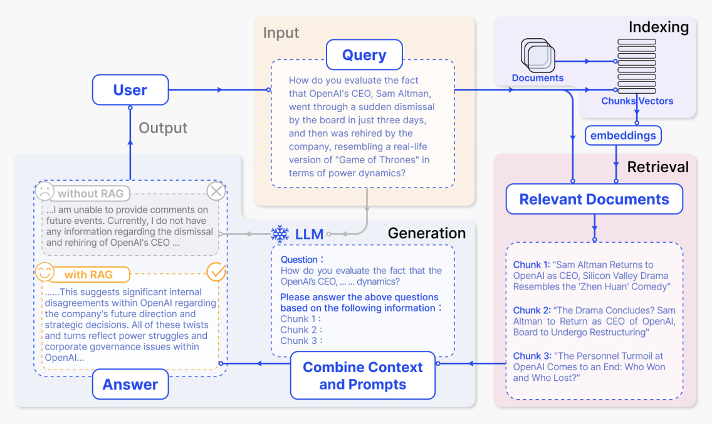
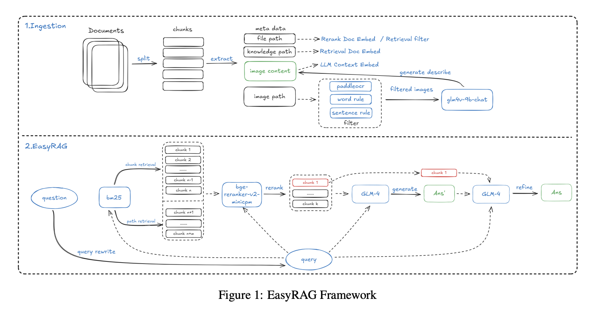

По мере того как большие языковые модели (LLM) находят всё более широкое применение, предприятия сталкиваются с очень практической проблемой: как модель может точно отвечать на вопросы, когда эти вопросы зависят от внутренних документов, данных реального времени или предметно-специфичных знаний? Ведь обучающие данные модели ограничены и привязаны ко времени, поэтому она не может охватить специфичные для компании бизнес-знания или постоянно обновляющуюся информацию.

Одна интуитивная идея такова: раз контекстные окна продолжают расти — от 8K до 128K, а теперь и за пределы миллиона токенов, — почему бы просто не запихнуть нужные документы в промпт и не позволить модели отвечать прямо по этим материалам?

Однако уметь обрабатывать длинный контекст и уметь стабильно, эффективно и управляемо выдавать правильные ответы в корпоративных сценариях — это две совершенно разные вещи. Слепая опора на длинный контекст порождает целый ряд серьёзных проблем, включая взрывной рост стоимости, размывание внимания и устаревание знаний.

Чтобы решить эти болевые точки, появилась техника под названием Retrieval-Augmented Generation, или RAG (генерация с дополнением через поиск). Прежде чем модель сгенерирует ответ, RAG сначала извлекает точные внешние знания. По сравнению с простым «лобовым» расширением длины контекста, RAG отвечает требованиям предприятий к фактической точности и свежести знаний при меньшей стоимости, более высокой точности и большей управляемости. Поэтому он стал ключевой основой для построения заслуживающих доверия приложений ИИ.

В этом руководстве мы систематически объясним, что такое RAG, проследим предысторию его появления и его базовые принципы, а затем рассмотрим его эволюцию от базовых форм к продвинутым, а также то, куда он может развиваться дальше.

# Чему вы научитесь в этом уроке

- Ключевая ценность RAG: глубоко понять, как он решает центральные проблемы длинного контекста — стоимость, внимание и свежесть знаний
- Как работает RAG: на конкретных примерах увидеть, как он проходит полный цикл от поиска до генерации
- Эволюция RAG: от базового Naive RAG к Advanced RAG и далее к Modular RAG
- Выбор моделей для RAG: понять, как оценивать и выбирать три ключевых типа моделей — Embedding, Rerank и LLM
- Практика корпоративного RAG: изучить руководство по построению полной цепочки от предобработки данных до развёртывания и оценки системы
- Оценка и оптимизация RAG: разобраться в ключевых метриках, основных фреймворках и методах непрерывного улучшения
- Передовые тренды в RAG: исследовать, как RAG объединяется с агентами, мультимодальностью и другими новыми техниками

# Что вы получите

После прохождения этого руководства вы сформируете системное понимание технологии RAG на уровне начинающего. Вы будете не только знать, что это такое, но и понимать, почему это работает. Вы также получите ясный план того, как оценивать, выбирать и проектировать эффективную, надёжную и управляемую RAG-систему, отвечающую требованиям предприятий, что заложит прочный фундамент для построения настоящих корпоративных RAG-приложений.

# 1. Зачем нужен RAG

Retrieval-Augmented Generation (RAG) — один из важнейших технических подходов в современном генеративном ИИ. Его базовая идея проста: прежде чем попросить большую модель сгенерировать ответ, система сначала извлекает информацию, связанную с вопросом пользователя, из внешней базы знаний, а затем передаёт модели как извлечённую информацию, так и исходный вопрос, чтобы модель могла отвечать, опираясь на реальные материалы. Эта внешняя база знаний может быть внутренними политиками предприятия, технологическими документами и знаниями о продуктах либо отраслевой базой данных, нормативным корпусом, библиотекой стандартов и так далее.


Здесь возникает естественный вопрос: если большие модели уже умеют «отвечать на вопросы напрямую», зачем добавлять ещё один слой под названием Retrieval-Augmented Generation? Особенно теперь, когда контекстные окна становятся всё больше и больше, может показаться, что простая передача модели всех релевантных материалов должна решать большинство потребностей.

Настоящая разница в том, что «уметь выдать ответ» и «уметь непрерывно, стабильно и управляемо выдавать правильный ответ в реальной бизнес-среде» — это две совершенно разные вещи. Если опираться только на параметрическую память модели или только на загрузку больших объёмов документов в длинный контекст, в корпоративном применении всё равно проявляются как минимум три типичные проблемы.

1. Проблемы стоимости и эффективности:
   Даже по мере расширения контекстных окон идея загружать все документы в контекст сразу по-прежнему непрактична в реальных системах. Главное противоречие проявляется в двух местах:
2. Стоимость вывода (inference) сильно положительно коррелирует с длиной контекста. Чем длиннее контекст, тем больше растёт стоимость вывода — почти линейно, а иногда даже сверхлинейно. Для одного вызова 8K токенов и 200K токенов находятся в совершенно разных диапазонах цены и задержки, и у длинного контекста гораздо более высокий стоимостный порог.

   

   > По смыслу контекст — это фоновая информация и история разговора, на которые модель «опирается», отвечая на вопрос. С технической точки зрения это полная последовательность токенов, подаваемая в модель за один вывод, например системные и пользовательские инструкции, история сообщений и извлечённые фрагменты.
   >
   > «Контекстное окно» — это предел ёмкости для такого входа. В современных основных архитектурах больших моделей, таких как Transformer, эти токены участвуют в вычислении внимания на каждом слое. Как только окно становится длиннее и число токенов растёт, вычисления и стоимость растут мультипликативно и могут даже приближаться к экспоненциальному росту.

3. Впустую тратится большой объём вычислений. Большинству задач нужен лишь очень небольшой объём информации, высокорелевантной текущему вопросу. Запихивание всего набора документов в контекст создаёт серьёзные простаивающие и впустую потраченные вычисления, снижает пропускную способность системы, замедляет скорость ответа и в итоге вредит пользовательскому опыту.
4. Проблемы внимания и фокуса:
   Большая модель может быть способна «охватить» сверхдлинный контекст, но она не может использовать каждый его сегмент с одинаковым качеством. Как только длина контекста переходит определённый порог, модель начинает проявлять явный перекос внимания:
5. Затухание внимания: внимание модели к ранним и средним частям контекста постепенно ослабевает, и она склонна больше опираться на текст, прочитанный позже, поэтому ранняя критически важная информация может фактически игнорироваться.
6. Информационные помехи: модель легко может быть сбита с курса нерелевантной, повторяющейся или даже противоречивой информацией внутри контекста. Итоговый ответ может звучать логически связно, но при этом отклоняться от сути вопроса, из-за чего точность трудно гарантировать.
   Без стадии поиска для фильтрации и ранжирования по релевантности чем длиннее становится контекст, тем труднее удерживать ответ сфокусированным на действительно ключевых доказательствах. Преимущество длинного контекста может быть полностью сведено на нет информационными помехами.
7. Проблемы свежести знаний и управляемости:
   Если все знания хранятся целиком в параметрах модели или вручную копируются в промпты, проявляются два неизбежных недостатка:
8. Обновление знаний затруднено: как только знания меняются — например, изменения политик, итерации продуктов или обновления цен, — вам либо нужно переобучать или дообучать модель, что дорого и медленно, либо вручную поддерживать шаблоны промптов, что тоже дорого и подвержено человеческим ошибкам.
9. Прослеживаемость низкая: когда модель отвечает, часто трудно локализовать точные фрагменты доказательств ни в чёрном ящике параметров, ни в длинных промптах. Это крайне затрудняет аудиты на соответствие, объяснение рисков и другие задачи, требующие ясных оснований для решений.

В этих реальных ограничениях преимущество RAG становится гораздо яснее. Его ключевой подход — локализовать релевантную и надёжную информацию до генерации, чтобы модель отвечала только по необходимым знаниям. Знания могут храниться независимо во внешней базе знаний, что упрощает их обновление и управление. При этом сгенерированные результаты могут включать цитируемые источники, повышая интерпретируемость и доверие. Даже если контекстные окна продолжат расти в будущем, RAG по-прежнему будет обеспечивать эффективное управление и использование знаний при относительно низкой стоимости, поддерживая корпоративные приложения знаний, процесс которых наблюдаем, а поведение прослеживаемо.

С точки зрения требований предприятий, по сравнению с традиционной LLM, опирающейся только на свои внутренние параметры, RAG в основном решает следующие реальные проблемы развёртывания:

1. Свежесть:
   Традиционные модели обычно не знают о новых нормах, продуктах или рабочих процессах, появившихся после даты отсечки обучения, но RAG может напрямую читать новейшие документы политик, бизнес-базы данных и базы знаний. Без частого переобучения ответы могут оставаться синхронизированными с последним состоянием бизнеса.
2. Специализация:
   В вертикальных областях, таких как здравоохранение, химия или финансы, универсальные модели часто понимают недостаточно глубоко или говорят недостаточно точно. После подключения принадлежащих предприятию предметных документов и отраслевых стандартов ответы могут опираться на авторитетные материалы и становиться гораздо ближе к реальной бизнес-практике.
3. Галлюцинации:
   Требуя, чтобы ответы оставались привязанными к извлечённым фрагментам и сопровождались цитатами, система может на уровне механизма снижать необоснованные выдумки, делая «звучит правдоподобно» гораздо ближе к «действительно правда».
4. Объяснимость и аудируемость:
   Чисто параметрические модели часто не могут ответить на вопрос «из какого правила выведен этот вывод?». RAG позволяет проследить каждый ответ до конкретного пункта политики, бизнес-документа или исторического случая. Это помогает бизнес-сотрудникам проверять и исправлять ответы и даёт командам аудита, рисков и комплаенса нужную прослеживаемость.
5. Стоимость вычислений и эффективность ресурсов:
   Заставить модель запомнить все знания предприятия в своих параметрах обычно означает более крупную модель и более высокую стоимость вывода. RAG хранит большую часть знаний вне модели — в векторных хранилищах и хранилищах документов — и извлекает их по требованию, позволяя предприятиям получать более широкое покрытие и более точные детали даже при меньших моделях и ограниченных вычислениях.

Поэтому для предприятий, которые хотят долгосрочно, стабильно и управляемо использовать большие модели в реальных бизнес-сценариях, RAG — не опциональное улучшение. Это практически необходимая фундаментальная технология для построения высококачественной системы корпоративных приложений знаний.

# 2. Что такое RAG

Ключевая идея RAG, Retrieval-Augmented Generation, в том, чтобы позволить большой модели отвечать на вопросы не только статическими знаниями, выученными при обучении, но и актуальной и надёжной информацией, извлекаемой из внешней базы знаний во время выполнения.

В типичной RAG-системе вопрос пользователя не отправляется напрямую большой модели. Вместо этого модуль поиска сначала находит наиболее релевантные фрагменты документов из корпоративной базы знаний, затем объединяет эти фрагменты с исходным вопросом в полный контекст и в конце передаёт его модели для генерации ответа. Этот паттерн «сначала найти, потом сгенерировать» позволяет модели рассуждать на основе реальных справочных материалов, а не только угадывать по тому, что она помнит в своих параметрах. Рассмотрим типичный случай:



1. Стадия индексации

   На стадии индексации система сначала обрабатывает исходные материалы, такие как внутренние документы предприятия, веб-страницы и отчёты. Она разбивает их на более мелкие семантические фрагменты, затем использует модель эмбеддингов для генерации векторных представлений каждого фрагмента и строит индекс. Позже, когда поступает вопрос пользователя, система может быстро найти наиболее семантически похожие фрагменты в векторном пространстве.

   На диаграмме этому соответствует фиолетовая область «Indexing» в правом верхнем углу. Путь от «Documents» через «Chunks / Vectors» к «embeddings» показывает, как документы разбиваются на фрагменты, преобразуются в векторы и записываются в индекс. Более конкретно:

   - Документы делятся на набор семантически связных фрагментов, каждый из которых может соответствовать короткому новостному отрывку, объяснению или анализу.
   - Каждый фрагмент преобразуется моделью эмбеддингов в высокоразмерный вектор и сохраняется в векторном индексе.
   - Этот индекс впоследствии поддерживает поиск по сходству, подготавливая базу знаний, к которой система может обращаться при ответах на вопросы.

2. Стадия поиска плюс генерация ответа по найденным результатам

   После того как пользователь задаёт вопрос, система сначала извлекает релевантное содержимое из индекса, затем отправляет вопрос и найденный текст вместе большой модели для генерации ответа. На рисунке ключевые области сверху вниз и справа налево в точности соответствуют этому полному потоку.

   (1) Вопрос, введённый пользователем: жёлтая область Input - Query

   > «Как вы оцениваете тот факт, что CEO OpenAI Сэм Альтман всего за три дня прошёл через внезапное увольнение советом директоров, а затем был вновь нанят компанией, что по динамике власти напоминает реальную версию „Игры престолов“?»
   >
   > «Как вы оцениваете тот факт, что CEO OpenAI Сэма Альтмана внезапно уволил совет директоров, а затем компания вновь наняла его всего три дня спустя, сделав борьбу за власть похожей на реальную версию „Игры престолов“?»

   Этот большой блок текста — содержимое поля «Query» на диаграмме, соответствующее вопросу пользователя на естественном языке. Система векторизует этот вопрос и использует его для поиска связанных фрагментов документов в индексе в правом верхнем углу.

   (2) Найденные релевантные документы: розовая область Relevant Documents в правом нижнем углу

   После поиска система получает несколько фрагментов документов, наиболее связанных с вопросом. На диаграмме они показаны как три фрагмента:

   > «Сэм Альтман возвращается в OpenAI на пост CEO, драма Кремниевой долины напоминает комедию „Чжэнь Хуань“»
   > «Сэм Альтман возвращается на пост CEO OpenAI, и эта драма Кремниевой долины напоминает комедию о придворных интригах.»
   >
   > «Драма завершается? Сэм Альтман вернётся на пост CEO OpenAI, совет директоров будет реструктурирован»
   > «Драма заканчивается? Сэм Альтман вернётся на пост CEO OpenAI, а совет директоров будет реструктурирован.»
   >
   > «Кадровая буря в OpenAI подходит к концу: кто выиграл, а кто проиграл?»
   > «Кадровая буря в OpenAI подходит к концу: кто выиграл, а кто проиграл?»

   (3) Объединить промпт и сгенерировать ответ: синяя область LLM / Combine Context and Prompts

   Затем система объединяет исходный вопрос пользователя и найденные фрагменты в полный промпт и отправляет его модели. Пунктирная рамка в нижней средней части рисунка показывает пример промпта:

   > «Вопрос:
   > Как вы оцениваете тот факт, что CEO OpenAI, ... динамику?
   >
   > Пожалуйста, ответьте на приведённые выше вопросы на основе следующей информации:
   > Chunk 1:
   > Chunk 2:
   > Chunk 3:»
   >
   > «Вопрос:
   > Как вы оцениваете борьбу за власть в инциденте с CEO OpenAI?
   >
   > Пожалуйста, ответьте на приведённый выше вопрос на основе информации ниже:
   > Chunk 1:
   > Chunk 2:
   > Chunk 3:»

   (4) Сравнение ответа с RAG и без RAG: серая и жёлтая области Output - Answer в нижнем левом углу

   Наконец, модель генерирует ответ на основе предоставленной информации. На рисунке также сравниваются результаты с RAG и без RAG. Без RAG у модели нет внешних материалов, и она может дать лишь расплывчатый ответ, соответствующий серой рамке:

   > «... Я не могу комментировать будущие события. В настоящее время у меня нет никакой информации об увольнении и повторном найме CEO OpenAI ...»

   С RAG модель может использовать найденные новости и анализ, чтобы выдать гораздо более содержательный ответ, соответствующий жёлтой рамке:

   > «... Это указывает на значительные внутренние разногласия в OpenAI относительно будущего направления компании и стратегических решений. Все эти повороты отражают борьбу за власть и проблемы корпоративного управления внутри OpenAI ...»

Приведённый выше пример показывает полный поток типичной RAG-системы и помогает понять её ключевые стадии и то, как информация движется через них. Но многие важные технические детали остаются внутри чёрного ящика: как именно выполняется сопоставление векторов и как следует организовать промпт, чтобы модель могла эффективнее использовать найденное содержимое? Эти детали в значительной мере определяют реальное качество RAG. Далее мы углубимся во внутренний механизм RAG и разберём его шаг за шагом — от принципов векторизации и вычисления сходства до инженерии промптов.

# 3. Как работает RAG

Мы можем разобрать это на простом примере вопросов и ответов, построенном на базе знаний о «яблоке» (apple).

## 3.1 Стадия векторизации документов

Предположим, у нас есть упрощённая база знаний, содержащая эти три фрагмента документов:

1. Фрагмент A: Компания Apple Inc. была основана 1 апреля 1976 года Стивом Джобсом, Стивом Возняком и Рональдом Уэйном, её штаб-квартира находится в Купертино, Калифорния.
2. Фрагмент B: Яблоки — это фрукт, богатый витамином C и пищевыми волокнами, что способствует пищеварению и здоровью иммунной системы.
3. Фрагмент C: Компания Apple Inc. выпустила первый iPhone в 2007 году, коренным образом изменив индустрию смартфонов.

Когда мы обрабатываем эти документы моделью эмбеддингов, например `text-embedding-ada-002` от OpenAI или моделью BGE с открытым исходным кодом, каждый фрагмент преобразуется в высокоразмерный вектор, часто с 768, 1024 или 1536 измерениями.

> Вектор по сути — это массив, состоящий из множества числовых значений. Каждое измерение соответствует семантической характеристике текста. Например, вектор для «кота» может содержать измерения, связанные с млекопитающим, домашним питомцем и пушистостью. Итоговое сочетание значений отражает семантический смысл текста, чтобы компьютер мог «понимать» отношения между текстами.

Упрощённые примеры, при этом реальные векторы гораздо более высокоразмерны:

- Вектор для фрагмента A, об основании Apple: `[0.85, -0.23, 0.41, -0.56, 0.12, 0.78, ...]`
- Вектор для фрагмента B, о яблоках как фрукте: `[-0.12, 0.95, -0.34, 0.67, -0.89, 0.05, ...]`
- Вектор для фрагмента C, о выпуске iPhone: `[0.79, -0.18, 0.52, -0.61, 0.23, 0.81, ...]`

Затем эти векторы необходимо сохранить в векторной базе данных, такой как Pinecone, Weaviate или FAISS, для последующего поиска и отбора.

> База данных — это система, которая хранит данные и управляет ими структурированным образом, обеспечивая организованное хранение и эффективный поиск. Распространённые примеры — списки контактов и каталоги товаров в электронной коммерции.
>
> Векторная база данных — это специализированный вид базы данных. В отличие от традиционных баз данных, которые хранят текст, таблицы и другие обычные структуры данных, векторная база данных спроектирована специально для хранения векторов, то есть высокоразмерных числовых массивов, и оптимизирована для поиска по сходству в сценариях ИИ.

## 3.2 Стадия запроса пользователя, поиска и ответа

После того как база знаний была векторизована и сохранена, RAG-система может поддерживать запросы пользователей в реальном времени. Когда пользователь задаёт вопрос, система выполняет непрерывный поток: сначала преобразует вопрос в вектор, затем с помощью вычисления сходства извлекает наиболее релевантную информацию из базы знаний и в конце использует эти фрагменты как основу для генерации ответа. Мы можем проиллюстрировать этот процесс тремя конкретными запросами.

### Запрос 1: «Когда была основана компания Apple Inc.?»

На стадии векторизации запроса вопрос преобразуется моделью эмбеддингов в семантический вектор, например `[0.82, -0.21, 0.38, -0.58, 0.15, 0.76, ...]`. Этот числовой паттерн очень похож на сохранённый вектор фрагмента A — того, что об основании компании.

Затем система выполняет поиск по сходству, Top-K с K = 2, вычисляя косинусное сходство между вектором запроса и всеми векторами документов в базе знаний. Результат выглядит так:

- Сходство с фрагментом A, об основании: 0.97, высокая релевантность
- Сходство с фрагментом C, о выпуске iPhone: 0.88, релевантно, потому что тоже о компании
- Сходство с фрагментом B, о пищевой ценности фрукта: 0.12, почти нерелевантно

> Top-K — это распространённая стратегия отбора в векторном поиске. Она означает ранжирование всех совпадений от наибольшего сходства к наименьшему и сохранение топ-K результатов. K = 2 означает, что система оставляет только два документных вектора с наибольшим сходством и отфильтровывает менее релевантные, поэтому следующая стадия генерирует ответ только по двум наиболее релевантным фрагментам документов.

Результаты, отфильтрованные по сходству, называются результатами отбора (recall). Система возвращает топ-2 фрагмента как доказательства:

1. Фрагмент A, сходство 0.97: «Компания Apple Inc. была основана 1 апреля 1976 года Стивом Джобсом, Стивом Возняком и Рональдом Уэйном, её штаб-квартира находится в Купертино, Калифорния.»
2. Фрагмент C, сходство 0.88: «Компания Apple Inc. выпустила первый iPhone в 2007 году, коренным образом изменив индустрию смартфонов.»

На стадии генерации ответа система строит полный структурированный ввод, помещая отобранное содержимое в раздел справочной информации и отправляя его вместе с системным промптом:

```text
[System Prompt]
You are a professional question-answering assistant. Please answer strictly according to the "reference information" provided by the user.
If the reference information contains the answer, answer directly based on it.
If the reference information does not contain the answer, explicitly tell the user that "the question cannot be answered based on the currently available materials," and do not fabricate information.
Please indicate which information point your answer is based on.

[Retrieved Context]
Apple Inc. was founded on April 1, 1976 by Steve Jobs, Steve Wozniak, and Ronald Wayne, and its headquarters are in Cupertino, California.
Apple Inc. launched the first iPhone in 2007, fundamentally changing the smartphone industry.

[User Query]
When was Apple Inc. founded?
```

Получив этот структурированный ввод, LLM следует системной инструкции и рассматривает извлечённый контекст как единственный заслуживающий доверия источник для ответа. Её итоговый ответ выглядел бы так:

> Согласно предоставленной справочной информации, компания Apple Inc. была основана 1 апреля 1976 года. [Основание: Информация 1]

### Запрос 2: «Чем полезно есть яблоки?»

На стадии векторизации запроса этот вопрос преобразуется в семантический вектор, например `[-0.08, 0.92, -0.31, 0.71, -0.85, 0.08, ...]`. Его числовой паттерн очень похож на сохранённый вектор фрагмента B — того, что о пищевой ценности яблок.

Система снова выполняет поиск по сходству Top-K с K = 2 и вычисляет косинусное сходство:

- Сходство с фрагментом B, пищевая ценность фрукта: 0.95, высокая релевантность
- Сходство с фрагментом C, выпуск iPhone: 0.18, почти нерелевантно
- Сходство с фрагментом A, основание компании: 0.15, почти нерелевантно

Система возвращает топ-2 фрагмента как доказательства:

1. Фрагмент B, сходство 0.95: «Яблоки — это фрукт, богатый витамином C и пищевыми волокнами, что способствует пищеварению и здоровью иммунной системы.»
2. Фрагмент C, сходство 0.18: «Компания Apple Inc. выпустила первый iPhone в 2007 году, коренным образом изменив индустрию смартфонов.» Это связано лишь слабо и на практике часто отсекалось бы порогом.

Затем полный структурированный ввод строится так:

```text
[System Prompt]
You are a professional question-answering assistant. Please answer strictly according to the "reference information" provided by the user.
If the reference information contains the answer, answer directly based on it.
If the reference information does not contain the answer, explicitly tell the user that "the question cannot be answered based on the currently available materials," and do not fabricate information.
Please indicate which information point your answer is based on.

[Retrieved Context]
Apples are a fruit rich in vitamin C and dietary fiber, which helps digestion and immune-system health.
Apple Inc. launched the first iPhone in 2007, fundamentally changing the smartphone industry.

[User Query]
What are the benefits of eating apples?
```

Тогда её итоговый ответ выглядел бы так:

> Согласно предоставленной справочной информации, яблоки богаты витамином C и пищевыми волокнами, и употребление яблок способствует пищеварению и здоровью иммунной системы. [Основание: Информация 1]

### Запрос 3: «Какая сегодня погода?»

На стадии векторизации запроса этот вопрос становится семантическим вектором, связанным с погодой и метеорологией, например `[0.10, -0.05, 0.30, -0.12, 0.21, 0.08, ...]`. В семантическом пространстве этот вектор далёк от всех векторов документов про яблоки — будь то компания или фрукт, — поэтому значимого сходства не возникает.

Система снова выполняет поиск Top-K с K = 2. Поскольку тема вопроса не связана с базой знаний, общие оценки сходства все очень низкие:

- Сходство с фрагментом B, пищевая ценность фрукта: 0.18, крайне низкое
- Сходство с фрагментом C, выпуск iPhone: 0.10, почти нерелевантно
- Сходство с фрагментом A, основание компании: 0.08, почти нерелевантно

Top-K по-прежнему возвращает K лучших по рангу результатов, но в этом случае эти результаты не дают эффективных доказательств. На практике система часто применяет минимальный порог сходства и напрямую возвращает пустой отбор, то есть отсутствие валидных результатов, чтобы снизить нерелевантные помехи.

Двумя возвращёнными фрагментами всё равно были бы:

1. Фрагмент B, сходство 0.18: «Яблоки — это фрукт, богатый витамином C и пищевыми волокнами, что способствует пищеварению и здоровью иммунной системы.»
2. Фрагмент C, сходство 0.10: «Компания Apple Inc. выпустила первый iPhone в 2007 году, коренным образом изменив индустрию смартфонов.»

Тогда полный ввод был бы таким:

```text
[System Prompt]
You are a professional question-answering assistant. Please answer strictly according to the "reference information" provided by the user.
If the reference information contains the answer, answer directly based on it.
If the reference information does not contain the answer, explicitly tell the user that "the question cannot be answered based on the currently available materials," and do not fabricate information.
Please indicate which information point your answer is based on.

[Retrieved Context]
Apples are a fruit rich in vitamin C and dietary fiber, which helps digestion and immune-system health.
Apple Inc. launched the first iPhone in 2007, fundamentally changing the smartphone industry.

[User Query]
How is the weather today?
```

LLM сначала оценила бы, содержит ли справочная информация прямые сведения о погоде или метеоданные реального времени. Убедившись, что не содержит, она следовала бы инструкции и ответила бы, что не может ответить:

> На основе доступных в настоящее время материалов невозможно ответить на вопрос «Какая сегодня погода?», поскольку справочная информация содержит только содержимое, связанное с яблоками, пищевой ценностью фруктов и продуктами Apple Inc., и не содержит информации о погоде или метеоданных реального времени. [Основание: в извлечённом контексте нет информации, связанной с погодой]

Из этих трёх примеров мы видим ключевой момент диалоговой стадии RAG. Системный промпт определяет роль LLM и правила ответов, извлечённые доказательства дают конкретный и заслуживающий доверия материал, а вопрос пользователя определяет цель задачи. Именно этот паттерн структурированного ввода позволяет RAG эффективно направлять и ограничивать LLM, которая иначе могла бы галлюцинировать, превращая её в систему, выдающую стабильные и надёжные ответы. Он гарантирует, что модель используется для понимания и организации существующей информации, а не для выдумывания необоснованной информации.

# 4. Эволюция RAG

RAG возник не в эпоху больших моделей. В более ранних исследованиях уже содержались прототипы той же идеи. С исторической точки зрения RAG возник из осознания ограничений традиционных LLM. Ранние большие языковые модели зависели в основном от данных предобучения, и эти данные становились фиксированными после завершения обучения. Например, у таких моделей, как GPT-3, дата отсечки знаний была привязана к моменту сбора обучающих данных, и они не могли получить более позднее знание. Переобучение или дообучение LLM под конкретные области также требовало больших ресурсов и специализированной экспертизы, что делало это дорогим и сложным для быстрой итерации.

Корни RAG можно проследить до фреймворка DrQA в 2017 году, который впервые попытался объединить поиск с языковыми моделями. Затем крупный прорыв произошёл в 2020 году с Dense Passage Retrieval, или DPR, который использовал предобученные нейросетевые модели для семантического поиска вместо традиционных методов, основанных на частоте слов, таких как TF-IDF и BM25. В 2021 году RAG был формально предложен и систематизирован, став стандартным способом решения проблем отсечки знаний и галлюцинаций в LLM.

В целом эволюцию RAG можно разделить на три стадии:


## 4.1 RAG первого поколения: Naive RAG

Naive RAG — это самая базовая форма RAG. С инженерной точки зрения он следует очень прямому трёхшаговому потоку:

1. Предобработка и индексация документов. Исходные документы очищаются, разбиваются на текстовые фрагменты фиксированной длины, кодируются в векторы моделью эмбеддингов и записываются в векторную базу данных.
2. Поиск по сходству. Вопрос пользователя на естественном языке кодируется в вектор, и система выполняет поиск Top-K по сходству в векторном хранилище.
3. Простая генерация с дополнением через поиск. Найденные фрагменты напрямую конкатенируются с исходным вопросом, образуя длинный промпт, который отправляется LLM для генерации ответа.

Ценность этой стадии в том, что она с очень низким порогом подтвердила, что «искать перед ответом» действительно работает. По сравнению с опорой только на внутреннюю память модели она уже значительно снижает проблемы отсечки знаний и часть галлюцинаций, поэтому она сыграла важную роль в ранних прототипах, демо и вводных руководствах.

Однако ограничения RAG первого поколения тоже очевидны. Во-первых, стратегия разбиения на фрагменты обычно груба. Большинство систем просто делят по фиксированной длине, что может разрезать связный семантический абзац посередине или смешать несколько тем внутри одного фрагмента. Это вредит точности поиска и также усложняет понимание для LLM. Во-вторых, сигнал поиска слишком прост. Ранжирование обычно зависит только от векторного сходства и не использует более богатые структурированные подсказки, такие как ключевые слова, метки времени, достоверность источника или права доступа. В-третьих, результаты поиска почти не управляются: зашумлённые, повторяющиеся и даже противоречивые фрагменты могут запихиваться в контекст без изменений, из-за чего большие объёмы малоценной информации занимают и без того ограниченное контекстное окно.

Коротко говоря, первое поколение решило вопрос о том, нужен ли поиск. Но в вопросах того, как искать лучше и как разумнее использовать найденную информацию, оно по-прежнему оставалось на довольно примитивной стадии.

## 4.2 RAG второго поколения: Advanced RAG

По мере того как RAG переходил из демо в реальные бизнес-сценарии, требования к стабильности, управляемости и качеству вывода резко выросли. Второе поколение, обычно объединяемое под широким названием Advanced RAG, по-прежнему следует паттерну «сначала найти, потом сгенерировать», но вводит систематическое уточнение как до, так и после поиска. Иными словами, система больше не довольствуется тем, что просто что-то нашла. Теперь она стремится правильно хранить нужные вещи, ясно задавать правильные вопросы и тщательно управлять найденным контекстом.

До поиска фокус — на том, чтобы хорошо хранить и хорошо спрашивать:

- На стороне индексации разбиение эволюционирует от деления по фиксированной длине к семантически осознанному разбиению и иерархической индексации. Система может разбивать по границам глав, подразделов, абзацев или предложений в сочетании со скользящими окнами и многогранулярными индексными структурами.
- Каждый фрагмент документа может нести богатые метаданные, такие как источник, метка времени, автор, тема и тип документа, давая больше измерений для последующей фильтрации и ранжирования.
- На стороне запроса исходный вопрос пользователя можно переписать, расширить или декомпозировать с помощью таких техник, как Query Rewrite, Multi-Query, Sub-Query-декомпозиция и Step-back Prompting, преобразуя расплывчатые или разговорные пользовательские запросы в формы, которые поиск понимает лучше.

  > 1. Query Rewrite
  >
  > Ключевая идея — преобразовать расплывчатый, разговорный или нестандартный запрос пользователя в нормализованное выражение, которое поисковая система может легче понять, дополняя ключевую информацию и устраняя неоднозначность.
  >
  > - Например, «Как мне посмотреть завтрашнюю погоду в Пекине?» можно переписать во что-то более стандартизированное, например «Запросить завтрашнюю круглосуточную погоду в Пекине в реальном времени».
  > - Или «Порекомендуй хорошие фильмы» можно переписать, посмотрев историю пользователя, в «Порекомендуй высокооценённые детективные фильмы 2024 года».
  >
  > 2. Multi-Query
  >
  > Система генерирует из исходного вопроса несколько семантически связанных, но по-разному ориентированных запросов, чтобы снизить число пропущенных результатов и охватить скрытые потребности, которые пользователь явно не озвучил.
  >
  > 3. Sub-Query
  >
  > Для составных вопросов, содержащих несколько целей, система разбивает их на более мелкие и простые подзапросы, чтобы поиск мог точно сопоставить каждую потребность.
  >
  > 4. Step-back Prompting
  >
  > Система сначала генерирует более абстрактный вопрос более высокого уровня, затем использует его для направления поиска, снижая смещение, вызванное слишком узкой фокусировкой на деталях исходного вопроса.

После поиска фокус — на управлении тем, что было найдено:

- Выделенная rerank-модель или даже LLM может переранжировать документы-кандидаты так, чтобы наиболее важное и релевантное вопросу содержимое попало в контекст первым.
  > Rerank-модель — это ключевой компонент конвейера информационного поиска. Она выполняет ранжирование второй стадии над результатами-кандидатами, возвращёнными фазой отбора, используя более сильное семантическое понимание, часто на основе архитектур Transformer, чтобы исправить ошибки семантического ранжирования первой стадии и продвинуть вперёд результаты, наиболее соответствующие потребностям пользователя.
- Найденные фрагменты можно фильтровать, дедуплицировать и сжимать, чтобы удалить явно нерелевантные или сильно повторяющиеся фрагменты, снижая склонность систем с длинным контекстом игнорировать полезную информацию в середине.
- При необходимости лёгкое дообучение модели может повысить вероятность того, что LLM будет отвечать на основе найденных доказательств и включать явные цитаты или источники.

В целом Advanced RAG больше не сосредоточен только на том, нужен ли поиск или можно ли что-то найти. Вместо этого он решает три более крупные задачи: можно ли точно локализовать действительно критические фрагменты, является ли передаваемый большой модели контекст сжатым, хорошо структурированным и удобным для эффективного использования, и остаётся ли вся система стабильной и надёжной при наличии шума, конфликтов или потребностей в информации из нескольких источников.

Большое количество экспериментальных и инженерных свидетельств показывает, что Advanced RAG значительно превосходит Naive RAG по точности ответов, подавлению галлюцинаций, устойчивости системы и объяснимости. Именно поэтому он постепенно вытеснил традиционные базовые подходы и стал основной промышленной парадигмой построения RAG-систем сегодня.

## 4.3 RAG третьего поколения: Modular RAG

В сложных корпоративных приложениях требования часто охватывают несколько областей. В таких случаях простого линейного потока «найти, переранжировать и сгенерировать» часто недостаточно:

1. Одной и той же системе может потребоваться поддерживать простые FAQ, генерацию длинных отчётов, поиск по коду и обращения к базам данных.
2. Ей может потребоваться одновременно подключать векторные хранилища, полнотекстовый поиск, реляционные базы данных, графы знаний и внешние поисковые системы.
3. Ей может потребоваться сохранять предпочтения пользователя и исторические решения на протяжении нескольких раундов, а также применять проверки на соответствие и прослеживаемость ответов.

На этом фоне RAG начал эволюционировать в сторону модульной формы системы. Modular RAG больше не рассматривается как фиксированный конвейер. Вместо этого он трактуется как набор подключаемых, заменяемых и компонуемых функциональных модулей, которые можно оркестрировать по необходимости. Типичные модули включают:

1. Понимание запроса и маршрутизация
   Этот модуль занимается распознаванием намерения, переписыванием вопроса, декомпозицией на подзадачи и выбором пути. Он решает, должен ли запрос опираться в основном на внутренние знания, внешний поиск или конкретный инструмент либо базу данных.
2. Многоисточниковый поиск и слияние
   Этот модуль одновременно подключает векторные базы данных, полнотекстовый поиск, структурированные базы данных и графы знаний, запрашивает их и объединяет и переранжирует их результаты в единый набор доказательств.
3. Память и персонализация
   Этот модуль поддерживает долгосрочные профили пользователей, краткосрочную память сессии и кэши предметных знаний, чтобы система могла непрерывно накапливать и использовать историческую информацию.
4. Адаптация под задачи и управление
   Этот модуль загружает разные адаптеры для разных задач, ограничивает формат, тон и стиль вывода и управляет выводами через проверку фактов, фильтрацию рисков и согласование цитат.

Коротко говоря, традиционный RAG часто заканчивается после одного раунда поиска плюс одного раунда генерации. Modular RAG ломает этот однопроходный паттерн. Если система во время генерации обнаруживает, что информации всё ещё недостаточно, она может проактивно запустить новые раунды поиска и даже многократно перемещаться туда-обратно между поиском и генерацией, чтобы выполнить более сложную задачу.

Идя дальше, модель может научиться принимать собственные решения: отвечать напрямую из внутренних знаний или короткого контекста, когда уверенность высока, и запускать поиск или вызовы внешних инструментов только при высокой неопределённости. Это повышает эффективность и экономит ресурсы, сохраняя качество. Для сильно недоопределённых или неполных запросов модель может даже сначала сгенерировать гипотетический промежуточный ответ или черновой документ, а затем использовать его как подсказку для дальнейшего поиска, постепенно приближаясь к надёжным источникам.

На этой стадии RAG больше не просто простой компонент, прикрепляющий несколько справочных фрагментов к большой модели. Он становится центральным слоем оркестрации знаний внутри корпоративных интеллектуальных приложений, координируя несколько источников данных, несколько инструментов и несколько задач.

# 5. От демо к корпоративному RAG

С точки зрения корпоративной инженерии построение RAG-системы не может ограничиваться только генерацией с дополнением через поиск. Изложенный выше материал всё ещё ближе к введению уровня демо. В реальных бизнес-сценариях данные часто зашумлены и неоднородны по формату, поэтому больше усилий нужно вкладывать в предобработку, очистку и загрузку, а выбор моделей должен тщательно прорабатываться в каждой ключевой точке.

Полную корпоративную RAG-систему обычно можно разделить на три ключевых модуля: анализ структуры и загрузка знаний, построение базы знаний и сервис вопросов и ответов на основе RAG. Во всей технической цепочке появляется несколько ключевых решений по выбору моделей, включая модель эмбеддингов, rerank-модель и LLM. Только при разумном техническом выборе на каждой стадии система может достичь сильного общего результата.

1. Анализ структуры и чтение локальных файлов знаний

   Этот модуль преобразует локальные активы знаний в разных форматах в текст, пригодный для поиска. Входы могут включать файлы PDF, TXT, HTML, Word, Excel и PPT, а также отсканированные файлы изображений, такие как PNG и JPG, или даже аудиозаписи.

   Системе нужно адекватно распарсить каждый формат, выполнить анализ структуры и структурную экстракцию для текстовых документов, различить заголовки, основной текст, таблицы, верхние и нижние колонтитулы и восстановить разумный порядок чтения. Она выполняет OCR для файлов изображений и ASR для речи, в итоге преобразуя всё в относительно чистый текст знаний, сохраняя базовые метаданные, такие как имя файла, глава, номер страницы и метка времени, для последующего разбиения и индексации.

2. Построение базы знаний: разбиение, эмбеддинги и индексация

   После получения очищенного текста знаний система выполняет разбиение, деля длинные документы на семантически связные блоки подходящей длины, обычно по абзацам, структуре заголовков или скользящему окну, сохраняя при этом источник и метаданные каждого фрагмента.

   Затем она использует выбранную модель эмбеддингов, такую как `text-embedding-3-small`, Sentence Transformers или BGE, чтобы вычислить векторные представления каждого фрагмента и построить векторный индекс с помощью таких инструментов, как Faiss, Milvus или управляемые сервисы векторного поиска. На этом этапе создана база знаний, поддерживающая быстрый семантический поиск.

3. Вопросы и ответы на основе RAG: отбор, переранжирование, конкатенация, генерация

   На онлайн-стадии вопросов и ответов пользователь отправляет запрос. Система встраивает его в вектор запроса, извлекает партию наиболее похожих текстовых фрагментов из векторного индекса и трактует это как стадию грубого ранжирования. Затем она может использовать rerank-модель, такую как BGE reranker или даже LLM в роли переранжировщика, чтобы снова оценить пары «запрос — документ» и оставить только Top-K документов, действительно наиболее релевантных, в качестве контекста знаний.

   Далее вместе с тщательно продуманным системным промптом, таким как «Пожалуйста, отвечайте строго на основе следующих материалов», система конкатенирует запрос пользователя и найденные фрагменты документов и отправляет объединённый промпт LLM. Затем модель генерирует итоговый ответ по этим найденным доказательствам и, при необходимости, включает цитаты или источники.

## 5.1 Выбор моделей

Далее сосредоточимся на выборе моделей. Полная RAG-система обычно включает три ключевые категории моделей: модели эмбеддингов, rerank-модели и большие языковые модели. У каждой своя роль, и вместе они образуют полный путь от поиска до генерации ответа. Модель эмбеддингов преобразует текст в пригодные для поиска семантические векторы, rerank-модель уточняет первоначальные результаты поиска, а LLM генерирует итоговый ответ на основе выбранного контекста знаний.

### 5.1.1 Модели эмбеддингов

В RAG-системе задача модели эмбеддингов — преобразовать текст, такой как запросы пользователей и содержимое базы знаний, в высокоразмерные векторы. Семантически похожие тексты размещаются ближе друг к другу в векторном пространстве, что позволяет системе быстро находить связанные знания по сходству. Поэтому выбор правильной модели эмбеддингов — один из самых критичных шагов в построении высокопроизводительной RAG-системы, поскольку он напрямую определяет качество отбора.

Чтобы выбрать сильную модель, полезно использовать систематический бенчмарк. Один из самых широко используемых — MTEB, Massive Text Embedding Benchmark.

MTEB предоставляет единый и объективный фреймворк оценки для множества моделей эмбеддингов. Через восемь основных категорий задач и 56 наборов данных он оценивает производительность по поиску, кластеризации, классификации, переранжированию, сопоставлению текстов, семантическому сходству и др. Общий балл модели по MTEB отражает универсальность и устойчивость её векторных представлений и может служить важным ориентиром при выборе модели. Новейший рейтинг можно посмотреть в таблице лидеров MTEB на Hugging Face:

[HuggingFace MTEB Leaderboard](https://huggingface.co/spaces/mteb/leaderboard)


Хотя в таблице лидеров много моделей, осваивать их все не нужно. На практике выбор модели эмбеддингов, поставляемой крупным провайдером моделей, или использование облачной модели, которую многие уже проверили, обычно является безопасным вариантом. Вы также можете отфильтровать таблицу лидеров по категории или языку в боковой панели:


При фильтрации моделей эмбеддингов особенно важны два параметра, поскольку они напрямую влияют на производительность RAG: размерность и длина контекста.

Размерность — это размерность выходного вектора, например 128, 768 или 1536. Она примерно отражает, сколько семантических характеристик может выразить вектор. Векторы более высокой размерности могут улавливать более богатые семантические детали и обеспечивать более сильное различение. Например, 768-мерный вектор может представить «яблоко» с сотен ракурсов, таких как сорт, вкус и происхождение, что делает его подходящим для профессиональных сценариев, таких как здравоохранение или право, где нужен точный поиск. Более низкие размерности снижают стоимость вычислений и хранения и повышают скорость поиска, что делает их подходящими для масштабных общих сценариев с высокой конкурентностью и строгими требованиями к работе в реальном времени.

Длина контекста — это максимальная длина текста, которую модель эмбеддингов может обработать за один проход, измеряемая в токенах. Один английский токен — это примерно три четверти слова, а один китайский токен — примерно один китайский иероглиф. Всё, что длиннее максимума, обрезается. Это напрямую определяет, может ли модель полностью понять текст. Если важная информация теряется из-за слишком малой длины, точность поиска резко падает. Для коротких запросов пользователей и коротких пар «вопрос — ответ» часто достаточно 512–1024 токенов. Для более длинных текстов, таких как статьи и отчёты, обычно нужно 2048 токенов или больше.

Ниже приведено сравнение нескольких распространённых моделей эмбеддингов. На практике выбирать нужно, балансируя стоимость и производительность. Универсально лучшей модели не существует — есть только наиболее подходящая модель после сравнения нескольких вариантов в вашем собственном сценарии использования.

| Имя модели | Масштаб модели | Ключевое преимущество | Подходящие сценарии |
| :--- | :--- | :--- | :--- |
| OpenAI `text-embedding-3-large` | Закрытый API | Давний лидер MTEB, зрелая и стабильная | Сценарии облачного API, где в приоритете предельная производительность и достаточно бюджета |
| `jina-embeddings-v2` | Поддерживает длинный текст до 8K контекста | Сильна в поиске по длинным документам благодаря асинхронному дизайну кодирования | Анализ документов, юридический комплаенс, академический поиск |
| `multilingual-e5-large` | Большой масштаб | Классический многоязычный вариант | Межъязыковой RAG, международные продукты, многоязычные системы поддержки |
| `Qwen/Qwen2-Embedding-8B` | 8B параметров, до 4096 настраиваемых измерений | Бывший лидер многоязычного MTEB, силён в длинном тексте, многоязычных задачах и коде | Высокоточный китайско-английский RAG, анализ длинных документов, поиск по коду |
| `Qwen/Qwen2-Embedding-4B` | 4B параметров | Хороший баланс производительности и эффективности | Масштабные продакшен-системы RAG |
| `Qwen/Qwen2-Embedding-0.6B` | 0.6B параметров | Подходит для периферийных устройств | Сценарии с ограниченными ресурсами и приоритетом скорости |
| `BAAI/bge-m3` | Поддерживает гибридный поиск: dense плюс sparse плюс multi-vector | Сильна на многоязычных бенчмарках, таких как MIRACL | Сложные многоязычные сценарии, требующие гибридного поиска |
| `BAAI/bge-large-zh-v1.5` | Большой масштаб | Стабильный базовый вариант для китайского RAG с сильной проверкой сообществом | Чисто китайские проекты с более короткими документами |
| ZhipuAI `Embedding-3` | Закрытый облачный API | Поддерживает настраиваемые размерности от 256 до 2048 | Ориентированные на китайский язык приложения, предпочитающие облачные API |

### 5.1.2 Rerank-модели

В RAG-системе rerank-модель отвечает за тонкое переранжирование первоначальных результатов поиска. Она принимает на вход запрос пользователя и документы-кандидаты и вычисляет точную оценку релевантности для каждой пары «запрос — документ». Чем выше оценка, тем лучше соответствие. Поэтому добавление rerank-модели поверх отбора на основе эмбеддингов — ключевой шаг для повышения точности поиска.

Для моделей эмбеддингов мы можем использовать бенчмарки, такие как MTEB. Для rerank-моделей одним полезным ориентиром является таблица лидеров переранжировщиков от Agentset:

[Reranker Leaderboard](https://agentset.ai/rerankers)

Бенчмарк Agentset сначала извлекает 50 наиболее релевантных результатов-кандидатов из большого хранилища документов с помощью FAISS, затем просит оцениваемую rerank-модель переранжировать эти 50 документов. Бенчмарк уделяет внимание как качеству ранжирования, так и задержке. В практических приложениях погоня за точностью при игнорировании скорости вредит пользовательскому опыту, а погоня за скоростью при ущербе качеству ранжирования вредит полезности.

Agentset также вводит механизм оценки ELO. Для каждого запроса GPT-5 выступает судьёй и сравнивает ранжированные выводы двух разных rerank-моделей, решая, какая из них располагает действительно релевантные документы в более разумном порядке. После большого числа таких попарных сравнений модели, побеждающие чаще, получают более высокие баллы ELO, давая наглядный общий сигнал производительности.

Бенчмарк также использует две взаимодополняющие группы метрик:

- `nDCG@5/10`, которая фокусируется на том, размещаются ли релевантные документы ближе к началу, и поэтому отражает точность ранжирования
- `Recall@5/10`, которая фокусируется на том, можно ли найти все релевантные документы, и поэтому отражает полноту охвата

Вместе эти метрики дают более полную картину производительности переранжирования.

Тем не менее на практике выбирать rerank-модели только по таблице лидеров не нужно. Промышленная полезность и балл в таблице лидеров — не всегда одно и то же. Практический подход — начать с rerank-моделей, рекомендованных вашими облачными провайдерами, или с rerank-API по умолчанию от крупных провайдеров моделей, либо протестировать семейство моделей, которое вы уже используете, например подходящую rerank-модель Qwen.

### 5.1.3 LLM

После семантического поиска моделью эмбеддингов и тонкой фильтрации rerank-моделью релевантные фрагменты документов объединяются с исходным вопросом пользователя в промпт. Затем LLM выполняет понимание прочитанного, интеграцию информации и генерацию на естественном языке, чтобы выдать связный, точный ответ, соответствующий контексту.

На уровне реализации есть два основных способа использования LLM в RAG:

1. Большие модели, развёрнутые приватно.
   Они подходят для сценариев, в которых важны приватность данных, управляемая стоимость или глубокая кастомизация. Основные открытые модели, такие как Qwen, Llama и GLM, хорошо справляются с задачами RAG. Например, Qwen2.5 в диапазоне 7B или 14B обеспечивает хорошее следование инструкциям и понимание китайского при умеренном потреблении ресурсов, что делает её подходящей для локального корпоративного развёртывания. Такие модели, как KIMI, Minimax и DeepSeek, также можно рассматривать в зависимости от конкретных бизнес-потребностей.
2. Большие модели через облачный API.
   Они подходят для сценариев, в которых в приоритете быстрый запуск, эластичное масштабирование и непрерывные обновления моделей. Крупные провайдеры, такие как OpenAI, Anthropic, Google, Alibaba и ZhipuAI, предлагают стабильные API-сервисы. Эти модели обычно обладают сильной способностью к пониманию и генерации языка и хорошо синтезируют ответы в сценариях RAG.

При выборе облачных моделей важны несколько моментов: точен ли и беглый ли ответ, разумна ли цена, приемлема ли задержка и достаточно ли велико контекстное окно, чтобы вместить несколько найденных документов. На практике следует сравнить нескольких кандидатов на собственных данных и посмотреть, какой из них даёт самые полные и точные ответы. Если важна стоимость, полезный подход — комбинировать большие и малые модели: использовать более дешёвые малые модели для простых вопросов и резервировать дорогие большие модели для трудных случаев. Поскольку модели быстро обновляются, разумно также периодически перетестировать кандидатов.

Для широкой способности к диалогу и вопросам-ответам LMSYS Chatbot Arena, ныне LMArena, является одним из самых широко признанных ориентиров оценки:

[LMSYS Chatbot Arena (LMArena)](https://lmarena.ai/)

Она ранжирует модели с помощью слепых попарных сравнений людьми. Этот рейтинг — полезный первый фильтр, но в реальном выборе для RAG он должен быть лишь отправной точкой. В специализированных областях, таких как медицина, право и финансы, общий рейтинг таблицы лидеров может существенно расходиться с реальной производительностью на ваших бизнес-данных.

Лучшая практика выбора LLM — собрать небольшой, но репрезентативный тестовый набор из 20–30 типичных бизнес-вопросов и оценивать модели-кандидаты через полный сквозной конвейер RAG, а не смотреть только на изолированные бенчмарки моделей. На такие вопросы, как использовать ли рассуждающие модели или нерассуждающие или какой размер модели лучше всего балансирует качество и скорость, лучше всего отвечать через реальное тестирование на вашем собственном сценарии использования.

## 5.2 Фреймворки исполнения

В реальной инженерной практике обычно не нужно строить всю RAG-систему с нуля. Уже существует ряд зрелых фреймворков с открытым исходным кодом, у каждого свои сильные стороны в архитектуре, модульной интеграции и эффективности разработки. Предприятия могут выбирать в соответствии со своими техническими заделами и бизнес-сценариями.

Распространённые типы фреймворков включают:

**Low-code или визуальные платформы**

- [Dify](https://dify.ai): предоставляет интуитивный визуальный интерфейс для быстрого построения RAG-приложений, что делает его подходящим для нетехнических команд или быстрой проверки прототипов. Включает встроенный доступ к нескольким моделям, оркестрацию рабочих процессов и управление промптами.
- [Coze](https://www.coze.cn/): платформа разработки ИИ-ботов от ByteDance, предлагающая визуальное построение без кода. Глубоко интегрируется с модельными сервисами ByteDance, поддерживает маркетплейс плагинов, запланированные задачи и публикацию по нескольким каналам, что делает её подходящей для ассистентов, ориентированных на пользователей, или внутренних корпоративных ботов.
- [n8n](https://n8n.io/): платформа автоматизации рабочих процессов на узлах с открытым исходным кодом. В сценариях RAG она может оркестрировать сложную бизнес-логику и связывать предобработку, операции с векторной базой данных, вызовы моделей и последующие действия, такие как отправка email или обновление тикетов, в один автоматизированный поток.
- [RAGFlow](https://ragflow.io/): сосредоточен на глубоком анализе структуры и извлечении знаний и хорошо работает со сложными документами, такими как многоколоночные PDF и материалы с большим числом таблиц.
- [FastGPT](https://fastgpt.io/en): китайское решение с открытым исходным кодом, объединяющее управление базой знаний, оркестрацию диалога и публикацию приложений, с сильной китайской документацией и пригодностью для быстрого развёртывания китайских RAG-приложений.

**Кодовые фреймворки и библиотеки для разработки**

У приведённых ниже инструментов обычно есть реализации на разных серверных языках. Вы можете выбрать соответствующую языковую версию для вашего стека приложения.

- [LlamaIndex](https://www.llamaindex.ai/): Python-фреймворк, спроектированный специально для RAG, с богатым набором коннекторов, индексных структур и движков запросов. Его модульность делает его подходящим для глубоко кастомизированных стратегий поиска или интеграции со множеством источников данных.
- [LangChain](https://www.langchain.com/): общий фреймворк для приложений на основе LLM, где RAG — лишь один из сценариев использования. Его сила — богатая экосистема и охват компонентов, включая поддержку сложных агентов и оркестрацию рабочих процессов, хотя его кривая обучения круче.

Если технические заделы команды ограничены и важнее всего скорость, low-code-платформы, такие как Dify, Coze или FastGPT, — хороший первый выбор. Если вам нужна глубокая кастомизация, интеграция со специальными источниками данных или детальная настройка производительности, LlamaIndex и LangChain дают больше гибкости. На практике также распространён гибридный путь: использовать low-code-платформу для быстрой проверки осуществимости, а затем перейти к кодовым фреймворкам для продакшен-развёртывания и оптимизации. Большинство этих фреймворков также поддерживают быструю интеграцию с основными моделями эмбеддингов, rerank и LLM, позволяя гибко комбинировать их по обсуждённым выше принципам выбора моделей.

## 5.3 Оценка эффективности

Для предприятий, развёртывающих RAG-системы, самая большая сложность часто не в построении системы, а в её настройке. Продакшен-RAG содержит две недетерминированные стадии — поиск и генерацию, — поэтому традиционного тестирования ПО недостаточно. Именно поэтому так важно построение научной системы оценки, или оценки RAG.

### 5.3.1 Пример для начинающих: оценка RAG на основе LLM

Чтобы помочь сформировать интуитивное понимание оценки RAG, рассмотрим простой автоматизированный конвейер, основанный на идее LLM-as-a-judge (LLM в роли судьи):

https://huggingface.co/learn/cookbook/rag_evaluation

Процесс обычно содержит три ключевых шага:

- Во-первых, синтезировать набор данных для оценки, выбирая документы из базы знаний и прося LLM сгенерировать высококачественные пары «вопрос — ответ», затем отфильтровать их по релевантности и обоснованности, чтобы сформировать эталонный набор.
- Во-вторых, прогнать RAG-систему по каждому вопросу из этого тестового набора и собрать сгенерированные ответы.
- В-третьих, автоматизировать оценивание, вызывая другую LLM в роли судьи, сравнивая сгенерированные ответы с эталонными и выставляя количественные оценки по таким измерениям, как точность и полнота.

Простой пример:

1. Генерация задачи. Предположим, база знаний содержит строку из руководства к продукту: «Это устройство поддерживает беспроводную зарядку и имеет аккумулятор на 5000 мА·ч». Мы просим одну модель выступить в роли составителя экзамена и сгенерировать вопрос, например: «Какова ёмкость аккумулятора этого устройства?» Эталонный ответ — «5000 мА·ч».
2. Решение задачи. Мы отправляем этот вопрос RAG-системе, которая извлекает связанный материал и отвечает, например: «У устройства аккумулятор на 5000 мА·ч».
3. Оценивание. Мы просим другую модель выступить в роли оценщика, сравнивая вопрос, сгенерированный ответ и эталонный ответ с помощью промпта вроде: «Оцени, правильный ли сгенерированный ответ. Выведи только „правильно“ или „неправильно“».

Прогоняя этот процесс в масштабе, мы можем вычислить такие метрики, как точность. Это образует практический цикл «оценить, оптимизировать и переоценить».

Если вам нужно больше деталей об оценке RAG, включая определения метрик, использование фреймворков и эталонные наборы данных, два полезных обзорных материала:

- [https://arxiv.org/pdf/2504.14891](https://arxiv.org/pdf/2504.14891), *Retrieval Augmented Generation Evaluation in the Era of Large Language Models: A Comprehensive Survey*
- [https://arxiv.org/pdf/2405.07437](https://arxiv.org/pdf/2405.07437), *Evaluation of Retrieval-Augmented Generation: A Survey*

### 5.3.2 Evaluation Metrics

RAG evaluation fundamentally revolves around two questions: can the retrieval module find the right material, and can the generation module produce a high-quality answer from that material? Accordingly, the evaluation system is divided into retrieval evaluation and generation evaluation, supplemented by LLM-as-a-judge scoring.

#### Retrieval Evaluation: recall accuracy and ranking quality

The retrieval module is the first gate in a RAG system. Its evaluation focuses on three dimensions: whether it finds the right things, whether it finds enough of them, and whether it ranks them well.

**Basic recall quality metrics**

The classic basic metrics are Recall@K, Precision@K, and F1:

- **Recall@K** measures the proportion of relevant documents recovered in the top K results. If five relevant documents exist and three are found in the top 10, Recall@10 is 60 percent. This tells us how broad retrieval coverage is.
- **Precision@K** measures the proportion of top K results that are truly relevant. If three of the top 10 are relevant and seven are not, Precision@10 is 30 percent. This reflects retrieval accuracy.
- **F1** is the harmonic mean of Recall and Precision and balances the two.

These metrics are useful for quickly diagnosing baseline recall problems. If Recall is low, relevant documents were not found at all. If Precision is low, retrieval noise is too high.

**Ranking quality metrics**

Finding relevant documents is only the first step. It is even more important to put the most relevant ones near the front. For that we look at MRR, NDCG@K, and MAP:

- **MRR, Mean Reciprocal Rank**, measures the reciprocal of the rank position of the first relevant document. If the first relevant document appears in position 3, the reciprocal rank is 1/3. MRR is especially suitable for scenarios where one correct answer is enough.
- **NDCG@K, Normalized Discounted Cumulative Gain**, considers both graded relevance and position discount. It not only asks whether a document is relevant, but how relevant it is, and it rewards highly relevant documents that appear early.
- **MAP, Mean Average Precision**, is sensitive to the positions of all relevant documents and reflects overall ranking quality.

In actual engineering, a common combination is Recall@K plus MRR@K. For example, if Recall@10 is 80 percent but MRR@10 is only 0.3, relevant documents are being found but buried too deep, which suggests reranking needs improvement.

When needed, a Coverage metric can also be added to monitor knowledge-base coverage and reveal systematic blind spots.

#### Generation quality evaluation: accuracy and factual faithfulness

Retrieval provides the raw material. The next question is whether the generation module can produce a high-quality answer from those materials. The core dimensions here are answer accuracy and faithfulness to the retrieved evidence.

**Exact match and text similarity**

The simplest metric is **EM, Exact Match**, which requires the generated answer to match the reference answer exactly. This is suitable for fixed-form, uniquely correct fact questions such as dates or headquarters locations, but it is too strict because different but equally correct surface forms may fail to match.

That is why n-gram-overlap metrics such as **ROUGE**, **BLEU**, and **METEOR** are also commonly used. They score generated answers by comparing word overlap with reference answers. ROUGE-L pays attention to longest common subsequences, BLEU comes from machine translation and emphasizes exactness, and METEOR adds synonym and stemming considerations.

To overcome the limits of pure word overlap, we can also use **BERTScore** or direct vector similarity. These use pretrained semantic representations and therefore tolerate surface variation better.

**Factual faithfulness and hallucination detection**

For RAG systems, answer-reference similarity is not enough. The more important question is whether the answer is actually grounded in the retrieved documents or whether it hallucinates unsupported content.

That is why metrics such as **Hallucination rate** and **Faithfulness** are important. A second LLM can act as a fact checker and inspect the generated answer sentence by sentence, judging whether each claim can be supported by the retrieved documents. For high-stakes domains such as healthcare, law, and finance, this type of metric is especially important, and some enterprises even enforce hallucination thresholds as production release criteria.

#### LLM-as-a-Judge: multi-dimensional scoring

Every automatic metric has limits. Most surface-form metrics cannot fully capture semantic quality or overall usefulness. That is where LLM-as-a-judge becomes especially valuable.

The basic approach is to feed the question, retrieved documents, system answer, and reference answer into a strong independent model, such as GPT-4 or Claude, and ask it to score across dimensions such as:

- question relevance
- information completeness
- factual faithfulness
- overall correctness

The strength of an LLM judge is that it can make a more human-like holistic judgment. Of course, judge prompts still need careful design and calibration against human-labeled examples to keep the scoring consistent and reliable.

#### Building a practical metric combination

With so many metrics available, teams often wonder which ones to use. A practical recommendation is to start with a compact combination and expand gradually:

- For retrieval, begin with Recall@K plus MRR@K
- For generation, choose one or two baseline metrics from EM, ROUGE-L, and BERTScore according to task type
- For overall evaluation, introduce an LLM judge focused on relevance, completeness, and faithfulness

Then iterate through a loop of evaluation, problem diagnosis, strategy adjustment, and reevaluation.

### 5.3.3 Evaluation Frameworks

As RAG has developed rapidly, both academia and industry have produced many strong evaluation frameworks. These frameworks not only package common metrics, but also offer standardized datasets, benchmark procedures, and end-to-end workflows.

#### A basic classification of frameworks

We can roughly divide RAG evaluation frameworks into three categories:

- **Research frameworks**, which focus on academic exploration and fine-grained diagnosis. Examples include FiD-Light and Diversity Reranker.
- **Benchmark frameworks**, which provide standardized test sets and workflows for comparing systems horizontally. These include frameworks such as RAGAS, ARES, RGB, MultiHop-RAG, and CRUD-RAG.
- **Tooling frameworks**, which emphasize engineering usability and integration with development frameworks. Examples include TruEra RAG Triad, LangChain Benchmarks, and RECALL.

In recent years, evaluation frameworks have become more specialized. For example, medicine has MedRAG, law has LegalBench-RAG, and finance has its own domain-specific frameworks. These domain frameworks often provide not only specialized datasets but also specialized metrics such as medical accuracy or legal citation relevance.

In practice, a good rule of thumb is:

- If you need a baseline quickly, start with a more general framework such as RAGAS.
- If you are diagnosing a specific problem, choose a more targeted framework.
- If you are in medicine, law, finance, or another professional domain, prefer domain-adapted frameworks where possible.
- Prefer actively maintained tools with strong documentation and responsive communities.

Commonly recommended tools in the community include Ragas, Continuous Eval, TruLens-Eval, the evaluation features inside LlamaIndex, Phoenix, DeepEval, LangSmith, and OpenAI Evals.

### 5.3.4 Evaluation Benchmarks

The importance of evaluation benchmarks is often underestimated. Many teams start assessing a RAG system with only a handful of hand-written test questions, then discover that real online performance differs sharply from offline impressions. The root cause is that they lack representative and systematic evaluation data.

A benchmark that supports system iteration well usually has three core characteristics:

- representativeness, meaning it covers high-frequency user questions, boundary cases, and abnormal inputs
- standardization, meaning question and answer formats, difficulty levels, and scoring rules are consistent
- evolvability, meaning the benchmark can be updated as system capability and business needs evolve

For most enterprises, because business scenarios are unique, the final answer is usually to build their own evaluation datasets.

- Start by extracting real user questions from business logs and sampling them by type, frequency, and difficulty.
- For simple cases, let domain experts annotate directly. For more complex questions, let a strong LLM generate candidate answers first, then have experts revise them.
- Besides the answer itself, label metadata such as related documents, answer type, and difficulty level.
- Update the dataset periodically with new hard cases discovered online.

If resources are limited and you need a fast baseline, public benchmarks are still a useful starting point. As of 2025, many public benchmarks exist for both general and vertical scenarios:


When choosing among them, first clarify the goal. Are you establishing a baseline, or validating the system before launch? Then check whether the benchmark covers the scenarios and difficulty profile you care about. For time-sensitive domains such as news or finance, make sure the benchmark includes time-sensitive tests.

In practice, combining your own in-domain dataset with public benchmarks is often the most robust path because it keeps evaluation close to real business needs while also preserving some horizontal comparability.

# 6. Deep Dive: Learning from Competitions and Open Tutorials (Optional)

The principles and baseline implementation above are enough to help you build a usable prototype, but they are still some distance away from solving the harder problems that appear in production. If you want to understand more practical and battle-tested RAG techniques, one of the most efficient ways is to study winning competition solutions and strong open tutorials. These solutions often concentrate the best practices discovered by strong teams after repeated attempts in real scenarios.

The examples below are representative rather than exhaustive. When you meet a specific problem in practice, such as PDF parsing, multimodal retrieval, or low-latency optimization, it is often effective to search for competitions related to that problem and study the technical reports and open code from winning teams.

## 6.1 Semantic Cache: optimizing high-frequency queries

Hugging Face provides a semantic-cache implementation built on top of the Chroma vector database:

[https://huggingface.co/learn/cookbook/semantic_cache_chroma_vector_database](https://huggingface.co/learn/cookbook/semantic_cache_chroma_vector_database)


Background: Most tutorial RAG systems are built for single-user testing. But once deployed to production, the system may receive dozens or thousands of repeated queries, for example support users repeatedly asking how refunds work. If every repeated query still triggers vector retrieval and an LLM call, latency and cost rise quickly. A semantic cache layer can sharply reduce pressure on the original data sources while preserving answer quality.

This design uses a two-layer retrieval architecture. The base layer stores the original knowledge base in Chroma, using a dataset such as MedQuad as an example and assigning each entry a unique ID for precise reference. The cache layer is built on FAISS using a FlatL2 index. The semantic cache sits between the user query and Chroma, rather than caching the LLM's final answer directly. That design matters because directly caching answers can break personalized answer requirements such as "explain this in simple language."

The cache system uses the `all-mpnet-base-v2` SentenceTransformer to generate query vectors and uses Euclidean distance, with a threshold of 0.35, to judge whether queries are similar. When the cache is full, controlled by the `max_response` parameter, the oldest entry is removed using FIFO. Cache data can also be saved into JSON files for cross-session reuse.

In small-scale testing, a first query such as "How do vaccines work?" took 0.057 seconds when fetched from Chroma, while a similar query served from cache took only 0.016 seconds. In large production scenarios, this approach can produce 90 to 95 percent performance optimization in high-repeat environments and significantly reduce vector-store and API cost.

## 6.2 Unstructured Data Processing: unified parsing for multi-format documents

Another Hugging Face tutorial shows how to use the Unstructured library to build a full pipeline for non-structured document processing:

[https://huggingface.co/learn/cookbook/rag_with_unstructured_data](https://huggingface.co/learn/cookbook/rag_with_unstructured_data)


Background: In enterprise scenarios, knowledge is often scattered across PDFs, PowerPoint decks, EPUBs, HTML pages, and many other formats. Traditional preprocessing methods either support only one format or lose crucial structural information such as tables and title hierarchy during conversion. That makes it difficult for the RAG system to understand and retrieve the content correctly.

This solution first downloads multi-format test documents, such as a Canadian pesticide handbook PDF containing many tables and a University of Florida citrus IPM PowerPoint file containing charts and multi-level headings. It then uses Unstructured's Local Runner for parsing. The configuration includes a processor config, a partition config that can optionally use API partition mode for stronger OCR, and a local config defining input paths. Parsed documents are converted into JSON containing typed elements such as body text, titles, and tables.

The system then uses `chunk_by_title`, sets a max length of 512 characters, and merges consecutive fragments shorter than 200 characters to preserve semantic coherence. During conversion into LangChain Document objects, complex metadata fields are filtered to fit Chroma. The vector stage uses the `BAAI/bge-base-en-v1.5` embedding model, together with a 4-bit quantized `Llama-3-8B-Instruct` and a LangChain RetrievalQA chain to build a complete RAG system.

The resulting system can handle multi-format documents accurately. For questions such as "Are aphids a pest?" it can extract key facts from the parsed documents and generate answers grounded in the relevant material. This is especially useful for enterprise knowledge bases that need to process many document types.

## 6.3 Enterprise document QA: high-precision and traceable RAG

The championship solution of the Enterprise RAG Challenge shows how to build a production-grade RAG system under strict time and precision requirements:

- [https://abdullin.com/ilya/how-to-build-best-rag/](https://abdullin.com/ilya/how-to-build-best-rag/)
- [https://hustyichi.github.io/2025/07/03/rag-complete/](https://hustyichi.github.io/2025/07/03/rag-complete/)

Background: Contestants had to parse 100 real enterprise annual-report PDFs in 2.5 hours, each report with up to 1000 pages and containing complex financial tables, multi-column layouts, and charts. After parsing, the system had to answer 100 precise business questions with explicit answer types, such as yes-no, company names, exact numerical indicators, or executive titles, and it had to cite page numbers as evidence.

The winning team chose IBM's open-source Docling as the PDF parser because it performed best on complex tables and multi-column text. They improved the Docling code so it could output JSON and Markdown-plus-HTML with metadata and especially improved table parsing. To accelerate processing, they rented RTX 4090 GPUs and finished the 100-report parse in 40 minutes.

Text chunking used 300-token chunks with 50-token overlap and recursive splitting to preserve semantic coherence. To avoid cross-company contamination, each company had its own FAISS vector store using an `IndexFlatIP` index. Retrieval then followed three stages: retrieve Top-30 chunks by vectors, deduplicate by parent pages because multiple chunks may come from the same page, and rerank pages with GPT-4o-mini. Final ranking mixed vector retrieval and LLM reranking scores with a 0.3 to 0.7 weight split.

Generation used different prompt templates for different answer types. For numeric questions, such as annual revenue, the system used a five-step analysis process to ensure indicator matching, unit consistency, and cross-checking. Outputs were structured to include analysis process and page references for traceability.

The system won two awards and took first place on the leaderboard. An important observation was that even smaller models such as Llama 8B outperformed more than 80 percent of participants, while Llama 3.3 70B came close to GPT-4o-mini, showing that a good system design can successfully balance accuracy, efficiency, and cost.

## 6.4 AIOps scenario: intelligent handling of mixed text-and-image data

The EasyRAG project in an AIOps RAG competition focused on QA for operations scenarios:

[http://blog.csdn.net/hustyichi/article/details/143323746](http://blog.csdn.net/hustyichi/article/details/143323746)



Background: Operations engineers often need to read technical documents that include not only text but also monitoring charts, system architecture diagrams, and performance curves. For example, when diagnosing a system problem, the answer to "What should I do when CPU utilization exceeds 80 percent?" may be scattered between text descriptions and monitoring graphs. Traditional text-only RAG cannot understand chart trends and values, so answers remain incomplete.

The indexing stage used an improved SentenceSplitter with 1024-token chunks and 200-token overlap. A key innovation was adding metadata such as knowledge-base paths and file paths to each chunk, which improved recall by 2 percent. For image data, the system first used PaddleOCR to extract text from charts and screenshots, then used a multimodal model, GLM-4V-9B, to generate natural-language descriptions of the image, for example describing a CPU usage line peaking at 90 percent in the afternoon. Both the OCR text and image description were then indexed together.

Retrieval used a two-path BM25 plus vector strategy for broad recall. BM25 covered chunk retrieval and path retrieval, helping filter irrelevant documents by file path, while vector retrieval used `gte-Qwen2-7B-instruct`. Reranking used `bge-reranker-v2-minicpm-layerwise`, and a 28-layer setting performed best in experiments.

Answer generation used a two-step strategy: first generate a draft from the Top-6 documents to maximize information coverage, then optimize the answer with the Top-1 most relevant document to emphasize the core answer.

To handle long-text scenarios, such as a complete operations manual with hundreds of pages, the system also implemented BM25-based context compression, splitting documents into sentences, scoring sentence similarity to the query, and concatenating only the most relevant sentences. At 50 percent compression, this method achieved 86.48 percent accuracy in only 7.7 seconds and outperformed tools such as LLMLingua.

## 6.5 Multi-source data fusion: collaboration between structured and unstructured knowledge

The winning solution in the KDD Cup 2024 Meta RAG challenge showed how to integrate unstructured web content and structured knowledge graphs:

- [https://blog.csdn.net/m0_59164520/article/details/143694213](https://blog.csdn.net/m0_59164520/article/details/143694213)
- https://arxiv.org/pdf/2410.00005


Background: Task 1 required retrieval summarization from five web pages. Task 2 added a mock API representing a structured knowledge graph, enabling direct access to things like movie databases and entity relationships. Task 3 raised the difficulty by using fifty web pages plus the mock API to answer more complex queries, such as identifying Nolan-directed films with box office greater than 500 million dollars. Every query had to finish within 30 seconds.

For Task 1, the winning team built a refined web-processing pipeline. They used BeautifulSoup to extract page text and ParentDocumentRetriever to manage parent-child chunk relationships, using 200-token child chunks for retrieval and 500 to 2000-token parent chunks for generation. The embedding model was `bge-base-en-v1.5`, the vector store was Chroma, and reranking used `bge-reranker-v2-m3`. The team also supplemented movie and finance data from public datasets and fine-tuned `Llama-3-8B-instruct` with LoRA on training data that included invalid questions and reference answers.

For Tasks 2 and 3, the key innovation was prioritizing the knowledge graph. The system defined standardized API calls such as `get_person` and `get_movie`, with filtering and sorting support. It first called the knowledge graph API and only fell back to web retrieval if the graph results were missing or invalid. This improved both speed and answer accuracy.

Because the system prioritized the knowledge graph and used structured output formats, hallucination was clearly reduced. If the graph could provide a deterministic answer directly, the system returned it without a generative step. If web retrieval was required, the answer had to follow strict citation and stepwise reasoning rules.

The solution won first place in all three tasks. The main lesson is that in enterprise scenarios containing both structured and unstructured data, retrieval strategy should be designed according to data type: use deterministic structured data first and treat unstructured sources as supplements.

Across these practical cases, several shared principles appear repeatedly:

- choose caching, retrieval, and generation strategies according to the business scenario
- design dedicated parsing and indexing paths for different formats and modalities
- treat hybrid retrieval plus reranking as a standard configuration
- use task-specific prompting and structured outputs to improve accuracy and traceability

These lessons from real competitions and open projects are valuable references when building stronger enterprise RAG systems.

# 7. Broad Exploration: The Future Evolution of RAG (Optional)

Once you have learned the practical skills and optimization methods of RAG, you can already improve system performance in concrete scenarios. But understanding only local engineering tricks is not enough if you want a wider grasp of where RAG is heading. We also need to look at broader evolutionary directions.

RAG is now rapidly breaking beyond the traditional retrieve-text-chunks-then-generate pattern. In this section we focus on several of those paths: moving from chunk retrieval to graph-structured retrieval, combining images and audio into multimodal RAG, improving long-document handling through vectorized late chunking, and the way RAG is gradually evolving into an agent-oriented system.

## 7.1 Graph RAG: reshaping deep retrieval with relationship networks

Related research:

- [https://arxiv.org/pdf/2410.05779](https://arxiv.org/pdf/2410.05779)
- [https://arxiv.org/pdf/2502.11371](https://arxiv.org/pdf/2502.11371)
- https://arxiv.org/pdf/2404.16130


Traditional RAG works by finding text passages similar to the question, which is like picking out the few paragraphs that look most relevant from a pile of material. That works well for direct fact lookup. But if a question requires connecting multiple documents and combining different clues, performance drops.

For example, a doctor might ask, "Based on these cases and the latest treatment guidelines, how should we evaluate the benefits and risks of a certain drug for elderly patients?" Or a project team might ask, "Looking across the past two years of requirements documents, review records, and online issue reports, which part of our system architecture fails most often?" Questions like these are not about finding a single sentence. They require identifying the people, objects, events, and relationships scattered across multiple materials and forming a complete picture.

Graph RAG builds that picture proactively. The system uses a large model to identify key entities from text, such as people, organizations, functional modules, events, and data, together with their relationships, such as causality, dependence, change, and contradiction. It then builds a knowledge network that grows as more material is added. Through automatic grouping, closely related entities and relationships are organized into themes, and each theme can be summarized in advance. When a user asks a question, the system no longer searches only for text passages that look similar. It first finds the most relevant entities and local graph structure, expands through related topic groups, and then gives the analysis path, node descriptions, and source passages together to the LLM for reasoning.

Under this framework, Graph RAG and traditional RAG complement one another. Traditional RAG remains strong for detail questions whose answers can be found in one step. Graph RAG is closer to how a human researcher thinks: first organize the overall structure and themes, then fill in evidence, and finally produce a conclusion with logic and conditions. Existing comparisons show that in multi-hop reasoning tasks, Graph RAG often covers more critical content and provides a broader perspective. Flexible combination of the two approaches is often better than using only one.

## 7.2 Multimodal RAG

Related research:

- https://arxiv.org/pdf/2502.08826


Real-world data is never only text. Engineers diagnosing server failures need to look at temperature curves, device screenshots, and logs together. Doctors making diagnoses need CT or MRI images, test reports, and electronic medical records at the same time. Traditional text RAG can at best retrieve phrases such as "temperature anomaly" or "suspected lung nodule," but it struggles to connect those descriptions to the actual chart trend or image lesion shape, and it cannot reverse-search documents or knowledge from images, audio, or video.

Multimodal RAG solves this problem of different modalities being unable to "see" one another. Its core is cross-modal semantic alignment. The system uses suitable encoders for images, video, audio, and text, together with OCR, ASR, and layout analysis, extracts key information from visual and audio sources, and maps different modalities into a shared semantic space where a unified multimodal index can be built.

At retrieval and generation time, whether the user asks for a chart showing a sales peak in Q3 2023 or uploads a sketch or operating video, the system first finds the closest multimodal evidence in that unified space, filters it by signals such as text similarity and image similarity, keeps the most useful pieces, and then gives those images, text passages, and tables together to a multimodal LLM. The model can then answer by combining evidence across modalities and ideally indicate the source or highlight relevant areas in the image or document.

Compared with text-only RAG, multimodal RAG can use more kinds of evidence and often reduces hallucination while producing more complete and more verifiable answers.

## 7.3 Late Chunking: preserving full context for long documents

Related introduction:

- https://jina.ai/news/late-chunking-in-long-context-embedding-models/


Imagine reading a Wikipedia article about Berlin. Traditional RAG would first cut it into independent paragraphs and then embed each chunk. If the first sentence says "Berlin is the capital of Germany," later phrases such as "the city" or "its population" lose their connection to Berlin once separated. A query such as "What is the population of Berlin?" may then fail because the term Berlin and the population information never appeared inside the same chunk. This problem becomes even worse for long documents. In a 200-page insurance contract, the definition of a deductible may appear on page 5 while the conditions under which it applies appear on page 30. Fixed-length chunking can split these related pieces into dozens of isolated chunks, and experiments show that semantic similarity can collapse sharply when that happens.

Late Chunking overturns the traditional chunk-first-then-embed pipeline and instead follows embed-first-then-chunk. With long-context embedding models that can handle something like 8192 tokens, the whole document is first passed through the Transformer, producing token-level embeddings that have already seen the full document. Only afterward are those globally informed token embeddings pooled into chunk embeddings according to chunk boundaries. The resulting chunks are no longer independent islands. They are context-dependent embeddings that preserve cross-paragraph references and conceptual relationships.

On BEIR benchmark datasets, Late Chunking outperforms traditional chunking broadly, with especially strong gains on longer documents. In short-text scenarios, the difference largely disappears, which confirms a key rule: the longer the document, the bigger the advantage of Late Chunking. The method is now integrated into Jina Embeddings v3. Although encoding a whole long document first can increase inference time by 10 to 20 percent, the retrieval gains in scenarios such as medical records, legal documents, and technical manuals can easily justify that cost.

Late Chunking shows that 8K-plus long-context embedding models are not overengineering in these scenarios. They are often necessary for producing high-quality chunk embeddings and represent a shift from chunk first, then embed, to embed first, then chunk.

## 7.4 From RAG to RAG in the Agent Era

Related discussions:

- [https://ragflow.io/blog/rag-at-the-crossroads-mid-2025-reflections-on-ai-evolution](https://ragflow.io/blog/rag-at-the-crossroads-mid-2025-reflections-on-ai-evolution)
- [https://arxiv.org/pdf/2501.09136](https://arxiv.org/pdf/2501.09136)
- [https://www.letta.com/blog/rag-vs-agent-memory](https://www.letta.com/blog/rag-vs-agent-memory)
- [https://www.linkedin.com/posts/richmondalake_100daysofagentmemory-rag-memorizz-activity-7348281860843577346-LM7Y/](https://www.linkedin.com/posts/richmondalake_100daysofagentmemory-rag-memorizz-activity-7348281860843577346-LM7Y/)
- https://www.llamaindex.ai/blog/rag-is-dead-long-live-agentic-retrieval

RAG has developed from a retrieval-augmented generation tool into a key part of an agent's cognitive architecture. Traditional RAG is built on a simple ask, retrieve, answer pattern and is fundamentally passive. It waits for a query and does not act proactively. To break through that passivity and handle more complex cognitive tasks, RAG has been deeply combined with agent capabilities, giving rise to a new paradigm: Agentic RAG.

Under this paradigm, the role of RAG changes fundamentally. It is no longer only a passive provider of external knowledge. Instead, it becomes the core processing unit that supports intelligent behavior under the agent's active planning, goal direction, and self-reflection. This fusion gives the overall system goal orientation, iterative optimization, and autonomous decision-making, greatly deepening the quality of human-AI interaction. Agentic RAG can understand complex tasks, decompose them, plan retrieval strategies, and evaluate the quality of initial results to decide whether deeper exploration is needed.


The key to this capability is a multi-layered active loop. Faced with a complex query, the agent first analyzes the nature of the problem, breaks it into subproblems, and designs precise retrieval strategies for each subproblem. After receiving initial results, it evaluates them, judges whether the information is complete and relevant, identifies knowledge gaps, and dynamically generates more precise new queries. This iterative process often includes multi-hop retrieval, where one round of results reveals new directions for the next round, producing a knowledge exploration chain similar to how a human researcher works.

To support this ongoing, iterative intelligent behavior, especially when personalization and long-term knowledge accumulation matter, short-term conversation context alone is far from enough. This leads to the need for long-term, structured memory.

That is exactly why RAG is increasingly assigned the role of an agent's long-term memory system and used to build a full external memory architecture. This long-term memory complements short-term memory, which is responsible for maintaining the current dialogue context. The long-term memory system relies on three key mechanisms:

1. Structured indexing ability:
   This allows the agent to build multi-dimensional indexes over huge amounts of unstructured data, by time, topic, entity relations, and more, supporting efficient retrieval from multiple angles much like humans recall information through different clues.
2. Intelligent forgetting:
   Through value-evaluation algorithms, the system can decay or selectively discard low-frequency, weakly related, or outdated information, keeping the memory system lean and efficient and preventing overload.
3. Knowledge consolidation:
   The system refines scattered dialogue and interaction experience into structured knowledge. Through entity recognition, relation extraction, and semantic clustering, fragmented information is connected into knowledge graphs, turning short-term experience into long-term knowledge.

This external memory system built on RAG not only expands an agent's cognitive boundary significantly, but also gives it the ability to continue learning and evolving its knowledge. It allows the agent to accumulate experience over long-term interaction, form personalized operating patterns and domain knowledge systems, and support more complex and longer-running tasks.

# Summary

Retrieval-Augmented Generation is not only a technical method for compensating for hallucination and knowledge staleness in large models. It is also a key bridge for turning general AI capability into deep enterprise value. The evolution from Naive RAG to modular and agentic forms shows that every part of RAG needs to deepen continuously, including finer data handling, more scientific model selection across embedding, rerank, and LLM stages, and more systematic evaluation. All of these are necessary steps toward building enterprise knowledge systems that are controllable, trustworthy, and efficient. At the same time, drawing lessons from competitions and engineering case studies is one of the best ways to deepen understanding of the technical details.

As Graph RAG, multimodal understanding, and Late Chunking continue to develop and combine, RAG is steadily pushing beyond the old retrieval-and-generation boundary and moving toward deeper semantic association and more sustainable memory capability. The hope is that this survey-style article helps you build a full-chain methodology, from principle to practice and from evaluation to evolution, so that in a fast-moving technical landscape you can build high-quality intelligent applications that truly land in the real world and can handle complex business challenges.

# Reference

[1] Ask in Any Modality: A Comprehensive Survey on Multimodal Retrieval-Augmented Generation.

https://arxiv.org/pdf/2502.08826

[2] Retrieving Multimodal Information for Augmented Generation: A Survey.

https://arxiv.org/pdf/2303.10868

[3] A Survey on RAG Meeting LLMs: Towards Retrieval-Augmented Large Language Models.

https://arxiv.org/pdf/2405.06211

[4] Retrieval-Augmented Generation for Large Language Models: A Survey.

https://arxiv.org/pdf/2312.10997

[5] LightRAG: Simple and Fast Retrieval-Augmented Generation.

https://arxiv.org/pdf/2410.05779

[6] Agentic Retrieval-Augmented Generation: A Survey on Agentic RAG.

https://arxiv.org/pdf/2501.09136

[7] ERAGent: Enhancing Retrieval-Augmented Language Models with Improved Accuracy, Efficiency, and Personalization.

https://arxiv.org/pdf/2405.06683

[8] Graph Retrieval-Augmented Generation: A Survey.

https://www.arxiv.org/pdf/2408.08921

[9] Evaluation of Retrieval-Augmented Generation: A Survey.

https://arxiv.org/pdf/2405.07437

[10] Retrieval Augmented Generation Evaluation in the Era of Large Language Models: A Comprehensive Survey.

https://arxiv.org/pdf/2504.14891

[11] From Local to Global: A Graph RAG Approach to Query-Focused Summarization.

https://arxiv.org/pdf/2404.16130

[12] RAG vs. GraphRAG: A Systematic Evaluation and Key Insights.

https://arxiv.org/pdf/2502.11371

[13] Introduction to RAG | LlamaIndex Python Documentation.

https://developers.llamaindex.ai/python/framework/understanding/rag/

[14] All-in-RAG | A Full-Stack Guide to RAG in Large-Model Application Development.

https://datawhalechina.github.io/all-in-rag/#/ru-ru/

[15] Ilya Rice: How I Won the Enterprise RAG Challenge.

https://abdullin.com/ilya/how-to-build-best-rag/

[16] RAG Research Table - Awesome Generative AI Guide (GitHub).

https://github.com/aishwaryanr/awesome-generative-ai-guide/blob/main/research_updates/rag_research_table.md

[17] RAG is dead, long live agentic retrieval.

https://www.llamaindex.ai/blog/rag-is-dead-long-live-agentic-retrieval

[18] LLM/RAG Zoomcamp extra lesson 5: Common evaluation methods and market preferences in RAG evolution.

https://vip.studycamp.tw/t/llmrag-zoomcamp-%E8%AA%B2%E5%A4%96%E8%A3%9C%E5%85%85-5%EF%BC%9Arag-evolution-%E5%B8%B8%E8%A6%8B%E8%A9%95%E4%BC%B0%E6%96%B9%E6%B3%95%E5%92%8C%E5%B8%82%E5%A0%B4%E5%81%8F%E5%A5%BD/8185

[19] How to Evaluate Retrieval Augmented Generation (RAG) Applications.

https://zilliz.com.cn/blog/how-to-evaluate-rag-zilliz

[20] RAG is not Agent Memory.

https://www.letta.com/blog/rag-vs-agent-memory

[21] Richmond Alake. LinkedIn post on #100DaysOfAgentMemory, RAG and MemoRizz.

https://www.linkedin.com/posts/richmondalake_100daysofagentmemory-rag-memorizz-activity-7348281860843577346-LM7Y/
