# Как создать простое приложение для Android — нативная разработка на Compose

# 1 Что такое приложения для Android и разработка под Android

В этом руководстве мы пройдём полный замкнутый цикл: **от идеи в вашей голове до настоящего приложения, которое можно успешно установить и запустить на телефоне с Android.**

Для этого руководства у вас должны быть как минимум:

- Компьютер с достойной производительностью (Windows или Mac)
- Телефон на Android (опционально; если у вас его нет, мы используем эмулятор)
- Установленный Android Studio (для сборки)
- Установленный и зарегистрированный Trae (для AI-кодинга)

## 1.1 Определение приложения для Android

Приложение для Android — это нативное приложение, работающее в операционной системе Android. В отличие от мини-программ, оно не зависит от хоста вроде WeChat. Оно работает напрямую на уровне системы. У него есть собственный значок на главном экране, оно быстро запускается, ощущается плавным и может глубоко обращаться к системным возможностям, таким как Bluetooth, датчики и фоновые сервисы.


## 1.2 Разработка приложений для Android

Разработка под Android — это весь процесс создания подобных приложений. В режиме разработки Vibe Coding, используемом в этом руководстве, с **AI-ассистированным программированием** роль разработчика смещается от «писателя кода» к «архитектору продукта»:

1. **Вы (архитектор / PM)**: отвечаете за проектирование бизнес-логики, написание промптов и финальную приёмку результата.
2. **Trae (AI-инженер)**: отвечает за выполнение инструкций, преобразование естественного языка в стандартный код на Kotlin и макеты Jetpack Compose, а также за обработку синтаксических ошибок и логических деталей.
3. **Android Studio (фабрика сборки)**: отвечает за предоставление среды компиляции, упаковку кода в работоспособное приложение и предоставление предпросмотра в эмуляторе.

## 1.3 Распространённые способы создания приложений для Android

В реальной разработке существует не один способ создания приложений для Android. Мы не будем углубляться, а лишь дадим общее понимание.

**Первый способ: нативная разработка**  
Это официальный и рекомендуемый Google путь. Вы напрямую используете **Kotlin** и **Jetpack Compose** для разработки. Его преимущество — наилучшая производительность и полный доступ к оборудованию телефона.

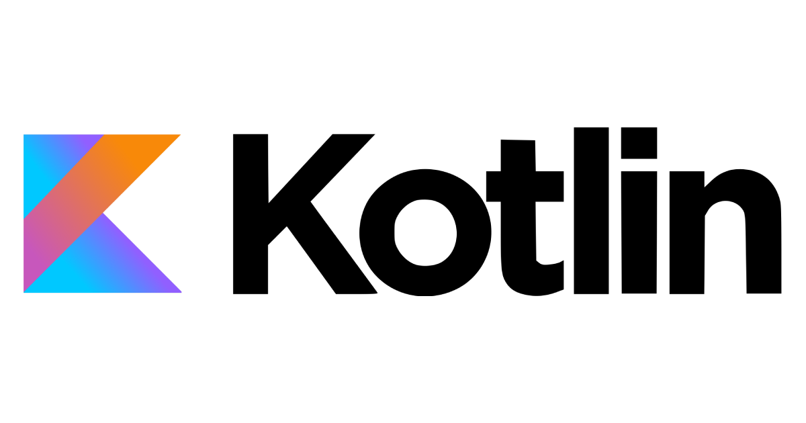

**Второй способ: кроссплатформенная разработка**  
Например, Flutter или React Native. Основная идея — «написать одну кодовую базу и сгенерировать приложения и для Android, и для iOS».

**Третий способ: гибридная разработка**  
По сути, это упаковка веб-страницы в оболочку приложения. Это быстро в разработке, но опыт и плавность обычно не так хороши, как у нативного приложения, и таким образом трудно создать отполированный, иммерсивный небольшой инструмент.

**Выбор этого руководства: нативная разработка (** **Kotlin + Compose)** в сочетании с AI-инструментами для кодинга.  
Причина проста: код на нативном Jetpack Compose имеет очень чёткую структуру и отлично подходит для понимания и генерации искусственным интеллектом. Нам не нужно писать код с нуля вручную. Вместо этого мы направляем Trae естественным языком, чтобы он генерировал качественный нативный код.

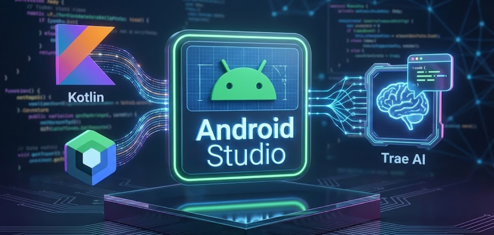

## 1.4 Шаги разработки приложения для Android, рассматриваемые в этом руководстве

Чтобы процесс обучения был интересным, это руководство строится вокруг расслабляющего, но технически показательного примера — **электронной деревянной рыбы (муюй)**. Мы объединяем режим Vibe Coding в Trae с маршрутом, который можно использовать снова и снова:

1. **Формирование понимания и среды**: понять, что такое приложения для Android, установить Android Studio и Trae, а также настроить удобные для Китая зеркала, чтобы инструментарий работал гладко.
2. **Построение каркаса проекта**: создать пустой Android-проект, который успешно запускается в эмуляторе.
3. **Итеративная разработка с AI**: открыть проект в Trae, затем через диалог с AI постепенно реализовать изображение деревянной рыбы, анимацию нажатия, звуковые эффекты, всплывающий текст и многое другое.
4. **Отладка на реальном устройстве и доработка**: выйти за пределы эмулятора, установить приложение на реальный телефон, ощутить настоящую вибрационную обратную связь и позволить AI помочь в расследовании багов.
5. **Упаковка и публикация**: сгенерировать официальный APK и понять, как поделиться им или выпустить его.

Этот раздел лишь рисует общую картину и пока не раскрывает все команды. Сейчас просто запомните основную линию: **настройка среды -> построение каркаса -> описание и генерация с AI -> доработка на реальном устройстве -> упаковка и доставка**. В следующих главах мы проведём вас через каждый шаг.

# 2 Настройка среды разработки

## 2.1 Инструменты, используемые в этом руководстве

На протяжении всего процесса разработки мы используем три инструмента вместе, играющие роли «проектирования», «строительства» и «приёмки».

- **Trae**: это ваш **AI-партнёр по кодингу**. В режиме Vibe Coding нам больше не нужно набирать код строка за строкой. Вместо этого мы в основном говорим AI на естественном языке, что хотим, а он занимается генерацией и изменением кода.
- **Android Studio**: это официальная **фабрика сборки приложений** от Google. Хотя у неё много кнопок, в этом руководстве мы в основном используем её для создания каркаса проекта и компиляции сгенерированного Trae кода во что-то, устанавливаемое на телефон.
- **Устройство Android**: это **тестовый терминал** для просмотра результата. Вы можете подключить его к компьютеру для отладки на реальном устройстве и ощутить настоящую вибрационную обратную связь. Если у вас его нет, встроенный в Android Studio **эмулятор** может прекрасно сымитировать виртуальный телефон, чего достаточно для ранней разработки.

## 2.2 Скачивание Trae

Trae — это наше главное поле боя для **Vibe Coding**. Вы можете просто представлять его как **«редактор кода с AI».**

Зайдите на официальный сайт [https://www.trae.cn](https://www.trae.cn), скачайте версию, подходящую под вашу систему (Windows или Mac), и установите её как обычное ПО, дважды кликнув по установщику и следуя подсказкам. Когда этот инструмент будет готов, в дальнейшей практике мы перестанем пялиться в скучные окна кода и вместо этого будем открывать проект здесь и говорить AI на естественном языке, что строить.


## 2.3 Скачивание Android Studio

Нам нужен Android Studio, чтобы предоставить Android SDK и эмулятор, необходимые для запуска приложения. Зайдите на официальную страницу загрузки [https://developer.android.com/studio?hl=zh-cn](https://developer.android.com/studio?hl=zh-cn) и скачайте пакет для вашей операционной системы (это руководство основано на версии **2025.2.3**). После скачивания установите как обычное ПО, сохраняя варианты по умолчанию на всех шагах.

**Особое напоминание для новичков:**

Хотя современные версии Android Studio значительно упростили настройку, под капотом она всё ещё зависит от **JDK (Java Development Kit)**. Если это ваш первый опыт разработки или если во время установки вы столкнётесь с ошибками, связанными с переменными окружения или настройкой SDK, не паникуйте. Вы можете обратиться к этому подробному руководству по настройке: [Настройка Android Studio 2024: конфигурация SDK и Gradle](https://blog.csdn.net/keiraee/article/details/142321644?ops_request_misc=elastic_search_misc&request_id=a2b858d1f665095c53afa9114ad8864d&biz_id=0&utm_medium=distribute.pc_search_result.none-task-blog-2~all~top_positive~default-2-142321644-null-null.142^v102^pc_search_result_base4&utm_term=android%20studio%E5%AE%89%E8%A3%85%E5%8F%8A%E9%85%8D%E7%BD%AE&spm=1018.2226.3001.4187)


## 2.4 Создание нового проекта

Откройте Android Studio и на приветственном экране нажмите **New Project**.

**Шаг 1: выбор шаблона**

В списке шаблонов выберите **Empty Activity** (обратите внимание на значок Jetpack Compose на нём).

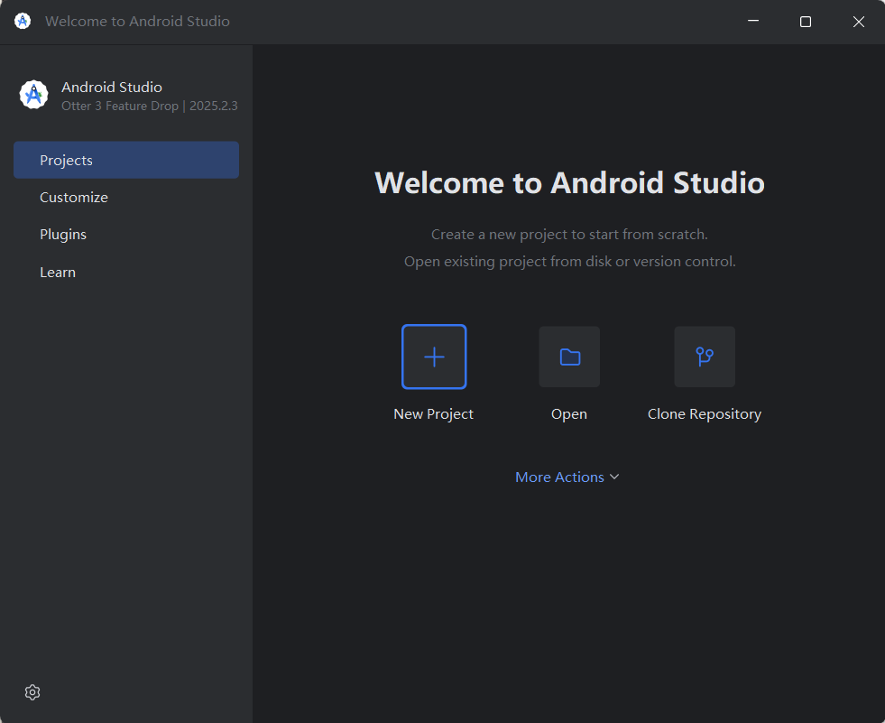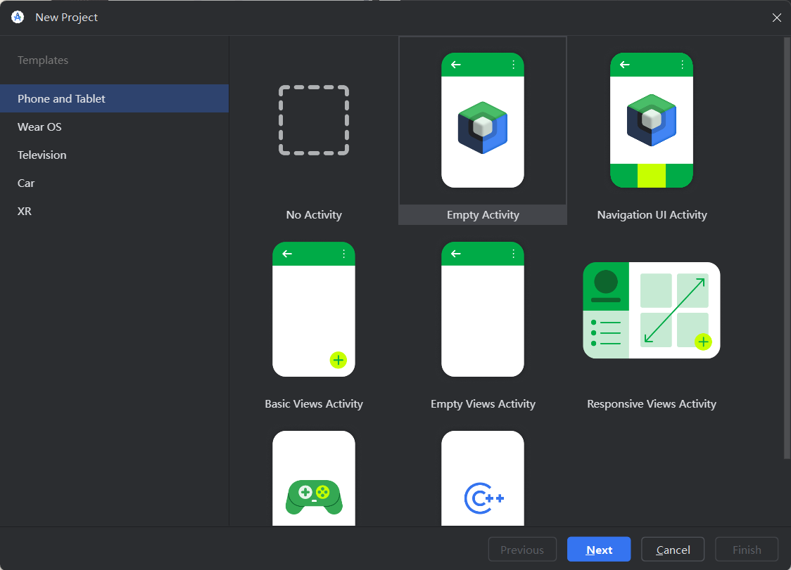

**Шаг 2: заполнение конфигурации проекта**

Затем вы увидите форму конфигурации. Заполните её примерно так, а остальное оставьте по умолчанию:

| **Поле** | **Рекомендуемое значение** | **Пояснение** |
| ----------------- | -------------------------------------------------- | ---------------------------------------- |
| **Name** | My Application 1 | Имя приложения, отображаемое на главном экране телефона |
| **Package name** | com.example.myapplication1 | Уникальный идентификатор приложения |
| **Save location** | Произвольный путь (например, `E:\AndroidProjects\Myapplication1`) | Место хранения проекта; не рекомендуется размещать на диске C |
| **Minimum SDK** | API 30 | Охватывает более 90% активных устройств, балансируя совместимость и функции |
| **Language** | Kotlin (рекомендуется) | Kotlin — рекомендуемый Google язык, более чистый и безопасный |

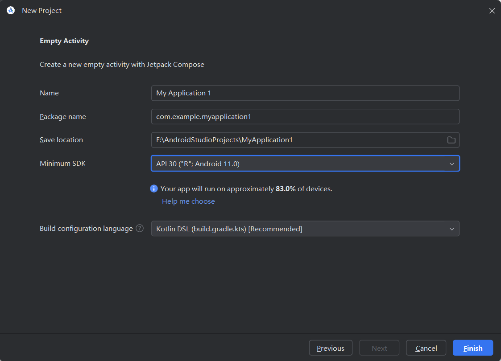

**Шаг 3: ожидание сборки проекта**

Нажмите **Finish**. Android Studio автоматически скачает зависимости и соберёт проект (в правом нижнем углу вы увидите индикатор прогресса).

- _Примечание: первое создание проекта может занять несколько минут. Терпеливо подождите, пока нижний индикатор прогресса завершится и дерево файлов проекта полностью загрузится слева._

## 2.5 Настройка зависимостей: скачивание Gradle и зеркала репозиториев Gradle

> Это один из немногих шагов в рабочем процессе Vibe Coding, где рекомендуется **ручная операция**. Хотя AI тоже может помочь изменить конфигурацию, настройка среды затрагивает низкоуровневые файлы, поэтому ручные изменения надёжнее.

Зачем нам нужно изменять конфигурацию?

По умолчанию Android Studio подключается к зарубежным серверам, поэтому скачивание инструментов сборки и зависимостей может занять час или даже завершиться неудачей. После переключения на отечественные зеркала это часто завершается за несколько минут. **Это разовая задача, которая окупается навсегда.**

1. **Подготовка**

Если в нижней правой строке состояния Android Studio сейчас отображается индикатор прогресса вроде `Gradle Building...`, сначала приостановите идущую загрузку зависимостей, чтобы избежать конфликтов файлов.

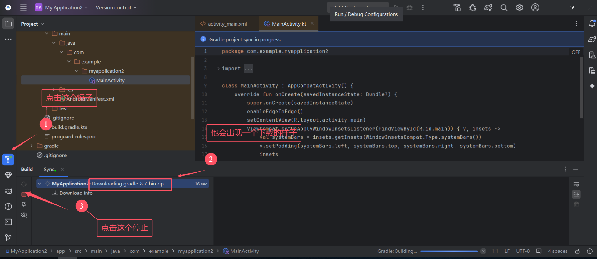

2. **Ускорение скачивания Gradle**

В дереве файлов проекта слева разверните `gradle` -> `wrapper`, затем откройте `gradle-wrapper.properties`. Измените источник загрузки на зеркало Tencent:

```text
distributionUrl=https\://mirrors.cloud.tencent.com/gradle/gradle-8.7-bin.zip
```

Будьте внимательны: вам нужно лишь заменить `services.gradle.org/distributions` на `mirrors.cloud.tencent.com/gradle`. Больше ничего не меняйте.


3. **Ускорение скачивания репозитория зависимостей**

Затем откройте `settings.gradle.kts` в корне проекта и замените содержимое внутри блока `repositories` следующим:


Замените выделенный участок этим кодом (актуальный список источников на 2025-02-21):

```json
        // Зеркала Aliyun (покрывают Maven Central, Google, JCenter и т. д.)
        maven { setUrl("https://maven.aliyun.com/repository/public/") }
        maven { setUrl("https://maven.aliyun.com/repository/google/") }
        maven { setUrl("https://maven.aliyun.com/repository/jcenter/") }
        maven { setUrl("https://maven.aliyun.com/repository/gradle-plugin/") }
        // Зеркало Huawei Cloud
        maven { setUrl("https://repo.huaweicloud.com/repository/maven/") }
        // Зеркало Tencent Cloud
        maven { setUrl("https://mirrors.cloud.tencent.com/nexus/repository/maven-public/") }
        // Зеркало NetEase
        maven { setUrl("https://mirrors.163.com/maven/repository/maven-public/") }
```

После этого должно выглядеть как на скриншоте ниже:


4. **Сохранение и применение изменений**

На этом этапе сохраните файл и нажмите `Try Again` в правом верхнем углу. Android Studio заново запустит загрузку. Подождите несколько минут. Когда в консоли появится `BUILD SUCCESSFUL`, это означает, что настройка среды полностью завершена и мы готовы начать кодинг.


## 2.6 Понимание структуры проекта

После успешного создания проекта слева появится панель **Project**. Переключитесь на представление **Android** (по умолчанию), и вы увидите ключевые каталоги примерно так:

```text
app/
├── manifests/
│   └── AndroidManifest.xml            <- «удостоверение личности» приложения, объявляет имя приложения и точку входа Activity (MainActivity)
│
├── java/
│   └── com.example.myapplication1/
│       ├── MainActivity.kt            <- точка входа приложения, строит UI с помощью Jetpack Compose
│       │
│       └── ui/                        <- управляет общим стилем UI (цвета, шрифты)
├── res/
│   ├── drawable/                      <- ресурсы изображений (например, ic_launcher.png)
│   ├── mipmap/                        <- значок приложения
│   ├── values/                        <- текст, цвета, стили темы
│   │   ├── colors.xml
│   │   ├── strings.xml
│   │   └── themes.xml
│   └── xml/                           <- системные файлы конфигурации (не UI)
└── build.gradle (Module: app)         <- конфигурация сборки приложения (обычно не трогается на этапе новичка)
```

Как новичкам, нам обычно нужно сосредоточиться лишь на трёх файлах:

- `MainActivity.kt`: управляет поведением и решает, «что появляется на экране»
- `AndroidManifest.xml`: регистрирует компоненты и решает, «где запускается приложение»
- `Theme.kt`: определяет визуальный внешний вид

# 3 Разработка приложения для Android

В первых двух главах мы уже разобрались, что такое приложения для Android, и отточили два ключевых инструмента: Trae и Android Studio. С этого раздела мы оставляем теоретические рассуждения и переходим к настоящей практике. Мы будем использовать режим Vibe Coding, чтобы с нуля построить очень популярное приложение для снятия стресса — **электронную деревянную рыбу (муюй)**. Оно хорошо вписывается в тему «Vibe» (просто и расслабляюще), а также охватывает три ключевые части разработки под Android: **UI-взаимодействие (нажатие), хранение данных (счётчик заслуг) и мультимедиа (звуковые эффекты)**.

Теперь следуйте за нами и отправьте AI первую инструкцию.

## 3.1 Первый «мастер-промпт»: от нуля к единице

В режиме Vibe Coding нам не нужно сначала создавать файлы макетов, а затем писать логический код, как в традиционной разработке. Что нам нужно сделать — это **чётко описать требования за один раз и позволить AI сгенерировать первый работоспособный прототип**.

Откройте в Trae только что созданный нами каталог проекта и в панели чата справа введите следующий промпт:

```text
Ты старший эксперт по разработке под Android. Пожалуйста, перепиши текущий MainActivity.kt и преврати его в приложение «Электронная деревянная рыба». Требования:
1. Фон экрана чёрный.
2. Отобрази в центре экрана изображение деревянной рыбы умеренного размера, белого цвета.
3. Покажи над ним строку белого текста: «Заслуги: 0».
4. При нажатии на деревянную рыбу в центре число увеличивается на 1 и появляется простой эффект анимации масштабирования (имитирующий ощущение удара).
5. Используй Jetpack Compose.
```

После отправки Trae начнёт анализировать структуру вашего проекта. Через несколько секунд он напрямую сгенерирует полный код для `MainActivity.kt`.

1. Из его ответа мы можем увидеть его логику рассуждений и логику взаимодействия
2. Мы можем напрямую увидеть, какие части кода были переписаны
3. Если результат нас не устраивает, мы можем откатиться к предыдущей версии


## 3.2 Запуск и предпросмотр (отладка в эмуляторе)

На этом этапе AI завершил первый раунд разработки. Но помните: то, что мы видим в Trae, — это лишь «чертежи» кода, а не настоящее интерактивное приложение. Сам Trae не может напрямую запускать приложения для Android, поэтому нам нужно опереться на **эмулятор виртуального устройства (Virtual Device)**, предоставляемый Android Studio. Он словно превращает экран вашего компьютера в виртуальный телефон Android, позволяя нам тут же установить код и увидеть реальный результат.

Далее давайте настроим этот «виртуальный телефон».

**Шаг 1: создание эмулятора**

Вернувшись в Android Studio, найдите и нажмите **Device Manager** на правой панели инструментов. Если вы не можете его найти, откройте через `View -> Tool Windows -> Device Manager`.

В панели нажмите **Add a new device**, затем выберите **Create Virtual Device**, чтобы войти в окно выбора устройства.


В окне выбора оборудования выберите **Phone**, а затем **Smart Phone** (средний размер экрана) или любой другой профиль устройства по вашему вкусу, например Pixel, затем нажмите **Next**.

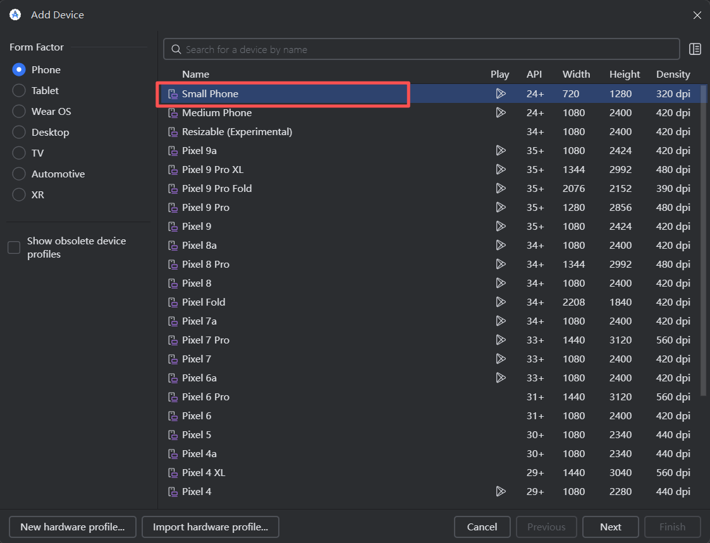

**Шаг 2: настройка образа системы**

В диалоге **System Image** выберите **API 36.1**. Если он ещё не скачан, сначала нажмите **Download**, затем выберите его после завершения загрузки и нажмите **Finish**.


**Шаг 3: запуск эмулятора**

После успешного создания ваш новый телефон появится в списке менеджера устройств. Нажмите справа **треугольную кнопку воспроизведения**. После короткого ожидания всплывёт окно в форме телефона — это ваш эмулятор Android.


**Шаг 4: запуск приложения**

Теперь наступает волшебный момент. Убедитесь, что эмулятор запустился и показывает рабочий стол, затем нажмите заметный **зелёный треугольник Run** на верхней панели инструментов Android Studio (или используйте сочетание `Shift + F10`). Android Studio автоматически скомпилирует написанный Trae код, упакует его в приложение и установит в эмулятор.

В течение нескольких секунд вы должны увидеть, как экран эмулятора загорится, показывая в центре белое изображение деревянной рыбы с текстом «Заслуги: 0» над ним. Попробуйте нажать на него и проверьте, увеличивается ли число и работает ли анимация. Это ваше первое приложение для Android.

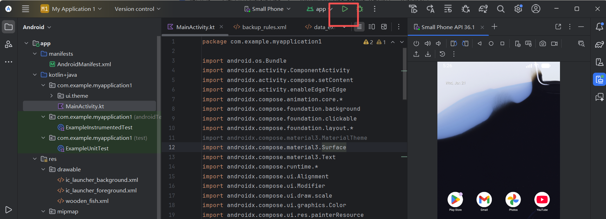


## 3.3 Оптимизирующая итерация (добавление ресурсов и звука)

На данном этапе у нашего приложения уже есть базовая форма: нажатие увеличивает число. Но это всё ещё лишь «немая» белая геометрическая фигура, которой не хватает интереса. Далее мы сделаем электронную деревянную рыбу гораздо более иммерсивной, добавив настоящее изображение и звуковой эффект удара.

**Это как раз самая привлекательная часть режима Vibe Coding.** В традиционной разработке добавление звуковых эффектов и более сложных анимаций часто становится кошмаром новичка. Вам нужно управлять загрузкой и освобождением ресурсов `MediaPlayer` (иначе могут возникнуть утечки памяти), а также рассчитывать кривые анимации. В режиме Vibe Coding вам вообще не нужно заботиться об этих низкоуровневых деталях. Вам нужно лишь сказать AI, словно режиссёр: «смени реквизит и добавь звуковой эффект при нажатии» — и реализация появляется немедленно.

**Шаг 1: подготовка ресурсов**  
Вам нужно одно изображение деревянной рыбы (`png`) и один звуковой эффект удара (`mp3`).

- **Ресурс изображения**: скопируйте подготовленный `white_muyu.png` в `app/src/main/res/drawable`
- **Аудиоресурс**: в Android Studio щёлкните правой кнопкой по папке `res` в левой панели проекта, выберите `New -> Android Resource Directory`, выберите **raw** в качестве типа ресурса, нажмите OK, затем скопируйте `voice.mp3` в новую папку `res/raw`. _(Примечание: если вы планируете коммерческий выпуск, убедитесь, что у вас есть законные права на все ресурсы.)_

Вот изображение и звуковые ресурсы, которые я нашёл для вас. Если вам неудобно искать свои, можете использовать их напрямую.


Ссылка для скачивания звука удара: https://www.aigei.com/s?q=%E6%9C%A8%E9%B1%BC&type=sound  
Выберите первый звуковой эффект длительностью 1 секунда.


**Шаг 2: отправка инструкции итерации**

После того как ресурсы готовы, вернитесь в Trae. Trae снова изменит код и обработает за вас логику загрузки аудио и анимации. Вам нужно лишь сказать ему, какие ресурсы использовать. Введите этот промпт:

```text
Я добавил ресурсы. Путь к изображению — res/drawable/white_muyu.png, а путь к звуковому эффекту — res/raw/voice.mp3. Пожалуйста, обнови код:
1. Замени значок деревянной рыбы в центре моим изображением.
2. Проигрывай звук удара каждый раз при нажатии на деревянную рыбу.
3. При нажатии показывай временный текст «+1» над деревянной рыбой, затем дай ему всплыть вверх и исчезнуть (как всплывающий текст очков в играх).
```


**Шаг 3: проверка результата**

После того как Trae закончит изменять код, вернитесь в Android Studio и снова нажмите зелёную кнопку Run (Re-run), чтобы перезапустить эмулятор. На этом этапе ваше приложение будет ощущаться преобразившимся. Попробуйте нажимать непрерывно — вы должны услышать чёткий звук «ток-ток» и увидеть выпрыгивающий всплывающий текст «Заслуги +1». Это завершает ключевой переход от «демо» к «продукту».

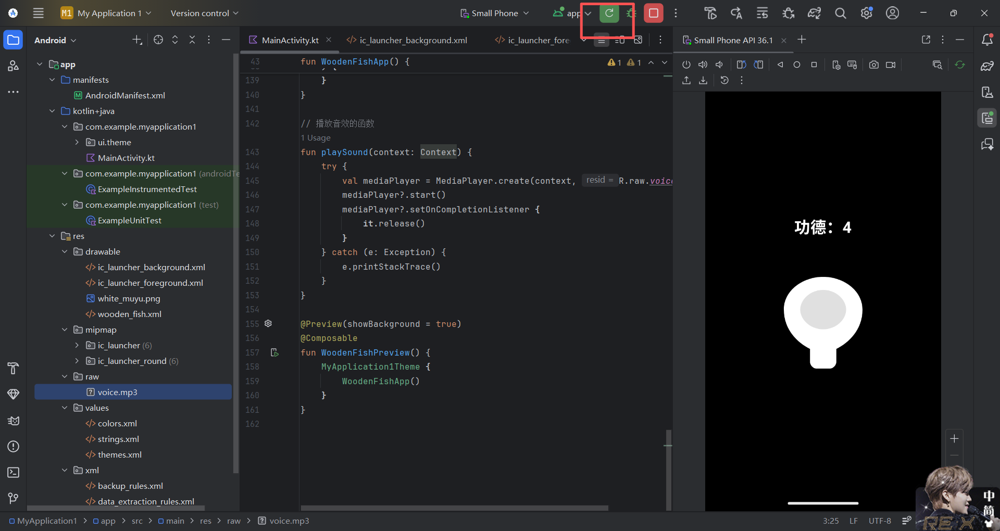


## 3.4 Что делать, если появляются баги? (Цикл отладки с AI)

Сгенерированный AI код не гарантированно идеален с первого раза, точно так же как и топовые инженеры не могут пообещать код без багов за один заход. Но в режиме Vibe Coding баги больше не стена, блокирующая вас; они становятся ступеньками в вашем сотрудничестве с AI.

**Случай 1: приложение падает**

Предположим, приложение немедленно падает после нажатия Run или нажатие на деревянную рыбу не воспроизводит звук. Традиционно вам пришлось бы искать код ошибки, просматривать десятки технических форумов и читать множество сложных англоязычных постов. В режиме Vibe Coding вам нужно сделать лишь одно — **быть курьером**.

**Шаги:**

1. **Откройте лог**: найдите панель **Logcat** внизу Android Studio (значок маленькой кошки).
2. **Локализуйте ошибку**: вы увидите прокручивающиеся логи, и **красные строки** обычно являются ключевыми ошибками.
3. **Скопируйте и вставьте**: выделите красный английский текст ошибки, скопируйте его и вставьте в Trae: «Я получил эту ошибку при запуске. Пожалуйста, помоги мне её исправить».
4. AI может тут же сказать вам что-то вроде: «Это произошло, потому что разрешение на вибрацию не было объявлено в `AndroidManifest.xml`», и затем дать вам исправленный код. Вам остаётся лишь нажать Apply и двигаться дальше.

**Случай 2: приложение работает, но ощущения плохие**

Иногда приложение не падает, но всё равно ощущается неудовлетворительным. Например, при очень быстром нажатии на деревянную рыбу вы можете заметить, что новые анимации «+1» не появляются, пока предыдущее «+1» полностью не исчезнет. Из-за этого обратная связь кажется заторможенной и не приносящей удовлетворения. Вам не нужно самим изучать многопоточность или очереди анимаций. Вам нужно лишь чётко описать AI этот дискомфорт.

Отправьте эту «продвинутую инструкцию» в Trae:

```text
Пожалуйста, измени текущую логику анимации, чтобы решить проблему «быстрое нажатие не срабатывает».
Текущая проблема: похоже, есть только одно состояние анимации, поэтому мне приходится ждать, пока предыдущее «+1» полностью исчезнет, прежде чем сработает другое нажатие.
Требования:
1. Замени единственное состояние анимации на список на основе mutableStateListOf.
2. Каждый раз при нажатии на деревянную рыбу немедленно добавляй в список новый экземпляр «+1» (со своим ID и начальной позицией), независимо от того, завершилась ли предыдущая анимация.
3. В UI перебирай этот список, чтобы каждое «+1» независимо выполняло свою анимацию всплытия вверх + затухания.
4. После завершения анимации «+1» автоматически удаляй его из списка, чтобы предотвратить утечки памяти.
Пожалуйста, сразу предоставь обновлённый код MainActivity.kt.
```


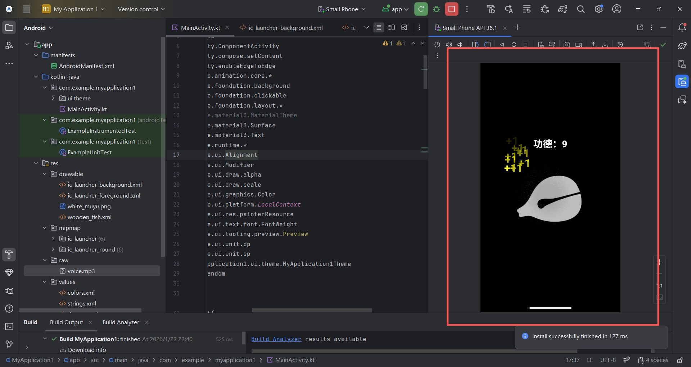

## 3.5 Демонстрация финального результата

В предыдущих шагах мы уже создали электронную деревянную рыбу, которую можно увидеть и услышать. Чтобы приблизить её к публикуемому приложению, мы используем одну финальную итерацию для добавления **тактильной обратной связи** и **кастомизации**. Мы реализуем две ключевые функции: первая — **вибрационная обратная связь**, чтобы каждое нажатие получало физический отклик от мотора телефона и значительно повышало иммерсивность; вторая — **произвольный текст**, позволяющий пользователям изменять текст на экране, например менять «Заслуги +1» на «Зарплата +1» или «Проблемы -1».

Отправьте в Trae следующий тщательно продуманный промпт. Он за один проход обработает логику диалога, переключение состояний и аппаратное взаимодействие:

```text
Роль: Ты эксперт по Android Jetpack Compose.
Задача: Пожалуйста, добавь «произвольный текст» и «вибрационную обратную связь» в существующее приложение «Электронная деревянная рыба».
Требования:
1. Тактильная обратная связь (Haptic Feedback)
Всякий раз, когда пользователь нажимает на деревянную рыбу, в дополнение к звуку и анимации вызывай тактильную обратную связь телефона (используя LocalHapticFeedback.current), чтобы дать лёгкий тактильный отклик.
2. Функция произвольного текста (UI и взаимодействие)
Вход: Добавь маленький значок редактирования рядом с верхним текстом вроде «Заслуги +1» (можешь использовать Icons.Default.Edit).
Логика диалога: При нажатии на значок показывай диалог (Dialog/AlertDialog).
    Заголовок диалога: «Изменить содержимое»
    Ввод: Позволь пользователю ввести текст, который он хочет накапливать (по умолчанию «Заслуги»)
    Выбор значения: Под полем ввода предоставь два варианта (например, RadioButton или переключатель), чтобы пользователь мог выбрать «+1» или «-1»
    Кнопка сохранения: После нажатия «Сохранить» закрой диалог и примени новые настройки на главном экране
    Обновление данных: Если пользователь обновляет содержимое, сбрось верхний счётчик в 0 и начни считать с нуля заново
3. Обновление эффекта
После сохранения и текст верхнего счётчика, и всплывающий анимированный текст, показываемый при нажатии на деревянную рыбу, должны измениться на произвольный формат пользователя.
    Размер всплывающего текста не должен превышать размер текста верхнего счётчика
    Пример: если пользователь вводит «Зарплата» и выбирает «+1», логика верхнего счётчика становится +1, а всплывающий текст становится «Зарплата+1»
    Если пользователь вводит «Проблемы» и выбирает «-1», логика верхнего счётчика становится -1, а всплывающий текст становится «Проблемы-1»
4. Технические требования:
Убедись, что новое состояние (текст и число) корректно влияет на анимацию.
Пожалуйста, сразу предоставь полный обновлённый MainActivity.kt, сохранив прежнюю логику звука и анимации неизменной.
```


# 4 Отладка на реальном устройстве и доработка

Эмулятор удобен, но он не может сымитировать настоящую вибрацию телефона или полностью отразить реальную задержку касания. Чтобы получить наиболее точные «ощущения», нам нужно установить приложение на реальный телефон Android. Ниже два способа подключения, из которых вы можете выбрать:

1. **Беспроводная отладка (Wi-Fi)**: не требуется кабель, удобно для ежедневной проверки. Но ваш компьютер и телефон должны быть в **одной сети Wi-Fi**.
2. **Проводная отладка по USB**: более стабильно и менее подвержено разрывам, подходит, когда сеть плохая или первоначальная установка не удаётся.

## 4.1 Беспроводная отладка

Это самый удобный способ на Android 11 и выше.

**Шаг 1: подготовка телефона**

1. Убедитесь, что телефон и компьютер в **одной сети Wi-Fi**.
2. Откройте **Параметры разработчика** и включите **Беспроводную отладку**.
3. Нажмите на **Беспроводную отладку**, чтобы войти в детали, затем выберите **Сопряжение устройства с помощью QR-кода**. Ваш телефон откроет вид сканера.

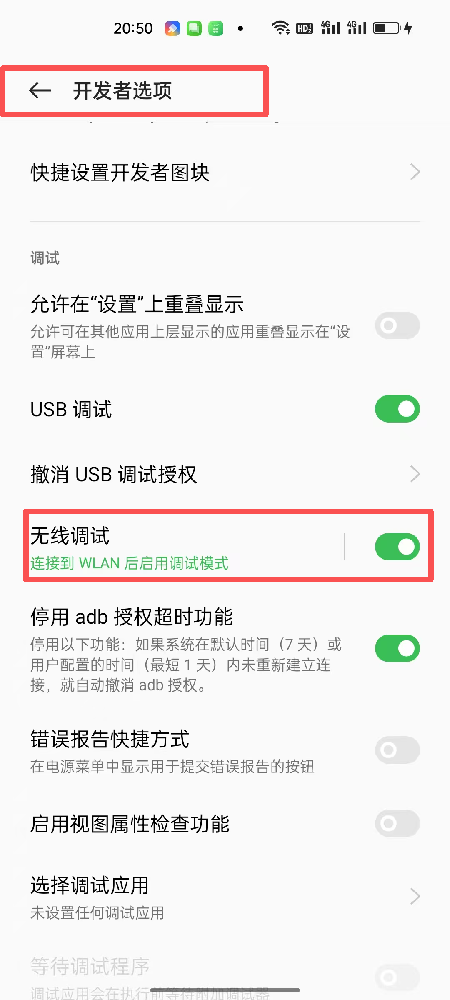

**Шаг 2: сопряжение на компьютере**

1. Вернувшись в Android Studio, нажмите на селектор устройств в верхней панели инструментов.
2. Выберите в выпадающем меню **Pair Devices Using Wi-Fi**.
3. На экране всплывёт QR-код.


**Шаг 3: сканирование для подключения**

1. Используйте телефон, чтобы отсканировать QR-код на экране компьютера.
2. И телефон, и компьютер должны показать «сопряжение успешно».
3. На этом этапе верхняя панель устройств Android Studio автоматически отобразит модель вашего телефона (например, `Google Pixel 8`).

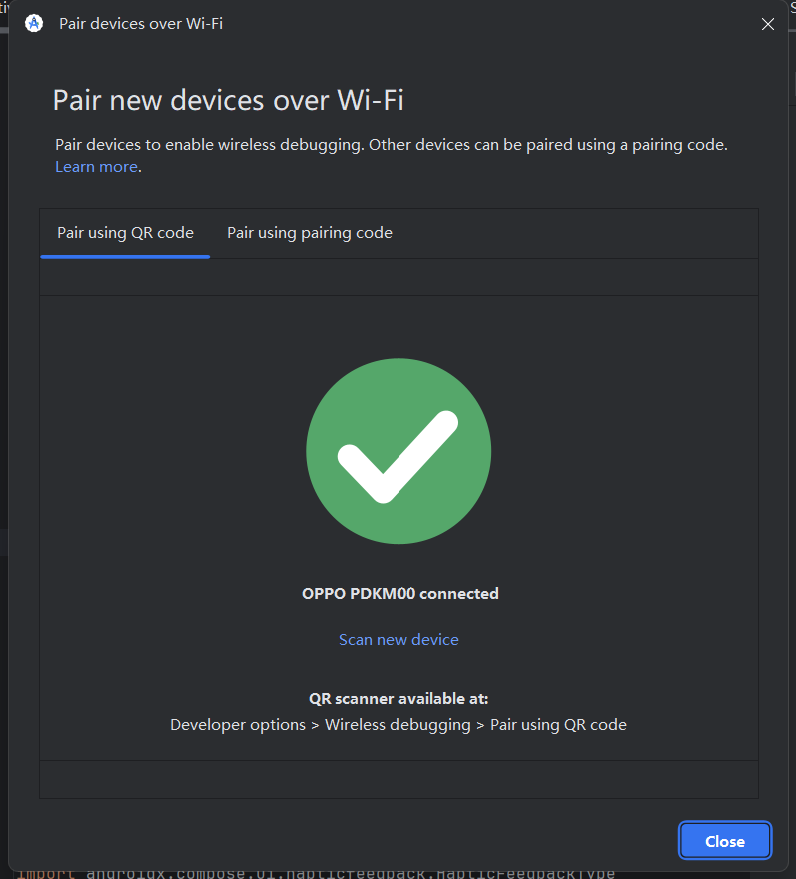

4. Запустите приложение, нажав ▶️ Run


## 4.2 Проводная отладка по USB

Если беспроводное соединение нестабильно или ваша сеть сложна, подключение кабелем всегда самое надёжное решение. Хотя оно менее удобно, оно даёт самую быструю скорость передачи и почти никогда не разрывается.

### 4.2.1 Подготовка USB-драйвера в Android Studio (только для Windows)

Пользователи Mac могут пропустить этот шаг, потому что macOS обычно распознаёт телефон напрямую. Пользователям Windows нужно убедиться, что компьютер может распознать телефон Android, что обычно означает установку USB-драйвера от Google:

1. В Android Studio нажмите `Tools -> SDK Manager` (или найдите его в `Settings -> Languages & Frameworks -> Android SDK`)
2. Переключитесь на вкладку **SDK Tools**
3. Отметьте **Google USB Driver** и нажмите **Apply**, чтобы скачать и установить его

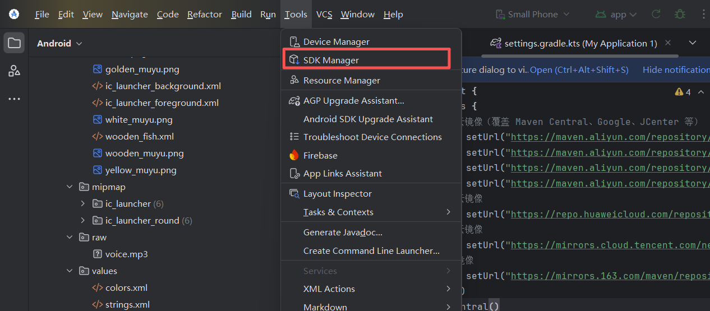


### 4.2.2 Скачивание той же версии SDK, что и на вашем реальном устройстве

**Шаг 1: проверка версии Android на телефоне**

На примере телефона OPPO: откройте Настройки -> О телефоне -> проверьте версию Android (в примере это Android 12).

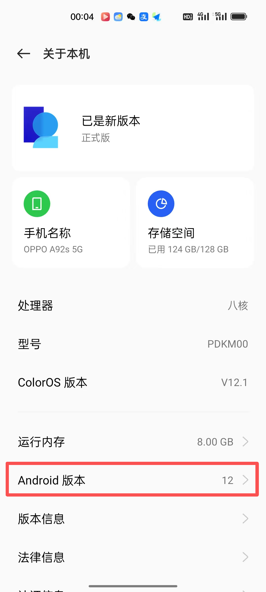

**Шаг 2: скачивание этой версии платформы Android в Android Studio**

1. В Android Studio нажмите `Tools -> SDK Manager`
2. Останьтесь на вкладке по умолчанию **SDK Platforms**
3. Выберите Android 12.0 и нажмите Apply, чтобы скачать


### 4.2.3 Включение режима разработчика на телефоне

Откройте настройки телефона, перейдите в параметры разработчика и включите **Отладку по USB**.

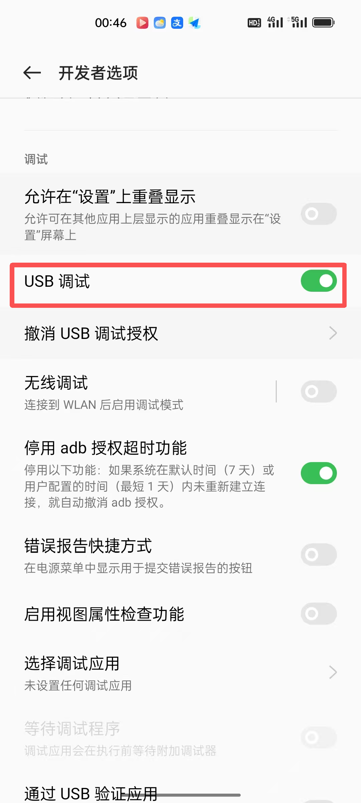

### 4.2.4 Авторизация USB-драйвера на телефоне

На этом этапе возьмите телефон. Он должен показать важный диалог безопасности: «Разрешить отладку по USB?» Обязательно отметьте **Всегда разрешать**, а затем нажмите **Разрешить** или **OK**. Это ключевая авторизация, дающая компьютеру контроль для отладки.

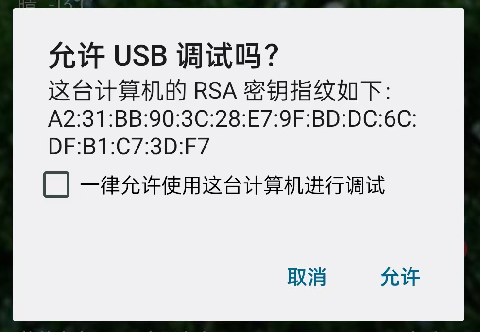

### 4.2.5 Запуск приложения на телефоне

1. В верхнем селекторе устройств Android Studio вы теперь должны увидеть модель вашего телефона (например, `OPPO-PDKM00`)
2. Нажмите ▶️ Run. Ваш телефон покажет диалог «Разрешить отладку по USB?»; отметьте «Всегда разрешать» и подтвердите
3. Приложение автоматически установится и запустится

Теперь попробуйте нажать на деревянную рыбу на телефоне и ощутите настоящий отклик вибромотора. Это полноценный опыт Vibe Coding.


# 5 Упаковка приложения в APK

Код готов, и тест на реальном устройстве тоже работает. Теперь нам нужно «вынести приложение» из Android Studio и превратить его в файл, который вы можете отправить друзьям для установки. Этот процесс называется **упаковкой**. В разработке под Android упаковка имеет два совершенно разных режима, и мы выбираем исходя из сценария использования.

## 5.1 Упаковка отладочной версии (для быстрого шеринга)

Если вы хотите лишь поделиться приложением с друзьями для быстрой пробы или отправить его на тестовые телефоны для проверки, **отладочная версия (Debug)** — самый быстрый вариант. Она словно «черновик» — полностью функциональная, но без официальной подписи, поэтому её нельзя отправить в магазины приложений.

**Шаги очень просты:** в верхнем меню Android Studio найдите `Build`, наведите курсор на `Generate App Bundles or APKs` и нажмите `Generate APKs` в подменю.


Подождите около 5 секунд в зависимости от размера проекта. В области консоли в правом нижнем углу Android Studio появится подсказка. Нажмите синюю ссылку `locate`, и папка вывода откроется автоматически. Файл с именем `app-debug.apk` — это нужный нам пакет.

Вы можете напрямую отправить его через WeChat или QQ на любой телефон Android, и получатель сможет установить и использовать его. Обратите внимание, что debug — это не релизная версия.

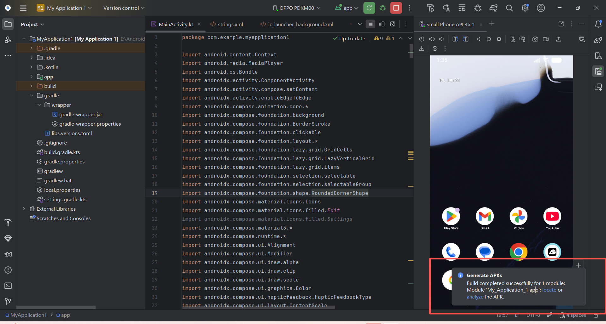

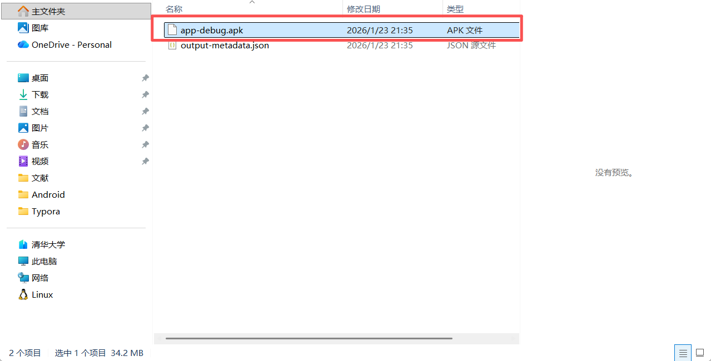

## 5.2 Упаковка релизной версии

Если вы хотите опубликовать приложение в магазине приложений (например, Google Play или Huawei AppGallery) или избежать предупреждения «небезопасное приложение» при установке, тогда вы должны упаковать **релизную версию (Release)**. Эта версия требует уникальной **цифровой подписи**, которая словно противоподделочная печать, доказывающая, что именно вы разработали это приложение и что оно не было подделано.

> Основная цель подписи
>
> - Определить личность издателя: поскольку приложение с тем же именем пакета может заменить установленную программу, подпись предотвращает злоупотребление этим
> - Обеспечить целостность приложения: процесс подписи охватывает каждый файл в пакете, гарантируя, что они не будут заменены впоследствии

Подпись приложения Android словно прикрепление печати. После прикрепления печати приложение и разработчик связаны вместе: приложение ваше, и вы за него отвечаете. Другие не могут выдать себя за вас, и вы не можете выдать себя за других.

**Шаг 1: запуск мастера подписи**

В верхнем меню выберите `Build`, затем нажмите `Generate Signed Bundle / APK`. Во всплывающем окне вы столкнётесь с двумя вариантами:

- Android App Bundle (`.aab`): требуется для Google Play, меньше по размеру, но не может быть напрямую установлен на телефон
- APK: стандартный установочный пакет, можно установить напрямую  
_Для демонстрации мы сначала выбираем APK и нажимаем Next._


**Шаг 2: создание цифрового ключа (KeyStore)**

Это место, где новички застревают чаще всего. Поскольку это ваша первая упаковка для релиза, вам нужно создать новое **хранилище ключей (keystore)**. Нажмите **Create new** под `Key store path`.


Во всплывающем окне заполните необходимую информацию, как при регистрации аккаунта. Мы настоятельно рекомендуем, чтобы пароль хранилища ключей и пароль псевдонима ключа были **одинаковыми**, и чтобы вы **тщательно их записали**. Если вы потеряете этот пароль, ваше приложение никогда больше не сможет быть обновлено в будущем.

После завершения нажмите OK. Вы вернётесь к предыдущему экрану, и информация о ключе, которую вы только что заполнили, уже будет заполнена автоматически.


**Шаг 3: генерация официального пакета**

Нажмите Next, выберите **release** в Build Variants и, наконец, нажмите **Create**.

После короткого ожидания Android Studio снова покажет подсказку об успехе «Generate Signed APK» в правом нижнем углу. Нажмите **locate**, и на этот раз вы увидите в папке цифрово подписанный официальный пакет (обычно с именем `app-release.apk`). Этот файл — конечный продукт, который вы поставляете как разработчик.

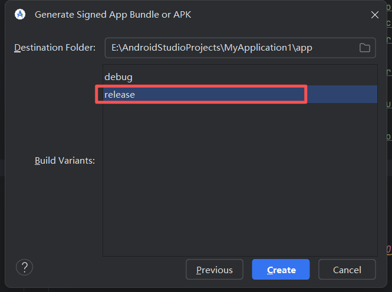

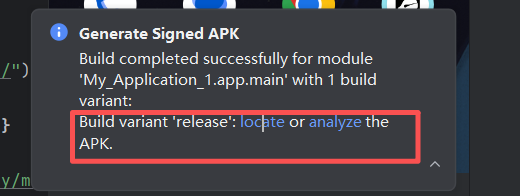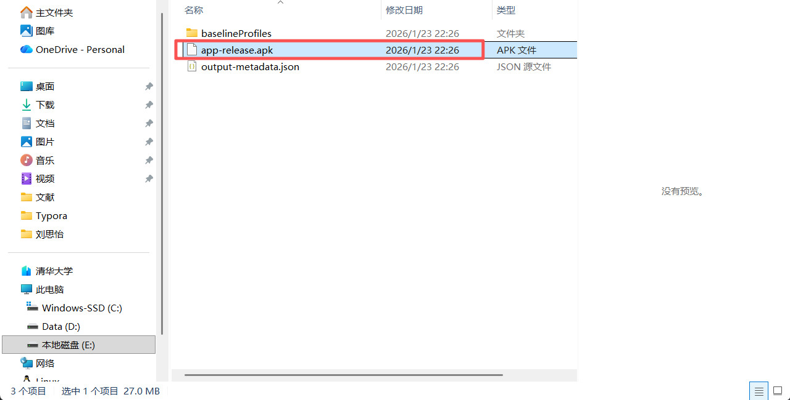

# 6 Официальная публикация в магазины / маркеты приложений

Когда разработка вашего приложения завершена и релизный пакет готов, следующий шаг — опубликовать его, чтобы больше людей могли его скачать и использовать. Сейчас основные каналы распространения делятся на две категории: **отечественные китайские магазины приложений Android** и **зарубежные магазины приложений (Google Play)**.

## 6.1 Публикация в отечественных маркетах

Экосистема Android в материковом Китае особенная. Здесь нет единого официального магазина (поскольку Google Play напрямую недоступен). Вместо этого рынок разделён между **магазинами приложений производителей телефонов** и **сторонними платформами**. Основные **магазины производителей** включают Huawei, Xiaomi, OPPO, vivo, Meizu, Samsung и т. д. Поскольку они предустановлены на устройствах, у них самый большой трафик. Основные **сторонние платформы** включают Tencent MyApp и 360 Mobile Assistant.

### 6.1.1 Основная сложность: «блокпост» для индивидуальных разработчиков

Прежде чем регистрировать аккаунт, есть одна очень важная вещь, которую вы должны знать: **отечественные маркеты приложений очень строги к индивидуальным разработчикам**.

В настоящее время почти все крупные отечественные магазины приложений (Huawei, Xiaomi, OV, MyApp и т. д.) **требуют** *свидетельство о регистрации авторского права на программное обеспечение* для подачи.

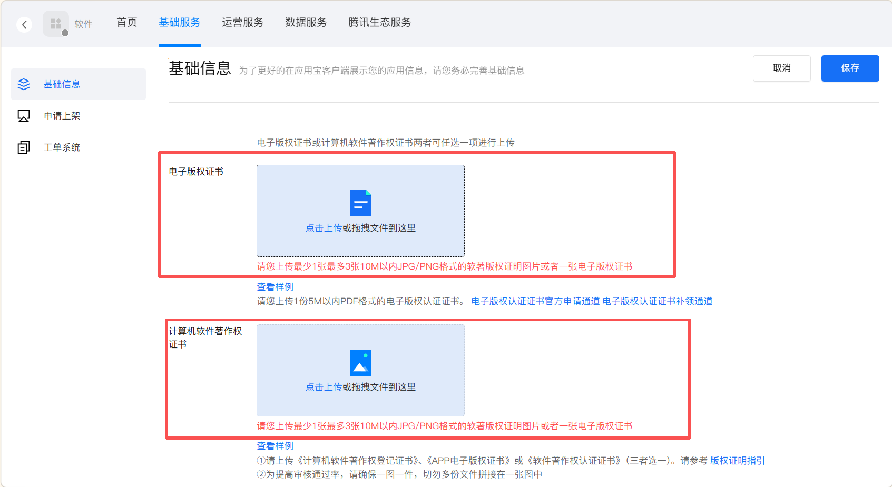

- **Что это?** Это юридический документ, доказывающий, что приложение принадлежит вам.
- **Стоимость получения**: вам нужно подать заявку через бюро авторских прав. Самостоятельное оформление обычно занимает 2-3 месяца; использование агентства для ускоренной обработки может стоить от нескольких сотен до более тысячи юаней.
- **Текущая реальность**: без этого свидетельства ваше приложение, скорее всего, не пройдёт проверку, или вы даже не сможете создать запись приложения. Кроме того, такие категории, как новости, финансы и здравоохранение, могут также требовать ICP-регистрации или других квалификаций.

Поэтому если ваше приложение — лишь личный учебный проект или небольшой инструмент, и вы не хотите тратить время и деньги на получение этого свидетельства, я предлагаю сразу перейти к разделу 6.2 и рассмотреть Google Play, либо просто поделиться APK-файлом с друзьями напрямую.

### 6.1.2 Регистрация аккаунта разработчика

Если вы уже подготовили необходимые квалификации или решили публиковаться в отечественных маркетах, первый шаг — регистрация аккаунта. Процесс похож на крупных платформах, обычно требуется верификация удостоверения личности для физических лиц или верификация лицензии на ведение бизнеса для компаний.

Ниже URL-адреса платформ разработчиков основных маркетов приложений:

Tencent Open Platform: https://open.tencent.com/

360 Open Platform: http://dev.360.cn

Baidu Developer Platform: http://app.baidu.com

Xiaomi Open Platform: https://dev.mi.com

Huawei Developer Alliance: http://developer.huawei.com/consumer/cn

Alibaba Developer Platform: http://open.uc.cn  
Дистрибуция Alibaba объединяет Wandoujia, Ali Jiuyou, PP Assistant, UC App Store, Shenma Search и YunOS App Store. Вам нужно зарегистрировать лишь один аккаунт разработчика Alibaba.

Samsung Developer Platform: http://support-cn.samsung.com/App/DeveloperChina/Home/Index

OPPO Developer Alliance: http://open.oppomobile.com

vivo Developer Alliance: https://dev.vivo.com.cn

Lenovo Open Platform: http://open.lenovo.com

Meizu Developer Alliance: http://open.flyme.cn

Gionee Developer Alliance: https://open.appgionee.com

**На примере Tencent MyApp:** зайдите на Tencent Open Platform и нажмите «зарегистрироваться». Рекомендуется входить напрямую через аккаунт QQ. Обратите внимание, что после привязки аккаунта QQ его сложно отвязать, поэтому лучше использовать выделенный рабочий аккаунт QQ. Следуйте подсказкам, выберите «Индивидуальный разработчик» или «Корпоративный разработчик», загрузите фото вашего удостоверения личности и пройдите верификацию по лицу. После прохождения верификации нажмите **Create App**, чтобы начать.

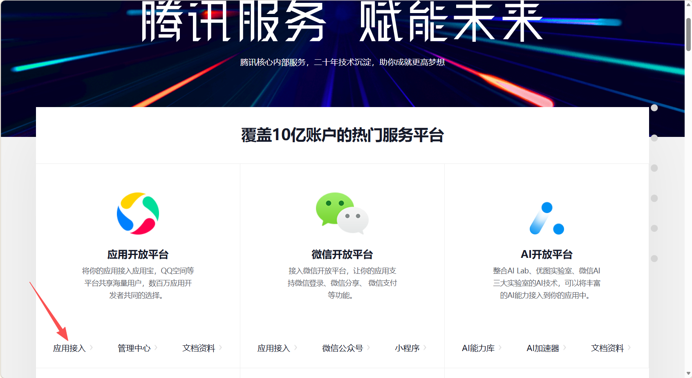


### 6.1.3 Процесс подачи и необходимые материалы

После одобрения проверки аккаунта вы можете создать приложение и подать его на проверку. Вам нужно подготовить следующий «комплект из четырёх частей»:

1. **Установочный пакет**: **релизный APK**, упакованный в главе 5
2. **Текстовая информация**:
3. **Имя приложения**: не должно содержать чувствительных слов
4. **Краткое описание в одну строку**: до 20 китайских иероглифов, просто и прямо (например: «Расслабляющее приложение электронной деревянной рыбы»)
5. **Подробное описание**: 200+ китайских иероглифов, представляющих функции приложения и сценарии использования
6. **Визуальные материалы**:
7. **Значок приложения**: PNG высокой чёткости, обычно 512x512
8. **Скриншоты приложения**: подготовьте 4-5 чётких скриншотов использования приложения, желательно охватывающих основные страницы, обычно единого размера, например 1080x1920
9. **Квалификационный документ**: загрузите скан вашего свидетельства о регистрации авторского права на ПО

**Подача и проверка:** после заполнения всей информации и загрузки APK нажмите **Submit for Review**. Цикл проверки обычно составляет 1-3 рабочих дня. В этот период обращайте внимание на электронную почту или SMS. Проверяющие могут отклонить подачу из-за нечётких скриншотов, нестандартных описаний или отсутствия требуемых квалификаций. В таком случае вы вносите правки согласно обратной связи и подаёте заново.

## 6.2 Публикация в зарубежный маркет (Google Play)

Если вы не хотите иметь дело со сложностью свидетельств об авторских правах и регистраций в отечественных магазинах приложений или если ваша целевая аудитория глобальна, Google Play — лучший выбор для индивидуальных разработчиков.

### 6.2.1 Подготовка

- **Аккаунт Google**: достаточно обычного аккаунта Gmail
- **Регистрационный взнос $25**: это **разовый пожизненный взнос**, и требуется кредитная карта, поддерживающая платежи в USD (Visa / Mastercard)
- **Надёжный доступ к сети**: вам нужно иметь возможность беспрепятственно заходить в Google Play Console
- **Официальный установочный пакет**: обратите внимание, что Google Play требует формат **.aab** (Android App Bundle), а не APK. В Android Studio выберите Android App Bundle при упаковке. Шаги почти идентичны упаковке APK.

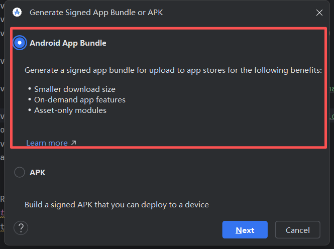

### 6.2.2 Процесс публикации в Google Play Console (обзор)

Поскольку регистрация и оплата в Google Play всё ещё имеют некоторые входные барьеры (например, потребность в зарубежной кредитной карте), это руководство пока не предоставляет пошаговых скриншотов. Но вот распространённый процесс из четырёх шагов:

**Шаг 1: создание приложения и вход в консоль**

Нажмите `Create app`, заполните имя приложения (`Electronic Wooden Fish`), выберите английский в качестве языка, выберите App и Free в качестве типа приложения, затем отметьте соглашение. После этого у вас будет доступ к бэкенду.

**Шаг 2: оформление страницы магазина**

Это первое впечатление пользователя. Вам нужно загрузить подготовленный **значок** приложения (512x512) и **обложку (feature graphic)** (1024x500). Что касается английского описания, вы можете просто попросить Trae: **«Пожалуйста, помоги мне написать английское описание для публикации Electronic Wooden Fish в Google Play, в лёгком и расслабленном тоне».** AI обычно пишет его естественнее, чем прямой перевод.

**Шаг 3: конфиденциальность и возрастной рейтинг**

- Политика конфиденциальности: найдите «App Privacy Policy Generator» и сгенерируйте бесплатную ссылку, чтобы вставить
- Возрастной рейтинг: заполните простую анкету (например, есть ли насилие или азартные игры). Electronic Wooden Fish обычно получает общий рейтинг 3+.

**Шаг 4: загрузка и публикация**

В меню `Production` нажмите `Create new release`, загрузите ваш файл `.aab`, сохраните и отправьте на проверку. Проверка Google Play обычно быстрая (1-3 дня). После одобрения ваше приложение можно будет скачать по всему миру.

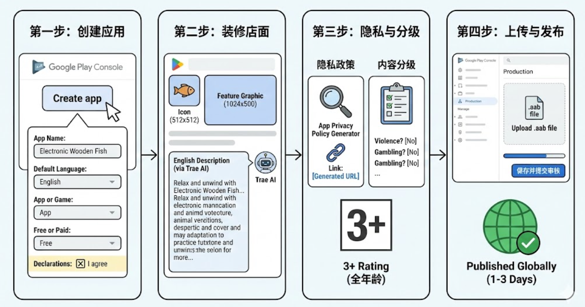

_Если вы уже завершили регистрацию аккаунта разработчика, это видеоруководство может провести вас через остальную часть процесса:_ [Полный рабочий процесс: загрузка приложения Android в Google Play](https://www.bilibili.com/video/BV16REQzGEnk/?share_source=weixin&vd_source=b42f227a4f2d413fbde18499d83227cf)

# 7 Заключительные замечания

На этом мы подошли к концу руководства. Глядя на электронную деревянную рыбу, которую вы лично создали на своём телефоне, мне интересно, что вы сейчас чувствуете.

Как человек, обученный программной инженерии, я на самом деле испытываю немало эмоций в сегодняшнюю эпоху стремительного развития AI. Раньше мы прорабатывали толстые книги по программированию, учили сложный синтаксис, сражались с настройкой среды и тратили половину дня на борьбу с красными сообщениями об ошибках. Но времена изменились, и теперь мы всё больше учимся тому, как направлять AI.

Через эту практику Vibe Coding вы уже прошли весь процесс разработки приложения для Android. Технический барьер действительно становится ниже. Нам больше не нужно постоянно перемалывать сухой код, и мы можем тратить больше энергии на решение того, **что строить**. Но какими бы мощными ни были инструменты, они всё равно лишь инструменты. Не позволяйте этому приложению пылиться на вашем телефоне. Продолжайте ковыряться в нём, ломайте его и снова чините. Только когда вы начнёте иметь собственные идеи и воплощать их в жизнь, вы по-настоящему перешагнёте порог.

Если это руководство помогло вам почувствовать, что «создание приложения на самом деле не так уж сложно», тогда для меня честь — помочь привести в мир разработки ещё одного создателя нового поколения.

Я по-настоящему с нетерпением жду вашего следующего творения. Так держать!


**_Надеюсь, вам будет весело в мире разработки под Android!_**

# Источники

CSDN: [Как упаковать/собрать проект Android Studio (2024-03-04)](https://blog.csdn.net/GenuineMonster/article/details/136443130?ops_request_misc=&request_id=&biz_id=102&utm_term=android%20studio%20%E6%89%93%E5%8C%85%20APK%20%E5%B9%B6%E5%88%86%E4%BA%AB&utm_medium=distribute.pc_search_result.none-task-blog-2~all~sobaiduweb~default-1-136443130.142^v102^pc_search_result_base4&spm=1018.2226.3001.4187)

CSDN: [Установка и настройка Android Studio](https://blog.csdn.net/Changersh/article/details/149838228?ops_request_misc=&request_id=&biz_id=102&utm_term=android%20studio%E5%AE%89%E8%A3%85%E5%8F%8A%E9%85%8D%E7%BD%AE&utm_medium=distribute.pc_search_result.none-task-blog-2~all~sobaiduweb~default-0-149838228.142^v102^pc_search_result_base4&spm=1018.2226.3001.4187)
