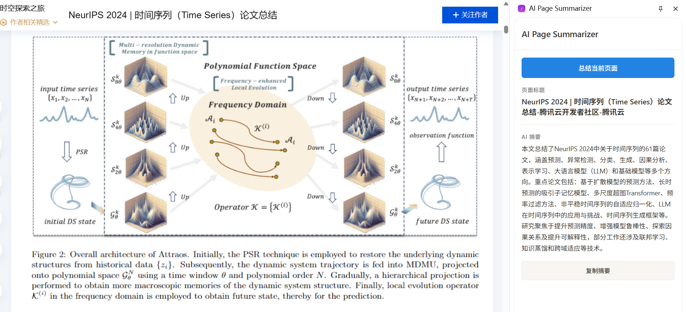
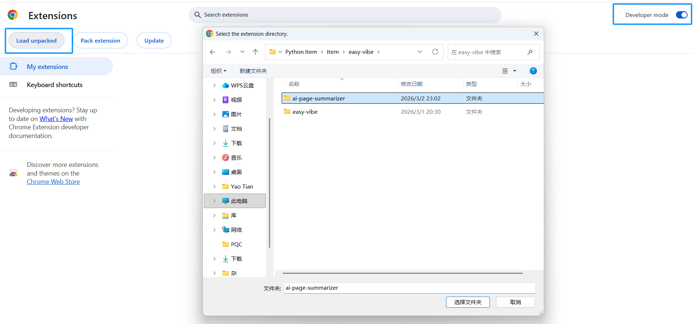
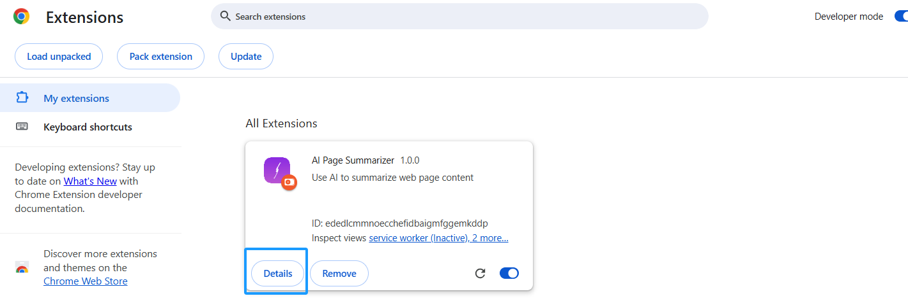
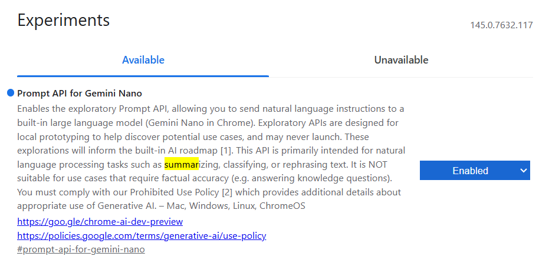
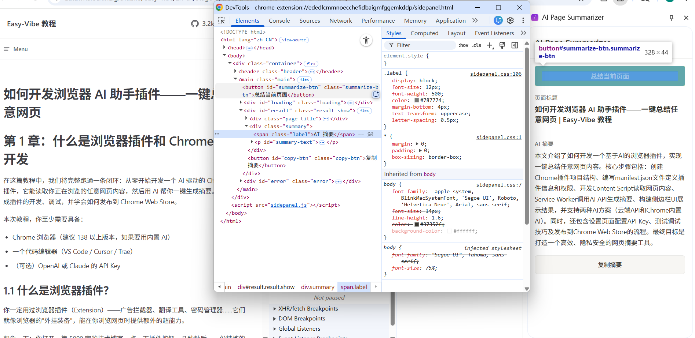
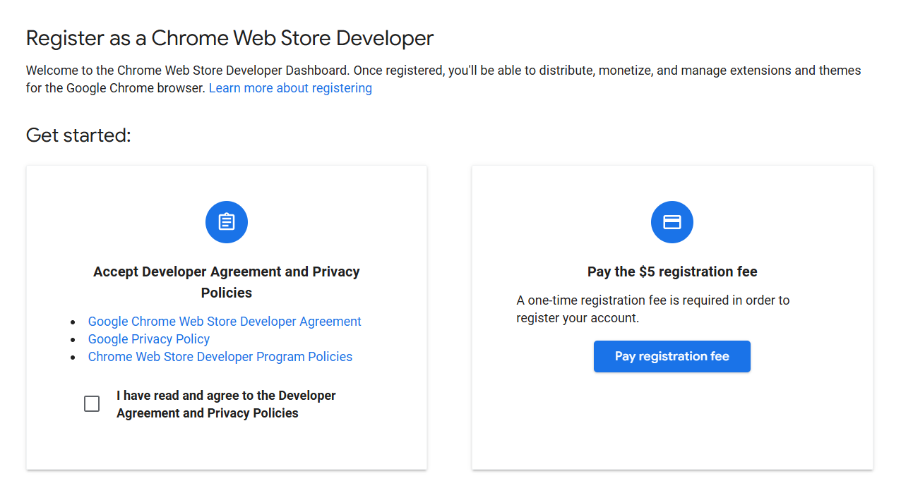
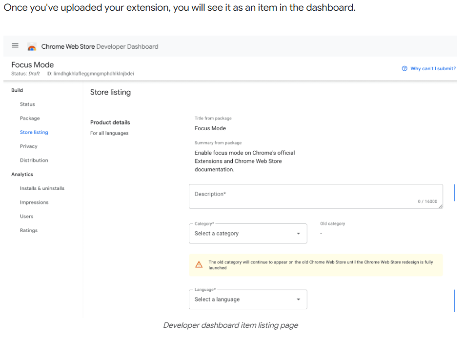

# Как создать браузерное расширение — AI-ассистента: суммируйте любую веб-страницу в один клик

# Глава 1. Что такое браузерные расширения и разработка расширений для Chrome

В этом руководстве мы пройдём полный замкнутый цикл: создадим с нуля браузерное расширение для Chrome на основе AI. Оно сможет читать содержимое любой веб-страницы, которую вы просматриваете, а затем использовать AI для генерации краткого резюме в один клик. Вы лично пройдёте разработку и отладку расширения, а также научитесь публиковать его в Chrome Web Store.

Для этого руководства вам как минимум потребуется:

- Браузер Chrome (рекомендуется версия 138+, если вы хотите использовать встроенный AI)
- Редактор кода (VS Code / Cursor / Trae)
- (Опционально) API Key от OpenAI или Claude

## 1.1 Что такое браузерное расширение?

Вы наверняка уже пользовались браузерными расширениями: блокировщики рекламы, инструменты перевода, менеджеры паролей... Они подобны «дополнительному снаряжению» для вашего браузера, давая вам суперспособности во время веб-сёрфинга.

Представьте: вы открываете технический блог-пост на 5000 слов, один раз нажимаете кнопку расширения, и через несколько секунд в боковой панели появляется лаконичное резюме на русском языке. Именно это мы и собираемся создать.



<!--  -->

## 1.2 Базовая архитектура расширения Chrome

Расширения Chrome (на основе Manifest V3) состоят из нескольких ключевых частей, у каждой из которых своя роль:

* **Файл манифеста (`manifest.json`)**: «удостоверение личности» расширения, объявляющее его имя, разрешения, входные файлы и многое другое.
* **Service Worker (фоновый скрипт)**: «мозг» расширения, обрабатывающий события и вызывающий API в фоне. Он не работает непрерывно, а запускается по мере необходимости.
* **Content Script (контентный скрипт)**: «глаза» расширения, внедряемые в веб-страницы и способные читать содержимое DOM.
* **Side Panel (боковая панель)**: «лицо» расширения, показывающее UI в правой части браузера, где пользователи видят результаты AI-резюме.
* **Options Page (страница настроек)**: позволяет пользователям настраивать API Key и связанные параметры.

Их рабочий процесс выглядит так:

```text
User clicks the extension icon
    -> Side panel opens
    -> User clicks the "Summarize" button
    -> Side panel notifies the Service Worker
    -> Service Worker asks Content Script to read page text
    -> Content Script returns page content
    -> Service Worker sends content to AI API
    -> AI returns the summary
    -> Service Worker sends the summary back to the side panel for display
```


<!--  -->

## 1.3 Два варианта AI: облачный API или встроенный AI браузера

У нашего расширения есть два способа получить доступ к возможностям AI:

**Вариант A: вызов облачных AI API (OpenAI / Claude)**

* Плюсы: мощные возможности модели, поддержка всех устройств
* Минусы: нужен API Key, требуется интернет, есть стоимость использования
* Лучше всего подходит для: высококачественных резюме и обработки более сложного контента

**Вариант B: использование встроенного AI Chrome (Summarizer API)**

Начиная с Chrome 138, Google встроил возможности AI на базе Gemini Nano прямо в браузер. Одна из них — **Summarizer API**: он работает полностью локально, не требует API Key, не требует интернета и совершенно бесплатен.

* Плюсы: бесплатно, конфиденциальность, не нужен API Key
* Минусы: требуется Chrome 138+, более мощное железо (4 ГБ+ видеопамяти или 16 ГБ+ ОЗУ), возможности модели слабее, чем у облачного AI
* Лучше всего подходит для: пользователей, которые заботятся о конфиденциальности, не хотят платить и располагают достаточным железом

**Это руководство реализует оба варианта**, и вы можете выбрать, исходя из своей ситуации.

## 1.4 План руководства

Мы создадим с нуля расширение Chrome под названием **«AI Page Summarizer»**, выполнив следующие шаги:

1. **Создание каркаса расширения**: создать структуру проекта Manifest V3 и загрузить её в Chrome
2. **Реализация основной функции**: Content Script читает страницу + Service Worker вызывает AI API + боковая панель показывает результаты
3. **Интеграция встроенного AI Chrome**: использовать Summarizer API для бесплатного локального резюмирования
4. **Тестирование и отладка**: освоить приёмы отладки расширений Chrome
5. **Публикация в Chrome Web Store**: упаковать и отправить на проверку

# Глава 2. Создание каркаса расширения

## 2.1 Создание структуры проекта

Откройте свой AI-ассистент для написания кода (Cursor / Trae / Claude Code), создайте пустую папку с именем `ai-page-summarizer`, затем введите следующее в окне чата:

```text
Please help me create a Chrome browser extension project using Manifest V3.
The project name is ai-page-summarizer, and its function is to summarize webpage content with AI.
Please create the following file structure:

ai-page-summarizer/
├── manifest.json          # MV3 manifest file
├── background.js          # Service Worker background script
├── content.js             # Content script (reads webpage text)
├── sidepanel.html         # Side panel HTML
├── sidepanel.js           # Side panel logic
├── sidepanel.css          # Side panel styling
├── options.html           # Settings page
├── options.js             # Settings page logic
└── icons/                 # Icons folder

Requirements for manifest.json:
1. manifest_version: 3
2. Permissions: storage, activeTab, scripting, sidePanel
3. Use service_worker: "background.js" for background
4. Configure side_panel with default path sidepanel.html
5. Configure default icon and title for action
```

AI сгенерирует для вас полный каркас проекта. Давайте посмотрим, что делает каждый файл.

## 2.2 `manifest.json`: «удостоверение личности» расширения

Это самый важный файл в расширении Chrome. Он сообщает браузеру, что это за расширение, какие разрешения ему нужны и какие компоненты оно содержит:

```json
{
  "manifest_version": 3,
  "name": "AI Page Summarizer",
  "version": "1.0",
  "description": "Use AI to summarize any webpage in one click",
  "permissions": ["storage", "activeTab", "scripting", "sidePanel"],
  "background": {
    "service_worker": "background.js"
  },
  "action": {
    "default_title": "AI Page Summarizer",
    "default_icon": {
      "16": "icons/icon-16.png",
      "48": "icons/icon-48.png",
      "128": "icons/icon-128.png"
    }
  },
  "side_panel": {
    "default_path": "sidepanel.html"
  },
  "options_page": "options.html",
  "icons": {
    "16": "icons/icon-16.png",
    "48": "icons/icon-48.png",
    "128": "icons/icon-128.png"
  }
}
```

**Пояснение разрешений:**

* `storage`: позволяет расширению хранить данные, например API Key пользователя
* `activeTab`: позволяет расширению получать доступ к текущей вкладке, которую просматривает пользователь (только после взаимодействия пользователя, поэтому это очень безопасно)
* `scripting`: позволяет расширению внедрять скрипты в страницы для чтения содержимого
* `sidePanel`: позволяет расширению использовать API боковой панели Chrome


<!--  -->

## 2.3 Подготовка иконок

Расширениям Chrome нужны иконки трёх размеров: 16x16, 48x48 и 128x128. Вы можете попросить AI сгенерировать их:

```text
Please help me generate three simple Chrome extension icons (16x16, 48x48, 128x128),
with a rounded rectangle, gradient purple background, and a white AI lightning symbol in the center.
Save them in the icons/ directory as icon-16.png, icon-48.png, and icon-128.png.
```

## 2.4 Загрузка расширения в Chrome

Прежде чем писать код, давайте сначала загрузим эту «пустую оболочку» расширения в Chrome, чтобы каждое последующее изменение можно было сразу предварительно просмотреть:

1. Откройте Chrome и введите `chrome://extensions/` в адресной строке
2. Включите **Режим разработчика** в правом верхнем углу
3. Нажмите **Загрузить распакованное расширение**
4. Выберите вашу папку `ai-page-summarizer`

Вы увидите, что расширение появилось в списке, а его иконка отобразится на панели инструментов Chrome.



<!--  -->

> **Совет**: после каждого изменения кода возвращайтесь на `chrome://extensions/` и нажимайте **кнопку обновления (🔄)** на карточке расширения, чтобы обновить его.

# Глава 3. Реализация основной функции — чтение страницы + AI-резюме

## 3.1 Content Script: чтение текста страницы

Content Script — это скрипт, внедряемый в веб-страницу. Он может напрямую обращаться к DOM страницы. Мы используем его для извлечения текста страницы.

Попросите AI написать `content.js`:

```text
Please help me write content.js with the following functions:
1. Listen for messages from Service Worker
2. When receiving a "getPageContent" message, extract the current page text content
3. Extraction logic: get document.body.innerText, and also get the page title and URL
4. Return the extracted content via sendResponse
```

AI сгенерирует код примерно такой:

```javascript
// content.js
chrome.runtime.onMessage.addListener((request, sender, sendResponse) => {
  if (request.action === 'getPageContent') {
    const content = document.body.innerText || document.body.textContent
    sendResponse({
      content: content.trim(),
      title: document.title,
      url: window.location.href
    })
  }
  return true // Keep the message channel open
})
```

## 3.2 Service Worker: вызов AI API

Service Worker — это «мозг» расширения. Он координирует взаимодействие между компонентами и вызывает внешние AI API.

Попросите AI написать `background.js`:

```text
Please help me write background.js with the following functions:
1. When the user clicks the extension icon, open the side panel
2. Listen for "summarize" messages from the side panel
3. After receiving the message, send "getPageContent" to the content script in the current tab to get page content
4. After receiving the page content, read the user's configured API Key and model selection from chrome.storage.local
5. Call the corresponding AI API according to the configuration (support OpenAI and Claude)
6. Send the AI summary back to the side panel

For OpenAI, call https://api.openai.com/v1/chat/completions and use model gpt-4o-mini
For Claude, call https://api.anthropic.com/v1/messages and use model claude-sonnet-4-20250514
System prompt: Please summarize the following webpage content in Chinese, extract the key points, and keep it within 300 Chinese characters.
```

Основной код выглядит так:

```javascript
// background.js

// Open the side panel when the user clicks the icon
chrome.sidePanel.setPanelBehavior({ openPanelOnActionClick: true })

// Listen for messages from the side panel
chrome.runtime.onMessage.addListener((request, sender, sendResponse) => {
  if (request.action === 'summarize') {
    handleSummarize(request.tabId).then(sendResponse)
    return true // Async response
  }
})

async function handleSummarize(tabId) {
  // 1. Get page content
  const [response] = await chrome.tabs.sendMessage(tabId, {
    action: 'getPageContent'
  })

  // 2. Read user settings
  const { apiKey, provider } = await chrome.storage.local.get([
    'apiKey', 'provider'
  ])

  if (!apiKey) {
    return { error: 'Please configure your API Key in the settings page first' }
  }

  // 3. Call AI API
  const summary = provider === 'claude'
    ? await callClaude(response.content, apiKey)
    : await callOpenAI(response.content, apiKey)

  return { summary, title: response.title }
}
```


<!--  -->

## 3.3 UI боковой панели: показ результата резюме

Боковая панель — это основной UI для взаимодействия с пользователями. Попросите AI написать HTML, CSS и JS для боковой панели:

```text
Please help me write these three files for the side panel:

sidepanel.html:
- Show the plugin name "AI Page Summarizer" at the top
- A blue "Summarize Current Page" button
- A loading animation area (hidden by default)
- A result display area showing the page title and AI summary
- A "Copy Summary" button at the bottom

sidepanel.css:
- Clean modern design, similar to Notion typography
- Width adapts to the side panel
- Buttons have hover effects
- Loading animation implemented with CSS

sidepanel.js:
- When clicking the "Summarize" button, get the current tab ID
- Send a summarize message to background.js
- Show loading animation
- Hide loading and display summary after receiving result
- Use navigator.clipboard.writeText in the "Copy" button to copy text
```


<!--  -->

## 3.4 Страница настроек: настройка API Key

Пользователям нужно место, чтобы ввести собственный API Key. Попросите AI написать страницу настроек:

```text
Please help me write options.html and options.js:
- A dropdown to choose AI provider (OpenAI / Claude)
- A password input for API Key (type="password")
- A "Save" button
- Save config with chrome.storage.local.set
- Read saved config from storage and fill the form on page load
- Show "Settings saved" after saving
```

> **Напоминание о безопасности**: API Key хранится в `chrome.storage.local` и остаётся только на локальном устройстве. Но если вы хотите опубликовать это расширение в Chrome Web Store для других пользователей, более безопасный подход — построить бэкенд-прокси-сервер, чтобы API Key не раскрывался напрямую на стороне клиента.




<!--  -->

# Глава 4. Использование встроенного AI Chrome (без API Key)

Начиная с Chrome 138, Google встроил возможности AI на базе **Gemini Nano** прямо в браузер. Лучше всего для нашего случая подходит **Summarizer API**: он работает полностью локально, не требует API Key, не требует интернета и бесплатен.

## 4.1 Проверка поддержки браузером

У встроенного AI есть требования к железу:

* Десктопный Chrome 138+ (Windows 10+, macOS 13+, Linux, ChromeOS)
* 22 ГБ свободного места для хранения (для загрузки модели)
* 4 ГБ+ видеопамяти GPU или 16 ГБ+ системной ОЗУ с 4+ ядрами CPU

Введите `chrome://flags` в адресной строке Chrome, найдите флаг, связанный с Summarization, и убедитесь, что он **Enabled**.
* В Chrome 131-137 этот переключатель называется Summarization API.
* В Chrome 138-144 он был переименован в Summarization API for Gemini Nano.
* В Chrome 145+ Summarization API for Gemini Nano был удалён, а его функция резюмирования была интегрирована в Prompt API for Gemini Nano.


<!--  -->

## 4.2 Использование Summarizer API

Попросите AI добавить поддержку встроенного AI в `background.js`:

```text
Please help me add Chrome built-in Summarizer API support in background.js:
1. Add a summarizeWithBuiltinAI function
2. First check whether Summarizer.availability() returns 'readily-available'
3. If available, create a summarizer instance, configure type as 'key-points', format as 'markdown', and length as 'medium'
4. Call summarizer.summarize() to summarize
5. In handleSummarize, add a branch for provider === 'builtin'
```

Основной код:

```javascript
async function summarizeWithBuiltinAI(text) {
  // Check availability
  const availability = await Summarizer.availability()
  if (availability !== 'readily-available') {
    throw new Error('Chrome built-in AI is not available. Please check browser version and hardware requirements.')
  }

  // Create summarizer
  const summarizer = await Summarizer.create({
    type: 'key-points',
    format: 'markdown',
    length: 'medium'
  })

  // Run summary
  const summary = await summarizer.summarize(text, {
    context: 'This is a webpage article'
  })

  return summary
}
```

## 4.3 Обновление страницы настроек

Добавьте опцию **«Встроенный AI Chrome (бесплатно, без API Key)»** в выпадающий список провайдеров в `options.html`. Когда пользователи выбирают её, скройте поле ввода API Key, поскольку оно больше не нужно.

```text
Please help me modify options.html and options.js:
1. Add an option "Chrome built-in AI (free, no API Key needed)" to the provider dropdown, with value "builtin"
2. Hide the API Key input when builtin is selected
3. Show the API Key input when OpenAI or Claude is selected
```


<!--  -->

# Глава 5. Тестирование и отладка

## 5.1 Локальный рабочий процесс тестирования

Отладка расширений Chrome немного отличается от отладки обычных веб-страниц:

**Отладка Service Worker:**
1. Откройте `chrome://extensions/`
2. Найдите своё расширение и нажмите ссылку **Service Worker**
3. Откроется отдельное окно DevTools, где вы сможете видеть вывод `console.log` и сетевые запросы

**Отладка боковой панели:**
1. Откройте боковую панель
2. Нажмите правой кнопкой мыши внутри содержимого боковой панели
3. Выберите **Inspect**
4. Это откроет DevTools для боковой панели

**Отладка Content Script:**
1. Откройте DevTools клавишей F12 на любой веб-странице
2. В панели Console нажмите выпадающий список контекста выполнения в левом верхнем углу
3. Выберите имя вашего расширения
4. Затем вы сможете видеть вывод `console` из Content Script


<!--  -->

## 5.2 Типичные проблемы и их устранение

| Проблема | Возможная причина | Решение |
|------|---------|---------|
| Нажатие на иконку ничего не делает | Ошибка Service Worker | Проверьте Console в DevTools Service Worker |
| Не удаётся получить содержимое страницы | Content Script не внедрён | Обновите страницу и попробуйте снова, проверьте конфигурацию `matches` в манифесте |
| Вызов API не удаётся | API Key неверный или истёк | Введите API Key заново на странице настроек |
| Боковая панель пуста | Неверный путь к `sidepanel.html` | Проверьте `side_panel.default_path` в манифесте |


# Глава 6. Публикация в Chrome Web Store (опционально)

Если вы хотите поделиться расширением с другими, вы можете опубликовать его в Chrome Web Store.

## 6.1 Подготовка к публикации

1. **Зарегистрируйте аккаунт разработчика**: посетите [Chrome Web Store Developer Dashboard](https://chrome.google.com/webstore/devconsole) и оплатите единоразовый регистрационный взнос в $5
2. **Включите двухэтапную проверку (2-Step Verification)**: ваш аккаунт Google должен иметь включённую двухэтапную проверку перед публикацией
3. **Подготовьте ресурсы**:
   * Иконка расширения: PNG 128x128
   * Хотя бы один скриншот: рекомендуется 1280x800
   * Подробное описание функциональности
   * Пояснение политики конфиденциальности (если ваше расширение обрабатывает данные пользователей)

## 6.2 Упаковка и загрузка

1. Сожмите папку расширения в файл `.zip` (не `.crx`)
2. Нажмите **New Item** в Developer Dashboard
3. Загрузите файл `.zip`
4. Заполните информацию о магазине (имя, описание, скриншоты, категория и т. д.)
5. Заполните практики конфиденциальности (укажите, какие данные пользователей собирает ваше расширение)
6. Нажмите **Submit for Review**

Google проверяет отправленные расширения, что обычно занимает несколько рабочих дней. Чем меньше разрешений вы запрашиваете и чем понятнее ваше описание, тем быстрее обычно проходит проверка.




<!--  -->

# Глава 7. Заключение

Поздравляем! Вы создали с нуля браузерное расширение на основе AI. Давайте вспомним, что мы сделали:

1. Разобрались в архитектуре Manifest V3 расширений Chrome
2. Использовали Content Script для чтения содержимого веб-страницы
3. Использовали Service Worker для вызова AI API и генерации резюме
4. Использовали Side Panel для отображения результата резюме
5. А также научились использовать встроенный AI Chrome без какого-либо API Key

Разработка браузерных расширений — очень интересная область: она позволяет «улучшать» любую веб-страницу в интернете. Помимо резюмирования страниц, с похожей архитектурой вы можете создать ещё много всего:

**Продвинутые направления:**

* **Ассистент перевода**: перевод иностранных веб-страниц на русский в один клик
* **Аннотации для чтения**: выделение и аннотирование страниц с последующим сохранением в облако
* **Отслеживание цен**: мониторинг изменения цен на страницах интернет-магазинов с уведомлением пользователей
* **Объяснение кода**: выделите код на GitHub, и AI автоматически его объяснит

Появление встроенного AI Chrome ещё больше снижает порог входа — вам даже не нужен API Key, чтобы создавать расширения на основе AI. По мере того как возможности браузерного AI продолжают расти, пространство для воображения в этой области будет только увеличиваться.

***Идите и наделите свой браузер суперспособностями!***

# Источники

* [Официальная документация Chrome Extension — Manifest V3](https://developer.chrome.com/docs/extensions/develop/)
* [Публикация расширения Chrome в Chrome Web Store](https://developer.chrome.com/docs/webstore/publish?hl=zh-cn)
* [Chrome Side Panel API](https://developer.chrome.com/docs/extensions/reference/api/sidePanel)
* [Встроенный AI Chrome — Summarizer API](https://developer.chrome.com/docs/ai/summarizer-api)
* [Встроенный AI Chrome — Prompt API](https://developer.chrome.com/docs/ai/prompt-api)
* [Документация OpenAI API](https://platform.openai.com/docs/api-reference)
* [Документация Anthropic Claude API](https://docs.anthropic.com/ru-ru/docs/)
* [Документация Anthropic Claude API](https://developer.chrome.com/docs/webstore/publish?hl=zh-cn)
