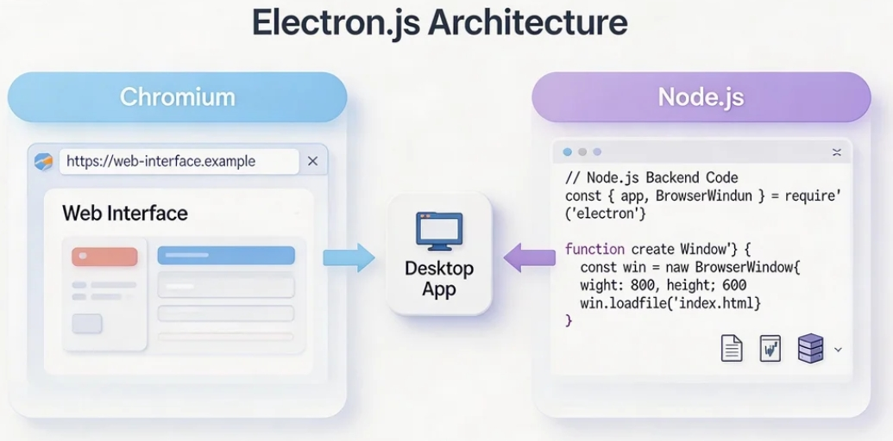
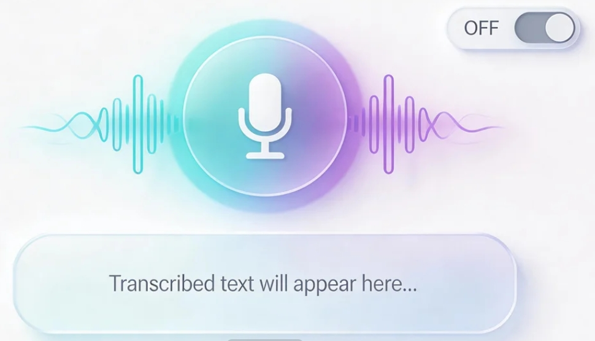
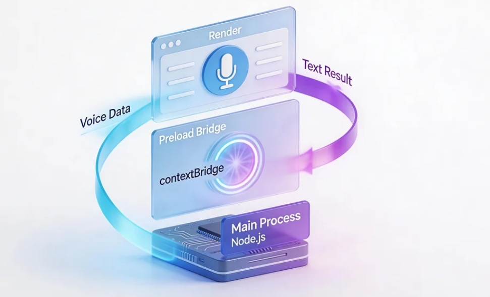
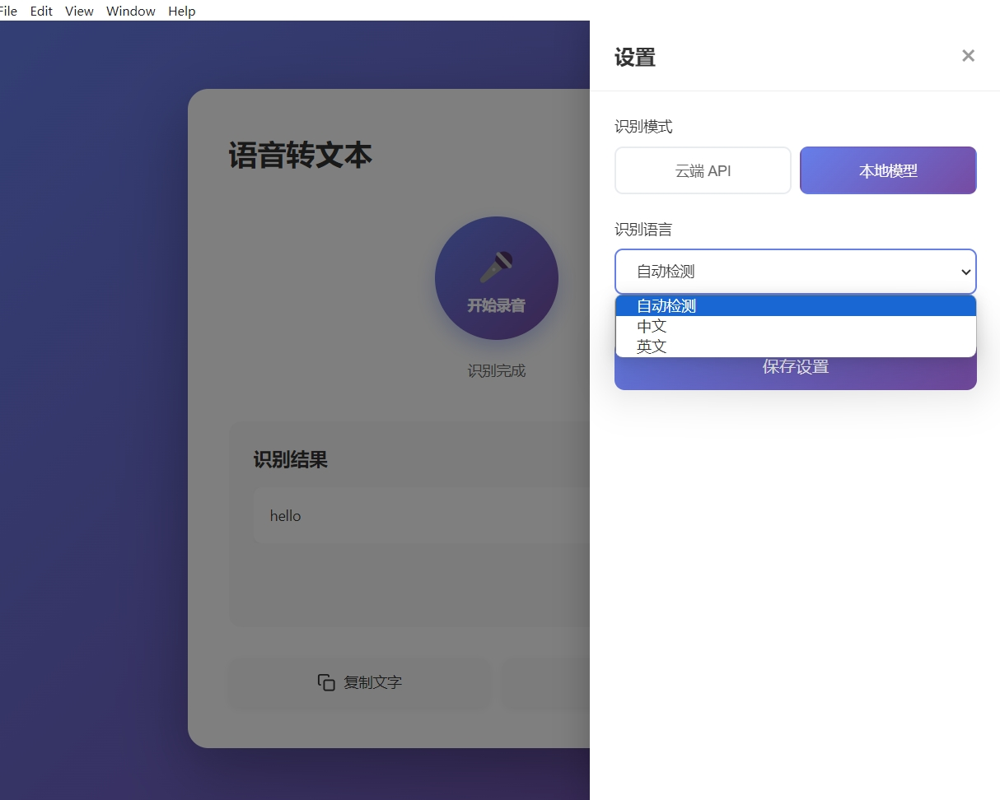
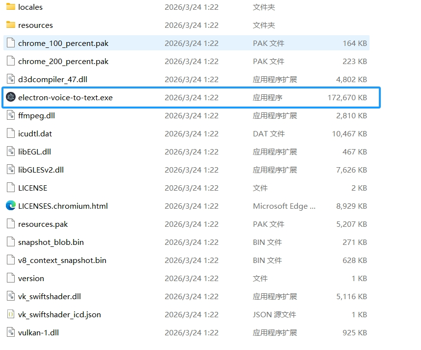

# Как создать кроссплатформенное десктопное приложение на Electron: приложение для преобразования речи в текст

# Глава 1. Что такое Electron и разработка десктопных приложений

В этом руководстве мы пройдём полный замкнутый цикл: создадим с нуля десктопное приложение для преобразования речи в текст на Electron, с поддержкой как облачного API, так и режима распознавания на локальной модели, и в итоге упакуем его в настоящее десктопное приложение, которое можно установить и запустить на Windows, macOS и Linux.

Для этого руководства вам как минимум потребуется:

- Компьютер (Windows или Mac, Mac рекомендуется, поскольку локальные модели работают очень быстро на Apple Silicon)
- Окружение Node.js (версия 18.0 или выше)
- Ваш AI-ассистент для написания кода (Cursor / Trae / Claude Code)
- (Опционально) API Key от OpenAI (если вы используете облачный режим)
- Микрофон (встроенного микрофона ноутбука достаточно)

## 1.1 Что такое Electron?

У приложений, которыми вы пользуетесь каждый день, таких как **VS Code, Slack, Discord и Notion**, есть одна общая черта: все они являются десктопными приложениями, созданными на **Electron**.

Electron — это фреймворк с открытым исходным кодом, который позволяет использовать **HTML + CSS + JavaScript** (тот же стек, что и для веб-страниц) для создания десктопных приложений, работающих на **Windows, macOS и Linux**. Принцип прост: упаковать вместе Chromium и Node.js, и ваша веб-страница превращается в самостоятельное десктопное приложение.

**Понимание в одной фразе**: Electron = «невидимый браузер Chrome» + системные возможности Node.js.

<!--  -->

## 1.2 Основная архитектура Electron

Приложение Electron состоит из двух типов процессов. Понимание их — ключ к разработке:

**Главный процесс (Main Process)**

* «Генеральный управляющий» приложения
* Отвечает за создание окон, управление жизненным циклом приложения и доступ к нативным возможностям, таким как файловая система
* Работает в окружении Node.js и может использовать все модули Node.js
* В каждом приложении только один главный процесс

**Процесс рендеринга (Renderer Process)**

* «Лицо» приложения
* По сути это веб-страница Chromium, отвечающая за отрисовку UI
* Каждое окно соответствует одному процессу рендеринга
* По соображениям безопасности процесс рендеринга не может напрямую обращаться к API Node.js

**Скрипт предзагрузки (Preload Script)**

* «Мост» между главным процессом и процессом рендеринга
* Использует `contextBridge` для безопасного предоставления выбранных API процессу рендеринга

Они взаимодействуют через **IPC (Inter-Process Communication, межпроцессное взаимодействие)**, как при телефонном звонке: процесс рендеринга говорит «я хочу начать запись», а главный процесс получает этот запрос и вызывает системный микрофон.

<!--  -->

## 1.3 Что мы создаём?

В этом руководстве мы создадим десктопное приложение **преобразования речи в текст (Speech-to-Text)**. Его функциональность проста:

1. Нажмите кнопку «Начать запись», и приложение начинает слушать микрофон
2. После того как вы закончили говорить, нажмите «Стоп», и приложение отправляет аудио на распознавание AI
3. Распознанный текст отображается в UI и может быть скопирован в один клик

**Доступны два режима распознавания:**

| Параметр сравнения | Режим облачного API | Режим локальной модели |
|---------|-------------|------------|
| Типичное решение | OpenAI Whisper API | whisper.cpp |
| Требуется интернет | Да | Нет |
| Скорость распознавания | Зависит от сети | Зависит от железа (очень быстро на Apple Silicon) |
| Качество распознавания | Отличное | Отличное (модель large-v3) |
| Стоимость | $0,006/минута | Бесплатно |
| Размер модели | Загрузка не требуется | Модель tiny 75 МБ, модель large 3 ГБ |
| Лучше всего подходит для | Быстрого старта, лёгкого использования | Заботы о конфиденциальности, офлайн-использования, долгосрочного частого использования |

<!--  -->

## 1.4 Важное замечание: Web Speech API недоступен в Electron

Если вы искали «распознавание речи в Electron», возможно, вы видели рекомендации использовать встроенный в браузер `Web Speech API`. **Обратите внимание: это не работает в Electron.**

Google прекратил поддержку речевого API для оболочек браузеров, отличных от Chrome/Edge. Electron основан на Chromium, но это не сам Chrome, поэтому `window.SpeechRecognition` сразу даст сбой.

Именно поэтому нам нужны независимые решения, такие как OpenAI Whisper API или whisper.cpp.

## 1.5 План руководства

Мы пройдём полный путь в следующие шаги:

1. **Создание проекта Electron**: использовать Electron Forge для создания каркаса проекта и понять межпроцессное взаимодействие
2. **Реализация записи**: захват входного сигнала микрофона в процессе рендеринга и обработка аудиоданных
3. **Облачное распознавание (Вариант A)**: использовать OpenAI Whisper API для преобразования речи в текст
4. **Локальное распознавание (Вариант B)**: использовать whisper.cpp локально без доступа к интернету
5. **Упаковка и распространение**: упаковать приложение в устанавливаемую десктопную программу

# Глава 2. Создание проекта Electron

## 2.1 Инициализация проекта с помощью AI

Откройте свой AI-ассистент для написания кода и введите этот промпт:

```
Please help me create a new Electron project with Electron Forge using the Vite template.
The project name is voice-to-text.
Please run: npx create-electron-app voice-to-text --template=vite
After creation, enter the project directory and install dependencies.
```

Electron Forge — это официально рекомендуемый Electron инструмент для создания каркаса. Он помогает с инициализацией проекта, упаковкой, распространением и другими рутинными задачами настройки.

После создания структура проекта примерно такая:

```text
voice-to-text/
├── src/
│   ├── main.js            # Main process entry
│   ├── preload.js         # Preload script (bridge)
│   ├── renderer.js        # Renderer process entry
│   └── index.html         # App HTML page
├── forge.config.js        # Electron Forge config
├── vite.main.config.mjs   # Main process Vite config
├── vite.preload.config.mjs # Preload script Vite config
├── vite.renderer.config.mjs # Renderer process Vite config
└── package.json
```

## 2.2 Запуск и предварительный просмотр

Попросите AI запустить сервер разработки:

```
Please help me start the Electron development server by running npm start
```

Через несколько секунд появится десктопное окно. Это ваше приложение Electron. Хотя сейчас оно показывает только стандартную приветственную страницу, это уже настоящая десктопная программа.

<!--  -->

## 2.3 Понимание IPC (межпроцессного взаимодействия)

Прежде чем реализовывать речевые функции, нам нужно понять важнейшую концепцию Electron: **IPC (Inter-Process Communication, межпроцессное взаимодействие)**.

Поскольку процесс рендеринга (UI) и главный процесс (системные возможности) изолированы, они должны взаимодействовать через «телефонные звонки» IPC:

```text
Renderer process (UI)                 Main process (system)
    │                                │
    │── "I want to start recording" ──────────→   │
    │                                │── Call microphone
    │                                │── Process audio
    │   ←──── "Here is the result" ─────────────│
    │                                │
    │── Display text in UI           │
```

В коде это взаимодействие осуществляется через `preload.js`:

```javascript
// preload.js - safely expose APIs to renderer process
const { contextBridge, ipcRenderer } = require('electron')

contextBridge.exposeInMainWorld('electronAPI', {
  // Renderer -> Main
  sendAudio: (audioData) => ipcRenderer.invoke('transcribe-audio', audioData),
  // Main -> Renderer
  onResult: (callback) => ipcRenderer.on('transcription-result', callback)
})
```

```javascript
// main.js - main process listens for messages
const { ipcMain } = require('electron')

ipcMain.handle('transcribe-audio', async (event, audioData) => {
  // Call Whisper API or whisper.cpp here
  const text = await transcribe(audioData)
  return text
})
```

<!--  -->

# Глава 3. Реализация записи

## 3.1 Захват входного сигнала микрофона в процессе рендеринга

Браузер (то есть процесс рендеринга Electron) предоставляет `navigator.mediaDevices.getUserMedia` для доступа к микрофону. Попросите AI помочь реализовать запись:

```
Please help me modify src/index.html and src/renderer.js to implement:

UI:
1. A large circular "Start Recording" button, which turns into a red "Stop Recording" button when clicked
2. Show a simple pulse animation while recording
3. A text display area below for recognition results
4. Two buttons at the bottom: "Copy Text" and "Clear"
5. A settings icon at top-right to switch recognition mode (cloud/local)

Recording logic (in renderer.js):
1. On button click, request microphone access via navigator.mediaDevices.getUserMedia
2. Use MediaRecorder to record audio in webm format
3. After stopping, convert audio Blob to ArrayBuffer
4. Send it to main process via window.electronAPI.sendAudio
5. Wait for recognition result from main process and display it
```

Основной код записи:

```javascript
// renderer.js
let mediaRecorder = null
let audioChunks = []

async function startRecording() {
  const stream = await navigator.mediaDevices.getUserMedia({
    audio: {
      channelCount: 1,
      sampleRate: 16000,
      echoCancellation: true,
      noiseSuppression: true
    }
  })

  mediaRecorder = new MediaRecorder(stream, {
    mimeType: 'audio/webm;codecs=opus'
  })

  audioChunks = []
  mediaRecorder.ondataavailable = (e) => audioChunks.push(e.data)

  mediaRecorder.onstop = async () => {
    const audioBlob = new Blob(audioChunks, { type: 'audio/webm' })
    const arrayBuffer = await audioBlob.arrayBuffer()

    // Send to main process for transcription
    const result = await window.electronAPI.sendAudio(arrayBuffer)
    document.getElementById('result').textContent = result
  }

  mediaRecorder.start()
}
```

<!--  -->

## 3.2 Обработка разрешений микрофона

Electron по умолчанию блокирует запросы разрешений. Нам нужно явно разрешить доступ к микрофону в главном процессе:

```
Please help me add microphone permission handling in main.js:
1. Use session.defaultSession.setPermissionRequestHandler to handle permission requests
2. Auto-allow when request type is 'media'
3. For macOS, ensure microphone usage description is declared in package.json or entitlements
```

```javascript
// Add to main.js
const { session } = require('electron')

session.defaultSession.setPermissionRequestHandler(
  (webContents, permission, callback) => {
    if (permission === 'media') {
      callback(true)
    } else {
      callback(false)
    }
  }
)
```

> **Замечание для пользователей macOS**: macOS покажет системное диалоговое окно разрешения на микрофон. Это нормально. Нажмите «Разрешить».

# Глава 4. Вариант A — облачное распознавание (OpenAI Whisper API)

Это самый простой вариант. Вам нужен только API-ключ и несколько строк кода.

## 4.1 Получение API Key от OpenAI

1. Посетите [OpenAI Platform](https://platform.openai.com/), зарегистрируйтесь и войдите
2. Перейдите на страницу API Keys и нажмите **«Create new secret key»**
3. Скопируйте сгенерированный ключ (начинается с `sk-`) и храните его в безопасном месте

> **Справка по стоимости**: Whisper API стоит **$0,006/минута**. Это означает, что распознавание 1 часа аудио стоит всего $0,36, что очень доступно.

## 4.2 Вызов Whisper API в главном процессе

Попросите AI реализовать распознавание речи в главном процессе:

```
Please help me implement OpenAI Whisper API in main.js:
1. Install node-fetch (if needed) or use built-in fetch in Node.js
2. Create transcribeWithWhisper function that accepts audio ArrayBuffer
3. Convert ArrayBuffer to Blob/File and build FormData
4. Call https://api.openai.com/v1/audio/transcriptions
5. Use model whisper-1 and set language to zh (Chinese)
6. Return the recognized text
7. Read API key from environment variables or config file
```

Основной код:

```javascript
// main.js
async function transcribeWithWhisper(audioBuffer, apiKey) {
  const blob = new Blob([audioBuffer], { type: 'audio/webm' })
  const formData = new FormData()
  formData.append('file', blob, 'audio.webm')
  formData.append('model', 'whisper-1')
  formData.append('language', 'zh')

  const response = await fetch(
    'https://api.openai.com/v1/audio/transcriptions',
    {
      method: 'POST',
      headers: { Authorization: `Bearer ${apiKey}` },
      body: formData
    }
  )

  const data = await response.json()
  return data.text
}
```

<!--  -->

## 4.3 Добавление UI настроек

Попросите AI добавить простую панель настроек в процесс рендеринга для ввода API-ключа и переключения режима распознавания:

```
Please help me add a settings panel in index.html:
1. Add a gear icon in the top-right corner; click to expand settings panel
2. The panel includes:
   - Recognition mode switch (Cloud API / Local model)
   - API Key input (only visible in cloud mode)
   - Language dropdown (Chinese / English / Auto detect)
3. Save settings to localStorage
4. Close panel when clicking outside
```

<!--  -->

# Глава 5. Вариант B — локальное распознавание (whisper.cpp)

Если вы не хотите зависеть от облачных API или если вам нужно офлайн-использование, whisper.cpp — лучший выбор. Это порт модели OpenAI Whisper на C++, который работает полностью локально без интернета.

## 5.1 Установка привязок whisper.cpp для Node.js

Попросите AI установить и настроить:

```
Please help me install nodejs-whisper in the project:
npm install nodejs-whisper

After installation, please help me download the whisper tiny model (small size, fast for testing).
nodejs-whisper will handle model download automatically.
```

> **Руководство по выбору модели**:
> * `tiny` (75 МБ): самая быстрая, подходит для тестирования и лёгкого использования, средняя точность
> * `base` (142 МБ): баланс между скоростью и точностью
> * `small` (466 МБ): заметно лучшее качество распознавания
> * `large-v3-turbo` (1,5 ГБ): рекомендуется; в 5-8 раз быстрее, чем large, при точности всего на 1-2% ниже
> * `large-v3` (3 ГБ): наивысшая точность, но медленнее и требует более мощного железа

## 5.2 Интеграция whisper.cpp в главный процесс

Попросите AI реализовать локальное распознавание:

```
Please help me add whisper.cpp local recognition in main.js:
1. Import nodejs-whisper
2. Create transcribeWithLocal function
3. Accept audio ArrayBuffer and save it as a temporary WAV file first (16kHz mono)
4. Call nodejs-whisper for recognition
5. Return recognized text
6. Delete temporary file after recognition
```

Основной код:

```javascript
// main.js
const { nodewhisper } = require('nodejs-whisper')
const path = require('path')
const fs = require('fs')
const os = require('os')

async function transcribeWithLocal(audioBuffer) {
  // Save as temp file
  const tempPath = path.join(os.tmpdir(), `recording-${Date.now()}.wav`)
  fs.writeFileSync(tempPath, Buffer.from(audioBuffer))

  try {
    const result = await nodewhisper(tempPath, {
      modelName: 'base',
      autoDownloadModelName: 'base',
      whisperOptions: {
        language: 'zh',
        word_timestamps: true
      }
    })
    return result.map(r => r.speech).join('')
  } finally {
    // Clean up temp file
    fs.unlinkSync(tempPath)
  }
}
```

<!--  -->

## 5.3 Хорошие новости для пользователей Apple Silicon

Если вы используете Mac на M1/M2/M3/M4, whisper.cpp может автоматически использовать **ускорение GPU Metal** и **Apple Neural Engine**. Распознавание может работать **быстрее, чем в реальном времени**, что означает, что обработка 1 минуты аудио может занимать всего несколько секунд.

Для пользователей GPU NVIDIA whisper.cpp также поддерживает **ускорение CUDA**, что тоже обеспечивает высокую производительность.

# Глава 6. Упаковка и распространение

После завершения разработки нам нужно упаковать приложение в распространяемые установщики.

## 6.1 Упаковка с помощью Electron Forge

Electron Forge уже включён в наш проект, поэтому упаковка проста:

```
Please help me run the Electron Forge packaging command:
npx electron-forge make
```

Эта команда автоматически генерирует установщики для вашей текущей операционной системы:

* **macOS**: образ установщика `.dmg` и архив `.zip`
* **Windows**: установщик `.exe` (формат Squirrel)
* **Linux**: пакеты `.deb` (Debian/Ubuntu) и `.rpm` (Fedora)

Результаты сборки находятся в каталоге `out/make/`.

<!--  -->

## 6.2 Оптимизация размера приложения

Одна из «болевых точек» приложений Electron — большой размер пакета (потому что в него встроен Chromium). Рекомендации по оптимизации:

* Убедитесь, что упаковываются только пакеты из `dependencies`, а dev-зависимости остаются в `devDependencies`
* Используйте tree-shaking в Vite для уменьшения размера JavaScript
* Если вы используете локальные модели, рассмотрите вариант загрузки моделей при первом запуске вместо включения их в установщик

| Конфигурация | Ориентировочный размер |
|------|---------|
| Чистое приложение Electron (без модели) | ~150-200 МБ |
| + модель whisper tiny | ~250 МБ |
| + модель whisper large-v3-turbo | ~1,7 ГБ |

## 6.3 Замечания о кроссплатформенности

**macOS:**
* Публикация в App Store или распространение среди других требует **подписи кода** (Apple Developer ID, $99/год)
* Также требуется процесс **нотаризации (Notarization)** от Apple
* Разрешения микрофона должны объявлять `NSMicrophoneUsageDescription` в `Info.plist`
* Рекомендуется собирать Universal Binary для поддержки как Intel, так и Apple Silicon

**Windows:**
* Подпись кода рекомендуется, иначе Windows SmartScreen будет показывать предупреждения безопасности
* Пользователи всё равно могут выбрать «Выполнить в любом случае» для неподписанных приложений

**Linux:**
* Подпись кода не требуется
* Рекомендуется предоставлять как формат `.deb`, так и `.AppImage`

> **Совет**: для личных проектов или небольшого распространения вы можете временно пропустить подпись кода и напрямую делиться упакованными файлами с друзьями.

# Глава 7. Заключение

Поздравляем! Вы создали с нуля кроссплатформенное десктопное приложение для преобразования речи в текст. Давайте вспомним, что мы сделали:

1. Использовали Electron Forge для создания каркаса кроссплатформенного десктопного приложения
2. Разобрались в главном процессе, процессе рендеринга и взаимодействии IPC
3. Реализовали запись с микрофона и захват аудио
4. Интегрировали два варианта распознавания речи: облачный Whisper API и локальный whisper.cpp
5. Научились упаковывать и распространять приложение Electron

Мощь Electron в том, что вы можете создавать десктопные приложения уровня VS Code или Slack, используя стек веб-технологий. А с появлением зрелого AI-распознавания речи функция вроде преобразования речи в текст, которая раньше требовала специализированной команды, теперь может быть создана одним человеком.

**Продвинутые направления:**

* **Субтитры в реальном времени**: используйте AudioWorklet для потокового аудио в сочетании с потоковыми API распознавания для живой транскрипции
* **Ассистент совещаний**: записывайте совещания целиком, автоматически генерируйте транскрипты с временными метками и резюмируйте ключевые моменты с помощью AI
* **Многоязычный перевод**: транскрибируйте речь и вызывайте API перевода для преобразования между языками в реальном времени
* **Голосовой блокнот**: в сочетании с локальной базой данных (например, SQLite) создайте голосовые заметки с возможностью поиска

***Пусть ваш голос — и пусть код — записывают всё за вас.***

# Источники

* [Официальная документация Electron](https://www.electronjs.org/docs/latest/)
* [Официальная документация Electron Forge](https://www.electronforge.io/)
* [Документация OpenAI Whisper API](https://platform.openai.com/docs/guides/speech-to-text)
* [Репозиторий whisper.cpp на GitHub](https://github.com/ggml-org/whisper.cpp)
* [npm-пакет nodejs-whisper](https://www.npmjs.com/package/nodejs-whisper)
* [MDN MediaDevices.getUserMedia()](https://developer.mozilla.org/en-US/docs/Web/API/MediaDevices/getUserMedia)
