# Как создать приложение для iOS — нативная разработка на SwiftUI

## Глава 1: Что такое приложение для iOS и разработка под iOS

В этом руководстве мы пройдём полный замкнутый цикл: **от идеи в вашей голове до настоящего приложения для iOS, которое можно успешно установить и запустить на iPhone.**

Для этого руководства у вас должны быть как минимум:

1. Mac с относительно свежей версией macOS
2. iPhone с относительно свежей версией iOS, с включённым режимом разработчика
3. Успешно установленный Xcode
4. Установленный и открытый Trae
5. Рабочий Apple ID

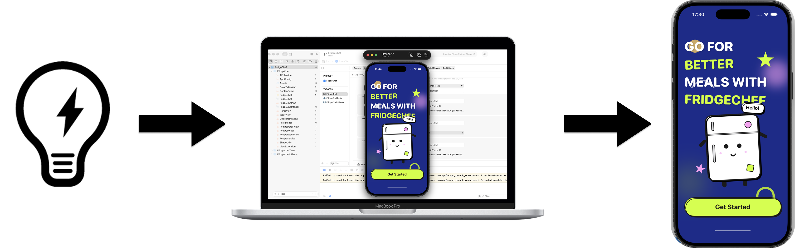

### 1.1 Приложение для iOS

Приложение для iOS — это нативное приложение, работающее в операционной системе iPhone. Оно быстро запускается, ощущается плавным и может глубоко использовать системные функции, такие как уведомления, камера и локальное хранилище.


### 1.2 Разработка приложений для iOS

По своей сути создание приложения для iOS включает лишь несколько вещей:

1. Прояснить проблему, которую решает ваше приложение
2. Спроектировать интерфейс, который пользователи могут видеть и которым могут управлять
3. Определить, как приложение ведёт себя при разных действиях
4. Правильно собрать приложение и установить его на iPhone

### 1.3 Распространённые способы создания приложений для iOS

В реальной разработке существует не один способ создания приложения для iOS. Мы не будем углубляться, а лишь дадим общее понимание.

Первый способ — официальный нативный подход Apple: создать проект в Xcode и использовать Swift и SwiftUI для построения интерфейса и логики.


Второй способ — использовать кроссплатформенные фреймворки, такие как React Native и Flutter, и адаптировать одну кодовую базу к нескольким платформам.


Исходя из подходов выше, это руководство выбирает: **нативную разработку на SwiftUI в качестве основы, при этом AI-инструменты выполняют большую часть работы по написанию кода**.

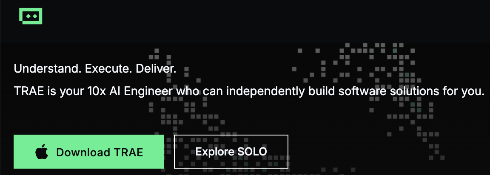

### 1.4 Шаги разработки приложения для iOS, рассматриваемые в этом руководстве (высокоуровневый обзор)

Примером приложения в этом руководстве является **FridgeChef**.

Пользователь вводит ингредиенты, которые есть в холодильнике, а приложение использует настоящий AI API для генерации реализуемого рецепта, затем сохраняет результат локально для последующего просмотра. Этот пример полностью охватывает ключевые части реального приложения для iOS, включая ввод и отображение UI, сетевые запросы, разбор данных, локальное хранение и финальную установку и запуск на реальном устройстве.

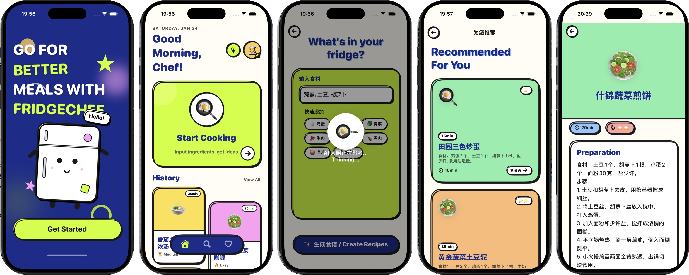

- Общая идея от прототипа к нативному приложению

В реализации это руководство использует поэтапный подход. Сначала мы с помощью AI быстро сгенерируем прототип интерфейса на HTML и CSS, подтвердим структуру макета и иерархию информации в браузере, а затем перенесём его в SwiftUI.

- Обзор общего процесса разработки

В целом следующие главы пройдут эти этапы по порядку:

1. Формирование базового понимания  
   Понять форму приложения для iOS, распространённые методы разработки и какую проблему решает это примерное приложение.
2. Завершение настройки среды  
   Подготовить Mac и iPhone, обновить системы, установить Xcode и Trae и создать базовый проект iOS, который успешно запускается в симуляторе.
3. Переход к полноценной разработке  
   Открыть проект в Trae и постепенно генерировать UI и базовое взаимодействие через диалог с AI, превращая приложение из пустой оболочки во что-то пригодное к использованию.
4. Отладка и упорядочивание  
   Когда появляются ошибки компиляции или поведение не соответствует ожиданиям, позволить AI помочь в устранении неполадок; когда структура становится запутанной, использовать AI для рефакторинга и упрощения.
5. Запуск на реальном устройстве  
   Настроить подпись, установить приложение на реальный iPhone и выполнить одну полную проверку от кода до оборудования.

## Глава 2: Подготовка среды разработки

### 2.1 Необходимые устройства и системы

В этой практике две единицы оборудования незаменимы: Mac и iPhone.  
При этом на обоих устройствах должна быть **относительно свежая официальная версия системы**.

#### 2.1.1 Mac

Приложения для iOS можно разрабатывать и компилировать только на macOS. Это жёсткое требование платформы Apple.

Чтобы Xcode можно было установить и нормально использовать, рекомендуется сначала обновить macOS до относительно свежей официальной версии. Вы можете проверить и обновить через **Системные настройки -> Основные -> Обновление ПО**.


#### 2.1.2 Реальное устройство iPhone

Помимо Mac, для этого руководства также требуется реальный iPhone для проверки того, может ли приложение корректно устанавливаться и запускаться.

Чтобы процесс отладки был гладким, на iPhone также должна быть относительно свежая версия iOS. Вы можете проверить и обновить через **Настройки -> Основные -> Обновление ПО**.

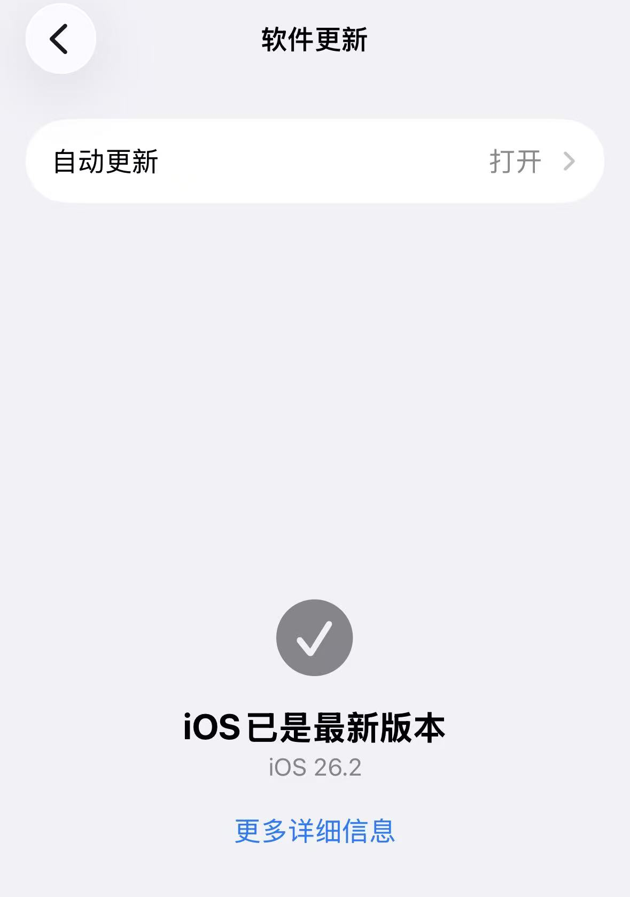

Позже в процессе разработки этот iPhone будет подключаться к Mac кабелем для отладки на реальном устройстве.

#### 2.1.3 Включение режима разработчика на iPhone

Чтобы устанавливать и запускать отладочные приложения из Xcode на реальном устройстве, вам нужно включить режим разработчика на iPhone.

Шаги:

1. Откройте **Настройки**
2. Войдите в **Конфиденциальность и безопасность**
3. Прокрутите вниз и найдите **Режим разработчика**
4. Включите его, затем перезапустите устройство по подсказке
5. После перезапуска разблокируйте устройство и подтвердите включение режима разработчика

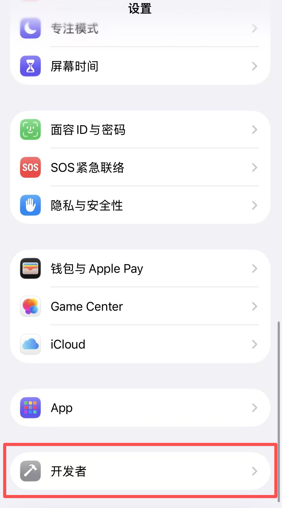

Если ваш iPhone ранее никогда не подключался к Xcode или другим инструментам разработки, вы можете обнаружить, что **Режим разработчика** не отображается в **Конфиденциальность и безопасность**. Это не проблема системы — это просто означает, что режим разработчика ещё не был активирован.

В таком случае вы можете заставить его появиться, выполнив следующие шаги:

1. Откройте **Настройки -> Конфиденциальность и безопасность -> Аналитика и улучшения**
2. Включите **Делиться с разработчиками приложений**
3. Вернитесь на один уровень назад, снова войдите в **Конфиденциальность и безопасность** и прокрутите вниз
4. Теперь вы должны увидеть **Режим разработчика**, затем включите его и перезапустите устройство

После выполнения шагов выше режим разработчика нужно включить лишь один раз. Будущая отладка на реальном устройстве с Xcode не потребует повторения этой настройки.

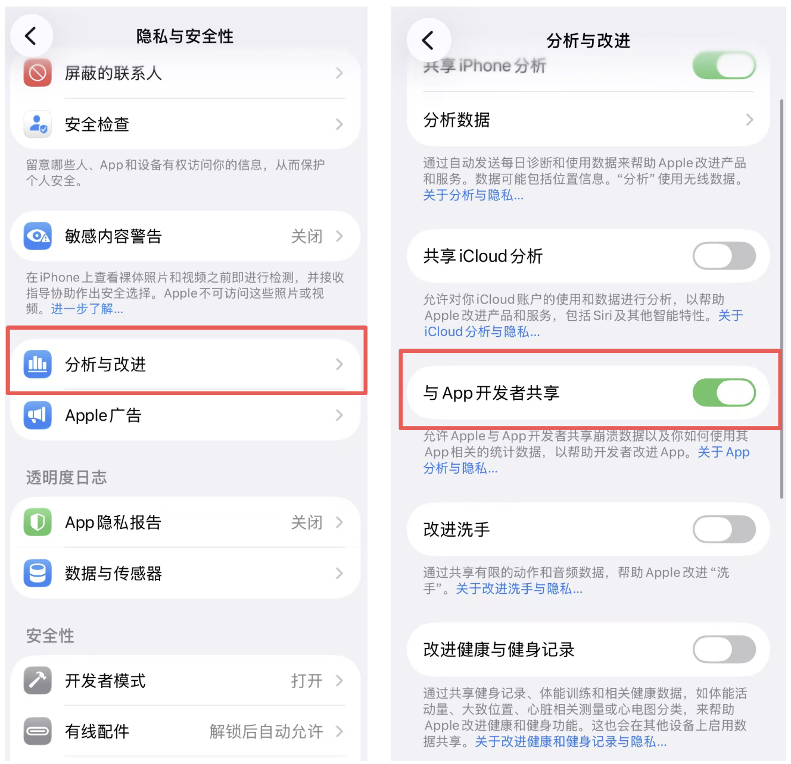

### 2.2 Необходимое ПО

После того как устройства и системы готовы, вам всё ещё нужно установить ПО, используемое для разработки. В этом руководстве используются лишь две категории инструментов: официальный инструмент разработки под iOS и инструмент AI-ассистированной разработки.

#### 2.2.1 Xcode

Xcode — официальный инструмент разработки Apple для iOS. В этом руководстве он в основном используется для создания проектов iOS, компиляции кода Swift / SwiftUI и запуска приложения в симуляторе или на реальном устройстве.


Xcode можно найти и установить напрямую из App Store. После установки, когда вы откроете его впервые, вы увидите приветственный экран. Дальнейшее создание проекта начинается оттуда.


#### 2.2.2 Trae

Trae — основная среда, где выполняется работа по разработке в этом руководстве. Вы поместите весь проект iOS в Trae и будете сотрудничать с AI через диалог для завершения разработки.


### 2.3 Apple ID и замечания об отладке разработки

На платформе iOS, чтобы приложение можно было установить на реальное устройство, оно должно пройти подпись разработчика. Это руководство не требует, чтобы вы оплачивали членство в Apple Developer Program. Достаточно личного Apple ID.

### 2.4 Контрольный список перед тем, как двигаться дальше

Прежде чем войти в следующую главу, вы можете сравнить ваше текущее состояние с контрольным списком ниже.

У вас теперь уже должны быть:

1. Mac с относительно свежей версией macOS
2. iPhone с относительно свежей версией iOS и включённым режимом разработчика
3. Успешно установленный Xcode
4. Установленный и открытый Trae
5. Рабочий Apple ID

Если всё это готово, вы можете продолжить и создать своё первое приложение для iOS.

## Глава 3: Создание первого проекта iOS

### 3.1 Использование Xcode для создания нового проекта

Откройте Xcode. На приветственном экране выберите создание нового проекта.

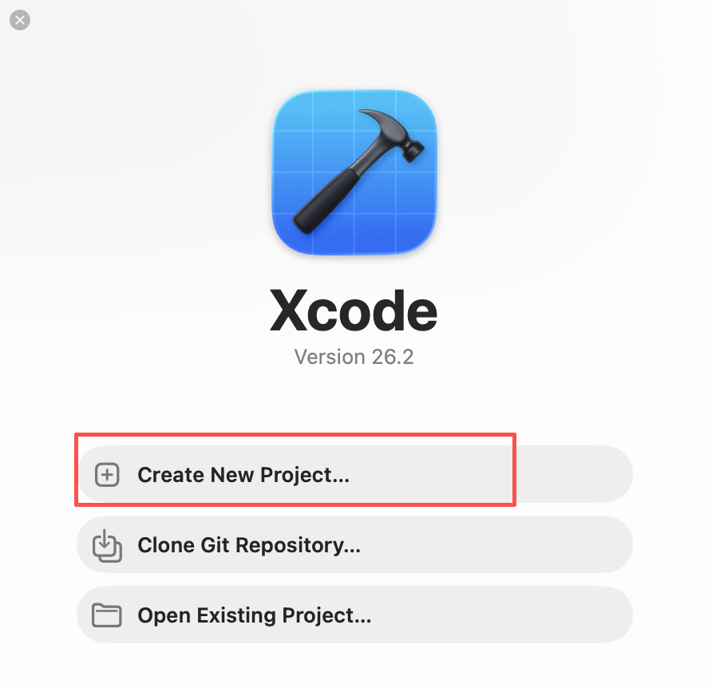

Нажмите **Create new project**, чтобы войти на экран выбора шаблона проекта.

### 3.2 Выбор шаблона приложения и технологического стека

На экране выбора шаблона используйте следующую конфигурацию:

1. Platform: iOS
2. Тип приложения: App


Нажмите **Next**, чтобы войти на экран конфигурации информации о проекте.

### 3.3 Настройка информации о проекте

На экране информации о проекте просто заполните базовые настройки:

1. Product Name: имя приложения (например, `FridgeChef`)
2. Team: выберите ваш личный Apple ID
3. Organization Identifier: формат обратного домена (например, `com.example`)
4. Bundle Identifier: генерируется автоматически, оставьте по умолчанию
5. Testing System: Swift Testing с XCTest UI Tests
6. Storage: выберите Core Data (для последующего сохранения истории рецептов)
7. Остальные параметры оставьте по умолчанию

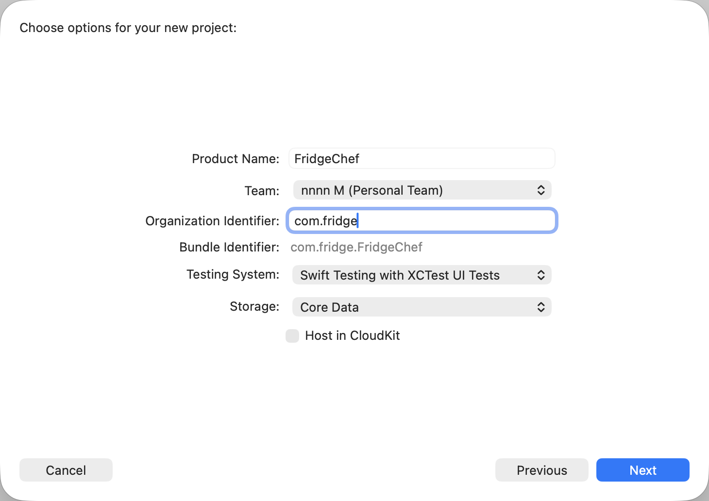

Нажмите **Next** и выберите место хранения проекта.


### 3.4 Знакомство со структурой проекта после создания

После создания проекта Xcode автоматически откроет рабочее пространство. На этом этапе вам не нужно понимать каждый файл. Вам нужно лишь распознать несколько ключевых частей.

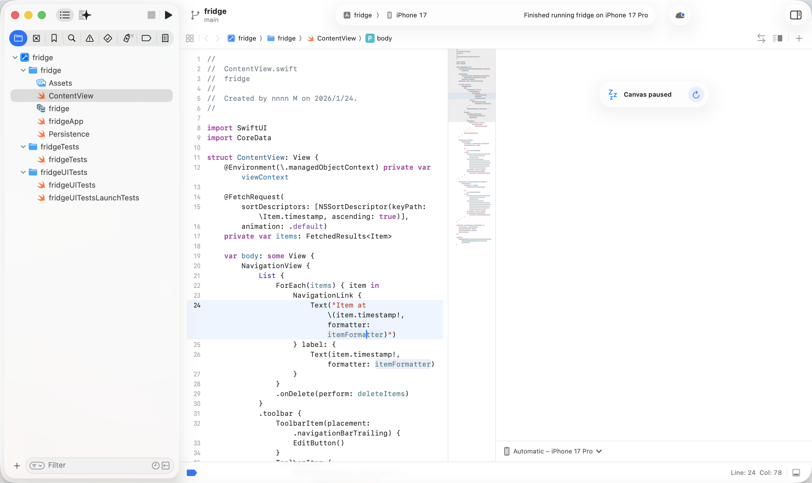

В проекте по умолчанию вы увидите:

- Папку, названную по имени проекта
- Файл Swift, оканчивающийся на `App` (точка входа приложения)
- Файл `ContentView.swift` (страница по умолчанию)

Это уже минимально работоспособное приложение для iOS.

### 3.5 Запуск первого приложения для iOS

Прежде чем изменять какой-либо код, запустите исходный проект напрямую.

В верхней панели инструментов Xcode оставьте выбранным симулятор iPhone по умолчанию, затем нажмите кнопку **Run** в левом верхнем углу.


Если всё в порядке, симулятор покажет пустое приложение, которое успешно запускается. Первая компиляция может занять относительно много времени. В дальнейших главах мы сокращаем время ожидания, сначала используя HTML-прототипы.


Чтобы остановить приложение, нажмите **Stop** рядом с кнопкой Run.

### 3.6 Чего вы фактически достигли на этом этапе

Хотя интерфейс всё ещё прост, вы уже выполнили несколько ключевых подтверждений:

1. Проект может успешно компилироваться
2. Симулятор может корректно запускать приложение
3. Процесс разработки уже доказал свою работоспособность от начала до конца

Это означает, что будущие проблемы будут в основном сосредоточены на **самом коде и логике**, а не на проблемах среды.

### 3.7 Передача проекта Trae

Начиная со следующего раздела, основная работа по разработке постепенно переместится в Trae.

Что вам нужно сделать, просто: **откройте в Trae только что созданную папку проекта iOS.**


## Глава 4: Практика AI-ассистированной разработки — построение FridgeChef с нуля

Эта глава — основная часть всего руководства.

В этом руководстве не используется традиционный маршрут «сначала писать SwiftUI, многократно компилировать и постоянно подкручивать предпросмотры». Вместо этого мы используем более эффективный процесс:  
**сначала использовать \*\***HTML\***\* для быстрой проверки структуры интерфейса, затем перенести подтверждённый результат в SwiftUI и наконец постепенно завершить бизнес-логику, локальные данные и детали взаимодействия.**

### 4.1 Этап один: прояснение требований

Прежде чем писать код, первый шаг — не построение страниц, а прояснение того, что мы строим. **Позвольте AI сначала выступить в роли \*\***менеджера продукта\***\* и упорядочить требования в структурированный документ спецификации.**

В окне чата Trae введите следующую инструкцию. Trae сгенерирует файл `REQUIREMENTS.md` в корне проекта, описывающий функциональность и структуру всего приложения.

📋 **Промпт для копирования:**

```text
Сейчас мы будем разрабатывать приложение для iOS под названием «FridgeChef».

1. Основная концепция
Это AI-ассистент, который решает проблему «я не знаю, что приготовить из оставшихся ингредиентов в холодильнике».
Пользователи вводят ингредиенты, которые у них сейчас есть, а приложение вызывает большую модель для генерации практичного рецепта.

2. Основные функции
- Главная страница:
  Показывать заметный вход «Начать готовить», а под ним отображать историю рецептов в виде карточек или списка.
- Страница ввода:
  Пользователи вводят ингредиенты с поддержкой текстового ввода или простых быстрых тегов.
- Страница результата:
  Отображать сгенерированный AI рецепт, включая название блюда, список ингредиентов и шаги приготовления.

3. Технические требования
- Использовать SwiftUI
- Сохранять данные локально (Core Data)
- Поддерживать базовую навигацию по страницам и обновление состояния

Пожалуйста, помоги мне упорядочить это в чёткий, структурированный документ REQUIREMENTS.md с точки зрения менеджера продукта и сохрани его в корне проекта.
```

После генерации быстро прочитайте документ и подтвердите, соответствуют ли функциональные пункты вашим ожиданиям.

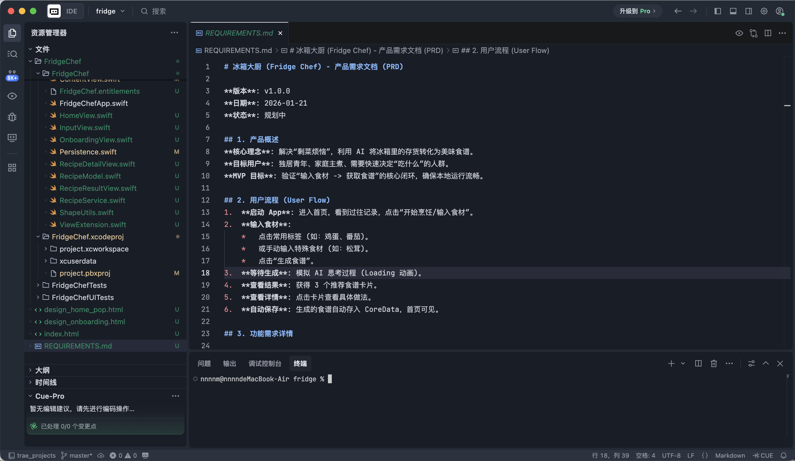

### 4.2 Этап два: визуальный прототип

Позвольте AI быстро нарисовать высокоточный прототип интерфейса с помощью **HTML\*\*** + \***\*CSS**, чтобы мы сначала могли подтвердить общий макет и стиль. Продолжите, введя это в Trae:

📋 **Промпт для копирования:**

```text
Требования подтверждены.
Пожалуйста, используй HTML + Tailwind CSS, чтобы сгенерировать для меня высокоточный прототип интерфейса.

Стиль дизайна: Neo-Pop
Цвета:
- Фон: светло-кремовый #FFFDF5
- Акцентные цвета: кислотно-зелёный #CCFF00, ярко-розовый

Визуальные характеристики:
- Толстые чёрные рамки 3px
- Жёсткая тень без размытия (смещение 4px)
- Большие скруглённые карточки, общее ощущение стикера / комикса

Требования к макету:
- Главная страница должна использовать макет в стиле Bento Grid
- Включи два экрана: главную страницу и страницу ввода

Пожалуйста, сгенерируй однофайловый index.html и имитируй вокруг контента соотношение экрана iPhone.
```

После генерации найдите `index.html` в списке файлов и откройте его напрямую в браузере.


На этом этапе суть не в том, идеальна ли каждая деталь. Суть в том, **разумна ли структура страницы, полны ли основные элементы и верно ли общее направление.**

### 4.3 Этап три: нативное воссоздание

Как только HTML-прототип финализирован, **переведите подтверждённый интерфейс в SwiftUI.**

Шаги:

1. Загрузите файл `index.html` (или скриншот из браузера) в Trae
2. Скажите AI сгенерировать на его основе код SwiftUI

📋 **Промпт для копирования:**

```text
[index.html загружен]

Пожалуйста, прочитай макет и стиль этого HTML-файла.

Задача: воссоздай этот интерфейс в текущем проекте с помощью SwiftUI.

Требования:
1. Инкапсулируй модификатор NeoPopStyle, включающий цвет фона, толстую рамку и жёсткую тень
2. Создай HomeView.swift для макета главной страницы
3. Создай InputView.swift для страницы ввода
4. Пока используй Mock Data и убедись, что он корректно отображается в Xcode Preview и симуляторе
```

После завершения откройте Xcode и запустите симулятор. Вы увидите приложение для iOS, у которого уже есть полная визуальная структура.


### 4.4 Этап четыре: подключение AI API

Как только интерфейс готов, приложение всё ещё лишь слой отображения. Далее нам нужно подключить настоящую возможность AI. В этом руководстве мы используем сервис больших моделей, предоставляемый **SiliconFlow**:
[https://cloud.siliconflow.cn](https://cloud.siliconflow.cn/)

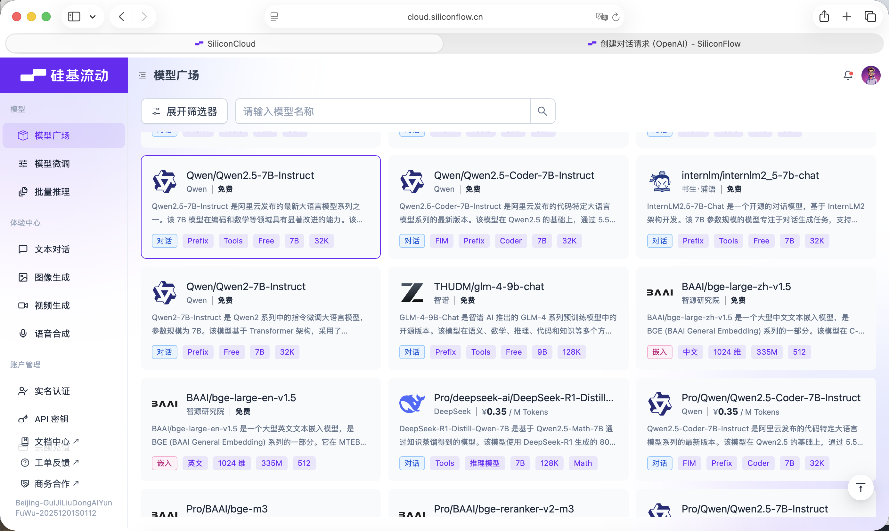

SiliconFlow предоставляет API, совместимый со спецификацией OpenAI API, поэтому его очень удобно вызывать из проекта iOS с помощью стандартных сетевых запросов.


Прежде чем начать, вам нужно зарегистрировать аккаунт на сайте и создать API Key.


Этот Key будет использоваться для последующих вызовов модели.

📋 **Промпт для копирования:**

```text
Теперь нам нужно подключить возможность AI.

Пожалуйста, создай APIService.swift.

Конфигурация:
- Base URL: https://api.siliconflow.cn/v1
- Model: Qwen/Qwen2.5-7B-Instruct
- API Key: пока определи его как переменную, я заполню позже

Функции:
- Напиши метод generateRecipe(ingredients: [String])
- System Prompt должен строго требовать от модели возвращать только чистый JSON
- Поля JSON должны включать: dishName, ingredients, steps

Также определи структуру RecipeModel для разбора возвращаемых данных.
```

После генерации кода впишите ваш собственный Key внутрь `APIService.swift`.

### 4.5 Этап пять: локальное хранилище Core Data

Чтобы приложение запоминало сгенерированные рецепты, нам нужно внедрить локальное хранение данных. Этот этап делится на два шага.

**Шаг 1: настройте Core Data в Xcode вручную**

1. Откройте `FridgeChef.xcdatamodeld`
2. Создайте новую сущность (Entity) с именем `RecipeEntity`


3. Добавьте следующие атрибуты:
   1. `id`: **UUID**
   2. `name`: **String**
   3. `cookTime`: **String**
   4. `difficulty`: **String**
   5. `desc`: **String**
   6. `timestamp`: **Date**
   7. `colorIndex`: **Integer 16**

      

**Шаг 2: позвольте AI написать логический код**

📋 **Промпт для копирования:**

```text
Я закончил настройку сущности Core Data.

Entity: RecipeEntity
Атрибуты: id, name, difficulty, timestamp, colorindex, cookTime, desc

Пожалуйста, выполни следующие задачи:
1. Сохраняй данные в Core Data после успешной генерации рецепта
2. Используй FetchRequest на главной странице, чтобы читать историю и отображать её в обратном хронологическом порядке
3. Когда база данных пуста, показывай дружелюбное сообщение о пустом состоянии
```

### 4.6 Этап шесть: генерация значка приложения

Финальный шаг — подготовить подходящий значок для приложения. Здесь мы используем **Lovart** для генерации ресурса значка: [https://www.lovart.ai/zh](https://www.lovart.ai/zh)


📋 **Промпт для копирования в Lovart:**

```text
Subject: A cute anthropomorphic fridge character with a happy face
Style: Minimalistic App Icon, Neo-pop style, thick black outlines, vector art
Colors: Acid green (#CCFF00) and deep blue
Background: Solid cream color
Negative Prompt: Text, realistic details, 3D render, complex background
```

После генерации обрежьте изображение до 1024x1024 и перетащите его в `Assets.xcassets` -> `AppIcon` в Xcode.


Запустите приложение снова, и теперь вы увидите полноценное, узнаваемое, настоящее приложение для iOS.

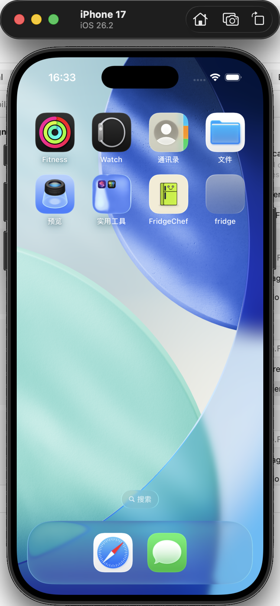

### 4.7 Этап семь: продвинутое улучшение опыта

Как только функциональность стабильна, если вы хотите ещё больше улучшить визуальный стиль, вам нужно лишь описать AI желаемый эффект, дать ему сгенерировать новый дизайн-проект, а затем перенести подтверждённый результат в SwiftUI.

📋 Эталонный промпт:

```text
Функциональность приложения уже полная, но я хочу попробовать более визуально впечатляющий стиль UI.
Пожалуйста, сначала сгенерируй для меня новый черновик дизайна на HTML + Tailwind CSS с именем файла design_v2.html.

Стиль дизайна: Neo-Pop (дофаминовый стиль)
Требования к цветам:
Используй глубокий королевский синий (Deep Royal Blue) как полноэкранный фон
Используй кислотно-зелёный (Acid Green, #CCFF00) как акцентный цвет

Визуальное ощущение:
Все карточки должны использовать толстую чёрную рамку 3px
Используй жёсткую тень без размытия прозрачности, смещённую вправо-вниз

Требования к макету:
Сохрани структуру главной страницы неизменной
Используй кнопки и поля ввода в форме «таблеток» (pill)

Пожалуйста, сгенерируй полный код, чтобы я мог посмотреть его в браузере.
```

После генерации откройте этот HTML-файл в браузере.


Как только HTML-версия финализирована, вы можете начать изменять проект iOS.

📋 Эталонный промпт:

```text
[design_v2.html загружен]
Пожалуйста, проанализируй визуальный стиль этого HTML и перенеси его в текущий проект iOS.

Требования к задаче:
Создай новый файл NeoPopStyle.swift
Инкапсулируй модификатор стиля neoPopBlue()

Модификатор должен включать:
- скруглённые углы
- толстую чёрную рамку
- непрозрачную жёсткую тень

Отрефактори HomeView:
- измени фон на глубокий королевский синий
- используй кислотно-зелёный для основной кнопки
- используй белый фон для карточек истории
- убедись, что текст остаётся чётким и читаемым на тёмном фоне

Пожалуйста, предоставь полный изменённый код.
```

Снова нажмите Run в Xcode. Если всё работает, вы должны увидеть:

- функциональность точно такая же, как раньше
- визуальный стиль значительно изменился
- общее качество приложения ощущается заметно улучшенным

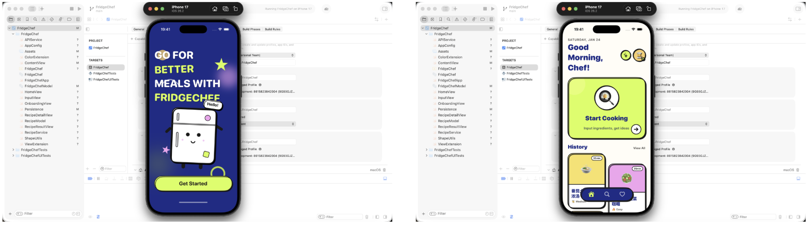

## Глава 5: Запуск, отладка и обработка ошибок

В предыдущей главе вы завершили основную функциональность и успешно запустили приложение в симуляторе.  
Но для приложения iOS истинное завершение — это не просто «успешно компилируется», а **стабильная работа и умение справляться с проблемами, когда они появляются**.

### 5.1 Запуск приложения в Xcode

Сначала убедитесь, что проект может корректно запускаться в Xcode.

В левом верхнем углу Xcode выберите устройство запуска и оставьте симулятор iPhone по умолчанию. Нажмите кнопку **Run**, чтобы скомпилировать и запустить. Если всё в порядке, приложение запустится в симуляторе и отобразит интерфейс, построенный в главе 4.

### 5.2 Запуск приложения на реальном устройстве

Подключите iPhone к Mac с помощью кабеля.


При первом подключении телефон покажет **Доверять этому компьютеру?** Нажмите «Доверять» и введите код разблокировки.


В списке устройств Xcode выберите ваш iPhone, затем снова нажмите **Run**.

На этом этапе вы должны увидеть значок **FridgeChef** на главном экране телефона и иметь возможность нормально открывать и использовать его.

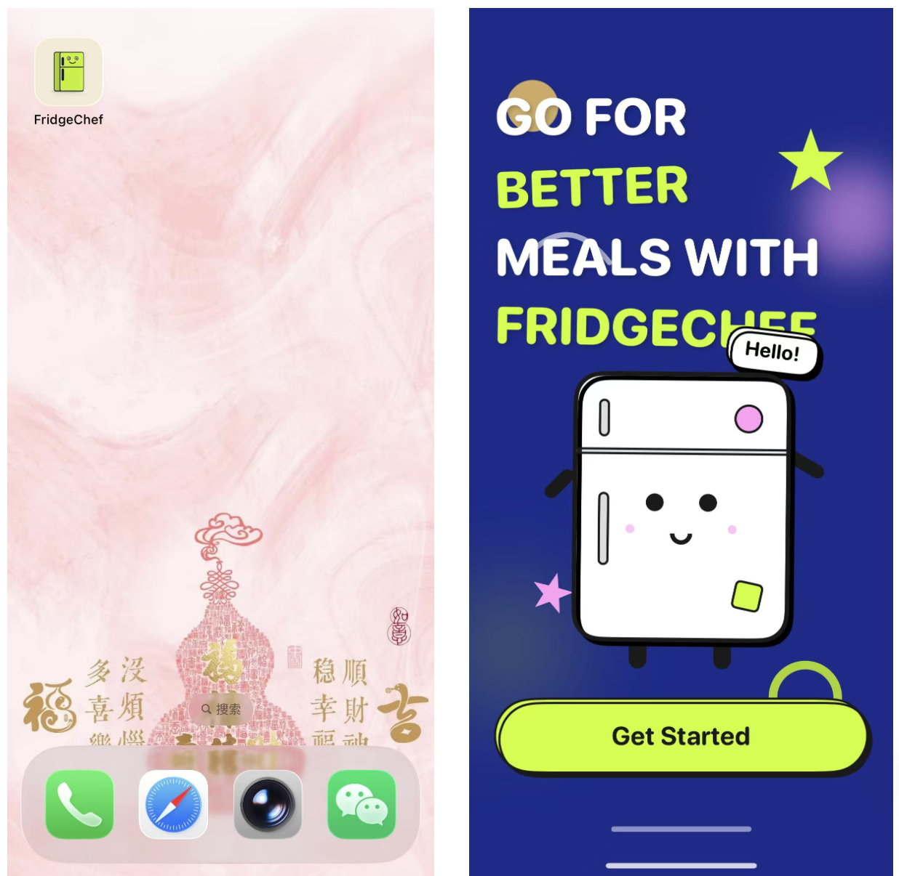

Этот шаг знаменует завершение одного полного замкнутого цикла разработки под iOS.

### 5.3 Откуда обычно берутся ошибки разработки под iOS

В реальной разработке **столкновение с ошибками — это норма**, а не исключение.

Распространённые проблемы обычно происходят из этих категорий:

1. **Ошибки компиляции**  
   Синтаксис Swift, несовпадения типов, отсутствующие параметры и т. д. Xcode напрямую подсветит их красным.
2. **Ошибки времени выполнения**  
   Приложение компилируется, но падает во время выполнения — например, выход за границы массива или принудительное разворачивание (force-unwrapping) значения nil.
3. **Ошибки разрешений или конфигурации**  
   Сетевые запросы заблокированы системой, отсутствует конфигурация в Info.plist, проблемы с подписью и т. д.
4. **Логические ошибки**  
   Приложение не падает, но поведение неверно — например, кнопки не реагируют или данные не обновляются.


Когда появляется любая ошибка, вам нужно лишь **скопировать полное сообщение об ошибке как есть в окно чата Trae.** Зная контекст проекта, Trae может помочь вам с отладкой.

### 5.4 Распространённые ошибки отладки на реальном устройстве и их решения

Ошибки во время отладки на реальном устройстве очень распространены. Эти проблемы обычно вызваны не самим кодом, а доверием устройства, правилами безопасности или конфигурацией подписи. Если приложение не может гладко запускаться на вашем iPhone, вы можете сначала проверить этот раздел.

#### 1. Проблемы с подписью и регистрацией

**Распространённые симптомы:**

- Xcode показывает красные ошибки вроде  
  `"Communication with Apple failed"`  
  или  
  `"No profiles for 'com.xxx.xxx' were found"`
- Или сообщает  
  `"Your team has no devices which are compatible"`

**Причина:**

- Bundle Identifier неуникален или невалиден
- Текущий iPhone ещё не зарегистрирован под вашим Apple ID для разработки

**Решение:**

1. **Измените Bundle Identifier**  
   В настройках проекта Xcode измените Bundle Identifier на что-то более уникальное, например:  
   `com.yourname.FridgeChef`
2. **Позвольте Xcode автоматически зарегистрировать устройство**  
   В подсказке об ошибке нажмите `Try Again` или `Register Device` и дайте Xcode автоматически завершить регистрацию устройства и настройку сертификата.

#### 2. Проблемы сопряжения и подключения устройства

**Распространённые симптомы:**

- Xcode показывает  
  `"Device is not available because pairing is in progress"`
- Или сообщает  
  `"Device Locked"`
- Или вы уже нажали «Доверять», но Xcode всё ещё завис

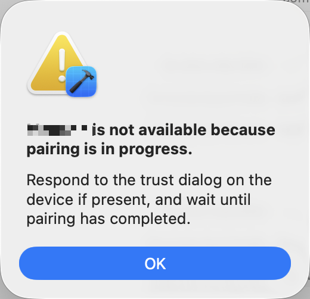

**Причина:**

- iPhone всё ещё заблокирован
- Процесс сопряжения не завершён полностью
- Xcode не обновил состояние подключения

**Решение:**

1. Разблокируйте телефон  
   Убедитесь, что iPhone разблокирован и остаётся на главном экране.
2. Завершите процесс доверия  
   Когда телефон выдаст **Доверять этому компьютеру?**, нажмите **Доверять** и **введите код блокировки экрана**.
3. Обновите состояние подключения  
   Если он всё ещё завис, отсоедините кабель, подождите 2-3 секунды и подключите заново. При необходимости перезапустите Xcode и попробуйте снова.

#### 3. Приложение устанавливается, но не открывается

**Распространённый симптом:**

- Значок приложения уже появился на главном экране iPhone
- Система показывает  
  **Ненадёжный разработчик (Untrusted Developer)**

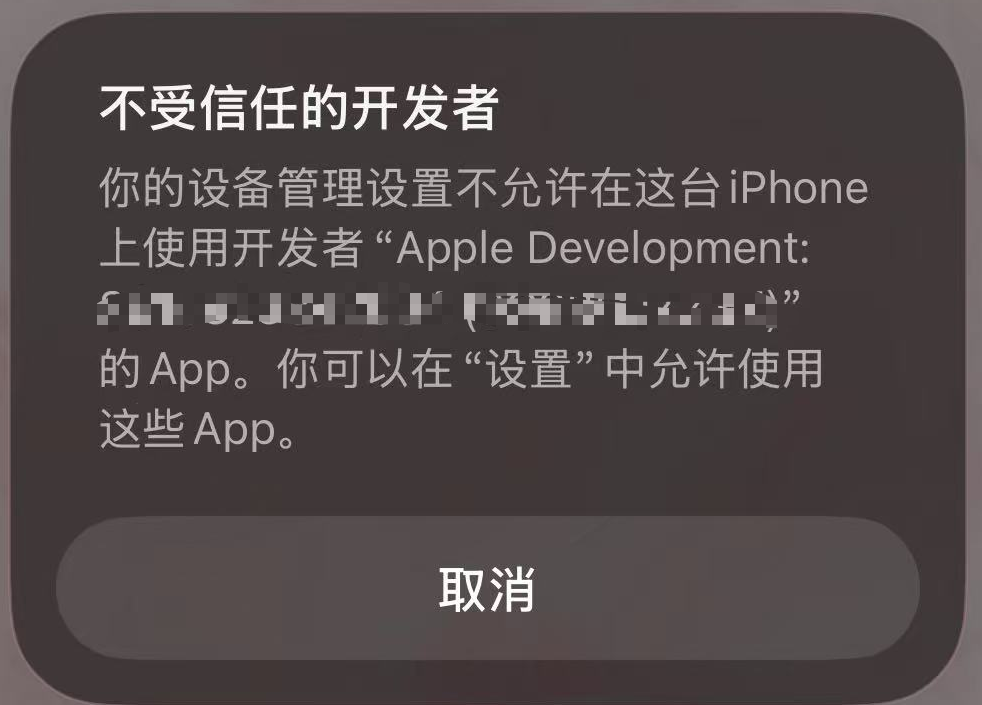

**Причина:**

Это механизм безопасности iOS. Отладочные приложения, установленные с личным Apple ID, требуют ручной авторизации доверия.

**Решение:**

1. Откройте **Настройки**
2. Войдите в **Основные**
3. Нажмите **VPN и управление устройством**
4. В разделе **Приложение разработчика** найдите ваш Apple ID
5. Нажмите **Доверять**, затем подтвердите ещё раз


После этого вернитесь на главный экран и снова нажмите на приложение. Теперь оно должно работать нормально.

## Глава 6: Если вы хотите опубликовать приложение в App Store

В этом руководстве мы в основном завершили полный замкнутый цикл для **версии приложения для личной разработки и отладки**: от создания проекта, реализации функций и отладки до успешной установки и использования на реальном устройстве.

Если вы хотите пойти дальше и формально опубликовать приложение в **Apple App Store**, чтобы все пользователи могли его скачать и использовать, тогда вам нужно войти в более формальный процесс выпуска. Поскольку этот процесс включает платный аккаунт разработчика, правила проверки и требования соответствия и не является основным практическим фокусом этого руководства, следующий контент предоставляется лишь как **общий ориентир и дорожная карта**.

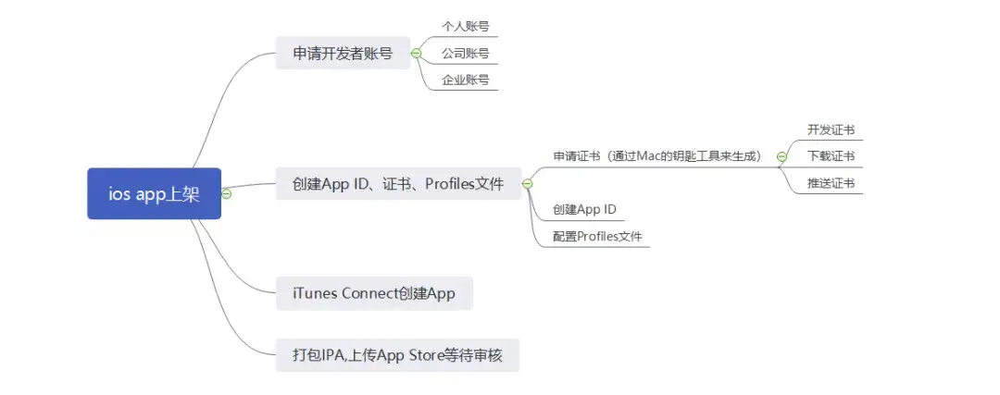

> Следующий контент ссылается на официальные требования проверки Apple и публичные обсуждения опыта (включая оригинальные материалы с Zhihu). Ссылки перечислены ниже. Если какая-либо ссылка станет недоступной, вы можете искать по названию или ключевому слову, чтобы найти первоисточник.

### 6.1 Apple Developer Program

Чтобы опубликовать приложение в App Store, вы должны присоединиться к платной программе разработчиков Apple:

- **Apple Developer Program** (99 USD в год)
- Официальный сайт: [https://developer.apple.com/](https://developer.apple.com/)

После присоединения вы можете использовать **App Store Connect**, чтобы создать запись приложения, управлять версиями и формально публиковаться.

### 6.2 App Store Connect: создание записи приложения

В App Store Connect вам нужно создать полную запись приложения, включая, но не ограничиваясь:

1. Имя приложения и Bundle ID
2. Описание, ключевые слова и ссылку на политику конфиденциальности
3. Значок приложения, скриншоты и материалы предпросмотра
4. Настройки ценообразования и регионов распространения

Вся эта информация должна быть заполнена, прежде чем можно будет приступить к подаче.

### 6.3 Сборка и подача на проверку

После того как метаданные готовы, вам нужно:

1. Использовать платный аккаунт разработчика в Xcode для подписи релизной сборки
2. Собрать и загрузить официальную версию
3. Подать её на проверку в App Store Connect

После подачи приложение попадает в очередь проверки Apple. Время проверки обычно составляет 1-3 дня в зависимости от случая.

### 6.4 Правила проверки и распространённые причины отклонения

Apple в основном проверяет приложения со следующих аспектов:

- функциональность и стабильность
- конфиденциальность и соответствие требованиям к данным
- согласованность между метаданными и фактической функциональностью
- наличие нарушений авторских прав или вводящего в заблуждение поведения

Если приложение не соответствует требованиям, проверка будет отклонена, и Apple предоставит конкретную причину. Затем разработчику нужно изменить приложение и подать заново.

### 6.5 Что делать после отклонения

Если приложение отклонено, вы можете:

- изменить код или описание согласно обратной связи
- подать версию заново
- связаться с командой проверки через App Store Connect

Это очень распространённая часть процесса публикации и не означает, что проект провалился.

### Источники

Следующий контент ссылается на официальную документацию Apple и публичный обмен опытом:

- App Store Review Guidelines (официально от Apple)  
  [https://developer.apple.com/app-store/review/guidelines/](https://developer.apple.com/app-store/review/guidelines/?utm_source=chatgpt.com)
- Официальное руководство по подаче на проверку  
  [https://developer.apple.com/cn/help/app-store-connect/manage-submissions-to-app-review/submit-for-review](https://developer.apple.com/cn/help/app-store-connect/manage-submissions-to-app-review/submit-for-review?utm_source=chatgpt.com)
- Полное иллюстрированное руководство по публикации в iOS App Store и подводным камням проверки (Zhihu)  
  [https://zhuanlan.zhihu.com/p/146128612](https://zhuanlan.zhihu.com/p/146128612)

## Глава 7: Итог


Поздравляем! На этом этапе вы лично прошли полный процесс разработки приложения для iOS от 0 до 1. От настройки среды, запуска проекта и затем постепенной реализации интерфейса, функциональности, данных и тестирования на реальном устройстве — все ключевые этапы были успешно пройдены. Что ещё важнее, вы добрались сюда не путём заучивания синтаксиса Swift — вы передали большую часть реализации искусственному интеллекту. Каким бы ни был ваш бэкграунд, каждая подобная попытка делает вас более уверенным, и вы поймёте, что разработка под iOS не так сложна, как казалось раньше. Даже если раньше вы не могли написать ни строчки кода, вы всё равно можете создать собственное приложение.

Оглядываясь назад, весь процесс на самом деле не так уж сложен: решить, что вы хотите создать, использовать HTML для быстрой проверки интерфейса, преобразовать его в SwiftUI, подключить API и локальные данные, а затем один раз пройти отладку. На этой основе в будущем вы также сможете запросто создать персональный будильник, минималистичный список дел или даже чат-бота, говорящего в манере вашей любимой знаменитости.

Это как раз самое важное, чему хочет научить вас это руководство — и easy-vibe. Я с нетерпением жду новейших творений от всех вас, будущих мастеров vibe coding, и того дня, когда ваша работа меня поразит.
