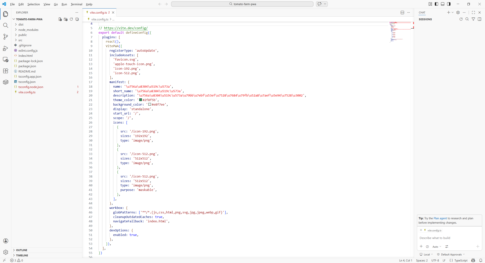

# Как создать локальное PWA-приложение: превратить сайт в «настоящее приложение»

# 1 Что такое PWA и разработка PWA

В этом руководстве мы пройдём полный замкнутый цикл: **от обычного веб-проекта до «настоящего приложения», которое можно установить на рабочий стол и на главный экран телефона и которое продолжает работать в офлайне.** Вы лично превратите приложение на React в PWA, развернёте его онлайн и установите на телефон для тестирования.

То, что мы собираемся создать, — приложение **Помидорная ферма (Tomato Farm)** — PWA, которое идеально сочетает технику Pomodoro с фермерской игрой. Вы зарабатываете очки за 25 минут сосредоточенной работы, затем используете эти очки, чтобы покупать семена и выращивать урожай. По мере роста вашего уровня вы открываете больше угодий и более качественные семена. Самое главное — оно продолжает работать даже без интернета, и все данные хранятся локально.

Для этого руководства у вас должны быть как минимум:

- Компьютер (Windows или Mac)
- Среда Node.js (версия 18.0 или выше)
- Ваш AI-ассистент для кодинга (Cursor / Trae / Claude Code и т. д.)
- Телефон (для тестирования установки на мобильном устройстве)

## 1.1 Определение PWA

**PWA (Progressive Web App)** — это особый вид сайта. С помощью технологии **Service Worker** он получает способность «кэшировать и брать управление на себя».

### Почему обычные сайты не могут работать офлайн, а PWA могут

Обычному сайту нужно скачивать файлы HTML, CSS и JS с сервера каждый раз при открытии, поэтому, если сеть недоступна, он просто не может загрузиться. PWA же использует **Service Worker** (JS-скрипт, работающий в фоне браузера), чтобы кэшировать эти файлы локально при первом посещении. После этого, даже если сеть отключена, Service Worker может читать файлы напрямую из локального кэша и нормально отображать страницу.

**Простая аналогия**: обычный сайт — это как брать книгу в библиотеке каждый раз (у вас обязательно должен быть интернет), тогда как PWA — это как купить книгу и поставить её на собственную полку (после первого скачивания вы всё ещё можете читать её офлайн).

### PWA против обычного сайта против нативного приложения

| Особенность | Обычный сайт | PWA | Нативное приложение |
|------|---------|-----|---------|
| **Установка** | Не нужна | Опциональна (добавить на главный экран) | Обязательно скачивать из магазина приложений |
| **Использование офлайн** | ❌ Нет | ✅ Да (после кэширования) | ✅ Да |
| **Способ обновления** | Авто-обновление | Авто / фоновое обновление | Ручное обновление пользователем |
| **Размер** | Нет | От нескольких сотен КБ до нескольких МБ | Десятки МБ и более |
| **Стоимость разработки** | Низкая | Низкая (одна кодовая база) | Высокая (отдельно iOS / Android) |

**Резюме одним предложением**: PWA — это «веб-страница, которая может хранить собственные файлы»; у неё есть лёгкость сайта (не нужна установка, авто-обновление) и опыт нативного приложения (поддержка офлайна, устанавливается на рабочий стол/главный экран).

<!--  -->

## 1.2 Почему выбрать PWA?

В эпоху Vibe Coding PWA — одно из самых выгодных «кроссплатформенных решений»:

| Параметр сравнения | Нативное приложение | PWA |
|---------|---------|-----|
| Стоимость разработки | Нужно разрабатывать iOS / Android / десктоп по отдельности | Одна кодовая база для всех платформ |
| Установка | Нужно идти в магазин приложений | Установка прямо в браузере, мгновенно |
| Способ обновления | Пользователи должны обновлять вручную | Авто-обновления, незаметные для пользователя |
| Размер пакета | Часто десятки МБ | Обычно лишь несколько сотен КБ |
| Поддержка офлайна | Встроена естественным образом | Поддерживается через Service Worker |
| Лучшие сценарии | Нужен глубокий доступ к оборудованию (AR / Bluetooth и т. д.) | Отображение контента, инструменты, лёгкие приложения |

**Резюме одним предложением**: если вашему приложению не нужны AR через камеру или доступ к оборудованию Bluetooth, PWA — почти самый простой выбор.

## 1.5 Дорожная карта руководства

Чтобы процесс обучения был менее скучным, это руководство строится вокруг увлекательного и практичного примера — **Помидорной фермы**. Это фермерская игра по технике Pomodoro, сочетающая сосредоточенную работу с геймифицированными наградами. Вместе с режимом Vibe Coding AI-ассистентов для кодинга мы разобьём процесс от нуля до установки на телефон на переиспользуемый маршрут:

1. **Формирование понимания и среды**: понять, что такое PWA, установить Node.js и AI-ассистента для кодинга и убедиться, что инструментарий работает гладко.
2. **Построение каркаса проекта**: создать проект React + TypeScript, который запускается локально.
3. **Итеративная разработка с AI**: через диалог с AI построить обратный отсчёт Pomodoro, систему фермерства, систему уровней, отрисовку урожая на SVG и многое другое.
4. **Конфигурация PWA и офлайн-тестирование**: добавить Service Worker и Manifest, затем проверить поддержку офлайна.
5. **Развёртывание и установка на телефон**: развернуть на Vercel, чтобы получить HTTPS-URL, затем установить и использовать на телефоне.

Этот раздел даёт лишь общую картину, не раскрывая точные команды. Сейчас просто запомните основную линию: **настройка среды -> построение каркаса -> описание и генерация с AI -> конфигурация PWA -> доставка через развёртывание**. В следующих главах мы пройдём с вами каждый шаг.

# 2 Настройка среды разработки

## 2.1 Инструменты, используемые в этом руководстве

На протяжении всего процесса разработки мы используем три инструмента вместе, и они берут на себя роли «проектирования», «строительства» и «приёмки».

- **AI-ассистент для кодинга (Cursor / Trae / Claude Code)**: это ваш **AI-партнёр по кодингу**. В режиме Vibe Coding нам больше не нужно писать код строка за строкой. Вместо этого мы в основном говорим AI на естественном языке, какую функциональность хотим, а он занимается генерацией и изменением кода.
- **Node.js + Vite**: это **фабрика сборки проекта**. Node.js предоставляет среду выполнения JavaScript, а Vite — фронтенд-инструмент сборки нового поколения с чрезвычайно высокой скоростью, особенно подходящий для создания PWA.
- **Телефон**: это **тестовое устройство** для проверки результата работы. Вы можете напрямую зайти на развёрнутое PWA в браузере на телефоне и протестировать реальную установку и офлайн-функциональность.

## 2.2 Установка Node.js

Node.js — базовая среда для разработки PWA. Зайдите на официальный сайт [https://nodejs.org](https://nodejs.org) и скачайте версию **LTS (Long Term Support)** (это руководство основано на Node.js 18.x или выше).

После скачивания установите как обычное ПО, дважды кликнув по установщику и сохранив варианты по умолчанию.

После установки откройте терминал (CMD / PowerShell на Windows, Terminal на Mac) и выполните:

```bash
node --version
npm --version
```

Если вы видите вывод версий вроде `v18.17.0` и `9.6.7`, это означает, что установка прошла успешно.

<!-- 0 -->

## 2.3 Установка AI-ассистента для кодинга

AI-ассистент для кодинга — главное поле боя **Vibe Coding**. Вы можете просто понимать его как **«редактор со встроенным супер-AI».**

**Рекомендуемые варианты:**

- **Trae**: зайдите на [https://www.trae.cn](https://www.trae.cn) и скачайте подходящую версию для вашей ОС
- **Cursor**: зайдите на [https://cursor.sh](https://cursor.sh) и установите
- **Claude Code**: если вы уже используете Claude, вы можете использовать Claude Code напрямую

Процесс установки очень прост, как установка обычного ПО. После подготовки этого инструмента в дальнейшей практике нам больше не нужно пялиться в скучные окна кода. Вместо этого мы будем открывать проект здесь и использовать естественный язык в окне чата, чтобы попросить AI писать код и исправлять баги.

<!-- 0 -->

## 2.4 Создание нового проекта

Откройте ваш AI-ассистент для кодинга и введите в окне чата следующий промпт:

```text
Пожалуйста, помоги мне создать проект React под названием tomato-farm-pwa для создания приложения Помидорная ферма.
Он должен поддерживать TypeScript, а также включать функциональность PWA (такую, которую можно установить на главный экран телефона).
```

AI автоматически выполнит следующие шаги:

**Шаг 1: создание проекта**

```bash
npm create vite@latest tomato-farm-pwa -- --template react-ts
```

**Шаг 2: вход в проект и установка зависимостей**

```bash
cd tomato-farm-pwa
npm install
```

**Шаг 3: установка плагина PWA**

```bash
npm install vite-plugin-pwa -D
```

После того как AI закончит, структура вашего проекта будет выглядеть примерно так:

```text
tomato-farm-pwa/
├── public/              # Статические ресурсы (значки, SVG-материалы идут сюда)
├── src/
│   ├── App.tsx          # Главный компонент
│   ├── main.tsx         # Файл точки входа
│   └── App.css          # Стили
├── index.html           # HTML-точка входа
├── vite.config.ts       # Конфигурация Vite (конфигурация PWA идёт сюда)
├── package.json
└── tsconfig.json
```

## 2.5 Понимание структуры проекта

После создания проекта нам нужно понять роль нескольких ключевых файлов:

| Файл / Каталог | Назначение |
|----------|---------|
| `src/App.tsx` | Главный компонент приложения, где пишется основная логика страницы |
| `src/main.tsx` | Файл точки входа приложения, отвечающий за монтирование приложения React |
| `vite.config.ts` | Файл конфигурации Vite, где пишется основная конфигурация PWA |
| `public/` | Каталог статических ресурсов, куда идут значки PWA и SVG-материалы |
| `index.html` | Файл HTML-точки входа, обычно не требует изменений |

Как новичкам, нам в основном нужно заботиться о трёх частях:

- `App.tsx`: управляет поведением программы и решает, «что появляется на экране»
- `vite.config.ts`: настраивает поведение PWA и решает, «как приложение устанавливается и кэшируется»
- `public/`: хранит значки и ресурсы приложения

## 2.6 Подготовка значков приложения

PWA нужны значки, прежде чем его можно будет установить. Как минимум нам нужны два изображения PNG в размерах **192x192** и **512x512**.

Вы можете попросить AI сгенерировать их:

```text
Пожалуйста, помоги мне сгенерировать два значка приложения размерами 192x192 и 512x512.
Используй зелёный градиентный фон и нарисуй посередине красный помидор. Сохрани их в папке public.
```

Или вы также можете создать собственные значки в любом инструменте дизайна (Figma, Canva) и положить их в каталог `public/`.

<!-- 0 -->

## 2.7 Настройка `vite-plugin-pwa`

Это самый критический шаг. Откройте `vite.config.ts` и попросите AI настроить плагин PWA:

```text
Пожалуйста, помоги мне превратить vite.config.ts в конфигурацию PWA, чтобы веб-страницу можно было установить на главный экран телефона:
- Имя приложения «Tomato Farm», с зелёной темой
- Используй icon-192.png и icon-512.png из каталога public в качестве значков
- Включи автоматические обновления
- Кэшируй все файлы js, css, html и изображений, чтобы приложение могло работать офлайн
```

AI сгенерирует конфигурацию, похожую на эту:

```typescript
import { defineConfig } from 'vite'
import react from '@vitejs/plugin-react'
import { VitePWA } from 'vite-plugin-pwa'

export default defineConfig({
  plugins: [
    react(),
    VitePWA({
      registerType: 'autoUpdate',
      manifest: {
        name: 'Tomato Farm',
        short_name: 'Tomato Farm',
        description: 'Focus, plant, and grow',
        theme_color: '#4CAF50',
        background_color: '#ffffff',
        display: 'standalone',
        icons: [
          {
            src: '/icon-192.png',
            sizes: '192x192',
            type: 'image/png'
          },
          {
            src: '/icon-512.png',
            sizes: '512x512',
            type: 'image/png'
          }
        ]
      },
      workbox: {
        globPatterns: ['**/*.{js,css,html,ico,png,svg}']
      }
    })
  ]
})
```

**Пояснение ключевой конфигурации:**

* `registerType: 'autoUpdate'`: когда вы публикуете новую версию, приложение автоматически обновится при следующем открытии пользователями, без ручных операций.
* `display: 'standalone'`: после установки оно работает в собственном окне, без адресной строки браузера, и ощущается как нативное приложение.
* `workbox.globPatterns`: указывает Service Worker, какие типы файлов следует кэшировать и оставлять доступными офлайн.

<!-- 0 -->

# 3 Создание PWA Помидорной фермы

В предыдущих двух главах мы уже разобрались, что такое PWA, и завершили настройку среды. С этого раздела мы перестаём говорить только в теории и переходим к практике. Мы будем использовать режим Vibe Coding, чтобы с нуля построить увлекательное и практичное приложение — **Помидорную ферму**. Оно идеально сочетает технику Pomodoro с геймифицированными стимулами и охватывает ключевые элементы разработки PWA: **UI-взаимодействие (таймер Pomodoro), хранение данных (очки и урожай) и офлайн-возможности (кэширование Service Worker).**

Теперь давайте отправим AI первую инструкцию.

## 3.1 Первый «мастер-промпт»: от нуля к единице

В режиме Vibe Coding нам не нужно следовать традиционному подходу сначала создавать файлы макетов, а затем писать логический код. Что нам нужно сделать — это **чётко описать требования за один раз и позволить AI сгенерировать первую работоспособную версию**.

Откройте в вашем AI-ассистенте для кодинга только что созданный нами каталог проекта и введите следующий промпт:

```text
Пожалуйста, помоги мне написать главную страницу приложения Помидорная ферма со следующими функциями:

**Таймер Pomodoro**
- 25-минутный таймер обратного отсчёта с запуском, паузой и сбросом
- Показывать оставшееся время и индикатор прогресса
- Давать пользователю 10 очков после завершения одной сессии фокуса

**Система фермерства**
- 3 участка угодий, но изначально доступен только первый; последующие открываются после повышения уровня
- Магазин для покупки семян: морковь стоит 5 очков, помидор — 10 очков, кукуруза — 15 очков
- После покупки семян и их посадки урожай медленно растёт, и при созревании его можно собрать за очки

**Система уровней**
- Уровень по сумме очков: 0-100 очков = Начинающий фермер, 100-300 = Опытный фермер, выше 300 = Мастер фермы
- Открывать новые угодья и лучшие семена после повышения уровня

**Дизайн UI**
- Сверху показывать уровень, очки и индикатор прогресса до повышения
- В середине показывать обратный отсчёт Pomodoro
- Ниже — сетку угодий
- Внизу — кнопку магазина
- Использовать зелёную тему и сделать вид свежим и милым
- Должно адаптироваться под экраны телефонов

**Сохранение данных**
- Все данные (очки, уровень, состояние угодий) должны сохраняться, и обновление страницы не должно их терять
```

После отправки вы увидите, как AI начнёт рассуждать и анализировать структуру вашего проекта. Через несколько секунд он напрямую сгенерирует полный код для `App.tsx`.

1. Из его ответа мы можем увидеть его логику рассуждений и логику взаимодействия
2. Мы можем напрямую увидеть, какой код он изменил
3. Если мы не удовлетворены, мы можем откатиться к предыдущей версии

<!-- 0 -->

## 3.2 Запуск и предпросмотр (локальный сервер разработки)

Теперь AI завершил первый раунд разработки, но помните: то, что мы видим в ассистенте для кодинга, — это всё ещё лишь «чертежи» кода, а не по-настоящему интерактивное приложение. Нам нужно запустить локальный сервер разработки, чтобы мы могли действительно запустить код и увидеть реальный результат.

Выполните это в терминале вашего AI-ассистента для кодинга:

```bash
npm run dev
```

Через несколько секунд терминал покажет вывод вроде этого:

```text
  VITE v5.0.0  ready in 300 ms

  ->  Local:   http://localhost:5173/
  ->  Network: use --host to expose
  ->  press h + enter to show help
```

Откройте `http://localhost:5173/` в браузере, и вы должны увидеть:

- уровень, очки и индикатор прогресса сверху
- обратный отсчёт Pomodoro в середине
- область угодий ниже
- кнопку магазина внизу

Попробуйте нажать кнопку «Начать фокус» и проверьте, работает ли обратный отсчёт правильно. Нажмите на плитку угодий и проверьте, можете ли вы купить семена и посадить их. Это первая версия вашего PWA-приложения.

<!-- 0 -->

## 3.3 Оптимизирующая итерация (добавление SVG-урожая и анимации)

На данном этапе у нашего приложения уже есть базовая форма: таймер Pomodoro, система фермерства и система уровней. Но оно может всё ещё выглядеть грубовато, а урожай, возможно, показывается лишь в виде текста или простых блоков. Далее мы добавим красивый SVG-урожай и анимацию роста, чтобы оживить Помидорную ферму.

**Это как раз то место, где Vibe Coding становится таким привлекательным.** В традиционной разработке отрисовка SVG-графики и создание сложных анимаций роста могут быть кошмаром для новичков. Вам нужно не только обработать отрисовку SVG-путей, но и рассчитать кривые анимации. В режиме Vibe Coding вам не нужно заботиться об этих низкоуровневых деталях. Вы просто говорите AI, словно режиссёр: «Дай урожаю более красивую SVG-графику и сделай так, чтобы он рос с анимацией» — и сложный код появляется почти мгновенно.

**Шаг 1: подготовка SVG-ресурсов урожая**

Вы можете попросить AI рисовать SVG прямо в коде или подготовить SVG-файлы и положить их в `public/`. В этом руководстве мы рекомендуем позволить AI генерировать SVG-код напрямую, потому что это более гибко.

**Шаг 2: отправка инструкции итерации**

Вернитесь в AI-ассистент для кодинга и введите следующий промпт:

```text
Пожалуйста, сделай урожай красивее и добавь анимацию роста:

**Графика урожая**
- Морковь: оранжевое тело с зелёными листьями
- Помидор: красная круглая форма с маленькими зелёными листьями
- Кукуруза: жёлтый початок с зелёными внешними листьями
Просто используй простые формы

**Анимация роста**
- При первой посадке начинается как маленький росток и постепенно вырастает до зрелости
- Показать 3 стадии

**Эффект сбора**
- При нажатии на зрелый урожай проигрывай простую анимацию сбора
- Показывай, сколько очков получено

**Общая доработка**
- Плитки угодий должны иметь рамки и цвет фона
- Урожай должен появляться по центру плитки
- Общий стиль должен ощущаться чуть милее
```

AI снова изменит код и обработает логику отрисовки SVG и анимации. После завершения обновите браузер, и вы должны увидеть более качественную графику урожая и плавные анимации роста.

<!-- 0 -->

## 3.4 Добавление звуковых эффектов и уведомлений (опционально)

Если вы хотите, чтобы Помидорная ферма ощущалась более иммерсивной, вы также можете добавить звуковые эффекты и уведомления. Для этого тоже нужен лишь простой промпт:

```text
Пожалуйста, добавь звуковые эффекты и уведомления в Помидорную ферму:

**Звуковые эффекты**
- Проигрывай «динь» при начале фокуса
- Проигрывай победный звук при завершении фокуса
- Также добавь подходящие звуковые эффекты для посадки и сбора урожая

**Уведомления**
- Показывай «Поздравляем, вы завершили сессию фокуса!» после окончания цикла фокуса
- Показывай «Поздравляем, вы достигли уровня XX!» при повышении уровня
- Показывай «Вы открыли новый участок угодий!» при открытии новых угодий

Ты можешь реализовать это с помощью простых аудиофайлов или Web Audio API
```

AI поможет вам добавить звуковые эффекты и уведомления, делая Помидорную ферму более живой и приятной.

<!-- 0 -->

# 4 Опробование PWA локально

## 4.1 Сборка и предпросмотр

Service Worker в PWA вступает в силу только в production-сборках (в режиме разработки он не регистрируется). Поэтому нам нужно сначала собрать, а затем сделать предпросмотр:

```text
Пожалуйста, помоги мне выполнить эти команды:
1. npm run build (собрать production-версию)
2. npm run preview (запустить локальный сервер предпросмотра)
```

После сборки Vite сгенерирует все файлы в каталоге `dist/`, включая автоматически сгенерированные `sw.js` (Service Worker) и `manifest.webmanifest`.

Как только сервер предпросмотра запустится, откройте адрес, показанный в терминале (обычно `http://localhost:4173`).

## 4.2 Установка PWA на рабочий стол

После открытия URL предпросмотра вы заметите, что в правой части адресной строки браузера появляется **значок установки** (обычно маленькая стрелка скачивания или знак «+»).

**Шаги установки в Chrome / Edge:**

1. Нажмите значок установки в правой части адресной строки
2. Нажмите **Install** во всплывающем диалоге
3. PWA откроется в отдельном окне, а на рабочем столе / в меню «Пуск» / в Dock будет создан ярлык

Установленное PWA выглядит так же, как нативное десктопное приложение — без адресной строки, без вкладок, с собственным окном и значком. Теперь вы можете открыть Помидорную ферму в любое время и начать своё путешествие фокуса-и-фермерства.

<!-- 0 -->

**Шаги установки в macOS Safari:**

1. Откройте URL PWA в Safari
2. Нажмите **Файл -> Добавить в Dock** в строке меню
3. Значок PWA появится в Dock

## 4.3 Тестирование офлайн-возможностей

Это самая крутая часть PWA. Давайте проверим, действительно ли работает офлайн-режим:

1. Убедитесь, что PWA было открыто в браузере хотя бы один раз (чтобы Service Worker мог закэшировать ресурсы)
2. **Отключите сеть** (выключите Wi-Fi или отсоедините кабель)
3. Обновите страницу — вы обнаружите, что **Помидорная ферма всё ещё загружается нормально!**
4. Запустите сессию Pomodoro — после её завершения вы получаете очки, покупаете семена, сажаете урожай — и все данные по-прежнему нормально сохраняются в `localStorage`

Вы также можете открыть Chrome DevTools (F12) -> Application -> Service Workers, чтобы проверить состояние Service Worker и списки закэшированных ресурсов.

<!-- 0 -->

## 4.4 Сохранность данных и варианты синхронизации

Теперь ваша Помидорная ферма уже может работать офлайн, и все данные сохраняются в `localStorage` браузера. Но есть одна ключевая проблема: **если пользователь сменит устройство или очистит данные браузера, все данные фермы будут потеряны**. Для серьёзных production-приложений нам нужно подумать о сохранности данных и кросс-устройственной синхронизации.

### 4.4.1 Ограничения локального хранилища

`localStorage`, который мы сейчас используем, имеет несколько очевидных ограничений:

| Ограничение | Описание |
|--------|------|
| **Привязка к устройству** | Данные хранятся только в текущем браузере на текущем устройстве; смена устройства означает их потерю |
| **Ограниченная ёмкость** | Обычно лишь 5-10 МБ пространства хранения |
| **Легко потерять** | Очистка данных браузера или удаление PWA приводит к потере данных |
| **Невозможно синхронизировать** | Прогресс на телефоне не может синхронизироваться с десктопом |

Если ваша Помидорная ферма — просто личный инструмент, это может не быть проблемой. Но если вы хотите, чтобы пользователи вкладывались долгосрочно и накапливали данные, нужно более надёжное решение.

### 4.4.2 Вариант 1: облачная синхронизация (рекомендуется)

Самое надёжное решение — синхронизация данных в облачную базу данных. Для PWA **Supabase** — отличный выбор: он предоставляет базу данных PostgreSQL, подписки в реальном времени и аутентификацию, а также предлагает бесплатный тариф.

**Идея реализации:**

1. **Вход пользователя**: использовать email или вход через соцсети для установления личности пользователя
2. **Автоматическая синхронизация данных**: каждая операция автоматически сохраняется в облако
3. **Офлайн-первичность**: приложение всё ещё работает офлайн, затем автоматически синхронизируется при возвращении сети
4. **Кросс-устройственная синхронизация**: прогресс на телефоне сразу доступен на десктопе

**Пример промпта:**

```text
Пожалуйста, помоги мне перенести хранение данных Помидорной фермы с localStorage на облачную синхронизацию Supabase:

**Функциональные требования**
- Добавить вход пользователя (email + пароль или вход через Google)
- Сохранять данные пользователя (очки, уровень, состояние угодий) в базу данных Supabase
- Продолжать работать офлайн и автоматически синхронизироваться при восстановлении сети
- Поддерживать синхронизацию на нескольких устройствах, чтобы урожай, посаженный на телефоне, был виден и на десктопе

**Технологический стек**
- Использовать клиент @supabase/supabase-js
- Реализовать оптимистичные обновления (сначала обновить UI, затем синхронизировать в облако)
- Добавить простой индикатор статуса синхронизации
```

**Плюсы:**

- Данные не будут потеряны; пользователям нужно лишь снова войти при смене устройства
- Бесплатного тарифа достаточно для личных проектов
- Поддерживает подписки в реальном времени, давая хороший опыт синхронизации на нескольких устройствах

**Минусы:**

- Требует регистрации/входа пользователя, добавляя трение при использовании
- Нужно сетевое подключение для выполнения синхронизации

### 4.4.3 Вариант 2: экспорт / импорт резервной копии

Если вы не хотите добавлять бэкенд-сервис, более простой компромисс — **ручное резервное копирование и восстановление**.

**Идея реализации:**

1. **Экспорт**: упаковать данные фермы в JSON-файл и дать пользователям скачать его
2. **Импорт**: пользователи могут выбрать ранее экспортированный JSON-файл, чтобы восстановить данные
3. **Автоматическое напоминание**: напоминать пользователям периодически делать резервные копии

**Пример промпта:**

```text
Пожалуйста, добавь функциональность резервного копирования данных в Помидорную ферму:

**Экспорт**
- Добавь кнопку «Экспортировать данные» на странице настроек
- Упакуй все данные из localStorage в JSON-файл
- Автоматически скачай его на устройство пользователя

**Импорт**
- Добавь кнопку «Импортировать данные», принимающую JSON-файл
- Проверяй формат файла перед восстановлением
- Показывай предупреждение перед импортом, потому что он перезаписывает текущие данные

**Автоматические напоминания**
- Если пользователь не делал резервную копию более 7 дней, показывай дружелюбное напоминание
```

**Плюсы:**

- Просто реализовать, не требуется бэкенд-сервис
- Пользователи полностью контролируют собственные данные
- Можно переносить между устройствами, поделившись экспортированным файлом

**Минусы:**

- Требует ручных операций, поэтому опыт не такой гладкий
- Если пользователь забудет сделать резервную копию, данные всё равно могут быть потеряны

### 4.4.4 Вариант 3: синхронизация через расширение браузера (для пользователей Chrome)

Если ваше PWA в основном нацелено на пользователей Chrome, вы можете рассмотреть **Chrome Storage Sync API**. Это сервис синхронизированного между устройствами хранения, предоставляемый Chrome, где данные автоматически синхронизируются с аккаунтом Google пользователя.

**Примечание:** это требует также упаковки PWA в расширение Chrome, что больше подходит для разработчиков с техническим опытом.

### 4.4.5 Рекомендуемая стратегия выбора

| Сценарий | Рекомендуемое решение |
|------|----------|
| Личный лёгкий инструмент | Достаточно только `localStorage` |
| Хотите избежать потери данных, но не хотите слишком много сложности | Экспорт / импорт резервной копии |
| Официальный продукт с лучшим пользовательским опытом | Облачная синхронизация Supabase |
| В основном для пользователей Chrome | Chrome Storage Sync |

**Для приложения вроде Помидорной фермы моё предложение таково:**

1. **Этап MVP**: начните с `localStorage`, чтобы быстро проверить идею продукта
2. **Этап итерации**: добавьте экспорт / импорт резервной копии, чтобы у пользователей была подстраховка для данных
3. **Зрелый этап**: интегрируйте Supabase, чтобы достичь настоящей облачной синхронизации

Помните: **прогрессивное улучшение** — основная философия PWA. Сначала заставьте приложение работать, затем постепенно добавляйте более продвинутые возможности.

<!-- 0 -->

# 5 Развёртывание онлайн

PWA должно работать под HTTPS, чтобы корректно функционировать. Хорошая новость в том, что основные платформы развёртывания теперь предоставляют бесплатный HTTPS автоматически. Мы используем **Vercel** в качестве примера (вы также могли бы использовать Netlify или GitHub Pages).

## 5.1 Развёртывание на Vercel

**Шаг 1: установка инструмента развёртывания**

```text
Пожалуйста, помоги мне установить инструмент развёртывания Vercel
```

**Шаг 2: развёртывание проекта**

```text
Пожалуйста, помоги мне развернуть этот проект на Vercel. Имя проекта — tomato-farm-pwa
```

AI автоматически обработает шаги развёртывания. Вам нужно лишь:
- выбрать ваш аккаунт
- подтвердить создание нового проекта
- оставить остальные параметры по умолчанию

После ожидания в несколько десятков секунд Vercel автоматически соберёт и развернёт ваш проект. По завершении вы получите HTTPS-URL вроде `https://tomato-farm-pwa.vercel.app`.

<!-- 0 -->

**Шаг 3: проверка PWA**

Откройте развёрнутый URL в браузере, и вы должны увидеть:

1. появление значка установки в правой части адресной строки
2. в DevTools -> Application -> Manifest — настроенную вами информацию о приложении, например имя «Tomato Farm»
3. на вкладке Service Workers — Service Worker, показанный как активированный

## 5.2 Развёртывание через GitHub Pages (альтернатива)

Если вы предпочитаете GitHub Pages, вам нужна дополнительная настройка пути:

```text
Пожалуйста, помоги мне изменить конфигурацию, чтобы проект можно было развернуть на GitHub Pages.
Имя моего репозитория — tomato-farm-pwa, поэтому, пожалуйста, соответственно скорректируй настройку пути.
```

Затем отправьте результат сборки в ветку `gh-pages` вашего репозитория GitHub.

# 6 Установка PWA на телефон

Это самая захватывающая часть — превращение веб-страницы вашей Помидорной фермы в «приложение» на телефоне.

## 6.1 Установка на Android

1. Откройте URL развёрнутого PWA Помидорной фермы в **браузере Chrome** на телефоне
2. Chrome может автоматически показать баннер с подсказкой **«Добавить на главный экран»** — просто нажмите его
3. Если он не показывается автоматически, нажмите **меню из трёх точек** в правом верхнем углу -> **Установить приложение** или **Добавить на главный экран**
4. Подтвердите установку, и значок приложения Помидорная ферма появится на главном экране телефона

Откройте его, и вы заметите, что оно работает в полноэкранном режиме, без адресной строки браузера или кнопок навигации, выглядя почти точно как нативное приложение. Теперь вы можете начать фокусироваться и заниматься фермерством в любое время.

<!-- 0 -->

## 6.2 Установка на iPhone

На iOS PWA можно установить только через браузер **Safari** (другие браузеры не поддерживают установку):

1. Откройте URL развёрнутого PWA Помидорной фермы в **Safari**
2. Нажмите кнопку **Поделиться** внизу (квадрат со стрелкой вверх)
3. В меню выберите **Добавить на экран «Домой»**
4. Дайте приложению имя и нажмите **Добавить**

Начиная с iOS 26, все сайты, добавленные на главный экран, по умолчанию будут открываться в режиме отдельного приложения, что является значительным улучшением.

<!-- 0 -->

> **Известные ограничения на iOS:**
> * Push-уведомления требуют iOS 16.4 или выше, и PWA уже должно быть добавлено на главный экран
> * Background Sync не поддерживается
> * Пространство хранения более ограничено, чем на Android

## 6.3 Аудит вашего PWA с помощью Lighthouse

Google предоставляет инструмент под названием **Lighthouse**, который может оценить ваше PWA. Откройте Chrome DevTools (F12) -> Lighthouse -> отметьте «Progressive Web App» -> нажмите «Analyze page load».

Соответствующее требованиям PWA Помидорной фермы должно получить максимальный балл в категории PWA. Если нет, Lighthouse точно скажет вам причины и предложит исправления.

<!-- 0 -->

# 7 Заключительные замечания

Поздравляем! Вы успешно создали фермерское PWA по технике Pomodoro, которое можно установить как на десктоп, так и на мобильное устройство. Давайте повторим, что мы сделали:

1. Создали веб-приложение Помидорная ферма с Vite + React
2. Добавили Service Worker и Manifest через `vite-plugin-pwa`
3. Развернули его на Vercel, чтобы получить HTTPS-URL
4. Успешно установили его как на десктоп, так и на мобильное устройство и протестировали офлайн-возможности

Теперь ваше PWA Помидорной фермы уже может достичь:
* **Фокус-фермерство**: помогать пользователям оставаться сосредоточенными через механику Pomodoro
* **Геймифицированные награды**: использовать посадку, повышение уровней и открытия, чтобы мотивировать повторное использование
* **Доступность офлайн**: даже без сети пользователи всё ещё могут фокусироваться, сажать и управлять своей фермой
* **Кроссплатформенная установка**: разработать один раз и установить на множество видов устройств

Очарование PWA — в его «прогрессивности»: вам не нужно делать его идеальным с самого начала. Сначала сделайте сайт устанавливаемым и доступным офлайн, затем постепенно добавляйте продвинутые возможности, такие как push-уведомления и фоновую синхронизацию.

**Продвинутые направления:**

* **Push-уведомления**: используйте Push API + Notification API, чтобы напоминать пользователям, когда завершён Pomodoro или когда урожай готов к сбору
* **Фоновая синхронизация**: используйте Background Sync API для синхронизации данных фермы в облако после возвращения сети
* **Более умные стратегии кэширования**: используйте разные стратегии Workbox, такие как CacheFirst, NetworkFirst и StaleWhileRevalidate, для разных видов ресурсов
* **Публикация в магазины приложений**: используйте [PWA Builder](https://www.pwabuilder.com/), чтобы упаковать PWA Помидорной фермы в APK для Android или приложение Microsoft Store
* **Социальные функции**: добавьте систему друзей, чтобы пользователи могли посещать фермы друг друга и обмениваться урожаем

***Одна кодовая база, все платформы — в этом сила PWA. Фокусируйтесь, сажайте и растите!***

# Источники

* [Официальная документация Vite PWA](https://vite-pwa-org.netlify.app/guide/)
* [Руководство Google по разработке PWA](https://web.dev/progressive-web-apps/)
* [Документация MDN по Web App Manifest](https://developer.mozilla.org/en-US/docs/Web/Manifest)
* [Обзор стратегий кэширования Workbox](https://developer.chrome.com/docs/workbox/caching-strategies-overview/)
* [PWA Builder — публикация PWA в магазины приложений](https://www.pwabuilder.com/)
