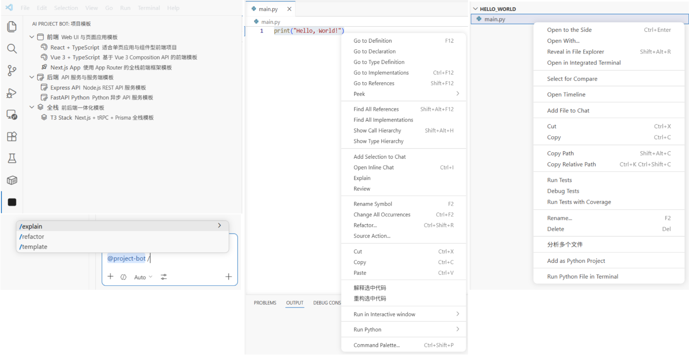
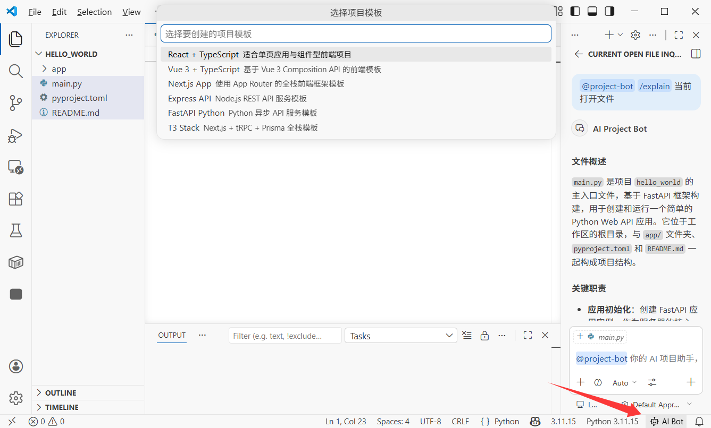

# Как создать расширение для VS Code: создайте своего AI-ассистента для проектов

# Глава 1. Что такое разработка расширений для VS Code

В этом руководстве мы пройдём полный замкнутый цикл: создадим с нуля расширение для VS Code, которое выступает в роли вашего AI-ассистента для проектов, с генерацией шаблонов проектов в один клик, AI-чатом по выбранным файлам или фрагментам кода, многофайловым анализом вопросов и ответов и пользовательскими горячими клавишами. Вы пройдёте разработку и отладку, а также научитесь публиковать его в VS Code Marketplace.

Для этого руководства вам как минимум потребуется:

- Окружение Node.js (версия 18.0+)
- Редактор VS Code (версия 1.90+)
- Ваш AI-ассистент для написания кода (Cursor / Trae / Claude Code)
- (Опционально) Подписка на GitHub Copilot (для Language Model API)

> **Vibe Coding от начала до конца**: мы будем использовать AI-ассистент для написания кода, чтобы сгенерировать большую часть кода. Вам нужно лишь понять основные концепции и архитектуру, а затем описать требования на естественном языке.

## 1.1 Что могут делать расширения VS Code?

Вы уже используете расширения VS Code ежедневно. Prettier форматирует ваш код, GitLens показывает историю Git, а GitHub Copilot помогает писать код. Эти расширения, по сути, являются программами, написанными на TypeScript/JavaScript, которые расширяют редактор через API VS Code.

Расширения VS Code могут делать гораздо больше, чем многие ожидают:

* **Добавлять новые элементы UI**: панели боковой панели, информацию в строке состояния, пользовательские страницы Webview
* **Работать с файлами и кодом**: читать, изменять и создавать файлы; анализировать структуру кода
* **Интегрировать внешние сервисы**: вызывать API, подключаться к базам данных, интегрировать CI/CD
* **Расширять возможности редактора**: пользовательская поддержка языков, автодополнение кода, диагностика
* **Добавлять возможности AI**: создавать AI-ассистентов с помощью Chat Participant API, вызывать модели с помощью Language Model API

<!--  -->


## 1.2 Основная архитектура расширения VS Code

Расширение VS Code работает в изолированном процессе **Extension Host**, отдельном от основного процесса редактора. Это означает, что даже если расширение упадёт, сам редактор не пострадает.

Типичное расширение состоит из таких основных частей:

* **package.json (манифест)**: «удостоверение личности» расширения, объявляющее имя, входной файл, точки вклада (`commands`, `menus`, `keybindings` и т. д.)
* **extension.ts (входной файл)**: «мозг» расширения, экспортирующий `activate()` и `deactivate()`
* **Точки вклада (Contribution Points)**: то, что ваше расширение привносит в VS Code в package.json (команды, пункты меню, горячие клавиши, представления и т. д.)
* **VS Code API**: набор TypeScript API, используемый для работы с возможностями редактора

```text
VS Code editor
    │
    ├── Extension Host (extension process)
    │   ├── Your extension
    │   │   ├── package.json  -> declares "what I can do"
    │   │   ├── extension.ts  -> implements "how to do it"
    │   │   └── other modules -> concrete feature code
    │   ├── Other extension A
    │   └── Other extension B
    │
    └── Editor main process (UI rendering)
```

<!--  -->


## 1.3 Какое расширение мы создаём?

Мы создадим расширение VS Code под названием **«AI Project Bot»** — AI-ассистент для проектов со следующими возможностями:

| Возможность | Описание |
|------|------|
| Шаблоны проектов | Список шаблонов в боковой панели, генерация каркаса проекта в один клик |
| AI-чат | Участник `@project-bot` в VS Code Chat для вопросов и ответов по проекту |
| Чат по файлу/фрагменту | Щёлкните правой кнопкой по выбранному коду или файлу и отправьте AI для анализа/объяснения/рефакторинга |
| Многофайловые вопросы и ответы | Выберите несколько файлов в проводнике и попросите AI проанализировать связи и логику |
| Горячие клавиши | Пользовательские горячие клавиши для быстрого выполнения частых действий |

<!--  -->


## 1.4 План руководства

Мы пройдём весь путь в следующие шаги:

1. **Создание проекта расширения** (3 минуты): создать каркас проекта и понять основные файлы
2. **Реализация шаблонов проектов** (5 минут): использовать TreeView для показа шаблонов в боковой панели и генерировать проекты
3. **Реализация AI-участника чата** (5 минут): создать `@project-bot` через Chat Participant API
4. **Реализация чата по файлу/фрагменту и многофайловых вопросов и ответов** (5 минут): контекстные меню + многофайловый анализ
5. **Добавление горячих клавиш и улучшение UX** (3 минуты): горячие клавиши и подсказки в строке состояния
6. **Публикация в Marketplace** (опционально): упаковать и отправить

# Глава 2. Создание проекта расширения (3 минуты)

## 2.1 Генерация проекта с помощью каркаса

VS Code официально предоставляет инструмент-каркас Yeoman. Попросите AI выполнить:

```text
Please help me install VS Code extension scaffolding tools and create a project:
1. Install Yeoman and generator-code: npm install -g yo generator-code
2. Run yo code and choose:
   - Type: New Extension (TypeScript)
   - Name: ai-project-bot
   - Identifier: ai-project-bot
   - Description: AI project assistant - template generation, intelligent chat, multi-file Q&A
   - Package manager: npm
3. Enter project directory and install dependencies
```

Сгенерированная структура:

```text
ai-project-bot/
├── .vscode/
│   ├── launch.json          # Debug config (F5 starts debugging)
│   └── tasks.json           # Build tasks
├── src/
│   └── extension.ts         # Extension entry file
├── package.json             # Extension manifest (most important file)
├── tsconfig.json            # TypeScript config
└── vsc-extension-quickstart.md  # Quick start guide (can be removed)
```

## 2.2 Понимание package.json: «удостоверение личности» расширения

`package.json` — это основной файл расширения VS Code. Помимо обычных полей npm, в нём есть `contributes` для объявления всего, что ваше расширение привносит в VS Code:

```json
{
  "name": "ai-project-bot",
  "displayName": "AI Project Bot",
  "description": "AI project assistant - template generation, intelligent chat, multi-file Q&A",
  "version": "0.0.1",
  "engines": { "vscode": "^1.90.0" },
  "activationEvents": [],
  "main": "./out/extension.js",
  "contributes": {
    "commands": [],
    "menus": {},
    "keybindings": [],
    "viewsContainers": {},
    "views": {},
    "chatParticipants": []
  }
}
```

**Ключевые поля:**

| Поле | Назначение |
|------|------|
| `engines.vscode` | Минимальная поддерживаемая версия VS Code |
| `activationEvents` | Когда расширение активируется (пустое значение означает активацию по требованию) |
| `main` | Путь к скомпилированному входному файлу |
| `contributes` | Все привносимые возможности (команды, меню, горячие клавиши, представления и т. д.) |

<!--  -->


## 2.3 Понимание extension.ts: «мозг» расширения

Откройте `src/extension.ts`, и вы увидите две основные функции:

```typescript
import * as vscode from 'vscode'

// Called when extension is activated (first command execution, opening specific files, etc.)
export function activate(context: vscode.ExtensionContext) {
  console.log('AI Project Bot activated!')

  // Register commands, views, chat participants, etc.
  const disposable = vscode.commands.registerCommand(
    'ai-project-bot.helloWorld',
    () => {
      vscode.window.showInformationMessage('Hello from AI Project Bot!')
    }
  )

  context.subscriptions.push(disposable)
}

// Called when extension is deactivated (for example when VS Code closes)
export function deactivate() {}
```

**Основные концепции:**

* `activate(context)`: инициализация расширения, регистрируйте все возможности здесь
* `context.subscriptions`: список автоочистки; VS Code освобождает зарегистрированные элементы при деактивации
* `vscode.commands.registerCommand`: регистрирует команду, вызываемую из палитры команд (`Ctrl+Shift+P`)

## 2.4 Запуск отладки

Нажмите **F5**, и VS Code откроет новое окно **Extension Development Host**. Это свежий экземпляр VS Code с загруженным вашим расширением.

В новом окне нажмите **Ctrl+Shift+P**, введите «Hello World», и вы увидите всплывающее сообщение. Это означает, что ваше расширение работает.

<!--  -->


> **Совет по отладке**: после изменений кода в Extension Development Host нажмите **Ctrl+Shift+P** -> **Developer: Reload Window**, чтобы быстро перезагрузить расширение.

# Глава 3. Реализация шаблонов проектов (5 минут)

## 3.1 Проектирование системы шаблонов

Мы хотим добавить панель «Шаблоны проектов» в боковую панель VS Code, где пользователи смогут просматривать шаблоны и генерировать каркасы проектов в один клик. Для этого используется **TreeView API** VS Code.

Попросите AI реализовать:

```text
Please help me implement project templates in ai-project-bot:

1. Add contribution points in package.json:
   - Add a new viewsContainers.activitybar item with id "project-bot", title "AI Project Bot"
   - Add a view under it with id "projectTemplates", name "Project Templates"
   - Add command "ai-project-bot.createFromTemplate", title "Create Project from Template"

2. Create src/templates/templateProvider.ts:
   - Implement TreeDataProvider with template categories and templates:
     - Frontend: React + TypeScript, Vue 3 + TypeScript, Next.js App
     - Backend: Express API, FastAPI Python
     - Full-stack: T3 Stack (Next.js + tRPC + Prisma)
   - Each template item shows name, description, and icon

3. Create src/templates/scaffolder.ts:
   - Implement createProjectFromTemplate function
   - Let users choose target folder
   - Generate project structure by template type
```

## 3.2 Объявление представления в package.json

Сначала добавьте вклады представления боковой панели в `package.json`:

```json
{
  "contributes": {
    "viewsContainers": {
      "activitybar": [
        {
          "id": "project-bot",
          "title": "AI Project Bot",
          "icon": "resources/bot-icon.svg"
        }
      ]
    },
    "views": {
      "project-bot": [
        {
          "id": "projectTemplates",
          "name": "Project Templates"
        }
      ]
    },
    "commands": [
      {
        "command": "ai-project-bot.createFromTemplate",
        "title": "Create Project from Template",
        "icon": "$(add)"
      }
    ],
    "menus": {
      "view/title": [
        {
          "command": "ai-project-bot.createFromTemplate",
          "when": "view == projectTemplates",
          "group": "navigation"
        }
      ]
    }
  }
}
```

Эта конфигурация делает три вещи:

1. Добавляет иконку-вход «AI Project Bot» на панель активности
2. Создаёт представление «Project Templates» под этим входом
3. Добавляет кнопку «+» в заголовок представления для создания проекта

<!--  -->


## 3.3 Реализация TreeDataProvider

TreeDataProvider — это интерфейс, который VS Code использует для заполнения данных дерева. Нам нужны `getTreeItem` (информация для отображения одного узла) и `getChildren` (список дочерних узлов).

Основной код:

```typescript
// src/templates/templateProvider.ts
import * as vscode from 'vscode'

interface Template {
  name: string
  description: string
  category: string
  command: string // command to generate project, for example "npx create-react-app"
}

const TEMPLATES: Template[] = [
  { name: 'React + TypeScript', description: 'React project built with Vite', category: 'Frontend', command: 'npm create vite@latest {{name}} -- --template react-ts' },
  { name: 'Vue 3 + TypeScript', description: 'Vue 3 project built with Vite', category: 'Frontend', command: 'npm create vite@latest {{name}} -- --template vue-ts' },
  { name: 'Next.js App', description: 'Next.js App Router full-stack project', category: 'Frontend', command: 'npx create-next-app@latest {{name}} --typescript --app' },
  { name: 'Express API', description: 'Express + TypeScript REST API', category: 'Backend', command: 'npx create-express-api {{name}}' },
  { name: 'FastAPI Python', description: 'Python FastAPI backend project', category: 'Backend', command: 'pip install fastapi uvicorn' },
]

// Tree node: category or template
class TemplateItem extends vscode.TreeItem {
  constructor(
    public readonly label: string,
    public readonly collapsibleState: vscode.TreeItemCollapsibleState,
    public readonly template?: Template
  ) {
    super(label, collapsibleState)
    if (template) {
      this.description = template.description
      this.tooltip = `${template.name}\n${template.description}\nCommand: ${template.command}`
      this.contextValue = 'template'
      this.command = {
        command: 'ai-project-bot.createFromTemplate',
        title: 'Create Project',
        arguments: [template]
      }
    }
  }
}

export class TemplateProvider implements vscode.TreeDataProvider<TemplateItem> {
  getTreeItem(element: TemplateItem): vscode.TreeItem {
    return element
  }

  getChildren(element?: TemplateItem): TemplateItem[] {
    if (!element) {
      // Root: return category list
      const categories = [...new Set(TEMPLATES.map(t => t.category))]
      return categories.map(
        cat => new TemplateItem(cat, vscode.TreeItemCollapsibleState.Expanded)
      )
    }
    // Children: templates in category
    return TEMPLATES
      .filter(t => t.category === element.label)
      .map(t => new TemplateItem(t.name, vscode.TreeItemCollapsibleState.None, t))
  }
}
```

## 3.4 Регистрация представления и команды создания

Зарегистрируйте TreeView и команду создания проекта в `extension.ts`:

```typescript
// src/extension.ts
import { TemplateProvider } from './templates/templateProvider'

export function activate(context: vscode.ExtensionContext) {
  // Register template view
  const templateProvider = new TemplateProvider()
  vscode.window.registerTreeDataProvider('projectTemplates', templateProvider)

  // Register create project command
  const createCmd = vscode.commands.registerCommand(
    'ai-project-bot.createFromTemplate',
    async (template) => {
      if (!template) {
        // If no template passed (called from command palette), let user pick
        const pick = await vscode.window.showQuickPick(
          TEMPLATES.map(t => ({ label: t.name, description: t.description, template: t })),
          { placeHolder: 'Choose a project template' }
        )
        if (!pick) return
        template = pick.template
      }

      // Ask for project name
      const name = await vscode.window.showInputBox({
        prompt: 'Enter project name',
        placeHolder: 'my-awesome-project'
      })
      if (!name) return

      // Ask for target folder
      const folder = await vscode.window.showOpenDialog({
        canSelectFolders: true,
        openLabel: 'Select target folder'
      })
      if (!folder) return

      // Execute creation command
      const terminal = vscode.window.createTerminal('AI Project Bot')
      terminal.show()
      const cmd = template.command.replace('{{name}}', name)
      terminal.sendText(`cd "${folder[0].fsPath}" && ${cmd}`)

      vscode.window.showInformationMessage(`Creating ${template.name} project: ${name}`)
    }
  )

  context.subscriptions.push(createCmd)
}
```

Теперь нажмите F5 для отладки. Вы увидите AI Project Bot на панели активности. Разверните список шаблонов и нажмите на любой шаблон, чтобы создать проект.

<!--  -->


# Глава 4. Реализация AI-участника чата (5 минут)

## 4.1 Что такое Chat Participant API?

Начиная с VS Code 1.90, расширения могут создавать собственного AI-ассистента в панели Chat с помощью **Chat Participant API**. Если пользователь вводит `@project-bot помоги мне проанализировать архитектуру этого проекта`, ваше расширение получает сообщение и возвращает сгенерированный моделью ответ.

Основные концепции:

* **Участник (Participant)**: идентичность вашего ассистента в панели Chat, вызывается через `@name`
* **Слэш-команды (Slash Commands)**: быстрые команды, поддерживаемые участником, такие как `/explain`, `/refactor`
* **Language Model API**: вызов встроенных моделей в VS Code (например, Copilot GPT-4o)
* **Поток (Stream)**: постепенный вывод ответов через `stream.markdown()`

## 4.2 Объявление участника чата в package.json

Добавьте это в `contributes`:

```json
{
  "contributes": {
    "chatParticipants": [
      {
        "id": "ai-project-bot.projectBot",
        "name": "project-bot",
        "fullName": "AI Project Bot",
        "description": "Your AI project assistant for code analysis, architecture explanation, and solution generation",
        "isSticky": true
      }
    ]
  }
}
```

`isSticky: true` означает, что после выбора последующие сообщения по умолчанию направляются этому участнику без необходимости каждый раз вводить `@project-bot`.

## 4.3 Реализация обработчика участника чата

Попросите AI написать основную логику:

```text
Please help me create src/chat/chatParticipant.ts and implement Chat Participant:
1. Register participant "ai-project-bot.projectBot"
2. Support three slash commands:
   - /explain: explain selected code or current file
   - /refactor: provide refactoring suggestions
   - /template: recommend suitable tech stack templates
3. Use Language Model API with VS Code built-in model
4. Return response in streaming mode (stream.markdown)
```

Основной код:

```typescript
// src/chat/chatParticipant.ts
import * as vscode from 'vscode'

export function registerChatParticipant(context: vscode.ExtensionContext) {
  const participant = vscode.chat.createChatParticipant(
    'ai-project-bot.projectBot',
    async (request, chatContext, stream, token) => {
      // Select available model
      const models = await vscode.lm.selectChatModels({ family: 'gpt-4o' })
      const model = models[0]

      if (!model) {
        stream.markdown('No language model available. Please make sure GitHub Copilot is installed.')
        return
      }

      // Build system prompt by slash command
      let systemPrompt = 'You are a professional project development assistant.'

      if (request.command === 'explain') {
        systemPrompt = 'You are a code explanation expert. Please explain user code in concise Chinese, including purpose, logic flow, and key design decisions.'
      } else if (request.command === 'refactor') {
        systemPrompt = 'You are a code refactoring expert. Analyze user code and provide specific refactoring suggestions with improved code examples.'
      } else if (request.command === 'template') {
        systemPrompt = 'You are a tech stack selection expert. Recommend suitable tech stacks and project templates based on user requirements.'
      }

      // Build messages
      const messages = [
        vscode.LanguageModelChatMessage.User(systemPrompt),
        vscode.LanguageModelChatMessage.User(request.prompt)
      ]

      // Stream output
      const response = await model.sendRequest(messages, {}, token)
      for await (const chunk of response.stream) {
        stream.markdown(chunk)
      }

      return { metadata: { command: request.command || '' } }
    }
  )

  // Register slash commands
  participant.slashCommandProvider = {
    provideSlashCommands: () => [
      { name: 'explain', description: 'Explain code function and logic' },
      { name: 'refactor', description: 'Provide refactoring suggestions and improvements' },
      { name: 'template', description: 'Recommend suitable project templates and tech stacks' }
    ]
  }

  // Register follow-up suggestions
  participant.followupProvider = {
    provideFollowups: (result) => {
      if (result.metadata?.command === 'explain') {
        return [
          { prompt: 'Can you draw a flowchart?', label: 'Generate flowchart' },
          { prompt: 'Any potential bugs here?', label: 'Check potential issues' }
        ]
      }
      return []
    }
  }

  context.subscriptions.push(participant)
}
```

Вызовите регистрацию в `extension.ts`:

```typescript
import { registerChatParticipant } from './chat/chatParticipant'

export function activate(context: vscode.ExtensionContext) {
  // ... previous template registration code ...
  registerChatParticipant(context)
}
```

Теперь введите `@project-bot /explain что делает этот код?` в панели Chat, и ваше расширение вызовет модель и сгенерирует объяснение.

<!--  -->


# Глава 5. Чат по файлу/фрагменту и многофайловые вопросы и ответы (5 минут)

## 5.1 Контекстное меню: отправка выбранного кода в AI

Мы хотим, чтобы пользователи могли выбирать код в редакторе и отправлять его в AI из контекстного меню. Для этого используются точки вклада **Context Menu** VS Code.

Добавьте в `package.json`:

```json
{
  "contributes": {
    "commands": [
      {
        "command": "ai-project-bot.explainSelection",
        "title": "AI: Explain Selected Code"
      },
      {
        "command": "ai-project-bot.refactorSelection",
        "title": "AI: Refactor Selected Code"
      }
    ],
    "menus": {
      "editor/context": [
        {
          "command": "ai-project-bot.explainSelection",
          "when": "editorHasSelection",
          "group": "ai-project-bot@1"
        },
        {
          "command": "ai-project-bot.refactorSelection",
          "when": "editorHasSelection",
          "group": "ai-project-bot@2"
        }
      ]
    }
  }
}
```

**Пояснения к ключевой конфигурации:**

* `when: "editorHasSelection"`: показывать меню только когда текст выделен
* `group: "ai-project-bot@1"`: группировка и порядок пунктов меню (`@1`, `@2`)

## 5.2 Реализация анализа выбранного кода

```typescript
// src/commands/selectionCommands.ts
import * as vscode from 'vscode'

export function registerSelectionCommands(context: vscode.ExtensionContext) {
  // Explain selected code
  const explainCmd = vscode.commands.registerCommand(
    'ai-project-bot.explainSelection',
    async () => {
      const editor = vscode.window.activeTextEditor
      if (!editor) return

      const selection = editor.selection
      const selectedText = editor.document.getText(selection)
      const fileName = editor.document.fileName.split('/').pop()
      const startLine = selection.start.line + 1
      const endLine = selection.end.line + 1

      // Build prompt with context
      const prompt = [
        `Please explain the following code (from ${fileName}, lines ${startLine}-${endLine}):`,
        '```',
        selectedText,
        '```',
        'Please explain: 1) what this code does 2) core logic 3) possible improvements'
      ].join('\n')

      // Call Language Model API
      const models = await vscode.lm.selectChatModels({ family: 'gpt-4o' })
      if (!models.length) {
        vscode.window.showErrorMessage('No language model available')
        return
      }

      // Show results in output panel
      const outputChannel = vscode.window.createOutputChannel('AI Project Bot')
      outputChannel.show()
      outputChannel.appendLine(`\n--- Code Explanation (${fileName}:${startLine}-${endLine}) ---\n`)

      const messages = [
        vscode.LanguageModelChatMessage.User(prompt)
      ]
      const response = await models[0].sendRequest(messages, {})
      for await (const chunk of response.stream) {
        outputChannel.append(chunk)
      }
    }
  )

  context.subscriptions.push(explainCmd)
}
```

<!--  -->


## 5.3 Многофайловые вопросы и ответы: пакетный анализ связей файлов

Это одна из самых мощных возможностей: выберите несколько файлов в проводнике и позвольте AI проанализировать связи и логику в один клик.

Добавьте контекстное меню проводника в `package.json`:

```json
{
  "contributes": {
    "commands": [
      {
        "command": "ai-project-bot.analyzeFiles",
        "title": "AI: Analyze Relationships of Selected Files"
      }
    ],
    "menus": {
      "explorer/context": [
        {
          "command": "ai-project-bot.analyzeFiles",
          "when": "explorerResourceIsFile",
          "group": "ai-project-bot"
        }
      ]
    }
  }
}
```

Реализуйте команду многофайлового анализа:

```typescript
// src/commands/multiFileAnalysis.ts
import * as vscode from 'vscode'

export function registerMultiFileCommands(context: vscode.ExtensionContext) {
  const analyzeCmd = vscode.commands.registerCommand(
    'ai-project-bot.analyzeFiles',
    async (clickedFile: vscode.Uri, selectedFiles: vscode.Uri[]) => {
      // selectedFiles contains all selected files
      const files = selectedFiles || [clickedFile]

      if (files.length < 2) {
        vscode.window.showWarningMessage('Please select at least 2 files for analysis')
        return
      }

      // Read all selected files
      const fileContents: string[] = []
      for (const file of files) {
        const content = await vscode.workspace.fs.readFile(file)
        const fileName = vscode.workspace.asRelativePath(file)
        fileContents.push(
          `--- ${fileName} ---\n${Buffer.from(content).toString('utf8')}`
        )
      }

      const prompt = [
        `Please analyze relationships among these ${files.length} files:`,
        '',
        ...fileContents,
        '',
        'Please explain:',
        '1. Responsibilities of each file',
        '2. Dependency/call relationships among them',
        '3. Data flow (if any)',
        '4. Architectural suggestions or potential issues'
      ].join('\n')

      // Call model and show result
      const models = await vscode.lm.selectChatModels({ family: 'gpt-4o' })
      if (!models.length) {
        vscode.window.showErrorMessage('No language model available')
        return
      }

      const outputChannel = vscode.window.createOutputChannel('AI Project Bot')
      outputChannel.show()
      outputChannel.appendLine(`\n--- Multi-file Analysis (${files.length} files) ---\n`)

      const messages = [
        vscode.LanguageModelChatMessage.User(prompt)
      ]
      const response = await models[0].sendRequest(messages, {})
      for await (const chunk of response.stream) {
        outputChannel.append(chunk)
      }
    }
  )

  context.subscriptions.push(analyzeCmd)
}
```

Использование: в проводнике зажмите `Ctrl` (`Cmd` на Mac), чтобы выбрать несколько файлов, щёлкните правой кнопкой и выберите «AI: Analyze Relationships of Selected Files». AI прочитает все выбранные файлы и вернёт анализ.

<!--  -->


# Глава 6. Горячие клавиши и оптимизация UX (3 минуты)

## 6.1 Пользовательские горячие клавиши

Горячие клавиши — ключ к эффективности. Добавьте в `package.json`:

```json
{
  "contributes": {
    "keybindings": [
      {
        "command": "ai-project-bot.explainSelection",
        "key": "ctrl+shift+e",
        "mac": "cmd+shift+e",
        "when": "editorTextFocus && editorHasSelection"
      },
      {
        "command": "ai-project-bot.refactorSelection",
        "key": "ctrl+shift+r",
        "mac": "cmd+shift+r",
        "when": "editorTextFocus && editorHasSelection"
      },
      {
        "command": "ai-project-bot.createFromTemplate",
        "key": "ctrl+shift+n",
        "mac": "cmd+shift+n",
        "when": ""
      }
    ]
  }
}
```

**Условия `when`:**

| Условие | Значение |
|------|------|
| `editorTextFocus` | Курсор находится в редакторе |
| `editorHasSelection` | Выделен некоторый текст |
| `explorerViewletVisible` | Панель проводника видна |
| `!editorReadonly` | Файл не доступен только для чтения |

Несколько условий, соединённых через `&&`, означают, что все должны быть выполнены.

## 6.2 Подсказка в строке состояния

Добавьте быстрый вход в строку состояния, чтобы пользователи всегда знали, что расширение работает:

```typescript
// src/statusBar.ts
import * as vscode from 'vscode'

export function createStatusBarItem(context: vscode.ExtensionContext) {
  const statusBar = vscode.window.createStatusBarItem(
    vscode.StatusBarAlignment.Right,
    100
  )
  statusBar.text = '$(hubot) AI Bot'
  statusBar.tooltip = 'Click to open AI Project Bot'
  statusBar.command = 'ai-project-bot.createFromTemplate'
  statusBar.show()

  context.subscriptions.push(statusBar)
}
```

`$(hubot)` — это встроенный синтаксис иконок VS Code. Все иконки можно найти в [библиотеке Codicon](https://microsoft.github.io/vscode-codicons/dist/codicon.html).

<!--  -->


# Глава 7. Публикация в Marketplace (опционально)

## 7.1 Подготовка к публикации

Расширения VS Code упаковываются и публикуются с помощью **vsce**:

```text
Please help me install vsce: npm install -g @vscode/vsce
```

Перед публикацией подготовьте:

1. **Аккаунт Azure DevOps**: зарегистрируйтесь и создайте организацию на [dev.azure.com](https://dev.azure.com/)
2. **Персональный токен доступа (PAT)**: создайте в Azure DevOps с разрешением **Marketplace -> Manage**
3. **Publisher ID**: создайте идентичность издателя в [VS Code Marketplace](https://marketplace.visualstudio.com/manage)

## 7.2 Дополнение метаданных package.json

Добавьте метаданные перед публикацией:

```json
{
  "publisher": "your-publisher-id",
  "repository": {
    "type": "git",
    "url": "https://github.com/yourname/ai-project-bot"
  },
  "categories": ["AI", "Other"],
  "keywords": ["ai", "project", "template", "chat"],
  "icon": "resources/icon.png",
  "galleryBanner": {
    "color": "#1e1e2e",
    "theme": "dark"
  }
}
```

Вам также нужны `README.md` для описания в Marketplace и `CHANGELOG.md` для истории версий.

## 7.3 Упаковка и публикация

```bash
# Package to .vsix (manual install file)
vsce package

# Publish to marketplace
vsce publish
```

После упаковки вы получите `ai-project-bot-0.0.1.vsix`. Вы можете отправить этот файл друзьям, и они смогут установить его через «Install from VSIX» в VS Code.

Для официальной публикации в Marketplace выполните `vsce publish`; расширение обычно появляется в течение нескольких минут.

<!--  -->

> **Совет**: первый релиз может потребовать проверки. Убедитесь, что README понятен, а скриншоты полны, чтобы ускорить одобрение.

# Глава 8. Заключение

Поздравляем! Вы создали с нуля полнофункциональное расширение VS Code. Вспомним:

1. Создали проект расширения с помощью каркаса Yeoman и поняли роли `package.json` и `extension.ts`
2. Реализовали список шаблонов проектов в боковой панели с помощью TreeView API и создание проекта в один клик
3. Создали AI-ассистента `@project-bot` с помощью Chat Participant API, включая слэш-команды и потоковые ответы
4. Реализовали анализ выделенного в редакторе кода по правому клику
5. Реализовали анализ связей между несколькими файлами
6. Добавили пользовательские горячие клавиши и подсказку в строке состояния

Пространство для воображения в разработке расширений VS Code огромно. Технологии, стоящие за полезными расширениями, которыми вы пользуетесь каждый день, — это именно то, что вы только что изучили.

**Продвинутые направления:**

* **Пользовательские панели Webview**: создавайте полностью пользовательский UI с HTML/CSS/JS, такие как визуальные графы архитектуры и интерактивные интерфейсы code review
* **Language Model Tools**: регистрируйте пользовательские инструменты, вызываемые AI, такие как запрос к базе данных или выполнение API-запросов
* **Диагностика и CodeLens**: показывайте подсказки AI, советы по производительности и предупреждения безопасности прямо в коде
* **Пользовательская поддержка языков**: предоставляйте подсветку синтаксиса, автодополнение и диагностику для DSL или определённых форматов конфигурации
* **Интеграция удалённой разработки**: сделайте так, чтобы расширение работало в SSH, контейнерах и WSL

***Ваш редактор — ваши правила.***

# Источники

* [Документация VS Code Extension API](https://code.visualstudio.com/api)
* [Руководство по Chat Participant API](https://code.visualstudio.com/api/extension-guides/chat)
* [Руководство по Language Model API](https://code.visualstudio.com/api/extension-guides/language-model)
* [Руководство по TreeView API](https://code.visualstudio.com/api/extension-guides/tree-view)
* [Руководство по Webview API](https://code.visualstudio.com/api/extension-guides/webview)
* [Руководство по публикации расширений VS Code](https://code.visualstudio.com/api/working-with-extensions/publishing-extension)
* [Библиотека иконок Codicon](https://microsoft.github.io/vscode-codicons/dist/codicon.html)
