# Как создать простейшую мини-программу WeChat

# 1. Что такое мини-программы WeChat и их разработка

В этом руководстве мы пройдём полный замкнутый цикл: от идеи в вашей голове до настоящей мини-программы, которую можно найти и открыть по QR-коду внутри WeChat.

Прежде чем начать создавать, нам нужно сформировать два базовых понимания.

Первое — **суть**: что именно представляет собой мини-программа WeChat? Чем она отличается от обычного приложения или сайта? Почему так много продуктов выбирают этот формат? Только когда вы поймёте основную логику, вы сможете оценить, подходит ли ваша идея для мини-программы.

Второе — **путь**: когда вы говорите «я хочу создать мини-программу», как выглядит полный путь от нуля до запуска? Каковы ключевые узлы на этом пути — о чём думать на этапе идеи, как настроить окружение, как AI-помощь в разработке повышает эффективность, какие подводные камни появляются при отладке в симуляторе и что решают тестовые аккаунты против формального релиза. Если вы сначала мысленно пройдёте этот процесс, то не заблудитесь во время реализации.

После того как эти два вопроса прояснятся, мы сможем официально приступить к разработке. Давайте начнём с первого вопроса: что именно представляет собой мини-программа WeChat?

## 1.1 Мини-программа WeChat

Мини-программу WeChat можно рассматривать как приложение, живущее внутри WeChat. Вам не нужно искать её в магазине приложений, скачивать или устанавливать. Пользователи могут найти её по названию в WeChat, отсканировать QR-код или открыть присланную карточку и сразу же ею пользоваться. После использования они просто закрывают её. Она не занимает постоянно домашний экран телефона или хранилище.

Для обычных пользователей мини-программы решают множество «небольших задач»: проверить доставку, заказать кофе, посмотреть заказы, сыграть в быструю игру. Быстрый запуск и единый вход внутри WeChat — её самые большие черты опыта использования.

Для компаний и разработчиков мини-программы — это «формат небольшого приложения», который можно искать и которым можно делиться. Достаточно зарегистрироваться на WeChat Official Platform, завершить настройки и пройти проверку, и ваша мини-программа сможет открыться для всех пользователей WeChat. По сравнению с традиционными приложениями, ей проще получить первую группу пользователей, потому что люди уже привыкли выполнять многие задачи в WeChat.

В этом руководстве мы не будем создавать сложную бизнес-систему. Мы выбираем классический пример: игру «Змейка». Она маленькая и логически понятная, но при этом включает полный набор элементов, которые должна иметь мини-программа: несколько страниц, простые взаимодействия, изменения состояния, запись очков и т. д. Это идеально подходит как ваш первый проект.

## 1.2 Разработка мини-программы WeChat

После понимания того, «что такое мини-программы», следующий вопрос: что на самом деле включает в себя разработка одной из них?

Вам нужна чёткая цель (например, игра «Змейка», в которую пользователи могут играть в любое время), нужно спроектировать интерфейс, который увидят пользователи, определить, что должно происходить при разных действиях, и наконец опубликовать её.

В традиционной разработке программисты обычно ведут все эти шаги и пишут много кода. В разработке с помощью AI это можно разделить более чётко: вы объясняете, что хотите, а AI помогает с большинством деталей реализации. Это означает, что для новичков самый важный навык — это уже не запоминание синтаксиса, а чёткое описание требований и понимание вывода AI.

## 1.3 Несколько способов разработки мини-программ WeChat

В реальных проектах люди используют разные технические маршруты. Чтобы не перегружать вас терминами в самом начале, мы сделаем только грубую классификацию, чтобы вы поняли распространённые пути.

Первый способ — использовать официальные нативные возможности напрямую. После создания проекта в WeChat DevTools вы увидите фиксированный набор типов файлов, используемых для описания структуры страниц, стилей и логики. Этот способ держится близко к официальной документации и даёт сильный контроль, но для тех, кто впервые изучает фронтенд, кривая обучения немного круче.

Второй способ — использовать кроссплатформенные фреймворки, такие как uni-app. Вы в основном пишете локально код, похожий на веб (например, файлы `.vue`), а фреймворк преобразует этот код в форматы, которые могут запускаться в мини-программах WeChat. Преимущество — единая структура. Если вы позже опубликуете на других платформах (таких как H5 или App), изменения будут относительно меньше.

На основе этих двух методов это руководство сосредоточено на SOP мини-программ с использованием AI-инструментов. Например, откройте весь проект в Trae и скажите встроенному AI напрямую: «Пожалуйста, добавь в этот файл главную страницу с заголовком и кнопкой» или «Пожалуйста, создай страницу игры, которая показывает змейку и очки». AI сгенерирует новые фрагменты кода или изменит/отрефакторит существующий код на основе текущего контекста проекта.

Эти три способа не являются взаимоисключающими. Вы вполне можете создавать в проекте uni-app, используя при этом Trae AI для большей части работы по написанию кода. Ключ не в выборе одного метода, а в понимании того, где вы сейчас находитесь и какие инструменты доступны.

## 1.4 Шаги создания мини-программы WeChat, рассматриваемые в этой статье (высокоуровневый обзор)

Это руководство следует ритму **от окружения к готовому продукту**. Вокруг примера «Змейки» и стиля vibecoding в Trae мы разбиваем процесс на переиспользуемый маршрут. В последующих главах вы пройдёте через эти этапы:

1. Заложить концептуальную основу: понять, что такое мини-программы, какие распространённые методы разработки существуют, и для кого и в каких сценариях предназначена эта мини-программа «Змейка».
2. Подготовить окружение: зарегистрировать аккаунт мини-программы, установить HBuilderX, Trae и WeChat DevTools, затем создать базовый каркас проекта с помощью HBuilderX, который может запуститься в WeChat DevTools и сначала показать простейшую страницу.
3. Перейти к формальной разработке: открыть проект в Trae, использовать диалог vibecoding с AI для пошаговой генерации макета главной страницы и страницы игры и реализовать основной геймплей, такой как движение змейки, поедание еды и завершение игры.
4. После того как основные функции заработают, научиться использовать AI как «партнёра по отладке и рефакторингу»: попросить его диагностировать баги, привести в порядок структуру, когда код становится беспорядочным, и постепенно добавлять детали, такие как старт/пауза, запись рекордов и улучшение UI.
5. Перейти к публикации: собрать проект в распознаваемую WeChat версию, предварительно просмотреть и протестировать на реальных устройствах в WeChat DevTools, сначала запустить с тестовым аккаунтом и версией для опыта (experience version) для проверки процесса, затем завершить регистрацию (filing) и проверку перед формальным релизом, чтобы другие могли найти и поиграть в вашу мини-программу.

Этот раздел только рисует полную карту и пока не раскрывает команды или детали кода. Пока что запомните эти 5 шагов: **Понять -> Настроить окружение -> Разработка через vibecoding -> Отладка и шлифовка -> Сборка и релиз**. Последующие главы приблизят каждый шаг, показывая, что подготовить, что сказать AI и какие результаты вы должны увидеть на экране на каждом этапе.

# 2. Подготовка окружения

Прежде чем писать хоть одну строку кода, давайте сначала подготовим окружение.  
Цель этой части — убедиться, что вы больше не будете застревать на вопросах **где скачать инструменты и почему ничего не запускается**, чтобы вы могли сосредоточиться напрямую на диалоге с AI и реализации требований.

Если вы умеете открывать браузер, скачивать файлы и дважды кликать по установщикам, вы сможете пройти этот раздел.

## 2.1 Три инструмента, используемые в этом руководстве

Для разработки мини-программы «Змейка» мы используем три инструмента вместе, у каждого свои обязанности:

1. Первый — Trae. Думайте о нём как об AI-интегрированном редакторе кода. Он может открывать файлы проекта как обычная IDE, а также позволяет общаться с AI на естественном языке, чтобы генерировать, изменять и объяснять код. Большинство операций «создать мини-программу с помощью AI» в этом руководстве происходят в Trae. Скачайте последнюю версию с https://www.trae.cn .
2. Второй — HBuilderX. Он имеет сильную поддержку Vue и uni-app и предлагает готовые шаблоны мини-программ. Мы используем его, чтобы «в один клик сгенерировать» базовый проект мини-программы — это закладка фундамента перед передачей его в Trae + AI для дальнейшей итерации. Скачайте с https://www.dcloud.io/hbuilderx.html .
3. Третий — WeChat DevTools. Этот официальный инструмент используется для разработки и предварительного просмотра мини-программ. Он запускает ваш проект на десктопе и поддерживает отладку на реальных мобильных устройствах. Скачайте с https://developers.weixin.qq.com/miniprogram/dev/devtools/download.html .

Короче говоря: HBuilderX быстро создаёт базовый проект, Trae помогает писать код с AI, а WeChat DevTools показывает реально работающую мини-программу.

## 2.2 Регистрация аккаунта WeChat Official Platform и получение AppID

Когда инструменты готовы, вам всё ещё нужна **идентичность мини-программы**, которая создаётся на WeChat Official Platform.  
Если вы никогда раньше не регистрировали мини-программу, следуйте этому порядку:

1. Введите https://mp.weixin.qq.com в браузере, откройте WeChat Official Platform и войдите, отсканировав QR-код с помощью WeChat.

2. Выберите «Mini Program» (мини-программа) на главной странице и завершите подсказки регистрации, включая email, номер телефона и тип субъекта (физическое лицо или предприятие).  
   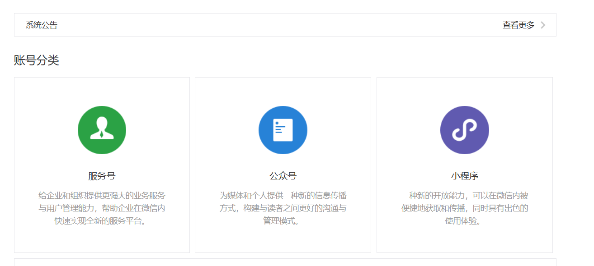
3. После успешной регистрации войдите в бэкенд, найдите «Development Management» (управление разработкой) или «Development Settings» (настройки разработки), и вы увидите уникальный ID под названием AppID. Это идентичность вашей мини-программы, которая будет использоваться в конфигурации проекта позже.

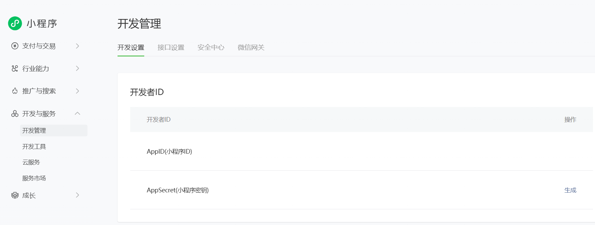

Рекомендуется сохранить AppID там, где его легко найти. В последующих разделах мы заполним это значение напрямую, чтобы связать локальный проект с вашей онлайн-мини-программой.

## 2.3 Установка WeChat DevTools

Далее нам нужно место, чтобы реально запускать и предварительно просматривать мини-программы. Именно для этого предназначен WeChat DevTools.

1. Посетите страницу загрузки https://developers.weixin.qq.com/miniprogram/dev/devtools/download.html .  
   На этой странице вы увидите версии для разных операционных систем. Обычно выбирайте стабильную версию, соответствующую вашей системе, например Windows 64-bit или macOS.
2. После загрузки дважды кликните по установщику и следуйте мастеру шаг за шагом. Если не уверены, оставляйте параметры по умолчанию.
3. После установки запустите WeChat DevTools с рабочего стола или из меню «Пуск». При первом запуске он покажет QR-код и попросит отсканировать его с помощью WeChat. Отсканируйте и авторизуйтесь, чтобы войти в главный интерфейс.

Позже, когда файлы проекта будут готовы в Trae, мы импортируем собранную мини-программу в WeChat DevTools и посмотрим реальные результаты её работы здесь.

## 2.4 Подготовка Trae и HBuilderX

Наконец, установите два инструмента, используемые для собственно написания кода: Trae и HBuilderX.

Вы можете **сначала установить Trae**. Посетите https://www.trae.cn в браузере и скачайте подходящую версию для вашей ОС. Установка как у обычного ПО: дважды кликните по установщику и следуйте подсказкам. После установки вы получите IDE, которая может открывать локальные папки, просматривать код и общаться с AI. Все последующие шаги vibecoding происходят здесь.

**Затем установите HBuilderX**. Посетите https://www.dcloud.io/hbuilderx.html и скачайте пакет для вашей ОС. HBuilderX легковесный и быстро запускается. После установки вы можете бегло осмотреть интерфейс; глубоко изучать функции сейчас не нужно. В последующих главах мы используем его для создания шаблона мини-программы uni-app как отправной точки проекта.

После завершения этого раздела ваше окружение полностью готово: у вас есть аккаунт мини-программы + AppID, инструмент предварительного просмотра запуска и IDE для написания кода с AI. Далее мы начнём с **создания первого каркаса проекта** и заставим эти инструменты реально работать.

## 2.5 Подготовка базовых файлов

1. Нажмите «New Project» (новый проект).

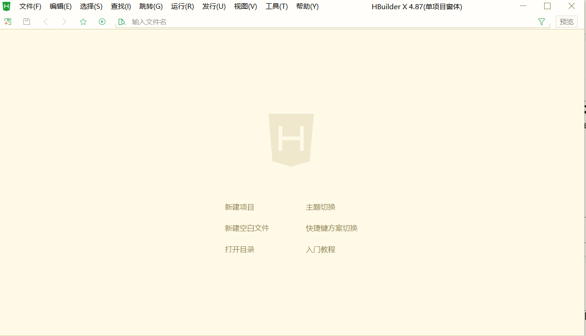

2. Выберите шаблон по умолчанию, задайте имя мини-программы, выберите путь хранения, затем нажмите «создать» в правом нижнем углу:

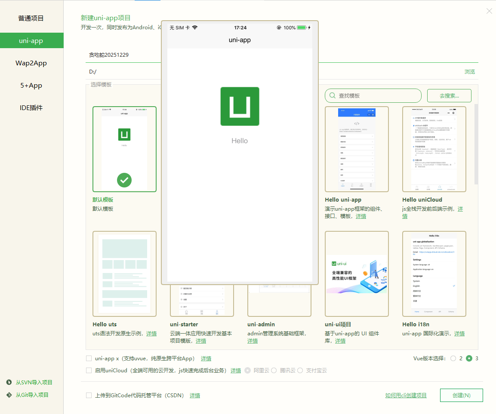

3. Появится экран успешного создания:

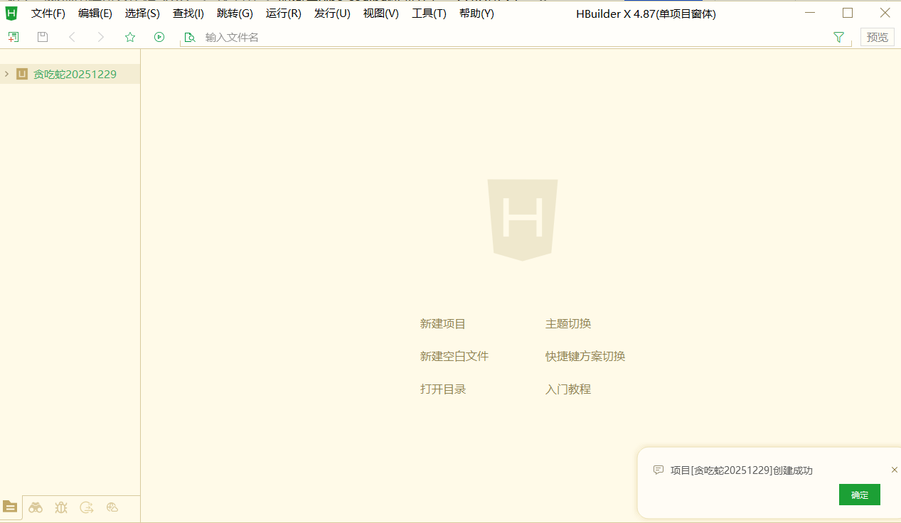

4. Затем найдите эту папку в файловой системе, откройте её в Trae, и вы увидите, что базовые файлы все готовы:

# 3. Разработка мини-программы

В первых двух частях мы уже прояснили, «что такое мини-программы» и «как настроить инструменты и окружение». С этого раздела мы переходим к практике: не просто к концепциям, а к тому, как AI реально помогает вам создать мини-программу «Змейка» с нуля.

В этом разделе вы пройдёте полный SOP для этапа разработки, который примерно включает:

1. Открыть текущий проект в Trae и дать AI вашу первую полную инструкцию, чтобы он спроектировал и реализовал работающую версию «Змейки» на основе текущего каркаса.
2. Позволить Trae изменять реальные файлы проекта напрямую, а не только выводить «пример кода», и научиться использовать откат для восстановления предыдущего состояния при необходимости.
3. Вернуться в HBuilderX и WeChat DevTools, запустить в симуляторе мини-программ и поиграть в эту версию в симуляторе, чтобы переключиться с «перспективы кода» на «перспективу пользователя».
4. На основе результатов игры продолжать предлагать изменения на естественном языке и позволить AI итерировать управление от кнопочного к джойстиковому, при этом проживая полный цикл «найти проблему -> описать проблему -> AI исправляет -> снова проверить».

Вы можете выбрать спроектировать каждую страницу и кнопку до разработки.  
Но для полных новичков проектирование интерфейса и взаимодействия само по себе тоже новая область (позже мы покажем проектирование с помощью AI). Поэтому в этом раунде мы намеренно используем другой способ: сначала начать — позволить AI сгенерировать работающую версию, а затем постепенно дорабатывать, просматривая результаты и общаясь на естественном языке.

## 3.1 Чётко объясните требования за один раз: дайте Trae первый «главный промпт»

После открытия подготовленного проекта мини-программы в Trae я не спешил редактировать конкретную строку. Вместо этого я сказал встроенному AI-ассистенту:

**Я дал AI команду: на основе текущего фреймворка создай мини-программу «Змейка». Пожалуйста, спроектируй эту мини-программу и напиши мне промпт.**

Другими словами, я не просил его «писать одну функцию шаг за шагом». Я сначала выбросил полную цель, позволил AI помочь спланировать, и AI не только спланировал, но и напрямую реализовал первую версию.

После получения этой инструкции Trae читает текущую структуру проекта, определяет, куда добавить страницы и куда добавить логику, и напрямую изменяет файлы/код проекта. Вам не нужно писать код вручную или вручную создавать/изменять папки.

## 3.2 Позвольте AI автоматически изменять реальный код, а не писать вручную

Когда вы выполняете эту инструкцию в Trae, AI входит в поток «редактирования проекта». Во время этого процесса вы можете наблюдать ключевые моменты:

1. Он объясняет свой ход мыслей в области чата, например, в какие директории он добавит страницы и как организует игровую логику.

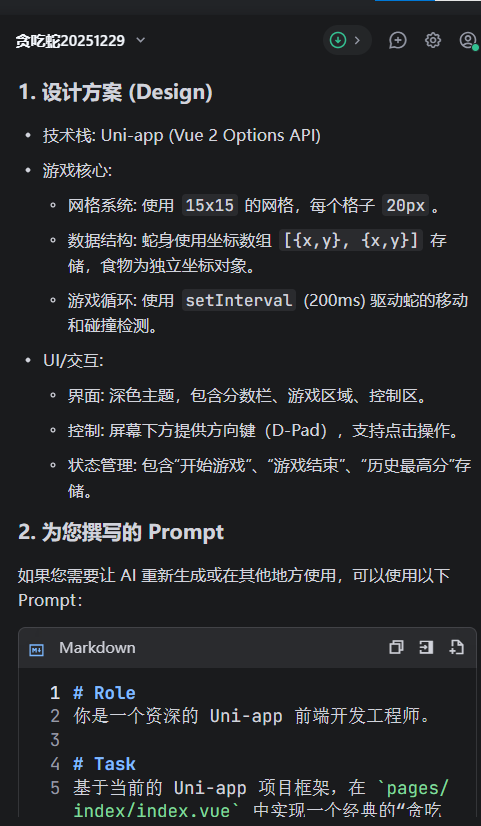

2. Он напрямую редактирует реальные файлы проекта, а не только даёт «образец кода» для копирования и вставки.
3. После завершения Trae выводит короткое резюме, сообщающее вам, какие файлы были изменены и что было сделано.

Если вы не удовлетворены этим раундом (или считаете, что что-то не так), не нужно паниковать. Trae предоставляет откат в левом верхнем углу за пределами окна чата. Вы можете восстановить состояние проекта до этой инструкции в один клик — как безопасная клавиша отмены.

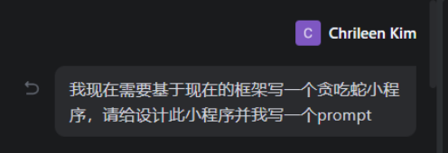

## 3.3 Просмотр результатов в HBuilderX и WeChat DevTools

После того как AI завершит первый раунд разработки, код уже записан в проект, но вы всё ещё не видели реального эффекта со стороны игрока.  
Далее нам нужно его запустить.

Конкретная операция: вернитесь в HBuilderX, найдите верхнее меню «Run» (запуск), выберите «Run to Mini Program Simulator» (запуск в симулятор мини-программ) -> «WeChat DevTools». Это запускает сборку проекта и открывает результат в WeChat DevTools.

Панель вывода внизу показывает процесс сборки. Если финальное состояние — «ready» без ошибок, сборка прошла успешно. Затем переключитесь на WeChat DevTools, чтобы проверить UI и возможности этой версии.

В большинстве случаев HBuilderX автоматически открывает WeChat DevTools, и вы можете сразу увидеть обновлённую мини-программу. Если он не открылся автоматически, сделайте так:

1. Сначала остановите текущий запуск в HBuilderX.
2. Запустите WeChat DevTools вручную и держите его открытым.
3. Вернувшись в HBuilderX, снова нажмите «Run -> Run to Mini Program Simulator -> WeChat DevTools».

После этого вы сможете увидеть мини-программу, созданную через vibecoding, в WeChat DevTools:

## 3.4 Используйте естественный язык для многократной корректировки, пока не будете довольны

В этой практике AI изначально сгенерировал «Змейку» с управлением кнопками: четыре кнопки направлений на экране, и змейка меняет направление при нажатии. В неё вполне можно играть, но лично я предпочитаю управление джойстиком. Для ваших запросов на корректировку (не только функции, но и дизайн UI и компоновка; освоившись, вы можете даже попросить AI интегрировать внешние API моделей или базы данных) снова: вам нужно лишь описать требования на естественном языке.

В этом и есть главное преимущество vibecoding: вам не нужно копаться в коде ради привязки событий или логики координат. Вы напрямую говорите AI, что хотите. Например, в чате Trae вы можете написать:

Замени кнопки на управление джойстиком. Когда пользователь отпускает джойстик, змейка должна продолжать двигаться в текущем направлении до следующего действия джойстиком.

Пока требование чёткое, AI автоматически найдёт целевые файлы и изменит стили управления, привязки взаимодействия и логику обработки направления.

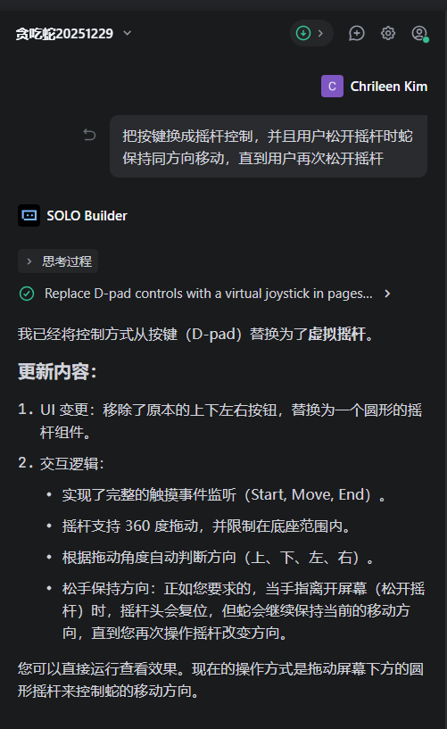

После изменения вернитесь в WeChat DevTools для проверки.  
Если изменения не видны сразу, нажмите «Run» в DevTools или обновите окно предварительного просмотра, чтобы применить последнюю сборку. Если по-прежнему не обновляется, остановите запуск в HBuilderX и снова запустите в симулятор, тогда вы сможете увидеть обновлённую мини-программу:

## 3.5 Что делать, если возникают проблемы: продолжайте общаться на естественном языке

Сгенерированные AI версии не всегда идеальны с первого раза. Вы можете столкнуться с:

- ошибками во время выполнения, и приложение не открывается;
- функции в основном правильные, но детали отличаются от ваших ожиданий;
- UI пригоден к использованию, но всё ещё недостаточно приятен визуально или недостаточно удобен.

В такие моменты не нужно вслепую редактировать код самостоятельно. Опишите проблемы напрямую AI-ассистенту Trae на естественном языке, например:

«Управление джойстиком теперь работает, но змейка иногда внезапно останавливается. Пожалуйста, проверь текущую реализацию.»  
Или: «В игру теперь можно играть, но интерфейс кажется тесным. Я хочу больше вертикальных отступов на мобильных устройствах. Пожалуйста, скорректируй компоновку.»

AI использует текущий контекст проекта + ваше описание, а затем напрямую предоставит и применит изменения кода. Если результат становится хуже или направление неверное, вы всё равно можете откатиться к предыдущей стабильной версии и попробовать другую формулировку.

За несколько таких раундов вы сможете отшлифовать «грубую первую версию» до «Змейки» с управлением джойстиком, более близкой к вашим предпочтениям.  
Например, я дал референсное изображение стиля и попросил AI соответственно скорректировать стиль UI:

## 3.6 Финальный результат и итоги раздела

После многократных раундов **описание на естественном языке -> изменение AI -> предварительный просмотр в WeChat DevTools -> продолжение микрокорректировок** я наконец получил такой результат:

- полная страница игры;
- змейка плавно движется и ест еду;
- поддерживается управление джойстиком;
- корректно работает в симуляторе мини-программ.

Примеры готового продукта:

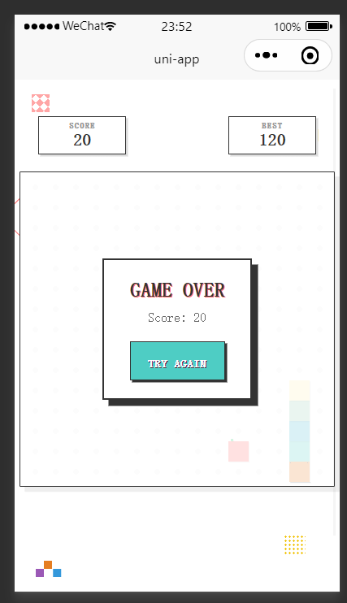

В этом разделе вы увидели полный замкнутый цикл:

1. В Trae одна чёткая инструкция позволила AI создать первую версию мини-программы «Змейка»;
2. С помощью HBuilderX + WeChat DevTools проверить реальный эффект с перспективы пользователя;
3. Продолжать предлагать изменения на естественном языке, позволяя AI заниматься оптимизацией функций и UI;
4. Когда возникают проблемы, использовать откат + повторный запуск, чтобы процесс оставался безопасным.

Далее вы можете использовать тот же ритм для собственных идей: не ограничиваясь «Змейкой», но и для утилитарных мини-программ, страниц мероприятий или реальных бизнес-прототипов. Ваша главная задача — чётко думать и чётко описывать. Остальное пусть берут на себя AI и инструменты.

# 4. Релиз мини-программы

В предыдущих трёх главах мы завершили полный путь от **настройки окружения** -> **разработки с помощью AI** -> **запуска «Змейки» в локальном симуляторе**.

С этой главы ключевой вопрос становится таким: **как реально опубликовать эту работу в WeChat, чтобы она была не просто игрушкой, а пригодной к использованию мини-программой?**

Чтобы снизить сложность, мы сначала возьмём **кратчайший замкнутый цикл**: опубликовать только как **тестовую версию / версию для опыта (experience version)** для себя и нескольких товарищей по команде. После того как функции и опыт станут стабильными, тогда перейдём к формальному публичному релизу.

Эта глава сначала охватывает 4.1, чтобы завершить кратчайший путь для **запуска версии для опыта**. Формальный релиз для всех пользователей объясняется в 4.2.

## 4.1 Кратчайший SOP — запуск как версия для опыта

Цель этого подраздела — только одно: дать вам возможность открыть вашу мини-программу «Змейка» в WeChat как **версию для опыта**.

Весь путь — это четыре задачи:

1. Найти и подтвердить ваш AppID в WeChat Official Platform.
2. Настроить этот AppID в вашем проекте.
3. Загрузить текущую версию в WeChat DevTools.
4. Вернуться в Official Platform и установить эту загруженную версию как «Experience Version» (версию для опыта).

Давайте пойдём в этом порядке.

### 4.1.1 Подтверждение AppID в WeChat Official Platform

Первый шаг: подтвердите AppID вашей мини-программы в WeChat Official Platform.

Вы уже делали это однажды в **разделе 2 «Настройка окружения»**. Здесь мы используем его по-настоящему.

1. Посетите `https://mp.weixin.qq.com` и войдите в бэкенд вашей мини-программы.
2. Найдите «Development Management» (управление разработкой) в левом меню, затем войдите в «Development Settings» (настройки разработки).
3. Вверху найдите область «Developer ID» (ID разработчика). Там есть строка «AppID (Mini Program ID)» — это ваш уникальный ID.

Этот ID должен точно совпадать с конфигурацией проекта. Иначе WeChat сочтёт его другой идентичностью приложения, и предварительный просмотр/публикация не удадутся.

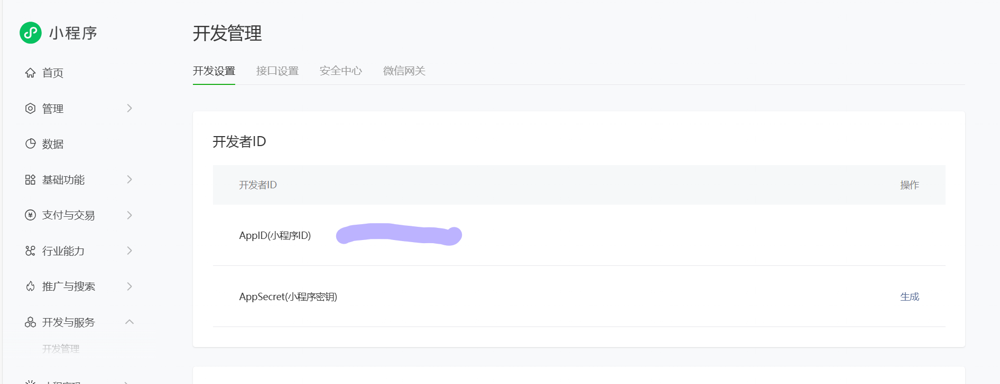

### 4.1.2 Заполнение AppID в проекте

Второй шаг: записать этот AppID в конфигурацию проекта, чтобы локальная сборка связывалась с вашим официальным аккаунтом мини-программы.

Если ваш проект использует шаблон uni-app, сделайте так:

1. Откройте HBuilderX и загрузите проект «Змейка».
2. Найдите `manifest.json` в дереве файлов и откройте его.
3. Прокрутите до «WeChat Mini Program Configuration» (конфигурация мини-программы WeChat), и вы увидите поле ввода вроде «WeChat Mini Program AppID».
4. Вставьте AppID, скопированный из Official Platform, точно, затем сохраните файл.
   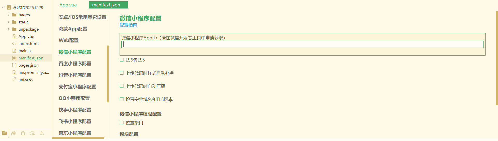

Теперь ваш локальный проект заявил эту идентичность мини-программы. Далее, когда вы загрузите из WeChat DevTools, это будет записано под этим AppID.

### 4.1.3 Загрузка версии в WeChat DevTools

Мы уже запускали проект в WeChat DevTools для предварительного просмотра в симуляторе.

Теперь мы делаем так: «упаковать текущий код как версию и загрузить на сервер».

Шаги:

1. В правом верхнем углу панели инструментов WeChat DevTools нажмите «Upload» (загрузить).
2. Во всплывающем окне заполните два ключевых поля:
   1. Номер версии: например, `1.0.0` (только цифры и точки).
   2. Заметка к проекту: короткое описание, например «Завершён основной геймплей».
3. Подтвердите и нажмите «Upload». Панель вывода покажет процесс сборки. Если все шаги стали зелёными и загрузка завершилась, эта версия успешно отправлена на сервер WeChat.

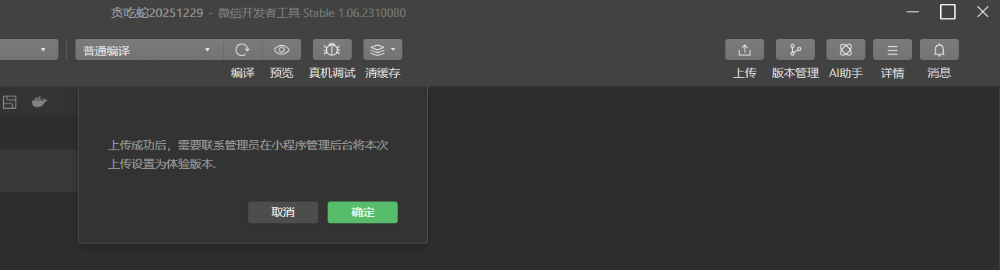

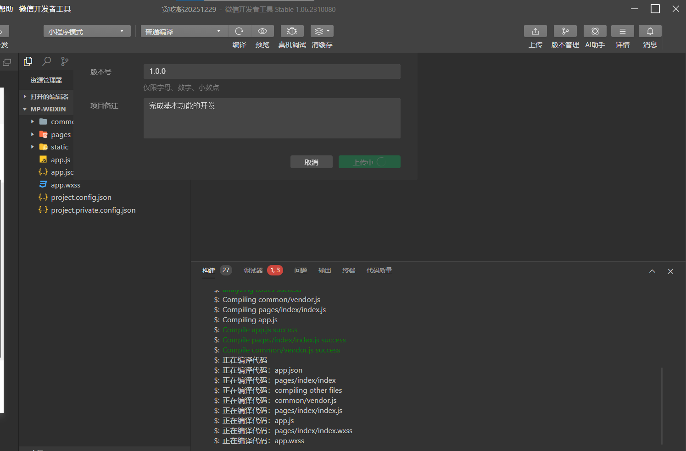

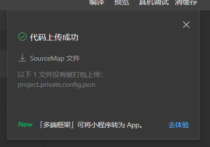

### 4.1.4 Установка загруженной версии как версии для опыта в бэкенде

Загрузка только отправляет код на сторону WeChat. Вам всё ещё нужно сообщить системе, что «это версия для опыта».

Финальный шаг: вернитесь в бэкенд Official Platform и завершите цикл.

1. Откройте `https://mp.weixin.qq.com` и войдите в бэкенд мини-программы.
2. В левом меню найдите «Management» (управление) -> «Version Management» (управление версиями).
3. В разделе «Development Version» (версия разработки) вы должны увидеть загруженную версию: версия `1.0.0`, ваша заметка и только что загруженная отметка времени.
4. С правой стороны этой строки используйте выпадающий список/кнопку действия, чтобы выбрать «Set as Experience Version» (установить как версию для опыта), подтвердите действие. Перед этим шагом убедитесь, что ваша основная категория настроена в настройках главной страницы/категорий.

   

   

После завершения эта версия становится «версией для опыта» вашей мини-программы. Вы можете сгенерировать QR-код версии для опыта в бэкенде или добавить себя/команду как участников опыта, затем отсканировать в WeChat для тестирования на реальных устройствах.

На этом этапе мы завершили кратчайший цикл от локального проекта до тестового запуска:

Вам не нужно сразу открывать доступ всем пользователям WeChat. В безопасных рамках сначала запустите реальную мини-программу в реальном окружении WeChat. Этого достаточно для тестирования функций, сбора обратной связи и итераций.

## 4.2 Формальный запуск мини-программы

После того как версия для опыта хорошо работает, вы уже можете играть в эту мини-программу «Змейка» в собственном WeChat.  
Следующий шаг — переход от ограниченных пользователей опыта к полностью публичной мини-программе WeChat.

Разобьём это на шаги: заполнить базовую информацию, выбрать категорию, завершить регистрацию (filing), затем отправить на проверку. Следуйте этому порядку:

### 4.2.1 Вход в процесс релиза мини-программы

Сначала вернитесь в бэкенд WeChat Official Platform и войдите.
В левой навигации найдите пункты, связанные с «Version Management / Release» (управление версиями / релиз) (UI может слегка меняться со временем). Вы найдёте «Mini Program Release Flow» (процесс релиза мини-программы).

После входа в верхней области отображается индикатор прогресса. Ниже перечислены такие шаги, как:

1. Информация о мини-программе
2. Категория мини-программы
3. Операционная информация / регистрация (filing)
4. Верификация WeChat (в зависимости от типа субъекта)

В начале прогресс 0%. По мере завершения каждого шага система обновляется автоматически.

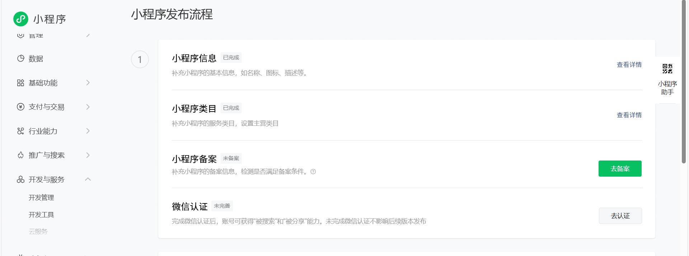

### 4.2.2 Заполнение базовой информации о мини-программе

Первый шаг — заполнить «визитную карточку» вашей мини-программы, то есть то, что пользователи видят первым в WeChat.

На странице «Информация о мини-программе» вам обычно нужно заполнить/подтвердить:

1. Имя мини-программы  
   Оно появляется в результатах поиска и заголовке приложения. У него есть ограничения по длине и правила именования. Выберите имя, которое описывает функцию и легко запоминается.
2. Описание / введение  
   Используйте одно-два предложения, чтобы объяснить, что делает эта мини-программа, например: «Игра «Змейка», разработанная с помощью AI-кодирования, подходит для быстрой казуальной игры.»  
   Держите описание согласованным с реальной функциональностью и избегайте преувеличенного маркетингового текста.
3. Иконка и скриншоты
   1. Иконка обычно требует квадратного изображения с поддержкой PNG/JPG и ограничениями по размеру/пикселям (проверьте правила на странице). Используйте простую, контрастную иконку.
   2. Загрузите несколько скриншотов, таких как главная страница, страница игры, страница настроек. Они помогают пользователям понять содержание.
4. Другие обязательные поля  
   Такие как теги и регион обслуживания, заполните согласно подсказкам.  
   Принцип только один: вся информация должна соответствовать реальной функциональности вашей мини-программы «Змейка».

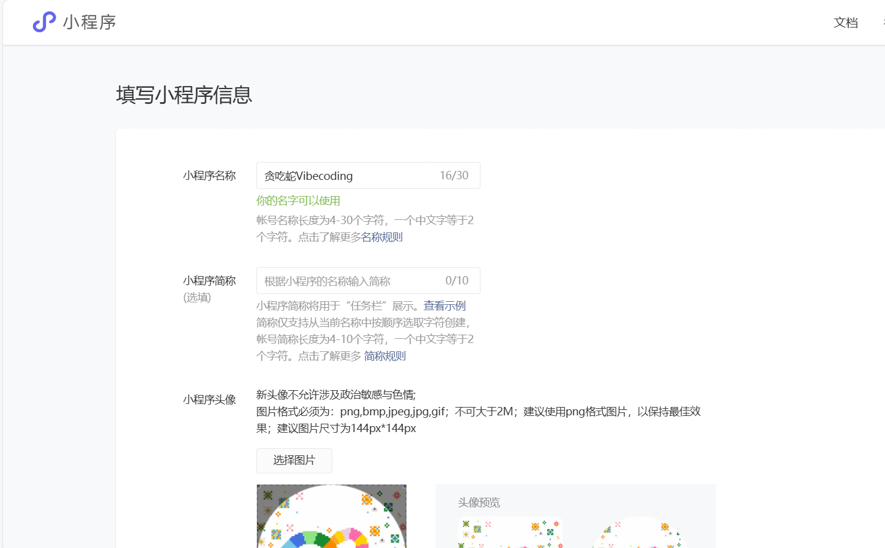

После заполнения всех полей нажмите «Сохранить» или «Далее». Первый шаг в процессе релиза завершён.

### 4.2.3 Выбор сервисной категории мини-программы

После базовой информации мастер направляет вас к «Категории мини-программы».  
Категория — это классификация вашего приложения в WeChat, она влияет на маршрут проверки и дальнейшее отображение/эксплуатацию.

На этой странице вы увидите «Add Category» (добавить категорию). Нажмите её и выберите подходящую категорию в системном дереве категорий, например:

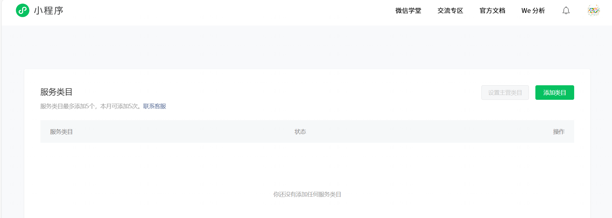

1. Выберите «Education» (образование) как категорию верхнего уровня;
2. Затем выберите более конкретную подкатегорию, такую как «Education Tools / Teaching Assistant» (инструменты для образования / учебный помощник). В этом примере инструменты для образования выбраны как учебное пособие для vibecoding.

В вашем собственном проекте просто выберите наиболее близкую категорию по реальному сценарию использования.

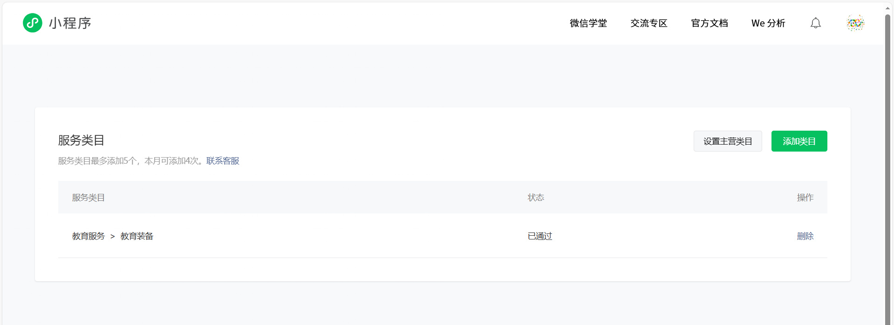

После подтверждения категории нажмите «Сохранить». Если страница показывает «категория успешно создана» и отображает ваш новый пункт, этот шаг завершён.

### 4.2.4 Завершение информации о регистрации (filing)

Далее процесс релиза запрашивает «Операционную информацию / регистрацию (filing)». Это верифицирует ответственный субъект, стоящий за мини-программой.

На примере субъекта-физического лица процесс обычно включает:

1. Выбрать тип регистрации  
   Выберите среди типов, таких как «Individual» (физическое лицо) или «Enterprise» (предприятие), в соответствии с вашим зарегистрированным субъектом.
2. Заполнить информацию о субъекте  
   Включая имя, тип документа, номер документа и т. д. Это должно совпадать с регистрационной информацией, иначе проверка может отклонить.
3. Загрузить подтверждающие документы  
   Обычно требуются фото документа, удостоверяющего личность, или другие подтверждающие файлы, с конкретными требованиями к формату/размеру/чёткости, показанными на странице. Подготовьте и загрузите чёткие файлы.
   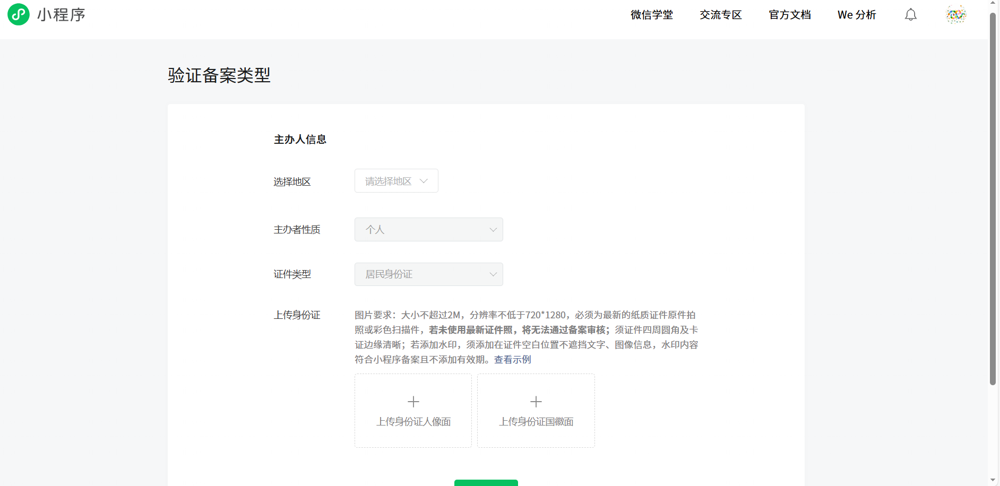

После отправки система переходит в состояние «на проверке» и показывает сообщение вроде «Информация отправлена, пожалуйста, подождите». Это может занять некоторое время. Вы можете проверить прогресс в любое время в бэкенде.

### 4.2.5 Отправка на проверку и ожидание формального релиза

Когда «Информация о мини-программе», «Категория» и «Операционная информация / регистрация» все завершены, выполните финальное действие: отправьте на проверку.

1. Вернитесь на обзорную страницу процесса релиза и убедитесь, что все пункты показывают «завершено», а прогресс близок к 100%.
2. Нажмите «Submit for Review» (отправить на проверку) (или аналогичную кнопку), чтобы отправить текущую версию разработки команде проверки WeChat.
3. В «Version Management» статус этой версии становится «Under Review» (на проверке). После одобрения он становится «Published» (опубликовано) или доступным для «Go Live» (запуск).

Если проверка регистрации (filing) не проходит, разработчики могут получить звонок с указанием частей, которые не прошли.

Для регистрации вы можете получить код верификации и ссылку верификации от Министерства промышленности и информационных технологий. Откройте ссылку и заполните код + личную информацию (верификация действительна 1 день). Если регистрация проходит, вы получаете email и SMS-уведомление с регистрационным номером.  
Верификация WeChat: физическое лицо обычно платит 30 CNY, предприятие — около 300 CNY. Плата не возвращается независимо от результата одобрения. Вы можете получить уведомление о верификации и подтверждающий звонок.

При отправке на проверку загрузите видео/экраны работы и заполните требуемую информацию. Затем нажмите «Submit Release» (отправить релиз) для формального запуска.

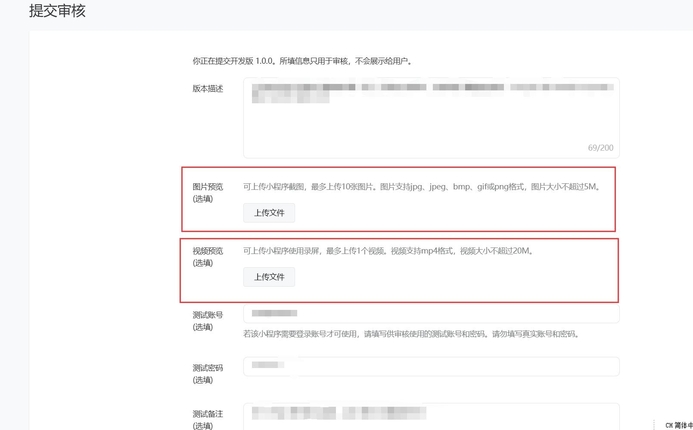

# 5. Итоги

На этом этапе вы завершили полный цикл разработки мини-программы **от 0 до 1**: от понимания мини-программ до установки Trae, HBuilderX и WeChat DevTools; от передачи AI вашей идеи и позволения ему «таскать кирпичи» в коде до игры в первую версию «Змейки» в симуляторе; затем упаковки как версии для опыта, завершения регистрации/проверки и превращения её в реально пригодную к использованию в WeChat — вы лично прошли всю цепочку один раз.

Что более важно, вы достигли этого не путём запоминания синтаксиса. Вы достигли этого путём чёткого выражения требований + эффективного общения с AI. Вы уже это прожили: **одна инструкция на естественном языке может позволить AI очень эффективно удовлетворить ваши потребности в разработке**. Эта способность не ограничивается «Змейкой». Её можно перенести на любую мини-программу, которую вы захотите создать позже — инструменты, страницы мероприятий, образовательные приложения или реальные рабочие проекты.

Если обобщить в **общий SOP**, это всего пять шагов:  
**Прояснить одно небольшое требование -> создать каркас проекта в Trae -> использовать vibecoding + AI для создания первой версии -> многократно тестировать в игре и улучшать в WeChat DevTools -> загрузить, зарегистрировать, проверить и запустить.**  
Каждый раз, повторяя эти пять шагов, вы получаете ещё одну реальную мини-программу, которую можно открыть и которой можно поделиться, и ещё один слой уверенности в том, что «я могу использовать AI, чтобы превращать идеи в продукты».

Далее вы можете продолжать шлифовать это приложение «Змейка» или закрыть его и начать пустой проект из собственной идеи. Что бы вы ни создавали, помните одно: вы больше не просто человек, который «хочет что-то создать». Вы уже vibecoding-разработчик, прошедший полный рабочий процесс. Остальное — повторение, пока эта способность не станет привычкой.

# Источники:

- https://zhuanlan.zhihu.com/p/1889401120939567074
- https://blog.csdn.net/2401_87407347/article/details/155193007
