# Как создать собственный персональный сайт и академический блог - статическое развёртывание с GitHub Pages

# 1. Что такое персональный сайт и академический блог?

В этом руководстве мы пройдём полный замкнутый цикл: **от поиска готового шаблона сайта, через его преобразование в персональную домашнюю страницу Илона Маска, до бесплатной публикации в интернете**.

Для этого руководства у вас как минимум должно быть:

* **Компьютер** (Windows или Mac)
* **Ваша учётная запись GitHub** (используется для хранения кода сайта и предоставления бесплатного хостинга)
* **Установленный Trae** (ваш ИИ-партнёр по программированию)
* **Окружение Git**
* **Окружение Ruby**

## 1.1 Что такое академическая персональная домашняя страница?

**Академическая персональная домашняя страница** - это ваша собственная частная территория в интернете.

В отличие от WeChat Moments, Zhihu или LinkedIn, она не зависит от алгоритма рекомендаций какой-либо платформы и не исчезнет, если платформа закроется. Это долгосрочное стабильное **пространство для самопрезентации**, которое может индексироваться Google и Google Scholar. Обычно оно содержит вашу биографию, публикации, проекты и технический блог.


## 1.2 Зачем создавать собственный сайт?

В модели разработки Vibe Coding нам больше не нужно прорабатывать толстые книги по HTML/CSS, как делали люди десять лет назад. С ИИ роль при создании сайта смещается от «измученного программиста» к «главному редактору сайта»:

1. **Вы (редактор / PM)**: определяете тон и содержание сайта. Например: «Размести здесь презентацию Маска о колонизации Марса» или «Сделай эту кнопку красной, как у Tesla».
2. **Trae (ИИ-инженер)**: берёт на себя сложную работу по реализации. Он превращает ваши инструкции на естественном языке в код, включая вёрстку, цветовые схемы и адаптацию под мобильные устройства.
3. **GitHub Pages (выставочный зал)**: предоставляет бесплатный сервер и домен, чтобы люди по всему миру могли увидеть вашу работу.

**Почему это стоит иметь академикам или техническим специалистам?**

* **Вовне (формирование влияния)**: это **«вечнозелёная визитка».** При подаче на PhD-программы, поиске работы или сотрудничества аккуратная персональная домашняя страница часто гораздо убедительнее, чем PDF-резюме.
* **Внутрь (накопление знаний)**: это ваш **«второй мозг».** Вы можете использовать её для записи конспектов курсов, технических размышлений и построения собственной системы знаний.
* **На будущее (быть находимым)**: поисковые системы любят структурированный контент. С домашней страницей, когда люди ищут ваше имя, **контент, который вы определили,** может появляться первым, а не посторонние люди с таким же именем.

## 1.3 Четыре типичных способа создания персонального сайта

На практике способов создать сайт бесчисленное множество. Здесь мы представим только четыре самых популярных:

**Способ 1: писать вручную с нуля на HTML / CSS / JS**
Это традиционный путь информатики. Вы пишете код символ за символом. Преимущество - предельная гибкость. Недостаток - очень высокий порог входа, и легко застрять, доводя CSS. Он не идеален для тех из нас, кто хочет сосредоточиться на содержании.


**Способ 2: визуальные конструкторы сайтов, такие как Wix / WordPress**
Это похоже на сборку из кубиков. Преимущество - простое редактирование перетаскиванием. Недостаток - часто требует оплаты, склонность генерировать раздутый код, отсутствие академически-гиковского духа и сложность глубокой кастомизации.


**Способ 3: шаблоны на базе GitHub (генераторы статических сайтов)**
Это **наиболее рекомендуемый** популярный путь в академических и гик-сообществах. Мы напрямую форкаем зрелый шаблон, написанный другими, например на основе Jekyll или Hugo, а затем меняем только файлы конфигурации и содержание.


**Способ 4: Vibe Coding (поток визуальной генерации с ИИ)**
С ИИ-агентами, обладающими сильным мультимодальным визуальным пониманием, вам достаточно увидеть в интернете понравившийся стиль сайта, сделать скриншот и сказать ИИ: «Напиши мне веб-страницу на основе этого стиля». ИИ затем может проанализировать визуальные элементы и сгенерировать для вас низкоуровневый код.


**Выбор в этом руководстве: GitHub Pages + академический шаблон + модификации с помощью ИИ.**
Причина проста:

* **Нулевая стоимость**: не нужно покупать сервер, не нужно покупать домен.
* **Высокое качество**: шаблоны часто разрабатываются топовыми разработчиками, с минималистичным стилем, профессиональной структурой и быстрой загрузкой.
* **Простота поддержки**: вы в основном пишете на Markdown, похоже на письмо в Feishu Docs или Notion, а ИИ помогает генерировать веб-страницу.

## 1.4 Полный маршрут этого руководства

Чтобы процесс настройки был нагляднее и менее скучным, мы используем забавный кейс: **создание академической домашней страницы для Маска**.

Хотя Илон Маск не университетский профессор, он опубликовал множество публичных «технических белых книг», таких как *Hyperloop Alpha*, а также имеет много знаменитых проектов, таких как SpaceX и Tesla. Мы будем использовать эти материалы как тестовые данные и вместе с рабочим процессом Vibe Coding в Trae пройдём по переиспользуемому маршруту создания сайта:

1. **Найти каркас**: найти качественный шаблон сайта на GitHub и сделать форк в собственный репозиторий.
2. **Подготовить окружение**: загрузить код локально и настроить Trae, чтобы ИИ мог читать ваш проект.
3. **Итерировать с ИИ**: заменить заглушку-человека из шаблона на Илона Маска, загрузить его резюме, превратить «список публикаций» в «витрину технических белых книг» и даже попросить ИИ перекрасить сайт в «марсианский красный».
4. **Развернуть онлайн**: отправить изменённый код обратно на GitHub и мгновенно получить доступный URL сайта.

Этот раздел отвечает только за рисование общей картины. Пока просто запомните основную линию:
**Форк шаблона -> ИИ-реновация -> публикация онлайн**
В следующих разделах мы пройдём каждый шаг вместе.

# 2. Подготовка окружения

## 2.1 Инструменты, используемые в этом руководстве

Весь процесс сборки использует четыре инструмента или ресурса, каждый из которых играет роль дизайнера, подрядчика, землевладельца или системы логистики.

* **Компьютер**: подойдёт Windows или Mac. В отличие от разработки под Android, которая часто предъявляет высокие требования к памяти, веб-разработка очень легковесна и плавно работает на обычном офисном ноутбуке.
* **Trae**: это ваш **ИИ-партнёр по программированию** и основной инструмент производительности. В режиме Vibe Coding вам не нужно владеть синтаксисом HTML или CSS. Вы в основном говорите ИИ на естественном языке, например «Сделай навигационную панель чёрной» или «Размести здесь фото Маска», и позволяете ему писать и изменять код за вас.
* **Учётная запись GitHub**: это ваш **бесплатный сервер и хранилище кода**. Она нужна нам для хранения всех файлов сайта. Самое главное, мы будем использовать **GitHub Pages**, чтобы бесплатно превратить код в URL, доступный по всему миру, что избавляет от необходимости покупать сервер или домен.
* **Окружение Git**: это закулисный **курьер**. Хотя мы пишем код локально в Trae, именно Git отправляет код с вашего компьютера на GitHub. Вам не нужно владеть командами Git, и Trae может помочь их вызвать, но Git сначала должен быть установлен.
* **Окружение Ruby**: это локальная **мастерская веб-страниц**. Поскольку академический шаблон в этом руководстве использует Jekyll, который работает на Ruby, нам нужен Ruby локально, чтобы мы могли предпросматривать сайт на собственном компьютере перед публикацией онлайн.

## 2.2 Загрузка Trae

**Trae** - это наше главное поле боя для Vibe Coding. Вы можете рассматривать его как **редактор кода со встроенным супер-ИИ**. В отличие от традиционных холодных редакторов, он словно опытный программист, сидящий рядом с вами и всегда готовый помочь.

* **Адрес для загрузки**: посетите официальный сайт [https://www.trae.cn](https://www.trae.cn) и загрузите версию для вашей операционной системы, Windows или Mac.
* **Установка**: установка очень проста, как установка WeChat или QQ. Дважды щёлкните установочный пакет и нажимайте «Далее», пока установка не завершится.

После подготовки этого инструмента в следующих практических шагах нам не придётся вглядываться в скучные панели кода. Мы будем напрямую открывать проект здесь и использовать панель чата справа, чтобы говорить ИИ на естественном языке, на китайском, если хотите, помочь нам писать код, исправлять баги и даже рефакторить целые страницы.


## 2.3 Загрузка Git

**Что такое Git?**
Если Trae - это ИИ-инженер, отвечающий за написание кода в Vibe Coding, то **Git - это курьер, отвечающий за транспортировку кода**. Он нужен вам, чтобы упаковать код, написанный на вашем компьютере, и безопасно отправить его на GitHub, ваш облачный репозиторий. Без него ваш сайт работает только на вашей собственной машине, и никто другой не сможет его увидеть.

Раньше нужно было зайти на официальный сайт, скачать установщик и вручную настроить переменные окружения. Это было утомительно. Теперь мы можем просто попросить Trae помочь обнаружить и установить его.

**Шаг 1: проверьте, установлен ли уже Git**

Откройте Trae и введите следующую инструкцию в панель чата в правом нижнем углу:

```markdown
Please help me check whether Git is already installed on this computer. Please run the `git --version` command in the terminal.
```

* **Случай A (уже установлен)**: если вы видите что-то вроде `git version 2.xx.x`, поздравляем. Вы можете напрямую пропустить шаг установки.
* **Случай B (не установлен)**: если вы видите «command not found» или группу красных сообщений об ошибках, продолжайте ниже.

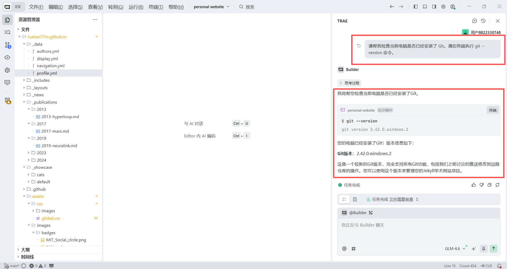

**Шаг 2: установка с помощью ИИ**

Не закрывайте Trae. Продолжайте печатать в панели чата:

**Инструкция (для пользователей Windows):**

```markdown
I have not installed Git. Please write the command that uses the `winget` command-line tool to install Git automatically, and tell me how to run it in the terminal.
```

**Инструкция (для пользователей Mac):**

```markdown
I have not installed Git. Please tell me how to quickly install Git through terminal commands, for example using `git` or `brew`.
```

Trae выдаст вам команду, часто что-то вроде `winget install --id Git.Git`.

Вам нужно лишь нажать кнопку **Run in Terminal** в блоке кода или скопировать её в терминал внизу и нажать Enter. Это автоматически загрузит и установит Git за вас.

Если вы всё же чувствуете, что процесс с помощью ИИ недостаточно совершенен, вы можете обратиться к этому руководству для ручной загрузки и установки:
[Руководство по загрузке и установке Git](https://blog.csdn.net/weixin_41293671/article/details/144255269?ops_request_misc=elastic_search_misc&request_id=63236900b52320a7beb177787ba97f07&biz_id=0&utm_medium=distribute.pc_search_result.none-task-blog-2~all~baidu_landing_v2~default-5-144255269-null-null.142^v102^pc_search_result_base4&utm_term=git%E4%B8%8B%E8%BD%BD%E5%AE%89%E8%A3%85&spm=1018.2226.3001.4187)

## 2.4 Установка окружения Ruby

Прежде чем мы официально начнём писать код, нам нужен ещё один последний кусочек пазла. Шаблон академической домашней страницы, используемый в этом руководстве, собран на Jekyll, который сам основан на языке программирования Ruby.

Чтобы предпросматривать и отлаживать «эффект реновации» на собственном компьютере, прежде чем отправлять код на GitHub на всеобщее обозрение, мы должны установить окружение Ruby на компьютер. Считайте это наймом переводчика на вашем компьютере, который понимает Ruby. Не волнуйтесь, вам не нужно учиться писать на Ruby. Вам нужно лишь установить его, а остальное Trae сделает сам.

### 2.4.1 Установка на Windows

**Шаг 1: загрузите установщик с помощью отечественного зеркала**

Для пользователей Windows официальный сайт https://rubyinstaller.org/downloads/ предоставляет установщики в один клик, но из-за сетевых различий полезно знать одну хитрость. Официальная рекомендация для новичков обычно - **`Ruby+Devkit 3.X.X (x64)`**, потому что он включает необходимую цепочку инструментов.

**Напоминание для новичков**: на практике прямая загрузка с официального сайта может быть медленной или неудачной. Мы настоятельно рекомендуем использовать отечественное зеркало [RubyInstaller for Windows - китайское зеркало](https://rubyinstaller.cn/), которое обычно намного быстрее.


**Шаг 2: запустите установку**

Дважды щёлкните скачанный установщик. В мастере установки обязательно отметьте **«Add Ruby executables to your PATH».** Это самый важный шаг. Иначе компьютер не сможет «найти» только что установленный интерпретатор.

После того как вы это отметили, продолжайте нажимать **Next**, чтобы завершить установку.


**Шаг 3: настройте набор инструментов разработки**

Когда прогресс установки завершится, автоматически откроется чёрное окно командной строки. Не паникуйте. Введите цифру `3` там, где мигает курсор, что означает установку базового окружения MSYS2 и цепочки инструментов MINGW, затем нажмите Enter. Дождитесь, пока команды закончат выполняться и окно закроется автоматически.

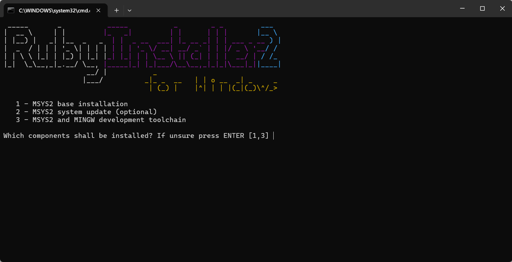

**Шаг 4: проверьте результат**

Теперь самое время попросить ИИ проверить вашу домашнюю работу. Откройте Trae и введите следующую инструкцию на естественном языке в чат справа:

```markdown
Please help me check whether the Ruby environment has been installed correctly on this computer. Please run the `ruby -v` command in the terminal at the bottom and tell me the result.
```

Если Trae ответит чем-то вроде `ruby 3.x.x`, значит, ваше окружение Ruby для Windows полностью настроено.


### 2.4.2 Установка на Mac

Настройка окружения на Mac кажется более «гиковской», потому что обычно требует команд в терминале. Но в режиме Vibe Coding нам даже не нужно вручную открывать терминал. Мы можем просто позволить Trae выступить нашим персональным IT-оператором.

**Шаг 1: дайте инструкцию по одноразовой настройке окружения**

Откройте Trae и вставьте следующую инструкцию на естественном языке в чат справа. Мы попросим его взять на себя проверку Homebrew, установку при отсутствии, а затем установку Ruby:

```markdown
I am using a Mac computer and need to configure a Ruby development environment. Please help me complete the following steps:
1. Check whether Homebrew is already installed. If not, please run Homebrew's official installation script in the terminal.
2. After confirming Homebrew is ready, run `brew install ruby` in the terminal.
3. When everything is done, run `ruby -v` to confirm the installation succeeded.
Please guide me step by step, and when necessary provide terminal commands that I can click and run directly.
```

После получения инструкции Trae начнёт работать и покажет в панели чата блоки кода с кнопками запуска.

**Важное замечание для новичков**

При установке Homebrew терминал часто выводит что-то вроде `Password:` и запрашивает пароль входа в ваш Mac.

**Примечание:** когда вы вводите пароль в терминале Mac, экран не будет показывать никакие символы или звёздочки. Это нормально. Просто вводите пароль вслепую и нажмите Enter.

**Шаг 2: проверьте результат**

После установки вернитесь в Trae и введите:

```markdown
I just installed Ruby on this Mac through `brew`. Please help me run the `ruby -v` command in the terminal and check whether the installation and environment variables are correct.
```

Когда вы увидите в терминале что-то вроде `ruby 3.x.x`, локальная мастерская веб-страниц готова, а ваш Mac подготовлен к Vibe Coding.

## 2.5 Регистрация учётной записи GitHub

**Что такое GitHub?**
Если Git - это курьер, то **GitHub - это облачный склад и выставочный зал**. Он не только бесплатно хостит ваш код, но, что важнее, с помощью **GitHub Pages** может превратить ваш код в URL сайта, доступный по всему миру. Это также крупнейшая в мире платформа хостинга кода, и наличие учётной записи GitHub - это своего рода паспорт в технический мир.

**Шаги регистрации:**

1. **Посетите официальный сайт**: откройте [https://github.com/](https://github.com/).
2. **Нажмите Sign up**: нажмите **«Sign up»** в правом верхнем углу.

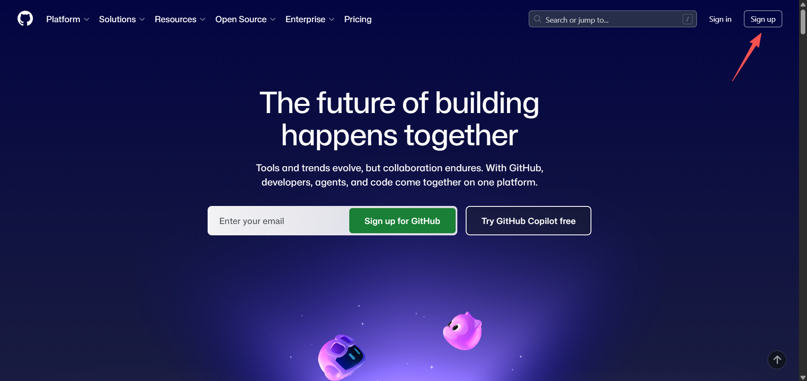

3. **Заполните свою информацию**
4. **Email**: введите реальный адрес электронной почты.
5. **Password**: выберите надёжный пароль.
6. **Username (важно!)**: **выбирайте внимательно**. Позже URL вашей домашней страницы станет **`https://your-username.github.io`**. Лучше всего использовать ваше английское имя, пиньинь, привычный ID или простую комбинацию букв и цифр. **Не** выбирайте что-то вроде `a1b2c3d4`, иначе ссылку на ваш сайт будет трудно запомнить.
7. **Верификация и активация**: пройдите проверку «вы не робот», часто это вращающиеся картинки или выбор спиральных галактик, затем проверьте почту на код подтверждения.


После завершения регистрации у вас есть собственный участок в интернете. В следующем разделе мы начнём строить на этом участке.

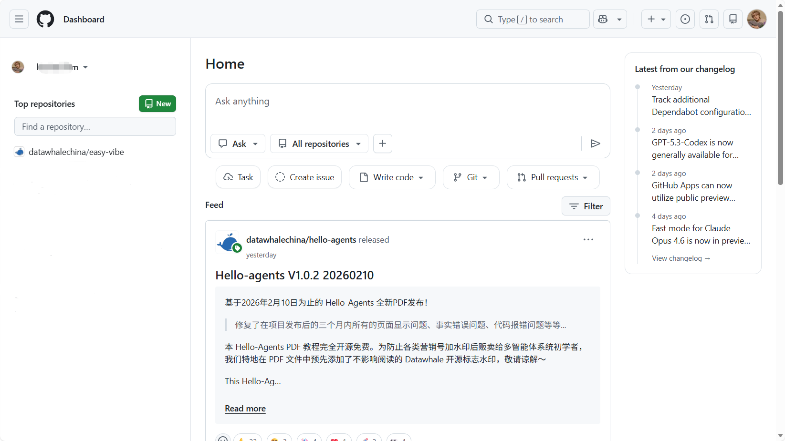

# 3. От шаблона к вашей первой доступной странице

Всё готово. В первых двух главах мы подготовили инструменты. В этой главе мы официально застолбим землю в интернете. Задача этой главы проста:
**Пока не беспокойтесь об оформлении или содержании. Сначала постройте каркас сайта и получите рабочую ссылку доступа.**

Мы напрямую форкнем зрелый академический шаблон и используем автоматизацию GitHub Pages, чтобы запустить его в течение двадцати минут. По завершении у вас будет ссылка, доступная по всему миру.

## 3.1 Получите шаблон сайта

В режиме Vibe Coding нам не нужно писать HTML с нуля. На GitHub тысячи отличных open-source шаблонов. Нам нужно лишь «одолжить» один и сменить имя на собственное.

**Шаг 1: найдите шаблон**

Здесь мы выбрали классический шаблон с понятной структурой и хорошей пригодностью для академической презентации:
https://github.com/luost26/academic-homepage?tab=readme-ov-file
Этот шаблон основан на фреймворке Jekyll.

Конечно, вы также можете поискать **`academic-homepage`** на GitHub и выбрать другой понравившийся стиль, но чтобы следовать этому руководству, рекомендуется сначала использовать шаблон выше.

Мы также подготовили для вас несколько дополнительных рекомендаций шаблонов:

* Тема персональной домашней страницы Minimal Light: https://github.com/yaoyao-liu/minimal-light?
* Minimal Mistakes: [https://github.com/mmistakes/minimal-mistakes](https://github.com/mmistakes/minimal-mistakes?utm_source=chatgpt.com)
* Pixyll: https://github.com/johno/pixyll
* Hydejack: https://github.com/hydecorp/hydejack
* Forty Jekyll Theme: https://github.com/andrewbanchich/forty-jekyll-theme
* Leonids: https://github://github.com/renyuanz/leonids
* YAT: https://github.com/jeffreytse/jekyll-theme-yat

**Шаг 2: форкните проект**

Зайдите на главную страницу целевого репозитория и нажмите кнопку **Fork** в правом верхнем углу. Появится окно подтверждения. Нажмите **Create Fork** напрямую.

* Пояснение: этот шаг равнозначен копированию чужого репозитория кода с полным набором ключей в вашу собственную учётную запись GitHub. Теперь вы владеете своей копией сайта.

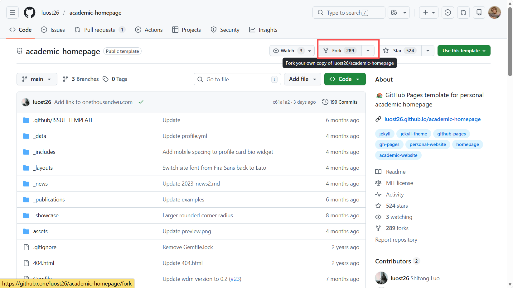

**Шаг 3: переименуйте репозиторий, самый важный шаг**

Измените имя репозитория на:
`your-username.github.io`

**Важное замечание для новичков**:
Это жёсткое правило GitHub Pages.
Например, если ваше имя пользователя GitHub - `musk-fan`, то имя репозитория **должно** быть `musk-fan.github.io`.
Только так GitHub автоматически назначит вам бесплатный домен. Если имя неверное, веб-страница позже не откроется.


## 3.2 Получите URL проекта GitHub

После переименования нам нужна квитанция на получение репозитория.

1. Вернитесь на главную страницу репозитория, на вкладку **Code**.
2. Нажмите зелёную кнопку **Code**.
3. Убедитесь, что выбрана вкладка **HTTPS**.
4. Нажмите кнопку копирования и скопируйте URL, оканчивающийся на `.git`, например `https://github.com/musk-fan/musk-fan.github.io.git`.


## 3.3 Загрузите проект локально

Раньше программистам приходилось набирать сложные команды Git в чёрном терминале, чтобы скачать код. В эпоху Vibe Coding у нас есть Trae. Нам нужно лишь сказать ИИ: «Я хочу вот это, помоги мне его загрузить».

**Шаг 1: подготовка**

Создайте на компьютере новую папку, например `MyWebsite`, затем щёлкните правой кнопкой и выберите **Open with Trae**, или сначала откройте Trae и выберите **Open Folder**.


**Шаг 2: дайте команду клонирования**

После того как Trae откроется, вызовите панель чата ИИ справа и введите следующую инструкцию на естественном языке:

```text
Please help me clone the remote GitHub repository into the current folder.
Repository address: paste the URL you just copied, for example https://github.com/musk-fan/musk-fan.github.io.git
Execution requirement: please run the `git clone` command directly in the terminal.
```

**Шаг 3: подтвердите загрузку**

Trae автоматически вызовет терминал внизу и выполнит команду. Подождите несколько секунд. Когда вы увидите, что в дереве файлов слева появились такие файлы, как `_config.yml` и `index.html`, проект успешно перемещён на ваш компьютер.


## 3.4 Предпросмотр веб-страницы локально

Код на вашей машине, и окружение Ruby готово. Прежде чем менять сайт, мы должны сначала осмотреть его локально на собственном компьютере. Это как ремонт дома: сначала вы всё расставляете в выставочном зале, убеждаетесь, что выглядит правильно, и только потом открываете его публично.

Благодаря окружению Ruby, установленному в **Разделе 2.4**, теперь это очень просто.

**Шаг 1: установите зависимости**

Сайт на Jekyll для работы зависит от многих Gem. Это как купить всю мебель из списка покупок. **Однако** из-за сетевых условий прямые загрузки могут зависать. Мы попросим Trae **переключиться на отечественное зеркало** и установить зависимости оттуда.

В чат-боксе Trae введите:

```markdown
I need to install the Jekyll dependencies. Considering the network environment, please first change the `source` in the Gemfile to the domestic mirror `https://gems.ruby-china.com/`. After that, please run the `bundle install` command in the terminal to install all dependencies.
```

**Шаг 2: запустите локальный сервис**

Теперь мы запустим **локальный сервер**, чтобы смоделировать работу сайта. Продолжайте и скажите Trae:

```markdown
The dependencies have finished installing. Please help me start the Jekyll local preview service in the terminal. Please run the `bundle exec jekyll serve` command.
```

После того как терминал поработает несколько секунд, вы увидите что-то похожее на:
`Server address: http://127.0.0.1:4000/academic-homepage/`

1. **Откройте браузер**: щёлкните по этой ссылке или введите её прямо в браузере:
   `http://127.0.0.1:4000/academic-homepage/`
2. **Увидьте магию**: теперь ваш сайт уже работает в браузере. Хотя на нём всё ещё отображается имя оригинального автора шаблона, он уже работает локально на вашем компьютере.

С этого момента, всякий раз, когда вы меняете содержание и нажимаете `Ctrl+S`, а затем обновляете браузер, **содержание веб-страницы будет меняться вместе с этим**.

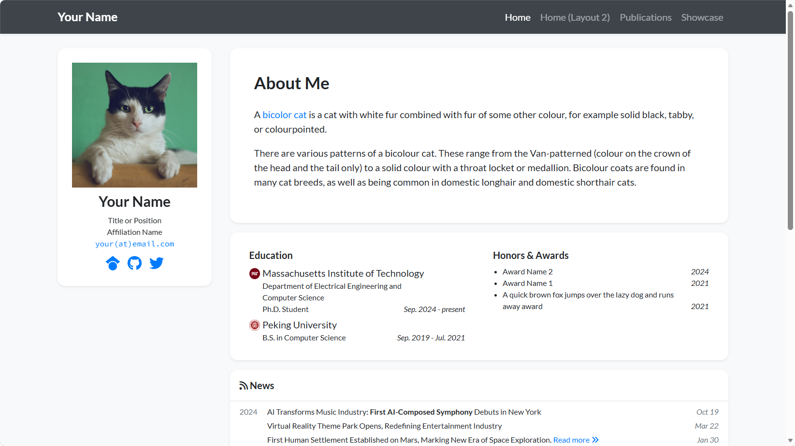

Как только локальный предпросмотр заработает, мы можем перейти к следующей главе и начать превращать сайт во что-то, похожее на Илона Маска.

# 4. Модификация содержания с помощью ИИ

Чтобы помочь всем быстро прочувствовать весь процесс, мы не будем использовать собственную персональную информацию, чтобы избежать тревоги о приватности. Вместо этого мы используем **Илона Маска в качестве примера** и построим для него академическую домашнюю страницу. Это позволяет нам сбросить скучное давление написания личного резюме и сосредоточиться на удовольствии от Vibe Coding для сайтов. Это также позволяет нам увидеть, как круто разместить «технические белые книги» силиконового железного человека, такие как *Hyperloop Alpha*, на сайте в академическом стиле.

Мы пройдём полный цикл от **получения шаблона** до **публикации сайта** и вручную построим персональное пространство для самопрезентации мирового уровня.

Следуйте за моим ритмом и отправьте ИИ первую инструкцию.

## 4.1 Единые глобальные ограничения

Это **глобальный промпт настройки**. Вам нужно отправить его лишь один раз.
Его цель - задать правила для ИИ, чтобы он не импровизировал и не ломал структуру сайта. Скопируйте его прямо в Trae:

```text
You are now the maintainer of a “GitHub Pages + Jekyll academic homepage template” site.
The current repository is a Jekyll-powered academic homepage (including `_config.yml`, `_data`, `_layouts`, etc.).
Your modifications must follow these principles:
1. Each step should only solve the current stage goal. Do not do later-stage content in advance.
2. Do not modify the site structure, do not introduce new plugins, and do not change the theme style.
3. All content must be renderable by Jekyll without errors.
4. All identity information must follow an “academic-style simulation” tone and must not use first-person voice.
5. Do not invent obviously fake IEEE / Nature papers.
6. If information is uncertain, use “publicly well-known facts” or “reasonable academic simulation labeling.”
```

## 4.2 Постройте домашнюю страницу Маска, часть с содержанием

### 4.2.1 Первая глобальная инструкция: замените личность

Первое, что нам нужно решить, - это «Кто я?». Шаблон заполнен информацией оригинального автора, и нам нужно заменить её с помощью ИИ за один раз.

**Шаг 1: подготовьте ресурсы**

Поместите предоставленные мной изображения, `University_of_Pennsylvania.jpg` и `Queen_University.jpg`, в соответствующую папку проекта, обычно `/assets/images/badges/`.


**Шаг 2: отправьте инструкцию**

В чат-боксе Trae справа введите следующий промпт. Обратите внимание, что нам не нужно вручную искать и редактировать строки. Мы просто говорим ИИ, чего хотим:

```text
1. Goal: replace the “person identity” of the current academic homepage with Elon Musk. Only modify the basic profile information.
2. Specific requirements:
1. Name: Elon Musk
2. Professional identity:
    Technology Entrepreneur
    Engineer
    Founder & CEO of SpaceX
    CEO of Tesla, Inc.
3. Education:
    Queen’s University (Physics and Economics, not completed) (image path: /assets/images/badges/Queen_University.jpg)
    University of Pennsylvania (B.S. in Physics, B.A. in Economics) (image path: /assets/images/badges/University_of_Pennsylvania.jpg)
4. Research Interests (can be simulated as):
    Space Systems Engineering
    Sustainable Energy Systems
    Artificial Intelligence & Robotics
    Large-scale Technological Innovation
5. Honors & Recognition:
    Time Person of the Year (2021)
    Fellow of the Royal Society (FRS)
    Listed in Forbes Billionaires (multiple years)
6. Constraints:
    Do not add papers / publications
    Do not invent IEEE, Nature, or Science papers
    Use academic-style wording and avoid commercial promotional tone
    Keep the original field structure unchanged and only replace the content
```

На этом этапе вы можете увидеть, что Trae выполнил все наши требования по модификации.


**Шаг 3: обновите локальный браузер**

Обновите теперь локальный браузер, и вы должны увидеть, что всё заменено правильно.


### 4.2.2 Итеративное улучшение: добавьте «публикации» и проекты

Поскольку Илон Маск не традиционный университетский профессор, он редко публикует статьи в *Nature* или *Science*. Но как «главный инженер», он выпустил множество высокотехнологичных **белых книг** и **генеральных планов**.

В контексте академической домашней страницы мы можем переопределить смысл «Publications» как **«Технические белые книги и визионерские планы».** В этом нет ничего неловкого. На самом деле это очень хорошо соответствует его идентичности строителя.


**Шаг 1: подготовьте ресурсы**

Скачайте предоставленные мной обложки, а именно `Hyperloop_Alpha_sketch.jpg`, `SpaceX_Starship.jpg` и `Neuralink_sewing_machine_robot.jpg`, поместите их в `/assets/images/covers/` и удалите примеры изображений, изначально находившиеся в этой папке.


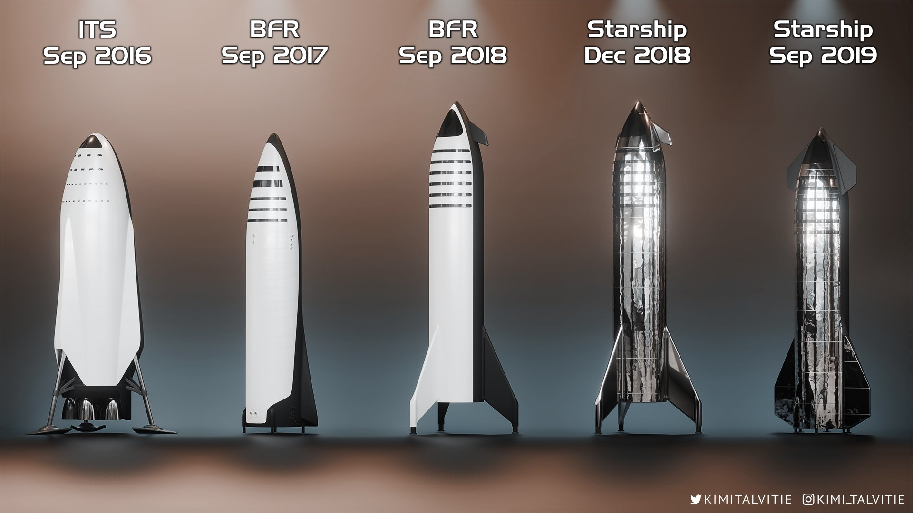


**Шаг 2: отправьте инструкцию**

Отправьте следующий промпт в Trae и позвольте ему помочь нам перестроить структуру данных:

```text
1. Role setting: you are a static site development expert who is proficient in Jekyll and Liquid syntax.
2. Task goal:
Modify the section title on the homepage or in the navigation bar.
The current file structure is organized by year subfolders, for example `_publications/2023/xxx.md`.
Create three new Markdown files in the specified format to display Elon Musk's technical white papers and visionary plans.
3. Specific steps and requirements:
1. Modify the section title
    Please search globally for the string "Selected Publications" (it may appear in `index.html`, `_config.yml`, or `_pages/publications.md`).
    Replace it with: "Technical White Papers & Visionary Plans".
2. Rebuild the publication data (critical step)
    Clear all old content under the `_publications` folder, including old year folders such as 2023 and 2024.
    Create three new folders: `_publications/2013/`, `_publications/2017/`, and `_publications/2019/`.
    In those folders, create the following three Markdown files.
3. Strictly follow this file format
Important: you must strictly follow the YAML Front Matter format below, and must not invent new field names:
    - title:          "paper title"
    - date:           YYYY-MM-DD HH:MM:SS +0800
    - selected:       true
    - pub:            "venue / journal name"
    - pub_date:       "year"
    - abstract: >-    abstract content...
    - cover:          /assets/images/covers/cover_name.jpg
    - authors:        - Author1- Author2
    - links:Paper:    https://paper-link
4. Please generate the full code for the following three files (including the path descriptions):
(1) Path: `_publications/2013/2013-hyperloop.md`
    Title: Hyperloop Alpha
    Date: 2013-08-12
    Pub: Tesla Blog (Open Source)
    Pub_date: "2013"
    Abstract: A proposal for a fifth mode of transport, utilizing a low-pressure tube and air bearings to achieve subsonic speeds.
    cover: /assets/images/covers/Hyperloop_Alpha_sketch.jpg
    Authors: Elon Musk, SpaceX & Tesla Teams
    Link: https://www.tesla.com/sites/default/files/blog_images/hyperloop-alpha.pdf
(2) Path: `_publications/2017/2017-mars.md`
    Title: Making Humans a Multi-Planetary Species
    Date: 2017-06-01
    Pub: New Space
    Pub_date: "2017"
    Abstract: Detailed architecture of the Starship system designed to colonize Mars. This paper outlines the technical challenges to establish a self-sustaining city.
    cover: /assets/images/covers/SpaceX_Starship.jpg
    Authors: Elon Musk
    Link: https://www.liebertpub.com/doi/10.1089/space.2017.29009.emu
(3) Path: `_publications/2019/2019-neuralink.md`
    Title: An Integrated Brain-Machine Interface Platform
    Date: 2019-10-16
    Pub: Journal of Medical Internet Research
    Pub_date: "2019"
    Abstract: We have built arrays of small and flexible electrode threads, with as many as 3,072 electrodes per array, and a neurosurgical robot.
    cover: /assets/images/covers/Neuralink_sewing_machine_robot.jpg
    Authors: Elon Musk, Neuralink
    Link: https://www.jmir.org/2019/10/e16194/
Execution requirement:
Please directly provide the complete content of these three files, and also provide the modification code for the file where you changed the title.
```

**Шаг 3: обновите локальный браузер**

Когда сборка завершится, вы обнаружите, что изначально скучный список публикаций превратился в футуристическую витрину высоких технологий.

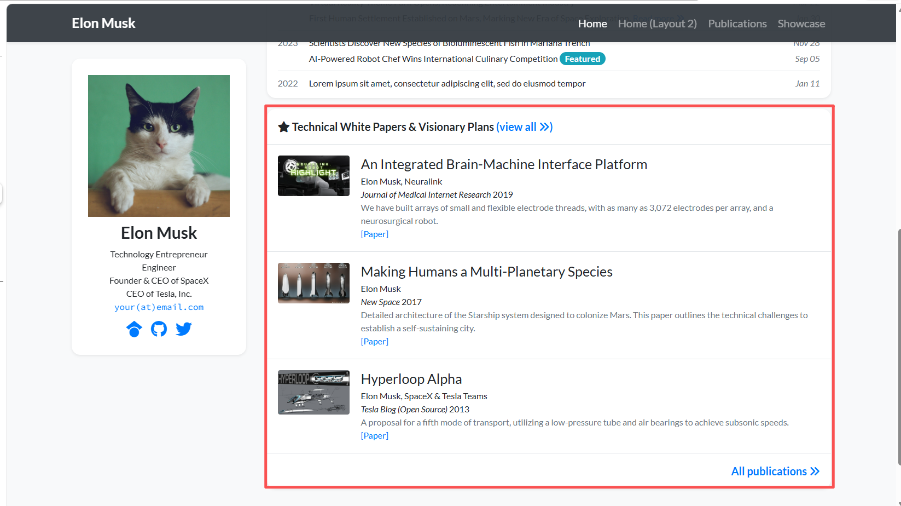

### 4.2.3 Финальная полировка: социальные ссылки и аватар

Это ключевой шаг для перехода от оценки 90 к оценке 100. На боковой панели всё ещё могут оставаться оригинальная ссылка на GitHub из шаблона или неверный email. Нам нужно направить их на реальные социальные аккаунты Маска, в основном X.com.

**Шаг 1: подготовка**

Найдите в Google красивое фото Маска, сохраните его как `portrait.png` или перетащите в папку `images/photo` в Trae, заменив оригинальное изображение.

**Шаг 2: скопируйте следующий промпт в Trae**

```text
1. Role setting: you are a detail-oriented Jekyll website development expert.
2. Task goal: complete the final update of the website sidebar and personal information configuration. We need to update the author's avatar, intro, and social links to Elon Musk's real information.
Please first scan the project structure and find the configuration file that controls the author information.
3. Please make the following modifications:
1. Avatar path fix
    I have already uploaded a new image named `portrait.png` into the `images/` or `assets/images/` folder.
    Please modify the avatar path in the configuration file to point to this image, and ensure the relative path is correct, for example `/images/portrait.png`.
2. Social link cleanup
    Please update or remove the social icon links in the sidebar:
    Email: change it to `elon@spacex.com`, or if the field allows, comment it out or remove it to avoid harassment.
    Twitter / X: change it to `https://x.com/elonmusk` (this is the core link).
    GitHub: change it to `https://github.com/tesla` to point to the Tesla open-source repository, or remove it directly.
    Google Scholar: must be removed, because he does not maintain it.
    LinkedIn / ResearchGate: if they exist, remove them all.
Output requirement:
Please directly provide the complete modified configuration code snippet.
```

**Шаг 3: обновите локальный браузер**

1. Посмотрите на боковую панель. Использует ли она теперь то красивое фото? Переводит ли клик по иконке Twitter на X.com?

На этом этапе локально у вас уже есть полная, профессиональная и отчётливо в стиле Маска персональная академическая домашняя страница.

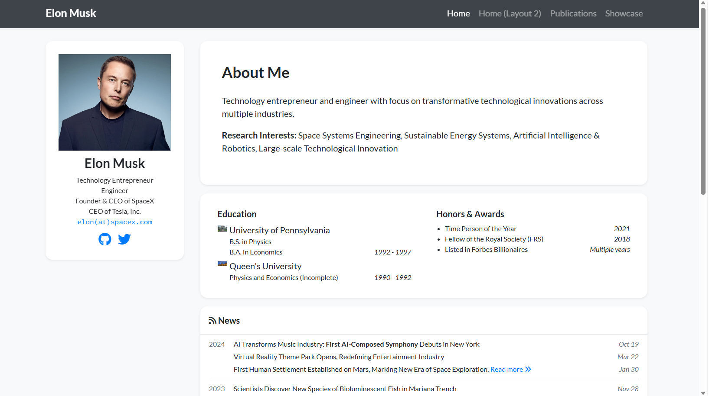

## 4.3 Вдохните душу через кастомизацию UI, часть со стилем

Сейчас содержание правильное, но страница всё ещё выглядит как распечатанное резюме. Ей не хватает ощущения технологичности. В режиме Vibe Coding нам не нужно понимать CSS. Нам нужно лишь описать ИИ **ощущение**, которое мы хотим.

**Пример сценария**:
Если вы считаете, что серый фон слишком унылый, и хотите сменить его на **марсианский красный**, просто спросите Trae:
*«Я хочу сменить цвет фона боковой панели на тёмно-красный (#8B0000), чтобы отразить ощущение Марса. Какой файл CSS или SCSS мне следует изменить? Пожалуйста, дай мне код напрямую».*


Если вам нравится стиль **SpaceX Dashboard** на примере изображения выше, вы можете напрямую скопировать следующий промпт дизайнерского уровня:

```text
1. Role setting: you are a top UI designer who admires “Swiss internationalist style” and is good at interfaces like Notion, Linear, or Apple.
2. Task goal: please completely rewrite the CSS / SCSS to create a “SpaceX Dashboard” style minimalist academic homepage. The core keywords are: transparent, restrained, precise.
3. Please apply the following concrete style overrides:
1. Global typography
    Font: abandon the original serif font. Force the whole site to use the system-level sans-serif stack:
    'Inter', -apple-system, BlinkMacSystemFont, 'Segoe UI', Roboto, Helvetica, Arial, sans-serif.
    Line height: increase breathing room in the body text with `line-height: 1.75`.
    Colors:
        Main title: #111111
        Body text: #333333
        Secondary information such as dates or citations: #666666
2. Clean header
    Background: remove the previous black background and use pure white (#FFFFFF), or translucent white with blur if supported, for example `rgba(255, 255, 255, 0.9)` plus `backdrop-filter: blur(10px)`.
    Border: keep only a very thin bottom border, `border-bottom: 1px solid #EAEAEA`.
    Text: navigation links should use dark gray #333333, and only become black and bold on hover.
3. Remove cards and return to content
    Remove the background and shadow of the left sidebar and the About me cards (`box-shadow: none`, `background: transparent`).
    Great minimalism lets the text float directly on the page background.
    Increase spacing: significantly increase `margin-bottom`, for example 80px, between sections and use whitespace instead of borders to separate content.
4. Restrained use of brand color
    Use Tesla Red (#E82127) only on links and important buttons.
    Link style: remove underline and only change color. On hover, add a light red background block such as `background: rgba(232, 33, 39, 0.05)`.
5. Avatar tuning
    Keep it circular with `border-radius: 50%`.
    Remove the border.
    Keep only a very light shadow, such as `box-shadow: 0 10px 30px rgba(0,0,0,0.08)`.
Execution requirement:
Please analyze the `_sass` or CSS files. Do not patch the old code. Instead, directly provide the code that resets and overrides the styles above.
```

## 4.4 Замените на собственную информацию, часть с кастомизацией

Поздравляем. Пройдя описанный выше поток с домашней страницей Маска, вы уже освоили основной образ мышления Vibe Coding для создания сайтов. Превратить эту демонстрационную комнату в собственный дом теперь на самом деле легко.

Вам не нужно начинать заново. Вам нужно лишь повторить описанные выше шаги, но с чуть более гибкой стратегией:

**Шаг 1: физическая замена, аватар и базовая информация**

Это самый простой шаг:

1. **Смените фото**: в файловой панели в левой части Trae найдите `assets/images/` и перетащите туда свой собственный портрет, заменив `portrait.png`.
2. **Смените имя**: скажите Trae: «Замени все упоминания Elon Musk по всему сайту на [ваше имя]».

**Шаг 2: предобработка ИИ, пусть ChatGPT / Gemini помогут организовать содержание**

Trae хорош в написании кода, но если вы напрямую бросите ему беспорядочное PDF-резюме, он может запутаться.

**Поэтому более эффективный подход таков**:
сначала используйте ИИ, который силён в обработке длинного текста, такой как ChatGPT, Gemini или Kimi, чтобы помочь вам **чисто отформатировать** резюме.

Вы можете отправить ChatGPT промпт вроде этого:

```text
Role setting: you are a professional academic website content planner.
Task goal:
I will send you my personal resume / CV. Please help me extract key information from it and organize it into a clear Markdown structure suitable for filling directly into a static website.
Please strictly organize and refine it into the following five modules. If some content does not exist, leave it blank.
1. Profile
Name: my full name.
Tagline: a one-line professional tag, for example “CS Student @ XX Univ | AI Enthusiast”.
Bio: a 50 to 100 word third-person introduction summarizing my background and core skills, in a professional academic tone.
Socials: extract email, GitHub, LinkedIn, blog links, and so on.
2. Education
Please list: school name, degree such as B.S. in CS, and time range.
Optional: if GPA or core courses are available, add them on a separate line.
3. Selected Projects — important
Please extract 2 to 3 strongest projects, and for each include:
Title: project name.
Tech Stack: technologies used, such as Python, React, PyTorch.
TL;DR: a one-line summary of what the project does.
Description: 2 to 3 core contributions, refined using STAR style.
Image Placeholder: reserve an image filename such as `project_name.jpg`.
4. Publications / Articles
If there are papers or technical articles, please extract:
Title
Venue
Date, year is enough
Abstract, one-sentence summary
5. Skills
Please organize them into categories: programming languages, frameworks / tools, and other skills.
Output requirement:
Do not explain the process. Directly output the cleaned Markdown content.
```

Как только вы получите этот очищенный текст, передайте его в Trae, и точность резко повысится.

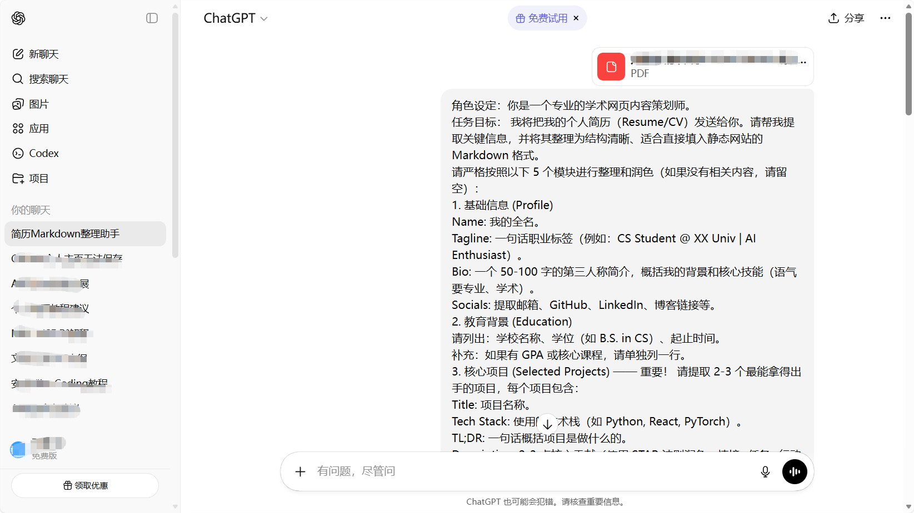


**Шаг 3: замените основное содержание, с двумя возможными маршрутами**

На этом шаге, в зависимости от ваших предпочтений, вы можете выбрать два разных режима Vibe Coding:

1. **Режим A: пусть ИИ ведёт навигацию, а вы редактируете вручную**

Если вы хотите точно знать, где именно всё меняется, вы можете спросить Trae:

```markdown
I want to modify the “Education” section. Please tell me where the corresponding file path is and which lines contain the code.
```

Trae скажет вам в чате что-то вроде:
«Файл, который вам нужно изменить, - `_pages/about.md`, а соответствующий код находится около строки XX...»

Затем вы можете сами открыть этот файл из дерева файлов слева и вписать очищенное содержание из ChatGPT, как в упражнении на структурированное редактирование.

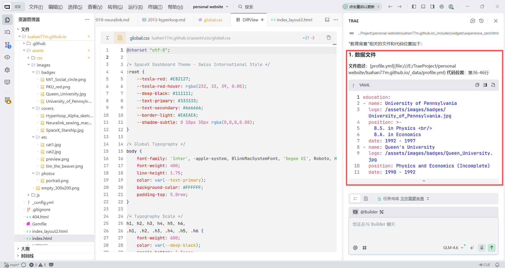

2. **Режим B: полностью управляемая автоматизация**

Если вы считаете, что искать файлы слишком хлопотно, напрямую вставьте свою очищенную информацию в Trae:

```markdown
Here is the cleaned content for my “Education” and “Project Experience” sections (paste the Markdown content).
Please directly replace the corresponding content in the current site and preserve the existing layout format.
```

# 5. Развёртывание онлайн

## 5.1 Развёртывание на GitHub Pages

**Шаг 1: включите GitHub Actions, облачную сборку**

Снова на GitHub в браузере:

1. Нажмите **Settings** вверху репозитория.
2. В левой боковой панели нажмите **Pages**.
3. В разделе **Build and deployment** измените **Source** с `Deploy from a branch` на **`GitHub Actions`**.

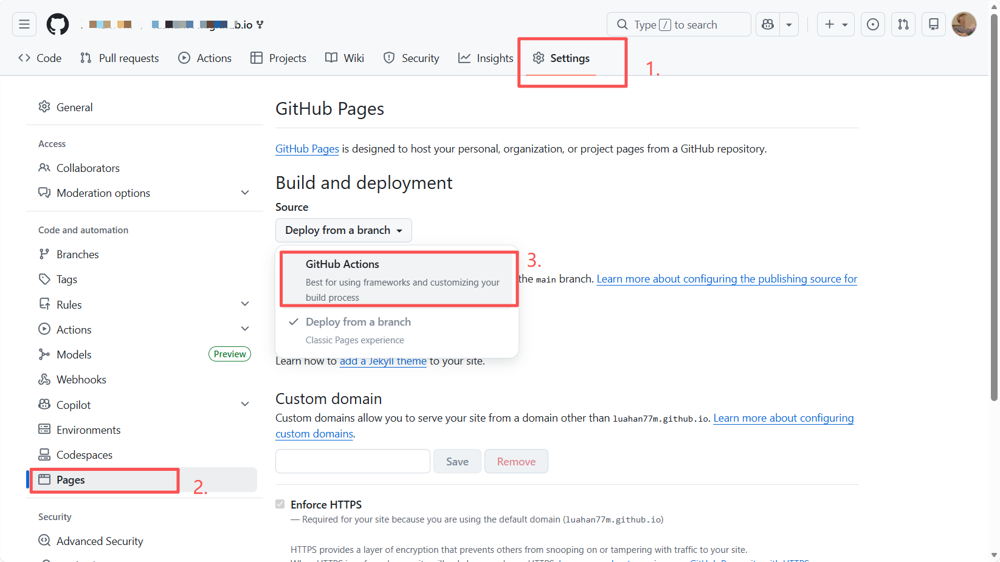

**Шаг 2: автоматически настройте рабочий процесс Jekyll**

После переключения вёрстка страницы изменится. GitHub автоматически распознает, что это проект Jekyll.

1. Найдите карточку **Jekyll (By GitHub Actions)**.
2. Нажмите **Configure** на этой карточке.

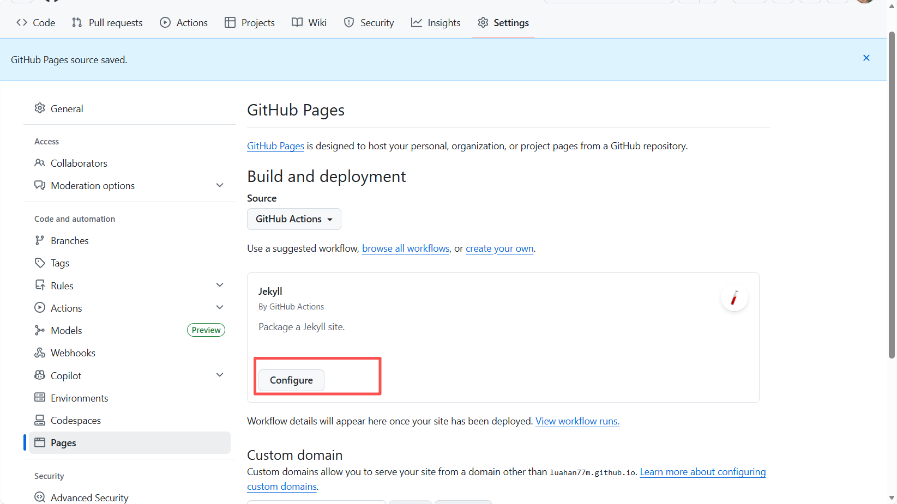

**Шаг 3: зафиксируйте файл конфигурации**

После нажатия вы попадёте на страницу, полную кода. Это файл конфигурации `.yml`, уже написанный GitHub для сборки сайта Jekyll.

1. **Не изменяйте никакой код**.
2. Нажмите зелёную кнопку **Commit changes...** в правом верхнем углу.
3. Во всплывающем окне подтверждения снова нажмите **Commit changes**.


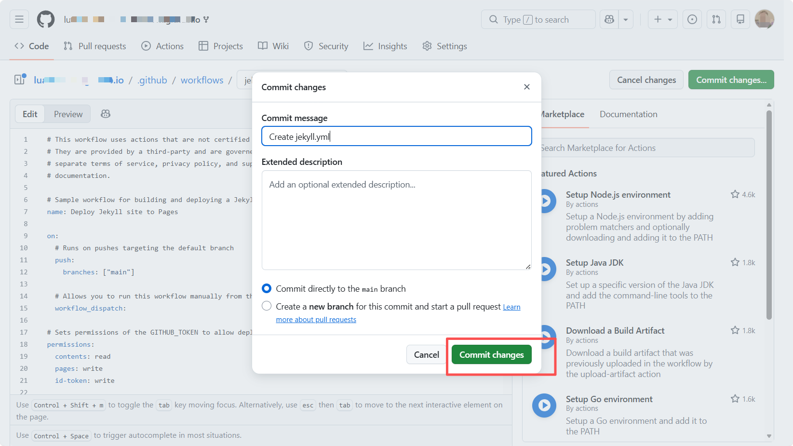

**Шаг 4: подождите и проверьте**

После коммита серверы GitHub автоматически начинают работать.

1. Нажмите вкладку **Actions** в верхнем меню.
2. Вы увидите крутящуюся задачу с именем `Deploy Jekyll site to Pages`.
3. Подождите одну-две минуты, пока жёлтый кружок не превратится в **зелёную галочку**.


**Шаг 5: посетите свой сайт**

Как только кружок станет зелёным, вы сможете получить доступ к версии шаблона по умолчанию по адресу вроде:
**`https://your-username.github.io/`**

Поздравляем. Теперь вы успешно развернули персональную академическую домашнюю страницу, доступную по всему миру.

## 5.2 Зафиксируйте изменения и обновите домашнюю страницу

Теперь мы отправим все локальные изменения, которые сделали ранее, на GitHub, чтобы эту персональную домашнюю страницу в стиле Маска мог увидеть весь мир.

1. Нажмите **Source Control** слева.
2. Добавьте все **изменения** в **staged changes**.
3. Попросите Trae помочь сгенерировать сообщение коммита, затем нажмите **Commit**.
4. Нажмите **Sync Changes** или **Push**, чтобы отправить в ветку `main`.
5. Подождите немного, пока все процессы во вкладке **Actions** не завершатся.


Теперь поздравляем. Откройте **`https://your-username.github.io/`**, и у вас уже есть полная, профессиональная и сильно в духе Маска академическая домашняя страница.

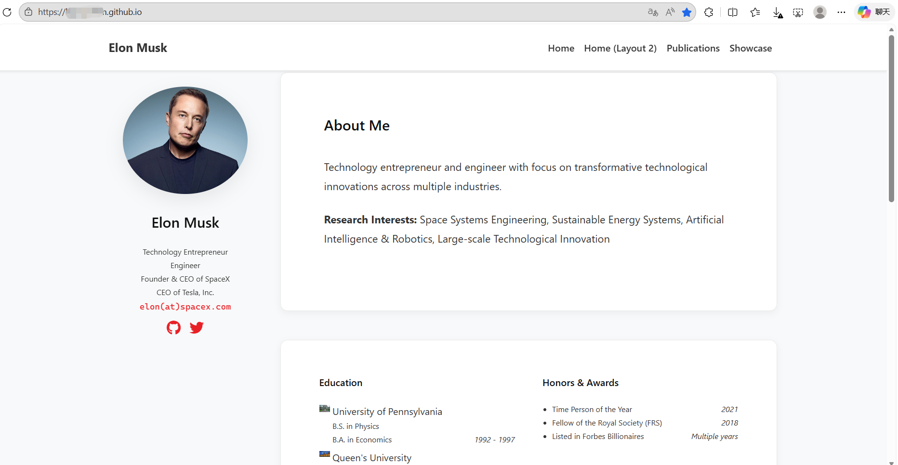

# 6. Продвинутый уровень: соберите персональную домашнюю страницу вручную с нуля

Если вы считаете академические шаблоны слишком жёсткими, или если вы хотите сделать одностраничный сайт, такой же крутой, как *Матрица*, добро пожаловать в **раздел DIY**.

Здесь мы не форкаем ничей чужой код. Мы будем использовать Trae, начиная с пустой папки, и сгенерируем полноценный сайт одной инструкцией, а затем развернём его онлайн.

## 6.1 Зачем собирать вручную

* **Абсолютная свобода**: никаких ограничений шаблона. Если вы хотите навигационную панель справа или фейерверк на фоне, вам нужно лишь сказать ИИ.
* **Минимализм**: шаблоны часто содержат сотни файлов, тогда как собранному вручную сайту может понадобиться лишь один `index.html`.
* **Технический контроль**: это лучший способ понять, как на самом деле работает веб-страница.

Мы продемонстрируем классический **поток на чистом HTML**:
компиляция не требуется, и GitHub Pages поддерживает его нативно, что делает его идеальным для создания персональной лендинг-страницы.

## 6.2 Практический пример: попросите ИИ написать домашнюю страницу «командного центра Марса»

В этот раз мы не идём академическим маршрутом. Предположим, Маск хочет предельно минималистичную, футуристичную персональную домашнюю страницу, чтобы представить свой план по Марсу.

**Шаг 1: создайте пустой проект**

Создайте на компьютере новую папку и откройте её в Trae. В этот момент дерево файлов слева совершенно пусто.

*(Совет: вы можете заранее подготовить фото Маска и назвать его `portrait.png`.)*

**Шаг 2: постройте каркас**

Введите следующий промпт в панель чата Trae. Обратите внимание, что мы требуем, чтобы ИИ записал весь код в один файл, чтобы новичкам было легко им управлять:

```text
I want to build a minimalist personal homepage for Elon Musk from scratch, without any complex framework, using only HTML + CSS + JS.
Design style: SpaceX dashboard style.
    Background: use deep space black (#000000), with starlight animation.
    Main accent color: use “Mars red” (#E82127).
    Font: use a monospace font stack to imitate the feel of a code terminal.
Page content:
    Place Elon Musk's avatar in the center, circular, with a rotating border. The image path is `portrait.png`.
    Name: Elon Musk (Technoking of Tesla)
    Intro: "Occupying Mars... 99% Loading."
    At the bottom, put three glowing buttons linking to X (Twitter), SpaceX, and Tesla.
Technical requirement:
Please put all CSS styles and HTML structure inside a single `index.html` file.
Please generate the full code directly.
```


**Шаг 3: сгенерируйте и предпросмотрите**

На предыдущем шаге Trae уже помог нам сгенерировать файл `index.html`. Так как же увидеть его текущий эффект?

Скажите Trae в чате:

```markdown
Please help me start a local service to preview this webpage.
```

Вы получите ссылку вроде `http://localhost:8000`. Скопируйте и откройте её в браузере, и вы увидите крутую «марсианскую домашнюю страницу», возможно, со звёздами, мерцающими на фоне.

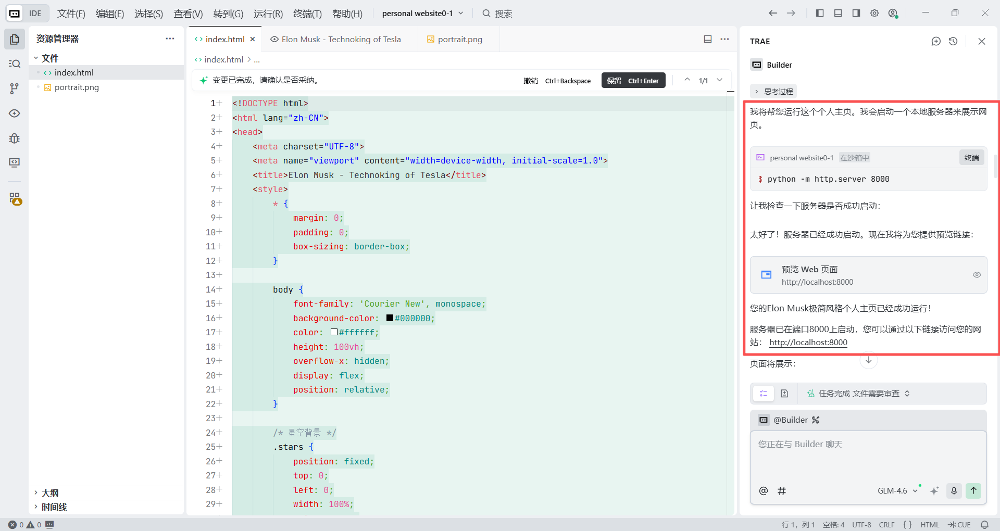

Но мы заметим, что текущая страница - это лишь очень крутая лендинг-страница. Как полноценной персональной домашней странице, ей всё ещё слишком мало информации, и не хватает глубины, ожидаемой от академической домашней страницы. Поэтому на основе этого визуального каркаса мы теперь продолжим обогащать его академической информацией об Илоне Маске.


**Шаг 4: дальнейшее улучшение информации**

Мы хотим, чтобы Trae сохранил текущий марсианский стиль, но перестроил страницу во что-то более похожее на академический шаблон. Нам нужно чётко сказать ему перенести существующие элементы влево и создать новую область содержания справа для текста профиля и белых книг, сохраняя при этом всё вновь добавленное содержание в том же чёрно-красном киберпанковском стиле.

Скопируйте следующий промпт и отправьте его в Trae:

```text
Core principle:
You must strictly preserve the current “SpaceX / Mars” design style, including pure black background, starlight decorations, red neon accent color, and monospace code-style font. Do not use the white background from the reference image.

Specific modification steps:
1. Create a two-column layout
Split the page into left and right columns. The left sidebar should take about 30% to 35% width, and the right content area should take about 65% to 70%.

2. Left sidebar - move the existing information
Move all current elements from the original hero screen into the fixed left sidebar:
    - Avatar: keep Elon Musk's circular avatar.
    - Name and title: keep the red neon text “ELON MUSK” and “Technoking of Tesla”.
    - Loading bar: keep “Occupying Mars... 99% Loading” as the personal signature.
    - Social buttons: move the three red buttons, X, SPACE X, and TESLA, to the bottom of the left sidebar.

3. Right content area - add detailed information
Add detailed personal introduction and achievements in the right area. All new body text should use white or light gray, while titles should use red neon emphasis. Please create the following sections:
- About Me:
    Write a short introduction, for example: “Technology entrepreneur and engineer focused on multi-planetary expansion, sustainable energy, and artificial intelligence.”
- Focus Areas:
    List Space Systems Engineering, Mars Colonization Architecture, Brain-Machine Interfaces.
- Visionary Plans & White Papers:
    This is the key section. Refer to the list style in the example image, but convert it into a black-background style.
    Create a list displaying his important technical plans, using red borders or glow effects to distinguish each item.
    Item 1: “Making Humans a Multi-Planetary Species” (Starship Architecture, 2017).
    Item 2: “Hyperloop Alpha” (High-speed transportation proposal, 2013).
    Item 3: “Neuralink: An Integrated Brain-Machine Interface Platform” (2019).
- Notable Achievements:
    Briefly list milestones such as:
    First private liquid-propellant rocket to reach orbit (Falcon 1)
    First reusable orbital class rocket (Falcon 9)

4. Style detail requirements
All section titles on the right, such as “About Me,” should use the same red glowing style as the “ELON MUSK” text on the left.
Make sure the whole page remains responsive and preserves a good two-column layout on different screen sizes.
```

После этого обновите браузер, и ваша киберпанковская академическая страница готова. Конечно, вы можете продолжать улучшать её по своему вкусу. Как и на предыдущих шагах, вам нужно лишь чётко сказать Trae цель, и он возьмёт на себя утомительный процесс написания кода за вас.

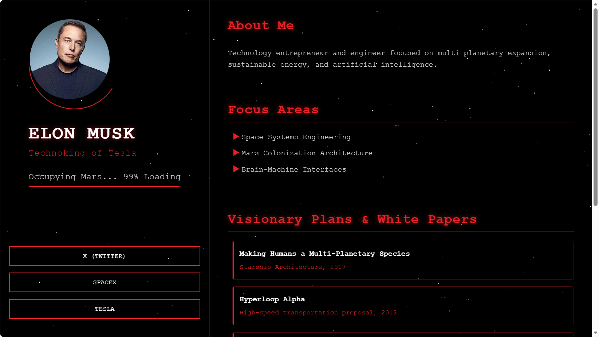

## 6.3 Как развернуть собранный вручную сайт

В отличие от предыдущего форкнутого шаблона, который пришёл из чужого репозитория, этот проект создан вами заново и пока не имеет соответствующего места на GitHub. Поэтому нам нужно привязать его вручную.

**Шаг 1: создайте новый репозиторий на GitHub**

1. Войдите в GitHub в браузере.
2. Нажмите значок **+** в правом верхнем углу, затем **New repository**.


3. **Repository name**: введите `mars-profile` или любое другое имя по вкусу.

**Примечание**:
Если вы уже использовали **`your-username.github.io`**, вы не можете повторно использовать это имя здесь. Вы можете выбрать другое имя, и GitHub тогда сгенерирует URL вроде **`your-username.github.io/mars-link`**.

4. **Public / Private**: выберите **Public**.
5. **Не отмечайте «Add a README file»!**
   Остальные опции оставьте по умолчанию.
6. Нажмите **Create repository**.

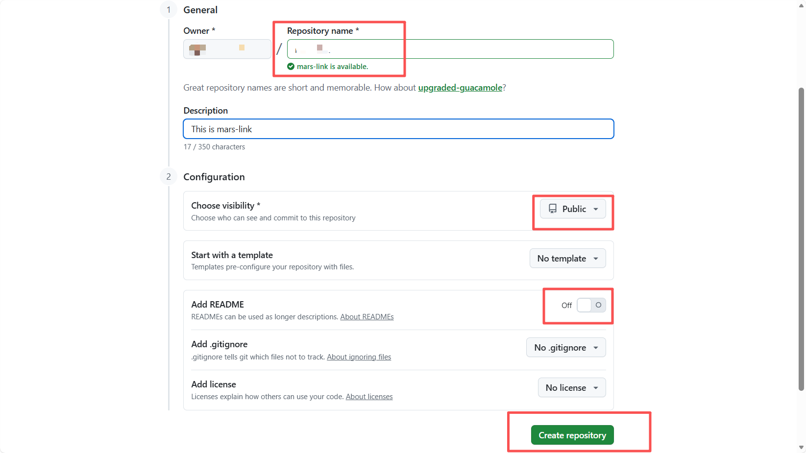

**Шаг 2: отправьте локальный код в облако**

После создания GitHub перенесёт вас на страницу с большим количеством похожего на код содержания. Не волнуйтесь. Нам нужно лишь скопировать ссылку на репозиторий, показанную на этой странице.


Вернитесь в Trae и введите в чате:

```markdown
I have created an empty repository on GitHub. The address is: https://github.com/your-username/mars-link.git (please replace this with the actual repository address you just created).
Now please help me initialize the current local project as a Git repository and push the code to the `main` branch of this remote address.
```

Trae обычно поможет выполнить стандартную последовательность ниже, и вам, возможно, нужно будет лишь нажать на запуск:

1. `git init`
2. `git add .` и `git commit -m "First commit"`
3. `git branch -M main` и `git remote add origin [your address]`
4. `git push -u origin main`

После того как Trae завершит отправку, вернитесь на GitHub и обновите страницу. Нажмите вкладку **Code**, и вы увидите, что код, написанный в Trae, успешно отправлен в репозиторий.


**Шаг 3: включите GitHub Pages**

После того как код отправлен, веб-страница не появится автоматически. Нам всё ещё нужно вручную включить переключатель:

1. Вернитесь на страницу репозитория GitHub и нажмите **Settings** вверху.
2. Нажмите **Pages** в левой боковой панели.
3. В разделе **Build and deployment**:
   1. Установите **Source** в `Deploy from a branch`.
   2. Установите **Branch** в `main` и выберите `/(root)` в качестве папки.
4. Нажмите **Save**.


После того как вы нажмёте Save, веб-страница не появится мгновенно. Бэкенд GitHub работает как маленькая роботизированная фабрика. Ему нужно около **1-2 минут**, чтобы упаковать ваш код, собрать его и опубликовать на серверах по всему миру.

Терпеливо подождите и обновите страницу. Под крупным заголовком **GitHub Pages** вы увидите строку с URL, похожим на:
**«Your site is live at `https://your-username.github.io/mars-link/`»**

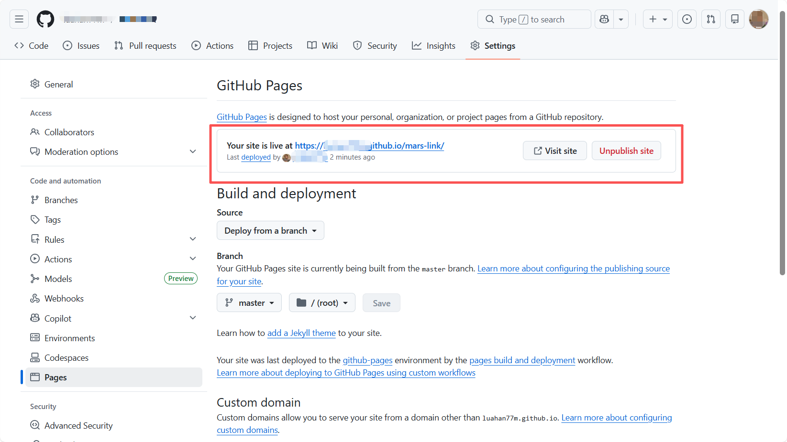

Нажмите на него, и ваш командный центр Марса в сети.

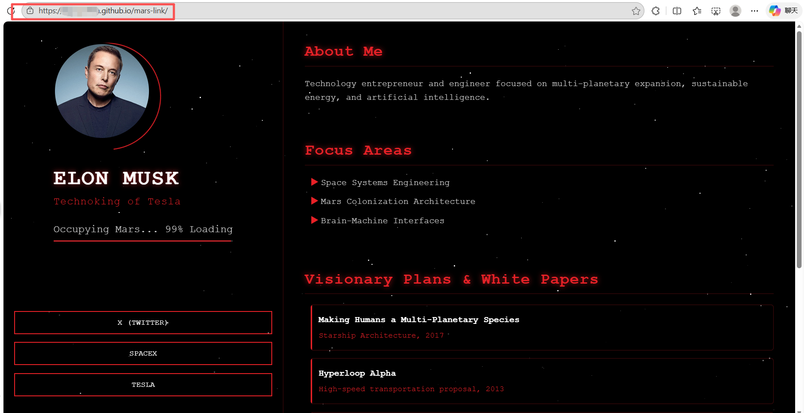

# 7. Заключительные слова

Руководство подошло к концу. Теперь, когда вы смотрите на `.github.io`, светящийся в адресной строке вашего браузера, не чувствуете ли вы себя немного так, будто водрузили флаг в интернете?

В этом руководстве мы позаимствовали образ Илона Маска и собрали сайт, как проект из Lego, который выглядит весьма впечатляюще. Но это лишь начало. Самое очаровательное в Vibe Coding - не то, сколько времени на набор текста он экономит. А то, что он **полностью сносит стену между «идеей» и «реальностью».**

Раньше вы могли отказаться от показа проекта, потому что **не умели писать CSS**.
Теперь единственные оставшиеся пределы - это ваше **воображение** и ваш **вкус**.

**Не позволяйте этому сайту оставаться «клоном, вдохновлённым Маском».**
Та ссылка на Tesla, которую вы использовали для практики, и та белая книга о колонизации Марса - в конечном счёте чужая история. Ваша домашняя страница должна быть вашей собственной визиткой в цифровом мире.

Идите и разместите там свой первый реальный опыт работы над проектом.
Идите и опубликуйте свои собственные уникальные мысли по технической теме.
Вы можете даже разместить там свой любимый список книг или собственные фотографии.
Мысли, которые затерялись бы в WeChat Moments, могут остаться здесь навсегда.
Страсть, которая не помещается в резюме, может свободно распространяться здесь.

Не оставляйте этот участок пустым.
Идите экспериментировать. Идите ломать его. Идите перестраивать его.
Продолжайте так делать, пока он не вырастет в форму, которая вам нравится больше всего.


***Вперёд, и пусть мир увидит вас.***

# Справочные материалы

CSDN: [Новейшее руководство 2025 года для чайников: шаг за шагом создаём персональную домашнюю страницу с помощью GitHub](https://blog.csdn.net/qq_45743991/article/details/145505150?ops_request_misc=&request_id=&biz_id=102&utm_term=github%E6%9E%84%E5%BB%BA%E4%B8%AA%E4%BA%BA%E4%B8%BB%E9%A1%B5&utm_medium=distribute.pc_search_result.none-task-blog-2~all~sobaiduweb~default-0-145505150.142^v102^pc_search_result_base4&spm=1018.2226.3001.4187)

CSDN: [Руководство по загрузке и установке Git](https://blog.csdn.net/weixin_41293671/article/details/144255269?ops_request_misc=elastic_search_misc&request_id=63236900b52320a7beb177787ba97f07&biz_id=0&utm_medium=distribute.pc_search_result.none-task-blog-2~all~baidu_landing_v2~default-5-144255269-null-null.142^v102^pc_search_result_base4&utm_term=git%E4%B8%8B%E8%BD%BD%E5%AE%89%E8%A3%85&spm=1018.2226.3001.4187)

CSDN: [Руководство по установке Ruby под Windows](https://blog.csdn.net/alive_tree/article/details/103043158?ops_request_misc=elastic_search_misc&request_id=ad7e29ea7f702554d785c2fc82ec6e95&biz_id=0&utm_medium=distribute.pc_search_result.none-task-blog-2~all~ElasticSearch~search_v2-11-103043158-null-null.142^v102^pc_search_result_base4&utm_term=ruby%E5%AE%89%E8%A3%85%E6%95%99%E7%A8%8B&spm=1018.2226.3001.4187)
