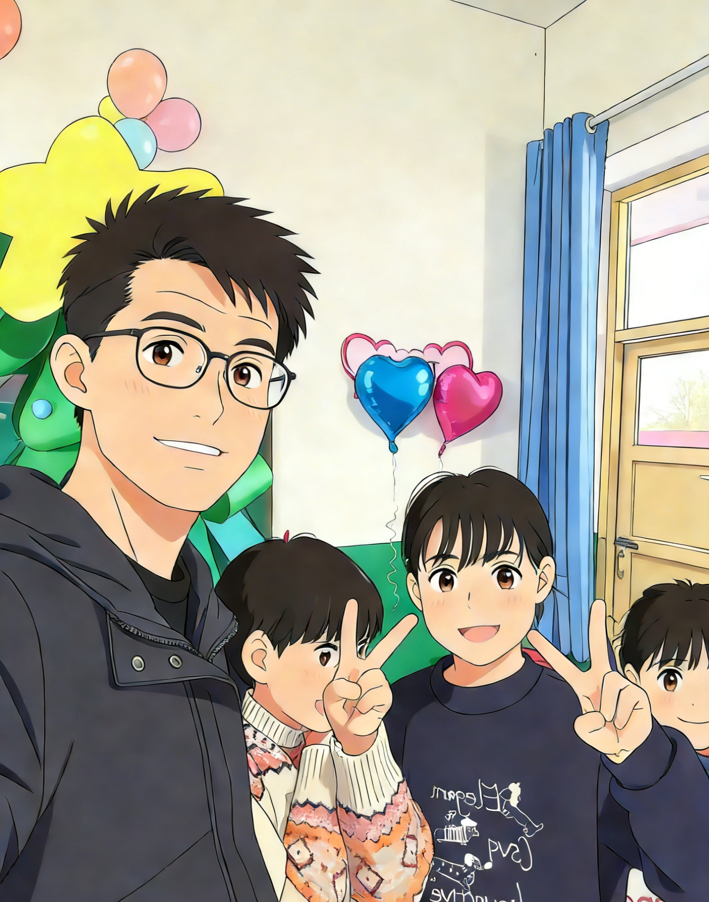
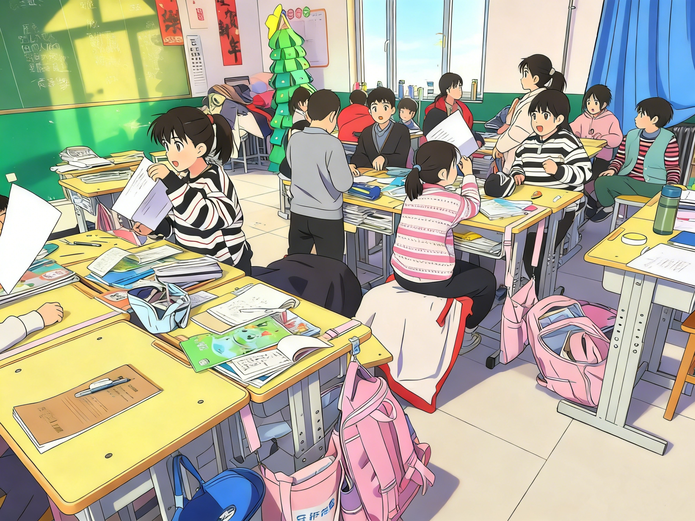
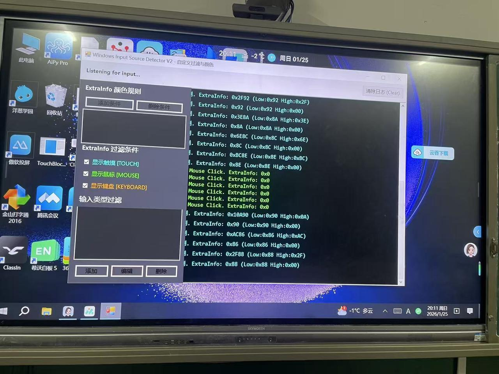

# Он бросил пятизначную месячную зарплату, чтобы научить сельских школьников «отгонять мух с помощью AI»

👨‍🏫

**Рассказывает: Сяо Хао, учитель начальной школы**

Сяо Хао — сельский учитель на замене у третьеклассников. До этого он работал в операционном управлении, занимался бизнес-аналитикой данных и писал код, получая солидную пятизначную месячную зарплату. Для многих этот молодой человек, выбравшийся из деревни, уже «неплохо устроился». Но он отказался от завидной работы и вернулся на родину по одной причине: он хотел помочь сельским детям увидеть больший мир.

## 01 Когда «искусственный интеллект» впервые пришёл в класс

Когда Сяо Хао только начал преподавать в деревне, на сердце у него было тяжело. «Условия здесь ограниченные. Этим детям редко выпадает шанс увидеть большой мир. Их мир так мал, что иногда кажется, будто всё, что у них есть, — это потрёпанные учебники и земля под ногами». Он хотел, чтобы они увидели нечто большее. Он также хотел, чтобы они знали: в этом мире существует нечто под названием искусственный интеллект. Он умеет рисовать, писать стихи и отвечать на все безумные вопросы, что роятся у них в головах.

Поначалу всё шло негладко. Он хотел, чтобы ученики приносили в школу телефоны и могли сами попробовать AI, но руководство школы решительно воспротивилось этой идее: «Вы просто учите их списывать ответы! Это не имеет ничего общего с настоящей учёбой!» Но он не сдавался. Он продолжал их убеждать. В конце концов обе стороны пошли на компромисс: обучение с AI разрешили, но ученикам по-прежнему нельзя было приносить в класс собственные телефоны.

Тогда Сяо Хао заплатил из своего кармана, купил несколько подержанных телефонов и вошёл в них под собственным аккаунтом Doubao, чтобы ученики могли ими пользоваться. Так дети впервые прикоснулись к «высоким технологиям». Очень быстро они научились использовать AI для поиска информации, разучивания танцев и даже играли с генерацией изображений по тексту. Впервые AI открыл этим детям новое окно в мир.

## 02 Особенность сельского класса: мухи и ложные касания

В сельских классах теперь тоже есть мультимедийные интерактивные доски, которые повысили эффективность преподавания и сделали образование более доступным. Но в реальных условиях класса некоторые неловкие проблемы по-прежнему трудно решить. Например, мухи.

Электронные доски выделяют тепло и свет, и мухи обожают на них садиться. Экран не может определить, было касание намеренным или случайным, поэтому слайды скачут, видео ставятся на паузу, а иногда система и вовсе выключается посреди урока. За 40-минутный урок учитель может в итоге провести 20 минут у доски, отгоняя мух. Урок распадается на куски, и страдают от этого и Сяо Хао, и его ученики.

И вот однажды один ученик поднял руку и сказал: «Учитель, а можно мы вместе сделаем программу, которая не пускает мух?»

## 03 Мы выиграли битву с мухами, «поболтав» с AI

Писать код вместе с третьеклассниками и строить настолько техническую программу раньше было бы немыслимо. Но теперь всё иначе. С AI это вдруг стало казаться возможным.

Сяо Хао случайно наткнулся на общественный курс Vibe Coding, поэтому начал «играть» с ним вместе с детьми. Ученики придумывали идеи, а Сяо Хао выступал переводчиком, превращая их слова в промпты для AI. Им не приходилось бороться со сложным синтаксисом или низкоуровневыми понятиями вроде указателей, дескрипторов и очередей сообщений. AI стоял между ними и этими барьерами.

- «Может ли компьютер понять, это щелчок мыши или экран касается сам себя?»
- «Можем ли мы дать экрану прозрачный щит, чтобы мухи, которые на него садятся, ничего не делали, а я по-прежнему мог пользоваться мышью?»

Эти вопросы привели к чему-то настоящему. AI сообщил им, что нужно различать `RawInput` и определять `ExtraInfo`. Дети не понимали технического жаргона, но, сравнивая данные и обсуждая всё вместе, они обнаружили, что разные способы ввода действительно дают разные значения `ExtraInfo`.

Шаг за шагом, фраза за фразой, Сяо Хао и дети «договорились» с AI и построили то, что стало называться **Блокировкой касаний Сяо Хао**. Принцип её прост: она распознаёт характеристики входящих сигналов и точно блокирует ввод с сенсорного экрана, сохраняя при этом ввод с мыши. Так что, как бы дико ни вели себя мухи на дисплее, урок остаётся идеально стабильным.

Эта программа — не какой-то грандиозный коммерческий продукт, но она решила настоящую болевую точку сельских классов. Что ещё важнее, она дала детям первый опыт создания чего-то своими руками и использования технологий для ответа на реальную проблему из повседневной жизни.

## 04 От написания строчки кода до стука в дверь

Глубже всего Сяо Хао запомнился случай в Новый год. Он спросил у Doubao: «Как помочь детям провести праздник со смыслом?» AI не предложил вечеринку или представление в классе. Вместо этого он сказал: «Вместо того чтобы праздновать в классе, почему бы не навестить одинокого пожилого жителя деревни?»

И он действительно так и сделал. Он повёл детей навестить пожилого мужчину из деревни, который жил один при минимальной поддержке. Когда они пришли, старик обедал, сидя на потёртом деревянном табурете, и на столе у него были лишь миска простой лапши и маленькая тарелочка с соленьями. Сяо Хао пронзило острое сожаление, что не принёс больше еды. Даже обычно шумные дети в тот день были непривычно ласковы и довольно долго болтали со стариком.

На обратном пути несколько детей потянули Сяо Хао за рукав, и с покрасневшими глазами сказали: «Учитель, можно мы будем чаще приходить помогать дедушке?» По дороге домой ветер резал им лица, но внутри у Сяо Хао было тепло.

Он сказал: «Образование — это не только обучение знаниям из учебников. Оно должно учить и сопереживанию. Ответы, которые даёт нам AI, не только технические. Иногда они зажигают сердце, которое хочет заботиться о других».

## 05 Несколько слов от учителя Сяо Хао

Если честно, главным приобретением от создания этой программы была не сама программа. Это был свет в глазах детей. До этого многие из них считали, что компьютеры — для городских детей, что программирование — для гениев и что всё это не имеет к ним никакого отношения. Но теперь они знают: пока у них есть идея, пока они смеют её вообразить и даже пока они просто могут её описать, они могут использовать AI, чтобы изменить собственную жизнь.

Ученик, который первым предложил создать программу, раньше был самым озорным в классе. Теперь он слушает внимательнее всех, потому что знает, что то, что он помог создать, решает проблему для всех. Это ощущение «я тоже так могу» ценнее, чем отличная оценка.

Сяо Хао также признал, что использование телефонов и AI с детьми принесло ему немало критики. Многие говорили, что он пренебрегает своими прямыми обязанностями и подаёт дурной пример. Но когда он видит, как дети становятся более любознательными и сострадательными благодаря AI, он чувствует, что всё это того стоило.

## 06 Заключительные мысли

Сяо Хао искренне надеется, что больше людей обратят внимание на практичные, приземлённые цифровые классы на базе AI в государственном образовании. Маленькие миры сельских детей нуждаются в AI ещё сильнее. AI — не просто инструмент. Это ещё и окно, которое помогает им соединиться с огромным миром за пределами их деревни.

