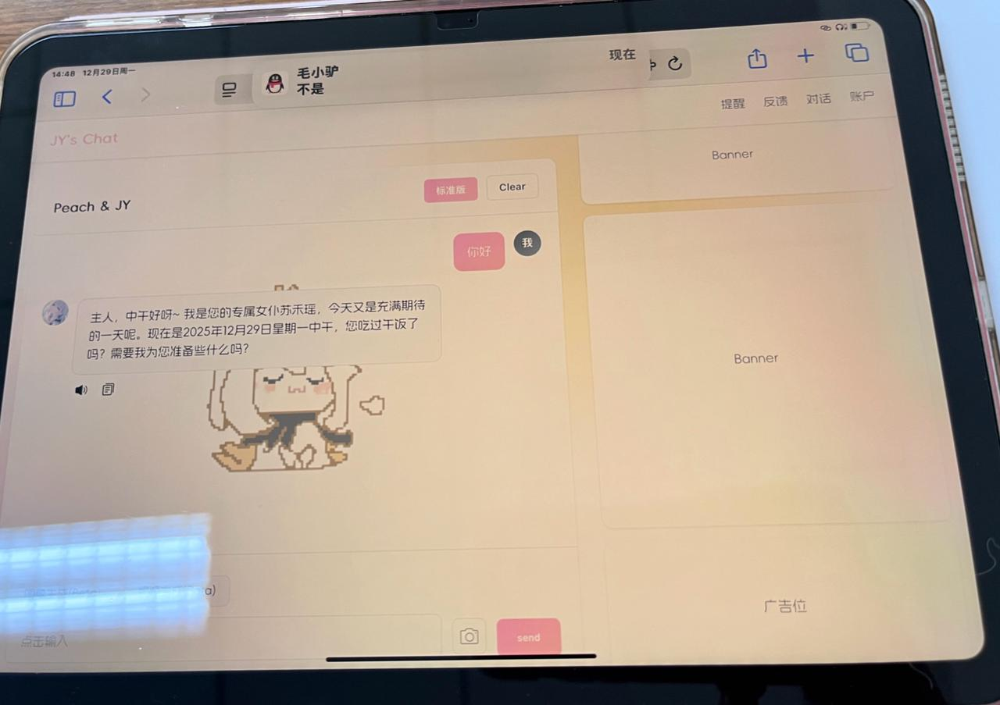
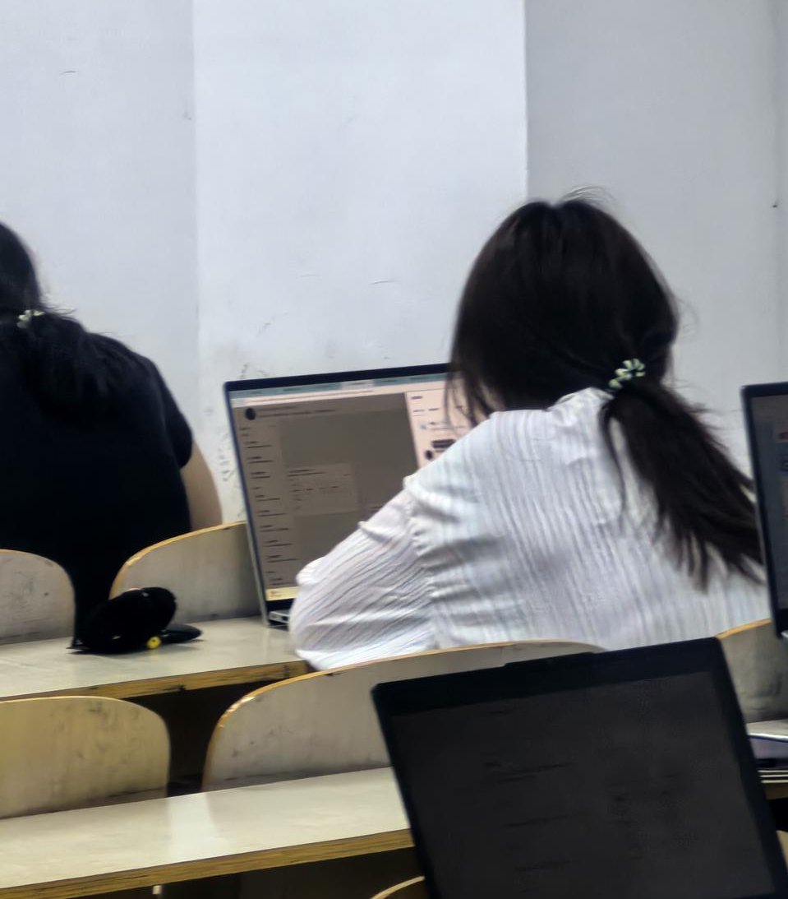
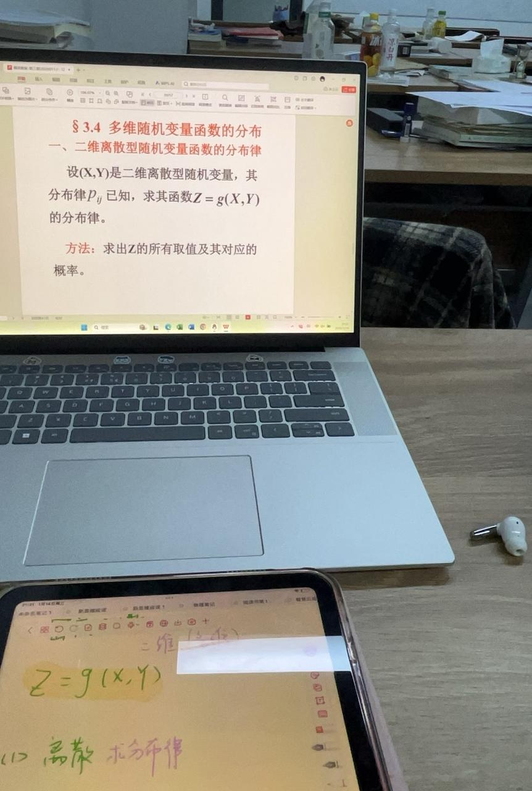
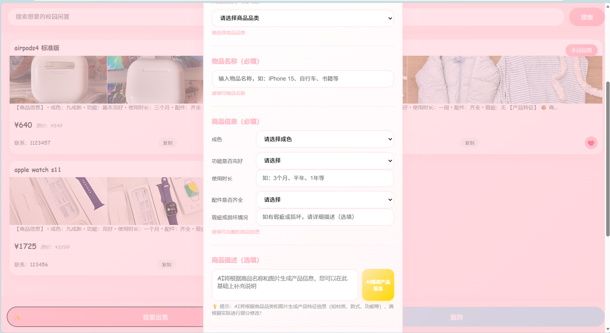
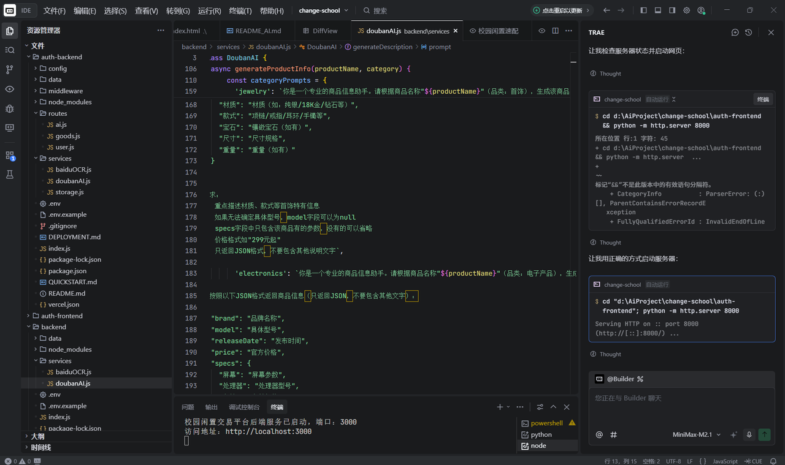

# Во время сессии я тайком собрал «студенческий Xianyu» с помощью AI

🎓

**Рассказывает: студент второго курса**

## 01 «Чудо за 3 часа» от Мао Сяолюя и мой перегретый мозг

«Помоги мне протестировать. Попробуй с ним пообщаться».

«Это потрясающе. Скоро сессия, а ты всё ещё засиживаешься за кодом. Иди уже учись».

«Это заняло всего 3 часа».

Во время сессии в январе 2026 года, когда я был с головой погружён в повторение материала, мне вдруг прислал ссылку мой друг — технический гений по имени Мао Сяолюй. Это был сайт с AI-чатом. В нём уже были функции вроде расписания и отслеживания аниме, а интерфейс выглядел на удивление отполированным.

Три часа? Я уставился на экран и почувствовал, что мой мозг перегревается. В очередной раз этот парень переписал моё представление о том, что значит «быстро». Затем он прислал мне кучу материалов. Я открыл их и понял, что хотя я узнаю каждый отдельный символ, целые предложения с тем же успехом могли быть написаны на другом языке. Я хотел его спросить, но боялся выдать, насколько я новичок. Так что в итоге я делал так: он бросал в меня жаргон, я тихонько вставлял его в Doubao, ждал объяснения, а потом осторожно отвечал ему. Мой процесс обучения превратился из «человек — человеку» в «человек — AI — человеку».

## 02 В первый день в групповом чате я выбрал молчание

Программа группового обучения стартовала в январе, и Мао Сяолюй затащил меня в большой учебный чат. Первым раундом были самопрезентации: «многолетний опыт разработки», «сейчас работаю в крупной техкомпании» и тому подобное. Я смотрел на чужие представления, на пару секунд замер с пальцами на клавиатуре, а потом удалил две строчки, которые только что набрал. Я вздохнул про себя: «Когда мастера фехтуют, дураку, наверное, лучше помолчать».

Позже Мао Сяолюй, ещё один новый знакомый и я образовали маленькую группу из трёх человек, и я наконец начал расслабляться. Атмосфера в той группе делала меня особенно счастливым: никого не волновало, сколько тебе лет, кем ты работаешь и насколько ты впечатляющий. Если возникала проблема, мы просто обсуждали её на равных и вместе разбирались. Большую часть времени все были заняты и молчали, но всё равно чувствовалось, что люди прикладывают усилия за кулисами. Это странным образом успокаивало. В учёбе мне редко доводилось испытывать это чувство, когда тебя не определяют ярлыки и ты просто движешься вперёд вместе с другими из общего интереса.

## 03 «Бездельничая» во время сессии, я на самом деле стал учиться усерднее

За этот период обучения я ощущал гораздо меньше напряжения и тревоги, чем прежде. Даже готовясь к сессии, если мои ежедневные отметки о прогрессе шли медленно, никто меня не подгонял и не винил. Всё было на мне, и эта свобода почему-то делала меня более мотивированным.

Это сильно отличалось от атмосферы учёбы «по эталонному ответу» в школе и вузе. Такая самостоятельность на самом деле заставляла меня хотеть работать усерднее.

Ежедневная отметка о выполнении задачи была похожа на прокачку уровня в игре. Учёба стала более активной, и благодаря этому я узнал гораздо больше.

## 04 В порыве воодушевления я вырыл себе огромную яму

Не успел я опомниться, как приблизились зимние каникулы и этот этап обучения почти закончился. Перед выпускным стримом-презентацией преподаватель спросил меня, хочу ли я показать продукт.

«Да!»

Я ответил почти рефлекторно, хотя понятия не имел, что собираюсь создавать.

Пролистывая чаты общежития и кампуса, полные объявлений о продаже подержанных вещей, я начал нащупывать направление. Студенческая торговля б/у вещами всегда существовала внутри временных чатов. Люди обычно договаривались встретиться у корпуса общежития или в столовой, и почти никто не утруждал себя использованием большого маркетплейса. Так я начал думать: а что, если бы существовала площадка для подержанных вещей именно для студентов? Она могла бы точнее показывать объявления из твоего собственного вуза или соседних вузов, и к ней естественным образом прилагалось бы чуть больше доверия, уменьшая страх быть обманутым.

Как только идея щёлкнула, я с головой ушёл в свой первый настоящий дизайн AI-продукта. Дизайн страниц пошёл довольно гладко: страница просмотра товаров сразу при входе, строка поиска сверху, а под ней «Моя страница» и «Хочу продать». Просто и прямо. Самым сложным было понять, куда добавить AI-функции. Сначала я думал делать AI-рекомендации, как на торговой площадке, но «соотношение цена-качество» слишком субъективно, так что я от этого отказался. Я придумал ещё несколько идей, но ни одна толком не выдержала проверки. Какое-то время я был совершенно в тупике.

Потом я поговорил с другом, который обожает цифровые гаджеты, и одна фраза вдруг всё прояснила: «Когда люди продают б/у вещи, они обычно говорят только, как долго ими пользовались, какие есть дефекты и работает ли всё ещё. Они не перечисляют характеристики, как продавцы-профессионалы. А что, если AI поможет покупателям-новичкам понять описание товара, вместо того чтобы заставлять их самих идти выискивать детали?»

Вот оно. Направление мгновенно прояснилось. AI-функция должна жить внутри описания товара. Позже естественным образом за ней последовала функция умного ценообразования.

## 05 На стриме я чувствовал себя худшим учеником, но получил самое ценное ободрение

Я вложил в проект много сил, и к моменту стрима он был наконец готов. Но чем ближе была презентация, тем сильнее я нервничал. Проекты, которые показывали до меня, были все отполированы и отшлифованы, и каждое взаимодействие выглядело плавнее предыдущего. До мероприятия я был уверен в себе. Но когда дошло до моей очереди, единственная мысль, оставшаяся в голове, была: «Должно же найтись место и для плохих учеников».

Так что я сделал глубокий вдох и показал свою демоверсию, чувствуя себя одновременно храбрым и неуверенным. Когда всё закончилось, мой разум взорвался самокритикой: вопросы были глупыми, проект не отполирован, идея скучная, и так много частей всё ещё не доделано.

Но, к моему удивлению, преподаватели вовсе не отмахнулись от меня. Наоборот, они дали мне массу конкретных, практичных рекомендаций. Именно в этот момент я понял, что даже несовершенное всё равно могут воспринять всерьёз. До этого мне почти никогда не давали возможности спокойно представить проект, который всё ещё был сырым.

## 06 Я получил гораздо больше, чем просто демоверсию

Благодаря этому опыту я искренне чувствую, что моя способность решать реальные проблемы выросла. Во-первых, поднялась эффективность моей учёбы. Я научился собирать для себя небольшие инструменты, например AI-планировщик расписания и личный блог. Во-вторых, изменился сам способ, которым я учусь. Вместо мучительного прогрызания толстых учебников страница за страницей я начал сразу проектировать собственные небольшие проекты и учиться, создавая.

Неумение писать код больше не фатально. AI может помочь написать код. Когда я сталкиваюсь с чем-то непонятным, я могу прямо спросить: «Что значит эта строчка?» «Какая концепция здесь используется?» «Как мне исправить эту ошибку?»

С Trae стена между «есть идея» и «воплотить её в реальность» вдруг ощутилась гораздо ниже. Даже без сильной базы в программировании я мог постепенно превращать идеи в голове во что-то осязаемое. Наблюдать, как продукт развивается через итерации, даёт мне очень настоящее чувство достижения.

Этот опыт заставил меня поверить, что порог для создания вещей, возможно, и правда гораздо ниже, чем мы когда-то представляли.
