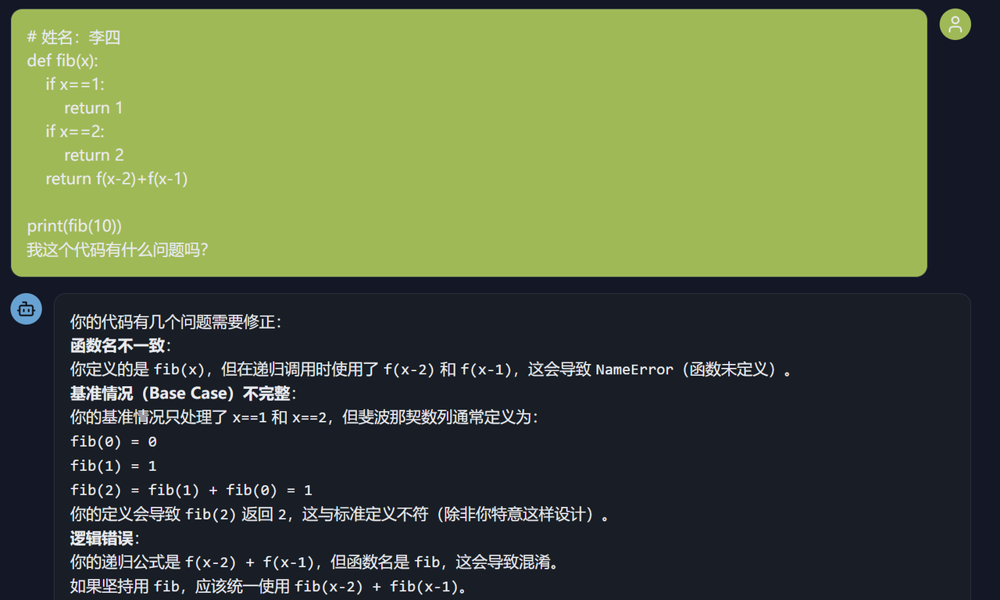
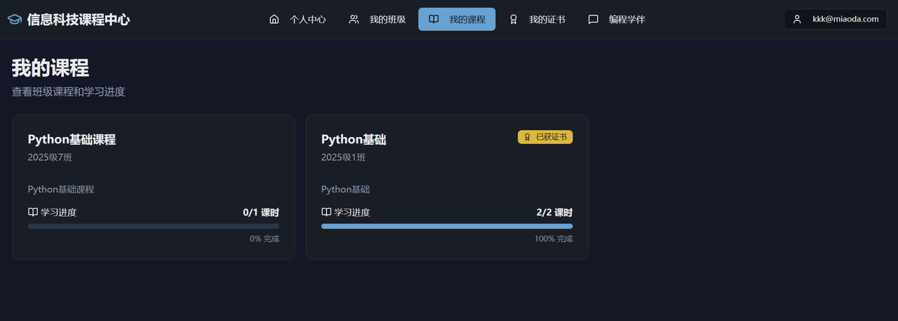
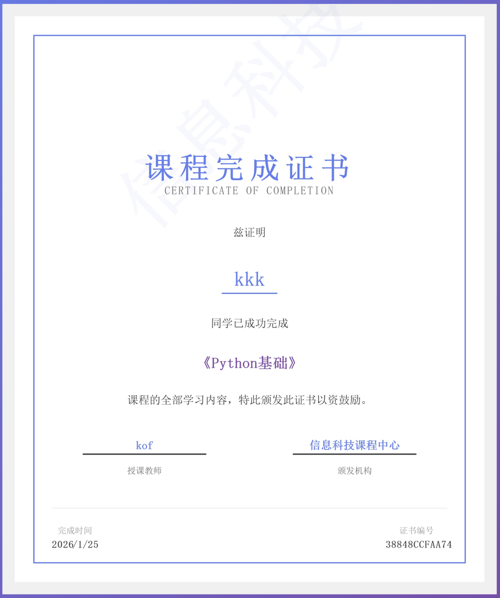

# Я создал каждому ученику неутомимого «отличника-соседа по парте»

🧑‍🏫

**Рассказывает: учитель информатики старшей школы**

Я учитель информатики старшей школы, директор информационного центра нашей школы, а также один из «учителей-первопроходцев AIGC» города Шицзячжуан. Эти звания могут звучать громко, но если говорить простыми словами, я на самом деле пытаюсь сделать всего три вещи: хорошо обучать учеников, снижать нагрузку на учителей и повышать эффективность преподавания.

Именно поэтому я начал изучать ИИ и думать о том, как его применять. Поначалу это было одновременно и рабочим требованием, и личным интересом. Но что действительно подтолкнуло меня создать что-то реальное, так это практический курс по Python, за который я отвечал.

## 01 Урок Python, который чуть меня не утопил

Урок Python, который я веду, не особенно сложен по содержанию. Ученикам нужно лишь написать простую программу для расчёта индекса массы тела (BMI): ввести рост и вес, определить категорию и вывести результат. Но для учеников без какого-либо опыта программирования вход в совершенно новую область и понимание того, как она работает, оказывается гораздо труднее, чем кажется.

Очень часто то, что объясняет учитель, и то, что ученики на самом деле понимают, — это два разных мира. Поэтому одни и те же моменты, которые уже были разобраны, снова и снова возвращались в виде повторяющихся вопросов. Не успел я выдать задание, как руки взлетали со всех сторон, и класс наполнялся криками: «Учитель! Учитель! Учитель!» Это было похоже на то, как если бы я стоял посреди шумного рынка, где каждый торговец одновременно пытается привлечь моё внимание.

Пятьдесят учеников. Один учитель. У каждого ученика возникала своя проблема в своём месте. Кто-то не понимал, для чего нужен `input()`. Кто-то не мог сообразить, как написать `if`. Кто-то совсем не понимал преобразование типов. За 45-минутный урок я чувствовал себя рабочим на заводе, без остановки закручивающим винты. Только закрутишь один — рядом ослабевает ещё три.

Несмотря на то что я ни на секунду не останавливался, число учеников с поднятыми руками, казалось, никогда не уменьшалось. Кто-то ждал несколько минут и, так и не дождавшись помощи, начинал бесцельно тыкать в компьютер. Другие просто сдавались и ложились головой на парту спать. Когда прозвенел звонок и урок закончился, я стоял в компьютерном классе, глядя на этот хаос, и вдруг почувствовал собственное бессилие.

Это была не вина учеников. Они и так старались изо всех сил. И дело было не в том, что я плохо преподавал. Проблема была в том, что сама модель была сломана. Программирование — это не математика. Здесь нельзя решить проблему каждого, объяснив всему классу один стандартный ответ. Здесь можно только направлять каждого по отдельности.

## 02 А что, если бы рядом с каждым учеником сидел неутомимый отличник?

В ту ночь я не мог уснуть. Не от тревоги, а потому что всё думал об одном вопросе: что, если бы у каждого ученика был помощник, способный отвечать на вопросы в любой момент?

Этот помощник не давал бы ответ напрямую. Он просто говорил бы что-то вроде: «Вот здесь ошибка», «Эта функция работает так» или «Попробуй посмотреть на это с другой стороны».

Это было бы как тот отличник, рядом с которым ты когда-то сидел в школе. Когда ты застревал, ты задавал быстрый вопрос, он давал подсказку, а остальное ты додумывал сам. Именно тогда я вдруг осознал, что ИИ, возможно, способен стать именно таким «отличником-соседом по парте».

Существующие инструменты ИИ для программирования уже умели давать прямые ответы, но по-настоящему направлять обучение они всё ещё не могли. Поэтому я решил сам создать новое приложение: ИИ-помощника преподавателя, который мог бы учить, направлять и сопровождать учеников, пока те разбираются с задачами.

## 03 От идеи к реальности: помощник для обучения программированию

До этого я писал лишь простое программное обеспечение. Я никогда не создавал ничего настолько сложного. И у меня совсем не было опыта разработки приложений с интеграцией ИИ, так что, честно говоря, в самом начале я чувствовал большую неуверенность. Но это был и первый раз, когда я по-настоящему взял идею из своей головы и вывел её в реальный мир в виде работающего приложения.

В тот период я пять вечеров подряд погружался в курс и шаг за шагом учился. Самым трудным в разработке было не написание кода. Это был выбор API для ИИ: какая платформа бесплатна, какая быстрее, какая подходит для образования и так далее. Мне приходилось тестировать их по очереди.

Я до сих пор помню, как впервые успешно интегрировал ИИ в приложение. Я ввёл «Как использовать функцию `input`?» и увидел, как в ответ возвращается пример кода и объяснение. Это чувство восторга и облегчения до сих пор ярко стоит у меня перед глазами. Я назвал приложение **Центром курсов по информатике**, а его основным модулем стал **помощник для обучения программированию**.

Он умеет делать три вещи:

- **Отвечать на вопросы по базовым знаниям**: когда ученики спрашивают «Как написать цикл `for`?» или «Как работают списки?», помощник даёт объяснения по использованию и примеры кода, потому что это фундаментальные понятия, а не ответы к домашнему заданию.
- **Направлять при решении домашних задач**: когда ученик приносит задачу, заданную учителем, помощник не выдаёт готовое решение целиком. Вместо этого он использует сократический метод вопросов, чтобы подвести ученика к самостоятельному решению.
- **Проверять код ученика**: когда ученики вставляют свой собственный код, помощник указывает на ошибки, но не переписывает всё за них напрямую.

Почему я спроектировал его именно так? Потому что смысл обучения не в том, чтобы просто «сделать домашнее задание». Он в том, чтобы научиться решать проблемы. Если ИИ будет давать ответы напрямую, ученики будут лишь копировать и вставлять. На первый взгляд задание сдано. На деле же ничего не выучено.

## 04 Задания и записи стали следующей проблемой

После того как программа была готова, я сам её протестировал и остался вполне доволен. Мои коллеги посмотрели и сказали: «Это потрясающе. Это решает нашу боль». Но в первую же неделю после начала учебного года появилась новая проблема: ученики использовали помощника для решения задач на уроке, но куда им потом сдавать домашние задания?

Раньше мы использовали в компьютерном классе систему электронного класса. Ученики сдавали работы там, а я собирал их на учительском компьютере. Но у этой системы был один фатальный недостаток: она работала только внутри компьютерного класса. Как только урок заканчивался, всё прекращалось. За пределами класса ученики не могли ни продолжать работу над заданиями, ни просматривать свои предыдущие учебные записи.

Поэтому я провёл ещё несколько поздних вечеров, добавляя в помощника полноценную систему управления классами и курсами:

- Учителя могут создавать классы и курсы.
- После вступления в класс ученики видят всё содержание курса и задания.
- Если они что-то не успели сделать на уроке, они могут продолжить и сдать это позже.
- Учителя могут проверять задания после урока и возвращать незавершённые работы на доработку.
- Когда ученик сдаёт все задания курса, система автоматически выдаёт сертификат об окончании курса.

Этот сертификат я добавил намеренно. Я знаю, что для старшеклассников даже небольшое чувство признания и торжественности может вызвать ощущение: «Я действительно чему-то научился».

С помощником для программирования и системой управления курсами система наконец-то образовала полный цикл обучения. Она дала ученикам более ясное начало, более ясное завершение и более сильное чувство достижения.

## 05 Если бы только у каждого учителя был ещё один помощник

Сейчас у учеников каникулы. Система управления курсами пока не развёрнута массово в реальных классах, но отзывы коллег, которые её протестировали, уже придали мне уверенности: «Это именно то, что нам нужно». Что удивило меня ещё больше — система, возможно, даже будет внедрена в других школах по всему Шицзячжуану.

Поначалу я создавал её просто чтобы решить проблему 50 учеников моего собственного класса. Я и не думал делать что-то более масштабное. Но потом я снова задумался: если учителя информатики по всему городу сталкиваются с той же дилеммой, и каждый класс полон учеников, кричащих «Учитель!», в то время как учитель всего один, — то этот инструмент действительно должен использоваться большим числом людей.

ИИ может быть частью ответа. Не как замена учителям, а как то, что помогает учителям, чтобы каждый ученик мог получить более персонализированное руководство.

## 06 Заключение

Напоследок несколько слов о технической стороне. Я использовал Baidu Miaoda и развернул всё с нулевыми затратами. У нашей школы нет бюджета на сервер, поэтому эти нулевые затраты очень много значили. Всего за пять дней продукт прошёл путь от идеи до онлайн-приложения. Даже изучение Vibe Coding и создание приложения происходили в обрывках времени по ночам.

Я не профессиональный разработчик и уж точно не технический гений. Я просто обычный учитель информатики старшей школы, который однажды бессонной ночью захотел решить реальную проблему. Позже я обнаружил, что технологии действительно могут изменить образование. Не в смысле грандиозного нарратива о какой-то всеобъемлющей «революции в образовании», а конкретным, скромным и по-настоящему эффективным образом.

Если вы тоже учитель информатики, сталкивающийся с похожими трудностями, или просто человек, которому интересны ИИ и образование, я был бы рад продолжить разговор. Давайте вместе сделаем так, чтобы технологии по-настоящему служили образованию.
