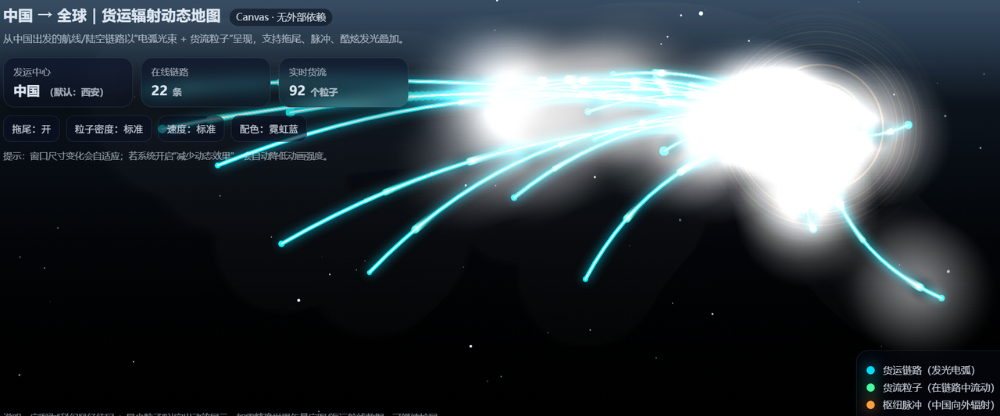
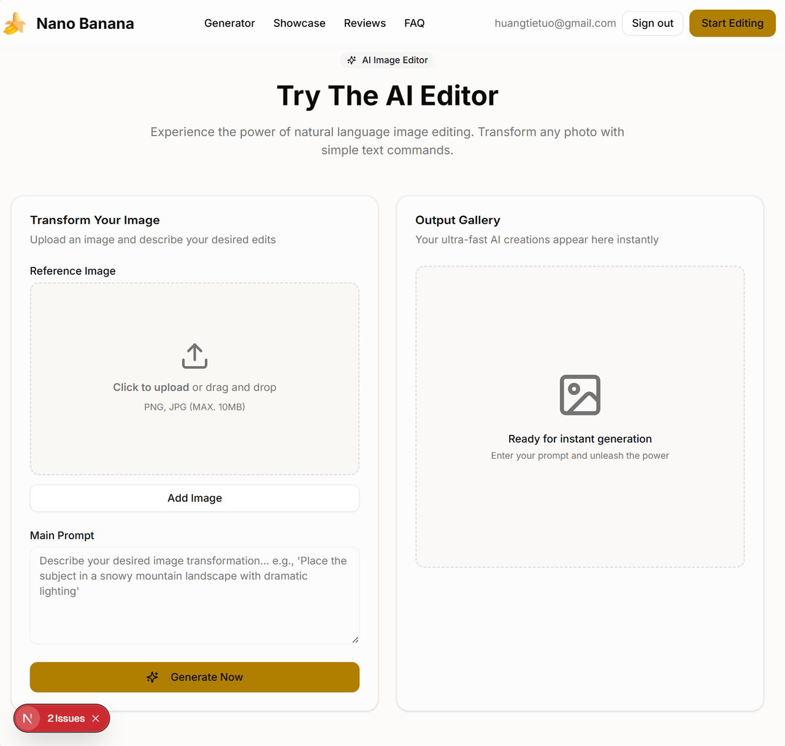
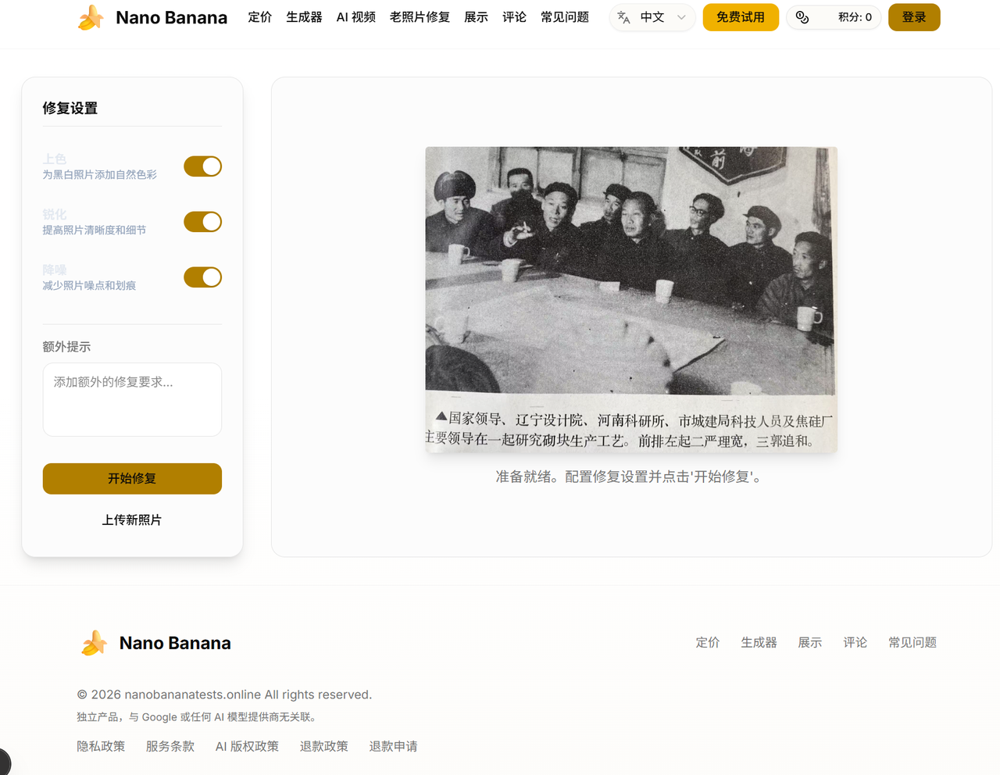

# В 48 лет водитель грузовика провёл несколько бессонных ночей и с помощью ИИ создал зарубежный сайт-сервис

🚚

**Рассказывает: Лао Хуан, водитель грузовика**

## 01 «Президент Югославии» решил сменить колею

«В этом году мне исполнилось 48 — мой год по гороскопу. В возрасте, когда я уже больше десяти лет всерьёз не садился за компьютер, взрывной взлёт DeepSeek во время праздника Весны 2025 года обрушился на меня, как глухой раскат грома».

Лао Хуан вырос в Цзяоцзо, городе четвёртого уровня. Он был из семьи заводских рабочих, а из-за детского прозвища его иногда в шутку называли «президентом Югославии». Сейчас же все просто зовут его Лао Хуан.

Он работает перевозчиком грузов для торговых автоматов. Внезапный взлёт DeepSeek заставил его кое-что осознать: «Поезд этой эпохи вот-вот отойдёт от перрона. Пьёшь ли ты кофе в офисной башне или жуёшь паровую булочку в кабине грузовика — волна ИИ всё равно тебя накроет. Если не догнать её лоб в лоб, останешься позади, в пыли».

Так этот полный аутсайдер решил учиться всерьёз. Он хотел выяснить, могут ли «руки, которые раньше только водили грузовик, постучаться в дверь программирования с ИИ».

## 02 От ручного труда к искусству режиссуры

В первые две недели обучения Лао Хуан постоянно сомневался в себе. «Я даже не знаю, как должен выглядеть код. Неужели я правда смогу?»

Но слова учителей и ассистентов придали ему уверенности: в эпоху программирования с ИИ ты больше не просто чернорабочий, переносящий код кирпич за кирпичом. Ты режиссёр. Создание программ больше не сводится к ручной укладке каждой детали. Если ты можешь чётко объяснить, чего хочешь, ИИ поможет тебе построить это шаг за шагом.

Именно так Лао Хуан вошёл в vibe coding.

- «Помоги мне сделать игру „Змейка“. Сделай её красивой и добавь кнопку старта!»
- «Сгенерируй динамическую карту, эффектно показывающую перевозку грузов из Китая в разные точки мира!»

И вот так, просто, появлялись приложения. Это ощущение было настолько странным и мощным, что глубоко его потрясло. Программирование превратилось из сухого ручного ремесла в своего рода искусство командования. Руки, полжизни державшие руль, теперь могли взяться и за руль цифрового мира.

## 03 Через сбои и упорство он заставил работать полный бизнес-цикл

«Слова стоят дёшево. Важен реальный бой».

Пятым заданием курса было выполнить серьёзный самостоятельный проект. Лао Хуан решил создать зарубежный сайт-сервис на основе ИИ. Он должен был работать, его должно было быть можно развернуть, и он должен был принимать платежи. В идеале — образовывать полный бизнес-цикл.

Поначалу воспроизведение прототипа сайта шло довольно гладко. Но как только он перешёл к ключевой функции — генерации изображений, — ошибки начали взрываться повсюду. Будучи полным новичком, он мог отлаживать всё, только разговаривая с ИИ и попутно восполняя пробелы в собственных базовых знаниях. Четыре-пять дней подряд он днём водил машину и развозил товары, а вечером возвращался домой и вступал в раунд за раундом сражения с ИИ: спрашивал, отлаживал, учился и повторял. В самый тяжёлый момент он всю ночь просидел перед экраном, уставившись в инструменты разработчика F12.

Он не раз думал сдаться. Но активные ответы на вопросы в учебной группе и профессиональные сессии обмена знаниями раз за разом возвращали его обратно. Позже он начал использовать бесплатную большую модель внутри отечественного инструмента для программирования Trae. Ошибок стало меньше, общение пошло более гладко, и Лао Хуан рванул вперёд одним махом, интегрировав генерацию изображений по тексту, генерацию видео по тексту и реставрацию старых фотографий.

Однако самым трудным была не ключевая функция ИИ. Это была настройка доменной почты, конфигурация входа через Google и подключение платёжных систем PayPal и Creem. Лао Хуан читал официальную документацию, задавал вопросы ИИ и сам занимался проектированием и настройкой. В итоге он самостоятельно реализовал интеграцию платежей с нуля.

Он сказал, что когда Nano Banana наконец заработал от начала и до конца, ему захотелось закричать: «Спроектировать и запустить сайт с реально работающим бизнес-циклом — это больше не то, что под силу только программистам из крупных компаний!»

## 04 Правила Лао Хуана по созданию с нуля

После долгого пути проб, ошибок и упорства Лао Хуан сформулировал несколько уроков, за которые заплатил дорогой ценой:

- **Правило кубиков**: не пытайся проглотить всё сразу. Меняй по одной маленькой функции за раз и переходи дальше только после того, как эта часть заработает.
- **Учись приводить примеры**: разговаривая с ИИ, не оставайся в абстракциях. Показывай ему конкретные примеры, сообщения об ошибках и тот эффект, которого хочешь добиться.
- **Учись, заимствуя**: не просто копируй и вставляй. Старайся понять, почему ИИ написал именно так.
- **Настрой своё мышление**: не паникуй, когда появляются ошибки. Они учат тебя, где находятся ловушки.

## 05 В этом поезде эпохи найдётся место каждому

Сейчас Лао Хуан всё тот же водитель грузовика, развозящий товары по Чжэнчжоу. Но в отличие от прежних времён, теперь у него есть вторая роль: разработчик приложений с ИИ. А совсем недавно он даже создал для своей компании мини-программу под названием **Школьная закусочная Су Бяньли**, которая значительно улучшила опыт покупок для учителей и учеников.

Как сказал сам Лао Хуан: «Пока у тебя есть желание решить проблему, код больше не преграда».

Его послание другим освежающе прямолинейно:

> Друзья, не бойтесь. Если хотите начать — никогда не поздно.  
> Руль в ваших собственных руках.
